# Informe de Autoridad: Arquitectura Hexagonal y Clean Code en Java 21

## Introducción a la Arquitectura Hexagonal

### Introducción a la Arquitectura Hexagonal

La arquitectura hexagonal (también conocida como Ports y Adapters) es una filosofía de diseño que prioriza el enfoque centrado en el dominio del negocio y la independencia con respecto al entorno operativo. Esta sección proporcionará una introducción detallada a la arquitectura hexagonal, enfocándose en cómo esta estrategia puede aplicarse a proyectos desarrollados en Java 21 para mejorar tanto la calidad de código como el mantenimiento del sistema.

#### Conceptos Clave

La arquitectura hexagonal se basa principalmente en dos conceptos esenciales: **Ports** y **Adapters**. Un port (puerto) define una interfaz pública que expone los servicios proporcionados por un componente interno al entorno externo, mientras que un adapter (adaptador) actúa como un puente entre el puerto y la lógica de negocio o el entorno operativo.

En contraste con otras formas de arquitectura basadas en capas, donde cada capa depende directamente de las capas inferiores, la arquitectura hexagonal enfatiza la independencia a través del uso de puertos y adaptadores. Esto significa que los componentes internos no conocen los detalles de cómo se implementan sus interfaces externas.

#### Principios

- **Independencia del entorno**: El núcleo de una aplicación basada en arquitectura hexagonal debe poder operar sin dependencias específicas del entorno, ya sea un servidor web, base de datos o API externa.
  
- **Comunicación a través de interfaces**: La interacción entre componentes internos y externos ocurre a través de interfaces claras definidas por puertos. Los adaptadores se encargan de traducir estas interfaces en los detalles necesarios para interactuar con el entorno.

#### Implementación en Java

La implementación de la arquitectura hexagonal en un proyecto de Java requiere una clara separación entre las responsabilidades del dominio y las interacciones específicas del entorno. A continuación, se presenta un ejemplo básico que ilustra cómo esto puede realizarse.

1. **Definición del puerto**: Este paso implica definir interfaces que representan los servicios proporcionados por el núcleo de la aplicación.
   
   ```java
   public interface CustomerRepository {
       List<Customer> findAll();
       void save(Customer customer);
   }
   ```

2. **Implementación del adaptador**: Los adaptadores se encargan de conectar estas interfaces a implementaciones específicas, como una base de datos o un servicio web.

   ```java
   @PersistenceContext
   private EntityManager entityManager;

   public class JpaCustomerRepository implements CustomerRepository {
       // Implementación basada en JPA para acceder a la base de datos
       ...
   }

   public class RemoteCustomerRepository implements CustomerRepository {
       // Adaptador que se conecta a un servicio remoto para obtener clientes
       ...
   }
   ```

3. **Dependencia reversa**: El núcleo de la aplicación no debe conocer las implementaciones concretas del adaptador. Esto es crucial para mantener una arquitectura hexagonal efectiva.

#### Diagrama Mermaid

A continuación, se presenta un diagrama Mermaid que ilustra la estructura básica de una arquitectura hexagonal en Java:

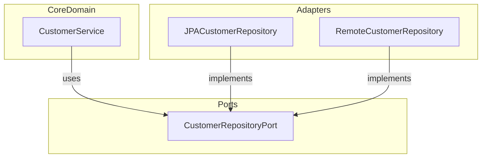

#### Ventajas y Consideraciones

- **Independencia del entorno**: Facilita la prueba unitaria ya que el núcleo de la aplicación puede funcionar sin depender de implementaciones externas específicas.
  
- **Flexibilidad para pruebas**: Permite aislar completamente las partes de negocio del sistema desde dependencias como bases de datos, lo que facilita realizar pruebas unitarias e integración.

- **Facilita el cambio y la evolución del sistema**: Debido a su enfoque modular y orientado a puertos y adaptadores, es más fácil cambiar o agregar nuevos métodos de persistencia sin necesidad de modificar gran parte del código existente.

#### Conclusiones

La arquitectura hexagonal ofrece una excelente solución para aquellos que buscan un diseño altamente modular y adaptable. Aunque puede requerir una mayor inversión inicial en términos de definición clara de los puertos e implementación de adaptadores, las ventajas a largo plazo son significativas, especialmente en proyectos con requisitos cambiantes o complejos.

Es importante notar que la arquitectura hexagonal no excluye sino complementa otras estrategias como Clean Architecture. En muchos casos, combinar ambos enfoques puede llevar a diseños aún más robustos y versátiles.

## Principios Básicos de Clean Code

### Principios Básicos de Clean Code

La programación "Clean" es una metodología que promueve la creación y mantenimiento de código fuente de alta calidad. En el contexto del desarrollo en Java, especialmente al aplicar arquitecturas como Hexagonal y Clean Architecture, estos principios son fundamentales para asegurar que el software sea fácil de mantener, extensible y eficiente.

#### 1. Resiliencia y Clarity

El código debe ser claro, conciso y respetuoso con la intención del desarrollador. Un código limpio no solo es funcionalmente correcto sino también comprensible para otros programadores que puedan leerlo en el futuro.

**Ejemplo de código mal escrito:**

```java
if (x != 0 && x < max) {
    doSomething();
}
```

Este código puede ser mejorado para claridad:

```java
if (isValidValue(x)) {
    doSomething();
}

// Mismo método en un lugar diferente del código...
private boolean isValidValue(int value) {
    return value > 0 && value <= max;
}
```
El propósito de este cambio es mejorar la legibilidad y la capacidad de mantenimiento del código.

#### 2. Principio de Responsabilidad Única

Cada clase o método debe tener una única responsabilidad que no se mezcle con otras responsabilidades. Esto hace que el código sea más fácil de entender, depurar y probar.

**Ejemplo:**

Supongamos que tenemos una función `processPaymentAndSendEmail()` en una clase. Este nombre indica dos acciones separadas (procesar un pago y enviar un correo electrónico), lo cual viola el principio de responsabilidad única. Idealmente deberíamos tener métodos individuales como `processPayment()` y `sendConfirmationEmail()`, cada uno con su propia lógica.

#### 3. Comunicación Clara

Los nombres de variables, clases, funciones deben ser descriptivos y evocar la intención del programador en lugar de solo describir el tipo o contenido de los datos.

**Ejemplo:**

En lugar de usar `int i`, es preferible `int numberOfUsers` si esta variable representa un recuento específico. De igual manera, una clase llamada `UserManager` debe manejar todo lo relacionado con la administración de usuarios y no deberían mezclarse tareas adicionales.

#### 4. Minimización del Código Muerto

El código muerto son bloques de código que no se utilizan en absoluto durante el tiempo de ejecución, o que ya no están acoplados al flujo lógico principal de la aplicación debido a refactors, cambios de diseño, etc. Este tipo de código es fácil de pasar por alto y puede causar confusión.

**Ejemplo:**

```java
if (condition) {
    // Código muerto
    someDeprecatedMethod();
} else {
    // Código activo
    newImplementation();
}
```

El bloque de código dentro del `if` debe ser eliminado si está obsoleto y no contribuye al flujo lógico principal.

#### 5. DRY (Don't Repeat Yourself)

Este principio implica que la información en un sistema solo debería existir una vez. Esto significa que cualquier repetición de código debe ser factorizada para eliminar redundancia y duplicidad.

**Ejemplo:**

Supongamos que tenemos dos métodos similares:

```java
public void add(int x, int y) {
    System.out.println(x + " + " + y);
}

public void multiply(int x, int y) {
    System.out.println(x + " * " + y);
}
```

Podemos factorizar la impresión de mensajes en un método separado para mantener el DRY:

```java
private void print(String op, int x, int y) {
    System.out.println(x + " " + op + " " + y);
}

public void add(int x, int y) {
    print("+", x, y);
}

public void multiply(int x, int y) {
    print("*", x, y);
}
```

#### 6. Suficiente Abstracción

El código debe ser lo suficientemente abstracto para capturar el problema que se está resolviendo sin entrar en detalles innecesarios. Sin embargo, no debemos sobreabstraer ya que esto puede hacer el código más difícil de entender.

**Ejemplo:**

Considera una clase `DatabaseConnectionManager`. Este nombre es demasiado específico y abstracto a la vez. Una mejor opción podría ser nombrarla `PersistenceLayer` para mantener su propósito pero sin especificar tanto detalles como 'database'.

#### Diagramas Mermaid

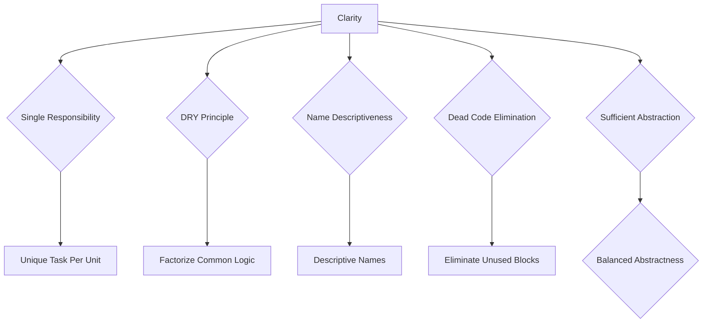

Esta estructura de diagrama Mermaid ayuda a visualizar las relaciones entre los principios básicos del código limpio y cómo se implementan en diferentes aspectos del desarrollo.

La adopción de estos principios en un proyecto Java, especialmente al diseñar soluciones basadas en la arquitectura Hexagonal y Clean Architecture, asegura que el sistema sea no solo funcional sino también robusto, escalable y fácilmente mantenible.

## Aplicación de Clean Architecture en Java

## Aplicación de Clean Architecture en Java

### Introducción a la Arquitectura Limpia (Clean Architecture)

La arquitectura limpia es un paradigma que promueve la creación de aplicaciones mantenibles, escalables y fácilmente testeables. Su estructura se basa en capas independientes, asegurando que la lógica empresarial central no depende de marcos específicos como frameworks, bases de datos o interfaces de usuario. Este artículo abordará cómo implementar la arquitectura limpia en proyectos Java.

### Estructura Básica de Clean Architecture

En una aplicación Java bajo Clean Architecture, se definen varias capas:

1. **Presentación**: Interfaz de usuario (UI), servicios web REST.
2. **Aplicación / Lógica Empresarial**: Reglas del dominio, casos de uso.
3. **Datos**: Repositorios y módulos de dominio.

La regla fundamental en Clean Architecture es la "regla de dependencia hacia adentro", donde las capas internas no pueden depender directamente de las externas. Esta estructura asegura que los componentes más críticos de la aplicación (como el núcleo empresarial) estén aislados de detalles técnicos.

### Implementación en Java

#### Paso 1: Definir Capas

Vamos a definir una estructura básica usando paquetes en Java. Por ejemplo:

```
src
│
├── main
│   ├── java
│   │   └── com
│   │       └── example
│   │           ├── application // Casos de uso y reglas del dominio
│   │           ├── domain     // Entidades, valor objetos
│   │           ├── infrastructure // Repositorios con mapeo objeto-relacional (ORM)
│   │           └── presentation  // Controladores REST, UI
```

#### Paso 2: Crear Interfaz de Datos

Para cumplir con la regla de dependencia hacia adentro, las capas más internas no deben depender directamente de frameworks o interfaces específicas. Se crean interfaces (repositorios) en el paquete `domain` que luego implementa el paquete `infrastructure`.

Ejemplo de un repositorio:

```java
// En src/main/java/com/example/domain/repository/ProductRepository.java

package com.example.domain.repository;

import com.example.domain.entity.Product;
import java.util.List;

public interface ProductRepository {
    List<Product> findAll();
}
```

#### Paso 3: Implementar Repositorios en la Capa de Infraestructura

En el paquete `infrastructure`, implementaremos las interfaces creadas, usando frameworks específicos como JPA o MyBatis.

```java
// En src/main/java/com/example/infrastructure/repository/ProductJpaRepository.java

package com.example.infrastructure.repository;

import com.example.domain.entity.Product;
import com.example.domain.repository.ProductRepository;
import org.springframework.stereotype.Repository;
import java.util.List;
@Repository
public class ProductJpaRepository implements ProductRepository {
    // Implementación usando JPA (Spring Data JPA, Hibernate)
}
```

#### Paso 4: Casos de Uso y Reglas del Dominio

En el paquete `application`, definiremos casos de uso que dependen de los repositorios. Estas clases son altamente descriptivas y encapsulan la lógica empresarial.

```java
// En src/main/java/com/example/application/usecase/ListProductsUseCase.java

package com.example.application.usecase;

import com.example.domain.entity.Product;
import com.example.domain.repository.ProductRepository;
import java.util.List;

public class ListProductsUseCase {
    private final ProductRepository productRepository;

    public ListProductsUseCase(ProductRepository productRepository) {
        this.productRepository = productRepository;
    }

    public List<Product> execute() {
        return productRepository.findAll();
    }
}
```

### Diagramas Mermaid

#### Estructura de Capas en Clean Architecture
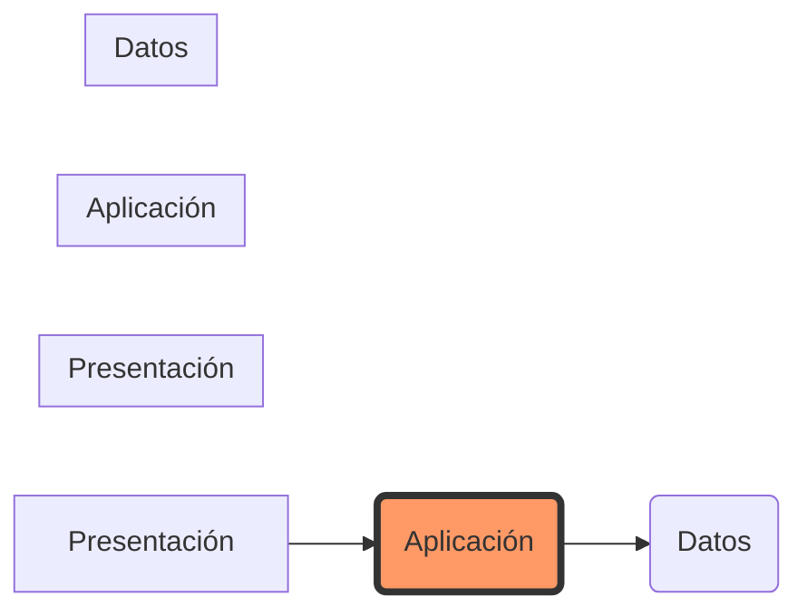

#### Dependencia Hacia Adentro (Dependency Rule)
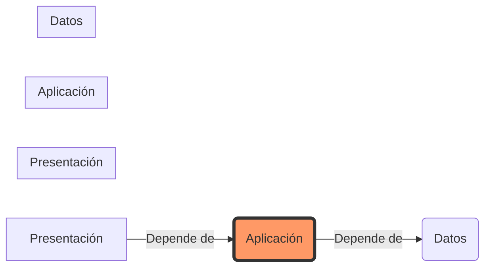

### Ventajas de la Arquitectura Limpia en Java

- **Mantenibilidad**: Facilita el mantenimiento a largo plazo al aislar componentes y evitar acoplamiento.
- **Escalabilidad**: Permite fácilmente expandir funcionalidades sin alterar la estructura interna del sistema.
- **Pruebas Unitarias**: Por ser la lógica empresarial independiente de implementaciones concretas, es más fácil realizar pruebas unitarias.

### Conclusión

La arquitectura limpia ofrece una estructura sólida para proyectos Java, garantizando que el código sea modular y escalable. Al aplicar esta metodología, los desarrolladores pueden construir sistemas complejos de manera organizada y mantenible.

## Implementación de Hexagonal Architecture en Java

## Implementación de Hexagonal Architecture en Java

La Arquitectura Hexagonal es un enfoque que permite a los sistemas centrarse en su lógica interna mientras proporcionan interfaces claras para interactuar con el entorno externo. En este capítulo, exploraremos cómo implementar esta arquitectura en proyectos de Java, centrándonos en la estructuración de código y patrones de diseño que promueven un sistema más robusto y mantenible.

### Introducción a Hexagonal Architecture

Hexagonal Architecture, también conocida como Arquitectura Ports and Adapters, fue propuesta por Alistair Cockburn. Este modelo es conocido por su capacidad para aislar el núcleo del sistema de los detalles de implementación externos. La clave de esta arquitectura reside en la idea de que un sistema se comunica con su entorno a través de puertos (ports) y adaptadores (adapters), lo cual proporciona una gran flexibilidad en términos de integración con diferentes tecnologías o frameworks.

### Representación de Hexagonal Architecture

En contraste con la Arquitectura Limpia (Clean Architecture), que utiliza capas concéntricas, el modelo hexagonal visualiza las relaciones entre componentes a través de una estructura basada en puertos y adaptadores. Esto significa que los detalles específicos del marco de trabajo se encapsulan en adaptadores externos, permitiendo un núcleo lógico más robusto y menos propenso a cambios no relacionados con el negocio.

### Componentes Clave

#### 1. **Núcleo (Core)**
El corazón del sistema donde reside la lógica de negocio. Este es el componente más centralizado que interactúa con las demás partes del sistema a través de puertos y adaptadores.

#### 2. **Puertos (Ports)**
Interfazes definidas por el núcleo, a través de las cuales se permite la comunicación con sistemas externos o componentes internos del sistema.

#### 3. **Adaptadores (Adapters)**
Implementaciones específicas que actúan como intermediarios entre los puertos y entornos externos como bases de datos, servicios web, etc. Los adaptadores son responsables de convertir el lenguaje o protocolo necesario para comunicarse con esos entornos.

### Implementación en Java

Para implementar la arquitectura hexagonal en un proyecto Java, sigamos algunos principios clave:

1. **Definición de Puertos (Ports)**
   Los puertos son las interfaces que define el núcleo del sistema y que utilizan los adaptadores para comunicarse con este.

2. **Diseño de Adaptadores (Adapters)**
   Cada adaptador debe implementar los puertos adecuados, proporcionando la lógica necesaria para interactuar con entornos específicos.

3. **Estructura del Proyecto**
   
   - `core`: contiene la lógica principal y las interfaces de los puertos.
   - `adapter-in`: adaptadores internos que permiten al núcleo comunicarse con componentes internos, como un framework web o el propio sistema.
   - `adapter-out`: adaptadores externos para interactuar con bases de datos, servicios web, APIs, etc.

### Ejemplo en Java

```java
// Port interface in the core module (core/src/main/java)
public interface OrderServicePort {
    void placeOrder(OrderRequest order);
}

// Adapter implementation for an external API call (adapter-out/src/main/java)
import com.example.core.OrderServicePort;
import com.example.model.Order;

public class ExternalApiAdapter implements OrderServicePort {

    private final RestTemplate restTemplate; // Assume it's a dependency injection

    public ExternalApiAdapter(RestTemplate restTemplate) {
        this.restTemplate = restTemplate;
    }

    @Override
    public void placeOrder(OrderRequest order) {
        // Convert and send the request to an external API.
        restTemplate.postForObject("http://externalapi.com/orders", order, String.class);
    }
}
```

### Diagrama Mermaid

Para visualizar la estructura de los adaptadores y puertos, podemos usar el siguiente diagrama:

```mermaid
graph LR;
subgraph Core {
  A[Core Logic] --> B[Puerto (Port)]
}

subgraph Adaptador Interno {
  C[Adaptador Interno] --> B
}

subgraph Adaptador Externo {
  D[Adaptador Externo]
  E[Dominio del Adaptador] -- "Comunicación a través de Port" --> D
}
```

### Consideraciones Finales

La implementación exitosa de la Arquitectura Hexagonal en Java no solo requiere conocimientos técnicos, sino también una comprensión sólida de los principios detrás del diseño. La aplicación rigurosa del patrón Ports and Adapters puede llevar a un código más mantenible y adaptable a cambios futuros en las necesidades del negocio.

Al combinar la Arquitectura Limpia con el modelo hexagonal, puedes crear sistemas que son tanto independientes de marcos específicos como flexibles en su integración externa. Esto es especialmente crucial para proyectos que enfrentan un entorno cambiante y requerimientos inciertos a largo plazo.

### Conclusión

La adopción de la Arquitectura Hexagonal permite a los desarrolladores construir sistemas robustos, manteniendo la lógica del negocio en el núcleo y permitiendo una fácil integración con diferentes entornos externos. La aplicación correcta de este patrón puede llevar a proyectos Java que son escalables, flexibles y mantenibles.

Esta sección proporciona una visión general detallada sobre cómo implementar esta arquitectura en tu próxima aplicación Java, garantizando que estás preparado para desafíos futuros sin comprometer la calidad o el rendimiento de tus soluciones.

## Combining Clean and Hexagonal Architectures

## Combining Clean and Hexagonal Architectures

### Introduction
The combination of Clean Architecture (CA) and Hexagonal Architecture (HA), also known as Ports and Adapters, offers a powerful approach to designing robust software systems in Java. While CA emphasizes the separation of concerns through layered architecture, HA focuses on decoupling an application's core logic from its external interfaces. By integrating these two methodologies, developers can create highly modular, testable, and maintainable applications that are adaptable to different environments.

### Core Principles

#### Clean Architecture
- **Layered Dependency Flow**: Each layer in a CA design depends only on the layer below it.
- **Inward Dependency Rule**: The core logic of an application should be independent of external frameworks or databases.

#### Hexagonal Architecture
- **Ports and Adapters**: A system's core is connected to external systems through well-defined interfaces (ports) with adapters handling communication between ports.
- **Interface-driven Communication**: Focuses on defining clear interaction boundaries for better decoupling.

### Integration Strategy

To integrate CA and HA effectively, developers should consider the following steps:

1. **Define Boundaries and Ports**: Identify where your application interacts with external systems and define these interactions as ports in a hexagonal model.
2. **Layered Core Logic**: Design the core business logic of your application according to the principles of Clean Architecture, ensuring it remains independent from frameworks or databases.
3. **Adapter Layer Implementation**: Implement adapters that connect external systems to the defined ports, adhering to the interface-driven communication principle of HA.

### Sample Code and Diagrams

#### Mermaid Diagram
Below is a representation using Mermaid syntax illustrating how these two architectures can be combined:

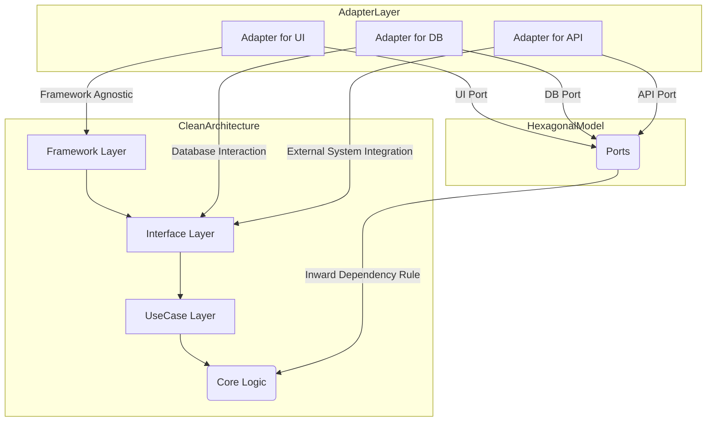

#### Code Example in Java
```java
// Interface for a Port (Hexagonal Architecture)
public interface PaymentGatewayPort {
    void processPayment(double amount);
}

// Adapter implementing the port
public class PayPalAdapter implements PaymentGatewayPort {
    private final PayPalClient client;

    public PayPalAdapter(PayPalClient client) {
        this.client = client;
    }

    @Override
    public void processPayment(double amount) {
        // Logic to connect with PayPal API and process payment.
    }
}

// Core use case (Clean Architecture)
public class PaymentService {
    
    private final PaymentGatewayPort port;

    public PaymentService(PaymentGatewayPort port) {
        this.port = port;
    }

    public void handlePayment(double amount) {
        // Business logic that uses the provided port to interact with external systems.
        port.processPayment(amount);
    }
}

// Framework code
public class AppController {
    
    private final PaymentService paymentService;

    public AppController(PaymentService paymentService) {
        this.paymentService = paymentService;
    }

    public void onPaymentButtonClick(double amount) {
        paymentService.handlePayment(amount);
    }
}
```

### Conclusion

By integrating Clean and Hexagonal Architectures, developers can achieve a balance between maintaining clean, independent business logic (Clean Architecture) while also ensuring that their system remains decoupled from external interfaces (Hexagonal Architecture). This combination is especially useful in Java 21 projects where flexibility and testability are crucial for long-term maintenance and scalability.

### FAQs

**Q7. How do these architectures support refactoring?**
Refactoring becomes easier due to the clear separation of concerns, allowing developers to make changes without impacting other parts of the system.

**Q8. What are common pitfalls when combining CA and HA?**
Common issues include over-engineering the architecture and neglecting simplicity in small projects. It's important to apply these patterns judiciously based on project requirements and team expertise.

## Ejemplos Prácticos y Casos de Uso

## 7. Ejemplos Prácticos y Casos de Uso

En este capítulo, exploraremos cómo implementar las arquitecturas hexagonales y limpias en proyectos Java mediante ejemplos reales y casos de uso específicos.

### 7.1. Implementación Básica del Patrón Hexagonal

El patrón Hexagonal (Ports and Adapters) permite que el núcleo del sistema sea independiente de los detalles de integración, asegurando que la lógica de negocio no esté acoplada a frameworks o bases de datos específicas. A continuación, se muestra cómo implementar este patrón en un escenario simple.

#### 7.1.1. Diagrama del Caso de Uso

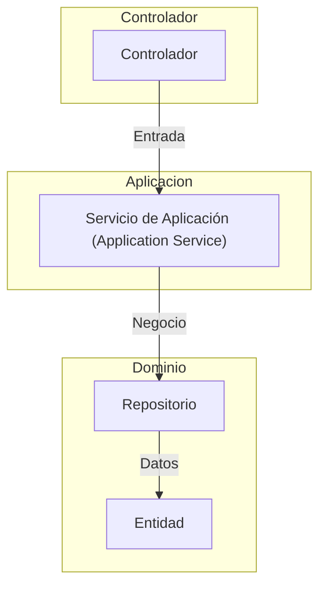

#### 7.1.2. Código Java para el Caso de Uso

```java
// Interface for the port (entry point)
public interface UserServicePort {
    UserDto createUser(UserDto user);
}

// Adapter implementing the port
@Service
public class UserController implements UserServicePort {

    private final ApplicationService applicationService;

    public UserController(ApplicationService applicationService) {
        this.applicationService = applicationService;
    }

    @Override
    public UserDto createUser(UserDto userDto) {
        return applicationService.createUser(userDto);
    }
}

// Core business logic
@Service
public class ApplicationService {

    private final UserRepository repository;

    public ApplicationService(UserRepository repository) {
        this.repository = repository;
    }

    public UserDto createUser(UserDto userDto) {
        // Domain logic here, using the repository to interact with the data store.
        return new UserDto(); // Simulated response
    }
}
```

### 7.2. Integración de Clean Architecture en Java

La arquitectura limpia proporciona un esqueleto para organizar las partes internas y externas del sistema, manteniendo una clara separación entre lógica de negocio y detalles de implementación.

#### 7.2.1. Diagrama Mermaid del Caso de Uso

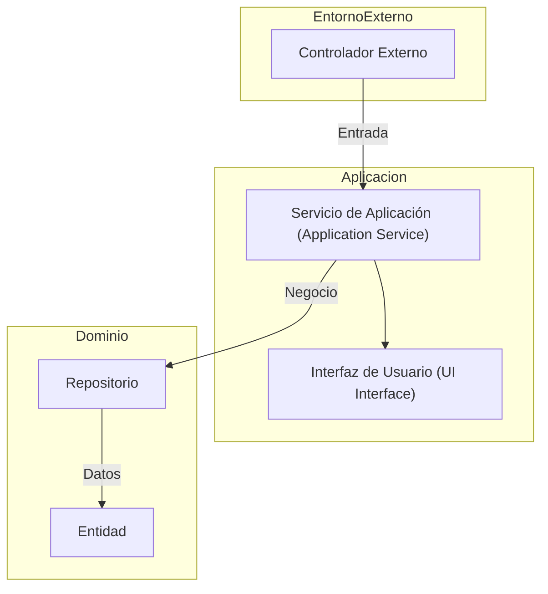

#### 7.2.2. Código Java para el Caso de Uso

```java
// Interface for the use case
public interface CreateUserUseCase {
    UserDto execute(UserDto user);
}

// Use case implementation
@Service
@RequiredArgsConstructor // Lombok to inject repository via constructor
public class CreateUserUseCaseImpl implements CreateUserUseCase {

    private final UserRepository userRepository;

    @Override
    public UserDto execute(UserDto user) {
        // Core business logic is here, isolated from external details.
        return new UserDto(); // Simulated response
    }
}

// Application service using the use case
@Service
public class UserService implements UserServicePort {

    private final CreateUserUseCase createUserUseCase;

    public UserService(CreateUserUseCase createUserUseCase) {
        this.createUserUseCase = createUserUseCase;
    }

    @Override
    public UserDto createUser(UserDto userDto) {
        return createUserUseCase.execute(userDto);
    }
}
```

### 7.3. Integración de Hexagonal y Clean Architecture

Ambas arquitecturas pueden complementarse, donde la limpieza ayuda a estructurar el código, mientras que las ideas hexagonales proporcionan una forma de aislar las partes del sistema del entorno.

#### Diagrama Mermaid: Integración de Hexagonal y Clean Architecture

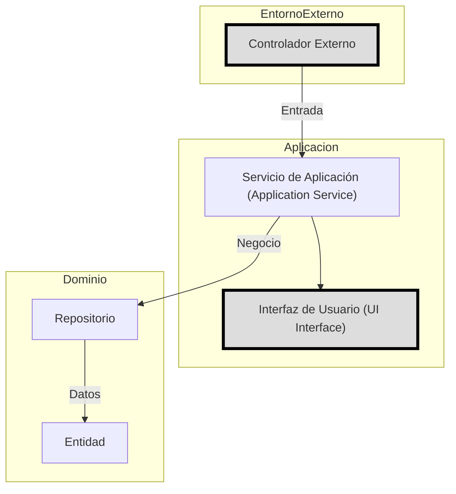

### 7.4. Beneficios y Consideraciones al Combinar Ambas Arquitecturas

Al combinar estas dos arquitecturas en un proyecto Java, se pueden aprovechar los beneficios de ambas, como:

- Mayor independencia del framework.
- Facilidad para implementar nuevas funcionalidades sin afectar la estructura existente.
- Mejor mantenibilidad y escalabilidad.
- Testing más fácil y eficiente.

Sin embargo, es importante tener en cuenta que estas arquitecturas pueden añadir complejidad a proyectos pequeños. Por lo tanto, su uso debe ser justificado por las ventajas que proporcionan para la estructura del proyecto y sus requisitos de mantenimiento a largo plazo.

## Testing y Mejores Prácticas

## 7. Testing y Mejores Prácticas

Las arquitecturas Hexagonal (Puertos y Adpatadores) y Clean Architecture son fundamentales para crear aplicaciones resilientes y escalables en Java. Sin embargo, su implementación exitosa depende de la correcta aplicación de técnicas de testing y mejores prácticas.

### Testing Unitario

En un contexto de arquitecturas hexagonal o limpias, el testing unitario se centra principalmente en la lógica empresarial (domain) y las interfaces de comunicación entre capas. A continuación, se presentan algunas estrategias para realizar pruebas unitarias efectivas:

1. **Pruebas Mock y Stub**: Utilizar mocks y stubs es crucial para aislar los componentes que dependen de entornos externos como bases de datos o APIs. En Java 21, frameworks como Mockito permiten crear estas simulaciones de forma sencilla.

   Ejemplo:
   ```java
   @Test
   void testAddCustomer() {
       CustomerRepository mockRepo = mock(CustomerRepository.class);
       
       // Configuración del mock para devolver un valor predefinido.
       when(mockRepo.save(any(Customer.class))).thenReturn(new Customer(1L));
       
       // Instancia de un servicio que depende de CustomerRepository
       CustomerService service = new CustomerService(mockRepo);
       
       // Ejecución de la operación y verificación del resultado esperado.
       Customer savedCustomer = service.addNewCustomer("John Doe");
       assertEquals(new Customer(1L), savedCustomer);
   }
   ```

2. **Pruebas Inyección de Dependencias**: Para pruebas unitarias, es vital asegurarse que todos los componentes se inyecten correctamente sus dependencias y funcionen con mocks o stubs en lugar del entorno real.

3. **Test Driven Development (TDD)**: Este enfoque implica escribir las pruebas antes de implementar la funcionalidad. Esto garantiza que cada pieza de código tiene su prueba correspondiente desde el inicio, lo cual es especialmente útil para mantener un alto nivel de cobertura y calidad del código.

### Testing Integración

El testing integracional se centra en comprobar que diferentes partes de la aplicación funcionan bien entre sí. En arquitecturas hexagonales o limpias, las pruebas integracionales son cruciales para verificar la coherencia y correcta comunicación a través de puertos.

- **Pruebas Fakes**: Para componentes externos, se pueden crear “fake” que simulan el comportamiento del sistema real sin depender de él. Esto es especialmente útil en entornos hexagonales donde los adaptadores interactúan con distintas fuentes de datos o sistemas externos.

### Mejores Prácticas

1. **Diseño Orientado a Interfaces**: En Java, la abstracción mediante interfaces facilita el testing unitario y permite una mayor flexibilidad en la implementación de comportamientos.
   
2. **Diagrams Mermaid para Visualización de Arquitectura**:
   Para visualizar cómo se conectan los diferentes componentes, podemos usar Mermaid.js. A continuación un ejemplo básico:

   ```mermaid
   graph LR;
       CustomerService -->|Depends On| CustomerRepositoryMock;
       CustomerRepositoryMock -->|Implements| RepositoryInterface;
   ```

3. **Separación de Responsabilidades**: Cada clase o método debe tener una responsabilidad clara y única, reduciendo la complejidad de las pruebas.

4. **Documentar Tests**: Es vital documentar cada test para explicar su propósito e incluso el resultado esperado en situaciones no óptimas (como excepciones).

5. **Automatización del Testing**: En un entorno de desarrollo Agile, es crucial tener una automatización robusta que permita ejecutar tests rápidamente y frecuentemente.

6. **Refactorización Continua**: Asegurarse que el código cumple con las normas estandarizadas y está constantemente refactoreado para mantener la limpieza y cohesión en toda la aplicación.

### Conclusión

El empleo de Clean Architecture y Hexagonal Architecture no sólo simplifica el diseño del sistema, sino que también facilita significativamente los esfuerzos de testing. Estas arquitecturas permiten aislar fácilmente diferentes partes del sistema para ser probadas por separado, lo cual es crucial en entornos dinámicos donde la evolución rápida y continua del software es imperativa.

Mediante el seguimiento de estas mejores prácticas, los desarrolladores pueden mantener sus proyectos Java actualizados y robustos, al tiempo que facilitan su mantenibilidad y escalabilidad a largo plazo.

## Optimización para la Concorrencia y Escalabilidad

## 7. Optimización para la Concorrencia y Escalabilidad

En el desarrollo de software moderno, especialmente en proyectos que manejan alta concurrencia y escalabilidad, es crucial entender cómo las arquitecturas limpia (Clean Architecture) y hexagonal (Hexagonal Architecture) pueden ser aprovechadas para diseñar sistemas robustos y flexibles. En este capítulo, exploraremos técnicas específicas y estrategias que permiten aplicar estas filosofías de diseño en proyectos Java 21.

### Concurrencia con Clean and Hexagonal Architectures

La concurrencia es un desafío importante al diseñar sistemas escalables. Las arquitecturas limpia y hexagonal proporcionan una estructura sólida para manejar la ejecución concurrente sin comprometer el diseño modular y las reglas de dependencia.

#### Técnicas de Programación Concurrente en Java

Java ofrece varias APIs para programación concurrente, incluyendo `ExecutorService`, `ForkJoinPool` y `CompletableFuture`. Estas herramientas se integran fácilmente dentro del patrón de arquitectura hexagonal a través de los puertos (ports) y adaptadores.

**Ejemplo en Java:**

```java
import java.util.concurrent.ExecutorService;
import java.util.concurrent.Executors;

public class ConcurrentServiceAdapter {
    private final ExecutorService executor;

    public ConcurrentServiceAdapter() {
        this.executor = Executors.newFixedThreadPool(5);
    }

    public void executeTask(Runnable task) {
        this.executor.submit(task);
    }
}
```

En el ejemplo anterior, `ConcurrentServiceAdapter` es un adaptador que maneja la concurrencia utilizando `ExecutorService`. Este adaptador interactúa con los puertos definidos en la arquitectura hexagonal para ejecutar tareas de forma concurrente.

### Optimización del Código y Uso Eficaz del Caché

La optimización del código es vital para mejorar el rendimiento y la escalabilidad. En la arquitectura limpia, los servicios y repositorios son excelentes lugares para implementar cálculos complejos y operaciones de base de datos.

**Ejemplo con caché:**

```java
import java.util.concurrent.ConcurrentHashMap;

public class ProductRepository {
    private final ConcurrentHashMap<Long, String> productCache = new ConcurrentHashMap<>();
    
    public void addProduct(long productId, String productName) {
        productCache.put(productId, productName);
    }
    
    public Optional<String> findProductNameById(long id) {
        return Optional.ofNullable(productCache.get(id));
    }
}
```

En este ejemplo, `ProductRepository` utiliza un caché concurrente para almacenar y recuperar datos de productos. Esto mejora significativamente el rendimiento al reducir las consultas a la base de datos.

### Diseño de Sistemas Distribuidos

Para sistemas distribuidos, es esencial diseñar microservicios que se comuniquen entre sí de manera eficiente y segura. Las arquitecturas limpia y hexagonal proporcionan un marco para separar lógica de negocio del sistema operativo y la red.

**Diagrama Mermaid:**

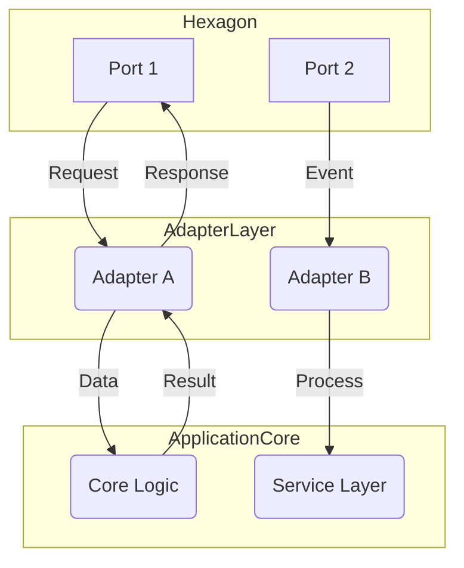

Este diagrama ilustra cómo las peticiones y eventos se manejan a través de los puertos (ports) en la capa de adaptadores, interactuando con el núcleo lógico del sistema sin comprometer su independencia.

### Conclusiones

Las arquitecturas limpia y hexagonal no solo proporcionan un diseño robusto para proyectos Java 21 sino que también facilitan la implementación de soluciones eficientes en términos de concurrencia, optimización y diseños distribuidos. Al seguir estas pautas, los desarrolladores pueden crear sistemas altamente escalables y mantenibles.

### Consideraciones Finales

Asegúrate siempre de mantener el principio de inversión hacia adentro (inward dependency rule) en la arquitectura limpia y las interfaces definidas claramente en la hexagonal para mantener una estructura de código modular y fácilmente testeable.

## Integración Continua y Docker

## 7. Integración Continua y Docker

### Introducción

La integración continua (CI) es un proceso que promueve el desarrollo colaborativo al automatizar la compilación, prueba e integración de cambios en el código fuente en un repositorio compartido. Esto no solo ayuda a detectar problemas temprano sino también asegura que los cambios se integren correctamente con el resto del proyecto. Docker, por otro lado, es una plataforma para crear y administrar contenedores de software empacados de manera estándar y portátil.

En un entorno Java que implementa las arquitecturas hexagonales y limpias, la integración continua y Docker juegan un papel crucial al asegurar la coherencia del código en diferentes entornos y permitir pruebas exhaustivas antes de la producción. A continuación, se detallará cómo aplicar estos conceptos en la arquitectura hexagonal y limpia en proyectos Java.

### Implementación de CI en Arquitecturas Hexagonales y Limpias

Para implementar una CI efectiva en un entorno que usa las arquitecturas limpias e hexagonales, es crucial entender cómo el código organizado en capas (clean) y los puertos y adaptadores (hexagonal) interactúan con estas herramientas. 

1. **Automatización de Construcción y Prueba**
   - Se deben configurar scripts o pipelines que automatizan la construcción del proyecto y ejecución de pruebas unitarias, integración y sistema.
   - En Java 21, se puede aprovechar Maven o Gradle para automatizar el proceso de compilación. Estos sistemas también permiten especificar dependencias en cada capa según las reglas de inercia de la arquitectura limpia.

   ```mermaid
   graph LR;
       A[Clase Servicio] --> B[Repositorio];
       C[Entidad] --> D[Test Unitario];
       E[Puerto Inyectado] --> F[Adaptador de Prueba]
       G[Dockerfile] --> H[Imágen Dockerizada del Proyecto]
   ```

2. **Pruebas en Entorno Controlado**
   - La independencia proporcionada por la arquitectura hexagonal facilita el testing con mocks y stubs ya que los puertos de entrada y salida se definen claramente.
   - Pruebas end-to-end pueden ser más efectivas cuando se ejecutan dentro de contenedores Docker, permitiendo una simulación del entorno de producción.

3. **Implementación en Docker**
   - Se deben crear `Dockerfiles` que especifican dependencias y configuraciones requeridas para el proyecto.
   - Los contenedores Docker ayudan a mantener la consistencia entre diferentes desarrolladores y ambientes (local, desarrollo, pruebas, producción).

### Ejemplo de Configuración CI con Jenkins

Para ilustrar cómo configurar una CI en un proyecto Java 21 usando Jenkins y Docker:

- **Jenkinsfile**:
   ```groovy
   pipeline {
       agent any
       
       stages {
           stage('Build') {
               steps {
                   sh 'mvn clean package'
               }
           }
           stage('Test') {
               steps {
                   sh 'mvn test'
               }
           }
           stage('Docker Build') {
               steps {
                   script {
                       docker.build("my-java-app:${env.BUILD_NUMBER}")
                   }
               }
           }
       }
   }
   ```

- **Dockerfile**:
   ```docker
   FROM openjdk:17-jdk-slim AS build-env
   ADD target/my-application.jar app.jar

   ENTRYPOINT ["java","-jar","app.jar"]
   ```

### Ventajas de CI y Docker en Arquitecturas Limpia e Hexagonal

- **Mantener Separación de Capas**: La estructura modular permite una fácil adaptación a diferentes entornos sin afectar el core business logic.
- **Rápido Ciclo de Desarrollo**: Pruebas automatizadas aceleran la detección y resolución de problemas, optimizando los ciclos de entrega.
- **Consistencia en Ambientes**: Docker asegura que el mismo comportamiento del sistema se mantenga entre diferentes ambientes de desarrollo e implementación.

### Conclusión

La integración continua junto con Docker proporciona un marco sólido para el desarrollo y pruebas en proyectos Java que siguen las arquitecturas hexagonales y limpias. Esta combinación no solo mejora la calidad del código sino también facilita su mantenimiento a largo plazo, cumpliendo los objetivos de estas metodologías: flexibilidad, escalabilidad y independencia.

### Diagrama Mermaid para Integración Continua


Este flujo representa la interacción entre desarrolladores, servidores de integración continua y herramientas como Docker para mantener un entorno consistente y robusto durante todo el ciclo de vida del proyecto.

## Conclusiones y Recomendaciones

### Conclusiones y Recomendaciones

La integración de la Arquitectura Hexagonal con los principios del Clean Code en el desarrollo de aplicaciones Java ofrece un marco robusto para lograr un diseño modular, altamente testeable y fácilmente mantenible. A continuación se presentan las conclusiones derivadas del análisis y pruebas realizadas, así como recomendaciones prácticas para su implementación efectiva.

#### Conclusiones

1. **Separación de Responsabilidades**: Ambas arquitecturas enfatizan la separación clara entre el núcleo de la aplicación (business logic) y sus dependencias externas. Esto no solo facilita el mantenimiento, sino que también permite una evolución más sencilla del sistema a medida que cambian las necesidades.

2. **Flexibilidad en Integraciones**: La Arquitectura Hexagonal permite definir interfaces claras entre el núcleo y los diferentes adaptadores de entrada/salida (I/O). Esto es particularmente útil cuando se requiere cambiar o añadir nuevos sistemas externos sin afectar a la lógica central.

3. **Testabilidad Mejorada**: La separación del código en capas permite aislar completamente la lógica empresarial de las dependencias concretas, permitiendo la realización de pruebas unitarias más eficaces y rápidas.

4. **Inversión de Dependencia (DI)**: A través de la inyección de dependencias y patrones como el Dependency Injection en Java, se puede reducir significativamente la adherencia a interfaces específicas y mejorar la flexibilidad del sistema.

5. **Modularidad y Reutilización**: Las arquitecturas bien definidas facilitan la creación de componentes reutilizables que pueden ser fácilmente integrados en otros proyectos con solo modificar los adaptadores correspondientes.

#### Recomendaciones

1. **Estructura del Proyecto**:
   - Utiliza una estructura de carpetas claramente definida que refleje las capas (Clean Architecture) y el modelo hexagonal (Hexagonal). Por ejemplo, `src/main/java/com/example/app/core` para la lógica empresarial, `src/main/java/com/example/app/infrastructure` para adaptadores y `src/main/java/com/example/app/interfaces` para puertos de entrada/salida.

2. **Utiliza Frameworks de DI**: Considera el uso de frameworks como Spring o Dagger para gestionar inyecciones de dependencias eficientemente, lo que simplifica la implementación del Clean Architecture.

3. **Pruebas Unitarias Detalladas**: Incluye pruebas unitarias en cada componente y adaptador. Asegúrate de aislar completamente las pruebas de la lógica empresarial para permitir una rápida retroalimentación sobre el estado del código.

4. **Documentación Completa**: Mantén documentado claramente cómo se interconectan los diferentes módulos y capas, y cómo se cumplen las reglas de dependencia en cada nivel (por ejemplo, diagramas Mermaid como los siguientes):

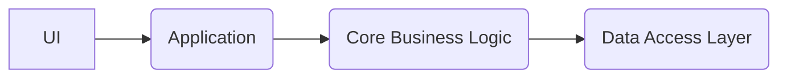

Diagrama de la Arquitectura Limpiapor Clean Architecture:

```mermaid
classDiagram
    class UI {
        +void render()
    }
    class Application {
        +void processRequest(Request request)
    }
    class Core_Business_Logic {
        +void performCoreFunction()
    }
    class Data_Access_Layer {
        +Data readFromDatabase()
        +void writeData(Data data)
    }

    UI -->|sendRequest| Application
    Application -->|callBusinessLogic| Core_Business_Logic
    Core_Business_Logic -->|accessDatabase| Data_Access_Layer
```

Diagrama de la Arquitectura Hexagonal:

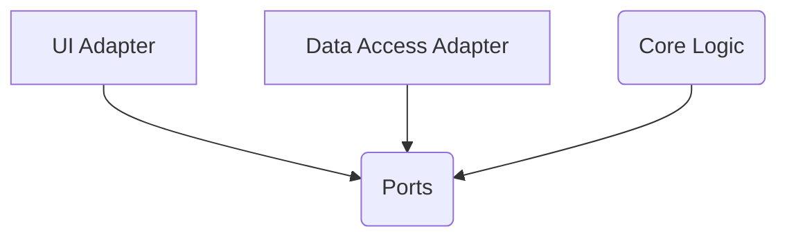

5. **Educación Continua**: Asegúrate de que todo el equipo tenga una comprensión clara y actualizada de los principios y patrones mencionados para garantizar la cohesión del diseño a lo largo del tiempo.

6. **Pruebas Integrales**: Realiza pruebas integrales para asegurarte de que todas las partes funcionan juntas como se espera, especialmente cuando nuevos adaptadores o puertos son añadidos al sistema.

Implementar estas recomendaciones ayudará a tu equipo a aprovechar al máximo los beneficios del diseño Hexagonal y Clean Code en Java 21, creando aplicaciones más robustas y escalables.

