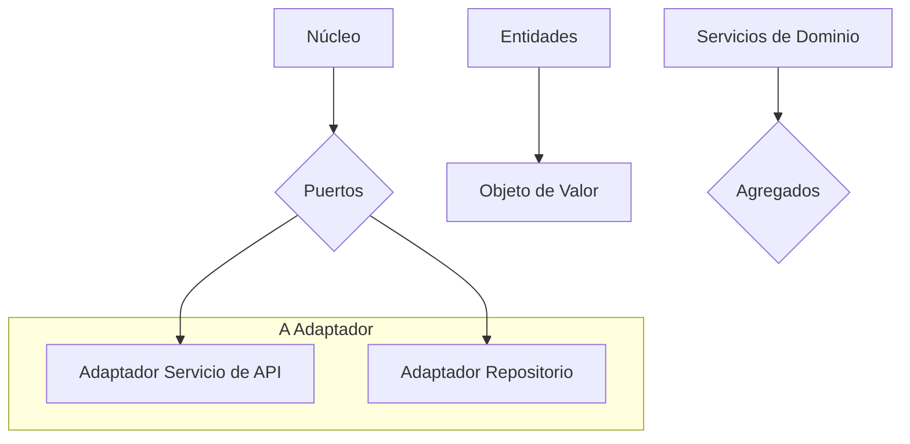
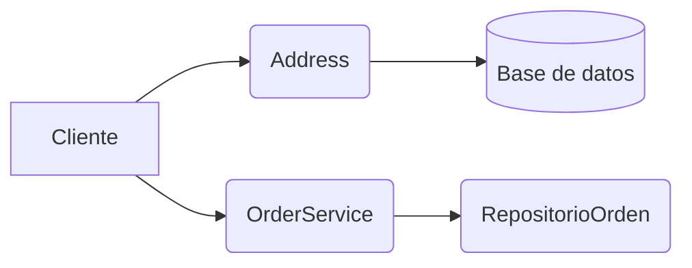
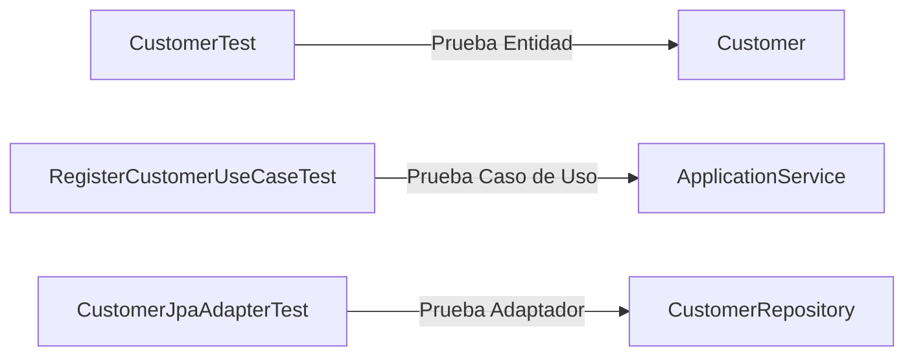
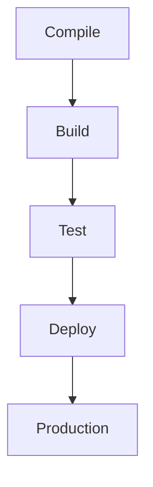
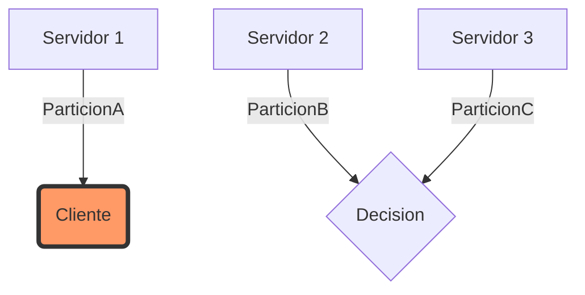
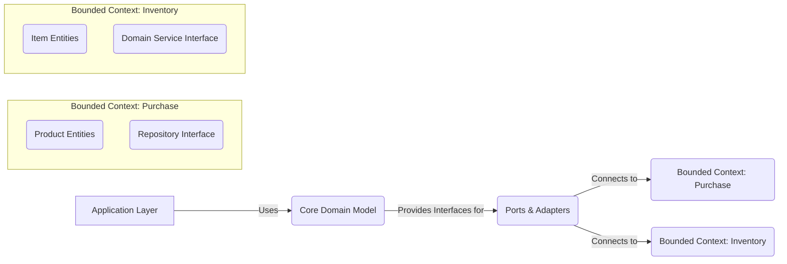
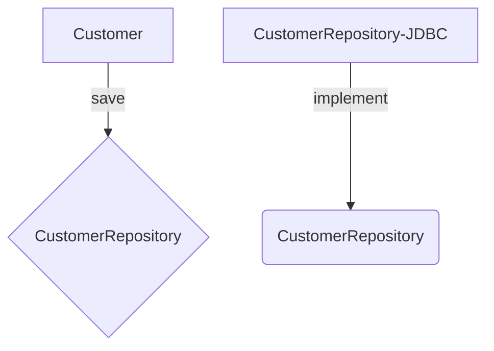
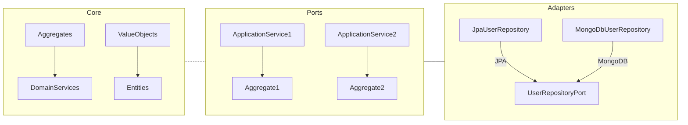
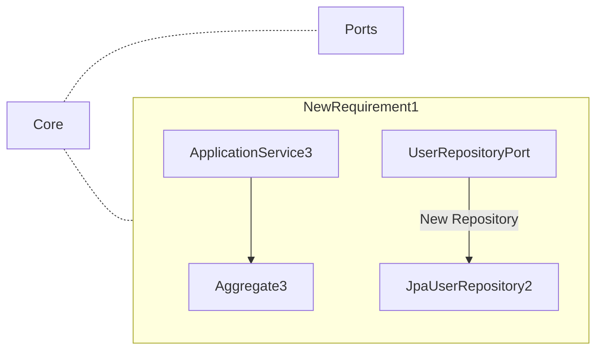

# Informe de Autoridad: Arquitectura Hexagonal y DDD con Java 21: Implementando Agregados y Value Objects

## Introducción a la Arquitectura Hexagonal

### Introducción a la Arquitectura Hexagonal

La arquitectura hexagonal, también conocida como puertos y adaptadores o port-adapters architecture, es una técnica de diseño que permite crear aplicaciones software independientes del entorno en el que se ejecutan. Esta metodología fue propuesta por Alistair Cockburn para separar los aspectos técnicos del modelo de dominio, permitiendo así a la lógica empresarial o de negocios concentrarse en lo que realmente importa: las reglas y dinámicas del negocio sin preocuparse por cómo se interactúa con el mundo exterior.

#### Principios Básicos

La arquitectura hexagonal gira en torno al concepto central de aislar la lógica de dominio del resto del sistema. El núcleo de la aplicación contiene toda la lógica empresarial, mientras que las interfaces (puertos) y sus implementaciones correspondientes (adaptadores) se encargan de gestionar la interacción con el entorno externo.

1. **Núcleo**:
   - Este es el corazón del sistema, donde reside toda la lógica de dominio.
   - Contiene los objetos de valor (Value Objects), las entidades (Entities), y los servicios de dominio (Domain Services).

2. **Puertos**:
   - Son interfaces o clases abstractas que definen cómo se interactúa con el núcleo del sistema desde el exterior.
   - Ejemplos: APIs, bases de datos, sistemas externos.

3. **Adaptadores**:
   - Implementan los puertos y proporcionan una capa de abstracción entre las interfaces y la implementación específica de servicios como bases de datos o APIs.

#### Compatibilidad con Domain-Driven Design (DDD)

La arquitectura hexagonal se presta a ser aplicada en conjunto con el DDD debido a su estructura modular y encapsulamiento. En este contexto, los puertos se utilizan para definir casos de uso y políticas que interactúan con el modelo del dominio sin contaminarlo.

- **Entidades**: Representan un objeto único dentro del dominio.
- **Objetos de Valor (Value Objects)**: Contienen información que no tiene sentido existir por sí mismo pero que aporta contexto al negocio.
- **Agregados**: Grupos de entidades y objetos de valor que mantienen la consistencia lógica como una unidad.
- **Servicios de Dominio**: Lógica compleja o rutinas de negocio que no encajan fácilmente dentro de los límites de una entidad.

#### Beneficios

1. **Independencia del Contexto**:
   - El modelo del dominio está protegido y no se ve afectado por cambios en el entorno externo.
   
2. **Facilidad para Probar**:
   - Los componentes internos pueden probarse de manera aislada, permitiendo un desarrollo ágil.

3. **Flexibilidad y Evolución del Sistema**:
   - Fácil reemplazo de adaptadores sin alterar el núcleo del sistema.

#### Diagrama

A continuación se muestra una representación visual simplificada del diseño hexagonal utilizando Mermaid:



#### Ejemplo Técnico: Implementación en Java 21

```java
// Definición del puerto para un caso de uso específico (e.g., CrearUsuario)
public interface UsuarioAPort {
    void crear(Usuario usuario);
}

// Implementación del adaptador que utiliza una API externa
public class ApiUsuarioAdapter implements UsuarioAPort {
    private final RestTemplate restTemplate;

    public ApiUsuarioAdapter(RestTemplate restTemplate) {
        this.restTemplate = restTemplate;
    }

    @Override
    public void crear(Usuario usuario) {
        // Lógica para llamar a la API de creación de usuarios
        // Ejemplo: restTemplate.postForObject("http://api.example.com/usuarios", usuario, Object.class);
    }
}

// Implementación del adaptador que utiliza un repositorio en memoria (ejemplo)
public class RepositorioUsuarioAdapter implements UsuarioAPort {
    private final Map<Long, Usuario> almacenamiento = new HashMap<>();

    @Override
    public void crear(Usuario usuario) {
        // Lógica para persistir el usuario en el repositorio en memoria
    }
}
```

Este ejemplo muestra cómo se puede implementar un adaptador que interactúa con una API externa y otro que utiliza un repositorio en memoria, ambos utilizando la misma interfaz (puerto).

### Conclusión

La arquitectura hexagonal provee una estructura sólida para encapsular los aspectos técnicos de la lógica empresarial, permitiendo así un desarrollo más ágil, fácilmente testable y adaptable a cambios en el entorno operativo. En conjunto con DDD, ofrece un marco completo para manejar dominios complejos de manera eficiente.

Este enfoque es especialmente útil para proyectos grandes y largos que requieren alta coherencia lógica y mantenibilidad a largo plazo.

## Dominio-Driven Design (DDD) Fundamentos

### Dominio-Driven Design (DDD) Fundamentos

El enfoque de Diseño Orientado al Dominio, o Domain-Driven Design (DDD), es un paradigma que se centra en comprender y modelar complejos problemas del mundo real a través del lenguaje natural del dominio. Este paradigma proporciona una serie de patrones y técnicas para mejorar la comunicación entre los desarrolladores y los expertos del negocio, así como para facilitar el desarrollo de aplicaciones altamente coherentes con las necesidades del negocio.

#### Conceptos Clave de DDD

1. **Lenguaje Ubicuo (Ubiquitous Language)**: Es un lenguaje comúnmente compartido entre desarrolladores y expertos en dominio que evita malentendidos y permite la construcción de una modelización precisa de los requisitos del negocio.

2. **Contextos Delimitados (Bounded Contexts)**: Este concepto ayuda a dividir un gran problema o sistema complejo en subdominios manejables, garantizando así que dentro de cada contexto las reglas y lógica son consistentes y claras. La integración entre estos contextos se maneja con cuidado para no comprometer la integridad del modelo.

3. **Entidades (Entities)**: Son objetos identificables que tienen un ciclo de vida que persiste a lo largo del tiempo e independientemente del usuario. En DDD, las entidades contienen lógica de negocio compleja y son cruciales para mantener la coherencia en el modelo.

4. **Value Objects (Valores)**: Representan conceptos que no tienen identidad única ni persistencia propia; cambian de entidad a entidad sin perder su significado. Por ejemplo, una dirección postal es un Value Object porque es relevante dentro del contexto de una Entidad pero tiene poco valor fuera de este.

5. **Agregados (Aggregates)**: Un agregado agrupa Entidades y Value Objects en un dominio concreto bajo la responsabilidad de una raíz única para garantizar coherencia de datos a nivel lógico.

6. **Servicios de Dominio (Domain Services)**: Contienen la lógica de negocio que no pertenece ni a una Entidad ni a un Value Object. Estos servicios suelen ser más abstractos y operan en varios agregados o en conceptos globales del dominio.

7. **Repositorios (Repositories)**: Son interfaces para acceder al persistente estado de los agregados y las entidades del dominio sin comprometer el modelo lógico del negocio.

#### Implementación Técnica

En la práctica, DDD no implica una serie de reglas rígidas. Más bien, es un conjunto de prácticas recomendadas y conceptos que ayudan a los equipos de desarrollo a crear software más robusto y coherente con el dominio específico en cuestión.

Aquí hay un ejemplo simple de cómo podrían verse estos patrones implementados en Java 21:

```java
// Valor Object para una dirección postal
public class Address {
    private String street;
    private int number;

    public Address(String street, int number) {
        this.street = street;
        Objects.requireNonNull(this.number);
    }

    // Getters y setters omitidos por brevedad

}

// Entidad de Cliente (Entity)
public class Customer implements Entity<String> {
    private String id;
    private List<Address> addresses;

    public Customer(String id, Address address) {
        this.id = id;
        Objects.requireNonNull(address);
        this.addresses.add(address);
    }

    // Otros métodos relacionados con el negocio del cliente
}

// Servicio de dominio para gestionar órdenes (Domain Service)
public class OrderService {
    public void placeOrder(Customer customer, List<Product> products) {
        // Lógica compleja para colocar un pedido en base a las reglas del negocio
    }
}
```

#### Diagramas Mermaid


Este diagrama ilustra cómo un objeto `Customer` (Entidad) puede contener varios objetos `Address` (Valores), y cómo el servicio del dominio `OrderService` puede interactuar con estos para realizar una operación como poner un pedido.

#### Integración con Arquitectura Hexagonal

La arquitectura hexagonal facilita la integración de DDD al aislar completamente el núcleo o el dominio del resto del sistema. Esto permite que los componentes del dominio no dependan de ninguna tecnología específica, lo cual es un principio fundamental en ambos paradigmas.

En conclusión, DDD ofrece una estructura sólida para modelar complejos problemas y necesidades de negocio en la forma más natural posible. Integrado con la arquitectura hexagonal, este enfoque puede ayudar a los equipos de desarrollo a crear software que es tanto fácil de comprender como adaptable y escalable en el largo plazo.

## Implementación de Agregados en Java 21

### Implementación de Agregados en Java 21 para Arquitectura Hexagonal y DDD

En el contexto del diseño basado en Arquitectura Hexagonal con Domain-Driven Design (DDD), los agregados juegan un papel crucial en la encapsulación de lógica de negocio compleja. Los agregados permiten aislar transacciones consistentes y asegurar la integridad referencial dentro del dominio, lo que es fundamental para sistemas empresariales sofisticados. En este artículo, exploraremos cómo implementar los agregados en Java 21 bajo esta arquitectura.

#### Definición de Agregados

En DDD, un **agregado** es una colección de objetos (entidades y objetos valor) que son lógicamente consistentes con respecto a las transacciones del sistema. El concepto de agregado asegura la coherencia transaccional en entornos distribuidos y ofrece una forma natural de aislar partes del dominio.

#### Implementación en Java 21

Para implementar los agregados en un diseño hexagonal, primero debemos definir las interfaces que describen los casos de uso (ports) y luego sus implementaciones correspondientes (adapters). A continuación se muestra cómo podríamos estructurar la implementación:

```java
// Dominio (Domain)
public interface AggregateRoot<T> {
    T getId();
    void validate();
}

// Entidades del dominio
public class Order implements AggregateRoot<OrderId> {
    
    private final OrderId id;
    private List<Item> items = new ArrayList<>();
    
    public Order(OrderId id) {
        this.id = id;
    }
    
    // Métodos de agregado
    public void addItem(Item item) {
        validate();
        items.add(item);
    }

    @Override
    public OrderId getId() {
        return id;
    }

    @Override
    public void validate() {
        if (items.isEmpty()) throw new IllegalStateException("Order cannot be empty");
    }
}

public class Item implements ValueObject<ItemKey> {
    
    private final ItemKey key;

    public Item(ItemKey key) {
        this.key = key;
    }

    // Métodos para el valor del objeto
    @Override
    public ItemKey getId() {
        return key;
    }
}

// Servicios de dominio (Domain Services)
public class OrderService {

    private final Repository<Order, OrderId> orderRepository;

    public Order createOrder(OrderId id) {
        validate();
        return orderRepository.save(new Order(id));
    }

    public void addItemToExistingOrder(OrderId orderId, Item item) throws OrderNotFoundException {
        validate();
        Order existingOrder = orderRepository.findById(orderId);
        if (existingOrder == null) throw new OrderNotFoundException("Order not found");
        existingOrder.addItem(item);
        orderRepository.save(existingOrder);
    }
}

// Servicio de aplicación
public class ApplicationService {

    private final DomainService<Order, OrderId> orderDomainService;

    public void placeNewOrder(OrderId orderId) {
        try {
            orderDomainService.createOrder(orderId);
        } catch (IllegalArgumentException e) {
            throw new ServiceException("Invalid input", e);
        }
    }

    public void addItemsToExistingOrder(OrderId orderId, Item... items) throws OrderNotFoundException {
        for (Item item : items) {
            try {
                orderDomainService.addItemToExistingOrder(orderId, item);
            } catch (IllegalArgumentException | OrderNotFoundException e) {
                throw new ServiceException("Operation failed", e);
            }
        }
    }
}

// Infraestructura
public class JpaOrderRepository implements Repository<Order, OrderId> {

    private final EntityManager entityManager;

    public JpaOrderRepository(EntityManager entityManager) {
        this.entityManager = entityManager;
    }

    @Override
    public Order save(Order order) {
        return entityManager.merge(order);
    }
}
```

#### UML Diagramas Mermaid

```mermaid
classDiagram
    class AggregateRoot{
        +T getId()
        +void validate()
    }
    
    class Order{
        -OrderId id
        -List<Item> items 
        +Order(OrderId)
        +addItem(Item item)
        +getId(): OrderId
        +validate()
    }

    class Item {
        -ItemKey key
        +Item(ItemKey)
        +getKey(): ItemKey
    }
    
    class DomainService{
        +createOrder(OrderId):Order
        +addItemToExistingOrder(OrderId, Item):void
    }
    
    class ApplicationService{
        +placeNewOrder(OrderId):void
        +addItemsToExistingOrder(OrderId, Item[]):void
    }

    class JpaOrderRepository {
        +save(Order): Order
    }
    
    AggregateRoot <|-- Order
    Order o-- "1" .. *"n" Item : "items"
    DomainService o-|> ApplicationService : uses
```

#### Conclusiones

La implementación de agregados en Java 21 para la arquitectura hexagonal y DDD requiere una comprensión profunda del modelo del dominio, así como habilidades sólidas en programación orientada a objetos. Asegurarse de que los objetos de dominio (como entidades y servicios) respeten las reglas de negocio y son coherentes con la estructura hexagonal es crucial para mantener una implementación escalable y mantenible.

En este diseño, el núcleo del sistema (el modelo de dominio) está completamente separado de los detalles de implementación, lo que permite fácilmente adaptar diferentes tecnologías sin afectar la lógica del negocio. Esto no sólo mejora significativamente la capacidad de pruebas y mantenimiento, sino que también proporciona un camino claro para evolucionar el sistema a medida que cambian las necesidades empresariales.

Construir sistemas complejos basados en estos principios exige un esfuerzo colaborativo entre desarrolladores, analistas de dominio y expertos del negocio para asegurar que los modelos reflejen correctamente la realidad del negocio.

## Creación y Uso de Value Objects en Java 21

### Creación y Uso de Value Objects en Java 21

En el contexto del diseño orientado al dominio (DDD) y la arquitectura hexagonal, los Value Objects son una parte crucial que permite capturar conceptos específicos del negocio en forma de objetos inmutables. Estos objetos se centran en los datos, sin estado interno ni comportamiento asociado a ellos más allá del manejo básico (como operaciones de igualdad y representación).

#### Definición y Características

Un Value Object es un objeto que representa conceptos imutables dentro del dominio del negocio. Estos objetos son inmutables, lo que significa que una vez creados no cambian su estado, en contraste con las Entidades que tienen identidad única a lo largo de todo el ciclo de vida.

#### Creación de Value Objects

Para crear un Value Object en Java 21, puedes utilizar la funcionalidad de records introducida desde Java 14 y mejorada continuamente hasta Java 21. Aquí te muestro cómo definir uno:

```java
public record Money(BigDecimal amount, Currency currency) {
    public Money {
        if (amount.signum() < 0)
            throw new IllegalArgumentException("Amount must be non-negative");
        if (currency == null)
            throw new NullPointerException("Currency cannot be null");
    }

    @Override
    public boolean equals(Object obj) {
        // Implementar igualdad basada en los valores de amount y currency.
        Money other = (Money) obj;
        return this.amount.equals(other.amount) && this.currency.equals(other.currency);
    }

    @Override
    public int hashCode() {
        // Implementar hashcode para los atributos del Value Object.
        return Objects.hash(this.amount, this.currency);
    }
}
```

#### Uso de Value Objects en Agregados

Los Value Objects a menudo se usan dentro de agregados como propiedades. Un ejemplo de esto es un pedido que podría tener una lista de productos con sus cantidades y precios:

```java
public record OrderItem(Product product, int quantity, Money price) {
    public OrderItem {
        if (quantity < 0)
            throw new IllegalArgumentException("Quantity must be non-negative");
    }
}
```

Y el propio `Order` podría usar `OrderItems` para representar las líneas del pedido:

```java
public record Order(UUID id, List<OrderItem> items) implements Aggregates.Order {
    public Order {
        if (items.stream().anyMatch(item -> item.quantity() < 0))
            throw new IllegalArgumentException("Invalid order: negative quantity");
    }
}
```

#### Diagrama Mermaid de un sistema que usa Value Objects

```mermaid
graph LR;
subgraph Domain Model
    Product -->|is used in| OrderItem; 
    Money -->|part of| OrderItem;
    Money -->|part of| DiscountCoupon;
end
    
subgraph Application Layer
    OrderService --- OrderRepository
    CartService --- CartRepository
end

OrderService -.-> Order
CartService -.-> Cart
DiscountCoupon -->|applies to| Order;

classDef domain fill:#f96b08,stroke:#333,stroke-width:2px;
Product, Money, OrderItem, DiscountCoupon, Order, Cart, CartRepository, OrderRepository, OrderService, CartService class:domain;
```

#### Conclusiones

Los Value Objects en Java 21 proporcionan un mecanismo sólido y limpio para capturar conceptos del dominio específico del negocio de una manera robusta. Al ser inmutables y enfocados en los datos, facilitan el manejo de la lógica empresarial compleja dentro del modelo DDD, manteniendo un alto nivel de coherencia y legibilidad del código.

Este uso eficaz de Value Objects es fundamental para implementar una arquitectura hexagonal que encapsula correctamente la lógica de negocio del núcleo, aislando así esta parte crítica del sistema de los detalles técnicos de las capas externas.

## Aislamiento del Dominio con Port and Adapter Pattern

### Aislamiento del Dominio con Port and Adapter Pattern

En el contexto de la Arquitectura Hexagonal y Domain-Driven Design (DDD), un enfoque clave es aislar completamente el núcleo lógico de negocio, que incluye entidades, objetos valor y agregados, de las capas externas. Este aislamiento se logra utilizando los patrones Port and Adapter, que permiten una gran flexibilidad al adaptar diferentes tecnologías sin necesidad de tocar la lógica del dominio.

#### Objetivo

El objetivo principal es mantener el código del dominio limpio y libre de dependencias externas, asegurando así su reutilización y escalabilidad. Al mismo tiempo, proporciona un mecanismo para integrar funcionalidades basadas en tecnologías específicas sin comprometer la integridad del modelo de dominio.

#### Conceptos Clave

1. **Puertos (Ports)**: Son las interfaces que definen los contratos entre el núcleo y las capas externas. Los puertos pueden ser entradas o salidas.
2. **Adaptadores (Adapters)**: Implementan los puertos, proporcionando la interfaz con tecnologías específicas como bases de datos, servicios web, etc.

#### Estructura del Código

La implementación técnica se organiza en capas claramente definidas:

- **Dominio**: Contiene las entidades y objetos valor que modelan el negocio.
- **Aplicación (Application Services)**: Define los casos de uso del sistema a través de puertos, orquestando la lógica del dominio cuando es necesario.
- **Infraestructura (Infrastructure)**: Implementa los adaptadores para satisfacer las necesidades de persistencia y comunicación externa.

#### Ejemplo de Código

A continuación se presenta un ejemplo simplificado que ilustra cómo implementar el patrón Port and Adapter en una arquitectura hexagonal:

```java
// Puertos (Interfaces)
public interface ICustomerService {
    void addNewCustomer(Customer customer);
}

// Dominio: Entidad y Servicio de Dominio
@Entity
class Customer {
    // Propiedades...
    
    public void updateName(String name) {
        this.name = name;
    }
}

@Service
class CustomerDomainService implements DomainService<Customer> {
    @Transactional
    public void create(Customer customer) {
        repository.save(customer);
    }

    private final CustomerRepository repository;
}
```

```java
// Aplicación: Servicio de Aplicación (Uses ports)
@Service
public class CustomerApplicationService {

    private final ICustomerService port;

    public CustomerApplicationService(ICustomerService port) {
        this.port = port;
    }
    
    // Caso de uso: agregar nuevo cliente
    public void addNewCustomer(Customer customer) {
        port.addNewCustomer(customer);
    }

}

// Infraestructura: Adaptador para ICustomerService
@Service
public class CustomerAdapter implements ICustomerService {

    private final CustomerDomainService domainService;

    public CustomerAdapter(CustomerDomainService domainService) {
        this.domainService = domainService;
    }
    
    @Override
    public void addNewCustomer(Customer customer) {
        domainService.create(customer);
    }

}
```

#### Diagrama Mermaid

Para visualizar cómo se organizan estos componentes, aquí está un diagrama simple utilizando Mermaid:

```mermaid
graph LR;

subgraph Dominio
  Customer[Customer (Entidad)]
  CustomerDomainService(CustomerDomainService)
end

subgraph Aplicación
  CustomerApplicationService((CustomerApplicationService))
end

subgraph Infraestructura
  CustomerAdapter((CustomerAdapter)) -- Implementa --> ICustomerService(Port:ICustomerService)
end

Dominio -.-> Aplicación;
Aplicación -- Requiere --> Infraestructura;

```

#### Conclusión

El patrón Port and Adapter, en combinación con la Arquitectura Hexagonal y DDD, ofrece una forma robusta de estructurar aplicaciones complejas. Al aislar el modelo del dominio de las tecnologías específicas, se garantiza que este núcleo lógico puede evolucionar independientemente, facilitando así su mantenimiento a largo plazo.

---

Este enfoque es especialmente valioso para proyectos grandes y complejos donde la separación clara entre responsabilidades y la capacidad de cambiar partes del sistema sin afectar al resto son aspectos cruciales.

## Pruebas Unitarias y Integración Continua

### Pruebas Unitarias y Integración Continua

#### Introducción

La integración de pruebas unitarias y la implementación de una estrategia de integración continua son fundamentales para garantizar que el software hexagonal y DDD con Java 21 sea robusto, escalable y fácilmente mantenible. En este capítulo, exploraremos cómo estructurar y ejecutar pruebas unitarias en cada capa del sistema (infrastructure, application, domain), así como cómo integrar estas pruebas dentro de una pipeline CI/CD para asegurar que el código cumple con los estándares establecidos.

#### Pruebas Unitarias

Las pruebas unitarias son esenciales para asegurarse de que cada componente funcione correctamente en aislamiento. En nuestra arquitectura hexagonal y DDD, las pruebas se dividen entre las capas del sistema según su responsabilidad:

1. **Pruebas del dominio**: Validan el comportamiento de la lógica de negocio encapsulada en entidades, objetos de valor (Value Objects) y servicios de dominio.
2. **Pruebas de aplicación**: Verifican que los casos de uso se orquesten correctamente a través de Application Services y puertos.
3. **Pruebas de infraestructura**: Aseguran la correcta implementación de los adaptadores y repositorios.

#### Ejemplos de Código

A continuación, presentamos ejemplos concretos de pruebas unitarias para cada capa utilizando JUnit 5 y Mockito:

**Dominio: Prueba de una entidad**

```java
import org.junit.jupiter.api.Test;
import static org.junit.jupiter.api.Assertions.*;

public class CustomerTest {

    @Test
    public void testCreateCustomer() {
        Customer customer = new Customer("123", "John Doe");
        
        assertNotNull(customer);
        assertEquals("123", customer.getId());
        assertEquals("John Doe", customer.getName());
    }
}
```

**Aplicación: Prueba de un caso de uso**

```java
import org.junit.jupiter.api.Test;
import static org.mockito.Mockito.*;
import static org.junit.jupiter.api.Assertions.*;

class RegisterCustomerUseCaseTest {

    @Test
    public void testRegisterNewCustomer() {
        CustomerRepository repository = mock(CustomerRepository.class);
        
        RegisterCustomerUseCase useCase = new RegisterCustomerUseCase(repository);
        
        Customer customer = new Customer("123", "John Doe");
        
        useCase.execute(customer);
        
        verify(repository, times(1)).save(customer);
    }
}
```

**Infraestructura: Prueba de un adaptador**

```java
import org.junit.jupiter.api.Test;
import static org.mockito.Mockito.*;
import static org.junit.jupiter.api.Assertions.*;

class CustomerJpaAdapterTest {

    @Test
    public void testSaveCustomer() {
        EntityManager entityManager = mock(EntityManager.class);
        
        CustomerRepository repository = new CustomerJpaAdapter(entityManager);
        
        Customer customer = new Customer("123", "John Doe");
        
        repository.save(customer);
        
        verify(entityManager, times(1)).persist(customer);
    }
}
```

#### Integración Continua (CI/CD)

La integración continua se implementa mediante la configuración de una pipeline que automatiza el proceso de construcción y pruebas del código. Utilizaremos Jenkins para esta demostración.

**Pipeline de Jenkins**

```groovy
pipeline {
    agent any

    stages {
        stage('Compile') {
            steps {
                sh 'mvn compile'
            }
        }

        stage('Test') {
            steps {
                script {
                    def testResults = sh(script: 'mvn test -DfailIfNoTests=false', returnStatus: true)
                    if (testResults != 0) {
                        error "Test failed"
                    }
                }
            }
        }

        stage('Deploy') {
            when {
                branch 'main'
            }
            steps {
                sh 'mvn clean install'
                sh 'docker-compose up -d --build'
            }
        }
    }
}
```

#### Diagramas Mermaid

**Diagrama de pruebas unitarias**



**Diagrama CI/CD Pipeline**



#### Conclusiones

La implementación de pruebas unitarias y la integración continua es crucial para el éxito del desarrollo software basado en arquitectura hexagonal y DDD. Asegurarse de que cada componente funcione correctamente individualmente permite una mejor separación de responsabilidades, facilitando tanto el mantenimiento como la escalabilidad del sistema. La integración continua garantiza que cualquier cambio se teste a nivel completo antes de ser desplegado, lo cual reduce significativamente los errores en producción y mejora la confianza en el código.

---

Este capítulo proporciona una base sólida para la implementación de pruebas unitarias y estrategias de CI/CD en proyectos que utilizan arquitectura hexagonal con DDD.

## Optimización de Performances y Escalabilidad

### Optimización de Performances y Escalabilidad

En el contexto del diseño de sistemas basados en la Arquitectura Hexagonal junto con Domain-Driven Design (DDD), la optimización de performances y escalabilidad es un aspecto crucial para asegurar que los aplicativos puedan manejar cargas crecientes de usuarios y datos sin comprometer su rendimiento. Este capítulo se enfoca en estrategias específicas para mejorar el rendimiento y facilitar la escalabilidad, especialmente cuando se implementan Agregados y Value Objects en Java 21.

#### Estructuras de Datos y Algoritmos Eficientes

Una de las formas más directas de mejorar el rendimiento es mediante la elección de estructuras de datos adecuadas y algoritmos eficientes. En DDD, los Value Objects son tipos de objetos que se definen principalmente por sus propiedades y no tienen estado mutable ni identidad única en el sistema.

**Ejemplo:**
```java
public final class Money implements ValueObject<Money> {
    private final BigDecimal amount;
    private final Currency currency;

    public Money(BigDecimal amount, Currency currency) {
        this.amount = Objects.requireNonNull(amount);
        this.currency = Objects.requireNonNull(currency);
    }

    // Métodos getter y otras operaciones.
}
```

En este ejemplo, `BigDecimal` es una estructura de datos eficiente para manejar cantidades monetarias con alta precisión.

#### Optimización de Consultas SQL

Cuando se implementan Repositorios (Repositories) que interactúan con la base de datos en el nivel de infraestructura, es vital optimizar las consultas y estrategias de almacenamiento para minimizar los tiempos de respuesta. En muchos casos, puede ser útil usar índices compuestos o particionar tablas grandes.

**Ejemplo de índice compuesto:**
```sql
CREATE INDEX idx_user_address ON users (email, address_zip_code);
```

#### Caching

El uso del caching es una estrategia efectiva para mejorar la velocidad de respuesta al minimizar el tiempo de acceso a datos no volátiles. Los Value Objects y Entidades que son comunes en las operaciones CRUD pueden ser buenos candidatos para ser almacenados en caché.

**Ejemplo:**
```java
public class UserCacheService {
    private final LoadingCache<String, Optional<User>> userCache;

    public UserCacheService(UserRepository userRepository) {
        this.userCache = CacheBuilder.newBuilder()
                .maximumSize(100)
                .expireAfterWrite(Duration.ofMinutes(5))
                .build(new CacheLoader<>() {
                    @Override
                    public Optional<User> load(String email) {
                        return userRepository.findByEmail(email);
                    }
                });
    }

    public Optional<User> getUserByEmail(String email) {
        return userCache.getUnchecked(email);
    }
}
```

#### Asincronía y Distribución de Carga

Implementar mecanismos asincrónicos puede ser clave para mantener la escalabilidad. Las tareas que consumen mucho tiempo, como procesamiento de pago o notificaciones por correo electrónico, deben manejarse de forma asíncrona.

**Ejemplo:**
```java
public interface EmailNotificationService {
    void sendAsync(String recipient, String subject, String content);
}

// Implementación
@Service
class AsyncEmailNotificationServiceImpl implements EmailNotificationService {

    @Autowired
    private JavaMailSender javaMailSender;

    @Override
    public void sendAsync(String to, String subject, String text) {
        SimpleMailMessage message = new SimpleMailMessage();
        message.setTo(to);
        message.setSubject(subject);
        message.setText(text);

        // Usa un ejecutor para enviar el correo de forma asíncrona.
        Executors.newSingleThreadExecutor().submit(() -> javaMailSender.send(message));
    }
}
```

#### Estrategias de Escalabilidad

Las estrategias comunes para la escalabilidad incluyen replicación y partición. La replicación puede ser útil en entornos con una alta demanda de lectura, mientras que la partición permite distribuir datos a través de múltiples servidores.

**Diagrama Mermaid: Estrategia de Partición**


Este diagrama ilustra cómo las consultas pueden ser dirigidas a diferentes servidores basándose en la partición de los datos.

#### Monitoreo y Métricas

La implementación efectiva de sistemas de monitorización y recopilación de métricas es fundamental para entender el rendimiento actual del sistema, identificar puntos de cuello de botella y planificar mejoras futuras. Herramientas como Prometheus o Grafana pueden ser útiles en este contexto.

**Ejemplo: Métrica JMX**
```java
public class PerformanceMonitor {
    private final MBeanServer mbeanServer;
    
    public PerformanceMonitor(MBeanServer mbeanServer) {
        this.mbeanServer = mbeanServer;
    }

    @Override
    protected void finalize() throws Throwable {
        try {
           ObjectName objectName = new ObjectName("com.example:type=Performance");
            mbeanServer.unregisterMBean(objectName);
        } catch (Exception e) {
            // Manejo de excepciones.
        }
        super.finalize();
    }

    @Override
    public void setAttribute(Attribute attribute) throws AttributeNotFoundException, InvalidAttributeValueException, MBeanException, ReflectionException {
        // Implementación para establecer atributos.
    }

    @Override
    public Object getAttribute(String attributeName) throws AttributeNotFoundException, MBeanException, ReflectionException {
        return mbeanServer.getAttribute(new ObjectName("com.example:type=Performance"), attributeName);
    }
}
```

#### Resumen

La optimización de performances y escalabilidad en un sistema basado en Arquitectura Hexagonal con DDD es un proceso continuo que involucra la elección de estructuras de datos eficientes, la implementación de mecanismos asincrónicos, el uso de caching y estrategias avanzadas de almacenamiento. Al seguir estos principios y usar herramientas adecuadas para la monitorización, es posible mantener un sistema altamente eficiente incluso en entornos de producción intensivos.

## Integración con Bases de Datos y Servicios Externos

### Integración con Bases de Datos y Servicios Externos

En el contexto de la arquitectura Hexagonal, el núcleo del sistema debe estar completamente aislado de las tecnologías específicas utilizadas para interactuar con bases de datos o servicios externos. En este capítulo, exploraremos cómo implementar esta integración manteniendo una clara separación entre lógica de dominio y detalles técnicos.

#### 1. Repositorios y Uso de ORM

Los repositorios son componentes clave en el patrón DDD y suelen estar ubicados dentro del núcleo del sistema, aunque sus implementaciones concretas pertenecen a la infraestructura. En Java, podemos utilizar ORM frameworks como Hibernate para mapear objetos a tablas de base de datos.

**Ejemplo: Implementación de un Repositorio usando Hibernate**

```java
// Núcleo (Domain)
public interface UserRepository {
    User findById(Long id);
    void save(User user);
}

// Infraestructura (Infrastructure)
import org.hibernate.Session;
import org.springframework.stereotype.Repository;

@Repository
public class JpaUserRepository implements UserRepository {

    private final Session session; // Inyección de dependencia

    public JpaUserRepository(Session session) {
        this.session = session;
    }

    @Override
    public User findById(Long id) {
        return session.get(User.class, id);
    }

    @Override
    public void save(User user) {
        if (user.getId() == null) {
            session.persist(user);
        } else {
            session.merge(user);
        }
    }
}
```

#### 2. Integración con Servicios Externos

Para interactuar con servicios externos como APIs RESTful, debemos crear adaptadores que se conecten a través de puertos definidos en el núcleo del sistema.

**Ejemplo: Cliente para una API Rest**

```java
// Núcleo (Domain)
public interface WeatherService {
    String getCurrentWeather(String city);
}

// Infraestructura (Infrastructure)
import org.springframework.web.client.RestTemplate;

@RestController
public class OpenWeatherClient implements WeatherService {

    private final RestTemplate restTemplate; // Inyección de dependencia

    public OpenWeatherClient(RestTemplate restTemplate) {
        this.restTemplate = restTemplate;
    }

    @Override
    public String getCurrentWeather(String city) {
        return restTemplate.getForObject("http://api.openweathermap.org/data/2.5/weather?q={city}&appid=YOUR_API_KEY", String.class, city);
    }
}
```

#### 3. Diagrama de Integración

Para visualizar la estructura y la separación entre el núcleo y los adaptadores, se puede usar un diagrama Mermaid.

```mermaid
graph LR;
    A[Núcleo (Domain Model)] --> B[Servicios de Dominio]
    B --> C[Repositorios]
    C --> D[JpaUserRepository]
    C --> E{OpenWeatherClient}
    A --> F[Puertos/Adaptadores]
    F --> G{Infrastructure}
```

#### 4. Consideraciones de Diseño

**Cohesión y Acoplamiento**: Mantener un bajo acoplamiento entre el núcleo del sistema e implementaciones externas permite fácilmente cambiar la base de datos, el servicio web, o incluso los algoritmos internos sin afectar al resto del sistema.

**Reutilización**: Componentes como `UserRepository` pueden ser reutilizados en otros proyectos, proporcionando un alto grado de abstracción y encapsulación de lógica de negocio.

**Testing y Mocking**: La separación clara entre núcleo e infraestructura facilita el testing unitario y la simulación (mocking) durante las pruebas integradas y funcionales.

En resumen, la arquitectura hexagonal junto con DDD proporciona una base sólida para construir sistemas que son no solo robustos en términos de diseño, sino también fáciles de mantener y escalar.

## Gestión de Contextos Limitados (Bounded Contexts)

### Gestión de Contextos Limitados (Bounded Contexts)

En el diseño y desarrollo del software, especialmente cuando se aplica la Arquitectura Hexagonal junto con el Domain-Driven Design (DDD), una de las consideraciones más críticas es la gestión efectiva de los contextos limitados (bounded contexts). Un bounded context define un límite dentro del cual un modelo conceptual describe todos los aspectos del dominio relevantes para ese contexto y no tiene sentido fuera de él. Esto permite a los equipos trabajar en modelos coherentes sin preocuparse por el impacto en otros contextos.

#### Conceptualización de Bounded Contexts

Un bounded context representa una vista consistente de un subdominio que es único y distintivo dentro del sistema más amplio. En la Arquitectura Hexagonal, los bounded contexts son unidades estratégicas que ayudan a dividir el dominio en partes manejables. Esto permite que cada equipo se enfocará en un área específica sin interferencias.

#### Integración entre Bounded Contexts

Cuando diferentes equipos trabajan en diferentes bounded contexts, es crucial mantener la integridad y coherencia de los modelos dentro de esos contextos mientras permiten interacciones necesarias. Las interfaces o "puertos" del hexágono juegan un papel vital al establecer cómo interactúan estos contextos entre sí sin comprometer el modelo de dominio en ninguno de ellos.

#### Implementación en Java 21

Para implementar la gestión de bounded contexts en Java, es importante tener una estructura clara que refleje los límites estratégicos. Por ejemplo, si tenemos dos bounded contexts: `Compra` y `Inventario`, cada uno puede tener su propio paquete o módulo.

```java
// Paquetes Bounded Contexts
package com.example.shop.domain.bounded_context.purchase;
package com.example.shop.domain.bounded_context.inventory;

// Ejemplo de entidad dentro del context Purchase
public class Product {
    // Atributos y métodos relacionados con el producto en el contexto de compra
}

// Ejemplo de interfaz (puerto) para interacciones entre contextos
public interface ExternalInventoryService {
    InventoryStatus checkProductAvailability(String productId);
}
```

#### Diagrama Mermaid: Estructura Hexagonal con Bounded Contexts



Este diagrama Mermaid ilustra cómo los bounded contexts (`Purchase` y `Inventory`) son encapsulados dentro del núcleo (core domain model) y conectados a través de puertos y adaptadores. Esto permite que el código sea modular, mantenible y fácilmente escalable.

#### Consideraciones Prácticas

1. **Lenguaje Ubicuo:** Mantén un lenguaje coherente dentro del bounded context para evitar ambigüedades.
2. **Refactorización Continua:** Asegúrate de refinar los límites de los bounded contexts y sus modelos a medida que la comprensión del dominio evoluciona.
3. **Integración Segura:** Utiliza patrones como el cliente remoto para asegurar una integración segura entre contextos.

Por medio de estas prácticas, puedes garantizar que cada bounded context dentro de tu sistema tenga su propio modelo coherente y funcionalmente independiente, promoviendo así un diseño más robusto y adaptable.

## Refactorización del Código Existente hacia la Arquitectura Hexagonal

### Refactorización del Código Existente hacia la Arquitectura Hexagonal

La refactorización de un código existente hacia la arquitectura hexagonal es una tarea crucial para mejorar el mantenimiento y la escalabilidad del software, especialmente cuando se trabaja con patrones avanzados como Domain-Driven Design (DDD). En esta sección, exploraremos cómo llevar a cabo dicha refactorización paso a paso, asegurando que el núcleo de la aplicación sea independiente de los detalles externos mientras mantiene una clara separación entre las preocupaciones del dominio y la infraestructura.

#### Paso 1: Identificar Elementos del Modelo de Dominio

Antes de comenzar cualquier refactorización, es esencial identificar los elementos clave del modelo de dominio. En DDD, estos incluyen Entidades (Entities), Objetos de Valor (Value Objects) y Agregados (Aggregates). Estas entidades deben contener la lógica de negocio fundamental sin depender directamente de las capas externas.

#### Paso 2: Crear Puertos

Un puerto en arquitectura hexagonal es una interfaz que define cómo el núcleo interactúa con los adaptadores. Los puertos capturan casos de uso y políticas necesarias para la aplicación, independientemente del tipo específico de implementación subyacente.

**Ejemplo:**

```java
public interface UserRepository {
    User getUserById(int id);
    void saveUser(User user);
}
```

#### Paso 3: Implementar Adaptadores

Una vez definidos los puertos, es necesario crear adaptadores que proporcionen las implementaciones específicas para estos puertos. Los adaptadores pueden ser de varios tipos como repositorios ORM, servicios web externos o incluso interfaces del usuario.

**Ejemplo:**

```java
public class JpaUserRepository implements UserRepository {
    @PersistenceContext
    private EntityManager entityManager;

    public User getUserById(int id) {
        return entityManager.find(User.class, id);
    }

    public void saveUser(User user) {
        if (user.getId() == null) {
            entityManager.persist(user);
        } else {
            entityManager.merge(user);
        }
    }
}
```

#### Paso 4: Orquestar Casos de Uso en Aplicación

La capa de aplicación debe orquestar los casos de uso y coordinar con el modelo del dominio. Aquí es donde se definen las interfaces (puertos) que el núcleo va a usar.

**Ejemplo:**

```java
public class UserApplicationService {
    private final UserRepository userRepository;

    public UserApplicationService(UserRepository userRepository) {
        this.userRepository = userRepository;
    }

    public void createUser(String name, String email) {
        var user = new User(name, email);
        userRepository.saveUser(user);
    }
}
```

#### Paso 5: Diagrama de la Arquitectura Hexagonal

Para visualizar cómo estos componentes se organizan en la arquitectura hexagonal, podemos crear un diagrama utilizando Mermaid.

```mermaid
graph TD;
    subgraph Nucleo(Domain)
        A[Entidades] -->|LógicaNegocio| B(Objetos de Valor)
        C(Agregados) --> D(Servicios de Dominio)
    end

    subgraph Aplicacion(Application)
        E[CasosDeUso]
        F[ServicioAplicativo(UserApplicationService)]
        G[Puertos(Interfaces)]
    end

    subgraph Infraestructura(Infrastructure)
        H[Adaptadores(JpaUserRepository, etc)]
    end

    A -->|UsaPuerto| G
    B -->|UsaPuerto| G
    C -->|UsaPuerto| G
    D -->|UsaPuerto| G
    E --> F
    G --> H
```

#### Paso 6: Testear Independientemente

Una de las ventajas clave de la arquitectura hexagonal es su facilidad para realizar pruebas unitarias y de integración. Puedes crear mocks o stubs para los adaptadores y testear el núcleo completamente aislado.

**Ejemplo:**

```java
@RunWith(MockitoJUnitRunner.class)
public class UserApplicationServiceTest {
    @Mock
    private UserRepository userRepository;
    
    @InjectMocks
    private UserApplicationService userAppService;

    @Test
    public void createUserTest() {
        String name = "John Doe";
        String email = "john.doe@example.com";

        // Configuración del mock
        when(userRepository.saveUser(any(User.class))).thenReturn(null);

        // Invocar la operación de servicio
        userAppService.createUser(name, email);
    }
}
```

### Conclusión

La refactorización hacia una arquitectura hexagonal no solo mejora la estructura y cohesión del código, sino que también permite a los equipos técnicos trabajar con mayor eficiencia en entornos complejos de negocio. Al separar claramente el núcleo del modelo de dominio de las capas externas, aseguras un diseño más limpio y testeable para tus aplicaciones Java 21.

Este proceso requiere una comprensión sólida tanto de la arquitectura hexagonal como de los principios fundamentales de DDD. Sin embargo, el resultado es una aplicación que está mejor preparada para enfrentar cambios y desafíos en el futuro.

## Prácticas Recomendadas y Buenas Prácticas

### Prácticas Recomendadas y Buenas Prácticas: Arquitectura Hexagonal y DDD con Java 21

En el desarrollo de software basado en la arquitectura hexagonal junto con Domain-Driven Design (DDD), es crucial adherirse a prácticas recomendadas que aseguren tanto la integridad del modelo de dominio como su capacidad para adaptarse a cambios futuros. Aquí se presentan las mejores prácticas y sugerencias para implementar eficazmente los agregados y Value Objects en Java 21, manteniendo una arquitectura sólida y flexible.

#### Mantenimiento del Modelo de Dominio Puro

El núcleo del modelo hexagonal debe mantenerse independiente de cualquier detalle técnico. Esto significa que las clases de entidad (Entities) y los objetos de valor (Value Objects) deben ser libres de dependencias externas como bases de datos o frameworks específicos.

**Ejemplo:**

```java
public class Customer {
    private final String id;
    private final Name name;

    public Customer(String id, Name name) {
        this.id = id;
        checkName(name);
        this.name = name;
    }

    // Métodos de negocio...

    private void checkName(Name name) {
        if (name.isEmpty()) throw new IllegalArgumentException("The customer must have a valid name.");
    }
}
```

#### Implementación del Repositorio como Puertos

Los repositorios deben definirse como interfaces en el núcleo y luego implementarse en la capa de infraestructura. Esto permite a los desarrolladores cambiar fácilmente entre diferentes tipos de almacenes, por ejemplo, de una base de datos SQL a NoSQL sin necesidad de modificar el núcleo del dominio.

**Ejemplo:**

```java
public interface CustomerRepository {
    void save(Customer customer);
    Optional<Customer> findById(String id);
}
```

#### Uso Eficiente de Agregados

En DDD, los agregados son unidades lógicas en las que una entidad raíz tiene la responsabilidad única del mantenimiento de su coherencia. Al definir estos agrupamientos correctamente, se garantiza que todas las transacciones sean atómicas y coherentes.

**Ejemplo:**

```java
public class Order {
    private final String orderId;
    private List<OrderItem> items = new ArrayList<>();

    public void addProduct(Product product) {
        // Logica de negocio para añadir un producto al pedido...
    }

    public void removeProduct(String productId) {
        // Lógica de negocio para remover un producto del pedido...
    }
}
```

#### Diseño de Value Objects

Los objetos de valor, como el `Name` en el ejemplo anterior, deben ser inmutables y enfocarse únicamente en sus propiedades. Esto es crucial ya que los objetos de valor representan conceptos puramente lógicos del dominio.

**Ejemplo:**

```java
public final class Name {
    private final String value;

    public static Name of(String name) {
        return new Name(name);
    }

    private Name(String name) {
        this.value = validateName(name);
    }
    
    // Métodos de acceso y validación...
}
```

#### Pruebas Unitarias Robustas

La separación clara entre el núcleo del dominio y la infraestructura facilita las pruebas unitarias. Se debe enfoque principalmente en probar lógica de negocio compleja dentro del modelo de dominio.

**Ejemplo:**

```java
class CustomerTest {
    @Test
    void customerCreationFailsWithEmptyName() {
        Name emptyName = new Name("");
        IllegalArgumentException exception = assertThrows(IllegalArgumentException.class, () -> new Customer("123", emptyName));
        assertEquals("The customer must have a valid name.", exception.getMessage());
    }
}
```

#### Integración y Pruebas de Sistema

Además de las pruebas unitarias, es esencial realizar pruebas de integración para asegurar que los puertos se implementan correctamente en la infraestructura. Pruebas de sistema también son necesarias para verificar el flujo completo del software.

**Ejemplo Mermaid:**



#### Diseño Orientado a Objetos (OOP)

Mantener una estructura orientada a objetos robusta es fundamental en la arquitectura hexagonal y DDD. Los principios SOLID deben ser aplicados para evitar problemas como el acoplamiento excesivo.

**Ejemplo:**

- **SRP (Single Responsibility Principle):** Cada clase debe tener una responsabilidad única.
- **OCP (Open/Closed Principle):** Las clases existentes no deberían ser modificadas, nuevas funcionalidades deben ser implementadas a través de extensiones o nuevos objetos.

#### Documentación y Lenguaje Ubicuo

La documentación es crucial en proyectos DDD. Mantener un lenguaje ubicuo consistente ayuda a minimizar malentendidos entre los equipos técnicos y no técnicos, asegurando que todos hablen el mismo idioma cuando se trata del dominio.

### Conclusión

Adherirse a estas prácticas recomendadas permitirá al equipo de desarrollo crear una arquitectura hexagonal robusta con DDD en Java 21. La separación clara entre núcleo y periferia, junto con el diseño cuidadoso de los Value Objects y los agregados, garantizará la flexibilidad del sistema para futuros cambios.

---

Estos puntos ayudarán a asegurar que tu implementación sea tanto robusta como adaptable, permitiendo una rápida reacción frente a nuevos requisitos sin comprometer la integridad del modelo de dominio.

## Consideraciones Finales: Mantenimiento y Evolución

### Consideraciones Finales: Mantenimiento y Evolución

En el desarrollo de sistemas basados en la arquitectura hexagonal y Domain-Driven Design (DDD), asegurar que los componentes del núcleo (entidades, objetos de valor, agregados y servicios de dominio) permanecen aislados es fundamental para mantener la calidad y flexibilidad del código. En esta sección, discutiremos las mejores prácticas para el mantenimiento y evolución de un sistema implementado con estos principios.

#### Mantenimiento

1. **Refactorización y simplificación continua**: Asegúrate de que cada refactorización mantenga la cohesión del modelo DDD y no introduzca dependencias externas al núcleo. Utiliza herramientas como las reglas SOLID para mejorar el diseño.
2. **Pruebas unitarias robustas**: Implementa pruebas unitarias extensivas para asegurar que cualquier cambio en los agregados o servicios de dominio no rompe la funcionalidad existente.

   ```java
   @Test
   public void testAddItemToCart() {
       ShoppingCart cart = new ShoppingCart();
       Product product = new Product(1, "Example", 9.99);
       int initialItemCount = cart.getItems().size();

       cart.addItem(product);

       assertEquals(initialItemCount + 1, cart.getItems().size());
   }
   ```

3. **Documentación del lenguaje de dominio**: Mantén actualizada la documentación que define el lenguaje de dominio y las reglas de negocio para garantizar que todos los desarrolladores comprendan claramente cómo se modela el dominio.

#### Evolución

1. **Adecuación a nuevas tecnologías**: La arquitectura hexagonal permite fácilmente la sustitución de componentes de infraestructura sin afectar al núcleo del sistema.
   
   ```java
   public interface UserRepository {
       List<User> findAll();
       
       User findById(int id);
       
       void save(User user);
       
       void deleteById(int id);
   }
   
   // Implementación en JPA
   @Repository
   public class JpaUserRepository implements UserRepository {
       private final EntityManager em;
       
       public JpaUserRepository(EntityManager em) {
           this.em = em;
       }

       @Override
       public List<User> findAll() {
           return em.createQuery("SELECT u FROM User u", User.class).getResultList();
       }
   }
   
   // Implementación en MongoDB
   public class MongoDbUserRepository implements UserRepository {
       private final MongoTemplate mongoTemplate;

       public MongoDbUserRepository(MongoTemplate mongoTemplate) {
           this.mongoTemplate = mongoTemplate;
       }

       @Override
       public List<User> findAll() {
           return mongoTemplate.findAll(User.class);
       }
   }
   ```

2. **Extensión de funcionalidades**: A medida que el sistema evoluciona, es probable que surjan nuevos requerimientos. Utiliza la técnica del "puerto y adaptador" para añadir nuevas funcionalidades sin afectar al núcleo.

#### Diagramas Mermaid

A continuación, se presentan algunos diagramas mermaid que ilustran cómo podría evolucionar la arquitectura hexagonal en respuesta a nuevos requerimientos:



Este diagrama muestra la estructura inicial y cómo se pueden añadir nuevos adaptadores (como `MongoDbUserRepository`) sin alterar el núcleo o los puertos.



Este diagrama muestra cómo se puede extender el sistema para incluir un nuevo caso de uso (`ApplicationService3`) sin afectar a las partes existentes.

#### Conclusiones

La arquitectura hexagonal y DDD son poderosas herramientas que permiten construir sistemas robustos, mantenibles y escalables. Al seguir estos principios durante el desarrollo y la evolución del sistema, puedes asegurarte de que el núcleo del sistema permanezca intacto mientras se añaden nuevas funcionalidades o tecnologías.

Siguiendo estas directrices, los ingenieros de software pueden continuar creando sistemas complejos que son fácilmente mantenibles y adaptables a las cambiantes necesidades del negocio.

