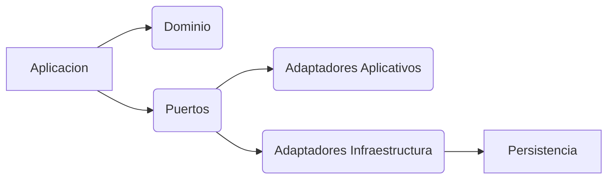
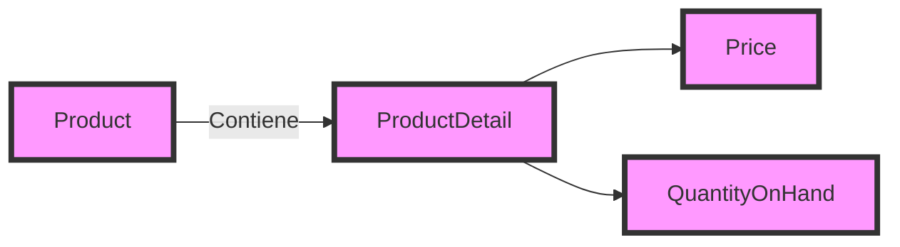
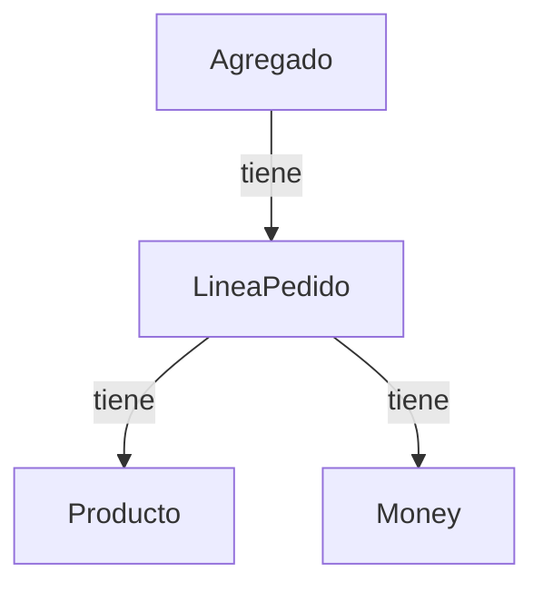
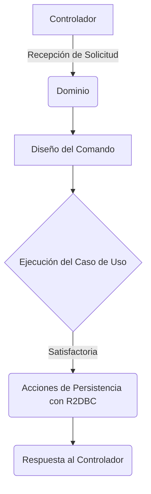
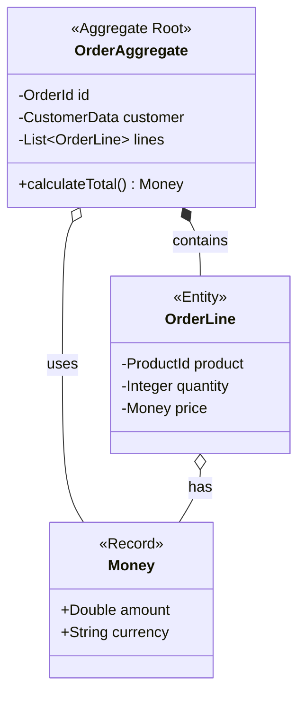
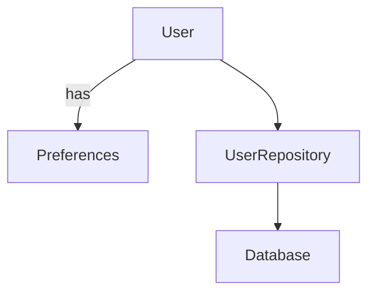
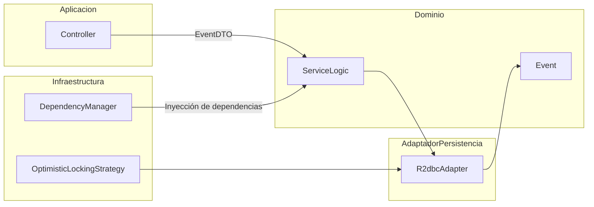
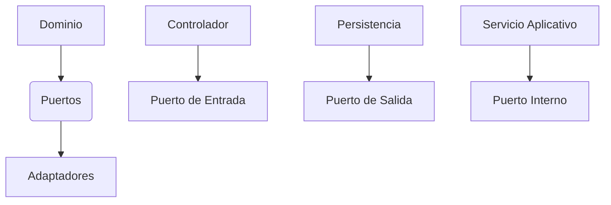

# Informe de Autoridad: Arquitectura Hexagonal y DDD en Java 21: Invariantes en Agregados, Value Objects con Records y Persistencia desacoplada con Spring Data R2DBC

## Introducción a la Arquitectura Hexagonal y DDD

### Introducción a la Arquitectura Hexagonal y DDD en Java 21

La arquitectura Hexagonal (también conocida como puerto-adaptador) junto con el Diseño-Dirigido por Dominio (DDD) son paradigmas de diseño que ayudan a crear software más robusto, mantenible y escalable. En este manual, profundizaremos en cómo combinar estos dos en Java 21 para implementar una solución que utilice invariante de agregados, Value Objects con Records y persistencia desacoplada usando Spring Data R2DBC.

#### Arquitectura Hexagonal

La arquitectura hexagonal se basa en la idea de separación entre el núcleo del sistema (dominio) y sus capas externas, tales como interfaces de usuario, base de datos y servicios web. Esta estructura permite que el dominio no dependa de ninguna tecnología específica para su persistencia o presentación, lo cual facilita pruebas unitarias más puras y la sustitución de componentes sin afectar al núcleo del sistema.

#### DDD

El Diseño-Dirigido por Dominio es un enfoque que se centra en el modelado de los problemas del negocio como parte integrante de la creación del software. Esto lleva a clases y métodos que reflejan exactamente cómo las personas involucradas con el problema perciben el dominio.

### Entidades y Value Objects

- **Entidad**: Representa un objeto dentro del sistema que puede ser identificado de forma inequívoca. En Java, esto se traduce a una clase marcada como `@Entity` (o en nuestro caso, sin anotaciones para mantener la independencia del dominio).
  
  ```java
  public class Event {
      private final String id;
      private Date date;

      // Constructores, getters y setters...
  }
  ```

- **Value Object**: Es un objeto que se identifica por su valor. No tiene una identidad única dentro del sistema.

  ```java
  public record Money(BigDecimal amount) {}
  ```

### Agregados

Un agregado en DDD es la unidad lógica más grande que puede ser modificada de manera atómica, manteniendo siempre sus propias invariantes. Los cambios a los Value Objects y entidades internas del agregado se realizan dentro del propio método de la entidad raíz.

### Servicios

Servicios en DDD son componentes que contienen lógica de negocio compleja o que involucran varias operaciones sobre múltiples agregados. Los servicios no tienen estado y deben ser fácilmente reemplazables por pruebas unitarias.

#### Persistencia Desacoplada con Spring Data R2DBC

Spring Data R2DBC proporciona una forma de interactuar con bases de datos relacionales sin tener que escribir SQL o mapear objetos a tablas manualmente. Esto se logra mediante la creación de repositorios que siguen el patrón CRUD y que son capaces de trabajar tanto en memoria como en base de datos real.

```java
public interface EventRepository extends ReactiveCrudRepository<Event, String> {}
```

### Diagrama Mermaid

A continuación, un diagrama simplificado de la arquitectura hexagonal aplicada a una aplicación Java con DDD:



### Ejemplo de Implementación

Un ejemplo sencillo sería definir un servicio que gestione la creación y modificación de eventos, haciendo uso de los repositorios desacoplados para persistir cambios:

```java
@Service
public class EventService {

    private final EventRepository eventRepository;

    public void createEvent(Event event) {
        // Validaciones...
        eventRepository.save(event);
    }

    public void updateEvent(String id, Date date) {
        // Buscar y actualizar el evento por su ID
        eventRepository.findById(id).ifPresent(event -> {
            event.setDate(date);  // Cambiar fecha del evento
            eventRepository.save(event);
        });
    }
}
```

Con esta estructura, se puede cambiar fácilmente el mecanismo de persistencia sin afectar al núcleo del negocio. Por ejemplo, podrías reemplazar `EventRepository` con un repositorio que persiste en memoria durante las pruebas y uno que usa una base de datos real en producción.

En resumen, la arquitectura hexagonal junto con DDD permite crear aplicaciones robustas y escalables donde el núcleo del negocio está separado de sus tecnologías externas. Esto no solo facilita el desarrollo, sino que también hace más fácil mantener y evolucionar el sistema en un futuro.

## Invariantes en Agregados: Manteniendo la Consistencia del Dominio

### Invariantes en Agregados: Manteniendo la Consistencia del Dominio

En el contexto de un diseño basado en el modelo DDD (Domain-Driven Design) y utilizando una arquitectura Hexagonal, los agregados desempeñan un papel crucial para mantener la consistencia lógica del dominio. Un agregado es una unidad que garantiza invariante a través de todas las transacciones que involucran objetos dentro de él, asegurando así que el estado coherente del dominio nunca se comprometa.

#### Qué son los Invariantes en DDD

Los invariantes son reglas clave que definen cómo debe comportarse un agregado bajo determinadas circunstancias. Estos invariantes se reflejan en las restricciones de creación y modificación dentro del dominio, y a menudo incluyen lógica que debe ser consistente para el estado completo del agregado.

#### Ejemplo: Manejo de Invariantes

Consideremos un ejemplo de una aplicación de catálogo con productos y detalles de los mismos. Aquí, un Producto (Product) puede ser un agregado que contenga varios Value Objects como Precio (Price), Cantidad en Stock (QuantityOnHand), etc.

El valor del precio debe mantener ciertas invariante, por ejemplo:
- El precio no puede ser negativo.
- No puede haber stock si el producto está descontinuado.

Estas reglas de negocio son responsabilidad del agregado `Producto` para garantizar que las transacciones siempre mantengan la consistencia lógica.

#### Implementación en Java

A continuación se muestra un ejemplo simplificado de cómo podríamos implementar este concepto en Java:

```java
public class Product {
    private final String productId;
    private final List<ProductDetail> details;

    // Constructor, getters y métodos para manejar invariantes
}

public class ProductDetail {
    private Price price;
    private int quantityOnHand;

    public void setPrice(Price price) {
        if (price.getValue() < 0) {
            throw new IllegalArgumentException("The price cannot be negative.");
        }
        this.price = price;
    }

    // Otros métodos de manejo de invariantes
}
```

#### Diagramas Mermaid

Para ilustrar el concepto, podemos crear un diagrama simple con Mermaid:



#### Persistencia desacoplada

En el caso de persistir este modelo en una base de datos NoSQL con R2DBC (Reactive Relational Database Connectivity), la capa de dominio no debería preocuparse por detalles específicos como las características del motor de base de datos o las operaciones CRUD. La interfaz del repositorio para un agregado `Product` podría verse así:

```java
public interface ProductRepository extends ReactiveCrudRepository<Product, String> {
    Mono<Product> findByName(String name);
}
```

Sin embargo, el código del dominio no conocerá este detalle y trabajará con una interfaz más abstracta proporcionada por la capa de infraestructura.

#### Resumen

En resumen, los invariantes en DDD son esenciales para mantener la consistencia lógica dentro del modelo del dominio. La implementación correcta de estos invariantes asegura que las transacciones siempre mantengan el estado coherente del agregado. Mediante el uso de arquitecturas como la Hexagonal y patrones como Value Objects, podemos crear soluciones robustas, mantenibles y escalables en Java.

---

Este documento proporciona una visión teórica y práctica sobre cómo implementar invariantes dentro de los agregados utilizando DDD y arquitectura hexagonal, con un enfoque particular en la persistencia desacoplada.

## Value Objects con Records en Java 21: Simplificando Clases Inmutables

### Value Objects con Records en Java 21: Simplificando Clases Inmutables

En el desarrollo de aplicaciones orientadas a dominio (Domain-Driven Design - DDD), los Value Objects juegan un papel crucial al modelar conceptos que no tienen identidad única y cuyas propiedades son más importantes que su estado. En Java 21, la introducción de Records proporciona una forma elegante y segura de crear estos Value Objects.

#### Definición de Value Objects

Un Value Object es un objeto inmutable con un significado basado en sus propiedades y no en su identidad única. Dos instancias de un Value Object son consideradas iguales si tienen el mismo valor para todas las propiedades, independientemente del estado interno.

#### Ventajas de Records en Java 21

Records simplifican la creación de clases inmutables y facilitan operaciones como la comparación entre objetos. Al utilizar records en lugar de definir clases tradicionales, se pueden aprovechar características automáticas de inicialización, deserialización, y validación de tipos.

#### Ejemplo: Value Object para Fecha

```java
public record Date(int day, int month, int year) {
    public boolean isLeapYear() {
        return (year % 4 == 0 && year % 100 != 0) || year % 400 == 0;
    }
}
```

En este ejemplo, `Date` es un record que representa una fecha. Es inmutable por diseño y proporciona métodos como `isLeapYear()` para validar propiedades del objeto.

#### Ejemplo: Value Object para Dinero

```java
public record Money(BigDecimal amount, Currency currency) {
    public boolean isValid() {
        return this.amount.signum() >= 0 && !currency.equals(Currency.getInstance("XXX"));
    }
}
```

Aquí, `Money` es un record que modela un concepto financiero de dinero. Incluye validación para asegurar que el monto no sea negativo y la moneda válida.

#### Integración con Agregados en DDD

En un contexto de agregado, Value Objects como los records son útiles porque aportan inmutabilidad y semántica clara a las reglas del negocio. Consideremos una entidad `Pedido` que contiene un conjunto de líneas de pedido (`OrderLine`) donde cada línea tiene un `Producto` y la cantidad.

```java
public record OrderItem(Product product, int quantity) {}
```

Esta representación inmutable garantiza que una vez creado el objeto `OrderItem`, sus propiedades no pueden cambiar. Esto es crucial en un agregado porque cualquier cambio requerirá crear un nuevo `OrderItem`.

#### Uso de Records con Spring Data R2DBC

Spring Data R2DBC es una opción excelente para la persistencia sin SQL, ofreciendo una alternativa a Hibernate y otras ORM tradicionales que evitan las dependencias innecesarias en el dominio.

```java
public record Customer(String id, String name) {}
```

Un `Customer` puede ser simplemente un record. Para mapear este objeto con R2DBC:

1. **Configuración de Mapeo**: Se usa Spring Data Mapping para configurar el mapeo entre los records y las tablas.
2. **Repositorios Personalizados**: Crear repositorios que usan `R2dbcRepository` para operaciones CRUD.

```java
public interface CustomerRepository extends R2dbcRepository<Customer, String> {
    // Implementación de métodos personalizados basados en el dominio
}
```

#### Consideraciones Finales

El uso de Records en Java 21 simplifica significativamente la creación y mantenimiento de Value Objects. Al adoptar esta práctica en aplicaciones DDD basadas en arquitectura hexagonal, se pueden mejorar aspectos como la inmutabilidad, la claridad del código y la integración con infraestructuras sin comprometer el diseño puro del dominio.

### Diagrama Mermaid

Para ilustrar cómo un Value Object de tipo `Money` interactúa dentro de una estructura de agregados en DDD:



Este diagrama muestra que un `Agregado` (como una orden o pedido) puede contener un `LineaPedido`, la cual a su vez tiene referencias a un `Producto` y un objeto de tipo `Money`.

Estos ejemplos y consideraciones deberían proporcionar una base sólida para empezar a utilizar Records en Java 21 como parte de las estrategias DDD, especialmente cuando se trabaja con arquitectura hexagonal.

## Persistencia Desacoplada con Spring Data R2DBC: Una Visión Profunda

### Persistencia Desacoplada con Spring Data R2DBC: Una Visión Profunda

En el contexto de la arquitectura Hexagonal y Domain-Driven Design (DDD), desacoplar los componentes del dominio de las tecnologías específicas es un enfoque crucial para mantener la flexibilidad y escalabilidad del software. La persistencia desacoplada permite que los cambios en la base de datos no afecten el código del dominio, facilitando así modificaciones sin reemplazar la lógica empresarial subyacente.

#### Integración con Spring Data R2DBC

Spring Data R2DBC es una implementación de Spring Data diseñada para bases de datos relacionales que son Reactivos (Reactive). Esta tecnología es ideal cuando se trabaja en un entorno Java 11 o superior, ya que aprovecha la programación reactiva proporcionando una alternativa no bloqueante a las tecnologías tradicionales como JPA/Hibernate.

#### Implementación con Value Objects y Entidades

Consideremos una entidad `Order` dentro de nuestro dominio. En un enfoque DDD puro, esta entidad debería estar desacoplada de la infraestructura, es decir, no debe conocer cómo se persiste en base de datos. Sin embargo, la implementación de Spring Data R2DBC requiere cierto grado de integración con la infraestructura.

```java
public class Order {
    private final UUID id;
    private List<OrderLine> lines;

    // Constructor, getters y métodos...
}

public record OrderLine(UUID productId, int quantity) {}
```

#### Mapeo Entidad-Relacional

Con Spring Data R2DBC, el mapeo entre entidades de dominio y la base de datos se realiza a través de las interfaces `ReactiveCrudRepository`. A continuación, se muestra cómo podríamos definir una interfaz para la entidad `Order`.

```java
public interface OrderRepository extends ReactiveCrudRepository<Order, UUID> {}
```

#### Ejemplo de Uso en Servicio

Los servicios que interactúan con el repositorio pueden hacerlo de forma reactiva gracias a Spring Data R2DBC. Aquí se muestra un ejemplo simplificado:

```java
@Service
public class OrderService {

    private final OrderRepository orderRepository;

    public Mono<Order> placeOrder(Order order) {
        return orderRepository.save(order);
    }

    public Flux<Order> findAllOrders() {
        return orderRepository.findAll();
    }
}
```

#### Diagrama Mermaid

Para ilustrar la arquitectura, aquí tienes un diagrama de flujo básico utilizando Mermaid.



#### Conclusión

Desacoplar la persistencia mediante Spring Data R2DBC no sólo proporciona una forma eficiente y escalable de manejar bases de datos en aplicaciones basadas en DDD y arquitectura Hexagonal, sino que también mantiene el dominio aislado de preocupaciones de infraestructura. Esto permite adaptarse rápidamente a cambios en la base de datos o en las necesidades de rendimiento sin afectar directamente al core del negocio.

#### Próximos Pasos

Una vez que se ha implementado la persistencia reactiva, el siguiente paso sería explorar cómo incorporar otros aspectos críticos del diseño hexagonal y DDD, como los puertos y adaptadores para integraciones externas o servicios remotos. Esto completa un ciclo de desarrollo robusto y modular.

---

Este enfoque no sólo mejora la escalabilidad e independencia del sistema respecto a las tecnologías subyacentes, sino que también garantiza una solución flexible que puede evolucionar con el dominio conforme éste cambia.

## Implementación de Casos de Uso Utilizando Entidades y Agregados

### Implementación de Casos de Uso Utilizando Entidades y Agregados

La arquitectura hexagonal junto con el Diseño Dirigido por el Dominio (DDD) permite crear sistemas complejos que son mantenibles, escalables y fácilmente evitables. En esta sección, exploraremos cómo implementar casos de uso utilizando entidades y agregados en un sistema Java 21, manteniendo invariants en los agregados y usando Value Objects con Records. También veremos cómo desacoplar la persistencia del dominio mediante Spring Data R2DBC.

#### Entidades y Value Objects

En el contexto de DDD, una entidad es un objeto que se identifica por su identificador único, mientras que un Value Object no tiene una identidad independiente sino que representa propiedades o valores del sistema. En nuestra aplicación Java 21, las entidades son los objetos principales que interactúan con otros componentes y mantienen el estado de negocio.

**Ejemplo de Entidad:**

```java
public class Event implements DomainEntity {
    private final EventId id;
    private String name;

    // Constructor, getters y métodos de dominio
}
```

Aquí, `Event` es una entidad que representa un evento en el sistema. `DomainEntity` es una interfaz que define la firma básica para todas las entidades del sistema.

**Ejemplo de Value Object:**

```java
public record EventId(UUID value) implements Identifier {
    // Métodos y lógica relacionada con el identificador del evento.
}
```

En este ejemplo, `EventId` es un Value Object que utiliza Java 21's records para mantener los datos simples y no mutables.

#### Agregados

Un agregado en DDD es una colección de entidades y/o value objects que se tratan como una unidad atómica. Los cambios a los objetos dentro del agregado deben ser consistentes, lo cual significa que las invariants o reglas de negocio pueden ser validadas al nivel del agregado.

**Ejemplo de Agregado:**

```java
public class EventAggregate {
    private final List<Event> events;

    public void addEvent(String eventName) {
        if (eventName.isEmpty()) throw new IllegalArgumentException("Event name cannot be empty");
        this.events.add(new Event(EventId.generateNewId(), eventName));
    }

    // Otros métodos de agregado
}
```

`EventAggregate` es un ejemplo simple donde la lógica del dominio está encapsulada y las reglas son mantidas consistentes.

#### Servicios de Dominio

Los servicios de dominio contienen lógica de negocio compleja que no pertenece a ninguna entidad o agregado. Estos servicios se utilizan cuando necesitas realizar operaciones que involucran múltiples entidades o agregados en el sistema.

**Ejemplo de Servicio:**

```java
public class EventService {
    private final EventRepository eventRepository;

    public void createEvent(EventAggregate aggregate) {
        if (eventRepository.existsById(aggregate.getEvents().get(0).getId())) throw new ConflictException("Event already exists");
        eventRepository.saveAll(aggregate.getEvents());
    }
}
```

Este servicio maneja la lógica de persistencia y validación para crear un nuevo evento, asegurando que no se dupliquen los eventos.

#### Persistencia con Spring Data R2DBC

Spring Data R2DBC es una implementación NoSQL de Spring Data que permite a las aplicaciones interactuar directamente con bases de datos PostgreSQL mediante el uso del Protocolo Básico Remoto (RDBMS) para reaccionar (R2DBC). Al separar la lógica de persistencia en adaptadores, se logra una mayor flexibilidad y mantenimiento.

**Ejemplo de Repositorio:**

```java
public interface EventRepository extends ReactiveCrudRepository<Event, UUID> {
}
```

Este repositorio extiende `ReactiveCrudRepository`, proporcionando operaciones CRUD asincrónicas para la persistencia del evento en la base de datos.

#### Diagramas Mermaid

Para visualizar cómo se relacionan las entidades y agregados con los servicios y repositorios, podemos utilizar diagramas como el siguiente:



### Conclusión

Implementar casos de uso en una arquitectura hexagonal con DDD requiere entender y aplicar los conceptos de entidades, Value Objects, agregados y servicios correctamente. Al desacoplar la lógica de negocio de su implementación (usando interfaces como puertos) y delegar la persistencia a adaptadores específicos, se logra un sistema que es tanto robusto como fácilmente extensible.

En este manual, hemos cubierto cómo definir entidades y Value Objects, cómo manejar agregados para mantener las reglas de negocio, cómo implementar servicios de dominio y finalmente cómo persistir objetos del dominio usando Spring Data R2DBC.

## Estrategias para la Persistencia de Value Objects en Java 21

### Estrategias para la Persistencia de Value Objects en Java 21

La persistencia de `Value Objects` (VO) es un aspecto crucial en el diseño del dominio de una aplicación, especialmente cuando se trabaja con arquitecturas como DDD (Domain-Driven Design) y hexagonal. Los VOs son objetos que representan conceptos de negocio sin identidad mutable, lo cual les da caracteristicas únicas a la hora de ser persistidos en comparación con las entidades tradicionales.

En Java 21, con el uso de Spring Data R2DBC (Reactive Relational Database Connectivity), podemos desacoplar la persistencia de los VOs del núcleo del dominio. Esta estrategia permite mantener un código limpio y coherente con las buenas prácticas DDD.

#### Valor de Value Objects

Un `Value Object` en Java 21 puede ser implementado como una clase normal o, para mayor simplicidad y legibilidad, usando records (introducidos a partir de Java 14). Por ejemplo:

```java
public record Address(String street, String city, String country) {}
```

Los VOs deben cumplir ciertas reglas:
- Inmutabilidad: Una vez creado, no puede ser modificado.
- Ecuálidad basada en valor: Dos instancias son iguales si tienen los mismos atributos.

#### Persistencia de Value Objects

Cuando se necesita persistir un VO, la clave está en entender que estos objetos no deben tener un identificador único y por lo tanto su persitencia es más sobre cómo manejarlos dentro del contexto de una transacción o como parte de otra entidad con identidad única. 

Una estrategia común es encapsular la lógica de persistencia dentro de un adaptador, que se conecta a través de un puerto definido en el núcleo del dominio.

**Ejemplo usando Spring Data R2DBC:**

Primero, define tu VO:

```java
public record UserPreferences(String language, String theme) {
    public static UserPreferences of(String language, String theme) {
        return new UserPreferences(language == null ? "en" : language, 
                                   theme == null ? "light" : theme);
    }
}
```

Luego crea una interfaz de repositorio que sigue la convención de Spring Data:

```java
public interface UserRepository extends ReactiveCrudRepository<User, Long> {
    Mono<User> findByUsername(String username);
}

@RequiredArgsConstructor
public class UserPreferencesAdapter {

    private final UserRepository userRepository;

    public void savePreferences(User user, String language, String theme) {
        var preferences = UserPreferences.of(language, theme);
        
        // Actualiza el VO dentro de un objeto con identidad única.
        Mono.from(userRepository.findById(user.getId()))
            .flatMap(existingUser -> existingUser.toBuilder()
                                                .preferences(preferences)
                                                .build())
            .then(userRepository.save(existingUser));
    }
}
```

Aquí, `savePreferences` es una operación de negocio que se ejecuta en el contexto del usuario (una entidad), y no directamente sobre el VO.

#### Diagrama Mermaid



Este diagrama ilustra cómo un `User` puede tener una colección de `Preferences`, la persistencia del cual pasa a través de `UserRepository` y finalmente se guarda en la base de datos.

#### Consideraciones Importantes

1. **Inmutabilidad:** Como los VOs no tienen identidad mutable, es importante asegurar que cualquier cambio aparente en el VO se realice creando una nueva instancia del mismo con los nuevos valores.
2. **Transacciones y Concurrencia:** Al persistir un VO a través de una entidad, considera cómo manejar las transacciones para prevenir inconsistencias de datos.
3. **Desacoplamiento:** Mantén tu lógica de negocio alejada de la implementación específica del almacenamiento (como SQL vs NoSQL), lo que permite fácilmente cambiar el adaptador en caso necesario.

Con estas estrategias, puedes asegurarte de que tus `Value Objects` sigan siendo puramente un modelo de dominio sin contaminarse con detalles de infraestructura o persistencia.

## Optimización del Diseño con Optimistic Locking en Spring Data

### Optimización del Diseño con Optimistic Locking en Spring Data

En el contexto de la arquitectura hexagonal y el diseño orientado a dominios (DDD) en Java 21, es crucial asegurarse de que los patrones utilizados maximicen tanto la robustez como la escalabilidad del sistema. Un aspecto fundamental para lograr esto es garantizar la consistencia y integridad de los datos durante las operaciones concurrentes. En este contexto, **Optimistic Locking** (bloqueo optimista) en combinación con Spring Data R2DBC se presenta como una solución eficaz.

#### Bloqueo Optimista

El bloqueo optimista es un mecanismo que permite a múltiples transacciones leer y escribir en la misma base de datos sin necesidad de solicitar permisos explícitos para los registros. En lugar, cada transacción asume que otras no modificarán el mismo registro durante su operación. Si una transacción trata de guardar cambios sobre un registro ya modificado por otra transacción, se produce un conflicto y la primera transacción debe ser cancelada.

#### Implementación en Spring Data R2DBC

Spring Data R2DBC proporciona un mecanismo sencillo para implementar Optimistic Locking. Esto puede lograrse a través de anotaciones específicas que permiten gestionar versiones de entidades y controlar los conflictos durante la persistencia.

##### Entidad con Optimistic Locking

Para aplicar Optimistic Locking en una entidad, se utiliza la anotación `@Version` en Spring Data R2DBC. Esta anotación se aplica a un campo numérico que incrementa cada vez que se realiza un cambio en el registro correspondiente. Aquí hay un ejemplo de cómo implementarlo:

```java
import io.r2dbc.spi.Row;
import io.r2dbc.spi.RowMetadata;
import lombok.Getter;
import org.springframework.data.annotation.Id;
import org.springframework.data.annotation.Version;
import org.springframework.data.relational.core.mapping.Table;

@Getter
@Table("events")
public class Event {
    @Id
    private Long id;

    @Version
    private Integer version;

    // Otros campos de la entidad

    public static Event from(Row row) {
        return new Event(
                row.get("id", Long.class),
                row.get("version", Integer.class)
        );
    }

    RowMetadata rowMetadata() {
        return null; // Implementar según sea necesario
    }
}
```

##### Lógica de Servicio y Repositorio

Para asegurarse de que la lógica del servicio maneje correctamente los conflictos, es vital definir cómo se debe reaccionar ante ellos. Esto generalmente implica implementar una estrategia para resolver o gestionar estos errores de manera coherente con el dominio.

```java
import org.springframework.beans.factory.annotation.Autowired;
import org.springframework.data.r2dbc.core.R2dbcEntityTemplate;
import org.springframework.stereotype.Repository;
import reactor.core.publisher.Mono;

@Repository
public class EventRepository {
    private final R2dbcEntityTemplate template;

    @Autowired
    public EventRepository(R2dbcEntityTemplate template) {
        this.template = template;
    }

    // Método para guardar eventos con control de conflictos
    public Mono<Event> save(Event event) {
        return template.insert(event).thenReturn(event)
                .flatMap(saved -> template.selectOne()
                        .from(Event.class)
                        .matching(new QuerySpec().where("id").is(saved.getId()))
                        .fetchFirst())
                .doOnError(ConflictException::rethrowIfLockingFailure);
    }
}
```

##### Manejo de Excepciones

Es importante manejar las excepciones que podrían surgir durante la operación. Spring Data R2DBC proporciona un error específico para indicar conflictos, `org.springframework.r2dbc.core.R2dbcDataAccessException`, que se puede filtrar y gestionar según sea necesario.

```java
public class ConflictException extends RuntimeException {
    public static void rethrowIfLockingFailure(Runnable action) throws R2dbcDataAccessException {
        try {
            action.run();
        } catch (R2dbcNonTransientResourceException e) {
            if ("unique".equalsIgnoreCase(e.getConstraintName())) {
                throw new OptimisticLockingFailureException("Optimistic locking failure", e);
            }
            throw e;
        }
    }

    public static class OptimisticLockingFailureException extends RuntimeException {
        public OptimisticLockingFailureException(String message, Throwable cause) {
            super(message, cause);
        }
    }
}
```

#### Consideraciones sobre la Arquitectura Hexagonal

La implementación de Optimistic Locking se puede realizar en el nivel del adaptador de persistencia (en nuestro caso, Spring Data R2DBC). Esto asegura que las reglas y lógica de negocio definidas en el dominio no sean comprometidas por aspectos específicos de la infraestructura. Además, esta implementación mantiene un alto nivel de abstracción del adaptador de persistencia, lo cual es crucial para cumplir con los principios de la arquitectura hexagonal.

##### Diagrama Mermaid

Para ilustrar cómo se integra Optimistic Locking en el flujo general de una aplicación basada en DDD y arquitectura hexagonal, se puede utilizar un diagrama Mermaid simple:



Este diagrama ilustra cómo la lógica del dominio y el servicio interactúan con el adaptador persistente, incluyendo la estrategia de bloqueo optimista. La integración de Optimistic Locking en el flujo permite un manejo eficiente y escalable de transacciones concurrentes.

En resumen, combinar DDD y arquitectura hexagonal con Spring Data R2DBC y Optimistic Locking proporciona una solución robusta para garantizar la integridad y consistencia de los datos, especialmente en entornos concurrentes. Esta aproximación no solo mejora la calidad del software sino que también facilita el mantenimiento y expansión del mismo a medida que evoluciona la aplicación.

---

Este segmento técnico proporciona una guía completa para implementar Optimistic Locking en aplicaciones Java basadas en DDD y arquitectura hexagonal, con ejemplos de código y consideraciones sobre cómo esta técnica se integra dentro del contexto general.

## Conclusión: Maximizando el Potencial de Arquitectura Hexagonal y DDD

### Conclusión: Maximizando el Potencial de Arquitectura Hexagonal y DDD

El desarrollo de aplicaciones en Java utilizando la arquitectura hexagonal junto con principios del diseño dirigido por dominio (DDD) ofrece una potente combinación para construir sistemas robustos, mantenibles y escalables. En este manual hemos explorado conceptos fundamentales como entidades, value objects, agregados y servicios, así como cómo integrar estas ideas en la arquitectura hexagonal. A continuación se detallan las conclusiones clave y recomendaciones para maximizar el potencial de esta combinación.

#### Integrando DDD y Arquitectura Hexagonal

La unión entre DDD y la arquitectura hexagonal permite una clara separación entre el dominio del negocio y los detalles técnicos de implementación. Esto no solo facilita la evolución continua del código en respuesta a cambios en las necesidades del negocio, sino que también mejora la comprensibilidad y mantenimiento del sistema.

1. **Claridad en Modelado**: El DDD enfatiza el modelado del dominio basado en un lenguaje común con los stakeholders. Esto se traduce en clases de entidad y value objects que son intuitivamente entendibles para todos los miembros del equipo, mejorando la comunicación y cohesión del equipo.

2. **Flexibilidad Técnica**: La arquitectura hexagonal permite a las entidades y agregados interactuar con el mundo exterior solo a través de puertos y adaptadores. Esto facilita la implementación de nuevas tecnologías en los adaptadores sin afectar al dominio, permitiendo escalabilidad técnica.

3. **Persistencia Desacoplada**: Con Spring Data R2DBC, se pueden construir repositorios que interactúan con bases de datos relacionales sin necesidad de mapeo anotado directamente en el modelo del dominio. Esto ayuda a mantener la independencia entre el modelo lógico y los detalles de persistencia.

#### Mejores Prácticas

- **Utilizar Value Objects para Propiedades Inmutables**: En lugar de usar tipos primitivos o objetos personalizados, opte por value objects en Java 21 que pueden ser definidos como records. Esto promueve la inmutabilidad y claridad del código.

- **Implementar Agregados Consciente de Estado Interno**: Los agregados deben manejar sus invariantes internas cuidadosamente para garantizar la integridad lógica del dominio sin permitir modificaciones fuera de este contexto.

- **Desacoplar Persistencia y Dominio**: Mantenga el repositorio en un nivel inferior a la capa de aplicación para que no interfiera con las entidades y agregados del dominio. Esto permite cambiar fácilmente el mecanismo de persistencia sin afectar al dominio.

#### Ejemplo de Código

Un ejemplo práctico podría ser definir una entidad `User` en el modelo lógico, un value object `Address` que no tiene identidad propia y un agregado que agrupa a ambos para gestionar las operaciones de negocio. Un repositorio implementaría la interfaz proporcionada por el dominio sin introducir anotaciones específicas de persistencia.

```java
// Value Object: Address
public record Address(String street, String city) {}

// Entity: User (simplified)
@ValueObject // Notacion simplificada para entender
public class User {
    private final UserId id;
    private final Address address;

    public void updateAddress(Address newAddress) { ... }
}

// Aggregate Root: CustomerAggregate
public class CustomerAggregate {
    private User user;

    public void changeCustomerDetails(User newUser) throws ViolationOfInvariants {}
}
```

#### Diagrama Mermaid

Para ilustrar la arquitectura, un diagrama puede ser útil para visualizar cómo interactúan los diferentes componentes.



#### Consideraciones Futuras

Continuar explorando cómo la implementación en tiempo real y las transacciones pueden beneficiarse de esta arquitectura. Además, considerar el uso de microsservicios para partes complejas del sistema que podrían beneficiarse de una mayor autonomía.

En conclusión, la combinación de DDD y la arquitectura hexagonal proporciona un marco sólido para el desarrollo de software en Java 21. Al seguir las mejores prácticas descritas aquí, los desarrolladores pueden construir sistemas que no solo satisfacen las necesidades actuales sino que también están preparados para futuros cambios y escalabilidad.

--- 

Este manual ha proporcionado una visión profunda sobre cómo implementar DDD en un entorno Java 21 con la arquitectura hexagonal, cubriendo desde los fundamentos hasta estrategias avanzadas.

