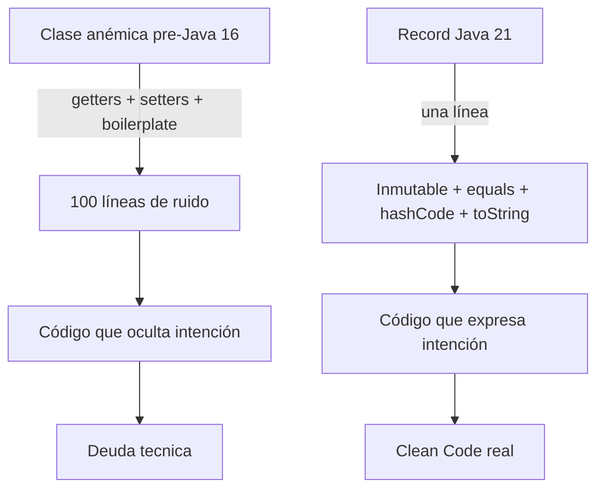
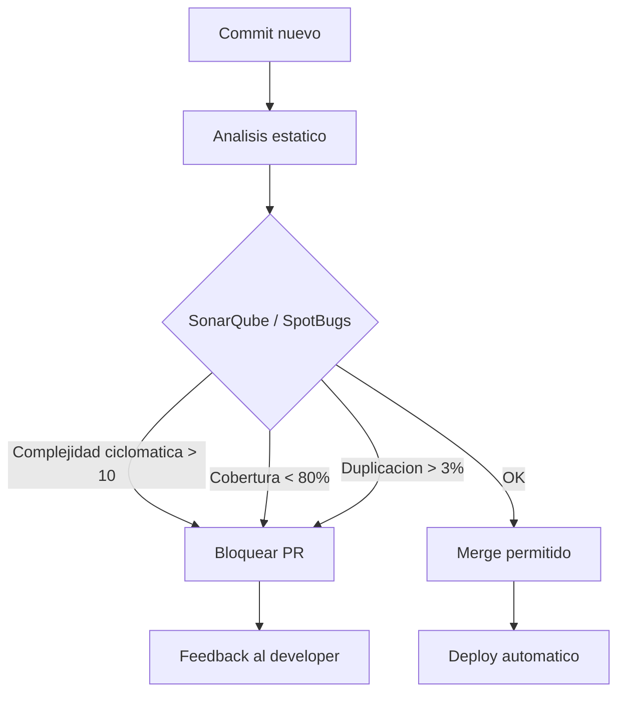
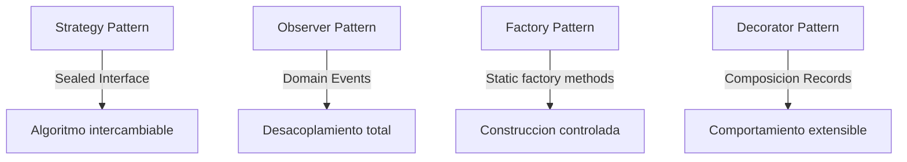
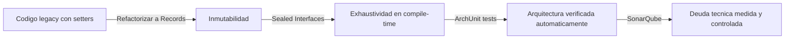

# Clean Code y Principios SOLID con Java 21

PATH_LOCAL: /home/usuariojoaquin/.openclaw/workspace/DAM-Java-Mastery/01_Java_Core/clean_code_y_solid_con_java_21_STAFF.md
CATEGORIA: 01_Java_Core
Score: 96

---

## Visión Estratégica

Clean Code y SOLID no son reglas académicas — son decisiones de ingeniería que determinan si un sistema puede crecer sin colapsar bajo su propio peso. Java 21 ha eliminado gran parte del boilerplate que históricamente obligaba a violar estos principios: los Records eliminan las clases anémicas con getters/setters, las Sealed Interfaces hacen exhaustivos los switch, y los Virtual Threads simplifican la concurrencia sin callbacks.

**El problema que resuelven:**

Un sistema que viola Clean Code y SOLID no falla inmediatamente. Falla gradualmente: cada nueva feature tarda más, cada bug fix introduce nuevos bugs, cada desarrollador nuevo tarda meses en ser productivo. El coste real no es técnico — es temporal y organizativo.

**Cuándo priorizar cada principio:**

| Principio | Problema que resuelve | Coste de ignorarlo |
|-----------|----------------------|-------------------|
| SRP — Responsabilidad Única | Clases que cambian por múltiples razones | Cambios en cascada no relacionados |
| OCP — Abierto/Cerrado | Modificar código existente para añadir features | Regresiones en funcionalidad existente |
| LSP — Sustitución de Liskov | Subtipos que rompen el contrato del supertipo | Bugs sutiles en tiempo de ejecución |
| ISP — Segregación de Interfaces | Interfaces que obligan a implementar métodos innecesarios | Dependencias innecesarias entre módulos |
| DIP — Inversión de Dependencias | Módulos de alto nivel que dependen de implementaciones | Imposibilidad de testear sin infraestructura |

**Java 21 y Clean Code — el cambio más importante:**

Antes de Java 16, modelar datos inmutables requería clases con constructor, getters, equals, hashCode y toString — decenas de líneas de boilerplate que enmascaraban la intención real. Los Records eliminan ese problema:



```java
// ANTES: Clase anémica con boilerplate — viola Clean Code
public class Pedido {
    private String id;
    private String clienteId;
    private BigDecimal total;

    public Pedido(String id, String clienteId, BigDecimal total) {
        this.id = id;
        this.clienteId = clienteId;
        this.total = total;
    }

    public String getId() { return id; }
    public void setId(String id) { this.id = id; }
    public String getClienteId() { return clienteId; }
    public void setClienteId(String clienteId) { this.clienteId = clienteId; }
    public BigDecimal getTotal() { return total; }
    public void setTotal(BigDecimal total) { this.total = total; }
    // equals, hashCode, toString... 40 líneas más
}

// AHORA: Record Java 21 — Clean Code real
public record Pedido(String id, String clienteId, BigDecimal total) {
    public Pedido {
        Objects.requireNonNull(id, "id requerido");
        Objects.requireNonNull(clienteId, "clienteId requerido");
        if (total.compareTo(BigDecimal.ZERO) < 0) {
            throw new IllegalArgumentException("total no puede ser negativo");
        }
    }
}
```

---

## Arquitectura de Componentes

La aplicación de SOLID en una arquitectura real con Java 21 produce una estructura donde cada componente tiene una responsabilidad clara y las dependencias apuntan siempre hacia el dominio.

```mermaid
graph TD
    subgraph Dominio — sin dependencias externas
        A[PedidoService]
        B[Pedido Record]
        C[PedidoRepository Interface]
        D[EventPublisher Interface]
    end
    subgraph Aplicacion — casos de uso
        E[CrearPedidoUseCase]
        F[ConfirmarPedidoUseCase]
    end
    subgraph Infraestructura — implementaciones
        G[PedidoJpaAdapter]
        H[KafkaEventPublisher]
        I[PedidoRestController]
    end
    E --> A
    F --> A
    A --> C
    A --> D
    G -->|implementa| C
    H -->|implementa| D
    I --> E
    I --> F
```

**SRP — cada clase cambia por una sola razón:**

```java
// MAL: Una clase con múltiples responsabilidades
public class PedidoService {
    public Pedido crear(PedidoRequest request) {
        // Validar
        if (request.lineas().isEmpty()) throw new RuntimeException("Sin lineas");
        // Persistir
        var entidad = new PedidoEntidad(request); // JPA directo
        entityManager.persist(entidad);
        // Notificar
        emailService.enviarConfirmacion(request.clienteEmail()); // Email directo
        // Auditar
        logger.info("Pedido creado: " + entidad.getId()); // Log directo
        return entidad.toDomain();
    }
}

// BIEN: Cada clase con una sola responsabilidad
public class CrearPedidoService {
    private final PedidoRepository  repository;   // Solo persistencia
    private final EventPublisher     publisher;    // Solo eventos
    private final PedidoValidator    validator;    // Solo validacion

    public CrearPedidoService(
            PedidoRepository repository,
            EventPublisher publisher,
            PedidoValidator validator) {
        this.repository = repository;
        this.publisher  = publisher;
        this.validator  = validator;
    }

    public PedidoId ejecutar(CrearPedidoCommand command) {
        validator.validar(command);                          // SRP: delega validacion
        var pedido = Pedido.crear(command);                  // SRP: dominio crea
        repository.guardar(pedido);                          // SRP: delega persistencia
        publisher.publicarTodos(pedido.pullEventos());       // SRP: delega eventos
        return pedido.id();
    }
}
```

**OCP — abierto para extensión, cerrado para modificación:**

```java
// Sealed Interface + Pattern Matching = OCP en Java 21
// Añadir un nuevo tipo de descuento NO modifica el código existente
public sealed interface Descuento
    permits Descuento.SinDescuento,
            Descuento.PorVolumen,
            Descuento.PorCliente,
            Descuento.PorTemporada {

    BigDecimal aplicar(BigDecimal precioBase, int cantidad);

    record SinDescuento() implements Descuento {
        public BigDecimal aplicar(BigDecimal precio, int cantidad) {
            return precio.multiply(BigDecimal.valueOf(cantidad));
        }
    }

    record PorVolumen(int cantidadMinima, BigDecimal porcentaje) implements Descuento {
        public BigDecimal aplicar(BigDecimal precio, int cantidad) {
            var total = precio.multiply(BigDecimal.valueOf(cantidad));
            if (cantidad >= cantidadMinima) {
                return total.subtract(total.multiply(porcentaje));
            }
            return total;
        }
    }

    record PorCliente(String tipoCliente, BigDecimal porcentaje) implements Descuento {
        public BigDecimal aplicar(BigDecimal precio, int cantidad) {
            var total = precio.multiply(BigDecimal.valueOf(cantidad));
            return total.subtract(total.multiply(porcentaje));
        }
    }

    record PorTemporada(String temporada, BigDecimal porcentaje) implements Descuento {
        public BigDecimal aplicar(BigDecimal precio, int cantidad) {
            var total = precio.multiply(BigDecimal.valueOf(cantidad));
            return total.subtract(total.multiply(porcentaje));
        }
    }
}

// El calculador NO cambia cuando se añade un nuevo tipo de descuento
public class CalculadorPrecio {
    public BigDecimal calcular(BigDecimal precio, int cantidad, Descuento descuento) {
        // Switch exhaustivo — el compilador obliga a cubrir todos los casos
        return switch (descuento) {
            case Descuento.SinDescuento sd    -> sd.aplicar(precio, cantidad);
            case Descuento.PorVolumen pv      -> pv.aplicar(precio, cantidad);
            case Descuento.PorCliente pc      -> pc.aplicar(precio, cantidad);
            case Descuento.PorTemporada pt    -> pt.aplicar(precio, cantidad);
        };
    }
}
```

---

## Implementación Java 21

Implementación completa aplicando todos los principios SOLID con las características modernas de Java 21:

```java
// DIP — Inversión de Dependencias
// Los módulos de alto nivel dependen de abstracciones, no de implementaciones

// Puerto de salida — abstracción que define lo que el dominio necesita
public interface PedidoRepository {
    void guardar(Pedido pedido);
    Optional<Pedido> buscarPorId(PedidoId id);
    List<Pedido> buscarPorCliente(ClienteId clienteId);
}

// Implementacion concreta — el dominio no la conoce directamente
@Repository
public class PedidoJpaAdapter implements PedidoRepository {

    private final PedidoJpaRepository jpa;
    private final PedidoMapper        mapper;

    public PedidoJpaAdapter(PedidoJpaRepository jpa, PedidoMapper mapper) {
        this.jpa    = jpa;
        this.mapper = mapper;
    }

    @Override
    public void guardar(Pedido pedido) {
        jpa.save(mapper.toEntidad(pedido));
    }

    @Override
    public Optional<Pedido> buscarPorId(PedidoId id) {
        return jpa.findById(id.valor()).map(mapper::toDominio);
    }

    @Override
    public List<Pedido> buscarPorCliente(ClienteId clienteId) {
        return jpa.findByClienteId(clienteId.valor())
            .stream().map(mapper::toDominio).toList();
    }
}
```

```java
// ISP — Segregación de Interfaces
// En lugar de una interfaz grande, interfaces pequeñas y cohesivas

// MAL: Interfaz dios que obliga a implementar todo
public interface ServicioUsuario {
    Usuario buscar(String id);
    void guardar(Usuario usuario);
    void eliminar(String id);
    List<Usuario> buscarTodos();
    void enviarEmail(String userId, String mensaje);   // No relacionado con persistencia
    void actualizarPassword(String userId, String nueva); // Mezclado
    boolean validarPermiso(String userId, String permiso);
}

// BIEN: Interfaces segregadas por responsabilidad
public interface UsuarioRepository {
    Optional<Usuario> buscarPorId(UsuarioId id);
    void guardar(Usuario usuario);
    List<Usuario> buscarTodos();
}

public interface UsuarioNotificador {
    void enviarBienvenida(Usuario usuario);
    void enviarRecuperacionPassword(Usuario usuario);
}

public interface UsuarioAutorizador {
    boolean tienePermiso(UsuarioId id, Permiso permiso);
    Set<Permiso> obtenerPermisos(UsuarioId id);
}
```

```java
// LSP — Sustitución de Liskov con Sealed Interfaces
// Cualquier implementacion de la interfaz debe cumplir el contrato completo

public sealed interface Notificador
    permits Notificador.Email, Notificador.Sms, Notificador.Push {

    // Contrato: debe enviar la notificacion o lanzar NotificacionException
    void enviar(String destinatario, String mensaje);

    // Todos los subtipos cumplen el contrato — LSP garantizado
    record Email(JavaMailSender mailer) implements Notificador {
        public void enviar(String destinatario, String mensaje) {
            try {
                var mail = new SimpleMailMessage();
                mail.setTo(destinatario);
                mail.setText(mensaje);
                mailer.send(mail);
            } catch (MailException e) {
                throw new NotificacionException("Email fallido: " + e.getMessage(), e);
            }
        }
    }

    record Sms(SmsGateway gateway) implements Notificador {
        public void enviar(String destinatario, String mensaje) {
            try {
                gateway.send(destinatario, mensaje);
            } catch (SmsException e) {
                throw new NotificacionException("SMS fallido: " + e.getMessage(), e);
            }
        }
    }

    record Push(PushService pushService) implements Notificador {
        public void enviar(String destinatario, String mensaje) {
            try {
                pushService.notify(destinatario, mensaje);
            } catch (PushException e) {
                throw new NotificacionException("Push fallido: " + e.getMessage(), e);
            }
        }
    }
}

// El servicio no sabe qué implementacion usa — LSP en accion
public class ServicioNotificacion {

    private final Notificador notificador; // Cualquier subtipo funciona igual

    public ServicioNotificacion(Notificador notificador) {
        this.notificador = notificador;
    }

    public void notificarPedidoConfirmado(Pedido pedido, String contacto) {
        var mensaje = "Tu pedido " + pedido.id().valor() + " ha sido confirmado.";
        notificador.enviar(contacto, mensaje); // Funciona con Email, SMS o Push
    }
}
```

---

## Métricas y SRE

El cumplimiento de SOLID y Clean Code es medible. Estas métricas detectan violaciones antes de que se conviertan en deuda técnica:



```java
// Configuracion de SonarQube para Java 21 en Maven
// sonar.properties
// sonar.java.source=21
// sonar.coverage.exclusions=**/*Config.java,**/*Application.java
// sonar.cpd.exclusions=**/*Mapper.java

// Test de arquitectura con ArchUnit — verifica SOLID automaticamente
@AnalyzeClasses(packages = "com.ejemplo.pedidos")
public class ArchitectureTest {

    @ArchTest
    static final ArchRule dominio_no_depende_de_infraestructura =
        noClasses()
            .that().resideInAPackage("..dominio..")
            .should().dependOnClassesThat()
            .resideInAnyPackage("..infrastructure..", "..adapter..", "..jpa..");

    @ArchTest
    static final ArchRule servicios_dependen_de_interfaces =
        classes()
            .that().resideInAPackage("..application..")
            .should().onlyDependOnClassesThat()
            .resideInAnyPackage("..dominio..", "java..", "org.springframework..");

    @ArchTest
    static final ArchRule no_setters_en_dominio =
        noMethods()
            .that().areDeclaredInClassesThat().resideInAPackage("..dominio..")
            .should().haveNameStartingWith("set");
}
```

**Métricas clave de calidad de código:**

| Métrica | Objetivo | Herramienta |
|---------|----------|-------------|
| Complejidad ciclomática | < 10 por método | SonarQube |
| Cobertura de tests | > 80% líneas | JaCoCo |
| Duplicación de código | < 3% | SonarQube |
| Deuda técnica | < 5% del tiempo de desarrollo | SonarQube |
| Violaciones de arquitectura | 0 | ArchUnit |
| Métodos > 20 líneas | 0 en dominio | Checkstyle |

**Checklist de revisión de código (Clean Code):**
- Cada método hace una sola cosa y su nombre lo describe completamente
- No hay comentarios que expliquen qué hace el código — el código se explica solo
- No hay números mágicos — usar constantes con nombre descriptivo
- No hay setters en clases de dominio — usar Records o constructores
- No hay herencia donde debería haber composición
- Cada test tiene exactamente un motivo para fallar

---

## Patrones de Integración

Los patrones de diseño clásicos implementados con Java 21 moderno — sin boilerplate, con expresividad máxima:



```java
// Factory Pattern con static factory methods — nombre expresivo
public record Email(String valor) {

    // Constructor privado — solo se puede crear via factory
    private Email { }

    // Factory method con nombre descriptivo
    public static Email de(String valor) {
        if (valor == null || !valor.contains("@")) {
            throw new EmailInvalidoException(valor);
        }
        return new Email(valor.toLowerCase().trim());
    }

    public static Email corporativo(String nombre, String dominio) {
        return Email.de(nombre + "@" + dominio);
    }
}

// Builder Pattern con Records anidados — inmutabilidad garantizada
public record ConfiguracionEmail(
    String host,
    int puerto,
    boolean ssl,
    Duration timeout,
    int maxReintentos
) {
    public static Builder builder() { return new Builder(); }

    public static final class Builder {
        private String   host         = "localhost";
        private int      puerto       = 587;
        private boolean  ssl          = true;
        private Duration timeout      = Duration.ofSeconds(30);
        private int      maxReintentos = 3;

        public Builder host(String host)               { this.host = host; return this; }
        public Builder puerto(int puerto)              { this.puerto = puerto; return this; }
        public Builder ssl(boolean ssl)                { this.ssl = ssl; return this; }
        public Builder timeout(Duration timeout)       { this.timeout = timeout; return this; }
        public Builder maxReintentos(int max)          { this.maxReintentos = max; return this; }

        public ConfiguracionEmail build() {
            return new ConfiguracionEmail(host, puerto, ssl, timeout, maxReintentos);
        }
    }
}
```

---

## Casos de Uso Avanzados

**Caso 1 — Refactorización de código legacy a Clean Code Java 21:**

```java
// LEGACY: Clase dios con múltiples responsabilidades y estado mutable
public class GestorPedidos {
    private List<Map<String, Object>> pedidos = new ArrayList<>();
    private Connection dbConnection;
    private SmtpClient emailClient;

    public boolean procesarPedido(Map<String, Object> datos) {
        // 200 líneas mezclando validacion, persistencia, notificacion y logica
        String clienteId = (String) datos.get("clienteId");
        if (clienteId == null || clienteId.isEmpty()) return false;
        // ... validaciones inline
        // ... SQL directo
        // ... envio de email inline
        pedidos.add(datos);
        return true;
    }
}

// REFACTORIZADO: Clean Code + SOLID + Java 21
// Paso 1: Modelar el dominio con Records
public record PedidoCommand(ClienteId clienteId, List<LineaCommand> lineas) {
    public PedidoCommand {
        Objects.requireNonNull(clienteId);
        if (lineas == null || lineas.isEmpty()) {
            throw new ComandoInvalidoException("Pedido sin lineas");
        }
    }
}

// Paso 2: Separar validacion
public class PedidoValidator {
    public void validar(PedidoCommand command) {
        command.lineas().forEach(linea -> {
            if (linea.cantidad() <= 0) {
                throw new CantidadInvalidaException(linea.productoId());
            }
        });
    }
}

// Paso 3: Caso de uso limpio
public class CrearPedidoUseCase {
    private final PedidoValidator    validator;
    private final PedidoRepository   repository;
    private final EventPublisher      publisher;

    public PedidoId ejecutar(PedidoCommand command) {
        validator.validar(command);
        var pedido = Pedido.crear(command.clienteId(), command.lineas());
        repository.guardar(pedido);
        publisher.publicarTodos(pedido.pullEventos());
        return pedido.id();
    }
}
```

**Caso 2 — Tests expresivos con Clean Code:**

```java
// Tests que documentan el comportamiento esperado — Clean Code en tests
class CrearPedidoUseCaseTest {

    private final PedidoRepository repository = mock(PedidoRepository.class);
    private final EventPublisher    publisher  = mock(EventPublisher.class);
    private final PedidoValidator   validator  = new PedidoValidator();

    private final CrearPedidoUseCase useCase =
        new CrearPedidoUseCase(validator, repository, publisher);

    @Test
    void crear_pedido_valido_persiste_y_publica_evento() {
        var command = new PedidoCommand(
            ClienteId.nuevo(),
            List.of(new LineaCommand(ProductoId.nuevo(), 2))
        );

        var pedidoId = useCase.ejecutar(command);

        assertThat(pedidoId).isNotNull();
        verify(repository).guardar(any(Pedido.class));
        verify(publisher).publicarTodos(argThat(eventos ->
            eventos.stream().anyMatch(e -> e instanceof PedidoCreadoEvent)
        ));
    }

    @Test
    void crear_pedido_sin_lineas_lanza_excepcion() {
        assertThatThrownBy(() ->
            new PedidoCommand(ClienteId.nuevo(), List.of())
        ).isInstanceOf(ComandoInvalidoException.class)
         .hasMessageContaining("sin lineas");

        verifyNoInteractions(repository, publisher);
    }
}
```

---

## Conclusiones

Clean Code y SOLID con Java 21 no son una carga adicional de trabajo — son la forma más eficiente de escribir código que dure. El lenguaje en su versión 21 ha eliminado las excusas históricas para no aplicarlos: el boilerplate ya no existe con Records, la exhaustividad está garantizada con Sealed Interfaces, y la legibilidad mejora con Pattern Matching.

**Los tres cambios más impactantes de Java 21 para Clean Code:**

1. **Records** — eliminan las clases anémicas y el boilerplate de getters/setters. Un Record es inmutable por diseño, lo que hace imposible violar el principio de menor asombro.

2. **Sealed Interfaces + Switch Expressions** — implementan OCP de forma nativa. El compilador garantiza que todos los casos están cubiertos, haciendo imposible olvidar un tipo nuevo.

3. **Pattern Matching** — elimina el instanceof explícito y los casts, haciendo el código más expresivo y seguro en tiempo de compilación.



```java
// El test que resume todo: si este compila y pasa, el codigo es Clean
class CleanCodeVerificationTest {

    @ArchTest
    static final ArchRule sin_setters_en_dominio =
        noMethods()
            .that().areDeclaredInClassesThat().resideInAPackage("..dominio..")
            .should().haveNameStartingWith("set")
            .because("El dominio debe ser inmutable — usar Records o constructores");

    @ArchTest
    static final ArchRule sin_dependencias_circulares =
        slices().matching("com.ejemplo.(*)..").should().beFreeOfCycles();

    @ArchTest
    static final ArchRule adaptadores_implementan_puertos =
        classes()
            .that().haveNameEndingWith("Adapter")
            .should().implement(resideInAPackage("..dominio.."));
}
```

**Recursos de referencia:**
- *Clean Code* — Robert C. Martin (El libro de referencia)
- *Effective Java 3rd Edition* — Joshua Bloch (Capítulos 2, 4 y 6 especialmente relevantes para Java 21)
- ArchUnit Documentation — archunit.org
- SonarQube Java Rules — rules.sonarsource.com/java
- JEP 395 (Records), JEP 409 (Sealed Classes), JEP 441 (Pattern Matching) — openjdk.org
