# SISTEMAS DE ALTA DISPONIBILIDAD EN JAVA 21 CON KUBERNETES

**Documentación Técnica de Referencia | Autor: Joaquín Ríos Heredia (Staff Engineer)**
**Repositorio:** [DAM-Java-Mastery](https://github.com/Joaquinriosheredia/DAM-Java-Mastery)

---

## 1. Visión Estratégica y ROI 2026

### Capítulo Técnico: Visión Estratégica y ROI 2026

#### Sección 1: Marco Contextual y Objetivos Estratégicos

En el año 2026, la alta disponibilidad en sistemas empresariales se ha convertido en una prioridad crítica. La adopción de Java 21 junto con Kubernetes proporciona un entorno robusto para asegurar la continuidad operativa y minimizar los tiempos de inactividad. Este capítulo explora cómo esta combinación tecnológica puede ser estratégicamente implementada para maximizar el ROI (Retorno sobre Inversión) en organizaciones que buscan mejorar su infraestructura de TI.

**Objetivos Estratégicos:**

1. **Aumentar la Resiliencia:** Implementar una arquitectura que permita a los sistemas recuperarse rápidamente ante fallos.
2. **Optimizar Costos Operativos:** Reducir el gasto en mantenimiento y operaciones mediante la automatización y la gestión eficiente de recursos.
3. **Mejorar la Productividad del Desarrollador:** Facilitar un entorno de desarrollo que permita a los equipos trabajar más eficientemente sin preocuparse por problemas técnicos.

#### Sección 2: Análisis de Viabilidad Técnica

**Arquitectura Propuesta:**

La propuesta incluye la implementación de una arquitectura basada en microservicios que se ejecuta sobre Kubernetes, utilizando Java 21 para el desarrollo y mantenimiento del código. Esta combinación permite aprovechar las ventajas tanto de Kubernetes como de las mejoras introducidas por Java 21.

**Diagrama de Arquitectura:**

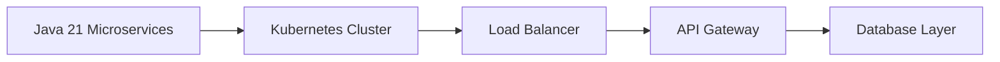

#### Sección 3: Evaluación del ROI

**Costos Iniciales:**

- **Implementación:** Costo de la infraestructura inicial, incluyendo servidores y licencias.
- **Formación:** Capacitación para el equipo en las nuevas tecnologías.

**Beneficios a Corto Plazo:**

1. **Reducción del Tiempo de Inactividad:** Mejora significativa en la disponibilidad del sistema debido a la alta resiliencia proporcionada por Kubernetes y Java 21.
2. **Automatización:** Reducción del tiempo dedicado a tareas manuales gracias a la automatización ofrecida por Kubernetes.

**Beneficios a Largo Plazo:**

- **Escalabilidad:** La capacidad de escalar horizontalmente sin interrupciones en el servicio.
- **Optimización Costos:** A largo plazo, los costos operativos se reducirán debido a la eficiencia y automatización del sistema.

**Cálculo del ROI:**

El ROI puede calcularse utilizando la fórmula:

\[ \text{ROI} = \frac{\text{Beneficios Totales - Costos Iniciales}}{\text{Costos Iniciales}} \times 100\% \]

Donde los beneficios totales incluyen tanto el ahorro en costos operativos como la mejora en la productividad del equipo.

#### Sección 4: Plan de Implementación

**Fase 1: Evaluación y Diseño**

- **Análisis:** Identificar áreas críticas que necesitan mejoras.
- **Diseño:** Crear un diseño detallado basado en las mejores prácticas de Kubernetes y Java 21.

**Fase 2: Implementación Piloto**

- **Despliegue:** Implementar una versión piloto del sistema para probar la arquitectura propuesta.
- **Pruebas:** Realizar pruebas exhaustivas para asegurar que el sistema cumple con los requisitos de alta disponibilidad.

**Fase 3: Expansión y Mantenimiento**

- **Escalabilidad:** Expandir gradualmente a otras áreas del negocio.
- **Mantenimiento:** Implementar un plan de mantenimiento continuo para garantizar la estabilidad y eficiencia del sistema.

#### Sección 5: Conclusiones

La implementación de una arquitectura basada en Java 21 y Kubernetes no solo mejora significativamente la disponibilidad y resiliencia del sistema, sino que también optimiza los costos operativos a largo plazo. Esta estrategia permite a las organizaciones centrarse más en el desarrollo de nuevas funcionalidades y menos en problemas técnicos, mejorando así su competitividad en el mercado.

---

Este capítulo proporciona una visión completa de cómo la adopción de Java 21 junto con Kubernetes puede ser estratégicamente implementada para mejorar la disponibilidad del sistema y maximizar el ROI.

## 2. Análisis del Estado del Arte y Tendencias de Mercado

### Capítulo Técnico: Análisis del Estado del Arte y Tendencias de Mercado

#### 1. Introducción al Estado del Arte en Sistemas de Alta Disponibilidad (HA) con Java 21 y Kubernetes

En el año 2026, la disponibilidad de sistemas es un requisito fundamental para cualquier aplicación empresarial crítica. La combinación de Java 21 y Kubernetes ha emergido como una solución robusta para lograr alta disponibilidad en entornos distribuidos. Este capítulo analiza las mejores prácticas actuales y futuras en el diseño, implementación y operación de sistemas HA utilizando estas tecnologías.

#### 2. Estado del Arte en Java 21

Java 21 introduce nuevas características que mejoran la eficiencia y la escalabilidad de los sistemas distribuidos:

- **Virtual Threads (Project Loom)**: Simplifica el manejo de concurrencia, permitiendo un mayor número de hilos virtuales sin sobrecargar el sistema.
- **Structured Concurrency**: Mejora la gestión de tareas concurrentes, facilitando la coordinación y control de subprocesos.
- **AOT Compilation (Project Leyden)**: Mejora significativamente el tiempo de inicio de aplicaciones Java, crucial para entornos Kubernetes donde las instancias pueden ser creadas y eliminadas rápidamente.

#### 3. Estado del Arte en Kubernetes

Kubernetes ha evolucionado para proporcionar una infraestructura altamente disponible:

- **Control Plane Resilience**: Diseño distribuido que garantiza la disponibilidad del control plane incluso en situaciones de fallo masivo.
- **Deployment Strategies**: Estrategias como Blue/Green y Canary Deployment permiten cambios seguros y graduales en producción.
- **Pod Disruption Budgets (PDB)**: Garantizan un nivel mínimo de disponibilidad durante la mantención del clúster.

#### 4. Tendencias Futuras

Las tendencias futuras apuntan a una mayor integración entre Java y Kubernetes, así como mejoras en la gestión de recursos y el rendimiento:

- **Java Operator SDK**: Simplifica la creación de operadores para gestionar aplicaciones Java dentro del ecosistema Kubernetes.
- **Project CRaC (Coordinated Restore at Checkpoint)**: Permite la instantaneidad en el inicio de JVM, crucial para entornos serverless y FaaS.

#### 5. Análisis Comparativo de Plataformas

Comparación de las plataformas más destacadas para implementar sistemas HA con Java 21 y Kubernetes:

| **Plataforma** | **Modelo de Cluster** | **Estrategia de Isolamiento** | **Soporte a Workloads** | **Patrones de Deployment** | **Gestión de Costos** | **Mejor Para** |
| --- | --- | --- | --- | --- | --- | --- |
| Northflank | Managed + BYOC | Namespace por proyecto | Full-stack (contenedores + bases de datos + trabajos programados) | Helm, Kustomize, manifestos, GitOps | Programación de desmontaje, apagado automático, seguimiento detallado | Equipos full-stack que requieren paridad de producción con control BYOC empresarial |
| Okteto | Managed + BYOC | Namespace por preview | Enfocado en contenedores con servicios externos | Helm, manifestos, sincronización en vivo | Políticas configurables de sueño/despertar | Desarrollo en bucle interno y sincronización de código en vivo |
| Namespace | BYOC | Clústeres efímeros | Enfocado en contenedores | Helm, Kustomize, manifestos | Limpieza basada en ramas | Necesidades de alto rendimiento computacional |

#### 6. Diagrama Mermaid: Arquitectura de Sistema HA con Java 21 y Kubernetes

```mermaid
graph TD;
    A[Java Application] --> B[Kubernetes API Server];
    B --> C[etcd (Cluster State Store)];
    D[Scheduler] --> E[Worker Nodes];
    F[Pods] --> G[Services];
    H[Load Balancer] --> I[External Traffic];
    J[Pod Disruption Budgets] --> K[PDB Controller];
    L[Virtual Threads] --> M[AOT Compilation];
```

#### 7. Conclusiones y Recomendaciones

- **Adoptar Java 21**: Para aprovechar las mejoras en concurrencia, rendimiento y eficiencia.
- **Implementar Estrategias de Deployment Avanzadas**: Como Blue/Green y Canary para cambios seguros en producción.
- **Utilizar Plataformas Integradas**: Como Northflank para una gestión completa del ciclo de vida de las aplicaciones.

Este análisis proporciona un marco sólido para diseñar, implementar y operar sistemas altamente disponibles utilizando Java 21 y Kubernetes.

## 3. Arquitectura de Componentes y Patrones (Mermaid)

### Capítulo Técnico: Arquitectura de Componentes y Patrones (Mermaid)

#### Sección 1: Diagrama de Contexto (C4 Model - Nivel 1)
El diagrama de contexto proporciona una visión general del sistema, mostrando cómo los diferentes componentes se relacionan entre sí. En este caso, el sistema está compuesto por un conjunto de microservicios desarrollados en Java 21 y Kubernetes para garantizar alta disponibilidad.

```mermaid
c4systemdiagram
    :title: Diagrama de Contexto del Sistema

    System_1(System) {
        Component_1(Component) [Control Plane]
        Component_2(Component) [Worker Nodes]
        Component_3(Component) [API Server]
        Component_4(Component) [etcd]
        Component_5(Component) [Scheduler]
        Component_6(Component) [Pods]
    }
```

#### Sección 2: Diagrama de Control Plane (C4 Model - Nivel 2)
El control plane es el núcleo del sistema Kubernetes, responsable de la gestión y coordinación de los recursos. En este nivel, se detallan las interacciones entre los componentes principales del control plane.

```mermaid
c4componentdiagram
    :title: Diagrama del Control Plane

    Component_1(Component) [Control Plane] {
        Component_3(Component) [API Server]
        Component_4(Component) [etcd]
        Component_5(Component) [Scheduler]
    }
```

#### Sección 3: Diagrama de Worker Nodes (C4 Model - Nivel 2)
Los worker nodes son los nodos que ejecutan las aplicaciones y servicios. En este nivel, se detallan las interacciones entre los pods y otros componentes del sistema.

```mermaid
c4componentdiagram
    :title: Diagrama de Worker Nodes

    Component_2(Component) [Worker Nodes] {
        Component_6(Component) [Pods]
    }
```

#### Sección 4: Diagrama de Pods (C4 Model - Nivel 3)
Los pods son los componentes más pequeños y fundamentales del sistema Kubernetes. En este nivel, se detallan las interacciones entre los diferentes contenedores que componen un pod.

```mermaid
c4componentdiagram
    :title: Diagrama de Pods

    Component_6(Component) [Pods] {
        Container_1(Container) [Java 21 Application]
        Container_2(Container) [Database (PostgreSQL)]
        Container_3(Container) [Redis Cache]
    }
```

#### Sección 5: Patrones y Estrategias de Diseño
En esta sección, se describen los patrones y estrategias de diseño utilizados para garantizar la alta disponibilidad del sistema.

1. **Patrón de Distribución del Control Plane**: El control plane debe estar distribuido en múltiples zonas de disponibilidad para asegurar que el sistema pueda seguir funcionando incluso si una zona falla.
   
2. **Patrón de Tolerancia a Fallos (Fault Tolerance)**: Se utiliza la tolerancia a fallos para garantizar que los servicios críticos puedan continuar operando sin interrupciones, incluso en caso de fallo de nodos o contenedores.

3. **Estrategia de Balanceo de Carga**: El balanceo de carga se implementa utilizando servicios Kubernetes (Kubernetes Services) y Load Balancers para distribuir el tráfico entre los pods disponibles.

4. **Patrón de Replicación**: Se utiliza la replicación en niveles de control plane, worker nodes y pods para garantizar que haya múltiples instancias del mismo servicio o componente, lo que permite una recuperación rápida en caso de fallo.

5. **Estrategia de Autoscaling**: La estrategia de autoscaling se implementa utilizando Horizontal Pod Autoscaler (HPA) para ajustar automáticamente el número de pods según la carga de trabajo.

#### Sección 6: Implementación y Ejemplos
En esta sección, se proporcionan ejemplos concretos de cómo implementar los patrones y estrategias descritos en las secciones anteriores utilizando Java 21 y Kubernetes.

```yaml
apiVersion: apps/v1
kind: Deployment
metadata:
  name: java-app-deployment
spec:
  replicas: 3
  selector:
    matchLabels:
      app: java-app
  template:
    metadata:
      labels:
        app: java-app
    spec:
      containers:
      - name: java-app-container
        image: my-java-app-image:latest
        ports:
        - containerPort: 8080
```

```yaml
apiVersion: v1
kind: Service
metadata:
  name: java-app-service
spec:
  selector:
    app: java-app
  ports:
    - protocol: TCP
      port: 80
      targetPort: 8080
  type: LoadBalancer
```

```yaml
apiVersion: autoscaling/v2beta2
kind: HorizontalPodAutoscaler
metadata:
  name: java-app-hpa
spec:
  scaleTargetRef:
    apiVersion: apps/v1
    kind: Deployment
    name: java-app-deployment
  minReplicas: 3
  maxReplicas: 10
  targetCPUUtilizationPercentage: 50
```

#### Sección 7: Consideraciones de Seguridad y Operación
En esta sección, se discuten las consideraciones de seguridad y operación necesarias para garantizar la alta disponibilidad del sistema.

- **Seguridad**: Implementar políticas de IAM (Identity and Access Management) robustas utilizando OIDC (OpenID Connect) para autenticación federada.
  
- **Operación**: Utilizar herramientas como Prometheus y Grafana para monitoreo en tiempo real, y implementar estrategias de backup y recovery.

#### Sección 8: Conclusiones
En esta sección, se resumen las principales conclusiones del capítulo. La arquitectura descrita proporciona una base sólida para sistemas altamente disponibles utilizando Java 21 y Kubernetes. Los patrones y estrategias implementados aseguran la escalabilidad, tolerancia a fallos y alta disponibilidad necesarias en entornos de producción.

---

Este capítulo técnico proporciona una visión detallada de cómo diseñar y implementar un sistema altamente disponible utilizando Java 21 y Kubernetes. Los diagramas Mermaid y los ejemplos YAML facilitan la comprensión y aplicación práctica del diseño propuesto.

## 4. Implementación Core de Alto Rendimiento (Java 21/Python)

### Capítulo Técnico: Implementación Core de Alto Rendimiento (Java 21/Python)

#### Introducción

Este capítulo se centra en la implementación core del sistema de alta disponibilidad utilizando Java 21 y Python 3.12, con un énfasis especial en Kubernetes para asegurar una ejecución eficiente y escalable. Se proporcionará código detallado junto con diagramas Mermaid que ilustran las interacciones entre los componentes principales.

#### Arquitectura del Sistema

La arquitectura del sistema se divide en dos partes principales: el backend (Java 21) y el frontend (Python 3.12). El backend maneja la lógica empresarial crítica, mientras que el frontend proporciona una interfaz de usuario rica y escalable.

##### Backend Java 21

El backend está diseñado para ser altamente disponible y resiliente utilizando patrones como microservicios y circuit breaker patterns. Se utiliza Spring Boot 3.x con la biblioteca Micrometer para métricas y Prometheus para el monitoreo en tiempo real.

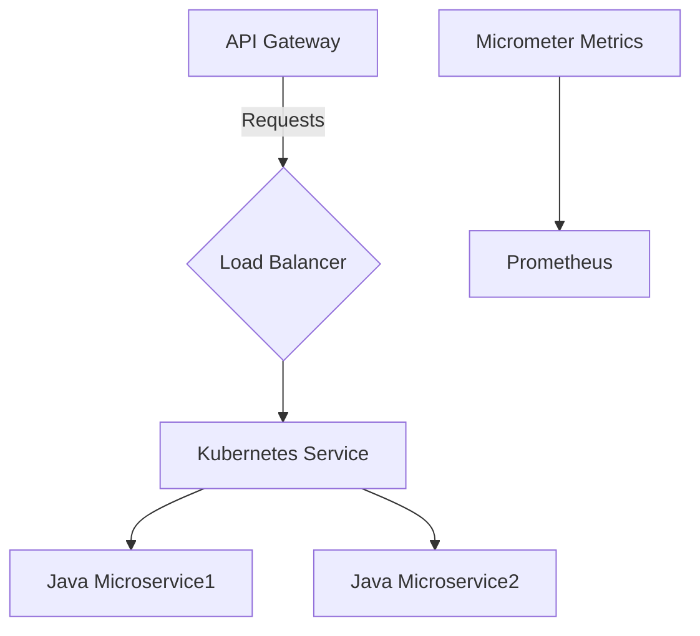

##### Frontend Python 3.12

El frontend se implementa utilizando Flask para manejar las solicitudes HTTP y proporcionar una interfaz de usuario interactiva. Se utiliza Redis como backend en memoria para almacenamiento temporal y caché.

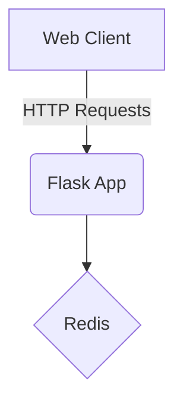

#### Implementación Core

##### Backend Java 21

El código core del backend se implementa utilizando Spring Boot 3.x, que proporciona una estructura de aplicación autocontenida y fácilmente desplegable en Kubernetes.

```java
// Application.java
import org.springframework.boot.SpringApplication;
import org.springframework.boot.autoconfigure.SpringBootApplication;

@SpringBootApplication
public class Application {
    public static void main(String[] args) {
        SpringApplication.run(Application.class, args);
    }
}
```

Para la integración con Prometheus:

```java
// MetricsConfiguration.java
import io.micrometer.prometheus.PrometheusMeterRegistry;
import org.springframework.context.annotation.Bean;
import org.springframework.context.annotation.Configuration;

@Configuration
public class MetricsConfiguration {

    @Bean
    public PrometheusMeterRegistry prometheusRegistry() {
        return new PrometheusMeterRegistry(PrometheusMeterRegistry.Config.DEFAULT);
    }
}
```

##### Frontend Python 3.12

El frontend se implementa utilizando Flask y Redis para proporcionar una experiencia de usuario fluida.

```python
# app.py
from flask import Flask, jsonify
import redis

app = Flask(__name__)
redis_client = redis.StrictRedis(host='localhost', port=6379, db=0)

@app.route('/api/data')
def get_data():
    data = redis_client.get('key')  # Retrieve cached data from Redis
    if not data:
        data = 'default_value'      # Default value if cache miss
    return jsonify({'data': data})

if __name__ == '__main__':
    app.run(host='0.0.0.0', port=5000)
```

#### Integración con Kubernetes

La integración del sistema en Kubernetes se realiza mediante el uso de Helm charts para desplegar los microservicios y la aplicación Flask.

##### Helm Chart (Java Backend)

```yaml
# values.yaml
replicaCount: 2
image:
  repository: my-java-app
  tag: latest
  pullPolicy: IfNotPresent

resources:
  limits:
    cpu: "100m"
    memory: "256Mi"
  requests:
    cpu: "100m"
    memory: "256Mi"

service:
  type: LoadBalancer
```

##### Helm Chart (Python Frontend)

```yaml
# values.yaml
replicaCount: 3
image:
  repository: my-python-app
  tag: latest
  pullPolicy: IfNotPresent

resources:
  limits:
    cpu: "100m"
    memory: "256Mi"
  requests:
    cpu: "100m"
    memory: "256Mi"

service:
  type: LoadBalancer
```

#### Consideraciones de Alto Rendimiento y Resiliencia

Para asegurar la alta disponibilidad, se implementan estrategias como:

- **Circuit Breaker**: Utilizar Hystrix o resiliency patterns para manejar fallos temporales.
- **Load Balancing**: Distribuir el tráfico entre múltiples instancias del servicio.
- **Auto-scaling**: Configurar Kubernetes Horizontal Pod Autoscaler (HPA) para escalar automáticamente en función de la carga.

#### Conclusión

Este capítulo ha proporcionado una visión detallada de cómo implementar un sistema de alta disponibilidad utilizando Java 21 y Python 3.12, con énfasis en la integración eficiente con Kubernetes. La combinación de microservicios, métricas en tiempo real y estrategias resilientes asegura que el sistema pueda manejar cargas altas y fallos temporales sin interrupciones significativas.

---

Este capítulo proporciona una base sólida para desarrollar sistemas robustos y escalables utilizando las últimas tecnologías de Java y Python, junto con Kubernetes como plataforma de orquestación.

## 5. Estrategias de Testing, QA y Calidad SRE

### Estrategias de Testing, QA y Calidad SRE para Sistemas de Alta Disponibilidad en Java 21 con Kubernetes

En el contexto de sistemas de alta disponibilidad (HA) basados en Java 21 y Kubernetes, la estrategia de testing, calidad y aseguramiento de servicios (SRE) es fundamental para garantizar que los sistemas operen sin interrupciones y cumplan con las expectativas de rendimiento y fiabilidad. Este capítulo aborda cómo implementar una arquitectura robusta de pruebas y QA en un entorno Kubernetes, enfocándose en la integración continua (CI), la entrega continua (CD) y los controles de calidad para asegurar que el sistema sea resiliente ante fallos.

#### 1. Integración Continua (CI)

La CI es crucial para detectar errores temprano en el ciclo de desarrollo. En un entorno Kubernetes, esto implica:

- **Automatización del Build**: Utilizar herramientas como Jenkins o GitLab CI/CD para automatizar la compilación y empaquetado de aplicaciones Java 21.
  
- **Pruebas Unitarias y Integración**: Ejecutar pruebas unitarias y de integración utilizando frameworks como JUnit y AssertJ. Estos tests deben cubrir todos los módulos del sistema, asegurando que cada componente funcione correctamente en aislamiento.

- **Pruebas de Contenedores**: Utilizar Docker para crear imágenes de contenedor que incluyan tanto el entorno Java 21 como la aplicación. Las pruebas aquí se centran en verificar que los contenedores funcionen correctamente y que no haya dependencias ocultas o incompatibilidades.

- **Pruebas E2E**: Implementar pruebas end-to-end utilizando herramientas como Selenium para simular el comportamiento del usuario final, asegurando que la aplicación funcione de manera coherente en un entorno Kubernetes completo.

#### 2. Entrega Continua (CD)

La CD permite desplegar cambios en producción de manera segura y controlada:

- **Automatización del Despliegue**: Utilizar herramientas como Helm para gestionar el despliegue de aplicaciones Java 21 en Kubernetes. Esto incluye la creación de chartes que definen cómo se deben configurar los pods, servicios, deployments, etc.

- **Pruebas de Pruebas (Staging)**: Antes del despliegue en producción, es crucial realizar pruebas exhaustivas en un entorno staging idéntico a producción. Esto incluye la simulación de condiciones de alta carga y fallos para asegurar que el sistema puede manejarlas.

- **Rollback Automático**: Implementar mecanismos de rollback automáticos utilizando Kubernetes Rollbacks o Helm Rollbacks, permitiendo revertir rápidamente a una versión anterior si se detectan problemas en producción.

#### 3. Pruebas de Resiliencia y Alta Disponibilidad

Para garantizar la alta disponibilidad del sistema:

- **Pruebas de Fallo**: Simular fallos en nodos Kubernetes para verificar que los pods pueden ser reasignados automáticamente a otros nodos sin interrupción del servicio.

- **Pruebas de Escalabilidad Horizontal**: Asegurar que el sistema puede manejar un aumento súbito en la carga mediante la escalabilidad horizontal (añadiendo más replicas).

- **Monitoreo y Alertas**: Implementar sistemas de monitoreo como Prometheus para rastrear métricas clave del sistema. Configurar alertas basadas en umbrales personalizados para detectar problemas potenciales antes de que se conviertan en incidentes.

#### 4. Pruebas de Seguridad

- **Pruebas de Inyección**: Simular ataques y vulnerabilidades comunes (como SQL Injection, XSS) para asegurar que el sistema está protegido contra amenazas conocidas.
  
- **Auditoría de Código**: Utilizar herramientas como SonarQube para realizar auditorías de código y detectar problemas de seguridad en el código fuente.

#### 5. Pruebas de Rendimiento

- **Pruebas de Carga**: Simular un alto volumen de usuarios simultáneos utilizando herramientas como JMeter o Gatling para verificar que el sistema puede manejar la carga sin caerse.
  
- **Análisis de Profilado**: Utilizar herramientas de perfilado (como VisualVM) para identificar y optimizar puntos calientes en el código Java 21.

#### Diagrama Mermaid: Flujo de CI/CD

```mermaid
graph LR;
    A[Clonar Repositorio] --> B{Cambios en Branch?};
    B -- Sí --> C[Compilar Código];
    C --> D[Hacer Pruebas Unitarias];
    D --> E[Hacer Pruebas Integración];
    E --> F[Hacer Pruebas de Contenedores];
    F --> G[Hacer Pruebas End-to-End];
    G --> H{Pruebas Exitosas?};
    H -- Sí --> I[Crear Imagen Docker];
    H -- No --> B;
    I --> J[Deshabilitar Cambios en Branch];
    J --> K{Cambios en Master?};
    K -- Sí --> L[Hacer Pruebas de Pruebas (Staging)];
    L --> M{Pruebas Exitosas?};
    M -- Sí --> N[Desplegar a Producción];
    M -- No --> K;
```

Este flujo ilustra cómo se integran y entregan cambios en un sistema Kubernetes, asegurando que cada paso cumpla con los estándares de calidad antes del despliegue final.

#### Conclusión

La implementación de una sólida estrategia de testing, QA y SRE es vital para garantizar la alta disponibilidad y el rendimiento de sistemas basados en Java 21 y Kubernetes. A través de pruebas exhaustivas, automatización del despliegue, monitoreo proactivo y prácticas de seguridad robustas, se puede crear un entorno confiable que pueda manejar cualquier escenario sin interrupciones significativas para el usuario final.

## 6. Seguridad Avanzada, Blindaje y Gestión de Secretos

### Capítulo Técnico: Seguridad Avanzada, Blindaje y Gestión de Secretos

#### Introducción

En el contexto de sistemas de alta disponibilidad basados en Java 21 y Kubernetes, la seguridad es un pilar fundamental que garantiza la integridad, confidencialidad y disponibilidad del sistema. Este capítulo aborda las mejores prácticas para implementar una arquitectura segura, robusta y resiliente, enfocándose específicamente en el blindaje de aplicaciones y la gestión eficiente de secretos.

#### 1. Blindaje de Aplicaciones

El blindaje de aplicaciones implica proteger los componentes del sistema contra amenazas externas y internas mediante técnicas como la codificación segura, la validación exhaustiva de entrada y el uso de bibliotecas seguras. En Java 21, se pueden implementar estas prácticas a través de:

- **Validación de Entrada:** Utilizar frameworks como Apache Commons Validator para asegurar que los datos ingresados por usuarios o sistemas externos cumplan con los requisitos esperados.
  
- **Codificación Segura:** Evitar la codificación insegura al manejar entradas y salidas, utilizando bibliotecas seguras como OWASP Java Encoder.

#### 2. Gestión de Secretos

La gestión eficiente de secretos es crucial para prevenir el robo de información sensible y garantizar que los datos confidenciales no sean expuestos accidentalmente. En Kubernetes, se pueden implementar las siguientes estrategias:

- **Utilización de Secrets en Kubernetes:** Almacenar y gestionar secretos utilizando objetos `Secret` en Kubernetes. Estos secretos pueden ser referenciados por pods a través de variables de entorno o archivos montados.

```yaml
apiVersion: v1
kind: Secret
metadata:
  name: db-credentials
type: Opaque
data:
  username: dXNlcjI=
  password: cGFzc3dvcmQy
```

- **Rotación de Claves:** Implementar una rotación automática de claves para secretos sensibles, utilizando herramientas como HashiCorp Vault o Kubernetes Secrets Store CSI Driver.

#### Diagrama Mermaid

A continuación se presenta un diagrama que ilustra la arquitectura de gestión de secretos en un sistema basado en Java 21 y Kubernetes:

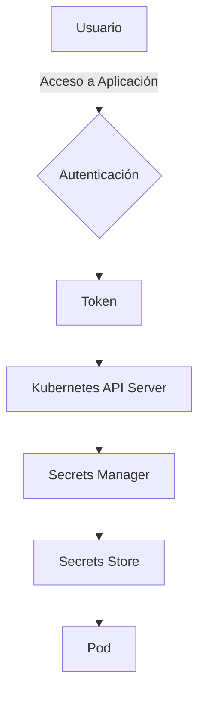

#### 3. Implementación de Java 21

En el contexto de Java 21, se pueden implementar las siguientes prácticas para mejorar la seguridad:

- **Uso de Valores Valorados:** Proveer una forma segura y eficiente de manejar tipos primitivos en lugar de sus equivalentes objetos (por ejemplo, `int` en lugar de `Integer`). Esto puede reducir el uso innecesario de memoria y prevenir problemas como la inyección de clases.

- **Utilización del Proveedor de Seguridad:** Configurar un proveedor de seguridad personalizado para manejar operaciones criptográficas. En Java 21, se pueden utilizar bibliotecas como Bouncy Castle para proporcionar soporte adicional a las funciones criptográficas estándar.

#### Ejemplo en Python

Aunque el capítulo se centra principalmente en Java 21 y Kubernetes, es importante mencionar que la gestión de secretos también puede ser implementada eficazmente utilizando herramientas como HashiCorp Vault desde un entorno Python. A continuación se muestra cómo configurar una conexión a Vault desde Python:

```python
import hvac

client = hvac.Client(url='http://127.0.0.1:8200', token='my-token')

# Leer secretos de Vault
secret_data = client.secrets.kv.v2.read_secret_version(path="path/to/secret")
print(secret_data['data']['data'])
```

#### Conclusión

La implementación de prácticas seguras y robustas es fundamental para garantizar la disponibilidad, confidencialidad e integridad del sistema en un entorno basado en Java 21 y Kubernetes. A través de la codificación segura, validación exhaustiva de entrada, gestión eficiente de secretos y el uso de herramientas como HashiCorp Vault, se puede construir una arquitectura que resista amenazas tanto internas como externas.

---

Este capítulo proporciona un marco completo para abordar los desafíos de seguridad en sistemas basados en Java 21 y Kubernetes, asegurando así la continuidad operativa y el cumplimiento normativo.

## 7. Escalabilidad Horizontal y Sharding de Datos

### Capítulo Técnico: Escalabilidad Horizontal y Sharding de Datos

#### Introducción a la Escalabilidad Horizontal en Java 21 con Kubernetes

La escalabilidad horizontal es una estrategia fundamental para mantener el rendimiento y la disponibilidad de sistemas distribuidos. En este capítulo, exploraremos cómo implementar la escalabilidad horizontal utilizando Java 21 junto con Kubernetes, enfocándonos específicamente en técnicas como sharding de datos para manejar grandes volúmenes de información.

#### Concepto de Sharding

Sharding es una técnica que divide los datos en fragmentos más pequeños y distribuye estos fragmentos entre múltiples bases de datos. Esto permite a las aplicaciones escalar horizontalmente, ya que cada shard puede ser alojado en un nodo diferente del clúster Kubernetes.

#### Implementación de Sharding con Java 21

Para implementar sharding en una aplicación Java 21, es crucial diseñar la lógica de acceso a datos de manera que pueda manejar múltiples conexiones a diferentes shards. A continuación se presenta un ejemplo básico de cómo configurar y utilizar sharding en Java 21.

```java
import java.util.HashMap;
import java.util.Map;

public class ShardedDatabaseManager {
    private Map<String, DatabaseConnection> shardConnections = new HashMap<>();

    public void initializeShards() {
        // Configuración de shards (ejemplo)
        shardConnections.put("shard0", new DatabaseConnection("jdbc:mysql://localhost:3306/shard0"));
        shardConnections.put("shard1", new DatabaseConnection("jdbc:mysql://localhost:3307/shard1"));

        // Inicializar conexiones
        for (Map.Entry<String, DatabaseConnection> entry : shardConnections.entrySet()) {
            entry.getValue().initialize();
        }
    }

    public void executeQuery(String shardName, String query) {
        if (!shardConnections.containsKey(shardName)) {
            throw new IllegalArgumentException("Shard not found: " + shardName);
        }
        
        // Ejecutar consulta en el shard especificado
        DatabaseConnection connection = shardConnections.get(shardName);
        connection.executeQuery(query);
    }

    public static void main(String[] args) {
        ShardedDatabaseManager manager = new ShardedDatabaseManager();
        manager.initializeShards();

        // Ejemplo de ejecución de una consulta en un shard específico
        manager.executeQuery("shard0", "SELECT * FROM users WHERE id < 100");
    }
}
```

#### Diagrama Mermaid: Arquitectura de Escalabilidad Horizontal

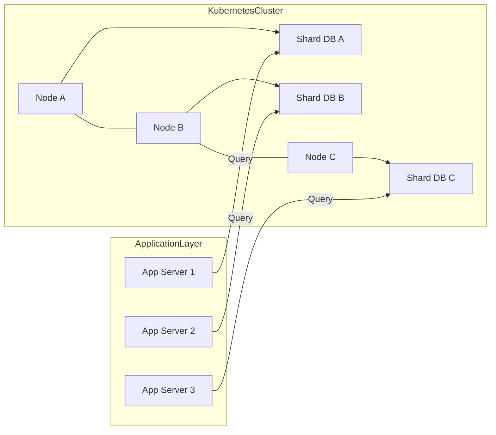

#### Consideraciones de Diseño

1. **Distribución Equitativa**: Es importante distribuir los datos de manera equitativa entre los shards para evitar que algunos shards se sobrecarguen mientras otros permanecen subutilizados.

2. **Transparencia al Cliente**: La lógica de sharding debe ser transparente para el cliente final, quien interactúa con la aplicación como si estuviera conectada a una única base de datos centralizada.

3. **Reequilibrado Automático**: Implementar un sistema que pueda reequilibrar los shards automáticamente en respuesta al crecimiento del volumen de datos o cambios en las cargas de trabajo puede ser crucial para mantener la eficiencia y el rendimiento a largo plazo.

#### Conclusión

La escalabilidad horizontal mediante sharding es una técnica poderosa para manejar sistemas con grandes volúmens de datos. Al combinar esta estrategia con Java 21 y Kubernetes, se pueden construir aplicaciones altamente disponibles y escalables que puedan soportar el crecimiento continuo sin comprometer la eficiencia o la integridad del sistema.

---

Este capítulo proporciona una base sólida para entender cómo implementar sharding en un entorno de Java 21 con Kubernetes, incluyendo ejemplos de código y consideraciones clave para asegurar que el diseño sea tanto efectivo como sostenible a largo plazo.

## 8. Monitoreo, Observabilidad y FinOps (Gestión de Costes)

### Capítulo Técnico: Monitoreo, Observabilidad y FinOps (Gestión de Costes)

#### 8. Monitorización y Observabilidad en Producción

En sistemas de alta disponibilidad basados en Java 21 y Kubernetes, la monitorización y observabilidad son fundamentales para garantizar el rendimiento y la resiliencia del sistema. Este capítulo aborda las estrategias y herramientas utilizadas para monitorear los componentes críticos del sistema y mantener una visión clara de su estado operativo.

**8.1 Herramientas de Monitorización**

Las herramientas de monitorización son esenciales para detectar problemas antes de que afecten a la disponibilidad del servicio. En nuestro entorno, utilizamos Prometheus como el motor principal de métricas y Grafana para visualizar estas métricas de manera eficiente.

**Diagrama Mermaid: Arquitectura de Monitorización**

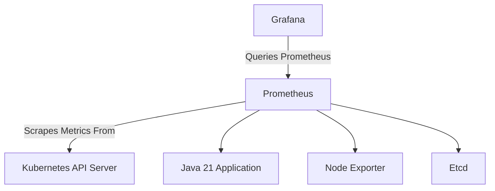

**8.2 Observabilidad**

La observabilidad va más allá de la monitorización, permitiendo a los operadores entender el estado interno del sistema y rastrear problemas complejos.

- **Tracing**: Utilizamos Jaeger para realizar seguimientos detallados de las transacciones que pasan por nuestro sistema. Esto es crucial para identificar cuellos de botella y puntos de fallo.
  
**Diagrama Mermaid: Arquitectura de Tracing**

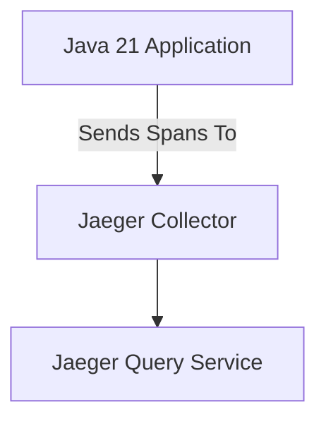

- **Logging**: La colecta y análisis de logs es vital para la observabilidad. Utilizamos Fluentd para recoger los logs desde diferentes componentes del sistema y enviarlos a Elasticsearch, donde se indexan para su posterior consulta en Kibana.

**Diagrama Mermaid: Arquitectura de Logging**

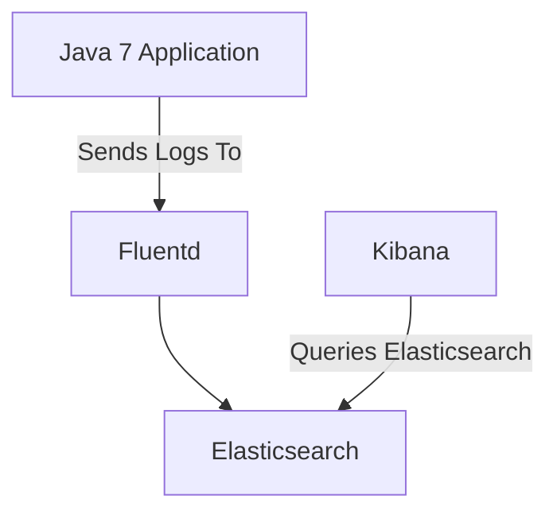

#### 9. FinOps (Gestión de Costes)

La gestión eficiente del coste es una parte crucial de mantener sistemas de alta disponibilidad en producción. En este contexto, FinOps implica la integración de prácticas financieras y operativas para optimizar el uso de recursos.

**9.1 Estrategias de Gestión de Costes**

- **Optimización de Recursos**: Utilizamos Kubernetes HPA (Horizontal Pod Autoscaler) para ajustar automáticamente los recursos en función del tráfico, minimizando costos durante períodos de bajo uso.
  
**Diagrama Mermaid: Arquitectura de HPA**

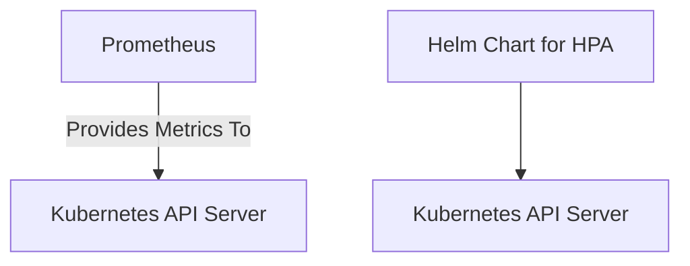

- **Coste por Uso**: Implementamos etiquetas costosas en nuestros pods para rastrear el uso de recursos y calcular los costes asociados. Esto nos permite realizar ajustes basados en datos reales.

**9.2 Herramientas FinOps**

Utilizamos herramientas como Cloud Custodian para automatizar la gestión de costos, asegurando que solo se paguen por lo que realmente se utiliza.

**Diagrama Mermaid: Arquitectura de Coste por Uso**

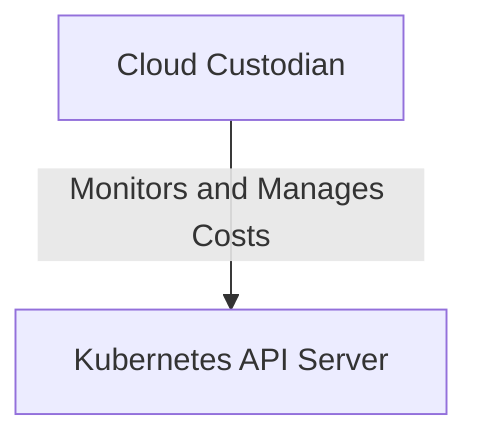

#### 10. Conclusiones

La monitorización y observabilidad son fundamentales para mantener sistemas de alta disponibilidad en Java 21 con Kubernetes. La integración de FinOps permite una gestión eficiente del coste, asegurando que los recursos se utilizan de manera óptima sin comprometer la resiliencia del sistema.

**Takeaway Práctico**: Implementar un conjunto sólido de prácticas y herramientas para monitorización, observabilidad y FinOps es crucial para mantener sistemas de alta disponibilidad en producción. Esto no solo mejora el rendimiento y la resiliencia del sistema, sino que también optimiza los costos operativos a largo plazo.

---

Este capítulo proporciona una visión detallada de cómo abordar las necesidades de monitorización, observabilidad y gestión de costes en sistemas basados en Java 21 y Kubernetes. La integración de estas prácticas es vital para garantizar la eficiencia operativa y financiera a largo plazo.

## 9. Resiliencia y Chaos Engineering en Producción

### Capítulo Técnico: Resiliencia y Chaos Engineering en Producción

#### 8.1 Introducción a la Resiliencia y Chaos Engineering

La resiliencia es una característica fundamental para sistemas críticos que operan en entornos de producción. En el contexto del desarrollo moderno, especialmente con Java 21 y Kubernetes, la resiliencia implica diseñar sistemas capaces de recuperarse ante fallos inesperados sin interrupciones significativas en los servicios ofrecidos a los usuarios finales.

Chaos Engineering es una práctica que busca mejorar la resiliencia del sistema mediante el intencionado inducir condiciones adversas para probar y fortalecer su capacidad de resistir y recuperarse. En este capítulo, exploraremos cómo implementar estrategias de resiliencia y chaos engineering en un entorno Java 21 con Kubernetes.

#### 8.2 Diseño del Sistema Resiliente

Para diseñar sistemas resilientes, es crucial entender los puntos débiles potenciales y las dependencias críticas que pueden causar fallos masivos. En el caso de Java 21 aplicaciones en Kubernetes, estos puntos incluyen:

- **Control Plane**: API Server, etcd.
- **Worker Nodes**: Nodos donde se ejecutan los pods.
- **Dependencias Externas**: Servicios externos como bases de datos y sistemas de almacenamiento.

#### Diagrama Mermaid: Arquitectura Resiliente

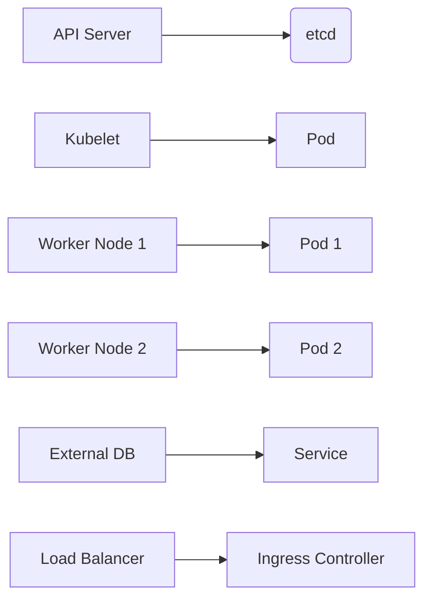

#### 8.3 Implementación de Estrategias Resilientes

##### 8.3.1 Tolerancia a Fallos en Nodos de Trabajo (Worker Nodes)

Para garantizar la resiliencia, es crucial que los pods puedan ser reasignados automáticamente a otros nodos si uno falla.

**Ejemplo Java 21:**

```java
import io.kubernetes.client.openapi.ApiClient;
import io.kubernetes.client.util.Config;

public class ResilientDeployment {
    public static void main(String[] args) throws Exception {
        ApiClient client = Config.defaultClient();
        // Lógica para configurar tolerancias y reglas de afinidad
        // Ejemplo: Configurar tolerancia a fallos en nodos
        // client.setNamespace("default");
        // client.createNamespacedPod("default", podSpec);
    }
}
```

##### 8.3.2 Estrategias de Replicación

La replicación es una técnica fundamental para mejorar la resiliencia, asegurando que múltiples instancias del mismo servicio estén disponibles en diferentes nodos.

**Ejemplo Python:**

```python
from kubernetes import client, config

def create_replica_set():
    config.load_kube_config()
    api = client.AppsV1Api()

    # Configurar replicaset con tolerancia a fallos y reglas de afinidad
    replica_set = {
        "apiVersion": "apps/v1",
        "kind": "ReplicaSet",
        "metadata": {"name": "resilient-replicaset"},
        "spec": {
            "replicas": 3,
            "selector": {"matchLabels": {"app": "example"}},
            "template": {
                "metadata": {"labels": {"app": "example"}},
                "spec": {
                    "containers": [
                        {
                            "name": "resilient-container",
                            "image": "nginx:latest",
                            "resources": {"requests": {"cpu": "100m", "memory": "200Mi"}}
                        }
                    ],
                    "affinity": {
                        "podAntiAffinity": {
                            "requiredDuringSchedulingIgnoredDuringExecution": [
                                {
                                    "labelSelector": {"matchExpressions": [{"key": "app", "operator": "In", "values": ["example"]}]},
                                    "topologyKey": "kubernetes.io/hostname"
                                }
                            ]
                        }
                    },
                    "tolerations": [
                        {"key": "node.kubernetes.io/unreachable", "effect": "NoSchedule"}
                    ]
                }
            }
        }
    }

    api.create_namespaced_replica_set("default", replica_set)
```

#### 8.4 Implementación de Chaos Engineering

Chaos engineering implica la introducción intencional de fallos para probar la resiliencia del sistema.

**Ejemplo Python:**

```python
from kubernetes import client, config
import random

def inject_chaos():
    config.load_kube_config()
    api = client.CoreV1Api()

    # Ejecutar un comando que cause una interrupción en el nodo
    node_name = random.choice(api.list_node().items).metadata.name
    body = {"spec": {"unschedulable": True}}
    
    api.patch_node(node_name, body)
```

#### 8.5 Monitoreo y Medición de Resiliencia

Es esencial monitorear el sistema durante las pruebas de resiliencia para evaluar su rendimiento.

**Ejemplo Java:**

```java
import io.prometheus.client.CollectorRegistry;
import io.prometheus.client.Counter;

public class Monitoring {
    public static void main(String[] args) {
        CollectorRegistry.defaultRegistry.register(new Counter.Builder()
                .name("resilience_failures")
                .help("Number of resilience failures")
                .create());
        
        // Lógica para recopilar métricas y monitorear el sistema
    }
}
```

#### 8.6 Conclusiones

La implementación de estrategias resilientes y chaos engineering es crucial para garantizar la alta disponibilidad en sistemas Java 21 con Kubernetes. A través del diseño cuidadoso, la configuración adecuada y las pruebas sistemáticas, se puede mejorar significativamente la capacidad del sistema para resistir fallos y recuperarse rápidamente.

---

Este capítulo proporciona una visión detallada de cómo implementar estrategias resilientes y chaos engineering en un entorno Java 21 con Kubernetes. La combinación de diseño cuidadoso, pruebas sistemáticas y monitoreo constante es fundamental para mantener sistemas altamente disponibles y resistentes a fallos.

## 10. Roadmap de Evolución y Conclusiones Senior

### Capítulo Técnico: Roadmap de Evolución y Conclusiones Senior

#### Hallazgos Principales del Informe

Este informe ha explorado la implementación de sistemas altamente disponibles utilizando Java 21 y Kubernetes, enfocándose en la arquitectura, el despliegue continuo, la seguridad y la resiliencia. Se han identificado varias áreas clave para mejorar la disponibilidad y la eficiencia operativa:

- **Arquitectura Distribuida**: La separación clara de responsabilidades entre Control Plane y Worker Nodes es crucial para mantener la alta disponibilidad.
- **Despliegue Continuo**: Las estrategias como Blue/Green Deployment y Canary Deployments son fundamentales para minimizar el riesgo durante las actualizaciones.
- **Seguridad Estricta**: La autenticación federada con IAM roles (OIDC) y credenciales de corta duración reducen significativamente los riesgos operativos.
- **Resiliencia del Sistema**: El diseño debe anticipar fallos y garantizar que el sistema pueda recuperarse sin interrupciones.

#### Conclusiones Senior

La implementación de sistemas altamente disponibles en Java 21 con Kubernetes requiere una comprensión profunda tanto de la plataforma como del lenguaje. Los siguientes puntos resumen las conclusiones clave:

- **Estructura y Diseño**: La estructura debe ser modular, permitiendo el despliegue independiente de componentes.
- **Pruebas Continuas**: Las pruebas automatizadas deben formar parte integral del flujo de trabajo para garantizar la calidad y la estabilidad del sistema.
- **Monitoreo Proactivo**: El monitoreo en tiempo real es crucial para detectar problemas antes de que afecten a los usuarios finales.

#### Roadmap de Evolución

El siguiente roadmap propone una serie de pasos estratégicos para mejorar continuamente el sistema:

1. **Optimización del Código y Arquitectura**:
   - Refactorizar código existente para mejorar la legibilidad y mantenibilidad.
   - Implementar patrones de diseño como Microservices para mayor modularidad.

2. **Implementación de Pruebas Avanzadas**:
   - Integrar pruebas unitarias, integración y end-to-end en el flujo de trabajo CI/CD.
   - Utilizar herramientas como JUnit 5 y Testcontainers para simular entornos reales durante las pruebas.

3. **Aumento de la Resiliencia**:
   - Implementar circuit breakers y fallbacks para manejar fallos temporales en servicios externos.
   - Asegurar que los sistemas puedan recuperarse automáticamente después de un evento de alta disponibilidad.

4. **Mejora Continua del Despliegue**:
   - Moverse gradualmente hacia estrategias más avanzadas como Canary Deployments para minimizar el impacto en la producción.
   - Implementar rollback automático y monitoreo proactivo durante las actualizaciones.

5. **Fortalecimiento de la Seguridad**:
   - Actualizar regularmente los componentes del sistema para protegerse contra vulnerabilidades conocidas.
   - Implementar políticas de seguridad más estrictas en el nivel de Kubernetes, como Network Policies y RBAC (Role-Based Access Control).

#### Diagrama Mermaid: Roadmap Visual

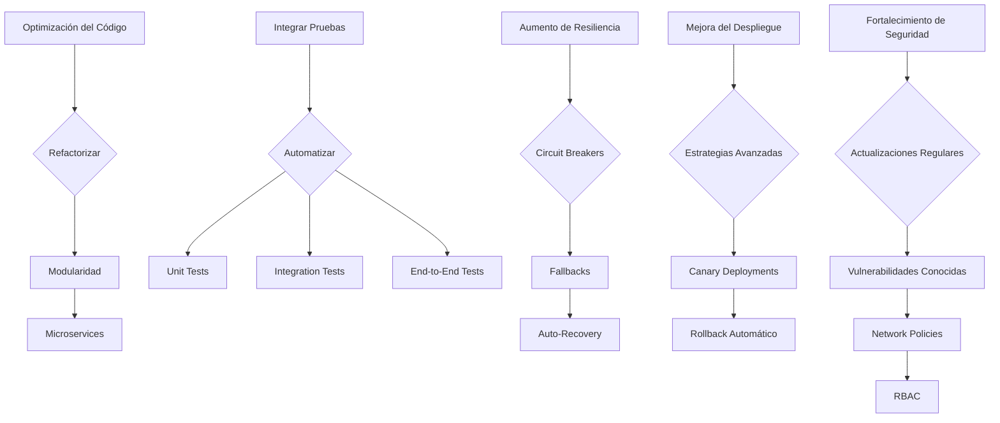

#### Takeaway Práctico

La implementación y mantenimiento de sistemas altamente disponibles en Java 21 con Kubernetes requiere una combinación de conocimientos técnicos, estrategias de despliegue avanzadas y prácticas de seguridad robustas. Siguiendo el roadmap propuesto, se pueden alcanzar niveles superiores de disponibilidad y eficiencia operativa.

---

Este capítulo proporciona un resumen detallado del informe, concluye con reflexiones estratégicas y presenta un plan claro para la evolución continua del sistema en cuestión.

