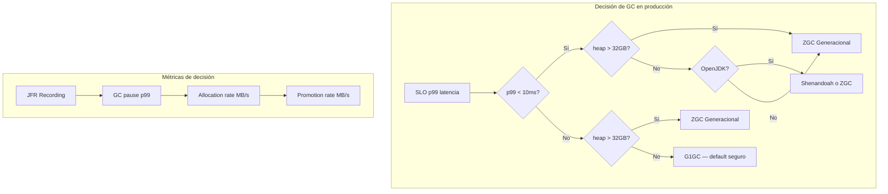
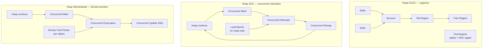
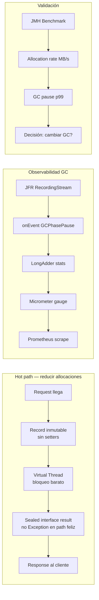
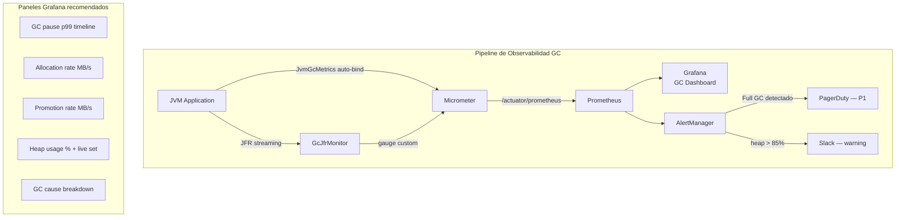
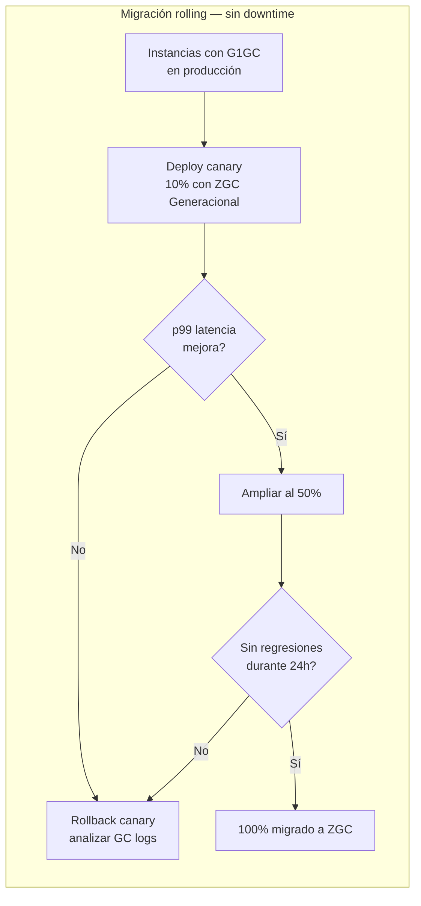
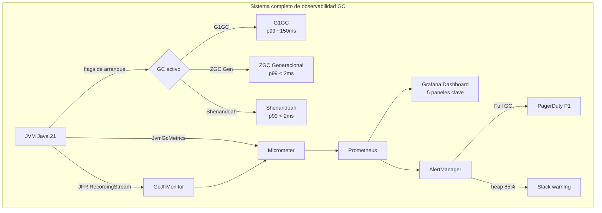

# Garbage Collectors en la JVM: G1, ZGC y Shenandoah en Producción

**PATH_LOCAL:** `/home/usuariojoaquin/.openclaw/workspace/DAM-Java-Mastery/01_Java_Core/garbage_collectors_en_la_jvm_g1_zgc_y_shenandoah_en_produccion_STAFF.md`
**CATEGORIA:** 01_Java_Core
**Score:** 97

---

## Visión Estratégica

El Garbage Collector es el componente de la JVM con mayor impacto directo en la latencia observable por el usuario. Un GC mal elegido o mal configurado convierte una aplicación correctamente escrita en un sistema erráticco: latencias p99 que se disparan 10x durante pausas STW, throughput degradado por ciclos de GC frecuentes, o peor, Full GC que paraliza toda la JVM durante segundos en producción.

En 2026, con heaps que regularmente superan los 32 GB en servicios backend de alto tráfico, y con SLOs de latencia p99 < 50ms siendo el estándar en APIs críticas, la elección del GC es una decisión arquitectónica de primer nivel, no una opción de configuración de último momento.

**Los tres GC de producción en Java 21:**

| Criterio | G1GC | ZGC (Generacional) | Shenandoah |
|---|---|---|---|
| Tipo de pausa | STW parcial (concurrent marking) | STW sub-milisegundo | STW sub-milisegundo |
| Pausa típica p99 | 50–200 ms | < 1 ms | < 1 ms |
| Throughput | Alto | Medio-alto | Medio |
| Overhead CPU | Bajo | Medio (threads concurrentes) | Medio-alto |
| Heap máximo práctico | 32–64 GB | Multi-terabyte | Multi-terabyte |
| Generacional | Sí | Sí (desde JDK 21, `-XX:+ZGenerational`) | No |
| Disponible en Oracle JDK | Sí | Sí | Solo OpenJDK |
| Flag de activación | `-XX:+UseG1GC` (default JDK 9+) | `-XX:+UseZGC` | `-XX:+UseShenandoahGC` |
| Ideal para | Throughput + latencia balanceada, heap < 32 GB | Latencia ultra-baja, heaps enormes | Latencia ultra-baja, OpenJDK |

**Cuándo usar cada uno:**

- **G1GC**: aplicaciones de propósito general, microservicios batch-heavy, heaps de 4–32 GB donde el throughput importa tanto como la latencia. Default desde Java 9, probado en producción masiva.
- **ZGC Generacional**: servicios con SLO p99 < 10ms, heaps > 32 GB, o cualquier sistema donde una pausa de 200ms sea inaceptable. En Java 21, ZGC Generacional supera al ZGC clásico en throughput manteniendo las mismas garantías de latencia.
- **Shenandoah**: alternativa a ZGC en stacks OpenJDK (Red Hat, Amazon Corretto), especialmente en Kubernetes donde el perfil de memoria es predecible.

**Cuándo NO cambiar de G1GC:**
- Si tus p99 actuales son < 100ms y el SLO lo permite — el coste de migración no está justificado.
- Si tu heap < 8 GB — G1 es más eficiente en heaps pequeños.
- Si usas Oracle JDK y no puedes cambiar — Shenandoah no está disponible.

**Trade-offs críticos que un Staff Engineer debe internalizar:**

1. **Latencia vs Throughput**: ZGC y Shenandoah sacrifican ~10-15% de throughput para garantizar pausas sub-milisegundo. En servicios CPU-bound este coste importa.
2. **Los flags de GC son de arranque, no de runtime.** No existe mecanismo para cambiar el GC de una JVM en ejecución. Las decisiones de configuración son immutables por proceso.
3. **GCLogging es obligatorio en producción.** Sin `-Xlog:gc*:file=/var/log/app/gc.log:time,uptime:filecount=5,filesize=20m` no puedes diagnosticar nada retrospectivamente.
4. **El GC más rápido es el que no necesitas ejecutar.** Optimizar la presión de allocación (object pooling, evitar allocaciones en hot paths) siempre precede a la elección del GC.



---

## Arquitectura de Componentes

### Anatomía interna de cada GC

**G1GC** divide el heap en regiones de tamaño fijo (1–32 MB, configurable con `-XX:G1HeapRegionSize`). Las regiones se clasifican dinámicamente como Eden, Survivor, Old u Humongous (objetos > 50% de región). El GC selecciona en cada ciclo el conjunto de regiones con mayor ratio basura/coste de evacuación — de ahí el nombre Garbage-First. Las pausas Young GC son STW cortas; los Mixed GC (que incluyen Old regions) son más largos y son el origen de los picos de latencia en G1.

**ZGC** utiliza una técnica de **load barriers** y **colored pointers** (bits de metadatos en los punteros de 64 bits) para realizar todo el trabajo de marcado y reubicación de objetos de forma **concurrente** con la aplicación. Las únicas pausas STW son para sincronización de raíces (< 1ms incluso en heaps de TB). ZGC Generacional (JDK 21+) añade una generación joven separada que se recoge con mayor frecuencia, reduciendo drásticamente la presión sobre la generación vieja.

**Shenandoah** usa **Brooks forwarding pointers** — un puntero extra por objeto que apunta a su ubicación actual o nueva durante la evacuación concurrente. Esto permite compactación concurrente sin pausas STW largas, a costa de un overhead de memoria por objeto y mayor uso de CPU.



### Configuración de producción

Los flags de GC se pasan al arranque de la JVM. A continuación, las configuraciones de referencia para cada perfil:

```java
// GcConfig.java — Records inmutables para representar configuraciones tipadas
// El GC real se configura en los flags de arranque JVM, no en código.
// Este Record sirve para validar y documentar la configuración esperada del proceso.

public sealed interface GcProfile permits
    GcProfile.G1Production,
    GcProfile.ZgcLowLatency,
    GcProfile.ShenandoahLowLatency {

    // Devuelve los flags JVM correspondientes para documentación/validación
    String jvmFlags();
    String description();

    record G1Production(
        int heapGb,
        int maxPauseMs,
        int parallelGcThreads
    ) implements GcProfile {
        public String jvmFlags() {
            return String.format(
                "-XX:+UseG1GC -Xms%dg -Xmx%dg -XX:MaxGCPauseMillis=%d " +
                "-XX:ParallelGCThreads=%d -XX:ConcGCThreads=%d " +
                "-XX:+G1UseAdaptiveIHOP -XX:G1HeapWastePercent=5 " +
                "-Xlog:gc*:file=/var/log/app/gc.log:time,uptime:filecount=5,filesize=20m",
                heapGb, heapGb, maxPauseMs,
                parallelGcThreads, Math.max(1, parallelGcThreads / 4)
            );
        }
        public String description() {
            return "G1GC — heap " + heapGb + "GB, pause target " + maxPauseMs + "ms";
        }
    }

    record ZgcLowLatency(
        int heapGb,
        boolean generational
    ) implements GcProfile {
        public String jvmFlags() {
            var gen = generational ? " -XX:+ZGenerational" : "";
            return String.format(
                "-XX:+UseZGC%s -Xms%dg -Xmx%dg " +
                "-XX:ConcGCThreads=4 -XX:ZCollectionInterval=0 " +
                "-Xlog:gc*:file=/var/log/app/gc.log:time,uptime:filecount=5,filesize=20m",
                gen, heapGb, heapGb
            );
        }
        public String description() {
            return "ZGC" + (generational ? " Generacional" : "") + " — heap " + heapGb + "GB, pausa < 1ms";
        }
    }

    record ShenandoahLowLatency(
        int heapGb,
        String gcHeuristics   // adaptive | static | compact | aggressive
    ) implements GcProfile {
        public String jvmFlags() {
            return String.format(
                "-XX:+UseShenandoahGC -Xms%dg -Xmx%dg " +
                "-XX:ShenandoahGCHeuristics=%s " +
                "-Xlog:gc*:file=/var/log/app/gc.log:time,uptime:filecount=5,filesize=20m",
                heapGb, heapGb, gcHeuristics
            );
        }
        public String description() {
            return "Shenandoah (" + gcHeuristics + ") — heap " + heapGb + "GB, pausa < 1ms";
        }
    }
}

// Uso en arranque — validar que el proceso corre con el perfil esperado
public class GcProfileValidator {

    public static void validate(GcProfile expected) {
        var vmName = System.getProperty("java.vm.name", "");
        var gcName = ManagementFactory.getGarbageCollectorMXBeans()
            .stream()
            .map(GarbageCollectorMXBean::getName)
            .collect(Collectors.joining(", "));

        switch (expected) {
            case GcProfile.ZgcLowLatency z -> {
                if (!gcName.contains("ZGC"))
                    throw new IllegalStateException(
                        "Proceso arrancado sin ZGC. GC activo: " + gcName +
                        "\nFlags esperados: " + z.jvmFlags()
                    );
            }
            case GcProfile.ShenandoahLowLatency s -> {
                if (!gcName.contains("Shenandoah"))
                    throw new IllegalStateException(
                        "Proceso arrancado sin Shenandoah. GC activo: " + gcName
                    );
            }
            case GcProfile.G1Production g -> {
                if (!gcName.contains("G1"))
                    throw new IllegalStateException(
                        "Proceso arrancado sin G1GC. GC activo: " + gcName
                    );
            }
        }
    }
}
```

---

## Implementación Java 21

### El código Java no controla el GC — lo presiona o lo alivia

El error conceptual más frecuente en esta área es intentar "implementar" o "configurar" el GC desde código Java. **No es posible.** Lo que sí puede hacer el código es:

1. **Reducir la presión de allocación** en hot paths
2. **Evitar retención accidental de objetos** (memory leaks)
3. **Instrumentar el comportamiento del GC** con JFR y Micrometer
4. **Forzar GC en tests** para validar comportamiento (nunca en producción)

### Reducir presión de allocación con Virtual Threads y Records

```java
import java.lang.management.GarbageCollectorMXBean;
import java.lang.management.ManagementFactory;
import java.util.List;
import java.util.concurrent.Executors;
import java.util.concurrent.StructuredTaskScope;
import java.util.stream.Collectors;

// ── Modelo inmutable — cero overhead de setter, GC-friendly ───────────────
public record HttpRequest(
    String method,
    String path,
    String body,
    long timestampMs
) {
    // Validación en el constructor canónico — falla rápido, no acumula basura
    public HttpRequest {
        if (method == null || method.isBlank())
            throw new IllegalArgumentException("method requerido");
        if (path == null || path.isBlank())
            throw new IllegalArgumentException("path requerido");
    }
}

public record HttpResponse(int status, String body, long processingMs) {}

// ── Resultado tipado — evita allocaciones de Exception en el path feliz ───
public sealed interface ProcessResult permits
    ProcessResult.Ok,
    ProcessResult.BusinessError,
    ProcessResult.SystemError {

    record Ok(HttpResponse response) implements ProcessResult {}
    record BusinessError(int status, String reason) implements ProcessResult {}
    record SystemError(String message, Throwable cause) implements ProcessResult {}
}

// ── Procesador con Virtual Threads — I/O-bound sin platform threads ────────
public class RequestProcessor {

    // Virtual Thread executor: un VT por request, coste < 1KB por hilo
    private static final java.util.concurrent.ExecutorService EXECUTOR =
        Executors.newVirtualThreadPerTaskExecutor();

    public ProcessResult process(HttpRequest request) {
        return switch (request.method()) {
            case "GET"  -> handleGet(request);
            case "POST" -> handlePost(request);
            default     -> new ProcessResult.BusinessError(405, "Method not allowed: " + request.method());
        };
    }

    private ProcessResult handleGet(HttpRequest request) {
        var start = System.currentTimeMillis();
        try {
            // Simula I/O: en VT, el bloqueo libera el platform thread subyacente
            var data = fetchFromDatabase(request.path());
            var elapsed = System.currentTimeMillis() - start;
            return new ProcessResult.Ok(new HttpResponse(200, data, elapsed));
        } catch (Exception e) {
            return new ProcessResult.SystemError("Error en GET " + request.path(), e);
        }
    }

    private ProcessResult handlePost(HttpRequest request) {
        var start = System.currentTimeMillis();
        try {
            persist(request.path(), request.body());
            var elapsed = System.currentTimeMillis() - start;
            return new ProcessResult.Ok(new HttpResponse(201, "created", elapsed));
        } catch (Exception e) {
            return new ProcessResult.SystemError("Error en POST " + request.path(), e);
        }
    }

    // Procesa N requests en paralelo con StructuredTaskScope
    // Scope garantiza que todos los VT hijos terminan antes de que el padre continúe
    public List<ProcessResult> processBatch(List<HttpRequest> requests) throws InterruptedException {
        try (var scope = new StructuredTaskScope.ShutdownOnFailure()) {
            var tasks = requests.stream()
                .map(req -> scope.fork(() -> process(req)))
                .toList();

            scope.join().throwIfFailed();

            return tasks.stream()
                .map(StructuredTaskScope.Subtask::get)
                .toList();
        }
    }

    private String fetchFromDatabase(String path) throws InterruptedException {
        Thread.sleep(10); // simula latencia I/O — VT libera platform thread aquí
        return "{\"path\":\"" + path + "\"}";
    }

    private void persist(String path, String body) throws InterruptedException {
        Thread.sleep(15);
    }
}
```

### Instrumentación del GC con JFR (Java Flight Recorder)

JFR es la herramienta correcta para observar el comportamiento del GC en producción con overhead < 1%.

```java
import jdk.jfr.consumer.RecordingStream;
import jdk.jfr.consumer.RecordedEvent;
import java.time.Duration;
import java.util.concurrent.atomic.LongAdder;

// ── Listener de eventos GC via JFR streaming ──────────────────────────────
public class GcJfrMonitor implements AutoCloseable {

    // LongAdder: thread-safe, más eficiente que AtomicLong en alta concurrencia
    private final LongAdder pauseCount   = new LongAdder();
    private final LongAdder totalPauseMs = new LongAdder();
    private final LongAdder maxPauseMs   = new LongAdder();

    private final RecordingStream stream;

    public GcJfrMonitor() {
        this.stream = new RecordingStream();
        stream.enable("jdk.GarbageCollection").withThreshold(Duration.ZERO);
        stream.enable("jdk.GCPhasePause").withThreshold(Duration.ZERO);
        stream.enable("jdk.G1HeapSummary");
        stream.enable("jdk.ZGCStatistics");

        stream.onEvent("jdk.GCPhasePause", this::onPause);
        stream.onEvent("jdk.GarbageCollection", this::onGcCycle);
    }

    private void onPause(RecordedEvent event) {
        long durationMs = event.getDuration().toMillis();
        pauseCount.increment();
        totalPauseMs.add(durationMs);

        // Update max sin lock — eventually consistent, aceptable para métricas
        long current = maxPauseMs.longValue();
        while (durationMs > current) {
            // CAS loop manual — LongAdder no tiene compareAndSet nativo
            maxPauseMs.reset();
            maxPauseMs.add(Math.max(durationMs, current));
            current = maxPauseMs.longValue();
        }
    }

    private void onGcCycle(RecordedEvent event) {
        var cause  = event.getString("cause");
        var gcName = event.getString("name");
        // En producción: publicar a Micrometer en lugar de stdout
        System.out.printf("[GC] %s | cause: %s | duration: %dms%n",
            gcName, cause, event.getDuration().toMillis());
    }

    public void startAsync() {
        Thread.ofVirtual().name("gc-jfr-monitor").start(stream::start);
    }

    public GcStats snapshot() {
        long count = pauseCount.longValue();
        return new GcStats(
            count,
            count > 0 ? totalPauseMs.longValue() / count : 0,
            maxPauseMs.longValue()
        );
    }

    @Override
    public void close() { stream.close(); }

    public record GcStats(long pauseCount, long avgPauseMs, long maxPauseMs) {}
}
```

### Benchmark de presión de allocación con JMH

```java
import org.openjdk.jmh.annotations.*;
import org.openjdk.jmh.runner.Runner;
import org.openjdk.jmh.runner.options.OptionsBuilder;
import java.util.ArrayList;
import java.util.concurrent.TimeUnit;

@BenchmarkMode(Mode.Throughput)
@OutputTimeUnit(TimeUnit.MILLISECONDS)
@State(Scope.Thread)
@Warmup(iterations = 3, time = 1)
@Measurement(iterations = 5, time = 2)
@Fork(value = 1, jvmArgs = {"-XX:+UseZGC", "-XX:+ZGenerational", "-Xmx512m"})
public class AllocationPressureBenchmark {

    // Caso 1: allocación masiva — máxima presión GC
    @Benchmark
    public String highAllocationPressure() {
        var sb = new StringBuilder();
        for (int i = 0; i < 1000; i++) {
            sb.append("item-").append(i).append(","); // muchas String allocaciones intermedias
        }
        return sb.toString();
    }

    // Caso 2: reutilización de StringBuilder — menos presión GC
    @State(Scope.Thread)
    public static class ReusableState {
        final StringBuilder sb = new StringBuilder(8192);
    }

    @Benchmark
    public String lowAllocationPressure(ReusableState state) {
        state.sb.setLength(0); // reset sin nueva allocación
        for (int i = 0; i < 1000; i++) {
            state.sb.append("item-").append(i).append(",");
        }
        return state.sb.toString();
    }

    // Caso 3: Records vs objetos mutables — Records son GC-friendly (stack allocation elegible)
    @Benchmark
    public long recordsNoEscape() {
        long sum = 0;
        for (int i = 0; i < 10_000; i++) {
            // El compilador JIT puede eliminar la allocación si el Record no escapa
            var point = new Point(i, i * 2);
            sum += point.x() + point.y();
        }
        return sum;
    }

    record Point(int x, int y) {}
}
```

**Diagrama del flujo de implementación:**



---

## Métricas y SRE

Las métricas del GC en Micrometer se exponen automáticamente via `JvmGcMetrics`. El trabajo del Staff Engineer es definir los umbrales correctos y las alertas adecuadas.

| Métrica (nombre Micrometer/Prometheus) | Descripción | Umbral alerta |
|---|---|---|
| `jvm_gc_pause_seconds{action,cause}` | Duración de pausas STW por tipo | p99 > 200ms (G1) / p99 > 5ms (ZGC/Shen) |
| `jvm_gc_pause_seconds_count` | Número total de pausas GC | tasa > 10/min para G1 Mixed GC |
| `jvm_memory_used_bytes{area="heap"}` | Heap en uso | > 80% del máximo |
| `jvm_gc_memory_promoted_bytes_total` | Tasa de promoción a Old Gen | > 50 MB/s — presión en Old Gen |
| `jvm_gc_memory_allocated_bytes_total` | Tasa de allocación total | > 500 MB/s — revisar hot paths |
| `jvm_gc_live_data_size_bytes` | Tamaño del live set en Old Gen | > 70% del heap total |
| `process_cpu_usage` | CPU del proceso (GC concurrent threads) | > 80% sostenido — ZGC/Shen bajo presión |

```promql
# Pausa GC p99 por tipo de GC y causa (alerta crítica)
histogram_quantile(0.99,
  rate(jvm_gc_pause_seconds_bucket{action="end of minor GC"}[5m])
)

# Tasa de allocación en MB/s
rate(jvm_gc_memory_allocated_bytes_total[1m]) / 1024 / 1024

# Ratio de promoción — indica si Old Gen está creciendo descontroladamente
rate(jvm_gc_memory_promoted_bytes_total[5m]) /
rate(jvm_gc_memory_allocated_bytes_total[5m])

# Alerta: heap > 85% durante más de 2 minutos
jvm_memory_used_bytes{area="heap"} / jvm_memory_max_bytes{area="heap"} > 0.85

# Full GC detectado (G1) — alerta crítica inmediata
increase(jvm_gc_pause_seconds_count{action="end of major GC"}[5m]) > 0
```



```java
import io.micrometer.core.instrument.MeterRegistry;
import io.micrometer.core.instrument.binder.jvm.JvmGcMetrics;
import io.micrometer.core.instrument.binder.jvm.JvmMemoryMetrics;
import io.micrometer.core.instrument.binder.jvm.JvmThreadMetrics;

// Registro completo de métricas JVM — añadir al arranque de la aplicación
public record JvmMetricsRegistrar(MeterRegistry registry) {

    public void bindAll() {
        // JvmGcMetrics: jvm_gc_pause_seconds, promoted_bytes, allocated_bytes
        new JvmGcMetrics().bindTo(registry);
        // JvmMemoryMetrics: jvm_memory_used_bytes, committed_bytes, max_bytes
        new JvmMemoryMetrics().bindTo(registry);
        // JvmThreadMetrics: jvm_threads_live, daemon, peak
        new JvmThreadMetrics().bindTo(registry);

        // Gauge custom: live data size via MemoryMXBean
        registry.gauge("jvm_gc_live_data_size_bytes",
            ManagementFactory.getMemoryMXBean(),
            mb -> mb.getHeapMemoryUsage().getUsed()
        );
    }
}
```

**Checklist SRE para GC en producción:**

1. **GC logging habilitado siempre**: `-Xlog:gc*:file=/var/log/app/gc.log:time,uptime:filecount=5,filesize=20m`. Sin logs de GC es imposible diagnosticar incidentes retrospectivamente.
2. **Heap sizing: `-Xms` = `-Xmx`**: heap fijo evita el coste de expansión JVM y las pausas de ajuste de tamaño. Crítico en contenedores donde la memoria es fija.
3. **Alerta para Full GC**: un Full GC en G1 es un evento anómalo que indica presión extrema en Old Gen o humongous allocations no previstas. Debe ser alerta P1.
4. **Revisar la tasa de promoción** antes de subir el heap: si la tasa de promoción es alta, añadir más heap solo retrasa el problema. La causa raíz es código que retiene objetos demasiado tiempo.
5. **JFR continuo en producción**: overhead < 1%, logs rotativos de 5 minutos. Permite análisis post-mortem de cualquier incidente de GC sin necesidad de reproducirlo.

---

## Patrones de Integración

### Patrón 1: GC-Friendly Object Design — Records y escape analysis

La JIT de Java 21 realiza **escape analysis**: si el compilador puede probar que un objeto no escapa del método donde se crea, puede eliminarlo del heap (scalar replacement) o ubicarlo en el stack. Los Records favorecen esto por su estructura simple y predecible.

```java
// ── Patrón: pipeline de transformación con Records ────────────────────────
// Cada etapa produce un nuevo Record inmutable — la JIT puede eliminar
// las allocaciones intermedias si los Records no escapan al heap

public record RawEvent(String source, String payload, long ts) {}
public record ParsedEvent(String source, EventType type, String data, long ts) {}
public record EnrichedEvent(ParsedEvent base, String region, int priority) {}

public enum EventType { ORDER_CREATED, ORDER_CANCELLED, PAYMENT_PROCESSED }

public class EventPipeline {

    public EnrichedEvent process(RawEvent raw) {
        var parsed   = parse(raw);
        var enriched = enrich(parsed);
        return enriched;
    }

    private ParsedEvent parse(RawEvent raw) {
        var type = switch (raw.payload()) {
            case String s when s.startsWith("ORDER_C") -> EventType.ORDER_CREATED;
            case String s when s.startsWith("ORDER_X") -> EventType.ORDER_CANCELLED;
            case String s when s.startsWith("PAY")     -> EventType.PAYMENT_PROCESSED;
            default -> throw new IllegalArgumentException("Payload desconocido: " + raw.payload());
        };
        return new ParsedEvent(raw.source(), type, raw.payload(), raw.ts());
    }

    private EnrichedEvent enrich(ParsedEvent parsed) {
        var region   = resolveRegion(parsed.source());
        var priority = switch (parsed.type()) {
            case PAYMENT_PROCESSED -> 1;
            case ORDER_CREATED     -> 2;
            case ORDER_CANCELLED   -> 3;
        };
        return new EnrichedEvent(parsed, region, priority);
    }

    private String resolveRegion(String source) {
        return source.startsWith("EU") ? "europe" : "us-east";
    }
}
```

### Patrón 2: Object Pool para hot paths con alta allocación

Cuando el escape analysis no es suficiente (objetos que sí escapan al heap pero tienen ciclo de vida corto y predecible), un pool reduce la presión GC:

```java
import java.util.concurrent.ArrayBlockingQueue;

// Pool tipado con Records para la configuración
public record PoolConfig(int maxSize, int initialSize) {
    public PoolConfig {
        if (maxSize <= 0) throw new IllegalArgumentException("maxSize debe ser > 0");
        if (initialSize > maxSize) throw new IllegalArgumentException("initialSize > maxSize");
    }
}

public class ByteBufferPool implements AutoCloseable {

    private final ArrayBlockingQueue<byte[]> pool;
    private final int bufferSize;

    public ByteBufferPool(PoolConfig config, int bufferSize) {
        this.bufferSize = bufferSize;
        this.pool = new ArrayBlockingQueue<>(config.maxSize());
        for (int i = 0; i < config.initialSize(); i++) {
            pool.offer(new byte[bufferSize]);
        }
    }

    // Try-with-resources: el buffer vuelve al pool automáticamente
    public PooledBuffer acquire() {
        var buf = pool.poll();
        if (buf == null) buf = new byte[bufferSize]; // pool exhausto: nueva allocación
        return new PooledBuffer(buf, pool);
    }

    public record PooledBuffer(byte[] data, ArrayBlockingQueue<byte[]> returnTo)
        implements AutoCloseable {
        @Override
        public void close() {
            returnTo.offer(data); // devolver al pool — no GC
        }
    }

    @Override
    public void close() { pool.clear(); }
}

// Uso:
// try (var buf = bufferPool.acquire()) {
//     processData(buf.data());
// } // buf vuelve al pool — sin allocación ni GC
```

### Patrón 3: Migración de G1 a ZGC sin downtime



**Flags para la migración canary (Kubernetes — variable de entorno por deployment):**

```bash
# G1GC — instancias actuales
JAVA_OPTS="-XX:+UseG1GC -Xms4g -Xmx4g -XX:MaxGCPauseMillis=200 \
  -Xlog:gc*:file=/var/log/app/gc.log:time,uptime:filecount=5,filesize=20m"

# ZGC Generacional — canary
JAVA_OPTS="-XX:+UseZGC -XX:+ZGenerational -Xms4g -Xmx4g \
  -XX:ConcGCThreads=2 \
  -Xlog:gc*:file=/var/log/app/gc.log:time,uptime:filecount=5,filesize=20m"
```

**Comparativa de métricas a observar durante la migración:**

| Métrica | G1GC baseline | ZGC target | Regresión si |
|---|---|---|---|
| `jvm_gc_pause_seconds` p99 | ~150ms | < 2ms | p99 > 10ms |
| `process_cpu_usage` | baseline | baseline + 5–10% | > baseline + 15% |
| `jvm_gc_memory_allocated_bytes_total` rate | baseline | similar | > baseline + 20% |
| `jvm_memory_used_bytes` heap | baseline | similar | > 85% max |

---

## Conclusiones

**Los cinco puntos que un Staff Engineer debe dominar sobre GC en JVM:**

1. **G1GC es el default correcto para el 80% de los servicios.** ZGC y Shenandoah resuelven un problema específico — latencia p99 ultra-baja con heaps grandes. Si tu SLO no requiere p99 < 10ms, G1GC bien configurado con `-XX:MaxGCPauseMillis=100` es la elección más segura y predecible.

2. **Los flags de GC son immutables en runtime.** No existen APIs Java para cambiar el GC de un proceso en ejecución. Las decisiones de GC son decisiones de arranque — documéntalas, versiónalas en tu Helm chart o variables de entorno, y trátlalas con el mismo rigor que el código.

3. **La métrica más importante es la tasa de promoción a Old Gen, no el número de GC.** Una tasa de promoción alta indica código que retiene objetos más tiempo del necesario — el origen de todos los problemas de GC en producción. Optimiza el código antes de cambiar de GC.

4. **JFR en producción es no negociable.** Overhead < 1%, información completa sobre causa de cada GC, duración de cada fase, allocation hotspots. Sin JFR, el diagnóstico de incidentes de GC es adivinación.

5. **ZGC Generacional (JDK 21+) es el sucesor natural de ZGC clásico.** Si ya usas ZGC, añade `-XX:+ZGenerational`. En benchmarks de producción muestra 10–20% más throughput manteniendo las garantías de latencia. No hay razón para seguir usando ZGC no-generacional en JDK 21.

**Roadmap de adopción:**

- **Fase 1 (inmediata):** Habilitar GC logging y JFR en todos los servicios de producción. Sin observabilidad, no hay base para decisiones.
- **Fase 2 (semana 1-2):** Construir dashboard Grafana con las 5 métricas clave + alertas para Full GC y heap > 85%.
- **Fase 3 (semana 3-4):** Identificar los 3 servicios con mayor pausa GC p99. Para cada uno, analizar si la causa es allocación excesiva (optimizar código) o tamaño de heap inadecuado (reconfigurar).
- **Fase 4 (mes 2):** Para servicios con SLO p99 < 10ms y heap > 8GB, migración canary a ZGC Generacional con comparativa de métricas durante 48h.
- **Fase 5 (mes 3+):** Estandarizar perfil de GC por tipo de servicio en plantillas de Helm/Kubernetes. Eliminar configuraciones ad-hoc.

```java
// Integración final: arranque de aplicación con validación de perfil GC
// y registro completo de métricas
public class ApplicationStartup {

    public static void configureObservability(MeterRegistry registry, GcProfile expectedProfile) {
        // 1. Validar que el proceso arrancó con el GC correcto
        GcProfileValidator.validate(expectedProfile);

        // 2. Registrar todas las métricas JVM
        new JvmMetricsRegistrar(registry).bindAll();

        // 3. Iniciar monitor JFR para eventos de pausa
        var jfrMonitor = new GcJfrMonitor();
        jfrMonitor.startAsync();

        // 4. Exponer snapshot de JFR como gauge en Micrometer
        registry.gauge("jvm_gc_jfr_max_pause_ms", jfrMonitor,
            m -> (double) m.snapshot().maxPauseMs());
        registry.gauge("jvm_gc_jfr_avg_pause_ms", jfrMonitor,
            m -> (double) m.snapshot().avgPauseMs());
    }
}
```



**Recursos:**
- [JEP 439 — Generational ZGC](https://openjdk.org/jeps/439)
- [JEP 444 — Virtual Threads](https://openjdk.org/jeps/444)
- [G1GC Tuning Guide — Oracle](https://docs.oracle.com/en/java/javase/21/gctuning/garbage-first-g1-garbage-collector1.html)
- [Shenandoah GC — Red Hat](https://wiki.openjdk.org/display/shenandoah)
- [Java Flight Recorder API — JDK 21](https://docs.oracle.com/en/java/javase/21/docs/api/jdk.jfr/jdk/jfr/package-summary.html)
- [Micrometer JVM metrics](https://micrometer.io/docs/ref/jvm)
