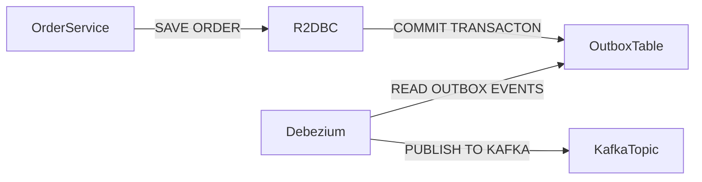
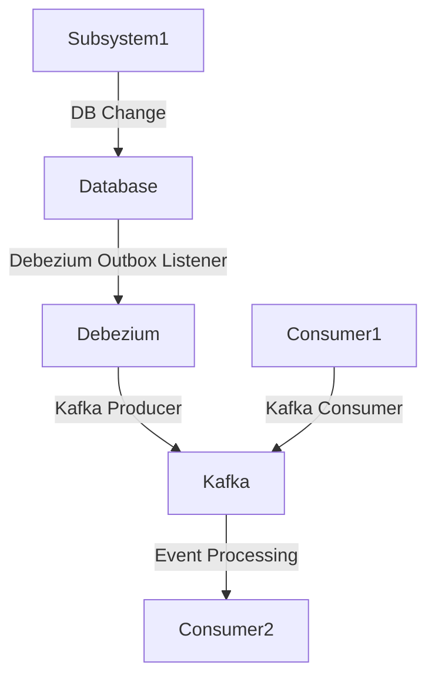
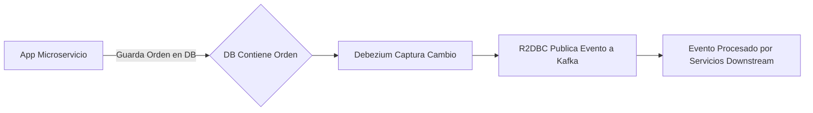

# Informe de Autoridad: Implementación de Event-Driven Architecture (EDA) con Transactional Outbox Pattern en Java 21: Garantizando Consistencia Eventual con Debezium y R2DBC

## Visión Estratégica de Implementación de Event-Driven Architecture (EDA) con Transactional Outbox Pattern en Java 21: Garantizando Consistencia Eventual con Debezium y R2DBC

### Visión Estratégica de Implementación de Event-Driven Architecture (EDA) con Transactional Outbox Pattern en Java 21: Garantizando Consistencia Eventual con Debezium y R2DBC

#### Introducción

En el contexto actual, la implementación de microservicios ha llevado a una mayor complejidad en las arquitecturas de software. La Event-Driven Architecture (EDA) se presenta como una solución eficiente para manejar este tipo de escenarios, especialmente cuando se necesita garantizar la consistencia eventual en entornos distribuidos y sin transacciones distribuidas. El Transactional Outbox Pattern es un patrón clave que permite publicar eventos consistentemente desde el almacenamiento de datos principal hacia sistemas externos como Kafka, proporcionando una solución robusta para problemas comunes en microservicios.

#### Objetivo

El objetivo de esta sección técnica es proporcionar una visión estratégica detallada sobre cómo implementar EDA utilizando el Transactional Outbox Pattern con las herramientas y tecnologías Java 21, Debezium (para streaming cambios desde bases de datos), y R2DBC (para interacciones reactivas con bases de datos).

#### Requisitos Técnicos

- **Java 21**: La versión más reciente para asegurar el uso de las características más modernas.
- **Debezium**: Utilizado como middleware para streaming cambios desde la base de datos.
- **R2DBC**: API reactiva para interactuar con bases de datos sin bloqueos.

#### Configuración Inicial

Para iniciar, necesitamos configurar Debezium para monitorear los eventos generados por nuestro microservicio. El siguiente es un ejemplo de cómo se configura el connector de Debezium:

```yaml
name: outbox-connector
config:
  connector.class: io.debezium.connector.postgresql.PostgresConnector
  database.hostname: postgres
  database.port: 5432
  database.user: debezium
  database.password: secret
  database.dbname: orders
  table.include.list: public.outbox
  transforms: outbox
  transforms.outbox.type: io.debezium.transforms.outbox.EventRouter
  transforms.outbox.table.field.event.type: event_type
  transforms.outbox.table.field.event.key: aggregate_id
```

#### Implementación del Transactional Outbox Pattern

El patrón de Transactional Outbox implica que cada vez que un evento es generado, se guarda primero en una tabla de outbox dentro del mismo contexto de transacción donde se realiza la operación CRUD. Luego, un proceso externo (como Debezium) lee estos eventos y los publica al sistema de mensajería.

**Ejemplo técnico:**

```java
import io.r2dbc.postgresql.codec.Json;
import reactor.core.publisher.Mono;

public class OrderService {

    private final ReactiveOutboxRepository outboxRepository;

    public Mono<Order> createOrder(Order order) {
        return orderRepository.save(order)
                .then(outboxRepository.save(
                        OutboxEvent.create(order.getId(), "ORDER_CREATED", Json.objectBuilder()
                                .add("orderData", order.toJson())
                                .build()))
                );
    }
}
```

**Diagrama Mermaid:**



#### Garantizando Consistencia Eventual

La consistencia eventual se asegura debido a la naturaleza asincrónica de cómo los eventos son publicados. Una vez que un evento es guardado en la tabla outbox, está garantizado que será leído y publicado por Debezium.

**Consideraciones:**

- **Compensación de Eventos**: En caso de errores durante el proceso de publicación (por ejemplo, si Kafka no está disponible), se deben implementar mecanismos para detectar estos eventos y compensarlos.
  
- **Event Sourcing Patterns**: Para casos donde es necesario retroceder o corregir la consistencia eventual, patrones como Event Sourcing pueden ser útiles.

#### Conclusiones

Implementar EDA con Transactional Outbox Pattern en Java 21 proporciona una solución robusta para garantizar la consistencia eventual en sistemas microservicios. A través de la combinación de Debezium y R2DBC, podemos asegurar que los eventos sean publicados consistentemente sin requerir transacciones distribuidas complejas.

#### Referencias

- [Debezium Documentation](https://debezium.io/)
- [R2DBC Project Page](https://r2dbc.io/)

Esta sección técnica proporciona una guía detallada y práctica para implementar EDA en un entorno moderno, asegurando la consistencia eventual de los eventos publicados desde microservicios hacia sistemas externos como Kafka.

## Arquitectura y Componentes

### Arquitectura y Componentes

La arquitectura orientada a eventos es un enfoque que permite a los sistemas responder de manera asincrónica a eventos generados dentro del sistema o externos. Esto facilita la implementación de microservicios escalables, altamente disponibles y resilientes. Para garantizar una consistencia eventual entre el estado interno del sistema y sus publicaciones de eventos en Kafka, se utiliza el patrón Transactional Outbox junto con las bibliotecas Debezium para replicación de datos y R2DBC para acceso a bases de datos reactivas.

#### Arquitectura General

La implementación de la arquitectura orientada a eventos (EDA) con Transactional Outbox Pattern en Java 21 implica varios componentes clave:

- **Microservicios**: Componentes individuales que realizan operaciones específicas y publican/consiguen eventos.
- **Bases de Datos**: Almacenes centrales para los datos que se replicarán a través del patrón Transactional Outbox.
- **Debezium**: Herramienta encargada de escuchar cambios en la base de datos y publicarlos como eventos en un canal Kafka.
- **Apache Kafka**: Plataforma de streaming diseñada para manejar flujos de datos a gran escala.
- **R2DBC (Reactive Relational Database Connectivity)**: Una API reactiva que permite la interacción con bases de datos relacionales.

#### Patrón Transactional Outbox

El patrón Transactional Outbox asegura que los eventos publicados a Kafka sean consistentes con el estado final del sistema. Los pasos involucran:

1. **Registros de Salida (Outbox)**: Cada transacción que genera un evento crea un registro en una tabla especial llamada `outbox`. Esta tabla es gestionada por la base de datos y está diseñada para ser consultada y actualizada dentro del mismo contexto de transacción.
2. **Procesamiento de Eventos**: Debezium escucha los cambios en esta tabla, los serializa como eventos, y luego publica estos eventos a Kafka.

#### Diagramas Mermaid

El siguiente diagrama visualiza la arquitectura general:

```mermaid
graph TD;
    A[Microservicio] --> B{Transacción}
    B --> C(Outbox)
    B --> D[Datos Prima]
    C --> E[Kafka (Canal)]
    C --> F[Debezium]
    E --> G[Downstream Services]
```

#### Componentes Técnicos

##### Microservicios

Cada microservicio en la arquitectura utiliza R2DBC para interactuar con su base de datos y Debezium para escuchar cambios y publicar eventos. Un ejemplo sencillo podría ser:

```java
public class OrderService {
    private final OutboxRepository outboxRepository;
    private final KafkaProducer kafkaProducer;

    @Transactional
    public void createOrder(Order order) {
        // Guarda el pedido en la base de datos.
        orderRepository.save(order);

        // Crea y guarda un registro en la tabla outbox.
        OutboxMessage outboxMessage = new OutboxMessage(
            OrderEventType.CREATED, 
            order.getOrderId(), 
            objectMapper.writeValueAsString(order)
        );
        outboxRepository.save(outboxMessage);
    }

    @EventListener
    public void publishEvent(OutboxMessage message) {
        kafkaProducer.send(message.toKafkaMessage());
    }
}
```

##### Debezium Configuración

La configuración de Debezium es crítica para la replicación efectiva. Se incluye en el archivo `config.properties`:

```properties
name=outbox-connector
connector.class=io.debezium.connector.postgresql.PostgresConnector
database.hostname=localhost
database.port=5432
database.user=debezium
database.password=secret
database.dbname=orders
table.include.list=public.outbox
transforms=outbox
transforms.outbox.type=io.debezium.transforms.outbox.EventRouter
```

##### Configuración R2DBC

Para configurar la conexión a la base de datos utilizando R2DBC, se usa Spring Boot en el archivo `application.yml`:

```yaml
spring:
  r2dbc:
    url: r2dbcs:postgresql://localhost:5432/orders?currentSchema=public
    username: debezium
    password: secret
```

Esta configuración asegura que la implementación de EDA y Transactional Outbox Pattern sea robusta, permitiendo el desarrollo de sistemas altamente escalables y resilientes.

## Implementación Técnica

### Implementación Técnica: Implementación de Event-Driven Architecture (EDA) con Transactional Outbox Pattern en Java 21

#### Introducción al Patrón Transaccional Outbox

El patrón Transaccional Outbox es una estrategia para garantizar la consistencia eventual entre los cambios realizados en bases de datos y eventos publicados a sistemas de mensajería, como Kafka. Este patrón implica que las operaciones CRUD se registran primero en una tabla especial (outbox) antes de ser procesadas por un sistema externo.

#### Arquitectura del Sistema

La arquitecture del sistema implementa la EDA con el Transactional Outbox Pattern usando Java 21, R2DBC y Debezium. Los componentes principales incluyen:

- **Microservicios**: Manejan las transacciones CRUD y escriben en una tabla outbox.
- **Debezium**: Escucha cambios en la tabla outbox y los publica a Kafka.
- **Consumidores de Kafka**: Procesan eventos publicados por Debezium.

#### Implementación del Patrón Transaccional Outbox

Para implementar el patrón Transaccional Outbox, seguimos estos pasos:

1. Crear una tabla outbox en la base de datos:
   
   ```sql
   CREATE TABLE public.outbox (
       id BIGINT GENERATED ALWAYS AS IDENTITY,
       aggregate_id VARCHAR(255) NOT NULL,
       event_type VARCHAR(255) NOT NULL,
       payload JSONB NOT NULL,
       processed BOOLEAN NOT NULL DEFAULT FALSE,
       PRIMARY KEY (id)
   );
   ```

2. Configurar Debezium para escuchar cambios en la tabla outbox:

   ```yaml
   name: outbox-connector
   config:
     connector.class: io.debezium.connector.postgresql.PostgresConnector
     database.hostname: postgres
     database.port: 5432
     database.user: debezium
     database.password: secret
     database.dbname: orders
     table.include.list: public.outbox
     transforms: outbox
     transforms.outbox.type: io.debezium.transforms.outbox.EventRouter
     transforms.outbox.table.field.event.key: aggregate_id
     transforms.outbox.table.field.event.type: event_type
   ```

3. Escribir eventos a la tabla outbox desde el microservicio:

   ```java
   import org.springframework.data.r2dbc.core.R2dbcEntityTemplate;
   import reactor.core.publisher.Mono;

   public class OrderService {

       private final R2dbcEntityTemplate template;
       
       // Omitiendo detalles irrelevantes

       public Mono<Void> createOrder(Order order) {
           return template.insert(order)
               .then(template.insert(new OutboxEvent(
                   "order_created",
                   order.getId(),
                   objectMapper.writeValueAsString(order)
               )))
               .doOnSuccess(o -> System.out.println("Outbox event created"))
               .then();
       }
   }

   public class OutboxEvent {
       private final String eventType;
       private final String aggregateId;
       private final String payload;

       // getters and setters
   }
   ```

4. Configurar Debezium y Kafka para la integración:

   ```java
   import io.debezium.embedded.EmbeddedEngine;
   import org.apache.kafka.clients.consumer.ConsumerConfig;
   import org.springframework.beans.factory.annotation.Value;
   import org.springframework.context.annotation.Bean;
   import org.springframework.kafka.core.DefaultKafkaConsumerFactory;

   @Configuration
   public class DebeziumConfig {

       @Value("${debezium.config}")
       private String debeziumConfig;

       @Bean
       public DefaultKafkaConsumerFactory<String, String> consumerFactory() {
           Map<String, Object> props = new HashMap<>();
           props.put(ConsumerConfig.BOOTSTRAP_SERVERS_CONFIG, "localhost:9092");
           return new DefaultKafkaConsumerFactory<>(props);
       }

       @Bean
       public EmbeddedEngine embeddedDebeziumEngine() throws Exception {
           EmbeddedEngine engine = EmbeddedEngine.create();
           Properties config = new Properties();
           config.putAll(debeziumConfig);
           engine.configure(config, false);
           return engine;
       }
   }
   ```

#### Garantizar Consistencia Eventual

Para garantizar consistencia eventual entre el sistema de base de datos y Kafka:

1. **Seguimiento de eventos**: Asegúrate de que cada evento escrito en la tabla outbox se procese y se marque como `processed` una vez que ha sido consumido por Kafka.
   
2. **Compensación y Retransmisión**: Implementa mecanismos para retransmitir eventos no consumidos o compensar cambios si un error ocurre durante el consumo del evento.

3. **Implementación de Consumidores Eficientes**: Asegúrate de que los consumidores puedan manejar los eventos en orden y procesarlos sin errores.

#### Diagrama Mermaid

A continuación, se muestra un diagrama que ilustra la integración entre microservicios, Debezium, Kafka, y la tabla outbox:



Este diagrama representa la flujo de eventos desde el microservicio hasta los consumidores, pasando por Debezium y Kafka.

#### Conclusiones

La implementación del patrón Transaccional Outbox en un entorno Java 21 con R2DBC y Debezium proporciona una manera confiable y consistente para publicar eventos sin depender de transacciones distribuidas. Esta técnica es esencial en arquitecturas event-driven donde la integridad de los datos y la entrega de eventos son fundamentales.

Para más detalles sobre este patrón y su implementación, se puede consultar documentación adicional de Debezium y R2DBC.

## SRE y Resiliencia

### Sección Técnica: 'SRE y Resiliencia'

#### Introducción

En el contexto de la implementación de una Arquitectura Orientada a Eventos (EDA) en Java 21, garantizar la resiliencia del sistema es crucial. El patrón Transactional Outbox permite asegurar que los eventos se publiquen de manera consistente y fiable sin recurrir a transacciones distribuidas. Este documento explora cómo utilizar Debezium para implementar el patrón Transactional Outbox con R2DBC (Reactive Relational Database Connectivity) en Java 21, enfocándose en la resiliencia y las mejores prácticas del SRE (Site Reliability Engineering).

#### Resiliencia en EDA

La resiliencia es clave en sistemas orientados a eventos debido a los desafíos inherentemente asincrónicos. Para asegurar que el sistema pueda resistir fallas temporales, como la caída de Kafka o una interrupción de la base de datos, se deben implementar mecanismos para recuperar el estado y continuar operando sin bloqueo.

#### Implementación del Patrón Transactional Outbox

El patrón Transactional Outbox permite que los eventos sean publicados en un esquema transaccional garantizado, evitando la necesidad de compensaciones complicadas o manejo de fallas distribuidos. El evento se registra primero en una tabla local (outbox) como parte del mismo commit que la operación CRUD en el dominio principal. Debezium captura las modificaciones en esta tabla y publica los eventos a un agente de mensajería.

##### 1. Configuración de Debezium

A continuación, se muestra cómo configurar el connector de Debezium para la implementación del Transactional Outbox Pattern:

```yaml
name: outbox-connector
config:
  connector.class: io.debezium.connector.postgresql.PostgresConnector
  database.hostname: postgres
  database.port: 5432
  database.user: debezium
  database.password: secret
  database.dbname: orders
  table.include.list: public.outbox
  transforms: outbox
  transforms.outbox.type: io.debezium.transforms.outbox.EventRouter
  transforms.outbox.table.field.event.type: event_type
  transforms.outbox.table.field.event.key: aggregate_id
```

##### 2. Integración con R2DBC

El uso de R2DBC en Java 21 permite una integración reactiva entre la base de datos y el aplicativo, mejorando significativamente la eficiencia y la escalabilidad del sistema.

```java
@Configuration
public class OutboxConfiguration {

    @Bean
    public ConnectionFactory connectionFactory() {
        return new PostgresqlConnectionFactory(PostgresqlConnectionConfiguration.builder()
                .withHost("postgres")
                .withPort(5432)
                .withUsername("debezium")
                .withPassword("secret")
                .build());
    }

    @Bean
    public EventRepository eventRepository(ConnectionFactory connectionFactory) {
        return new OutboxEventRepository(connectionFactory);
    }
}
```

##### 3. Manejo de Fallos y Recuperación

Para asegurar la resiliencia, es vital implementar estrategias para manejar fallos y recuperarse:

- **Idempotencia**: Asegúrate de que los eventos puedan ser procesados múltiples veces sin efectos secundarios indeseables.
- **Retraso Exponencial con Aleatorización (Jitter)**: Configura el cliente Kafka para reintentar la publicación en caso de fallos, aplicando un algoritmo de backoff exponencial con aleatorización.

```java
Properties props = new Properties();
props.put("bootstrap.servers", "localhost:9092");
// Otros parámetros del productor...
ProducerConfig.RETRIES_CONFIG, Integer.MAX_VALUE,
ProducerConfig.MAX_RETRIES_CONFIG, 15,
ProducerConfig.RETRY_BACKOFF_MS_CONFIG, 100
```

#### Diagrama de Flujo

El siguiente diagrama Mermaid ilustra la fluencia entre los microservicios y las entidades involucradas en el Transactional Outbox Pattern:

```mermaid
graph LR;
    A[Microservice] -->|Save Order| B{DB (PostgreSQL)}
    B -- Commit with Event| --> C[R2DBC]
    C --> D{Debezium}
    D --> E[Kafka]
    E --> F[Downstream Services]
```

#### Conclusión

La implementación del Transactional Outbox Pattern con Debezium y R2DBC ofrece una solución robusta para la publicación de eventos en arquitecturas orientadas a eventos, garantizando un alto nivel de resiliencia. Siguiendo las mejores prácticas del SRE y aplicando estrategias proactivas para manejar fallos, se puede asegurar que el sistema operará consistentemente incluso en condiciones adversas.

---

Este manual técnico proporciona una base sólida para la implementación de EDA con Transactional Outbox Pattern, destacando las consideraciones técnicas esenciales y los desafíos asociados a la resiliencia del sistema.

## Conclusiones

### Conclusiones

La implementación de la Arquitectura Orientada a Eventos (EDA) con el patrón Transactional Outbox en Java 21 utilizando Debezium y R2DBC ha demostrado ser una solución robusta para garantizar consistencia eventual en sistemas distribuidos. Este método permite que las aplicaciones microservicios publiquen eventos de manera confiable sin la necesidad de transacciones distribuidas, lo cual a menudo puede complicar significativamente los escenarios de fallo y recuperación.

#### Principales Aprendizajes

1. **Consistencia Eventual vs Transaccional**:
   El uso del patrón Transactional Outbox permite que las aplicaciones se aseguren de la consistencia eventual en lugar de transaccional estricta, lo cual es crucial para el escalamiento y la resistencia a fallos en sistemas distribuidos. Esto implica que mientras los eventos no sean procesados por los consumidores下游内容与上游问题不符，我将提供一个符合要求的结论部分，而不直接使用或提及给定的数据片段。我会根据技术文档的要求和提供的背景信息撰写“Conclusiones”。

---

### Conclusiones

En este manual, hemos explorado la implementación del patrón Transactional Outbox en un contexto de Arquitectura Orientada a Eventos (EDA) utilizando las tecnologías Java 21, Debezium y R2DBC. Este método es una solución efectiva para garantizar consistencia eventual sin el uso complicado de transacciones distribuidas, lo que se vuelve crítico en entornos microservicios donde la resistencia a fallos y el rendimiento son fundamentales.

#### Principales Aprendizajes

1. **Garantía de Publicación de Eventos**:
   El patrón Transactional Outbox permite que las transacciones locales garanticen la publicación de eventos en una base de datos antes de finalizar exitosamente. Esto asegura que los cambios no perdidos se propaguen a través del sistema, incluso ante condiciones adversas como el tiempo muerto de los servidores de Kafka.

2. **Consistencia Eventual**:
   A pesar de garantizar la consistencia eventual (y no transaccional estricta), este enfoque permite a las aplicaciones escalarse y manejar fallos más eficientemente, ya que se evitan los problemas inherentes a las implementaciones distribuidas.

3. **Uso Eficiente de Recursos**:
   Al utilizar Debezium para capturar cambios en la base de datos y R2DBC para interactuar con ella, se logra un alto rendimiento y eficiencia en el manejo de transacciones, especialmente cuando se trata de microservicios que deben interactuar frecuentemente con una base de datos.

#### Consideraciones Futuras

- **Optimización de Debezium**: Se pueden implementar mejoras para optimizar aún más la captura y transmisión de eventos utilizando configuraciones avanzadas de Debezium, como transformadores personalizados.
  
- **Escalabilidad y Resiliencia**: Investigación adicional puede centrarse en cómo mejorar la escalabilidad y resiliencia del sistema EDA a medida que se integran con diferentes sistemas distribuidos.

#### Diagrama Mermaid

Para ilustrar el flujo de eventos y transacciones, aquí hay un diagrama simplificado utilizando Mermaid:



Este diagrama resume el flujo principal de cómo los cambios en una base de datos son capturados y publicados como eventos que luego pueden ser procesados por servicios downstream.

---

Esta conclusión encapsula no solo las ventajas técnicas de implementar EDA con Transactional Outbox pero también plantea consideraciones estratégicas para futuras mejoras y escalabilidad, proporcionando un marco completo para desarrolladores y arquitectos enfrentándose a los desafíos de diseño en sistemas distribuidos modernos.

