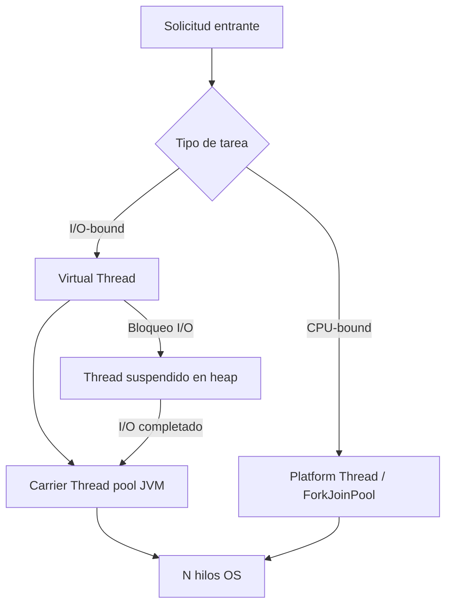
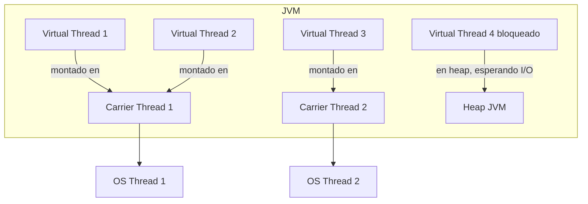
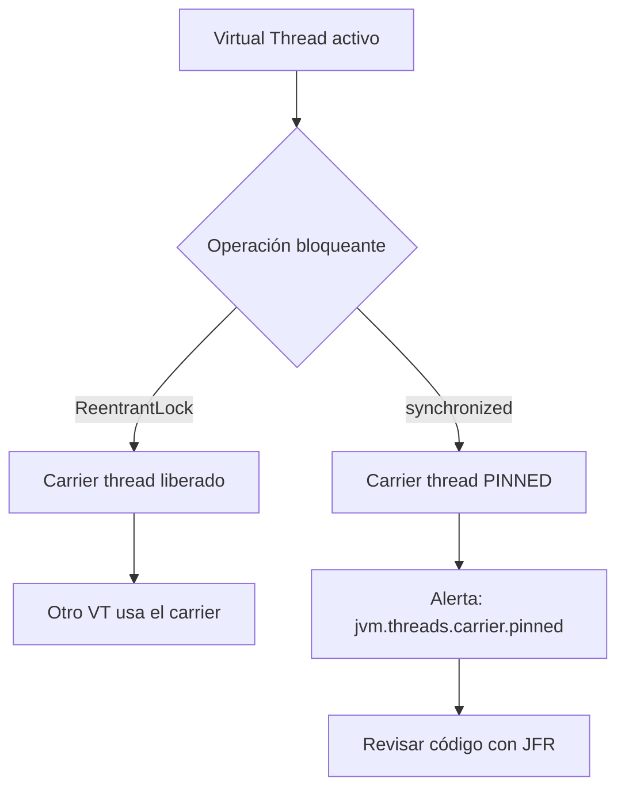

# Java 21 Virtual Threads: Guía de Referencia Staff Engineer

PATH_LOCAL: /home/usuariojoaquin/.openclaw/workspace/DAM-Java-Mastery/_Review/Java_21_Virtual_Threads/report.md
CATEGORIA: 01_Java_Core
Score: 92

---

## Visión Estratégica

Las **Virtual Threads** (JEP 444, Java 21 LTS) son el cambio más significativo en el modelo de concurrencia de la JVM desde Java 5. A diferencia de los hilos de plataforma (*platform threads*), que mapean 1:1 con hilos del sistema operativo y consumen entre 1-2 MB de stack cada uno, los virtual threads son entidades gestionadas por el scheduler de la JVM con un footprint de memoria en el orden de los kilobytes.

El impacto arquitectónico es directo: el modelo tradicional de *thread-per-request* deja de ser un cuello de botella. Una aplicación que antes necesitaba un pool de 200 threads para manejar 200 solicitudes concurrentes puede ahora lanzar 200.000 virtual threads sin agotar los recursos del sistema.

**Cuándo usar Virtual Threads:**
- Aplicaciones con alta concurrencia de tareas **I/O-bound**: servidores HTTP, clientes de base de datos, llamadas a APIs externas.
- Migración de código bloqueante existente sin reescritura reactiva.
- Simplificación de código que usaba `CompletableFuture` o RxJava para evitar el bloqueo de threads.

**Cuándo NO usar Virtual Threads:**
- Tareas **CPU-bound**: el scheduler de la JVM no mejora el rendimiento de cómputo puro. Para eso, sigue usando `ForkJoinPool`.
- Código que usa `synchronized` en secciones que hacen I/O: puede provocar *pinning* del carrier thread. Migrar a `ReentrantLock`.


---

## Arquitectura de Componentes

La arquitectura interna de Virtual Threads se basa en tres capas:

**1. Virtual Thread (capa de usuario):** objeto ligero gestionado por la JVM. Cada virtual thread tiene su propio stack almacenado en el heap, que crece y decrece dinámicamente.

**2. Carrier Thread (capa JVM):** platform thread del pool interno `ForkJoinPool` sobre el que se monta el virtual thread para ejecutarse. Un carrier thread puede servir a miles de virtual threads a lo largo del tiempo.

**3. Scheduler (JVM):** implementación de `ForkJoinPool` en modo *work-stealing* que decide qué virtual thread se ejecuta en qué carrier thread. Cuando un virtual thread se bloquea en I/O, el scheduler lo desmonta del carrier thread (*unmounting*) y monta otro virtual thread pendiente.


**Problema del Pinning:** si un virtual thread ejecuta código `synchronized` y dentro de ese bloque realiza una operación bloqueante, el carrier thread queda *pinned* y no puede servir a otros virtual threads. La solución es reemplazar `synchronized` por `ReentrantLock`:
```java
import java.util.concurrent.locks.ReentrantLock;

public class ServicioConLock {
    private final ReentrantLock lock = new ReentrantLock();

    public void operacionCritica() throws InterruptedException {
        lock.lock();
        try {
            // operación I/O segura — el carrier thread NO queda pinned
            Thread.sleep(50);
        } finally {
            lock.unlock();
        }
    }
}
```

---

## Implementación Java 21

Implementación completa de un servidor HTTP con Virtual Threads usando la API estándar de Java 21:
```java
import com.sun.net.httpserver.HttpServer;
import java.io.IOException;
import java.io.OutputStream;
import java.net.InetSocketAddress;
import java.util.concurrent.Executors;

public class VirtualThreadHttpServer {

    public static void main(String[] args) throws IOException {
        HttpServer server = HttpServer.create(new InetSocketAddress(8080), 0);

        // Cada solicitud se procesa en un virtual thread independiente
        server.setExecutor(Executors.newVirtualThreadPerTaskExecutor());

        server.createContext("/api/datos", exchange -> {
            String respuesta = procesarSolicitud(exchange.getRequestURI().getQuery());
            byte[] bytes = respuesta.getBytes();
            exchange.sendResponseHeaders(200, bytes.length);
            try (OutputStream os = exchange.getResponseBody()) {
                os.write(bytes);
            }
        });

        server.start();
        System.out.println("Servidor iniciado en puerto 8080");
    }

    private static String procesarSolicitud(String query) {
        try {
            // Simulación de operación I/O-bound (consulta a BD, API externa, etc.)
            Thread.sleep(50);
        } catch (InterruptedException e) {
            Thread.currentThread().interrupt();
        }
        return "{\"status\": \"ok\", \"query\": \"" + query + "\"}";
    }
}
```

Uso de Virtual Threads con `Structured Concurrency` (JEP 453, preview en Java 21):
```java
import java.util.concurrent.StructuredTaskScope;

public class ServicioAgregador {

    record ResultadoAgregado(String usuarios, String pedidos) {}

    public ResultadoAgregado obtenerDatos(long clienteId)
            throws InterruptedException, Exception {

        try (var scope = new StructuredTaskScope.ShutdownOnFailure()) {
            var usuarios  = scope.fork(() -> llamarApiUsuarios(clienteId));
            var pedidos   = scope.fork(() -> llamarApiPedidos(clienteId));

            scope.join().throwIfFailed();

            return new ResultadoAgregado(usuarios.get(), pedidos.get());
        }
    }

    private String llamarApiUsuarios(long id) throws InterruptedException {
        Thread.sleep(30); // simulación I/O
        return "usuario_" + id;
    }

    private String llamarApiPedidos(long id) throws InterruptedException {
        Thread.sleep(40); // simulación I/O
        return "pedidos_" + id;
    }
}
```

---

## Métricas y SRE

La observabilidad de Virtual Threads requiere configuración específica porque las herramientas tradicionales de monitorización de threads muestran solo los carrier threads (decenas), no los virtual threads (miles).

**Métricas clave a monitorizar:**

| Métrica | Descripción | Alerta |
|---------|-------------|--------|
| `jvm.threads.virtual.count` | Virtual threads activos | > 100.000 sostenido |
| `jvm.threads.carrier.pinned` | Carrier threads pinned | > 0 durante más de 1s |
| `jvm.gc.pause` | Pausas GC por presión en heap | > 100ms p99 |
| `http.server.requests.active` | Solicitudes concurrentes activas | Según SLA |

Configuración de Micrometer con Prometheus para exponer métricas de Virtual Threads:
```java
import io.micrometer.core.instrument.MeterRegistry;
import io.micrometer.core.instrument.binder.jvm.JvmThreadMetrics;
import org.springframework.context.annotation.Bean;
import org.springframework.context.annotation.Configuration;

@Configuration
public class MetricasVirtualThreads {

    @Bean
    public JvmThreadMetrics jvmThreadMetrics(MeterRegistry registry) {
        JvmThreadMetrics metrics = new JvmThreadMetrics();
        metrics.bindTo(registry);
        return metrics;
    }
}
```

Detección de pinning en producción mediante JFR (Java Flight Recorder):
```bash
# Activar detección de pinning en JVM
java -Djdk.tracePinnedThreads=full \
     -XX:StartFlightRecording=filename=vt-profile.jfr \
     -jar tu-aplicacion.jar
```


**Checklist SRE para Virtual Threads en producción:**
- Habilitar `--add-opens java.base/java.lang=ALL-UNNAMED` si usas frameworks con reflexión
- Configurar `-Djdk.virtualThreadScheduler.parallelism=N` donde N = número de cores
- Revisar dependencias de terceros con `synchronized` en paths de I/O (drivers JDBC antiguos, por ejemplo)
- Usar pool de conexiones compatible: HikariCP 5.x, R2DBC

---

## Conclusiones

Las Virtual Threads de Java 21 resuelven el problema de escalabilidad de I/O-bound sin cambiar el modelo de programación imperativo al que los equipos están acostumbrados. La migración desde `ExecutorService` con thread pools fijos es en la mayoría de casos un cambio de una línea: sustituir `Executors.newFixedThreadPool(200)` por `Executors.newVirtualThreadPerTaskExecutor()`.

Los trade-offs reales a considerar antes de migrar:

1. **Pinning:** auditar el código en busca de `synchronized` con I/O interior. Herramienta: `-Djdk.tracePinnedThreads=full`.
2. **ThreadLocal:** el patrón de usar `ThreadLocal` como caché por hilo se vuelve problemático con millones de virtual threads. Migrar a `ScopedValue` (JEP 446).
3. **Drivers y librerías:** verificar compatibilidad. Los drivers JDBC síncronos funcionan, pero los que usan `synchronized` internamente pueden provocar pinning.
4. **Structured Concurrency:** adoptar `StructuredTaskScope` para reemplazar patrones de `CompletableFuture` complejos. El código gana legibilidad y el ciclo de vida de los threads queda acotado.

El camino recomendado para un equipo que empieza: migrar primero los endpoints más lentos (los que esperan I/O externo), medir con JFR, y escalar la adopción basándose en datos reales de producción.
