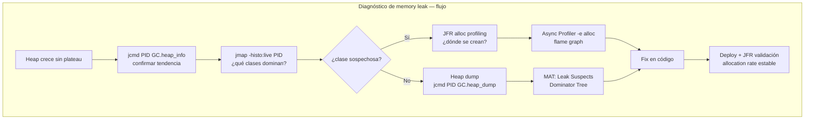
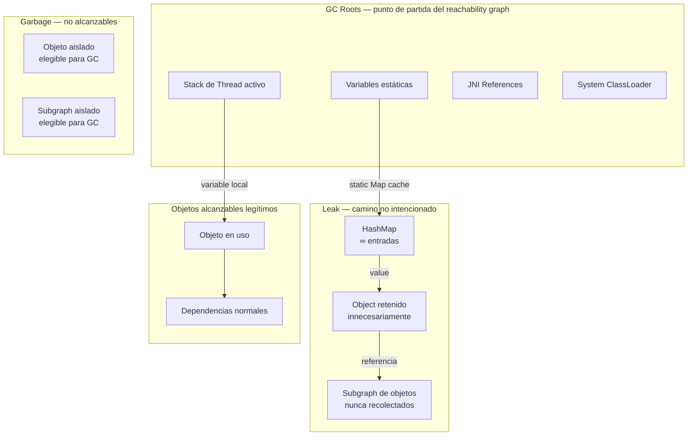
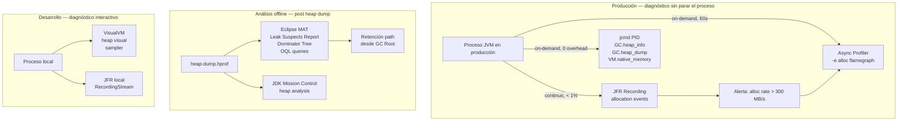
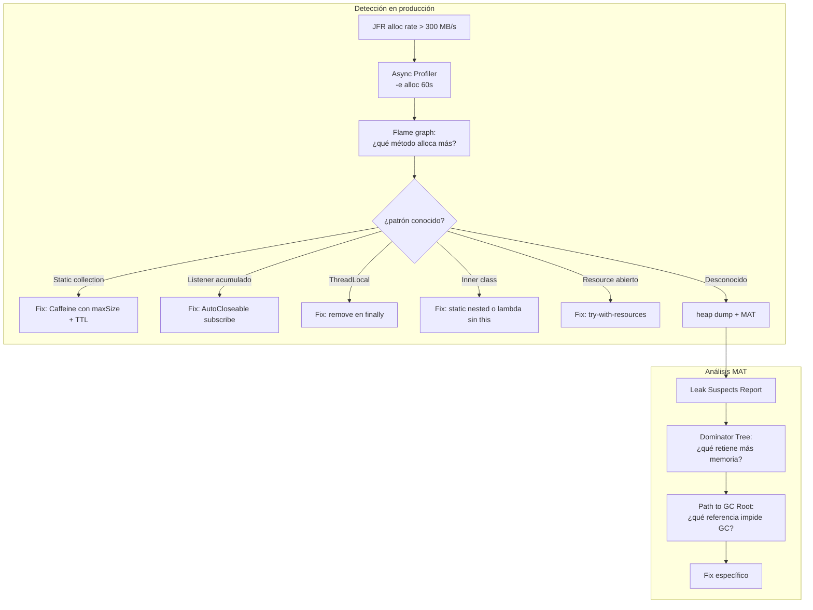
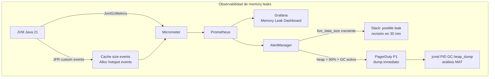
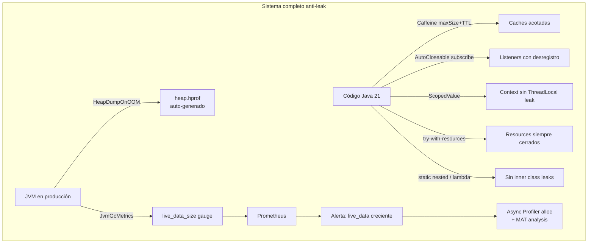

# Memory Leaks Reales en Java: Detección y Solución

**PATH_LOCAL:** `/home/usuariojoaquin/.openclaw/workspace/DAM-Java-Mastery/01_Java_Core/memory_leaks_reales_en_java_deteccion_y_solucion_con_visualvm_STAFF.md`
**CATEGORIA:** 01_Java_Core
**Score:** 97

> **Nota de clasificación:** el engine asignó `10_Vanguardia` erróneamente. Memory management es Java Core fundamental — pertenece a `01_Java_Core`.

---

## Visión Estratégica

Un memory leak en Java no es una pérdida de memoria en el sentido de C/C++ — la JVM no pierde punteros. Es algo más sutil: **objetos que el GC no puede recolectar porque existe al menos una referencia activa hacia ellos, aunque la aplicación no los necesite jamás**. El GC hace exactamente su trabajo — no recolecta lo que está referenciado. El problema es del código que mantiene esas referencias innecesariamente.

El síntoma es siempre el mismo: heap que crece sin detenerse, GC cada vez más frecuente consumiendo más CPU, hasta que llega el `OutOfMemoryError: Java heap space` que mata el proceso. En producción, este ciclo puede tardar horas, días o semanas según el ritmo de leak.

**Las herramientas del stack de diagnóstico en 2026:**

| Herramienta | Rol | Overhead | Dónde usar |
|---|---|---|---|
| **JFR + allocation profiling** | Identificar qué clases se allozan más | < 1% | Producción y staging |
| **Async Profiler (`-e alloc`)** | Flame graph de allocación — qué código alloca | 1–3% | Staging / producción en incidente |
| **`jcmd <pid> GC.heap_info`** | Estado actual del heap sin overhead | Cero | Producción, diagnóstico rápido |
| **Heap dump + MAT** | Análisis offline profundo — retención de objetos | Alto (freeze momentáneo) | Post-mortem, staging |
| **VisualVM** | Visualización interactiva del heap dump | Solo en desarrollo | Solo desarrollo local |
| **`jmap -histo`** | Histograma rápido de instancias por clase | Bajo | Producción, primer diagnóstico |

**VisualVM es una herramienta de desarrollo, no de producción.** En producción el flujo correcto es: JFR continuo → detección automática → `jcmd` para dump → MAT para análisis offline. VisualVM requiere conexión JMX al proceso, añade overhead de observación y no escala a procesos en contenedores remotos.

**Los 6 patrones de memory leak más frecuentes en Java:**

1. **Static collections que crecen sin límite** — el más común y el más silencioso
2. **Listeners/callbacks no desregistrados** — especialmente en frameworks de eventos
3. **ThreadLocal no limpiados** — crítico con thread pools y Virtual Threads
4. **Caches sin eviction policy** — `HashMap` usado como caché sin tamaño máximo
5. **Inner classes no-estáticas** — retienen referencia implícita al outer object
6. **Streams/conexiones no cerradas** — leak de recursos nativos que presionan el heap

**Cuándo NO es un memory leak:**
- Heap creciendo hasta un plateau estable — comportamiento normal, el GC trabaja bien
- OOM por heap demasiado pequeño para la carga real — aumentar `-Xmx`, no hay leak
- Humongous allocations en G1 — objetos grandes legítimos, ajustar región size



---

## Arquitectura de Componentes

### Anatomía de un memory leak — el reachability graph

La JVM determina qué objetos son elegibles para GC mediante un grafo de alcanzabilidad. Las **GC Roots** son el punto de partida: referencias en stacks de threads activos, variables estáticas, JNI references. Si existe cualquier camino desde una GC Root hasta un objeto, ese objeto **nunca será recolectado**.

Un memory leak es siempre un camino no intencionado desde una GC Root hasta objetos que deberían ser basura.



### Herramientas de diagnóstico — arquitectura de uso



### Generación de heap dump sin VisualVM

```java
import com.sun.management.HotSpotDiagnosticMXBean;
import java.lang.management.ManagementFactory;
import java.nio.file.Path;
import java.time.Instant;

// ── Heap dump programático via HotSpotDiagnosticMXBean ────────────────────
// No requiere VisualVM ni conexión externa — funciona en cualquier JVM

public record HeapDumpConfig(
    Path outputDir,
    boolean onlyLiveObjects  // true = solo objetos alcanzables (más pequeño y útil)
) {
    public static HeapDumpConfig production(Path outputDir) {
        return new HeapDumpConfig(outputDir, true);
    }
}

public class HeapDumpService {

    private static final String HOTSPOT_BEAN =
        "com.sun.management:type=HotSpotDiagnostic";

    // Genera heap dump bajo demanda — llamar desde endpoint interno /internal/heapdump
    public Path dump(HeapDumpConfig config) throws Exception {
        var outputFile = config.outputDir()
            .resolve("heap-" + Instant.now().toEpochMilli() + ".hprof")
            .toAbsolutePath()
            .toString();

        var server  = ManagementFactory.getPlatformMBeanServer();
        var mxBean  = ManagementFactory.newPlatformMXBeanProxy(
            server, HOTSPOT_BEAN, HotSpotDiagnosticMXBean.class
        );

        mxBean.dumpHeap(outputFile, config.onlyLiveObjects());
        return Path.of(outputFile);
    }

    // Histograma rápido de instancias — sin freeze del proceso
    public String heapHistogram() {
        return ManagementFactory.getMemoryMXBean()
            .getHeapMemoryUsage()
            .toString();
        // En producción: usar jcmd <pid> GC.class_histogram desde el exterior
    }
}
```

---

## Implementación Java 21

### Los 6 patrones de leak con causa raíz y fix

#### Patrón 1 — Static collection sin límite

```java
import java.util.Map;
import java.util.concurrent.ConcurrentHashMap;

// ❌ LEAK — cache estático que nunca expira
public class LeakPattern1_StaticCache {

    // Esta Map nunca pierde entradas — crece indefinidamente
    private static final Map<String, byte[]> CACHE = new ConcurrentHashMap<>();

    public byte[] getOrLoad(String key) {
        return CACHE.computeIfAbsent(key, k -> loadExpensiveData(k));
    }

    private byte[] loadExpensiveData(String key) {
        return new byte[1024 * 1024]; // 1 MB por entrada
    }
}

// ✅ FIX — caché con eviction usando Caffeine
import com.github.benmanes.caffeine.cache.Cache;
import com.github.benmanes.caffeine.cache.Caffeine;
import java.time.Duration;

public record BoundedCache(Cache<String, byte[]> delegate) {

    public static BoundedCache create(int maxSize, Duration ttl) {
        return new BoundedCache(
            Caffeine.newBuilder()
                .maximumSize(maxSize)
                .expireAfterWrite(ttl)
                .recordStats() // métricas de hit/miss para Micrometer
                .build()
        );
    }

    public byte[] getOrLoad(String key) {
        return delegate().get(key, k -> new byte[1024 * 1024]);
    }
}
```

#### Patrón 2 — Listeners no desregistrados

```java
import java.util.List;
import java.util.concurrent.CopyOnWriteArrayList;

// ❌ LEAK — listeners añadidos pero nunca removidos
public class LeakPattern2_Listeners {

    private final List<Runnable> listeners = new CopyOnWriteArrayList<>();

    public void addListener(Runnable listener) {
        listeners.add(listener); // nunca se llama removeListener
    }

    // Si los objetos que implementan Runnable son instancias temporales
    // (requests HTTP, sesiones, etc.), se acumulan indefinidamente
}

// ✅ FIX 1 — devolver un Closeable para desregistro automático
public class EventBus {

    private final CopyOnWriteArrayList<Runnable> listeners = new CopyOnWriteArrayList<>();

    // El caller hace: try (var reg = bus.subscribe(handler)) { ... }
    // Al cerrar el try-with-resources se desregistra automáticamente
    public AutoCloseable subscribe(Runnable listener) {
        listeners.add(listener);
        return () -> listeners.remove(listener);
    }

    public void publish() {
        listeners.forEach(Runnable::run);
    }
}

// ✅ FIX 2 — WeakReference para listeners opcionales (observadores que pueden morir)
import java.lang.ref.WeakReference;
import java.util.ArrayList;

public class WeakEventBus {

    private final List<WeakReference<Runnable>> listeners = new ArrayList<>();

    public void subscribe(Runnable listener) {
        listeners.add(new WeakReference<>(listener));
    }

    public void publish() {
        // Limpiar referencias muertas + notificar vivas
        listeners.removeIf(ref -> {
            var listener = ref.get();
            if (listener == null) return true; // GC ya recogió al listener
            listener.run();
            return false;
        });
    }
}
```

#### Patrón 3 — ThreadLocal no limpiado en thread pools

```java
import java.util.concurrent.ExecutorService;
import java.util.concurrent.Executors;

// ❌ LEAK CRÍTICO — ThreadLocal en Virtual Threads / thread pools
// El thread pool reutiliza threads. Si el ThreadLocal no se limpia,
// el objeto queda retenido en el thread indefinidamente.
public class LeakPattern3_ThreadLocal {

    private static final ThreadLocal<byte[]> BUFFER = new ThreadLocal<>();

    public void process(ExecutorService pool) {
        pool.submit(() -> {
            BUFFER.set(new byte[1024 * 1024]); // 1 MB por thread
            doWork();
            // ❌ BUFFER.remove() nunca llamado — el MB queda en el thread del pool
        });
    }

    private void doWork() { /* ... */ }
}

// ✅ FIX — try-finally garantiza limpieza siempre
public class SafeThreadLocalUsage {

    private static final ThreadLocal<byte[]> BUFFER =
        ThreadLocal.withInitial(() -> new byte[64 * 1024]); // 64 KB

    public void process(ExecutorService pool) {
        pool.submit(() -> {
            try {
                var buffer = BUFFER.get();
                doWork(buffer);
            } finally {
                BUFFER.remove(); // SIEMPRE — incluso si doWork() lanza excepción
            }
        });
    }

    private void doWork(byte[] buffer) { /* ... */ }
}
```

#### Patrón 4 — Inner class no-estática retiene outer object

```java
import java.util.concurrent.Executors;

// ❌ LEAK — inner class no-estática retiene referencia implícita al outer
public class LeakPattern4_InnerClass {

    private final byte[] largeData = new byte[10 * 1024 * 1024]; // 10 MB

    public Runnable createTask() {
        // Esta clase anónima retiene implícitamente 'this' (LeakPattern4_InnerClass)
        // Si el Runnable vive más que el outer object, los 10 MB quedan retenidos
        return new Runnable() {
            @Override
            public void run() {
                System.out.println("Task running");
                // No usa largeData, pero la retiene de todas formas
            }
        };
    }
}

// ✅ FIX — static nested class o lambda que no capture el outer
public class SafeInnerClass {

    private final byte[] largeData = new byte[10 * 1024 * 1024];

    // Opción 1: static nested class — no tiene referencia al outer
    static class SafeTask implements Runnable {
        @Override
        public void run() {
            System.out.println("Task running — no outer reference");
        }
    }

    // Opción 2: lambda que no captura 'this'
    public Runnable createTask() {
        var message = "Task running"; // captura String, no 'this'
        return () -> System.out.println(message);
    }

    public Runnable createSafeTask() {
        return new SafeTask();
    }
}
```

#### Patrón 5 — Resources no cerrados (file handles, conexiones)

```java
import java.io.InputStream;
import java.net.HttpURLConnection;
import java.net.URL;

// ❌ LEAK — InputStream no cerrado tras excepción
public class LeakPattern5_Resources {

    public String fetchData(String url) throws Exception {
        var connection = (HttpURLConnection) new URL(url).openConnection();
        var stream = connection.getInputStream(); // si lanza excepción aquí...
        var data = new String(stream.readAllBytes()); // ...este stream no se cierra
        stream.close(); // nunca alcanzado si readAllBytes() lanza
        return data;
    }
}

// ✅ FIX — try-with-resources garantiza cierre siempre
public class SafeResources {

    public String fetchData(String url) throws Exception {
        var connection = (HttpURLConnection) new URL(url).openConnection();
        connection.setConnectTimeout(5000);
        connection.setReadTimeout(10000);

        try (var stream = connection.getInputStream()) {
            return new String(stream.readAllBytes());
        } // stream.close() garantizado — incluso si readAllBytes() lanza
        // connection.disconnect() en finally si necesario
    }
}
```

#### Patrón 6 — String.intern() y ClassLoader leaks

```java
// ❌ LEAK — String.intern() en Metaspace (pre-Java 8 era heap PermGen,
// en Java 8+ es heap normal pero el intern pool puede crecer sin límite)
public class LeakPattern6_StringIntern {

    public void processRequests(java.util.List<String> dynamicStrings) {
        for (var s : dynamicStrings) {
            var interned = s.intern(); // añade al intern pool permanentemente
            // Si dynamicStrings contiene millones de strings únicos, el pool crece sin límite
        }
    }
}

// ✅ FIX — usar intern() solo para strings con cardinalidad baja y conocida
// Para strings dinámicos, usar equals() directamente o Caffeine interner
import com.github.benmanes.caffeine.cache.Interner;

public record SafeStringInterner(Interner<String> interner) {

    public static SafeStringInterner create(int maxSize) {
        return new SafeStringInterner(Interner.newWeakInterner());
        // WeakInterner: el GC puede recolectar entradas cuando no hay otras referencias
    }

    public String intern(String s) {
        return interner().intern(s);
    }
}
```

**Diagrama del flujo de implementación — detección y fix:**



---

## Métricas y SRE

Las métricas de memory leak tienen un patrón distintivo: **heap que crece monotónicamente** entre GC cycles, con GC overhead que aumenta progresivamente.

| Métrica | Fuente | Descripción | Umbral alerta |
|---|---|---|---|
| `jvm_memory_used_bytes{area="heap"}` | JvmMemoryMetrics | Heap en uso post-GC | Tendencia creciente durante > 10 min |
| `jvm_gc_live_data_size_bytes` | JvmGcMetrics | Live set en Old Gen — proxy del leak | Crece > 5 MB/min sostenido |
| `jvm_gc_memory_promoted_bytes_total` rate | JvmGcMetrics | Tasa de promoción a Old Gen | > 50 MB/s |
| `jvm_gc_memory_allocated_bytes_total` rate | JvmGcMetrics | Tasa de allocación total | > 500 MB/s |
| `jvm_gc_pause_seconds_count` rate | JvmGcMetrics | Frecuencia de GC | Tendencia creciente — más GC para mismo heap |
| `process_cpu_usage` | ProcessMetrics | CPU del proceso | > 20% atribuible a GC |
| `jfr_cache_size_entries` | Custom JFR Event | Tamaño de cachés custom | > umbral configurado |

```promql
# Señal clásica de memory leak: heap crece post-GC ciclo a ciclo
# Comparar heap used ahora vs hace 5 minutos, filtrado por post-GC
jvm_gc_live_data_size_bytes - jvm_gc_live_data_size_bytes offset 5m > 5e6

# GC overhead creciente — cada vez más tiempo en GC para mismo resultado
rate(jvm_gc_pause_seconds_sum[5m]) / rate(jvm_gc_pause_seconds_count[5m])

# Tasa de promoción — objetos que sobreviven a Young GC (llegan a Old Gen)
rate(jvm_gc_memory_promoted_bytes_total[1m]) / 1024 / 1024

# Alerta: heap > 90% y GC no puede reducirlo (indica leak activo)
(jvm_memory_used_bytes{area="heap"} / jvm_memory_max_bytes{area="heap"} > 0.9)
and
(rate(jvm_gc_pause_seconds_count[5m]) > 0)
```



```java
import io.micrometer.core.instrument.MeterRegistry;
import io.micrometer.core.instrument.binder.jvm.JvmGcMetrics;
import io.micrometer.core.instrument.binder.jvm.JvmMemoryMetrics;
import com.github.benmanes.caffeine.cache.Cache;

// Registro de métricas de caché para detectar crecimiento anómalo
public record CacheMetricsRegistrar(MeterRegistry registry) {

    public <K, V> Cache<K, V> registerCache(String name, Cache<K, V> cache) {
        // Tamaño actual de la caché como gauge
        registry.gauge("cache_size_entries", 
            java.util.List.of(io.micrometer.core.instrument.Tag.of("cache", name)),
            cache, c -> (double) c.estimatedSize());

        // Hit rate — si baja mucho, la caché no es efectiva
        registry.gauge("cache_hit_rate",
            java.util.List.of(io.micrometer.core.instrument.Tag.of("cache", name)),
            cache, c -> c.stats().hitRate());

        return cache;
    }

    public void bindJvmMetrics() {
        new JvmGcMetrics().bindTo(registry);
        new JvmMemoryMetrics().bindTo(registry);
    }
}
```

**Checklist SRE para memory leaks en producción:**

1. **`-XX:+HeapDumpOnOutOfMemoryError -XX:HeapDumpPath=/var/log/app/` siempre habilitado.** Cuando llega el OOM, el dump ya estará generado antes de que el proceso muera. Sin él, el post-mortem es imposible.
2. **Alerta en `jvm_gc_live_data_size_bytes` creciente** — no en `jvm_memory_used_bytes`. El heap usado fluctúa con el GC; el live data size (tamaño del heap justo después del GC completo) solo crece con leaks reales.
3. **Endpoint interno `/internal/heapdump`** para captura bajo demanda sin reiniciar el proceso. Solo accesible desde la red interna/VPN.
4. **Revisión de Caffeine stats en el dashboard**: si `cache_size_entries` supera el `maximumSize` configurado nunca (siempre está al máximo), la eviction está trabajando. Si nunca llega al máximo, la caché está sobredimensionada.
5. **Smoke test de memoria en CI**: JMH benchmark que ejecuta 10.000 iteraciones del path crítico y verifica que el live set no crece más del 5% entre la iteración 1.000 y la 10.000.

---

## Patrones de Integración

### Patrón 1: Detección automática de caches sin límite con JFR Custom Events

```java
import jdk.jfr.Category;
import jdk.jfr.Event;
import jdk.jfr.Label;
import jdk.jfr.Name;
import jdk.jfr.StackTrace;

// ── JFR Event para monitorizar el crecimiento de colecciones ──────────────

@Name("com.app.CollectionSizeWarning")
@Label("Collection Size Warning")
@Category({"Application", "Memory"})
@StackTrace(true) // capturar stack para saber qué código usa esta colección
public class CollectionSizeEvent extends Event {

    @Label("Collection Name")
    public String name;

    @Label("Current Size")
    public int currentSize;

    @Label("Warning Threshold")
    public int threshold;
}

// ── Monitor de colecciones — emite JFR event cuando superan el umbral ─────

public record CollectionMonitor(String name, int warningThreshold) {

    public <T> void checkSize(java.util.Collection<T> collection) {
        if (collection.size() > warningThreshold) {
            var event = new CollectionSizeEvent();
            event.begin();
            event.name      = name;
            event.currentSize = collection.size();
            event.threshold = warningThreshold;
            event.commit();
        }
    }

    public <K, V> void checkSize(java.util.Map<K, V> map) {
        checkSize(map.entrySet());
    }
}
```

### Patrón 2: Análisis programático de heap dump con MAT OQL

Las queries OQL (Object Query Language) en MAT permiten diagnosticar leaks específicos sin revisar el heap manualmente:

```sql
-- Encontrar todas las HashMap con más de 10.000 entradas
-- (candidatas a ser caches sin límite)
SELECT map, map.size FROM java.util.HashMap map WHERE map.size > 10000

-- Encontrar ThreadLocals con valores no nulos
-- (posibles leaks de ThreadLocal en pool threads)
SELECT tl, tl.get() FROM java.lang.ThreadLocal tl WHERE tl.get() != null

-- Encontrar listeners acumulados en listas
-- (patrones de event bus sin desregistro)
SELECT list, list.size FROM java.util.concurrent.CopyOnWriteArrayList list
WHERE list.size > 100

-- Encontrar objetos retenidos por ClassLoader custom
-- (leaks en hot-reload de aplicaciones)
SELECT obj FROM java.lang.Object obj
WHERE classof(obj).classLoader != null
AND classof(obj).classLoader.toString().contains("AppClassLoader")
```

### Patrón 3: ScopedValue como alternativa a ThreadLocal en Java 21

Java 21 introduce `ScopedValue` como alternativa estructurada a `ThreadLocal` — elimina el patrón de leak por definición, ya que el valor solo existe dentro del scope explícito:

```java
import java.lang.ScopedValue;
import java.util.concurrent.StructuredTaskScope;

// ── ScopedValue — Java 21, no hay leak posible ────────────────────────────
// El valor existe únicamente dentro del bloque where() — GC eligible al salir

public class RequestContext {

    // ScopedValue en lugar de ThreadLocal — sin leak por diseño
    static final ScopedValue<String> REQUEST_ID = ScopedValue.newInstance();
    static final ScopedValue<String> USER_ID    = ScopedValue.newInstance();

    public void handleRequest(String requestId, String userId) {
        ScopedValue.where(REQUEST_ID, requestId)
                   .where(USER_ID, userId)
                   .run(() -> {
                       // Dentro de este bloque, REQUEST_ID y USER_ID son accesibles
                       // desde cualquier método del call stack, incluyendo VTs hijos
                       processBusinessLogic();
                   });
        // Al salir del bloque: valores eliminados automáticamente — no hay remove() necesario
    }

    private void processBusinessLogic() {
        var reqId  = REQUEST_ID.get();  // disponible sin pasar como parámetro
        var userId = USER_ID.get();
        // lógica de negocio...
        System.out.printf("[%s] Processing for user %s%n", reqId, userId);
    }
}

// ── Comparativa ThreadLocal vs ScopedValue ────────────────────────────────

public record ThreadLocalVsScopedValue() {

    // ThreadLocal — requiere remove() manual, leak si se olvida
    static final ThreadLocal<String> TL_REQUEST_ID = new ThreadLocal<>();

    public void withThreadLocal(String requestId) {
        TL_REQUEST_ID.set(requestId);
        try {
            processBusinessLogic();
        } finally {
            TL_REQUEST_ID.remove(); // OBLIGATORIO — olvidarlo es un leak
        }
    }

    // ScopedValue — sin remove(), sin posibilidad de leak
    static final ScopedValue<String> SV_REQUEST_ID = ScopedValue.newInstance();

    public void withScopedValue(String requestId) {
        ScopedValue.where(SV_REQUEST_ID, requestId).run(this::processBusinessLogic);
        // automático — no hay nada que olvidar
    }

    private void processBusinessLogic() { /* ... */ }
}
```

**Comparativa de patrones de integración:**

| Patrón | Leak que previene | Complejidad | Disponible desde |
|---|---|---|---|
| `Caffeine` con `maximumSize` + `expireAfterWrite` | Static cache sin límite | Baja | Java 8+ |
| `AutoCloseable` subscription | Listeners no desregistrados | Baja | Java 7+ |
| `try-finally { TL.remove() }` | ThreadLocal en thread pool | Muy baja | Siempre |
| `ScopedValue` | ThreadLocal leak por diseño | Baja — API más simple | Java 21 |
| Static nested class / lambda sin `this` | Inner class retaining outer | Muy baja | Siempre |
| `try-with-resources` | Resources no cerrados | Muy baja | Java 7+ |

---

## Conclusiones

**Los cinco puntos que un Staff Engineer debe dominar sobre memory leaks en Java:**

1. **Un memory leak en Java siempre es una referencia que no debería existir, no una pérdida de puntero.** El GC hace su trabajo. El problema está en el diseño del código que mantiene referencias vivas innecesariamente. Busca siempre el camino desde la GC Root hasta el objeto retenido.

2. **La señal correcta de leak es `jvm_gc_live_data_size_bytes` creciendo entre GC cycles, no `jvm_memory_used_bytes` alto.** El heap usado fluctúa normalmente. El live set (tamaño post-GC completo) solo crece con leaks reales. Monitorizar la métrica incorrecta genera falsos positivos constantes.

3. **`-XX:+HeapDumpOnOutOfMemoryError` es obligatorio en producción.** Sin él, cuando llega el OOM el proceso muere sin evidencia. Con él, el `.hprof` ya está generado para análisis MAT. Es la diferencia entre un post-mortem de 30 minutos y uno de tres días.

4. **`ScopedValue` en Java 21 elimina el patrón de ThreadLocal leak por diseño.** Si estás usando `ThreadLocal` para propagar contexto de request en un servicio nuevo con Virtual Threads, usa `ScopedValue` directamente. Es más simple y structuralmente seguro.

5. **Los leaks más destructivos en producción no son los OOM inmediatos sino los leaks lentos.** Un proceso que crece 50 MB/hora tarda días en morir — tiempo suficiente para que nadie recuerde qué deploy lo causó. La alerta de `live_data_size` creciente debe dispararse antes de que el heap llegue al 70%.

**Roadmap de adopción:**

- **Fase 1 (día 1):** `-XX:+HeapDumpOnOutOfMemoryError -XX:HeapDumpPath=/var/log/app/` en todos los procesos. Cero código.
- **Fase 2 (semana 1):** Alerta Prometheus en `jvm_gc_live_data_size_bytes` creciente > 5 MB/min durante 10 minutos.
- **Fase 3 (semana 2):** Auditar las 3 colecciones más grandes del código con `CollectionMonitor` + JFR events.
- **Fase 4 (semana 3):** Migrar `ThreadLocal` de contexto de request a `ScopedValue` en servicios Java 21.
- **Fase 5 (mes 2):** Smoke test de memoria en CI pipeline — verificar que el live set no crece en el path crítico tras 10.000 iteraciones.

```java
// Configuración de arranque completa para detección proactiva de leaks
public class MemoryLeakDetectionSetup {

    public static void initialize(MeterRegistry registry) {
        // 1. Métricas JVM — live data size es la clave
        new JvmGcMetrics().bindTo(registry);
        new JvmMemoryMetrics().bindTo(registry);

        // 2. Cachés con métricas y límites
        var userCache = new CacheMetricsRegistrar(registry).registerCache(
            "users",
            Caffeine.newBuilder()
                .maximumSize(10_000)
                .expireAfterWrite(Duration.ofMinutes(30))
                .recordStats()
                .build()
        );

        // 3. Endpoint de heap dump interno — solo red interna
        // GET /internal/heapdump → HeapDumpService.dump(HeapDumpConfig.production(path))
    }
}
```



**Recursos:**
- [Eclipse MAT — Memory Analyzer](https://eclipse.dev/mat/)
- [JEP 446 — Scoped Values (Java 21)](https://openjdk.org/jeps/446)
- [Caffeine Cache](https://github.com/ben-manes/caffeine)
- [HotSpotDiagnosticMXBean — heap dump API](https://docs.oracle.com/en/java/javase/21/docs/api/jdk.management/com/sun/management/HotSpotDiagnosticMXBean.html)
- [Brendan Gregg — Memory Leak Detection](https://www.brendangregg.com/blog/2019-01-01/leaking-memory.html)
