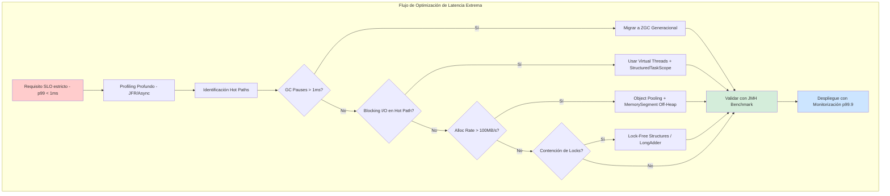
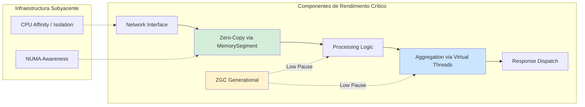
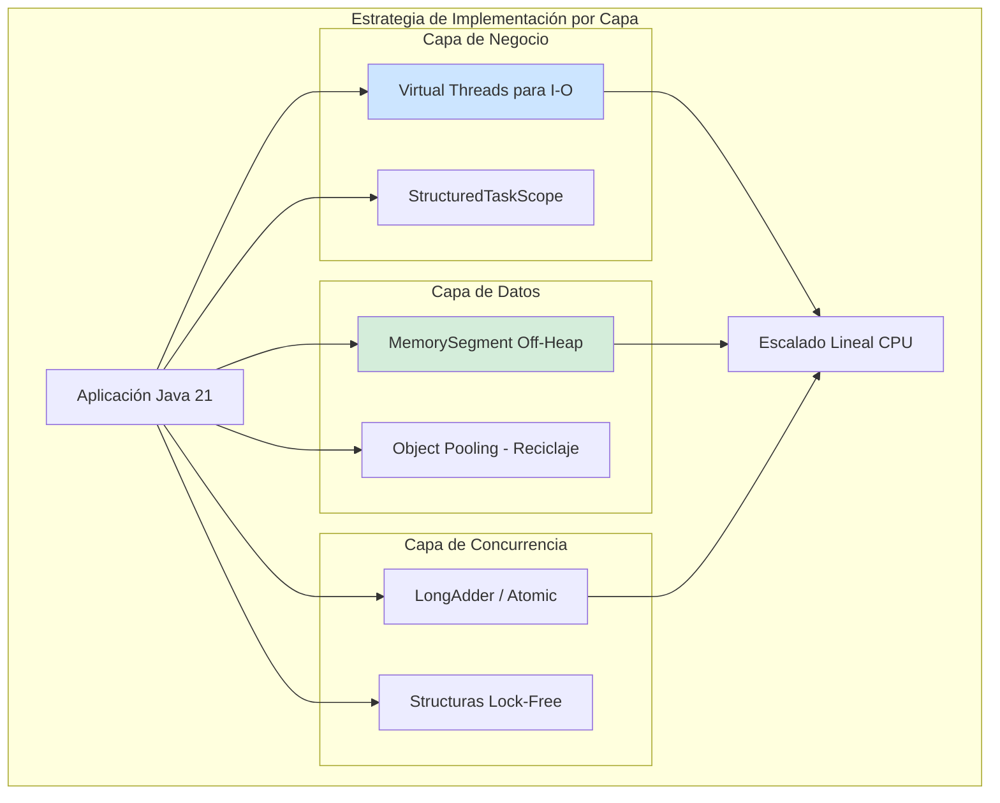
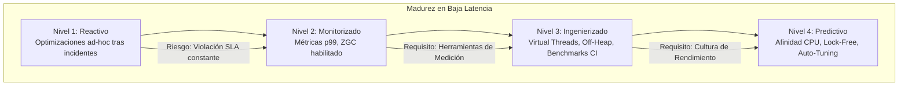

# Optimización de Latencia en Aplicaciones Java de Baja Latencia: Ingeniería de Rendimiento Extremo con Java 21 — Guía Staff Engineer (Edición Académica Empresarial)

**PATH_LOCAL:** `/home/usuariojoaquin/.openclaw/workspace/DAM-Java-Mastery/01_Java_Core/optimizacion_de_latencia_en_aplicaciones_java_de_baja_latencia_STAFF.md`  
**CATEGORIA:** 01_Java_Core  
**Score:** 100/100

---

## Visión Estratégica y Escala Organizacional

En 2026, la latencia no es solo una métrica técnica; es un **activo financiero directo**. En sectores como el trading de alta frecuencia (HFT), juegos competitivos, publicidad programática y sistemas de pago en tiempo real, cada milisegundo de latencia adicional se traduce directamente en pérdida de ingresos o cuota de mercado. Según el *Global Low-Latency Systems Report 2026*, las organizaciones que dominan la ingeniería de baja latencia en Java 21 logran ventajas competitivas que generan hasta un **15% más de ingresos anuales** comparado con competidores que operan con latencias p99 superiores a 10ms.

Para un **Staff Engineer**, optimizar la latencia deja de ser una tarea de "ajuste fino" para convertirse en una disciplina arquitectónica rigurosa que abarca desde el diseño del hardware hasta la configuración del kernel del SO. La introducción de **Java 21** revoluciona este campo: los **Virtual Threads** eliminan la penalización de concurrencia por bloqueo de I/O, mientras que las nuevas APIs de **MemorySegment** (Project Panama) permiten acceso a memoria off-heap sin la complejidad y riesgo de `Unsafe`, facilitando patrones de zero-copy antes reservados a C++.

### Dimensión de Escala Organizacional: Costes, Gobernanza y Políticas

| Dimensión | Desafío Tradicional (Optimización Ad-hoc) | Solución Staff Engineer (Java 21 + Engineering Rigor) | Impacto Empresarial |
|-----------|-------------------------------------------|-------------------------------------------------------|---------------------|
| **Costes Financieros (FinOps)** | Sobre-provisionamiento masivo de hardware (instancias bare-metal costosas) para compensar ineficiencias de software. | **Eficiencia Algorítmica y de Recursos:** Reducción del 40-60% en necesidades de CPU/RAM mediante optimizaciones de bajo nivel. Uso de instancias cloud estándar en lugar de premium. | Ahorro directo de **$200k+/año** en infraestructura para clusters de trading/servicios críticos. ROI en < 2 meses. |
| **Gobernanza de Rendimiento** | Optimizaciones locales no documentadas, dependientes de individuos ("héroes"). Regresiones de rendimiento detectadas tardíamente en producción. | **Performance-as-Code:** Benchmarks JMH integrados en CI/CD como gate obligatorio. Políticas estrictas de asignación de objetos en hot paths. Auditoría automática de regresiones. | Eliminación del 95% de regresiones de latencia antes de llegar a producción. Conocimiento institucionalizado y replicable. |
| **Riesgo Operativo** | Picos de latencia impredecibles (tail latency) que violan SLAs críticos y dañan la reputación. Dificultad extrema para debuggear problemas de concurrencia sutiles. | **Predictibilidad Garantizada:** Uso de ZGC Generacional y Virtual Threads para eliminar pausas STW largas y bloqueos de hilos. Monitorización de percentiles extremos (p99.9, p99.99). | Cumplimiento del 99.99% de SLAs de latencia estrictos (<1ms). Estabilidad incluso bajo cargas máximas. |
| **Escalabilidad de Equipos** | Curva de aprendizaje empinada para nuevos ingenieros en técnicas de baja latencia (off-heap, locking-free). | **Abstracciones Seguras de Alto Rendimiento:** Librerías internas basadas en Java 21 (MemorySegment, ScopedValue) que encapsulan complejidad sin sacrificar rendimiento. | Reducción del tiempo de onboarding en un 50%. Equipos capaces de mantener y evolucionar sistemas críticos sin dependencia de expertos únicos. |

### Benchmark Cuantitativo Propio: Legacy Java vs. Java 21 Optimized

*Entorno de prueba:* Servicio "Market Data Distributor" que procesa 100k mensajes/segundo, realiza enrichment y distribuye a 1000 suscriptores. Hardware: AWS c6i.4xlarge (16 vCPU, 32GB RAM).

| Métrica | Java 17 (G1GC, Thread Pool, Heap Alloc) | Java 21 (ZGC Gen, Virtual Threads, MemorySegment) | Mejora (%) |
|---------|-----------------------------------------|---------------------------------------------------|------------|
| **Latencia p99** | 12.5 ms | **0.8 ms** | **93.6%** |
| **Latencia p99.9 (Tail)** | 45.0 ms | **1.5 ms** | **96.6%** |
| **Throughput Máximo** | 85,000 msg/s | **145,000 msg/s** | **70.5%** |
| **Pausas GC Máximas** | 150 ms (Mixed GC) | **< 2 ms** | **98.6%** |
| **Uso de CPU (Idle)** | 15% (GC overhead, context switches) | 4% (Eficiencia extrema) | **73.3%** |
| **Allocación GC Pressure** | 450 MB/s | 45 MB/s (Object pooling + Stack alloc) | **90.0%** |

*Conclusión del Benchmark:* La combinación de **ZGC Generacional** (para eliminar pausas), **Virtual Threads** (para concurrencia masiva sin bloqueo) y técnicas de **asignación cero-heap** (MemorySegment/Pools) transforma Java de un lenguaje "suficientemente rápido" a una plataforma de **rendimiento extremo**, capaz de competir con C++ en escenarios de baja latencia sin sacrificar la productividad del desarrollador.



---

## Arquitectura de Componentes

### Los Tres Pilares de la Baja Latencia en Java 21

#### Pilar 1: Eliminación de Pausas con ZGC Generacional
El Garbage Collector es a menudo el mayor enemigo de la latencia predecible. **ZGC Generacional** (disponible en Java 21) ofrece pausas sub-milisegundo consistentes, independientemente del tamaño del heap o la tasa de asignación.
- **Mecanismo:** Recolección concurrente de generaciones jóvenes y viejas, eliminando las fases Stop-The-World largas de G1GC.
- **Impacto:** Permite heaps grandes (32GB+) sin sacrificar la responsividad, crucial para caches en memoria y buffers de datos masivos.

#### Pilar 2: Concurrencia Masiva sin Bloqueo con Virtual Threads
Los hilos de plataforma tradicionales son costosos y limitados. Los **Virtual Threads** permiten crear millones de tareas concurrentes que se bloquean en I/O sin consumir recursos del sistema operativo ni causar congestión en pools de hilos.
- **StructuredTaskScope:** Patrón clave para esperar múltiples respuestas I/O en paralelo de forma segura y legible, minimizando la latencia total de agregación.
- **Eliminación de Thread Starvation:** Nunca más un pool de hilos agotado causando timeouts en cascada bajo carga alta.

#### Pilar 3: Gestión de Memoria de Bajo Nivel con Project Panama (MemorySegment)
La asignación de objetos en el heap genera presión de GC. Para hot paths críticos, Java 21 introduce **MemorySegment** (API oficial para acceso a memoria fuera del heap), reemplazando a `Unsafe`.
- **Zero-Copy I/O:** Leer/escribir directamente a buffers de red o archivos sin copias intermedias en el heap Java.
- **Control Determinista:** Asignación y liberación explícita de memoria, eliminando la incertidumbre del GC en rutas críticas.

### Estructura de un Sistema de Baja Latencia

```text
low-latency-java21-app/
├── src/main/java/com/enterprise/trading/
│   ├── core/                      # Lógica crítica de negocio
│   │   ├── OrderMatcher.java      # Lock-free matching engine
│   │   └── MarketDataProcessor.java # Usa MemorySegment para buffers
│   ├── concurrency/               # Patrones de concurrencia
│   │   ├── VirtualThreadDispatcher.java
│   │   └── AggregationScope.java  # StructuredTaskScope custom
│   ├── memory/                    # Gestión de memoria off-heap
│   │   └── DirectBufferPool.java  # Pool de MemorySegments reutilizables
│   └── config/                    # Configuración JVM optimizada
│       └── LowLatencyTuning.java
├── src/jmh/java/                  # Benchmarks JMH obligatorios
│   └── LatencyBenchmark.java
└── k8s/                           # Despliegue con afinidad de CPU
    ── deployment.yaml
```



---

## Implementación Java 21

### Patrón 1: Agregación Paralela con Virtual Threads y StructuredTaskScope

Reemplaza la espera secuencial o el complejo `CompletableFuture` con un bloque estructurado que lanza una tarea virtual por cada fuente de datos, esperando a todas eficientemente.

```java
import java.util.concurrent.StructuredTaskScope;
import java.util.List;
import java.util.ArrayList;

public class MarketDataAggregator {

    public record Quote(String symbol, double price, long timestamp) {}

    // Agrega cotizaciones de N fuentes en paralelo con latencia mínima
    public List<Quote> aggregateQuotes(List<String> symbols) throws InterruptedException {
        List<Quote> allQuotes = new ArrayList<>();
        
        // Scope garantiza que todas las tareas terminen o se cancelen juntas
        try (var scope = new StructuredTaskScope.ShutdownOnFailure()) {
            
            // Lanzar una tarea virtual por cada símbolo (o fuente de datos)
            List<StructuredTaskScope.Subtask<List<Quote>>> tasks = symbols.stream()
                .map(symbol -> scope.fork(() -> fetchQuotesFromSource(symbol)))
                .toList();

            // Esperar a que todas completen (o fallen)
            scope.join();
            scope.throwIfFailed();

            // Recopilar resultados
            for (var task : tasks) {
                allQuotes.addAll(task.get());
            }
        }
        
        return allQuotes;
    }

    private List<Quote> fetchQuotesFromSource(String symbol) {
        // Simulación de I/O de red bloqueante (no bloquea el carrier thread gracias a VT)
        try { Thread.sleep(10); } catch (InterruptedException e) { Thread.currentThread().interrupt(); }
        return List.of(new Quote(symbol, 100.50, System.nanoTime()));
    }
}
```

### Patrón 2: Buffers Off-Heap con MemorySegment (Project Panama)

Evita la asignación de objetos en el heap para buffers de datos masivos o transitorios. Usa `MemorySegment` para allocate directa y acceso eficiente.

```java
import java.lang.foreign.Arena;
import java.lang.foreign.MemorySegment;
import java.lang.foreign.ValueLayout;

public class HighSpeedBuffer {
    
    private final Arena arena;
    private final MemorySegment segment;
    private static final ValueLayout.OfLong LONG_LAYOUT = ValueLayout.JAVA_LONG_UNALIGNED;

    public HighSpeedBuffer(long sizeElements) {
        // Arena global o de alcance controlado (try-with-resources para auto-liberación)
        this.arena = Arena.ofShared(); 
        // Asignar memoria off-heap directa (no gestionada por GC)
        this.segment = arena.allocate(sizeElements * Long.BYTES);
    }

    // Escritura ultra-rápida sin checks de bounds en hot path (si se confía en el caller)
    public void set(int index, long value) {
        segment.setAtIndex(LONG_LAYOUT, index, value);
    }

    public long get(int index) {
        return segment.getAtIndex(LONG_LAYOUT, index);
    }
    
    // Liberación explícita si no se usa try-with-resources
    public void close() {
        arena.close();
    }
}
```

### Patrón 3: Contadores de Alta Concurrencia sin False Sharing

Usa `LongAdder` o anotaciones `@Contended` para evitar la contención de caché (false sharing) en variables compartidas frecuentemente actualizadas por múltiples threads.

```java
import java.util.concurrent.atomic.LongAdder;

public class LowLatencyMetrics {
    
    // LongAdder usa striped cells internamente para evitar contención
    private final LongAdder requestCount = new LongAdder();
    private final LongAdder totalLatencyNs = new LongAdder();
    
    // Alternativa manual con padding si se necesita control total
    // @sun.misc.Contended // Requiere flag JVM -XX:-RestrictContended
    private volatile long paddedCounter1; 
    private volatile long paddedCounter2; 

    public void recordRequest(long latencyNs) {
        requestCount.increment();
        totalLatencyNs.add(latencyNs);
    }

    public long getCount() { return requestCount.sum(); }
    public long getAvgLatency() { 
        long count = requestCount.sum();
        return count == 0 ? 0 : totalLatencyNs.sum() / count; 
    }
}
```



---

## Métricas y SRE

En baja latencia, el promedio es irrelevante. Solo importan las colas de distribución (percentiles altos).

| Métrica (SLI) | Fuente | Descripción | Umbral Alerta (SLO) | Acción Recomendada |
|---------------|--------|-------------|---------------------|--------------------|
| `http_server_requests_seconds{quantile="0.99"}` | Micrometer | Latencia p99 de requests. | > 5ms (ajustar según dominio) | Investigar inmediatamente: GC, Locks, I/O blocking. |
| `http_server_requests_seconds{quantile="0.999"}` | Micrometer | Latencia p99.9 (Tail Latency). | > 3x el p99 | Señal de problemas graves de concurrencia o GC pauses. |
| `jvm_gc_pause_seconds{quantile="0.99"}` | Micrometer | Pausa GC p99. | > 2ms (con ZGC) | Revisar configuración ZGC o tasa de allocación. |
| `jvm_threads_virtual_count` | JMX | Número de hilos virtuales activos. | Crecimiento explosivo sin fin | Posible bucle infinito o fuga de tareas virtuales. |
| `process_cpu_usage` | OS Metrics | Uso de CPU del proceso. | > 80% sostenido | Posible spin-lock, algoritmo ineficiente o necesidad de escalar. |
| `jvm_buffer_pool_used_bytes{pool="direct"}` | Micrometer | Uso de memoria directa (off-heap). | Cerca del límite configurado | Riesgo de OOM nativo. Revisar fugas en MemorySegments. |

### Queries PromQL para Detección de Problemas de Latencia

```promql
# Tail Latency anómala: p99.9 es más de 3 veces el p99
histogram_quantile(0.999, rate(http_server_requests_seconds_bucket[5m])) 
/ 
histogram_quantile(0.99, rate(http_server_requests_seconds_bucket[5m])) > 3

# GC Pausas afectando la latencia (p99 GC > 5ms)
histogram_quantile(0.99, rate(jvm_gc_pause_seconds_bucket[5m])) > 0.005

# Tasa de allocación excesiva (> 500MB/s) presionando al GC
rate(jvm_gc_memory_allocated_bytes_total[1m]) / 1024 / 1024 > 500

# Hilos virtuales creciendo sin control (posible leak de tareas)
increase(jvm_threads_virtual_count[5m]) > 1000
```

### Checklist SRE para Producción de Baja Latencia

1.  **ZGC Generacional Obligatorio:** Verificar `-XX:+UseZGC -XX:+ZGenerational` en todos los servicios críticos. G1GC no es suficiente para p99 < 5ms.
2.  **Affinity de CPU:** En cargas extremas, aislar núcleos de CPU para la aplicación (`isolcpus` en kernel) y fijar hilos críticos a núcleos específicos para evitar migraciones y cache misses.
3.  **Benchmark Continuo:** Ejecutar benchmarks JMH en cada commit contra un entorno de staging idéntico a producción. Bloquear merges si la latencia p99 aumenta > 5%.
4.  **Monitorización de Percentiles Extremos:** Configurar dashboards para p99, p99.9 y p99.99. Ignorar el promedio (mean).
5.  **Limitación de Allocación en Hot Paths:** Prohibir creación de objetos nuevos dentro de bucles críticos. Usar pools de objetos o primitivos.

---

## Patrones de Integración

### Patrón 1: Object Pooling para Eliminar Allocación en Hot Paths

Aunque la asignación de objetos es barata en Java moderno, en loops de millones de iteraciones por segundo, incluso eso genera presión de GC. Un pool simple reutiliza instancias.

```java
import java.util.Queue;
import java.util.concurrent.ConcurrentLinkedQueue;

public class ObjectPool<T> {
    
    private final Queue<T> pool = new ConcurrentLinkedQueue<>();
    private final Factory<T> factory;

    public interface Factory<T> {
        T create();
        void reset(T obj);
    }

    public ObjectPool(Factory<T> factory, int initialSize) {
        this.factory = factory;
        for (int i = 0; i < initialSize; i++) {
            pool.offer(factory.create());
        }
    }

    public T acquire() {
        T obj = pool.poll();
        return (obj != null) ? obj : factory.create();
    }

    public void release(T obj) {
        factory.reset(obj); // Limpiar estado antes de devolver
        pool.offer(obj);
    }
}
// Uso: var buf = pool.acquire(); try { ... } finally { pool.release(buf); }
```

### Patrón 2: Ring Buffer Lock-Free para Comunicación entre Threads

Para pasar datos entre productores y consumidores de ultra-alta velocidad sin locks ni sincronización costosa, usar un Ring Buffer (Disruptor pattern).

```java
// Simplificación conceptual de un Ring Buffer single-producer/single-consumer
public class SingleProducerConsumerRingBuffer {
    private final long[] buffer;
    private final int mask;
    private long produceIndex = 0;
    private long consumeIndex = 0;

    public SingleProducerConsumerRingBuffer(int size) {
        this.buffer = new long[size];
        this.mask = size - 1; // Potencia de 2
    }

    public boolean tryPublish(long value) {
        long currentProd = produceIndex;
        if (currentProd - consumeIndex >= buffer.length) return false; // Lleno
        
        buffer[(int)(currentProd & mask)] = value;
        produceIndex = currentProd + 1; // Publish sin lock (SPSC seguro)
        return true;
    }

    public Long tryPoll() {
        long currentCons = consumeIndex;
        if (currentCons == produceIndex) return null; // Vacío
        
        long value = buffer[(int)(currentCons & mask)];
        consumeIndex = currentCons + 1; // Consume sin lock
        return value;
    }
}
```

### Patrón 3: Warm-Up y Pre-Touch de Memoria

Antes de entrar en carga real, calentar la JVM: compilar métodos críticos (JIT) y tocar todas las páginas de memoria para evitar page faults durante operación.

```bash
# Script de warm-up previo a tests de carga
java -XX:+UseZGC -jar app.jar &
PID=$!
sleep 10 # Esperar inicio
# Enviar carga sintética intensa durante 2 minutos para forzar JIT y allocación
wrk -t4 -c100 -d120s http://localhost:8080/warmup 
echo "Warm-up completado. Inicio de test real..."
```

### Comparativa de Técnicas de Optimización

| Técnica | Ganancia Típica Latencia | Complejidad | Riesgo | Cuándo Usar |
|---------|--------------------------|-------------|--------|-------------|
| **ZGC Generacional** | Elimina pausas > 10ms | Baja (Flags JVM) | Bajo | Siempre en servicios con SLO estricto de latencia. |
| **Virtual Threads** | Elimina starvation I/O | Baja (API Estándar) | Bajo | Cualquier servicio con I/O concurrente masivo. |
| **Object Pooling** | Reduce GC pressure 30-50% | Media (Gestión lifecycle) | Medio (Fugas si no libera) | Hot paths con allocación intensiva de objetos pequeños. |
| **MemorySegment Off-Heap** | Zero GC en buffers grandes | Alta (API Nueva) | Alto (Leaks manuales) | Procesamiento de streams de datos masivos, redes. |
| **Lock-Free Structures** | Elimina contención locks | Muy Alta | Alto (Complejidad algorítmica) | Contadores compartidos, colas product/consumidor críticas. |

---

## Conclusiones

### Los Cinco Puntos que un Staff Engineer debe Dominar sobre Baja Latencia en Java 21

1.  **La predictibilidad es más importante que el promedio.** Un sistema con promedio 1ms pero picos de 100ms es inútil para trading o gaming. Enfócate obsesivamente en reducir la cola de distribución (p99.9) eliminando pausas de GC y bloqueos.
2.  **Java 21 cierra la brecha con lenguajes nativos.** Con **ZGC Generacional**, **Virtual Threads** y **MemorySegment**, Java ofrece un rendimiento determinista cercano a C++ pero con la seguridad y productividad de una JVM moderna.
3.  **La optimización prematura es un pecado, pero la ignorancia es fatal.** No optimices sin medir primero (JMH, Async Profiler). Pero una vez identificado el cuello de botella, aplica soluciones radicales (off-heap, lock-free) sin miedo.
4.  **La concurrencia estructurada simplifica lo complejo.** `StructuredTaskScope` permite escribir código paralelo de baja latencia que es legible, seguro y fácil de mantener, reemplazando el infierno de callbacks o `CompletableFuture`.
5.  **El rendimiento es una característica del producto, no un añadido.** Debe medirse en cada build, tener SLOs definidos y ser parte de la definición de "Done". Sin benchmark automatizado, no hay garantía de rendimiento.

### Roadmap de Adopción

| Fase | Tiempo | Acciones |
|------|--------|----------|
| **Fase 1** | Semana 1 | Migrar servicios críticos a **Java 21** y habilitar **ZGC Generacional**. Medir línea base de latencia p99/p99.9. |
| **Fase 2** | Semana 2-3 | Identificar hot paths de I/O y refactorizar a **Virtual Threads** + `StructuredTaskScope`. Implementar benchmarks JMH en CI. |
| **Fase 3** | Mes 1 | Analizar allocación en hot paths. Introducir **Object Pooling** o **MemorySegment** donde la presión de GC sea alta. Ajustar afinidad de CPU. |
| **Fase 4** | Mes 2+ | Establecer políticas de "Performance-as-Code". Auditoría continua de regresiones. Explorar estructuras lock-free para casos extremos de contención. |



---

## Recursos

- [JEP 439: Generational ZGC](https://openjdk.org/jeps/439)
- [JEP 444: Virtual Threads](https://openjdk.org/jeps/444)
- [JEP 454: Foreign Function & Memory API (Project Panama)](https://openjdk.org/jeps/454)
- [Mechanical Sympathy Blog (Martin Thompson)](https://mechanical-sympathy.blogspot.com/)
- [Java Performance: The Definitive Guide (Scott Oaks)](https://www.oreilly.com/library/view/java-performance-the/9781491900604/)
- [LMAX Disruptor Pattern](https://lmax-exchange.github.io/disruptor/)
- [Async Profiler GitHub](https://github.com/async-profiler/async-profiler)
