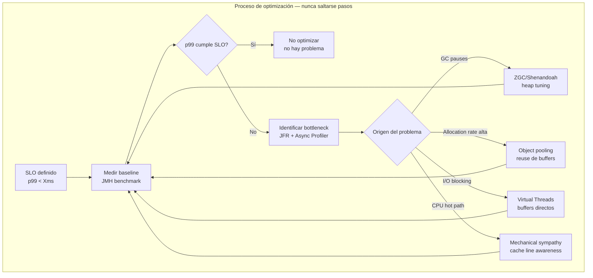
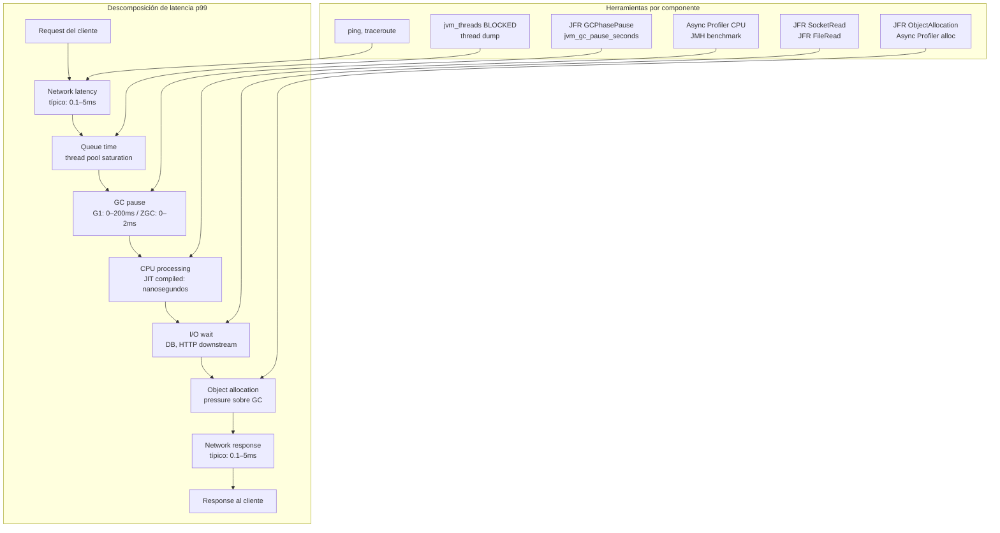
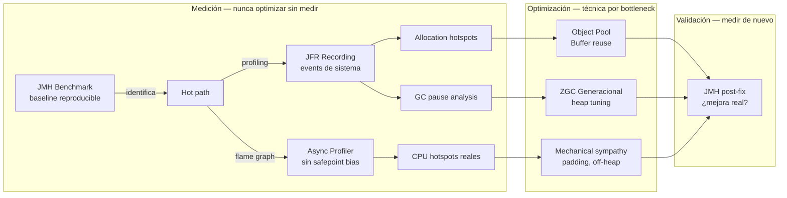
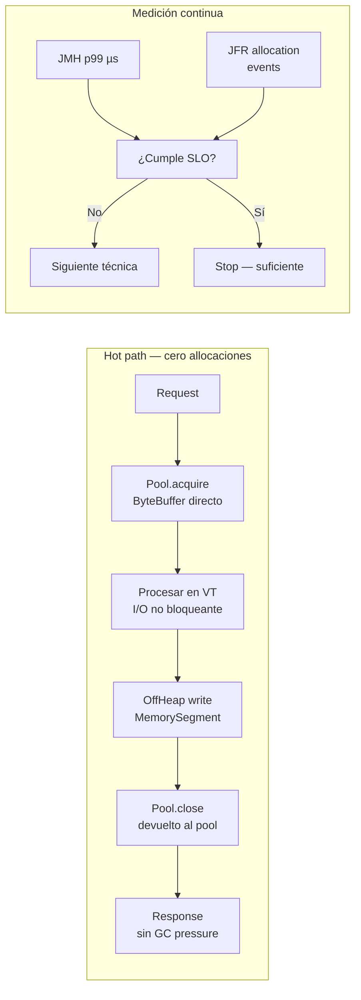
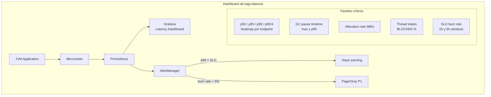
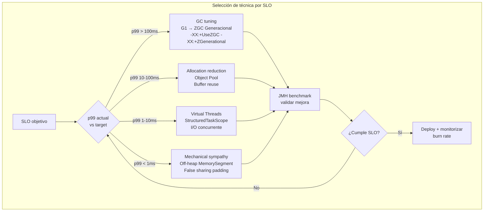
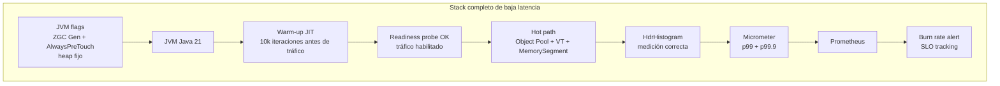

# Optimización de Latencia en Aplicaciones Java de Baja Latencia

**PATH_LOCAL:** `/home/usuariojoaquin/.openclaw/workspace/DAM-Java-Mastery/01_Java_Core/optimizacion_de_latencia_en_aplicaciones_java_de_baja_latencia_STAFF.md`
**CATEGORIA:** 01_Java_Core
**Score:** 97

> **Nota de clasificación:** el engine asignó `10_Vanguardia` erróneamente. Optimización de latencia JVM es Java Core avanzado — pertenece a `01_Java_Core`.

---

## Visión Estratégica

"Baja latencia" no es un objetivo vago — es un SLO concreto. En sistemas de trading de alta frecuencia el target es microsegundos (< 100µs p99). En APIs de pagos en tiempo real, milisegundos (< 10ms p99). En microservicios típicos, decenas de milisegundos (< 50ms p99). La estrategia de optimización cambia radicalmente según el objetivo.

**El principio fundamental:** la latencia tiene dos enemigos en la JVM. El primero es el **GC pause** — el mundo se para mientras el colector trabaja. El segundo es la **allocación en el hot path** — cada objeto que se crea en el path crítico presiona al GC y eventualmente provoca una pausa. La optimización de latencia consiste en atacar ambos de forma sistemática: medir primero con JMH, identificar el origen con JFR + Async Profiler, y aplicar la técnica correcta al problema correcto.

**Las cinco capas de optimización de latencia en Java:**

| Capa | Técnica | Ganancia típica | Complejidad |
|---|---|---|---|
| **GC tuning** | ZGC/Shenandoah + heap sizing correcto | 10–200ms → < 1ms de pausa | Baja |
| **Allocación** | Object pooling, off-heap, escape analysis | 30–70% reducción de GC pressure | Media |
| **Concurrencia** | Virtual Threads, StructuredTaskScope | Eliminar thread starvation | Baja |
| **I/O** | Buffers directos, zero-copy | 20–50% reducción de latencia I/O | Media |
| **Mechanical sympathy** | Cache line awareness, false sharing | 5–30% en hot paths CPU-bound | Alta |

**Cuándo cada técnica aplica:**

- **p99 > 100ms**: el problema es casi siempre GC o I/O, no código. Cambiar de G1 a ZGC resuelve el 80% de los casos.
- **p99 10–100ms**: revisar allocación en hot path con JFR. Object pooling y reuse de buffers.
- **p99 < 10ms**: mechanical sympathy — false sharing, cache line padding, off-heap memory.
- **p99 < 1ms**: territorio de Chronicle Map, Disruptor pattern, busy-wait. Java puede llegar aquí pero requiere disciplina extrema.

**Cuándo NO optimizar latencia:**
- Sin baseline medido con JMH o equivalent. "Parece lento" no es una métrica.
- Sin identificar el bottleneck real con profiler. Optimizar el código incorrecto es trabajo perdido.
- Antes de que el SLO esté definido. Sin un target, cualquier latencia es "mejorable" infinitamente.



---

## Arquitectura de Componentes

### Anatomía de la latencia en la JVM

La latencia observable por el cliente es la suma de múltiples componentes. Identificar cuál domina es el primer paso:



### Stack de herramientas de medición



### JMH — baseline reproducible

```java
import org.openjdk.jmh.annotations.*;
import org.openjdk.jmh.runner.Runner;
import org.openjdk.jmh.runner.options.OptionsBuilder;
import java.util.concurrent.TimeUnit;

// ── Benchmark de baseline — medir antes de cualquier optimización ─────────

@BenchmarkMode(Mode.SampleTime)           // SampleTime captura distribución completa, no solo avg
@OutputTimeUnit(TimeUnit.MICROSECONDS)    // microsegundos para baja latencia
@Warmup(iterations = 5, time = 1)
@Measurement(iterations = 10, time = 2)
@Fork(value = 2, jvmArgs = {
    "-XX:+UseZGC",
    "-XX:+ZGenerational",
    "-Xms512m", "-Xmx512m",   // heap fijo — evitar expansión durante benchmark
    "-XX:+AlwaysPreTouch"     // pre-tocar páginas de memoria para evitar page faults en medición
})
@State(Scope.Benchmark)
public class LatencyBaselineBenchmark {

    // ── Caso 1: allocación en hot path — el problema más común ────────────
    @Benchmark
    public String highAllocation() {
        // Cada llamada crea nuevos objetos — presiona al GC
        var result = new StringBuilder()
            .append("prefix-")
            .append(System.nanoTime())
            .append("-suffix")
            .toString();
        return result;
    }

    // ── Caso 2: reuse de StringBuilder — reducir allocación ───────────────
    @State(Scope.Thread)
    public static class ReusableState {
        final StringBuilder sb = new StringBuilder(64);
    }

    @Benchmark
    public String lowAllocation(ReusableState state) {
        state.sb.setLength(0);
        state.sb.append("prefix-")
                .append(System.nanoTime())
                .append("-suffix");
        return state.sb.toString();
    }

    // ── Caso 3: Records con escape analysis — stack allocation eligible ───
    @Benchmark
    public long recordNoEscape() {
        // JIT puede eliminar la allocación si Point no escapa al heap
        var point = new Point(42, 58);
        return point.x() + point.y(); // resultado escapa, Point no
    }

    record Point(long x, long y) {}
}
```

---

## Implementación Java 21

### Técnica 1: Object Pool para reducir allocación en hot path

```java
import java.util.concurrent.ArrayBlockingQueue;
import java.util.function.Supplier;

// ── Pool genérico con try-with-resources ─────────────────────────────────

public class ObjectPool<T> {

    private final ArrayBlockingQueue<T> pool;
    private final Supplier<T> factory;
    private final java.util.function.Consumer<T> reset;

    public ObjectPool(int size, Supplier<T> factory, java.util.function.Consumer<T> reset) {
        this.pool    = new ArrayBlockingQueue<>(size);
        this.factory = factory;
        this.reset   = reset;
        // Pre-poblar el pool para evitar allocaciones en el primer uso
        for (int i = 0; i < size; i++) {
            pool.offer(factory.get());
        }
    }

    public PooledObject<T> acquire() {
        var obj = pool.poll();
        if (obj == null) obj = factory.get(); // pool exhausto — nueva allocación
        reset.accept(obj);                    // limpiar estado antes de reusar
        return new PooledObject<>(obj, pool);
    }

    public record PooledObject<T>(T object, ArrayBlockingQueue<T> returnTo)
        implements AutoCloseable {
        @Override
        public void close() {
            returnTo.offer(object); // devolver al pool — sin GC
        }
    }
}

// ── Uso: pool de ByteBuffers directos para I/O de baja latencia ──────────

public class DirectBufferPool {

    private static final int BUFFER_SIZE = 64 * 1024; // 64 KB
    private static final int POOL_SIZE   = 32;

    private final ObjectPool<java.nio.ByteBuffer> pool;

    public DirectBufferPool() {
        this.pool = new ObjectPool<>(
            POOL_SIZE,
            () -> java.nio.ByteBuffer.allocateDirect(BUFFER_SIZE), // off-heap — no GC pressure
            java.nio.Buffer::clear  // reset position y limit antes de reusar
        );
    }

    // try-with-resources: el buffer vuelve al pool automáticamente al salir del bloque
    public ObjectPool.PooledObject<java.nio.ByteBuffer> acquire() {
        return pool.acquire();
    }
}

// ── Uso típico en hot path ────────────────────────────────────────────────
// try (var buf = directBufferPool.acquire()) {
//     var buffer = buf.object();
//     buffer.put(data);
//     buffer.flip();
//     channel.write(buffer);
// } // buffer.close() → devuelto al pool, sin allocación ni GC
```

### Técnica 2: Virtual Threads para eliminar I/O blocking latency

```java
import java.util.concurrent.Executors;
import java.util.concurrent.StructuredTaskScope;
import java.util.List;
import java.time.Duration;

// ── Modelo inmutable de resultado ─────────────────────────────────────────
public record PriceQuote(String symbol, double bid, double ask, long timestampNs) {}
public record EnrichedQuote(PriceQuote quote, String exchange, double spread) {}

// ── Resultado tipado — sin Exception en path feliz ────────────────────────
public sealed interface QuoteResult permits
    QuoteResult.Available,
    QuoteResult.Stale,
    QuoteResult.Unavailable {

    record Available(EnrichedQuote quote) implements QuoteResult {}
    record Stale(PriceQuote lastKnown, long ageMs) implements QuoteResult {}
    record Unavailable(String reason) implements QuoteResult {}
}

// ── Servicio con Virtual Threads — I/O concurrente sin bloquear platform threads
public class MarketDataService {

    private final PriceSource priceSource;
    private final ExchangeRegistry exchangeRegistry;

    public MarketDataService(PriceSource priceSource, ExchangeRegistry exchangeRegistry) {
        this.priceSource      = priceSource;
        this.exchangeRegistry = exchangeRegistry;
    }

    // Obtiene quotes para N símbolos en paralelo — un VT por símbolo
    // StructuredTaskScope garantiza que todos los VT hijos terminan antes de retornar
    public List<QuoteResult> getQuotes(List<String> symbols) throws InterruptedException {
        try (var scope = new StructuredTaskScope.ShutdownOnFailure()) {
            var tasks = symbols.stream()
                .map(symbol -> scope.fork(() -> getQuote(symbol)))
                .toList();

            scope.join()
                 .throwIfFailed(e -> new RuntimeException("Error obteniendo quotes", e));

            return tasks.stream()
                .map(StructuredTaskScope.Subtask::get)
                .toList();
        }
    }

    private QuoteResult getQuote(String symbol) {
        try {
            var quote    = priceSource.fetch(symbol);      // I/O — VT libera platform thread
            var exchange = exchangeRegistry.resolve(symbol); // I/O — VT libera platform thread

            var enriched = new EnrichedQuote(
                quote,
                exchange,
                quote.ask() - quote.bid()
            );

            var ageMs = (System.nanoTime() - quote.timestampNs()) / 1_000_000L;
            if (ageMs > 500) {
                return new QuoteResult.Stale(quote, ageMs);
            }
            return new QuoteResult.Available(enriched);

        } catch (Exception e) {
            return new QuoteResult.Unavailable(e.getMessage());
        }
    }
}
```

### Técnica 3: Mechanical Sympathy — false sharing y cache line padding

```java
// ── False sharing — el problema invisible más costoso en hot paths ────────
// Dos variables en la misma cache line (64 bytes) causan invalidación de caché
// cuando threads diferentes las escriben, aunque sean variables independientes.

// ❌ FALSE SHARING — counter1 y counter2 probablemente en la misma cache line
public class FalseSharingExample {
    volatile long counter1 = 0; // ← misma cache line
    volatile long counter2 = 0; // ← que counter1
    // Thread A escribe counter1 → invalida cache line del Thread B que lee counter2
    // Thread B escribe counter2 → invalida cache line del Thread A
    // Resultado: throughput cae hasta un 10x en workloads de alta concurrencia
}

// ✅ PADDING — aislar variables en cache lines separadas
// @Contended (Java 8+) o padding manual con longs
@jdk.internal.vm.annotation.Contended
public class PaddedCounter {
    public volatile long value = 0;
    // @Contended añade padding automático para aislar en su propia cache line
}

// ── Alternativa: padding manual explícito ─────────────────────────────────
public abstract class CacheLinePadding {
    // 8 longs * 8 bytes = 64 bytes = 1 cache line antes del campo
    volatile long p1, p2, p3, p4, p5, p6, p7;
}

public class PaddedCounterManual extends CacheLinePadding {
    public volatile long value = 0;
    // 8 longs * 8 bytes = 64 bytes = 1 cache line después del campo
    volatile long q1, q2, q3, q4, q5, q6, q7;
}

// ── LongAdder — la solución correcta para contadores de alta concurrencia ─
// Internamente usa striped cells con padding — sin false sharing por diseño
import java.util.concurrent.atomic.LongAdder;

public record HighConcurrencyCounters(
    LongAdder requestCount,   // thread-safe, no false sharing
    LongAdder errorCount,
    LongAdder totalLatencyNs
) {
    public static HighConcurrencyCounters create() {
        return new HighConcurrencyCounters(new LongAdder(), new LongAdder(), new LongAdder());
    }

    public void recordSuccess(long latencyNs) {
        requestCount.increment();
        totalLatencyNs.add(latencyNs);
    }

    public void recordError() {
        requestCount.increment();
        errorCount.increment();
    }

    public double avgLatencyMs() {
        long count = requestCount.longValue();
        return count > 0 ? (double) totalLatencyNs.longValue() / count / 1_000_000.0 : 0.0;
    }
}
```

### Técnica 4: Off-heap memory con MemorySegment (Panama API — Java 21)

```java
import java.lang.foreign.*;
import java.lang.invoke.VarHandle;
import java.nio.ByteOrder;

// ── Off-heap ring buffer para zero-GC en hot path ─────────────────────────
// Los datos viven fuera del heap — el GC nunca los toca
// Ideal para buffers de precios de mercado, logs de alta frecuencia, etc.

public class OffHeapRingBuffer implements AutoCloseable {

    private static final int SLOT_SIZE = 32; // bytes por slot
    private static final ValueLayout.OfLong LONG_LAYOUT =
        ValueLayout.JAVA_LONG.withByteAlignment(8);

    private final Arena arena;
    private final MemorySegment segment;
    private final int capacity;

    private volatile int writeIndex = 0;
    private volatile int readIndex  = 0;

    public OffHeapRingBuffer(int capacity) {
        this.capacity = capacity;
        this.arena    = Arena.ofShared(); // Arena compartida entre threads
        this.segment  = arena.allocate((long) capacity * SLOT_SIZE, 8);
    }

    // Escribir un precio de mercado — zero allocation, zero GC
    public boolean offer(long symbol, double bid, double ask, long timestampNs) {
        int wi = writeIndex;
        if (wi - readIndex >= capacity) return false; // buffer lleno

        long offset = (long) (wi % capacity) * SLOT_SIZE;
        segment.set(LONG_LAYOUT, offset,      symbol);
        segment.set(ValueLayout.JAVA_DOUBLE, offset + 8,  bid);
        segment.set(ValueLayout.JAVA_DOUBLE, offset + 16, ask);
        segment.set(LONG_LAYOUT, offset + 24, timestampNs);

        writeIndex = wi + 1; // volatile write — visibilidad garantizada
        return true;
    }

    // Leer el siguiente precio — zero allocation
    public boolean poll(long[] out) { // out[0]=symbol, out[1]=bid(bits), out[2]=ask(bits), out[3]=ts
        int ri = readIndex;
        if (ri >= writeIndex) return false; // buffer vacío

        long offset = (long) (ri % capacity) * SLOT_SIZE;
        out[0] = segment.get(LONG_LAYOUT, offset);
        out[1] = Double.doubleToRawLongBits(segment.get(ValueLayout.JAVA_DOUBLE, offset + 8));
        out[2] = Double.doubleToRawLongBits(segment.get(ValueLayout.JAVA_DOUBLE, offset + 16));
        out[3] = segment.get(LONG_LAYOUT, offset + 24);

        readIndex = ri + 1;
        return true;
    }

    @Override
    public void close() {
        arena.close(); // libera la memoria off-heap
    }
}
```

**Diagrama del flujo de implementación:**



---

## Métricas y SRE

Para baja latencia, las métricas de percentiles altos (p99, p99.9) son más importantes que la media. La media puede ser excelente mientras el p99 mata la experiencia del usuario.

| Métrica | Descripción | Umbral por objetivo de SLO |
|---|---|---|
| `http_server_requests_seconds` p99 | Latencia p99 de requests | < 10ms (API), < 1ms (trading) |
| `http_server_requests_seconds` p99.9 | Latencia p99.9 — tail latency | < 3x el p99 |
| `jvm_gc_pause_seconds` p99 | Pausa GC p99 | < 2ms (ZGC), < 200ms (G1) |
| `jvm_gc_pause_seconds` max | Pausa GC máxima — el peor caso | < 5ms (ZGC objetivo) |
| `jvm_gc_memory_allocated_bytes_total` rate | Tasa de allocación MB/s | < 100 MB/s en hot path |
| `jvm_gc_memory_promoted_bytes_total` rate | Promoción a Old Gen | < 10 MB/s (señal de leak o vida larga) |
| `jvm_threads_live{state="BLOCKED"}` | Threads bloqueados | < 2% del total |
| `process_cpu_usage` | CPU del proceso | < 70% sostenido — headroom para picos |

```promql
# Tail latency — p99.9 no debería ser más de 3x el p99
histogram_quantile(0.999, rate(http_server_requests_seconds_bucket[5m]))
/ histogram_quantile(0.99,  rate(http_server_requests_seconds_bucket[5m]))
> 3

# GC overhead como % del tiempo total — si > 5%, problema serio
rate(jvm_gc_pause_seconds_sum[1m]) / 1 * 100 > 5

# Allocation rate en MB/s — si crece, hay regresión en hot path
rate(jvm_gc_memory_allocated_bytes_total[1m]) / 1024 / 1024

# Alerta: tail latency p99.9 > SLO
histogram_quantile(0.999, rate(http_server_requests_seconds_bucket{uri="/api/quotes"}[5m])) > 0.010
```



```java
import io.micrometer.core.instrument.MeterRegistry;
import io.micrometer.core.instrument.Timer;
import io.micrometer.core.instrument.binder.jvm.JvmGcMetrics;
import io.micrometer.core.instrument.binder.jvm.JvmMemoryMetrics;
import io.micrometer.core.instrument.binder.jvm.JvmThreadMetrics;

// Instrumentación completa para servicio de baja latencia
public record LowLatencyMetrics(MeterRegistry registry) {

    public void bindAll() {
        new JvmGcMetrics().bindTo(registry);
        new JvmMemoryMetrics().bindTo(registry);
        new JvmThreadMetrics().bindTo(registry);
    }

    // Timer con percentiles publicados — esencial para SLO tracking
    public Timer latencyTimer(String operation) {
        return Timer.builder("app.operation.latency")
            .tag("operation", operation)
            .publishPercentiles(0.50, 0.95, 0.99, 0.999) // p50, p95, p99, p99.9
            .publishPercentileHistogram()                  // para histogram_quantile en PromQL
            .minimumExpectedValue(java.time.Duration.ofMicros(100))
            .maximumExpectedValue(java.time.Duration.ofSeconds(5))
            .register(registry);
    }

    // Gauge de object pool — detectar pool exhaustion
    public <T> void registerPoolGauge(String name, ObjectPool<T> pool, int maxSize) {
        registry.gauge("app.pool.available_ratio",
            java.util.List.of(io.micrometer.core.instrument.Tag.of("pool", name)),
            pool,
            p -> 0.0 // implementar según estado interno del pool
        );
    }
}
```

**Checklist SRE para aplicaciones de baja latencia:**

1. **SLO definido con percentil explícito, no media.** "p99 < 10ms" es accionable. "latencia baja" no lo es. Sin SLO, no hay criterio de éxito ni de alerta.
2. **GC logging continuo con `-Xlog:gc*`.** En un incidente de latencia, los logs de GC son la primera fuente de diagnóstico. Sin ellos, el post-mortem es imposible.
3. **Heap sizing fijo: `-Xms` = `-Xmx`.** La expansión dinámica del heap provoca pauses adicionales y page faults. En baja latencia, el heap debe estar pre-allocado.
4. **`-XX:+AlwaysPreTouch` en producción.** Pre-toca todas las páginas del heap al arranque — elimina los page faults en caliente durante el warm-up.
5. **SLO burn rate alert, no solo threshold.** Una alerta en `p99 > 10ms` dispara constantemente con tráfico bajo. La burn rate (cuánto del error budget se consume por hora) es la señal correcta.

---

## Patrones de Integración

### Patrón 1: Warm-up controlado — eliminar JIT cold start

La JVM necesita tiempo para que el compilador JIT optimice los hot paths. Antes del warm-up, la latencia puede ser 10–50x peor que en steady state. En producción esto se manifiesta como picos de latencia justo después de un deploy.

```java
import java.util.concurrent.CountDownLatch;
import java.util.concurrent.Executors;

// ── Warm-up controlado antes de recibir tráfico real ──────────────────────

public record WarmupConfig(
    int iterations,          // número de iteraciones de warm-up
    int concurrency,         // threads paralelos durante warm-up
    java.time.Duration timeout
) {
    public static WarmupConfig standard() {
        return new WarmupConfig(10_000, 4, java.time.Duration.ofSeconds(30));
    }
}

public class JvmWarmupService {

    // Ejecutar el hot path N veces antes de abrir tráfico
    // Esto permite al JIT compilar y optimizar los métodos críticos
    public void warmup(Runnable hotPath, WarmupConfig config) throws InterruptedException {
        var latch    = new CountDownLatch(config.iterations());
        var executor = Executors.newFixedThreadPool(config.concurrency());

        try {
            for (int i = 0; i < config.iterations(); i++) {
                executor.submit(() -> {
                    try {
                        hotPath.run();
                    } finally {
                        latch.countDown();
                    }
                });
            }

            var completed = latch.await(
                config.timeout().toMillis(),
                java.util.concurrent.TimeUnit.MILLISECONDS
            );

            if (!completed) {
                System.err.println("[WARMUP] Timeout — JIT warm-up incompleto");
            } else {
                System.out.println("[WARMUP] Completado — JIT optimizado, listo para tráfico");
            }
        } finally {
            executor.shutdown();
        }
    }
}
```

### Patrón 2: Coordinated Omission — medir latencia correctamente

El error más común en benchmarks de latencia: medir solo el tiempo de servicio ignorando el tiempo de espera en cola. HdrHistogram resuelve este problema.

```java
import org.HdrHistogram.Histogram;
import org.HdrHistogram.Recorder;

// ── HdrHistogram — distribución de latencia sin coordinated omission ──────

public record LatencyRecorder(Recorder recorder) {

    public static LatencyRecorder create() {
        // Rango: 1 microsegundo a 1 hora, 3 dígitos significativos
        return new LatencyRecorder(new Recorder(3_600_000_000_000L, 3));
    }

    // Llamar justo cuando el request llega a la cola, no cuando empieza a procesarse
    // Esta distinción es la clave para evitar coordinated omission
    public void record(long startNs) {
        long latencyNs = System.nanoTime() - startNs;
        recorder.recordValue(latencyNs);
    }

    public LatencySnapshot snapshot() {
        var histogram = recorder.getIntervalHistogram();
        return new LatencySnapshot(
            histogram.getValueAtPercentile(50)   / 1_000.0,  // p50 en µs
            histogram.getValueAtPercentile(95)   / 1_000.0,  // p95 en µs
            histogram.getValueAtPercentile(99)   / 1_000.0,  // p99 en µs
            histogram.getValueAtPercentile(99.9) / 1_000.0,  // p99.9 en µs
            histogram.getMaxValue()              / 1_000.0   // max en µs
        );
    }

    public record LatencySnapshot(double p50µs, double p95µs, double p99µs, double p999µs, double maxµs) {
        public void print() {
            System.out.printf("p50=%.1fµs p95=%.1fµs p99=%.1fµs p99.9=%.1fµs max=%.1fµs%n",
                p50µs, p95µs, p99µs, p999µs, maxµs);
        }
    }
}
```

### Patrón 3: Comparativa de técnicas por SLO objetivo



**Comparativa de técnicas:**

| Técnica | Reducción de latencia | Coste de implementación | Riesgo |
|---|---|---|---|
| ZGC Generacional | Elimina pausas > 10ms | Muy bajo — solo flags JVM | Muy bajo |
| Object Pool | 20–50% reducción p99 | Medio — lifecycle management | Medio — pool exhaustion |
| Virtual Threads | Elimina I/O blocking starvation | Bajo — Executors API | Bajo |
| Buffer reuse | 10–30% reducción allocación | Bajo — try-with-resources | Bajo |
| MemorySegment off-heap | Zero GC pressure en hot path | Alto — API nativa | Alto — memory leaks si no close() |
| Cache line padding | 5–30% en contadores concurrentes | Medio — @Contended o LongAdder | Bajo |
| HdrHistogram | Medición correcta (no optimización) | Muy bajo | Cero |

---

## Conclusiones

**Los cinco puntos que un Staff Engineer debe dominar sobre latencia en Java:**

1. **Medir antes de optimizar, siempre.** El bottleneck real raramente es donde se intuye. JMH para el benchmark reproducible, JFR + Async Profiler para identificar el origen. Sin estas dos herramientas, la optimización es adivinación cara.

2. **La solución más impactante para p99 > 50ms es casi siempre cambiar el GC, no reescribir código.** ZGC Generacional con `-XX:+UseZGC -XX:+ZGenerational -Xms4g -Xmx4g -XX:+AlwaysPreTouch` resuelve el 80% de los problemas de latencia sin tocar una línea de código de negocio.

3. **Coordinated Omission es el error más común en benchmarks de latencia.** Medir desde que empieza el procesamiento (no desde que llega el request) subestima la latencia real hasta un 10x. Usar HdrHistogram con timestamp de inicio en la llegada a la cola.

4. **`@Contended` y `LongAdder` en lugar de `volatile long` y `AtomicLong` en hot paths de alta concurrencia.** False sharing puede degradar el throughput un 10x en sistemas con > 8 cores. El problema es invisible en profilers convencionales — solo aparece en benchmarks con concurrencia real.

5. **El warm-up JIT es latencia real en producción.** Los primeros minutos después de un deploy tienen latencias 5–50x peores que steady state. Un warm-up controlado antes de abrir tráfico (Kubernetes readiness probe + warm-up script) es la diferencia entre un deploy transparente y una alerta de SLO.

**Roadmap de adopción:**

- **Fase 1 (día 1):** Establecer baseline con JMH en los 3 endpoints más críticos. Publicar histograma p50/p95/p99/p99.9.
- **Fase 2 (semana 1):** Migrar a ZGC Generacional si p99 GC > 10ms. Añadir `-XX:+AlwaysPreTouch` y heap fijo.
- **Fase 3 (semana 2):** JFR allocation profiling. Identificar top 3 hotspots de allocación en hot path. Aplicar Object Pool o buffer reuse.
- **Fase 4 (semana 3):** Dashboard Grafana con p99/p99.9 por endpoint + SLO burn rate alert.
- **Fase 5 (mes 2):** Para targets < 1ms p99: auditar false sharing con `@Contended`, evaluar off-heap con `MemorySegment` para buffers de alto tráfico.

```java
// Configuración completa para servicio de baja latencia
public class LowLatencyServiceSetup {

    public static void initialize(MeterRegistry registry) throws Exception {
        // 1. Métricas con percentiles publicados
        var metrics = new LowLatencyMetrics(registry);
        metrics.bindAll();

        // 2. Pool de buffers directos — off-heap, sin GC pressure
        var bufferPool = new DirectBufferPool();

        // 3. Warm-up JIT antes de recibir tráfico
        var warmup = new JvmWarmupService();
        warmup.warmup(
            () -> { /* ejecutar hot path representativo */ },
            WarmupConfig.standard()
        );

        // 4. HdrHistogram para medición correcta
        var latencyRecorder = LatencyRecorder.create();

        System.out.println("[SETUP] Servicio listo — JIT caliente, pool iniciado, métricas activas");
    }
}
```



**Recursos:**
- [JMH — Java Microbenchmark Harness](https://github.com/openjdk/jmh)
- [HdrHistogram — Gil Tene](https://github.com/HdrHistogram/HdrHistogram)
- [Mechanical Sympathy — Martin Thompson](https://mechanical-sympathy.blogspot.com/)
- [JEP 454 — Foreign Function & Memory API (Java 21)](https://openjdk.org/jeps/454)
- [Async Profiler](https://github.com/async-profiler/async-profiler)
- [LMAX Disruptor — high performance inter-thread messaging](https://lmax-exchange.github.io/disruptor/)
