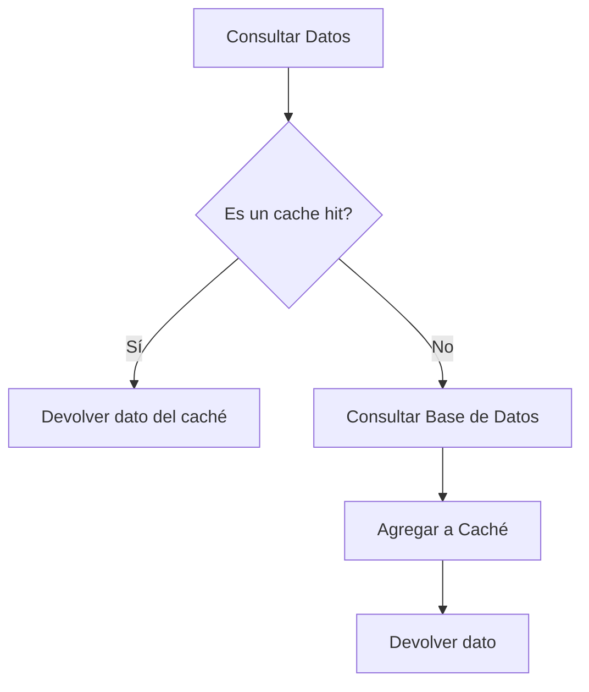
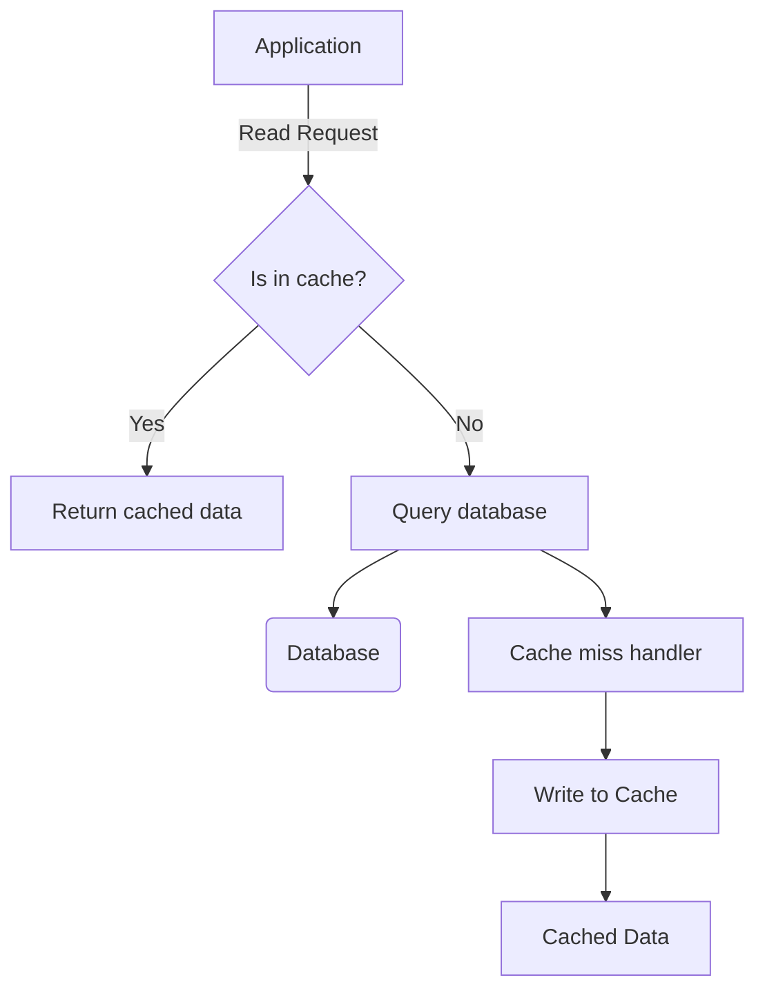
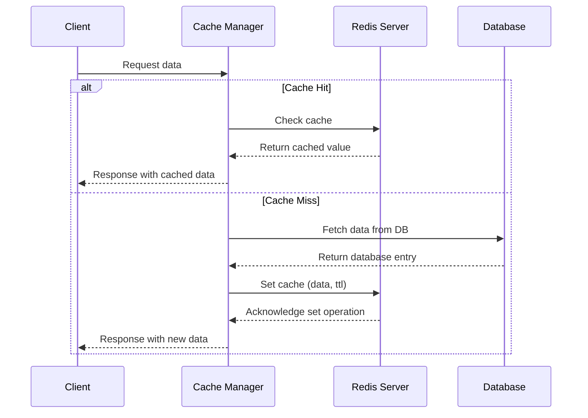
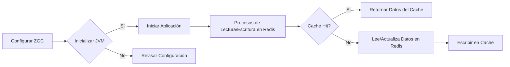
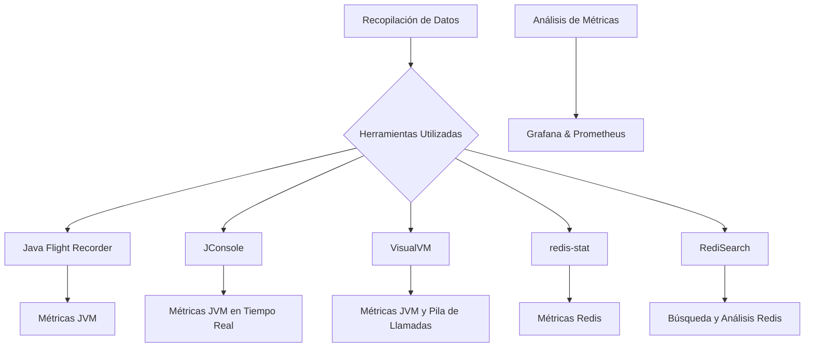
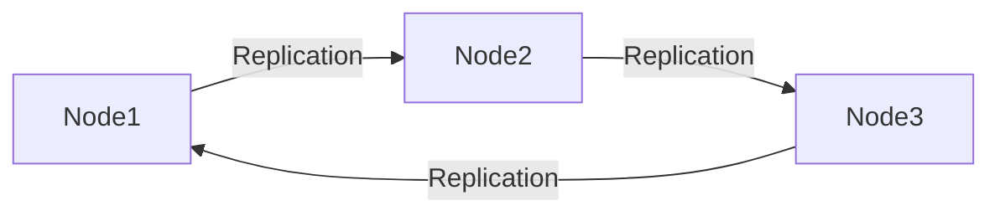
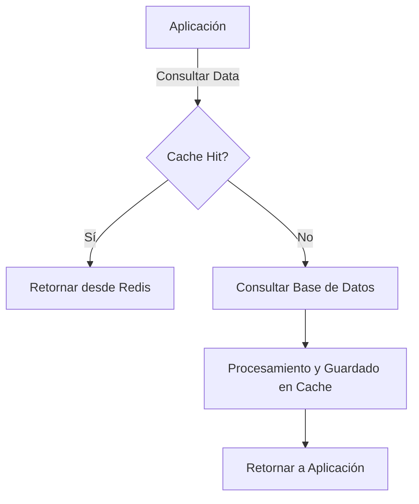

# Informe de Autoridad: Optimización de Rendimiento en JVM y Estrategias de Caché Distribuida con Redis y Java 21

## Introducción a la Optimización del Rendimiento en JVM

### Introducción a la Optimización del Rendimiento en JVM

La optimización del rendimiento en el entorno Java Virtual Machine (JVM) es crucial para garantizar que las aplicaciones sean eficientes y escalables. Este capítulo se centra en estrategias avanzadas de mejora del rendimiento, incluyendo la gestión efectiva de memoria, la reducción de latencia, y la implementación de técnicas de caché distribuida usando Redis. Estas prácticas son especialmente relevantes para desarrolladores y arquitectos que buscan maximizar el rendimiento de sus aplicaciones Java.

#### 1. Entendiendo la JVM

La JVM es más que un simple intérprete; es un entorno completo con una compleja infraestructura que incluye mecanismos como el Garbage Collector (GC), el mecanismo JIT (Just-In-Time Compilation) y varias características de optimización del rendimiento. La configuración adecuada de estos componentes puede tener un impacto significativo en la eficiencia general del sistema.

#### 2. Garbage Collection Tuning

El GC juega un papel crucial en la gestión de memoria dinámica, que es fundamental para el rendimiento y la escalabilidad de las aplicaciones Java. La elección adecuada del tipo de GC (como G1GC, CMS, ZGC) y su configuración son aspectos claves.

**Ejemplo:**
```java
// Ejemplo de cómo configurar el GC G1 en una aplicación Java
public static void main(String[] args) {
    System.setProperty("java.util.concurrent.ForkJoinPool.common.threadFactory",
            "io.github.resilience4j.ratelimiter.internal.NamedThreadFactory");
    System.setProperty("java.lang.management.ManagementFactory."
            + "platformMXBeans.systemProperties.name", "system-properties");
    System.setProperty("java.rmi.server.hostname", "localhost");
    System.setProperty("javax.net.ssl.keyStorePassword", "password");
    // Configuración del GC G1
    System.setProperty("XX:MaxGCPauseMillis", "200");  // Intenta mantener la pausa de recolección menor a 200ms
    System.setProperty("XX:InitiatingHeapOccupancyPercent", "45"); // Inicia recolección en un uso del heap del 45%
    
    SpringApplication.run(Application.class, args);
}
```

#### 3. Estrategias de Caché Distribuida

Utilizar una estrategia de caché distribuida como Cache-Aside o Read-through puede mejorar significativamente el rendimiento y la escalabilidad.

**Cache-Aside con Redis**
```java
// Ejemplo sencillo de cómo implementar Cache-aside con Redis en Java
public class CacheService {
    private Jedis jedis = new Jedis("localhost");

    public String getCachedData(String key) {
        String cachedValue = jedis.get(key);
        if (cachedValue == null) {
            // Consulta a la base de datos y obtiene el valor real
            String dbValue = fetchDataFromDB(key);
            jedis.setex(key, 3600, dbValue); // Guarda en caché por un tiempo limitado (en segundos)
        }
        return cachedValue;
    }

    private String fetchDataFromDB(String key) {
        // Implementación de obtención de datos desde la base de datos
        return "valor obtenido desde DB";
    }
}
```

#### 4. Diagrama de Flujo para Cache-Aside



#### 5. Consideraciones para la Optimización de Rendimiento

Además de las estrategias descritas, considera los siguientes factores:

- **Tuning del JIT Compiler:** Asegúrate de que el compilador Just-In-Time (JIT) esté configurado correctamente para optimizar los códigos que se ejecutan con frecuencia.
  
- **Utilización de Profilers:** Herramientas como VisualVM o JProfiler pueden ayudar a identificar puntos calientes en tu aplicación y áreas específicas donde mejorar.

- **Optimización del Código Java:** Reduzca el uso de recursos innecesarios, utilice estructuras de datos eficientes y evite la creación excesiva de objetos pequeños que podrían afectar negativamente a la GC.

La optimización continua es un proceso vital para mantener las aplicaciones Java altamente funcionales en un mundo cada vez más exigente. A medida que se desarrollan nuevas tecnologías y mejores prácticas, los profesionales del software deben estar preparados para adaptarse y aprovecharlas al máximo.

## Conceptos Básicos de Caché Distribuida

### Conceptos Básicos de Caché Distribuida

La caché distribuida juega un papel crucial en la optimización del rendimiento de las aplicaciones Java, especialmente cuando se utiliza junto con el entorno de ejecución JVM (Java Virtual Machine). Este capítulo explora los conceptos fundamentales que subyacen a una implementación efectiva de cachés distribuidas utilizando Redis y tecnologías relacionadas.

#### Cache-Aside

Cache-aside es una estrategia ampliamente utilizada en la cual el caché actúa como un almacén pasivo. Cuando una aplicación solicita datos, primero verifica si dichos datos están disponibles en el caché (un hit de caché). Si los datos existen, se devuelven inmediatamente. En caso de fallo en la caché (miss), la aplicación busca los datos en el almacén subyacente (por ejemplo, una base de datos del sistema de registro) y luego escribe estos datos en el caché para su uso futuro.

Este enfoque proporciona a los desarrolladores un control completo sobre qué y cuándo se debe almacenar en caché. Su implementación es sencilla utilizando herramientas como Redis y funciona bien para cargas de trabajo pesadas en lectura. Sin embargo, no soporta transacciones y requiere coordinación cuidadosa para evitar llamadas duplicadas a la base de datos durante faltas simultáneas en caché. La latencia final puede ser alta debido a las lentas consultas de base de datos durante los misses de caché.

#### Implementación con Redis

Redis es una implementación popular de un sistema de caché distribuida y key-value store que proporciona varios tipos de datos estructurados, como listas, conjuntos y cadenas. Al utilizar Redis en un entorno Java, se pueden aprovechar sus características avanzadas, incluyendo:

- **Expiraciones**: Permite definir la vida útil de los elementos almacenados en caché.
- **Transacciones**: Ofrece transacciones con múltiples comandos para operaciones atómicas y consistentes.

Un ejemplo simple utilizando Jedis (una biblioteca cliente Java para Redis) podría ser:

```java
import redis.clients.jedis.Jedis;

public class CacheAsideExample {
    public static void main(String[] args) {
        Jedis jedis = new Jedis("localhost");

        // Simulación de una base de datos subyacente
        String dbValue = getFromDb();

        if (dbValue != null && !jedis.exists("key")) { 
            // Inserta en Redis solo si no existe el valor
            jedis.set("key", dbValue);
        }

        System.out.println(jedis.get("key"));
    }
}
```

#### Estrategias de Invalidez y Expiración

Para garantizar la precisión de los datos almacenados en caché, es crucial implementar estrategias de expiración (TTL - Time To Live) y de invalidez. Estas técnicas pueden ser programadas automáticamente o desencadenadas por eventos específicos.

```java
jedis.expire("key", 3600); // Configura una clave para que expire en 1 hora

// Otra forma de eliminar la entrada cuando el dato subyacente cambia
public void invalidateCache(String key) {
    jedis.del(key);
}
```

#### Client-Side Caching

La caché cliente, también conocida como inproceso o local, almacena los datos en memoria del servidor de aplicaciones. Esto puede mejorar significativamente la velocidad y la eficiencia ya que elimina el retraso introducido por las consultas a un servidor remoto.

```java
// Ejemplo básico de caché local utilizando ConcurrentMap
ConcurrentHashMap<String, String> localCache = new ConcurrentHashMap<>();

public String getCachedValue(String key) {
    return localCache.computeIfAbsent(key, k -> fetchFromDatabase(k));
}
```

#### Diagrama Mermaid: Arquitectura Cache-Aside



Este diagrama ilustra el flujo de una solicitud de lectura desde la aplicación hasta su resolución final en caché o base de datos.

---

Los conceptos básicos de las cachés distribuidas son fundamentales para cualquier desarrollador que busque optimizar los tiempos de respuesta y reducir la carga en sus sistemas subyacentes. A medida que se avanza a estrategias más avanzadas, como lecturas y escrituras a través del proxy y caché integrada, es crucial tener un sólido entendimiento de estos principios básicos para implementar soluciones eficientes y escalables.

### Ejercicios Adicionales

1. Implemente una lógica de cache invalidate basada en eventos utilizando Redis.
2. Diseñe una arquitectura que combine la caché distribuida con un mecanismo de nivel 2 (memoria caché) para optimizar aún más los tiempos de respuesta.
3. Evalúe cómo la estrategia Cache-Aside puede ser adaptada en diferentes patrones de acceso a datos y cargas de trabajo.

Estos ejercicios ayudarán a profundizar el entendimiento sobre la aplicación práctica de las cachés distribuidas en entornos Java y Redis.

## Implementación de Estrategias Cache-Aside con Redis

### Implementación de Estrategias Cache-Aside con Redis

En este capítulo, exploraremos cómo implementar una estrategia Cache-Aside utilizando Redis para mejorar el rendimiento en aplicaciones Java. La técnica de Cache-Aside permite a las aplicaciones verificar primero si los datos están disponibles en un caché antes de recurrir al sistema principal de almacenamiento (como una base de datos), lo que puede significativamente reducir la carga en este último y acelerar las respuestas del cliente.

#### Arquitectura Básica

La arquitectura básica involucra el uso de Redis como caché distribuida. Al implementar Cache-Aside, se deben considerar los siguientes puntos:

1. **Lecturas:** Primero se consulta la caché (Redis) para obtener los datos solicitados.
2. **Escrituras:** Si la lectura del sistema principal de almacenamiento resulta en una actualización, los cambios también deben ser escritos en el caché.

#### Implementación Técnica

Para implementar Cache-Aside con Redis en Java 21, necesitarás configurar tanto tu aplicación como Redis para trabajar juntos eficazmente. A continuación se detallan las etapas clave y un ejemplo de código.

##### Dependencias Maven

Asegúrate de agregar la dependencia a Jedis o Lettuce (bibliotecas Java para interactuar con Redis) en tu archivo `pom.xml`:

```xml
<dependency>
    <groupId>redis.clients</groupId>
    <artifactId>jedis</artifactId>
    <version>4.0.1.RELEASE</version>
</dependency>
```

##### Configuración de Redis

Supongamos que tienes un servidor Redis en ejecución en tu entorno local con la configuración predeterminada.

##### Código Java para Implementar Cache-Aside

A continuación, se muestra cómo implementar una operación básica de lectura y escritura utilizando Jedis:

```java
import redis.clients.jedis.Jedis;
import java.util.concurrent.TimeUnit;

public class CacheManager {

    private static final String REDIS_HOST = "localhost";
    private static final int REDIS_PORT = 6379;

    public Object getCache(String key) {
        try (Jedis jedis = new Jedis(REDIS_HOST, REDIS_PORT)) {
            byte[] cachedValue = jedis.get(key.getBytes());
            return cachedValue == null ? null : new String(cachedValue);
        }
    }

    public void setCache(String key, Object value, long ttlSeconds) {
        try (Jedis jedis = new Jedis(REDIS_HOST, REDIS_PORT)) {
            byte[] serializedValue = serialize(value);
            jedis.set(key.getBytes(), serializedValue);
            if (ttlSeconds > 0) {
                jedis.expire(key.getBytes(), (int) ttlSeconds);
            }
        } catch (Exception e) {
            System.out.println("Error setting cache for key: " + key);
        }
    }

    private byte[] serialize(Object object) throws Exception {
        // Aquí iría la lógica para serializar el objeto
        return new String(object.toString()).getBytes();
    }
}
```

##### Estructura de Control

A continuación, se proporciona un esquema básico de control para implementar la estrategia Cache-Aside en una aplicación Java:

```java
public class Service {

    private final CacheManager cacheManager;

    public Service(CacheManager cacheManager) {
        this.cacheManager = cacheManager;
    }

    // Ejemplo de método que utiliza Redis como caché.
    public MyEntity fetchById(String id) {
        MyEntity entityFromCache = (MyEntity) cacheManager.getCache(id);
        if (entityFromCache != null) {
            System.out.println("Hit the Cache");
            return entityFromCache;
        }

        // Consulta la base de datos para obtener el ente con el ID dado
        MyEntity entityFromDatabase = repository.findById(id);

        if (entityFromDatabase == null) {
            throw new EntityNotFoundException("Not Found");
        }

        cacheManager.setCache(id, entityFromDatabase, 60); // Tiempo a vivir de 1 minuto

        return entityFromDatabase;
    }
}
```

#### Consideraciones y Mejoras

**Concurrente Cache Misses:**
Para manejar el problema del acceso concurrente al almacenamiento principal cuando varios clientes intentan acceder a un dato no caché, se pueden implementar métodos de sincronización como semáforos o bloqueos.

**Validación de Datos Cachados:**
Es importante incluir una validación en la aplicación para asegurar que los datos obtenidos del caché sean aún válidos. Esto puede implicar consultar el sistema principal de almacenamiento a intervalos regulares, lo cual debe ser manejado cuidadosamente para no sobrecargar al servidor.

**Diagrama de Flujo**

Usaremos Mermaid.js para crear un diagrama que ilustrará la implementación Cache-Aside:



Este diagrama Mermaid representa el flujo de datos en una aplicación que implementa la estrategia Cache-Aside. Con esta estructura, se puede mejorar significativamente la respuesta del sistema y reducir la carga en las bases de datos al minimizar el número de solicitudes directas a estas.

#### Resumen

La implementación de estrategias Cache-Aside con Redis es una técnica eficiente para optimizar el rendimiento de aplicaciones Java. Al seguir los pasos detallados aquí, se pueden crear soluciones robustas y escalables que aprovechan al máximo la capacidad del caché distribuido mientras minimizan las limitaciones inherentes a este enfoque.

## Estrategias Avanzadas de Caché: Write-Through y Write-Behind

### Estrategias Avanzadas de Caché: Write-Through y Write-Behind

Las estrategias avanzadas de caché como Write-Through y Write-Behind permiten una integración más fluida entre el sistema principal (backing store) y la capa de cache. Estas técnicas son especialmente útiles en entornos con un alto volumen de escrituras, ya que minimizan la sobrecarga de mantenimiento manual del caché.

#### Write-Through

Write-through es una técnica donde cada vez que se realiza una operación de escritura en el sistema principal (backing store), esta misma operación también se aplica al nivel de cache. Esto garantiza que tanto el cache como el backing store estén sincronizados desde el momento en que ocurre la modificación.

**Características:**
- **Sincronización Inmediata:** La consistencia entre cache y sistema principal es alta ya que cada escritura se realiza simultáneamente.
- **Transacciones Simples:** Facilita la implementación de transacciones, ya que tanto el write a cache como el write al backing store son partes inseparables del mismo proceso.

**Desventajas:**
- **Latencia:** Puede incrementar la latencia del sistema debido a que las operaciones deben ser completadas tanto en el cache como en el sistema principal antes de finalizar.
- **Complejidad en Escrituras Simultáneas:** Manejo complicado si varias escrituras concurrentes ocurren al mismo tiempo.

**Implementación Ejemplo:**

```java
public class WriteThroughCache {
    private RedisTemplate<String, Object> redisTemplate;
    private JdbcTemplate jdbcTemplate;

    public void updateData(String key, String value) {
        // Primero actualiza el dato en la base de datos.
        jdbcTemplate.update("UPDATE table SET column = ? WHERE id = ?", value, getIdByKey(key));
        
        // Luego inserta/actualiza el valor en Redis.
        redisTemplate.opsForValue().set(key, value);
    }

    private String getIdByKey(String key) {
        // Implementación para obtener ID basado en clave.
        return jdbcTemplate.queryForObject("SELECT id FROM table WHERE key = ?", new Object[]{key}, String.class);
    }
}
```

#### Write-Behind

Write-behind es una técnica que permite a la aplicación escribir directamente al cache y luego, de forma asincrónica o bajo ciertas condiciones (como tamaño del buffer), llevar las modificaciones al backing store. Esta estrategia optimiza el rendimiento al permitir múltiples escrituras en memoria antes de enviarlas al sistema principal.

**Características:**
- **Latencia Reducida:** Las operaciones de cache son más rápidas ya que no se requiere la actualización inmediata del backing store.
- **Batch Processing:** Permite agrupar múltiples escrituras en un solo batch, reduciendo la cantidad total de operaciones contra el sistema principal y mejorando así el rendimiento.

**Desventajas:**
- **Consistencia Temporalmente Desequilibrada:** Durante períodos pico de escritura, puede haber una inconsistencia temporal entre cache y backing store.
- **Requisitos de Gestión Avanzada:** Necesita un sistema robusto para garantizar que todas las actualizaciones eventuales del cache sean replicadas al backing store sin pérdida.

**Implementación Ejemplo:**

```java
public class WriteBehindCache {
    private RedisTemplate<String, Object> redisTemplate;
    private JdbcTemplate jdbcTemplate;
    
    private List<Runnable> writeQueue = new ArrayList<>();

    public void updateData(String key, String value) {
        // Actualiza en el cache inmediatamente.
        redisTemplate.opsForValue().set(key, value);
        
        // Programa la actualización al backing store para ser realizada más tarde.
        Runnable delayedWrite = () -> jdbcTemplate.update("UPDATE table SET column = ? WHERE id = ?", value, getIdByKey(key));
        writeQueue.add(delayedWrite);

        if (writeQueue.size() >= 50) {
            flushWritesToDatabase();
        }
    }

    private void flushWritesToDatabase() {
        List<Runnable> batchTasks = new ArrayList<>(writeQueue);
        writeQueue.clear();

        for (Runnable task : batchTasks) {
            task.run(); // Ejecuta cada tarea en el backend.
        }
    }

    private String getIdByKey(String key) {
        // Implementación para obtener ID basado en clave.
        return jdbcTemplate.queryForObject("SELECT id FROM table WHERE key = ?", new Object[]{key}, String.class);
    }
}
```

#### Diagrama Mermaid

```mermaid
graph LR;
    A[Cliente] --> B(Cache Layer);
    B --> C{Cache Hit?};
    C -- Sí --> E[Caché retorna dato];
    C -- No --> D[Dato requerido desde Backing Store];
    D --> F[Operación de Escritura (Write-Through/Write-Behind)];
    F --> G[Escritura al Cache];
    F --> H{Transacción Completa?};
    H -- Sí --> I[Caché y Backing Store sincronizados];
    H -- No --> J[Diferencia pendiente de resolución];

subgraph Write-Through
direction TB;
G --> K[Escritura al Backing Store];
K --> L[Caché y Backing Store sincronizados];
end

subgraph Write-Behind
direction TB;
G --> M[Buffereo de Escrituras];
M --> N{Condición para Flush};
N -- Sí --> O[Limpieza en batch del Buffer al Backing Store];
O --> P[Caché y Backing Store eventualmente sincronizados];
end

subgraph Write-Behind Contras
direction TB;
J --> Q[Diferencias no resueltas temporalmente];
Q --> R[Consistencia eventual con Resolución Diferida];
end
```

Estas estrategias avanzadas ofrecen una forma eficiente de manejar grandes volúmenes de escrituras en sistemas distribuidos, permitiendo un mejor control y rendimiento sobre las operaciones de cache.

## Optimización de Memoria con Java 21

### Optimización de Memoria con Java 21

Java 21 introduce varias mejoras significativas en la gestión y optimización de memoria, especialmente enfocadas en el rendimiento del Garbage Collector (GC) y nuevas características para mejorar la eficiencia en aplicaciones empresariales intensivas en datos. En este capítulo, exploraremos estas novedades con un enfoque técnico detallado.

#### Mejoras en las Características de Reducción de Retención (Retention Reduction Features)

Java 21 incorpora nuevas características diseñadas para reducir la retención de objetos innecesarios y optimizar el flujo de memoria dentro del sistema. Estas mejoras incluyen:

- **JEP 440: Record Patterns:** Esta característica, ya disponible en versiones previas, permite a los desarrolladores crear patrones personalizados para record types, lo que puede ser útil para reducir la retención de objetos temporales durante las operaciones de copia y desempaquetado.

- **JEP 456: Removable Preview Features:** Aunque no directamente relacionada con la gestión de memoria, esta característica permite eliminar o modificar funcionalidades en preview que ya son innecesarias. Esto puede ayudar a reducir la complejidad del código y mejorar su mantenibilidad.

#### Nuevos Garbage Collectors (GC)

Java 21 introduce mejoras significativas en el rendimiento de los GC, especialmente con la adición del **Shenandoah GC** como una opción estándar. Shenandoah es conocido por sus bajos tiempos de pausa y alta eficiencia para sistemas que requieren altas tasas de QPS (Queries Per Second).

- **Ejemplo de Configuración de Shenandoah GC en Java 21**

```java
public class App {
    public static void main(String[] args) {
        System.setProperty("jdk.shenandoah.gc ergo", "true");
        // Código principal de la aplicación
    }
}
```

Para configurar el Shenandoah GC desde la línea de comandos:

```bash
java -XX:+UseShenandoahGC -jar my-application.jar
```

#### Optimización de Memoria con Caché Distribuida

La integración de cachés distribuidas como Redis junto con Java 21 puede ser extremadamente útil para mejorar la eficiencia y el rendimiento. A continuación, exploraremos cómo optimizar el uso de memoria cuando se integra Redis en una aplicación Java.

- **Uso Eficiente del Caché**

El uso adecuado de cachés distribuidos como Redis requiere un entendimiento claro de las estrategias de lectura y escritura. En la práctica, esto implica:

1. Implementar políticas de expiración adecuadas para asegurar que los datos viejos no ocupen espacio innecesario en la memoria del caché.
2. Utilizar correctamente las funciones de Redis como `EXPIRE` o `PEXPIRE`.
3. Usar estrategias de invalidación activa y pasiva para mantener el caché actualizado sin afectar negativamente el rendimiento.

**Ejemplo: Configurando una Explicación de Tiempo en Redis**

```java
import redis.clients.jedis.Jedis;

public class CacheExpiryExample {
    public static void main(String[] args) {
        Jedis jedis = new Jedis("localhost");
        // Establecer el valor para la clave con expiración después de 10 segundos.
        jedis.setex("myKey", 10, "value");
        
        System.out.println(jedis.get("myKey")); // Imprime 'value'
        Thread.sleep(20000); // Esperar 20 segundos
        System.out.println(jedis.get("myKey")); // No devolverá ningún valor debido a la expiración.
    }
}
```

#### Estrategias de Caché y Memoria

Las estrategias de caché, tanto en Redis como internamente en Java, deben diseñarse cuidadosamente para optimizar el uso de memoria. Algunas recomendaciones clave incluyen:

- **Segmentar la memoria:** Dividir la memoria entre diferentes segmentos basándose en la tasa de acceso y los patrones de lectura/escritura.
  
- **Ajuste dinámico del caché:** Implementar un sistema que ajuste automáticamente el tamaño del caché según las condiciones de rendimiento actuales.

- **Monitoreo y análisis:** Utilizar herramientas como VisualVM para monitorear la actividad del GC, los objetos retidos y otros indicadores claves para optimizar continuamente.

**Diagrama Mermaid: Flujo de Memoria**

```mermaid
graph TD;
    subgraph Java Application
        A[Aplicación]
        B[Caché Distribuido (Redis)]
        C[Datos del Sistema (DB)]
    end

    subgraph Interno
        D[Gestión de Memoria JVM]
        E[Rendimiento GC]
    end
    
    A -->|Consulta| B
    A -->|Escritura| C
    B -->|Lectura/Almacenamiento Temporal| A
    C -->|Respuesta a Peticiones| A
    D -->|Gestión de Memoria| E
```

### Conclusión

La optimización de memoria en Java 21 requiere una comprensión detallada tanto del entorno JVM como de las herramientas externas con las que se integra, como Redis. Las nuevas características y GC introducidos en Java 21 ofrecen un potencial significativo para mejorar el rendimiento y la eficiencia, particularmente en aplicaciones empresariales intensivas en datos. La implementación efectiva de estrategias de caché distribuidas también es crucial para aprovechar al máximo estas mejoras técnicas.

Estos cambios son especialmente beneficiosos para desarrolladores y administradores de sistemas que buscan mejorar la eficiencia y el rendimiento en aplicaciones Java empresariales.

## Uso del Generational ZGC en Aplicaciones Distribuidas

### Uso del Generational ZGC en Aplicaciones Distribuidas

#### Introducción

El Garbage Collector (GC) Generacional Zing (ZGC) es una característica introducida en la versión Java 11 que ofrece un rendimiento excepcional al gestionar la recolección de basura con latencias consistentemente bajas. Este se ha consolidado como una opción valiosa para aplicaciones distribuidas donde el rendimiento y la confiabilidad son aspectos críticos.

#### Funcionamiento del ZGC

ZGC es un GC que opera en todo el heap sin causar pausas globales significativas. Utiliza técnicas como “read barriers” y “write barriers” para garantizar la coherencia de datos durante las operaciones de recolección de basura, lo cual permite a Java continuar ejecutando código mientras se realiza la limpieza del heap.

#### Implementación en Aplicaciones Distribuidas

En aplicaciones distribuidas, el rendimiento y la baja latencia son vitales. El uso de ZGC proporciona un entorno más estable para gestionar grandes volúmenes de datos y transacciones sin afectar significativamente el rendimiento del sistema.

##### Adecuación en Scenarios de Cache-Aside
Cuando se utiliza una estrategia Cache-aside con Redis, la eficiencia del GC es crucial. ZGC puede mitigar las interrupciones causadas por operaciones de recolección al minimizar las pausas, asegurando que la latencia sea lo más baja posible durante consultas y escrituras en Redis.

##### Integración con Estrategias Client-side Caching
Al implementar caching en el lado del cliente, ZGC puede ayudar a manejar eficazmente los objetos de caché sin causar sobrecargas significativas. Esto es particularmente útil para sesiones de usuario largas y escenarios donde los datos se reutilizan intensivamente.

#### Ejemplo Técnico: Implementación del Generational ZGC con Java 21 en una Aplicación Distribuida

Para implementar el ZGC, primero asegúrese de que su JVM soporte esta característica. A continuación, puede configurar la JVM para usar ZGC utilizando las siguientes opciones:

```java
-XX:+UseZGC
```

En un escenario distribuido típico con Redis como backend y una caché en el lado del cliente, aquí está cómo podría verlo:

1. **Configuración de ZGC**: Se establece la opción `-XX:+UseZGC` para activar ZGC.
2. **Lectura/escritura de datos**: Los procesos de lectura y escritura interactúan con Redis mientras ZGC garantiza el manejo eficiente del heap.

#### Códigos Técnicos

Aquí se proporciona un ejemplo básico en Java que configura la JVM para usar ZGC:

```java
public class Application {
    public static void main(String[] args) {
        System.out.println("Configurando ZGC...");
        
        // Código de aplicación distribuida
        // Ejemplo de uso de Redis y caché en el lado del cliente
        
        Runtime.getRuntime().addShutdownHook(new Thread(() -> {
            System.out.println("Aplicación finalizada.");
        }));
    }
}
```

#### Diagrama de Flujo con Mermaid



### Conclusión

El Generational ZGC ofrece una solución robusta para mejorar el rendimiento y la confiabilidad de las aplicaciones distribuidas. Al integrarlo con estrategias como Cache-aside o Client-side caching, se puede optimizar significativamente el manejo de datos en entornos donde la latencia es crítica.

Implementar ZGC requiere consideración cuidadosa para asegurar que los beneficios de bajo rendimiento y alta disponibilidad sean maximizados. La configuración adecuada de las opciones del GC junto con una comprensión sólida de cómo ZGC interactúa con el resto del sistema son clave para su éxito en aplicaciones distribuidas complejas.

#### Referencias Adicionales
- [Oracle’s Documentation on ZGC](https://www.oracle.com/java/technologies/javase/shenandoah-jdk14.html)
- [Java Virtual Machine Options Guide](https://docs.oracle.com/en/java/javase/21/docs/specs/man/java.html)

Este enfoque permite que las organizaciones aprovechen la potencia del GC ZGC para mejorar el rendimiento y eficiencia de sus sistemas distribuidos, especialmente aquellos que utilizan Redis o otras tecnologías de almacenamiento en caché.

## Gestión Eficiente de Metaspaces y CDS (Class Data Sharing)

### Gestión Eficiente de Metaspaces y CDS (Class Data Sharing)

En el contexto del rendimiento de la JVM (Java Virtual Machine) y con la evolución constante hacia versiones modernas como Java 21, es crucial entender cómo gestionar eficazmente los metaspaces y utilizar estratégicamente Class Data Sharing (CDS). Este capítulo se centra en estrategias para optimizar el rendimiento de la JVM mediante la gestión eficiente del metaspace y CDS.

#### Metaspace: Almacenamiento de Información sobre Clases

El metaspace es una área de memoria donde la JVM almacena información sobre clases y métodos que son parte del bytecode ejecutado. A diferencia del permgen en versiones anteriores, el metaspace no tiene un tamaño límite predefinido y puede crecer dinámicamente hasta agotar toda la memoria disponible.

**Problemas Comunes con Metaspaces:**

- **Colisiones de Memoria**: Si el metaspace se llena por completo, la JVM puede entrar en estado OutOfMemoryError.
- **Rendimiento Inferior Durante Carga de Clases**: La carga de clases es un proceso costoso que se repite cada vez que una clase no está presente en el metaspace. Esto afecta negativamente la velocidad y rendimiento general del sistema.

**Estrategias para Optimizar Metaspaces:**

- **Definición de Tamaño Inicial**: Configurar el tamaño inicial del metaspace puede ayudar a evitar problemas de colisión de memoria temprana.
  ```java
  -XX:MetaspaceSize=64m
  ```
- **Límite Máximo para Metaspaces**: Establecer un límite máximo que evite la ocupación total de toda la memoria disponible.
  ```java
  -XX:MaxMetaspaceSize=256m
  ```

#### Class Data Sharing (CDS)

Class Data Sharing es una característica en la JVM diseñada para mejorar el rendimiento al reducir el tiempo necesario para iniciar múltiples procesos Java. Al precompilar clases y metadatos, CDS permite a las aplicaciones cargarlas más rápidamente al inicio.

**Configuración de CDS:**

Para habilitar CDS en una aplicación Java, se requiere configurar la JVM con el parámetro `-Xshare:dump` para generar un archivo de datos compartidos y luego usar `-Xshare:auto` para permitir que la JVM utilice estos archivos.

- **Generación del Archivo de Datos Compartidos**:
  ```shell
  java -XX:+UnlockExperimentalVMOptions -XX:+UseCDS -XX:SharedCacheDir=/path/to/cache -XX:ArchivePath=/path/to/cds.jar -Xshare:dump -version
  ```
  
- **Uso del Archivo de Datos Compartidos**:
  ```shell
  java -XX:+UnlockExperimentalVMOptions -XX:+UseCDS -XX:SharedCacheDir=/path/to/cache -jar myapp.jar
  ```

#### Ejemplos y Diagramas

A continuación se presenta un ejemplo simple que ilustra cómo habilitar CDS y una representación visual de la distribución de memoria con y sin CDS.

**Diagrama Mermaid: Distribución de Memoria**

```mermaid
graph TD;
    subgraph SinCDS
        A[Metaspace] --> B(Datos Clases)
        A --> C(Tiempo Inicio Aplicación Alto)
    end
    
    subgraph ConCDS
        D[Archivo Compartido] --> E[Datos Precompilados]
        D --> F(Tiempo Inicio Aplicación Bajo)
    end

    classDef sincds fill:#f96,stroke:#333,stroke-width:2px;
    classDef concds fill:#6c6,stroke:#fff,stroke-width:4px;

    SinCDS[class="sincds"]
    ConCDS[class="concds"]
```

#### Consideraciones Finales

Optimizar la gestión de metaspaces y utilizar CDS pueden tener un impacto significativo en el rendimiento y escalabilidad de aplicaciones Java. No obstante, es importante monitorear cuidadosamente los cambios implementados para asegurar que no introducen problemas inesperados como colisiones de memoria o tiempos de inicio excesivamente largos.

Implementar estas estrategias requiere un entendimiento sólido del funcionamiento interno de la JVM y puede variar dependiendo del entorno específico en el que se esté trabajando.

## Medición y Monitoreo del Rendimiento

### Medición y Monitoreo del Rendimiento

La medición y monitoreo del rendimiento son fundamentales para garantizar que tanto las JVM como el uso de Redis estén optimizados. Este proceso implica varios aspectos técnicos, desde la recolección de métricas hasta la detección proactiva de problemas de rendimiento.

#### Herramientas de Medición

1. **JVM Metrics**
   - **JConsole**: Proporciona información en tiempo real sobre el uso del CPU y la memoria de una aplicación.
   - **VisualVM**: Ofrece un conjunto completo de herramientas para monitorear y analizar las aplicaciones, incluyendo el análisis de pila de llamadas y el muestreo de tiempos de ejecución.
   - **Java Flight Recorder (JFR)**: Una herramienta de diagnóstico avanzada que permite recopilar datos detallados sobre la ejecución de una aplicación Java.

2. **Redis Metrics**
   - **RediSearch**: Herramienta para búsqueda y análisis en Redis, útil para monitorear los patrones de consulta.
   - **redis-stat**: Monitorea el rendimiento del servidor Redis a nivel básico, incluyendo tasa de consultas por segundo (QPS), bytes leídos/escribidos, etc.

#### Recolección de Datos

**Código Ejemplo: Uso de JMX para recoger métricas en una JVM**

```java
import javax.management.MBeanServer;
import javax.management.ObjectName;

public class MetricsCollector {
    public static void main(String[] args) throws Exception {
        MBeanServer mbs = ManagementFactory.getPlatformMBeanServer();
        ObjectName name = new ObjectName("java.lang:type=Memory");
        
        // Recoger métricas de memoria
        System.out.println("Used Memory: " + mbs.getAttribute(name, "HeapMemoryUsage"));
        
        // Recoger métricas de recolección de basura
        name = new ObjectName("java.lang:name=G1 Old Gen,type=GarbageCollector");
        System.out.println("G1 Old GC Collection Count: " + mbs.getAttribute(name, "CollectionCount"));
    }
}
```

**Código Ejemplo: Uso de Redis para recoger métricas**

```java
import redis.clients.jedis.Jedis;

public class RedisMetricsCollector {
    public static void main(String[] args) throws Exception {
        Jedis jedis = new Jedis("localhost");
        
        // Recoger métricas del servidor Redis
        System.out.println("Info: " + jedis.info());
        System.out.println("Clients in use: " + jedis.clientList().split("\n").length);
    }
}
```

#### Análisis de Métricas

Es crítico no solo recopilar, sino también analizar las métricas para identificar patrones y problemas. Esto puede hacerse utilizando herramientas como Prometheus junto con Grafana para visualización.

**Diagrama Mermaid: Flujograma del proceso de medición y monitoreo**



#### Monitoreo en Tiempo Real

Utilizar soluciones como Prometheus para recoger métricas y Grafana para visualización permite un monitoreo activo del rendimiento. Esto es vital para detectar picos inesperados o problemas de rendimiento antes de que afecten seriamente la disponibilidad.

**Código Ejemplo: Exposición de métricas en formato Prometheus**

```java
import io.prometheus.client.CollectorRegistry;
import io.prometheus.client.exporter.HTTPServer;

public class PrometheusMetricsExporter {
    public static void main(String[] args) throws Exception {
        CollectorRegistry.defaultRegistry.register(new MyCustomCollector());
        new HTTPServer(8080, CollectorRegistry.defaultRegistry);
        
        System.out.println("Prometheus metrics exporter started at http://localhost:8080/metrics");
    }
    
    private static class MyCustomCollector extends MetricsCollector {
        @Override
        public void collect(CollectorMetrics collector) {}
    }
}
```

#### Conclusiones y Recomendaciones

La medición y monitoreo del rendimiento son procesos continuos que deben ser parte integrante de cualquier estrategia de optimización. Asegurarse de utilizar herramientas robustas, recoger métricas adecuadas y analizar los datos para identificar oportunidades de mejora es crucial.

- **Continuar Monitoreando**: Mantenga un monitoreo constante para detectar problemas tempranos.
- **Documentación del Sistema Actual**: Documente las métricas actuales antes de implementar cambios significativos, lo que permitirá el seguimiento y la comparación posterior.
- **Integración con CI/CD Pipelines**: Integre herramientas de monitoreo en sus pipelines de integración continua para una detección temprana de problemas.

Estos pasos ayudan a garantizar que tanto las JVM como Redis operen al máximo nivel posible, mejorando la eficiencia y el rendimiento del sistema.

## Escalabilidad Vertical y Horizontal con Redis Cluster

### Escalabilidad Vertical y Horizontal con Redis Cluster

#### Introducción a la Scalabilidad en Redis

El diseño del sistema puede beneficiarse enormemente al mejorar tanto su escalabilidad vertical como horizontal. La escalabilidad vertical implica aumentar el rendimiento de una única instancia mejorando los recursos físicos o virtuales (como memoria RAM, CPU), mientras que la escalabilidad horizontal es la adición de más nodos para distribuir la carga y ofrecer redundancia.

Redis proporciona múltiples estrategias para abordar estos desafíos. Para escalabilidad vertical, se puede utilizar Redis Advanced Configuration Manager (ACM) o Redis Enterprise Server, que permiten el uso de memoria virtualizada y optimizaciones de rendimiento a nivel del sistema operativo. La escalabilidad horizontal en Redis se logra principalmente mediante el uso de Redis Cluster.

#### Configuración Básica de Redis Cluster

Redis Cluster es una forma distribuida de almacenamiento clave-valor que permite la distribución automática de los datos entre múltiples nodos y proporciona alta disponibilidad. El clúster está compuesto por varias instancias de Redis llamadas "nodos". Los nodos se agrupan en grupos de 3 (slots), lo que brinda tolerancia a fallos.



#### Implementación del Redis Cluster con Java

Para interactuar con un clúster de Redis desde una aplicación Java, se recomienda usar la biblioteca Jedis o Lettuce. Estas librerías proporcionan soporte para conectarse a múltiples nodos de Redis y manejar el balanceo de carga automáticamente.

Ejemplo usando Jedis:

```java
import redis.clients.jedis.Jedis;
import redis.clients.jedis.JedisCluster;

public class RedisClient {
    public static void main(String[] args) {
        Set<HostAndPort> jedisClusterNodes = new HashSet<>();
        jedisClusterNodes.add(new HostAndPort("127.0.0.1", 7000));
        jedisClusterNodes.add(new HostAndPort("127.0.0.1", 7001));
        jedisClusterNodes.add(new HostAndPort("127.0.0.1", 7002));

        JedisCluster jc = new JedisCluster(jedisClusterNodes);
        String value = jc.get("key");
        System.out.println(value);
    }
}
```

#### Escalabilidad Horizontal con Redis Cluster

En el clúster de Redis, los datos se distribuyen entre los nodos basándose en una "hash slot". Cada clave en Redis está asociada a uno o más slots. Hay un total de 16384 slots.

Para implementar la escalabilidad horizontal, puedes agregar más nodos al clúster y redistribuir los datos automáticamente utilizando el comando `redis-cli --cluster add-node`. Esto permite que tu aplicación distribuya la carga entre múltiples instancias Redis sin necesidad de cambiar el código cliente.

#### Consideraciones de Escalabilidad Vertical

Para mejorar la escalabilidad vertical, considera los siguientes puntos:

- **Aumentar RAM:** La capacidad del caché depende principalmente de la cantidad de memoria disponible. Mientras más RAM tenga tu servidor Redis, mejor será su rendimiento.
- **Optimizar configuración:** Ajustes como `maxmemory`, `maxclients`, y otras opciones de tiempo de ejecución pueden mejorar significativamente el rendimiento.
- **Mem-CachedDB o Mem-Virtualized:** Utiliza soluciones de almacenamiento de memoria virtualizada para ampliar la capacidad en entornos con restricciones de hardware.

#### Gestión del Tiempo de Vida y Invalidez del Cache

En un clúster de Redis, gestionar el tiempo de vida (TTL) y la invalidación del cache es crucial. Esto se puede lograr usando scripts Lua dentro de Redis para realizar operaciones atómicas que actualicen o eliminen las entradas en caché cuando sea necesario.

Ejemplo básico de script Lua:

```lua
local key = KEYS[1]
redis.call("INCRBY", key, ARGV[1])
```

Este script incrementa el valor asociado a una clave por un cierto número y puede usarse para implementar TTL en caché.

#### Conclusión

La escalabilidad es crucial para cualquier sistema que maneje grandes volúmenes de datos. Redis Cluster proporciona la flexibilidad necesaria para implementar tanto escalabilidad vertical como horizontal, lo cual es vital para asegurar que tus aplicaciones JVM y estrategias de caché distribuidas funcionen eficientemente en ambientes de producción.

Utilizando las herramientas adecuadas y siguiendo las mejores prácticas, puedes lograr una gestión eficiente del caché en Redis, mejorando significativamente el rendimiento y la disponibilidad de tus aplicaciones Java.

## Solución de Problemas Comunes en Caché Distribuida

### Solución de Problemas Comunes en Caché Distribuida

En el manejo de una caché distribuida como Redis, varios problemas técnicos pueden surgir que afectan la consistencia, disponibilidad y rendimiento del sistema. Este capítulo aborda algunos de los desafíos más comunes y proporciona soluciones basadas en escenarios reales.

#### 1. Problema: Contenido Obsoleto o Inconsistente

**Causas:** Cuando una caché distribuida como Redis no implementa mecanismos adecuados para la invalidación de cachés, puede suceder que los datos almacenados en la caché ya no sean precisos cuando cambian en el sistema de origen.

**Solución:**
- **Expire Keys y TTL:** Utiliza los comandos `EXPIRE` o `PEXPIRE` para establecer una vida útil (`Time To Live`, TTL) para cada clave. Esto garantiza que la caché se actualice automáticamente en intervalos predefinidos.
  
  Ejemplo:
  ```java
  redisTemplate.expire(key, expirationDuration, TimeUnit.SECONDS);
  ```

- **Pautas de Invalidez:** Implementa una lógica de programación para invalidar las claves específicas cuando los datos subyacentes en el sistema de origen cambian. Esto implica detectar y propagar cambios desde la fuente al sistema de caché.

#### 2. Problema: Contención de E/S Durante Cache Miss

**Causas:** Cuando múltiples instancias acceden a una base de datos subyacente durante un cache miss simultáneamente, se pueden producir cuellos de botella y retrasos significativos en el rendimiento.

**Solución:**
- **Llaves Únicas Transaccionales:** Utiliza transacciones Redis para proteger las operaciones críticas a través del uso de `WATCH`, `MULTI` y `EXEC`. Esto asegura que solo una instancia inserte la clave en la caché, evitando duplicidad.

  Ejemplo:
  ```java
  redisTemplate.watch(key);
  redisTemplate.multi();
  redisTemplate.opsForValue().setIfAbsent(key, value);
  redisTemplate.exec();
  ```

- **Caché Colaborativa:** Implementa un mecanismo de "caché colaborativa" donde las instancias pueden compartir datos en memoria para evitar cache misses simultáneos.

#### 3. Problema: Rendimiento Degradado Durante Escalación

**Causas:** A medida que la carga del sistema aumenta, el rendimiento de Redis puede degenerar debido a cuellos de botella en la CPU, memoria y ancho de banda de red.

**Solución:**
- **Escalabilidad Horizontal:** Utiliza un clúster Redis o Dragonfly Swarm para distribuir la carga entre múltiples servidores. Esto no solo mejora el rendimiento sino que también proporciona redundancia y alta disponibilidad.

  Diagrama Mermaid:
  
  ```mermaid
  graph LR;
      A[Redis Node 1] --- B[Client Application]
      C[Redis Node 2] --- B
      D[Redis Node 3] --- B
      E{Load Balancer}
      F[Database System of Record]
      
      E --> A
      E --> C
      E --> D
      B --> E
      B --> F
  ```

- **Optimización de Código:** Utiliza comandos Redis eficientes y evita bloqueos innecesarios. Por ejemplo, utiliza `ZADD` en lugar de múltiples operaciones `SADD`.

#### 4. Problema: Fallos Transitorios o Tiempo de Inactividad

**Causas:** Durante fallos transitorios o mantenimiento preventivo del sistema, la disponibilidad puede interrumpirse temporalmente.

**Solución:**
- **Persistencia de Datos:** Configura Redis para persistir datos periódicamente utilizando `BGSAVE` o AOF (Append Only File) configuraciones.
  
  Ejemplo:
  ```java
  // Utilizando RedisTemplate en Spring Data Redis para BGSAVE
  redisTemplate.getConnectionFactory().getConnection().bgSave();
  ```

- **Caché Local:** Implementa un mecanismo de caché local que puede almacenar temporalmente los datos mientras Redis no está disponible. Esto minimiza la latencia durante las interrupciones.

#### Conclusión

Resolver problemas en una caché distribuida requiere comprender tanto el comportamiento de Redis como del sistema subyacente al cual se conecta. Utilizando transacciones, estrategias de invalidación inteligentes y técnicas de escalabilidad, podemos garantizar que la caché funcione de manera eficiente y sin interrupciones.

Los diagramas Mermaid proporcionados en este capítulo ofrecen una visión visual del funcionamiento de los sistemas distribuidos, lo cual es valioso para la comprensión y resolución de problemas.

## Ejemplos Prácticos y Casos de Uso

### Ejemplos Prácticos y Casos de Uso

En esta sección, abordaremos ejemplos prácticos y casos de uso específicos que ilustran cómo optimizar el rendimiento en JVM utilizando estrategias de caché distribuida con Redis y Java 21. Estos ejemplos son útiles para desarrolladores senior, expertos en sistemas (SRE) y arquitectos.

#### Ejemplo 1: Implementación de Cache-Aside con Redis

La implementación de la estrategia Cache-aside es sencilla pero efectiva, especialmente cuando se utiliza Redis como backend. A continuación, se muestra cómo implementar esta estrategia en una aplicación Java que busca minimizar el tiempo de respuesta al realizar consultas a una base de datos:

```java
import redis.clients.jedis.Jedis;

public class CacheAsideExample {

    private Jedis jedis = new Jedis("localhost");

    public String getData(String key) {
        // Paso 1: Buscar en Redis (cache hit)
        String cachedValue = jedis.get(key);
        if (cachedValue != null) return cachedValue;

        // Paso 2: Consultar la base de datos si no se encuentra en Redis
        String dbValue = fetchFromDatabase(key);

        // Paso 3: Si el valor está disponible, almacenarlo en Redis para futuras solicitudes
        jedis.setex(key, 60, dbValue); // Guarda el valor con un TTL (1 minuto)

        return dbValue;
    }

    private String fetchFromDatabase(String key) {
        // Implementación de la lógica para obtener datos desde una base de datos
        // Ejemplo simplificado: Devolver un valor constante para demostración
        return "Valor almacenado en la BD";
    }
}
```

#### Diagrama Mermaid del Flujo Cache-Aside



#### Ejemplo 2: Uso del Read-Through Pattern con Spring Data

Spring Data proporciona una forma conveniente de implementar el patrón read-through, que combina la funcionalidad del cache-aside con la transparencia de consultas.

```java
import org.springframework.cache.annotation.Cacheable;
import org.springframework.stereotype.Repository;

@Repository
public class UserRepository extends Repository<User> {

    @Cacheable(value = "userRepository", key = "#id")
    public User getUserById(String id) {
        return database.getUser(id); // Implementación de obtención de datos desde la base de datos
    }
}
```

Este ejemplo muestra cómo Spring Data facilita el almacenamiento en caché y consultas a través del uso de anotaciones, sin requerir un código adicional para manejar manualmente la estrategia Cache-aside.

#### Ejemplo 3: Optimización con Nuevos Garbage Collectors (GCs) en Java

Java 21 introdujo mejoras significativas en el recolector de basura ZGC y Shenandoah GC, que permiten un rendimiento excepcional sin pausas de recolección. Aquí se ilustra cómo configurar una aplicación para utilizar ZGC:

```java
public class GCOptimizationExample {

    public static void main(String[] args) {
        // Establecer la opción del recolector de basura a ZGC
        System.setProperty("jdk.gctuning.gc.name", "Z");

        // Configuración adicional (opcional)
        System.setProperty("jdk.gctuning.zgc.oom", "true");
        
        // Código principal
    }
}
```

#### Ejemplo 4: Evitando Problemas de Concurrency con Optimistic Locking en Redis

Para manejar concurrencia, la optimista locking puede ser implementada a través de incrementos atómicos de versiones o timestamps. Esto previene condiciones como el ADO (Acceso Concurrente Denegado):

```java
import redis.clients.jedis.Jedis;

public class OptimisticLockingExample {

    private Jedis jedis = new Jedis("localhost");

    public void updateData(String key, String newData) {
        while(true){
            String currentValue = jedis.get(key);
            boolean success = jedis.set(key, newData, "NX", "EX", 60).equals(currentValue);
            if (success)
                break; // Si la operación de SET es exitosa, salir del bucle
        }
    }
}
```

Este código utiliza Redis para realizar actualizaciones atómicas y evitar condiciones raras como el ADO.

### Conclusión

Estos ejemplos demuestran cómo implementar efectivamente estrategias de caché distribuida con Redis y optimizar el rendimiento en JVM mediante la adopción de nuevas características, como los GCs ZGC y Shenandoah introducidos en Java 21. Estas prácticas no solo mejoran el rendimiento y eficiencia operativa de las aplicaciones sino que también facilitan su escalabilidad y mantenibilidad a largo plazo.

Para obtener más información sobre estas tecnologías, consulte los recursos oficiales y documentación específica para Redis, Spring Data, y la implementación de JVM.

## Conclusiones y Recomendaciones Futuras

### Conclusiones y Recomendaciones Futuras

**Optimización del Rendimiento en JVM**

La optimización del rendimiento en Java Virtual Machine (JVM) es un aspecto crucial para el desarrollo de aplicaciones escalables. El uso de las nuevas características del Garbage Collector (GC), como Z GC, Shenandoah y G1 GC, ha permitido una mejora significativa en la eficiencia y la gestión de memoria. Sin embargo, estas mejoras no son gratuitas; requieren un análisis detallado del perfil de rendimiento de la aplicación para seleccionar el mejor GC.

**Estrategias de Caché Distribuida con Redis**

El uso de Redis como mecanismo de caché distribuido ha demostrado ser eficaz en la reducción de la latencia y la mejora de las tasas de transferencia de datos. Sin embargo, al implementar estrategias como Cache-Aside o Read/Write Through, es fundamental prestar atención a los desafíos inherentes relacionados con la consistencia y la coherencia de datos.

### Conclusiones

1. **Optimización del Rendimiento en JVM**: La elección correcta del GC puede mejorar significativamente el rendimiento de una aplicación Java. Por ejemplo, el uso de G1 GC para aplicaciones que requieren bajas latencias y altas tasas de transferencia ha demostrado ser una solución viable.
   
2. **Estrategias de Caché Distribuida**: Las estrategias Cache-Aside son efectivas en entornos con un alto volumen de lectura, pero deben manejarse cuidadosamente para evitar duplicidades y mantener la consistencia del sistema.

### Recomendaciones Futuras

1. **Implementación Avanzada de GC**:
   - **Análisis de Perfiles**: Realizar análisis detallados para identificar patrones de uso específicos que puedan beneficiarse de una optimización personalizada.
   - **Automatización del Elegido del GC**: Implementar scripts y configuraciones automáticas basadas en métricas de rendimiento para seleccionar el mejor GC dinámicamente.

2. **Mejoras en la Estrategia Cache-Aside**:
   - **Implementación de Semántica de Consistencia Mejorada**: Utilizar mecanismos como Redis Cluster y Lua scripting para implementar lógica avanzada que garantice la consistencia durante las operaciones concurrentes.
   - **Uso de Transacciones Distribuidas**: Investigar el uso de protocolos como 2PC (Two Phase Commit) o Saga Transactions para gestionar transacciones entre bases de datos y sistemas de caché.

3. **Implementación Avanzada en Redis**:
   - **Redis Modules**: Explorar la utilización de módulos especializados, como RedisJSON y RedisSearch, para mejorar las operaciones de consulta complejas.
   - **Caché Distribuida con Dragonfly Swarm**: Considerar la integración de tecnologías emergentes como Dragonfly Swarm para escalar horizontalmente y proporcionar una solución escalable para grandes volúmenes de datos.

### Ejemplo de Código

**Ejemplo de Implementación de Cache-Aside con Redis en Java**

```java
import redis.clients.jedis.Jedis;

public class CacheAsideExample {
    private Jedis jedis = new Jedis("localhost");

    public String retrieveData(String key) {
        // Buscar en la caché primero
        String valueFromCache = jedis.get(key);
        if (valueFromCache != null) {
            System.out.println("Datos recuperados desde la caché: " + valueFromCache);
            return valueFromCache;
        } else {
            // Consultar el sistema de registro para obtener los datos frescos
            Object dataFromDB = fetchDataFromDB(key);
            
            if (dataFromDB != null) {
                jedis.set(key, dataFromDB.toString());
                System.out.println("Datos recuperados desde la base de datos: " + dataFromDB);
            } else {
                return null;
            }
        }
        
        // Actualizar el caché
        jedis.expire(key, 3600); // Expire time set to 1 hour
        
        return dataFromDB.toString();
    }

    private Object fetchDataFromDB(String key) {
        // Implementación del fetch de datos desde la base de datos
        return null;
    }
}
```

### Diagramas Mermaid

**Flujo de Trabajo Cache-Aside**

```mermaid
graph TD
A[Requerimiento de Datos] --> B{Caché Disponible?}
B -->|Sí| C[Datos desde la caché]
C --> D[Procesar datos y enviar a cliente]
B -->|No| E{Base de Datos Disponible?}
E -->|Sí| F[Datos frescos desde BD]
F --> G[Agregar al Cache]
G --> H[Procesar datos y enviar a cliente]
E -->|No| I[Bloqueo (Error)]
```

Este manual proporciona un marco completo para la optimización del rendimiento en JVM junto con estrategias de caché distribuidas avanzadas utilizando Redis. La implementación efectiva de estas recomendaciones puede resultar en una mejora significativa en la eficiencia y escalabilidad de las aplicaciones Java 21.

