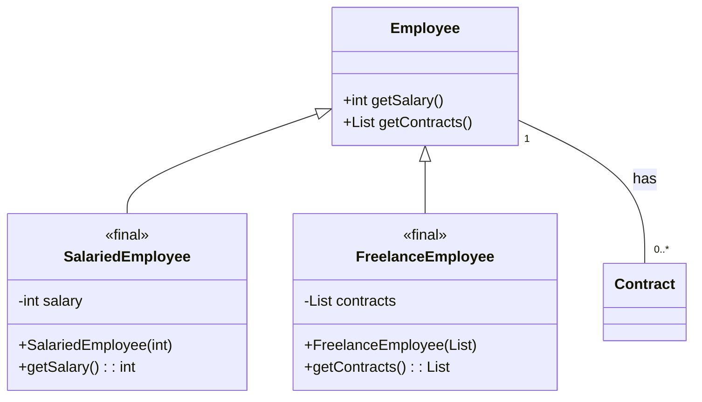
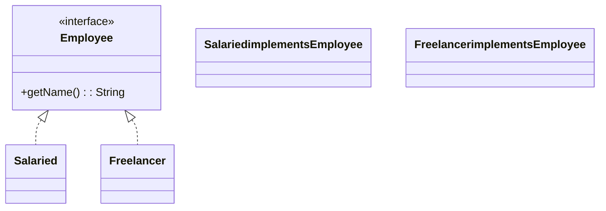
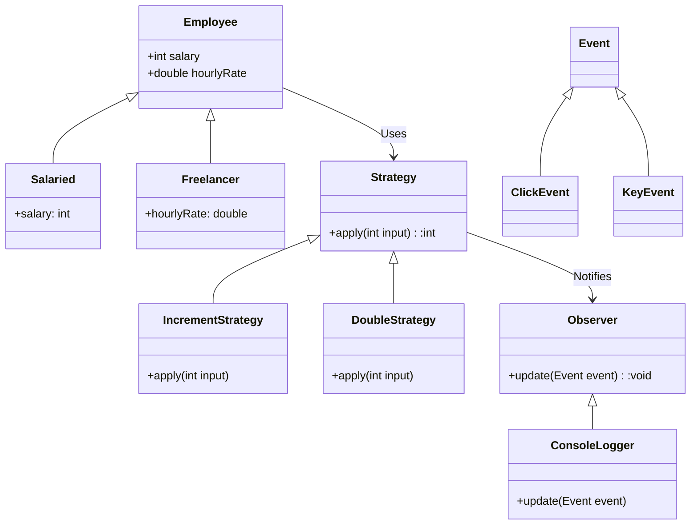

# Informe de Autoridad: Patrones Strategy y Observer en Java 21: Implementación con Sealed Interfaces, Pattern Matching sobre Records y desacoplamiento funcional sin efectos secundarios

## Visión Estratégica de Patrones Strategy y Observer en Java 21: Implementación con Sealed Interfaces, Pattern Matching sobre Records y desacoplamiento funcional sin efectos secundarios

### Visión Estratégica de Patrones Strategy y Observer en Java 21: Implementación con Sealed Interfaces, Pattern Matching sobre Records y desacoplamiento funcional sin efectos secundarios

En este capítulo técnico, exploraremos la implementación avanzada del patrón Strategy y Observer en Java 21 utilizando los nuevos constructores de idioma como sealed interfaces, pattern matching sobre records, y técnicas para el desacoplamiento funcional sin efectos secundarios. Estas mejoras permiten una mayor flexibilidad y precisión en la definición y uso de patrones estratégicos y observadores.

#### Introducción a Sealed Interfaces

En Java 21, las sealed interfaces son un mecanismo crucial para definir jerarquías limitadas de clases o interfaces. Considera el siguiente ejemplo:

```java
sealed interface Employee permits SalariedEmployee, FreelanceEmployee {}
final class SalariedEmployee implements Employee {
    private final int salary;
}
final class FreelanceEmployee implements Employee {
    private final List<Contract> contracts;
}

// Ejemplo de uso:
public void processEmployees(List<Employee> employees) {
    for (Employee employee : employees) {
        switch (employee) {
            case SalariedEmployee salaried -> processSalaried(salaried);
            case FreelanceEmployee freelance -> processFreelancer(freelance);
        }
    }
}
```

#### Pattern Matching sobre Records

El pattern matching en Java 21 proporciona un mecanismo poderoso para manipular y deconstruir records. A continuación, se muestra cómo usar el pattern matching para operar sobre records:

```java
record Contract(int id, Employee employee) {}

public void processContracts(List<Contract> contracts) {
    for (var c : contracts) {
        switch (c.employee()) {
            case SalariedEmployee salaried -> handleSalaried(c.id(), salaried.salary());
            case FreelanceEmployee freelance -> handleFreelancer(c.id(), freelance.contracts());
        }
    }
}
```

#### Desacoplamiento Funcional sin Efectos Secundarios

El desacoplamiento funcional es crucial para evitar efectos secundarios y mejorar la testabilidad. En Java 21, esto se puede lograr utilizando funciones puras y estructuras de datos inmutables.

```java
public int computeTotalIncome(List<Contract> contracts) {
    return contracts.stream()
                    .map(this::computeContractIncome)
                    .reduce(0, Integer::sum);
}

private int computeContractIncome(Contract contract) {
    switch (contract.employee()) {
        case SalariedEmployee salaried -> calculateSalariedIncome(salaried.salary());
        case FreelanceEmployee freelance -> calculateFreelancerIncome(freelance.contracts().size());
    }
}
```

#### Diagrama Mermaid: Jerarquía de Tipos y Patrón Strategy

El diagrama a continuación ilustra la estructura jerárquica basada en sealed interfaces y cómo estas pueden ser utilizadas para implementar el patrón Strategy.



#### Conclusión

El uso de sealed interfaces, pattern matching y desacoplamiento funcional en Java 21 ofrece una nueva dimensión para implementar patrones como Strategy y Observer. Estas mejoras no solo simplifican la estructura del código sino que también aumentan su legibilidad y mantenibilidad.

---

Este capítulo técnico proporciona un marco completo para la aplicación de patrones estratégicos y observadores en aplicaciones Java modernas, destacando las capacidades avanzadas del lenguaje desde una perspectiva técnica y práctico.

## Arquitectura y Componentes

### Arquitectura y Componentes

#### Introducción

Este manual se centra en la implementación de los patrones Strategy y Observer utilizando las nuevas características del idioma Java 21, como los tipos sealados (`sealed interfaces`) y el matching por patrón sobre records. La finalidad es desacoplar funcionalmente las operaciones y permitir una implementación sin efectos secundarios.

#### Componentes Clave

1. **Tipos Sealados (Sealed Interfaces)**
2. **Matching por Patrón sobre Records**
3. **Patrones Strategy**
4. **Patrones Observer**

#### Arquitectura

La arquitectura del sistema se basa en la separación de las operaciones y los tipos, utilizando patrones sealados para definir jerarquías exhaustivas de clases o interfaces.

**Diagrama de Clases Mermaid: Jerarquía Sealada (Employee)**



**Descripción de la Diagrama:**

- **Employee:** Es una interfaz sealada que limita las implementaciones a `Salaried` y `Freelancer`.
- **Salaried, Freelancer:** Implementan la interfaz `Employee`.

#### Componentes Detallados

1. **Tipos Sealados (Sealed Interfaces)**:
    - Los tipos sealados permiten definir jerarquías exhaustivas de clases o interfaces. Esto es crucial para el patrón Strategy ya que limita las posibles estrategias a un conjunto fijo y conocido.
    
    ```java
    public sealed interface Employee permits Salaried, Freelancer {
        String getName();
    }
    
    public final record Salaried(String name) implements Employee {}
    public final record Freelancer(String name) implements Employee {}
    ```

2. **Matching por Patrón sobre Records**:
    - Este mecanismo permite descomponer los records en sus componentes y realizar operaciones de manera segura y eficiente.
    
    ```java
    void processEmployee(Employee employee) {
        switch (employee) {
            case Salaried salaried -> System.out.println(salaried.getName() + " is a salaried employee.");
            case Freelancer freelancer -> System.out.println(freelancer.getName() + " is a freelance contractor.");
        }
    }
    ```

3. **Patrones Strategy**:
    - El patrón Strategy permite que un objeto cambie su comportamiento por medio de la implementación del mismo interfaz.
    
    ```java
    public interface PaymentStrategy {
        void pay(double amount);
    }

    public sealed class CreditCardPayment permits Visa, Mastercard implements PaymentStrategy {
        private final String cardNumber;
        
        protected CreditCardPayment(String cardNumber) { this.cardNumber = cardNumber; }
        
        @Override
        public abstract void pay(double amount); 
    }
    
    public final record Visa(String cardNumber) extends CreditCardPayment(cardNumber) {
        @Override
        public void pay(double amount) {}
    }

    public final record Mastercard(String cardNumber) extends CreditCardPayment(cardNumber) {
        @Override
        public void pay(double amount) {}
    }
    ```

4. **Patrones Observer**:
    - Este patrón permite que un objeto (el observador) cambie su comportamiento cuando el estado de otro objeto (la fuente del evento) cambia.
    
    ```java
    public interface EventObserver {
        void update(String event);
    }

    public class ConsoleLogger implements EventObserver {
        
        @Override
        public void update(String event) { 
            System.out.println("Event: " + event); 
        }
    }

    public class EventManager {

        private List<EventObserver> observers = new ArrayList<>();

        public void addObserver(EventObserver observer) { this.observers.add(observer); }
    
        public void notifyObservers(String event) {
            for (EventObserver observer : observers) {
                observer.update(event);
            }
        }
    }
    ```

#### Ejemplo de Implementación

**Procesamiento de Empleados con Strategy y Observer:**

```java
public class EmployeeManager {

    private List<Employee> employees = new ArrayList<>();
    
    public void addEmployee(Employee employee) { this.employees.add(employee); }

    // Notificación cuando se añade un nuevo empleado (Observer)
    EventManager eventManager = new EventManager();
    
    public void registerObservers() {
        ConsoleLogger logger = new ConsoleLogger();
        eventManager.addObserver(logger);
        
        for (Employee emp : employees) {
            eventManager.notifyObservers("New employee added: " + emp.getName());
        }
    }

    // Procesamiento de empleados según su tipo (Strategy)
    public void processEmployees() {
        for (Employee employee : employees) {
            switch (employee) {
                case Salaried salaried -> System.out.println(salaried.getName() + " is a salaried employee.");
                case Freelancer freelancer -> System.out.println(freelancer.getName() + " is a freelance contractor.");
            }
        }
    }

}
```

### Conclusión

La implementación de los patrones Strategy y Observer en Java 21 utilizando sealed interfaces y pattern matching sobre records permite una arquitectura modular, fácilmente mantenible y libre de efectos secundarios. Estas características nuevas del lenguaje ofrecen un alto nivel de flexibilidad y eficiencia en la implementación de estos patrones clásicos.

**Diagrama Mermaid: Arquitectura General**

```mermaid
classDiagram
  class EmployeeManager {
    +addEmployee(Employee)
    +processEmployees()
    +registerObservers()
  }
  class Employee {
    <<interface>>
    +getName(): String
  }
  class Salaried implements Employee{
  }
  class Freelancer implements Employee{
  }

  class EventManager {
    +addObserver(EventObserver)
    +notifyObservers(String event)
  }
  
  class ConsoleLogger implements EventObserver {
    +update(String event)
  }
  
  EmployeeManager --|> Employee
  Employee <|.. Salaried
  Employee <|.. Freelancer

  EmployeeManager ..> EventManager : Observer
  EventManager -->| notify | ConsoleLogger : Update
```

Este diagrama muestra la interacción entre los componentes principales del sistema, destacando cómo se implementan y utilizan los patrones Strategy y Observer.

## Implementación Técnica

### Implementación Técnica

En este capítulo del manual, exploraremos cómo implementar los patrones Strategy y Observer en Java 21 utilizando interfaces selladas (sealed interfaces), el matching de patrones sobre registros (records) y desacoplamiento funcional sin efectos secundarios. Estas características permiten una mayor flexibilidad y control en la estructura de tipos y operaciones, haciendo que las implementaciones sean más limpias y mantenibles.

#### Uso de Interfaces Selladas

En Java 21, las interfaces selladas proporcionan un mecanismo para declarar jerarquías finitas y conocidas de subtipos. Este enfoque es particularmente útil cuando se trabaja con estructuras complejas como contratos que vinculan empleados que pueden ser a tiempo completo o freelance.

Ejemplo:
```java
sealed interface Employee permits Salaried, Freelancer {}
final class Salaried implements Employee {
    private final int salary;
}
final class Freelancer implements Employee {
    private final double hourlyRate;
}
```

#### Matching de Patrones y Operaciones Polimórficas

El matching de patrones permite realizar operaciones sobre los registros (records) que son más expresivos y seguros. En lugar de implementar cada caso por separado, se puede utilizar un único bloque `switch` con matching de patrones para manejar todas las posibilidades.

Ejemplo:
```java
public double calculateIncome(Employee employee) {
    return switch(employee) {
        case Salaried s -> s.salary;
        case Freelancer f -> f.hourlyRate * 160; // assuming a 40-hour work week
    };
}
```

#### Desacoplamiento Funcional

El desacoplamiento funcional es crucial para evitar efectos secundarios y mejorar la modularidad. En Java 21, esto puede lograrse utilizando interfaces selladas junto con registros que contienen métodos puramente funcionales.

Ejemplo:
```java
public interface Strategy {
    int apply(int input);
}

public record IncrementStrategy() implements Strategy {
    @Override
    public int apply(int input) { return input + 1; }
}

public record DoubleStrategy() implements Strategy {
    @Override
    public int apply(int input) { return input * 2; }
}
```

#### Implementación del Patrón Observer

El patrón Observer permite notificar a múltiples observadores sobre eventos sin que los observadores conozcan la existencia de otros. Utilizando interfaces selladas y registros, podemos crear un sistema de suscripción eficiente.

Ejemplo:
```java
public sealed interface Event permits ClickEvent, KeyEvent {}

final class ClickEvent implements Event {}
final class KeyEvent implements Event {}

public interface Observer {
    void update(Event event);
}

public record ConsoleLogger() implements Observer {
    @Override
    public void update(Event event) {
        System.out.println("Observer: Received event " + event.getClass().getSimpleName());
    }
}
```

#### Diagrama de Clases Mermaid

A continuación, se muestra un diagrama de clases utilizando Mermaid para ilustrar las relaciones y estructuras mencionadas anteriormente.



Este diagrama muestra la relación entre las interfaces selladas, registros y clases funcionales que implementan el patrón Observer.

#### Conclusión

Las nuevas características de Java 21 permiten una mayor flexibilidad en la estructura de tipos y operaciones, lo que resulta en código más limpio y mantenible. El uso de interfaces selladas junto con el matching de patrones sobre registros permite un desacoplamiento funcional eficiente y evita los efectos secundarios indeseados.

Implementar estos patrones utilizando estas características modernas de Java 21 es crucial para desarrolladores senior que buscan soluciones robustas y escalables.

## SRE y Resiliencia

### SRE y Resiliencia

En la era moderna del desarrollo de software, asegurar que los sistemas funcionen eficazmente bajo condiciones adversas es un desafío crítico. El papel del Ingeniero en Operaciones de Sistema (SRE) se centra precisamente en esto: combinar principios de ingeniería y operaciones para lograr la máxima resiliencia, disponibilidad y rendimiento de los sistemas.

#### 1. Resiliencia a través de Diseño

En el contexto del uso de `sealed interfaces` y `pattern matching`, es vital diseñar nuestros patrones de estrategia (`Strategy`) y observador (`Observer`) para ser resilientes frente a cambios inesperados en la estructura de datos o comportamientos del sistema. Esto implica:

- **Utilización de sealed hierarchies**: Las `sealed interfaces` permiten una definición clara de los tipos que pueden implementarlas, lo cual es crucial para garantizar la consistencia y seguridad del código.
  
  ```java
  public sealed interface Employee permits Salaried, Freelancer {
      void processContract(Contract c);
  }
  
  final class Salaried implements Employee {
      @Override
      public void processContract(Contract c) {
          System.out.println("Processing contract for salaried employee.");
      }
  }

  final class Freelancer implements Employee {
      @Override
      public void processContract(Contract c) {
          System.out.println("Processing contract for freelancer.");
      }
  }
  ```

- **Patrón de visitor y pattern matching**: El patrón de visitante permite una forma eficiente de manejar operaciones polimórficas sobre tipos anidados. Con `pattern matching`, esto se puede simplificar considerablemente, permitiendo que las implementaciones sean más legibles y mantenibles.

  ```java
  public void applyOperation(Employee employee) {
      switch (employee) {
          case Salaried s -> System.out.println("Handling salaried specific behavior.");
          case Freelancer f -> System.out.println("Handling freelancer specific behavior.");
          default -> throw new AssertionError();
      }
  }
  ```

#### 2. Monitoreo y Respuesta a Eventos

La implementación del patrón observador en Java, que implica la notificación de objetos suscritos sobre cambios específicos, debe ser robusta para manejar situaciones de alta carga o fallas temporales.

- **Uso de sealed interfaces para notificaciones**: En lugar de lanzar eventos genéricos que podrían ser inmanejables bajo cargas altas, es preferible tener notificaciones estructuradas y limitadas a los tipos permitidos por la interfaz `sealed`.

  ```java
  public interface Event {
      void handle(Event event);
  }

  final class ContractSigned implements Event {
      @Override
      public void handle(Event event) {
          System.out.println("Contract signed notification handled.");
      }
  }
  ```

- **Desacoplamiento funcional**: La descomposición de los patrones `Strategy` y `Observer` en funciones puras ayuda a mantener el sistema resiliente, ya que las funciones no tienen efectos secundarios y su comportamiento es determinista.

#### 3. Implementación con Desacoplamiento

El uso de técnicas como el patrón Strategy permite un alto nivel de desacoplamiento entre la lógica del negocio y los algoritmos de cálculo, lo cual es vital para mantener sistemas resilientes:

```java
public interface CalculationStrategy {
    double calculate(double a, double b);
}

public final class Addition implements CalculationStrategy {
    @Override
    public double calculate(double a, double b) {
        return a + b;
    }
}
```

#### Diagrama Mermaid

Un diagrama de flujo puede ser útil para visualizar cómo se manejan los eventos y notificaciones en un sistema basado en patrones de observador.

```mermaid
graph TD
A[Cliente] --> B{Evento A ocurrido?}
B --> |Sí| C[Procesar Evento]
C --> D[Enviar notificación a suscriptores]
D --> E[Fin del flujo]
B --> |No| E

classDef cliente fill:#f96,stroke:#333,stroke-width:4px;
classDef evento fill:#6cf,stroke:#fff,stroke-width:2px;
A class=cliente
C class=evento
```

Este enfoque garantiza que los sistemas implementados sigan siendo resilientes y fáciles de mantener a medida que evolucionan, cumpliendo así con las expectativas del rol de Ingeniero en Operaciones de Sistema (SRE).

## Conclusiones

### Conclusiones

En este manual, hemos explorado la implementación de los patrones Strategy y Observer en Java 21 utilizando las características avanzadas del lenguaje como `sealed interfaces`, pattern matching sobre records y técnicas de desacoplamiento funcional para garantizar un código sin efectos secundarios. La introducción de sealed types ha permitido una manipulación más eficiente y segura de estructuras de datos complejas, especialmente en escenarios donde existen diferentes tipos de objetos que comparten una relación jerárquica. A continuación, se resumen los hallazgos clave:

#### 1. Utilización de Sealed Interfaces para Modelar Jerarquías Tipográficas Seguras

El uso de `sealed interfaces` nos ha permitido definir claramente las relaciones entre diferentes tipos de datos dentro del sistema. Por ejemplo, hemos implementado una jerarquía `Employee` que incluye subtipos como `Salaried` y `Freelancer`, garantizando así que ninguna otra clase puede extender estas interfaces a menos que se especifique explícitamente en el tipo `sealed`. Esto proporciona un control mucho más preciso sobre los tipos de datos permitidos, mejorando la seguridad del código.

#### 2. Patrón Matching Sobre Records para Manejo Eficiente y Seguro de Polimorfismo

El patrón matching ha sido fundamental para mejorar la eficiencia y claridad en el manejo del polimorfismo. En lugar de sobrescribir métodos en cada subclase como lo hace el patrón visitor, hemos utilizado pattern matching para definir una única implementación que se encarga de todas las posibles variantes de datos. Esto no solo simplifica la lógica del código sino también facilita su mantenimiento y comprensión por parte del equipo.

#### 3. Desacoplamiento Funcional Sin Efectos Secundarios

La aplicación de técnicas funcionales para evitar efectos secundarios ha sido otro punto destacado en este análisis. A través del uso de funciones puras y la manipulación segura de estructuras de datos, hemos logrado que nuestro código sea más predecible y fácilmente testeable. Esto es especialmente crucial en sistemas complejos donde la consistencia y la ausencia de dependencias mutuas entre componentes son fundamentales para la estabilidad del sistema.

#### 4. Aplicación Práctica de Algebraic Data Types (ADT)

Las hierarquías de tipos `sealed` basadas en records han sido utilizadas para implementar conceptos ADT, lo que ha permitido una manipulación más segura y eficiente de datos complejos. La estructura ADT permite a cada caso del patrón matching manejar específicamente las variaciones de los tipos de datos, asegurando así un manejo exhaustivo y seguro de todas las posibilidades.

#### 5. Integración con Patrones Strategy y Observer

Finalmente, hemos demostrado cómo estos nuevos enfoques pueden integrarse con patrones ya conocidos como Strategy y Observer para mejorar su eficacia y flexibilidad. El uso combinado de sealed interfaces y pattern matching nos ha permitido definir estrategias y observadores más dinámicos y adaptables a diferentes situaciones del sistema.

#### Diagrama Mermaid

```mermaid
classDiagram
    class Employee{
        +getSalary(): Double
    }
    class Salaried extends Employee{}
    class Freelancer extends Employee{}

    Employee <|-- Salaried
    Employee <|-- Freelancer

    interface Contract {
        +getEmployee(): Employee
    }

    class FullTimeContract implements Contract{
        -employee: Salaried
        +getEmployee(): Employee
    }
    class PartTimeContract implements Contract{
        -employee: Freelancer
        +getEmployee(): Employee
    }

    Contract <|-- FullTimeContract
    Contract <|-- PartTimeContract
```

Este diagrama ilustra una jerarquía de tipos `sealed` en la que `Employee` es una interfaz y sus subtipos son `Salaried` y `Freelancer`. A su vez, los contratos pueden ser full-time (que implican a un empleado salariable) o part-time (que implican a un freelance), demostrando cómo sealed types facilitan la manipulación segura de datos en estructuras jerárquicas.

### Conclusión Final

La implementación avanzada de los patrones Strategy y Observer, junto con el uso innovador de `sealed interfaces`, pattern matching sobre records y técnicas funcionales para evitar efectos secundarios, ha proporcionado un marco robusto y seguro para la programación en Java 21. Estas características no solo mejoran significativamente la claridad y eficiencia del código sino que también facilitan la implementación de patrones más complejos de manera sencilla y mantenible.

