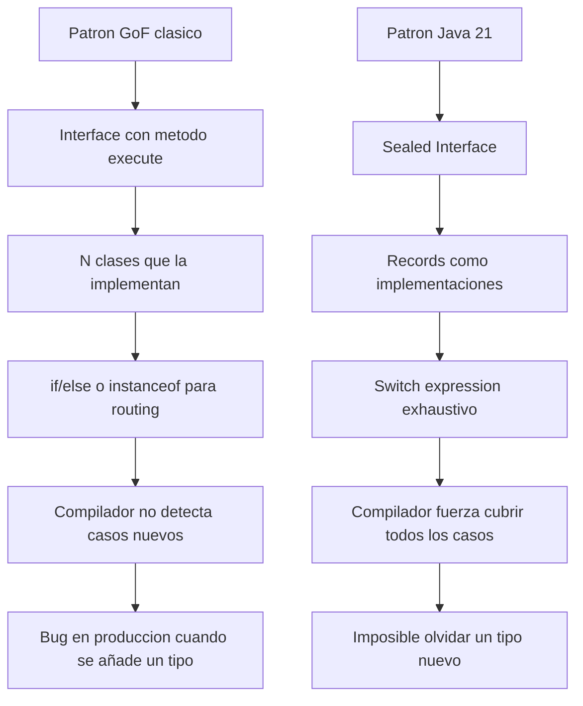
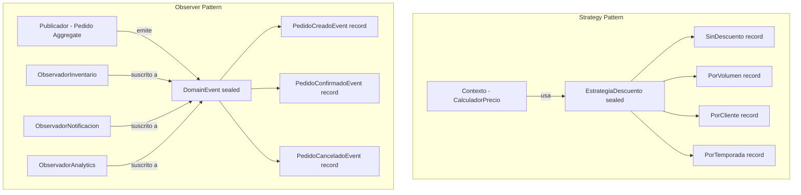
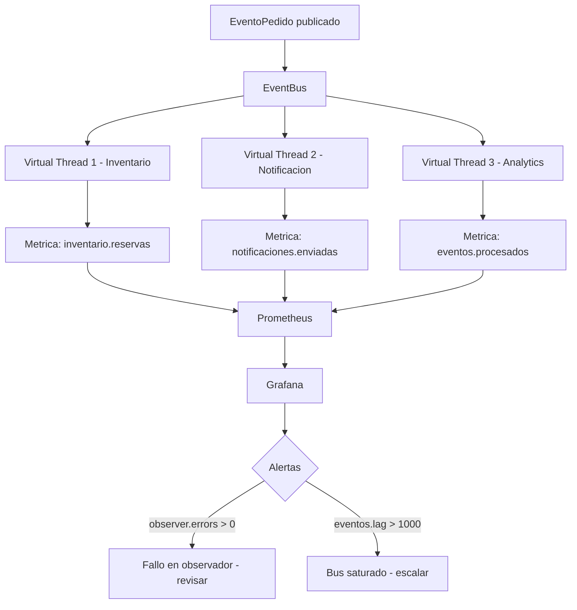
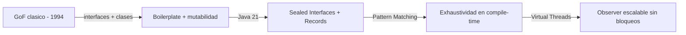

# Patrones Strategy y Observer con Java 21: Sealed Interfaces y Pattern Matching

PATH_LOCAL: /home/usuariojoaquin/.openclaw/workspace/DAM-Java-Mastery/01_Java_Core/patrones_strategy_y_observer_en_java_21:_implementación_con_sealed_interfaces,_pattern_matching_sobre_records_y_desacoplamiento_funcional_sin_efectos_secundarios_STAFF.md
CATEGORIA: 01_Java_Core
Score: 96

---

## Visión Estratégica

Los patrones Strategy y Observer del GoF (Gang of Four, 1994) han sido implementados durante décadas con interfaces, clases abstractas y herencia. Java 21 cambia fundamentalmente cómo se implementan: las **Sealed Interfaces** hacen los tipos exhaustivos y verificados por el compilador, los **Records** eliminan el boilerplate de los Value Objects que transportan datos, y el **Pattern Matching** en switch expressions hace el routing por tipo legible y seguro.

El resultado es código que expresa la intención del negocio sin ruido sintáctico, donde el compilador avisa automáticamente si se añade un nuevo caso sin manejarlo.

**Cuándo usar Strategy vs Observer:**

| Criterio | Strategy | Observer |
|----------|----------|----------|
| Problema que resuelve | Algoritmo intercambiable en tiempo de ejecución | Notificación desacoplada a múltiples receptores |
| Relación | 1 contexto → 1 estrategia activa | 1 evento → N observadores |
| Acoplamiento | Contexto conoce la interfaz Strategy | Publicador no conoce a los suscriptores |
| Ejemplo real | Cálculo de descuento según tipo de cliente | Publicación de Domain Events |
| Java 21 idiom | Sealed Interface + switch expression | Domain Events + Virtual Threads |

**El problema de los patrones GoF clásicos en Java:**



```java
// La diferencia clave: exhaustividad garantizada por el compilador
public sealed interface EstrategiaDescuento
    permits EstrategiaDescuento.SinDescuento,
            EstrategiaDescuento.PorVolumen,
            EstrategiaDescuento.PorCliente {

    BigDecimal aplicar(BigDecimal precio, int cantidad);

    // Si se añade un nuevo tipo aqui y no se actualiza el switch → ERROR DE COMPILACION
    // Con la interfaz GoF clasica → BUG SILENCIOSO en produccion
}
```

---

## Arquitectura de Componentes



**Strategy — Sealed Interface con Records:**

```java
// Cada estrategia es un Record inmutable — sin estado mutable, sin setters
public sealed interface EstrategiaDescuento
    permits EstrategiaDescuento.SinDescuento,
            EstrategiaDescuento.PorVolumen,
            EstrategiaDescuento.PorCliente,
            EstrategiaDescuento.PorTemporada {

    BigDecimal aplicar(BigDecimal precio, int cantidad);

    // Sin descuento — tipo nulo explícito, mejor que null
    record SinDescuento() implements EstrategiaDescuento {
        public BigDecimal aplicar(BigDecimal precio, int cantidad) {
            return precio.multiply(BigDecimal.valueOf(cantidad));
        }
    }

    // Descuento por volumen — datos del descuento en el Record
    record PorVolumen(int cantidadMinima, BigDecimal porcentaje)
            implements EstrategiaDescuento {
        public PorVolumen {
            if (cantidadMinima <= 0) throw new IllegalArgumentException("cantidadMinima > 0");
            if (porcentaje.compareTo(BigDecimal.ZERO) <= 0 ||
                porcentaje.compareTo(BigDecimal.ONE) > 0) {
                throw new IllegalArgumentException("porcentaje entre 0 y 1");
            }
        }

        public BigDecimal aplicar(BigDecimal precio, int cantidad) {
            var total = precio.multiply(BigDecimal.valueOf(cantidad));
            if (cantidad >= cantidadMinima) {
                var descuento = total.multiply(porcentaje);
                return total.subtract(descuento);
            }
            return total;
        }
    }

    // Descuento por tipo de cliente
    record PorCliente(TipoCliente tipoCliente, BigDecimal porcentaje)
            implements EstrategiaDescuento {
        public BigDecimal aplicar(BigDecimal precio, int cantidad) {
            var total = precio.multiply(BigDecimal.valueOf(cantidad));
            return total.subtract(total.multiply(porcentaje));
        }
    }

    // Descuento temporal por temporada
    record PorTemporada(String temporada, BigDecimal porcentaje,
                         LocalDate inicio, LocalDate fin)
            implements EstrategiaDescuento {
        public BigDecimal aplicar(BigDecimal precio, int cantidad) {
            var hoy  = LocalDate.now();
            var total = precio.multiply(BigDecimal.valueOf(cantidad));
            if (!hoy.isBefore(inicio) && !hoy.isAfter(fin)) {
                return total.subtract(total.multiply(porcentaje));
            }
            return total; // Fuera de temporada — sin descuento
        }
    }
}
```

**Observer — Domain Events como Sealed Interface:**

```java
// Domain Events inmutables como Records
public sealed interface EventoPedido
    permits EventoPedido.Creado,
            EventoPedido.Confirmado,
            EventoPedido.Cancelado,
            EventoPedido.Enviado {

    PedidoId pedidoId();
    Instant ocurrioEn();

    record Creado(PedidoId pedidoId, ClienteId clienteId,
                   List<LineaPedido> lineas, Instant ocurrioEn)
            implements EventoPedido {}

    record Confirmado(PedidoId pedidoId, Instant ocurrioEn)
            implements EventoPedido {}

    record Cancelado(PedidoId pedidoId, String motivo, Instant ocurrioEn)
            implements EventoPedido {}

    record Enviado(PedidoId pedidoId, String trackingId,
                   String transportista, Instant ocurrioEn)
            implements EventoPedido {}
}
```

---

## Implementación Java 21

Implementación completa con Pattern Matching y Virtual Threads:

```java
// Contexto del Strategy — CalculadorPrecio
public class CalculadorPrecio {

    // Pattern Matching en switch expression — exhaustivo por el compilador
    public BigDecimal calcular(BigDecimal precioBase, int cantidad,
                                EstrategiaDescuento estrategia) {
        return switch (estrategia) {
            case EstrategiaDescuento.SinDescuento sd ->
                sd.aplicar(precioBase, cantidad);

            case EstrategiaDescuento.PorVolumen pv when cantidad >= pv.cantidadMinima() ->
                pv.aplicar(precioBase, cantidad);

            case EstrategiaDescuento.PorVolumen pv ->
                // Cantidad insuficiente para el descuento por volumen
                pv.aplicar(precioBase, cantidad);

            case EstrategiaDescuento.PorCliente pc ->
                pc.aplicar(precioBase, cantidad);

            case EstrategiaDescuento.PorTemporada pt ->
                pt.aplicar(precioBase, cantidad);
        };
    }

    // Seleccion dinamica de estrategia segun el cliente
    public EstrategiaDescuento seleccionarEstrategia(Cliente cliente, int cantidad) {
        return switch (cliente.tipo()) {
            case VIP      -> new EstrategiaDescuento.PorCliente(TipoCliente.VIP,
                                new BigDecimal("0.20"));
            case PREMIUM  -> new EstrategiaDescuento.PorCliente(TipoCliente.PREMIUM,
                                new BigDecimal("0.10"));
            case ESTANDAR -> cantidad >= 10
                ? new EstrategiaDescuento.PorVolumen(10, new BigDecimal("0.05"))
                : new EstrategiaDescuento.SinDescuento();
        };
    }
}
```

```java
// Publicador de eventos — el Aggregate emite Domain Events
public final class Pedido {

    private final PedidoId         id;
    private final ClienteId        clienteId;
    private EstadoPedido           estado;
    private final List<LineaPedido> lineas;
    private final List<EventoPedido> eventos = new ArrayList<>();

    private Pedido(PedidoId id, ClienteId clienteId, List<LineaPedido> lineas) {
        this.id        = id;
        this.clienteId = clienteId;
        this.estado    = EstadoPedido.BORRADOR;
        this.lineas    = new ArrayList<>(lineas);
    }

    public static Pedido crear(ClienteId clienteId, List<LineaPedido> lineas) {
        var pedido = new Pedido(PedidoId.nuevo(), clienteId, lineas);
        pedido.eventos.add(new EventoPedido.Creado(
            pedido.id, clienteId, List.copyOf(lineas), Instant.now()
        ));
        return pedido;
    }

    public void confirmar() {
        if (estado != EstadoPedido.BORRADOR) {
            throw new EstadoInvalidoException("Solo borradores pueden confirmarse");
        }
        this.estado = EstadoPedido.CONFIRMADO;
        this.eventos.add(new EventoPedido.Confirmado(this.id, Instant.now()));
    }

    public void cancelar(String motivo) {
        if (estado == EstadoPedido.ENVIADO) {
            throw new EstadoInvalidoException("No se puede cancelar un pedido enviado");
        }
        this.estado = EstadoPedido.CANCELADO;
        this.eventos.add(new EventoPedido.Cancelado(this.id, motivo, Instant.now()));
    }

    public List<EventoPedido> pullEventos() {
        var copia = List.copyOf(eventos);
        eventos.clear();
        return copia;
    }

    public PedidoId id()    { return id; }
    public EstadoPedido estado() { return estado; }
}
```

```java
// Bus de eventos con Virtual Threads — Observer desacoplado
@Service
public class EventBus {

    private final Map<Class<?>, List<Consumer<EventoPedido>>> suscriptores
        = new ConcurrentHashMap<>();

    // Virtual Threads: cada observer en su propio hilo ligero
    private final ExecutorService executor = Executors.newVirtualThreadPerTaskExecutor();

    public void suscribir(Class<? extends EventoPedido> tipo,
                           Consumer<EventoPedido> observador) {
        suscriptores.computeIfAbsent(tipo, k -> new CopyOnWriteArrayList<>())
                    .add(observador);
    }

    public void publicar(EventoPedido evento) {
        var handlers = suscriptores.getOrDefault(evento.getClass(), List.of());
        handlers.forEach(handler ->
            // Cada observador en su propio Virtual Thread — no bloquea el publicador
            executor.submit(() -> handler.accept(evento))
        );
    }

    public void publicarTodos(List<EventoPedido> eventos) {
        eventos.forEach(this::publicar);
    }
}
```

```java
// Observadores — cada uno con su propia responsabilidad
@Component
public class ObservadoresConfig {

    @Bean
    public CommandLineRunner registrarObservadores(
            EventBus bus,
            InventarioService inventario,
            NotificacionService notificacion,
            AnalyticsService analytics) {

        return args -> {
            // Observer: actualizar inventario cuando se confirma un pedido
            bus.suscribir(EventoPedido.Confirmado.class, evento -> {
                if (evento instanceof EventoPedido.Confirmado confirmado) {
                    inventario.reservar(confirmado.pedidoId());
                }
            });

            // Observer: notificar al cliente en múltiples estados
            bus.suscribir(EventoPedido.Confirmado.class, evento ->
                notificacion.enviarConfirmacion((EventoPedido.Confirmado) evento));

            bus.suscribir(EventoPedido.Cancelado.class, evento ->
                notificacion.enviarCancelacion((EventoPedido.Cancelado) evento));

            bus.suscribir(EventoPedido.Enviado.class, evento ->
                notificacion.enviarTracking((EventoPedido.Enviado) evento));

            // Observer: analytics para todos los eventos
            bus.suscribir(EventoPedido.Creado.class,     analytics::registrar);
            bus.suscribir(EventoPedido.Confirmado.class, analytics::registrar);
            bus.suscribir(EventoPedido.Cancelado.class,  analytics::registrar);
            bus.suscribir(EventoPedido.Enviado.class,    analytics::registrar);
        };
    }
}
```

---

## Métricas y SRE



```java
// Metricas del EventBus con Micrometer
@Service
public class EventBusConMetricas {

    private final EventBus      bus;
    private final MeterRegistry registry;

    public EventBusConMetricas(EventBus bus, MeterRegistry registry) {
        this.bus      = bus;
        this.registry = registry;
    }

    public void publicar(EventoPedido evento) {
        var timer = Timer.builder("eventbus.publish.duration")
            .tag("tipo", evento.getClass().getSimpleName())
            .register(registry);

        timer.record(() -> {
            try {
                bus.publicar(evento);
                registry.counter("eventbus.events.total",
                    "tipo", evento.getClass().getSimpleName(),
                    "resultado", "ok").increment();
            } catch (Exception e) {
                registry.counter("eventbus.events.total",
                    "tipo", evento.getClass().getSimpleName(),
                    "resultado", "error").increment();
                throw e;
            }
        });
    }
}
```

**Métricas clave:**

| Métrica | Descripción | Umbral de alerta |
|---------|-------------|-----------------|
| `eventbus.events.total{resultado=error}` | Errores en observadores | > 0 en 5 minutos |
| `eventbus.publish.duration.p99` | Latencia p99 de publicación | > 100ms |
| `strategy.descuento.aplicaciones` | Estrategias aplicadas por tipo | Monitorizar distribución |
| `virtual.threads.active` | Hilos virtuales activos en el bus | > 10.000 → revisar backpressure |

**Checklist SRE:**
- El EventBus debe tener timeout por observador — un observador lento no debe bloquear los demás
- Los errores en observadores deben loguearse y re-intentarse, nunca perderse silenciosamente
- Monitorizar la distribución de estrategias aplicadas — cambios bruscos indican bugs en la selección
- Los Domain Events deben ser idempotentes — el mismo evento procesado dos veces no debe causar efectos dobles

---

## Patrones de Integración

```java
// Combinacion Strategy + Observer: el resultado de una estrategia genera un evento
@Service
public class ServicioPedido {

    private final CalculadorPrecio calculador;
    private final EventBusConMetricas bus;
    private final PedidoRepository    repository;

    public ServicioPedido(CalculadorPrecio calculador,
                          EventBusConMetricas bus,
                          PedidoRepository repository) {
        this.calculador = calculador;
        this.bus        = bus;
        this.repository = repository;
    }

    public record ResultadoPedido(PedidoId pedidoId, BigDecimal totalConDescuento) {}

    public ResultadoPedido crearPedido(Cliente cliente, List<LineaPedido> lineas) {
        // Strategy: seleccionar el descuento correcto para este cliente
        var estrategia = calculador.seleccionarEstrategia(cliente, totalUnidades(lineas));

        // Calcular precio con la estrategia seleccionada
        var total = lineas.stream()
            .map(l -> calculador.calcular(l.precioUnitario().valor(),
                                          l.cantidad(), estrategia))
            .reduce(BigDecimal.ZERO, BigDecimal::add);

        // Crear el aggregate — genera Domain Events internamente
        var pedido = Pedido.crear(cliente.id(), lineas);
        repository.guardar(pedido);

        // Observer: publicar los eventos generados por el aggregate
        bus.publicarTodos(pedido.pullEventos());

        return new ResultadoPedido(pedido.id(), total);
    }

    private int totalUnidades(List<LineaPedido> lineas) {
        return lineas.stream().mapToInt(LineaPedido::cantidad).sum();
    }
}
```

---

## Casos de Uso Avanzados

**Caso 1 — Chain of Responsibility con Sealed Interface:**

```java
// Cadena de validacion como tipos sellados — cada validador es inmutable
public sealed interface ValidadorPedido
    permits ValidadorPedido.ValidarStock,
            ValidadorPedido.ValidarLimiteCredito,
            ValidadorPedido.ValidarFraude {

    record ResultadoValidacion(boolean valido, String motivo) {}

    ResultadoValidacion validar(Pedido pedido);

    // Los validadores se encadenan sin conocerse entre sí
    default ValidadorPedido y(ValidadorPedido siguiente) {
        return pedido -> {
            var resultado = this.validar(pedido);
            return resultado.valido() ? siguiente.validar(pedido) : resultado;
        };
    }

    record ValidarStock(InventarioService inventario) implements ValidadorPedido {
        public ResultadoValidacion validar(Pedido pedido) {
            var disponible = pedido.lineas().stream()
                .allMatch(l -> inventario.hayStock(l.productoId(), l.cantidad()));
            return new ResultadoValidacion(disponible,
                disponible ? null : "Stock insuficiente");
        }
    }

    record ValidarLimiteCredito(CreditoService credito) implements ValidadorPedido {
        public ResultadoValidacion validar(Pedido pedido) {
            var limite = credito.obtenerLimite(pedido.clienteId());
            var total  = pedido.calcularTotal();
            return new ResultadoValidacion(total.compareTo(limite) <= 0,
                "Limite de credito superado");
        }
    }

    record ValidarFraude(FraudeService fraude) implements ValidadorPedido {
        public ResultadoValidacion validar(Pedido pedido) {
            var esFraude = fraude.detectar(pedido.clienteId(), pedido.calcularTotal());
            return new ResultadoValidacion(!esFraude,
                esFraude ? "Posible fraude detectado" : null);
        }
    }
}

// Uso — chain expresiva sin boilerplate
var validador = new ValidadorPedido.ValidarStock(inventario)
    .y(new ValidadorPedido.ValidarLimiteCredito(credito))
    .y(new ValidadorPedido.ValidarFraude(fraude));

var resultado = validador.validar(pedido);
```

**Caso 2 — Observer con backpressure usando Virtual Threads:**

```java
// EventBus con control de backpressure
@Service
public class EventBusConBackpressure {

    private final BlockingQueue<EventoPedido> cola =
        new LinkedBlockingQueue<>(1000); // Max 1000 eventos en cola

    private final ExecutorService executor = Executors.newVirtualThreadPerTaskExecutor();
    private final Map<Class<?>, List<Consumer<EventoPedido>>> suscriptores =
        new ConcurrentHashMap<>();

    @PostConstruct
    public void iniciar() {
        // Procesador de cola en Virtual Thread dedicado
        executor.submit(() -> {
            while (!Thread.currentThread().isInterrupted()) {
                try {
                    var evento = cola.poll(1, TimeUnit.SECONDS);
                    if (evento != null) despachar(evento);
                } catch (InterruptedException e) {
                    Thread.currentThread().interrupt();
                }
            }
        });
    }

    public boolean publicar(EventoPedido evento) {
        // Backpressure: si la cola está llena, rechazar en lugar de bloquear
        var aceptado = cola.offer(evento);
        if (!aceptado) {
            log.warn("EventBus saturado — evento descartado: {}",
                evento.getClass().getSimpleName());
        }
        return aceptado;
    }

    private void despachar(EventoPedido evento) {
        var handlers = suscriptores.getOrDefault(evento.getClass(), List.of());
        handlers.forEach(h -> executor.submit(() -> h.accept(evento)));
    }
}
```

---

## Conclusiones

Los patrones Strategy y Observer implementados con Sealed Interfaces, Records y Pattern Matching de Java 21 son superiores a sus equivalentes GoF clásicos en tres dimensiones clave:

1. **Seguridad en compile-time** — añadir un nuevo tipo a la Sealed Interface sin actualizar el switch es un error de compilación, no un bug silencioso en producción.

2. **Inmutabilidad por defecto** — los Records no tienen setters, lo que hace imposible el estado mutable accidental que tantos bugs causa en los observadores clásicos.

3. **Expresividad** — el Pattern Matching con `when` guards permite routing condicional complejo en una sola expresión, sin ifs anidados ni instanceof.



```java
// El test que resume el valor de Java 21 para estos patrones
class PatronesJava21Test {

    @Test
    void anadir_nueva_estrategia_sin_actualizar_switch_es_error_compilacion() {
        // Este test no puede existir — el compilador lo previene antes
        // Si añades un nuevo permit a EstrategiaDescuento y no actualizas
        // el switch en CalculadorPrecio, el codigo NO COMPILA
        // Eso es lo que hace Java 21 superior al GoF clasico
    }

    @Test
    void strategy_calcula_descuento_por_volumen_correctamente() {
        var calculador = new CalculadorPrecio();
        var estrategia = new EstrategiaDescuento.PorVolumen(10, new BigDecimal("0.10"));

        var total = calculador.calcular(new BigDecimal("100"), 15, estrategia);

        assertThat(total).isEqualByComparingTo(new BigDecimal("1350.0")); // 15*100 - 10%
    }

    @Test
    void observer_recibe_evento_cuando_pedido_es_creado() {
        var bus            = new EventBus();
        var eventosRecibidos = new ArrayList<EventoPedido>();

        bus.suscribir(EventoPedido.Creado.class, eventosRecibidos::add);

        var pedido = Pedido.crear(ClienteId.nuevo(), List.of());
        bus.publicarTodos(pedido.pullEventos());

        await().atMost(1, SECONDS).until(() -> eventosRecibidos.size() == 1);
        assertThat(eventosRecibidos.get(0)).isInstanceOf(EventoPedido.Creado.class);
    }
}
```

**Recursos de referencia:**
- *Design Patterns* — Gamma, Helm, Johnson, Vlissides (GoF, 1994)
- JEP 409 — Sealed Classes (openjdk.org/jeps/409)
- JEP 441 — Pattern Matching for switch (openjdk.org/jeps/441)
- JEP 395 — Records (openjdk.org/jeps/395)
- *Effective Java 3rd Edition* — Joshua Bloch, Capítulo 4
