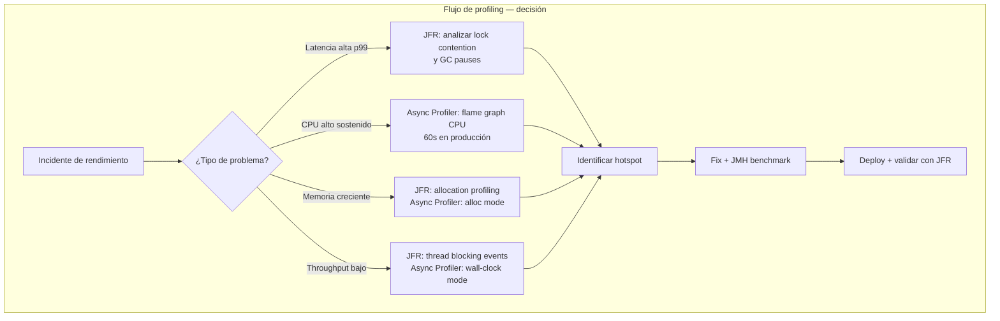
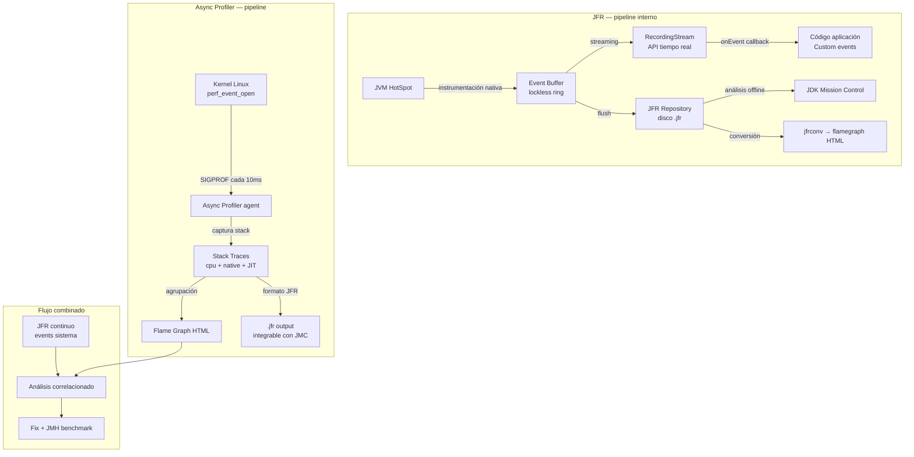
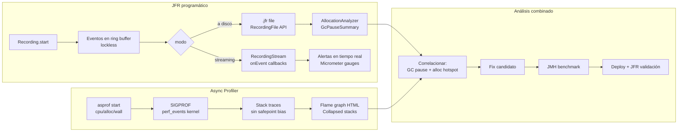
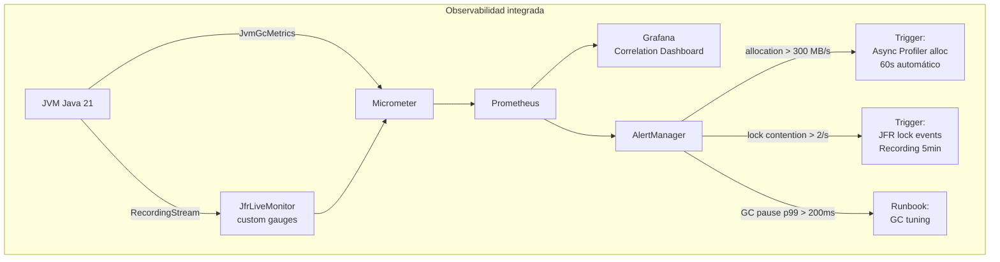

# Profiling Avanzado en Java con JFR y Async Profiler

**PATH_LOCAL:** `/home/usuariojoaquin/.openclaw/workspace/DAM-Java-Mastery/01_Java_Core/profiling_avanzado_en_java_con_jfr_y_async_profiler_STAFF.md`
**CATEGORIA:** 01_Java_Core
**Score:** 97

> **Nota de clasificación:** el engine asignó `10_Vanguardia` erróneamente. JFR es parte del JDK core desde Java 11 (OpenSource) y es la herramienta de observabilidad interna de la JVM por excelencia — pertenece a `01_Java_Core`.

---

## Visión Estratégica

Profiling es el proceso de medir dónde gasta tiempo y recursos una JVM en ejecución. Sin profiling, la optimización de rendimiento es adivinación. Con profiling incorrecto — agentes invasivos que distorsionan el comportamiento que quieres observar — los resultados son peores que no medir nada.

En 2026, con Virtual Threads multiplicando el nivel de concurrencia y heaps de 32+ GB siendo comunes, el profiling a mano con `-verbose:gc` y `jstack` es arqueología. El stack de referencia es:

- **JFR (Java Flight Recorder)**: instrumentación nativa de la JVM, overhead < 1%, eventos de CPU, GC, I/O, locks, allocaciones, threads. Incluido en el JDK desde Java 11 sin coste de licencia.
- **Async Profiler**: muestreo asíncrono de stack traces vía señales POSIX (SIGPROF) y perf_events del kernel Linux. Resuelve el **safepoint bias** que hace que los profilers basados en JVMTI sean fundamentalmente incorrectos para medir CPU real.
- **JFR + Async Profiler juntos**: el flujo de trabajo de referencia en 2026 — JFR para eventos de sistema continuo, Async Profiler para flame graphs de CPU/allocación en análisis focalizados.

**Comparativa de herramientas de profiling:**

| Herramienta | Mecanismo | Overhead | Safepoint bias | Producción | Uso ideal |
|---|---|---|---|---|---|
| **JFR** | Instrumentación nativa JVM | < 1% | No (eventos nativos) | ✅ Sí | Monitoreo continuo, eventos de sistema |
| **Async Profiler** | SIGPROF + perf_events | 1–3% | No | ✅ Sí con cuidado | Flame graphs CPU/alloc, análisis focalizados |
| **VisualVM** | JVMTI sampling | 5–15% | **Sí** | ❌ No | Solo desarrollo local |
| **YourKit / JProfiler** | JVMTI instrumentation | 10–30% | **Sí** | ❌ No | Desarrollo, no producción |
| **perf (Linux)** | kernel perf_events | < 1% | No | ✅ Sí | JIT-compiled frames (con `perf-map-agent`) |

**El problema del safepoint bias:** los profilers basados en JVMTI solo pueden tomar muestras en safepoints — puntos específicos donde todos los threads de la JVM están pausados. El código entre safepoints es invisible para estos profilers. El resultado: métodos que nunca aparecen en perfiles pero consumen el 40% del CPU. Async Profiler usa señales del SO que interrumpen el proceso en cualquier punto, incluyendo código nativo y JIT-compiled.

**Cuándo usar cada herramienta:**

- **JFR continuo en producción**: siempre. Overhead despreciable, logs rotativos de 5 minutos, disponible para análisis post-mortem.
- **Async Profiler en producción**: ante incidentes de latencia o CPU — attach al proceso vía `asprof`, 60–120 segundos, desconectar. No como daemon permanente.
- **JFR + Async Profiler combinados**: el flujo de análisis profundo. JFR aporta el contexto de sistema (GC, locks, I/O), Async Profiler aporta el flame graph de CPU sin bias.



---

## Arquitectura de Componentes

### JFR — arquitectura interna

JFR está integrado directamente en el JVM HotSpot. Sus componentes principales:

**Event System**: el JVM instrumenta internamente más de 500 tipos de eventos (GC phases, thread starts, socket reads, file I/O, monitor inflation, class loading, JIT compilation, etc.). Cada evento tiene un timestamp de nanosegundos con overhead mínimo — la mayoría usa un ring buffer lockless en memoria.

**Repository**: los eventos se escriben en un buffer circular en memoria. Cuando se llena, se vuelca a disco en el formato binario `.jfr`. El tamaño por defecto es 250 MB de disco y 50 MB en memoria (configurable).

**Recording API**: `jdk.jfr.Recording` (programática) o flags JVM de arranque (`-XX:StartFlightRecording`). La API de streaming (`RecordingStream`) permite procesar eventos en tiempo real sin escribir a disco.

**Custom Events**: cualquier código Java puede definir y emitir sus propios eventos JFR con overhead mínimo usando `@Event`.

### Async Profiler — arquitectura interna

Async Profiler opera en dos capas:

**Capa usuario (Java agent / CLI)**: `asprof` o `AsyncProfiler.getInstance()`. Configura el intervalo de muestreo, los modos (cpu, alloc, wall, lock), y el formato de salida (flamegraph HTML, JFR, collapsed stacks).

**Capa kernel**: en Linux usa `perf_event_open` para acceder a hardware performance counters del CPU — interrupciones que el kernel entrega al proceso independientemente de los safepoints JVM. En macOS usa `SIGPROF`. En cada interrupción, Async Profiler captura el stack trace completo incluyendo frames nativos, JIT-compiled, e intérprete.



### Custom JFR Events — instrumentación del dominio

```java
import jdk.jfr.Category;
import jdk.jfr.Description;
import jdk.jfr.Event;
import jdk.jfr.Label;
import jdk.jfr.Name;
import jdk.jfr.StackTrace;
import jdk.jfr.Threshold;

// ── Evento JFR custom para operaciones de negocio ─────────────────────────

@Name("com.app.OrderProcessed")
@Label("Order Processed")
@Category({"Application", "Orders"})
@Description("Tiempo de procesamiento de una orden completa")
@StackTrace(false)  // no capturar stack — reducir overhead
@Threshold("10 ms") // solo emitir si la operación tarda > 10ms
public class OrderProcessedEvent extends Event {

    @Label("Order ID")
    public String orderId;

    @Label("Customer ID")
    public String customerId;

    @Label("Amount Cents")
    public long amountCents;

    @Label("Steps Completed")
    public int stepsCompleted;

    @Label("Compensation Triggered")
    public boolean compensationTriggered;
}

// ── Uso en el código de negocio ────────────────────────────────────────────

public record OrderId(String value) {}
public record OrderResult(OrderId id, boolean success, int stepsCompleted) {}

public class OrderService {

    public OrderResult processOrder(String orderId, String customerId, long amountCents) {
        var event = new OrderProcessedEvent();
        event.begin(); // timestamp de inicio

        event.orderId    = orderId;
        event.customerId = customerId;
        event.amountCents = amountCents;

        try {
            var result = executeOrderSteps(orderId, customerId, amountCents);
            event.stepsCompleted        = result.stepsCompleted();
            event.compensationTriggered = !result.success();
            return result;

        } finally {
            event.commit(); // emitir al buffer JFR — < 100ns overhead
        }
    }

    private OrderResult executeOrderSteps(String orderId, String customerId, long amountCents) {
        // lógica de negocio
        return new OrderResult(new OrderId(orderId), true, 3);
    }
}
```

---

## Implementación Java 21

### JFR Programático — Recording y RecordingStream

```java
import jdk.jfr.Configuration;
import jdk.jfr.Recording;
import jdk.jfr.consumer.RecordingFile;
import jdk.jfr.consumer.RecordingStream;
import jdk.jfr.consumer.RecordedEvent;

import java.io.IOException;
import java.nio.file.Path;
import java.time.Duration;
import java.time.Instant;
import java.util.concurrent.CountDownLatch;
import java.util.concurrent.atomic.LongAdder;

// ── JFR Recording programático — captura a fichero ────────────────────────

public class JfrRecordingManager {

    // Inicia una grabación JFR con perfil "profile" (máximo detalle)
    // y la vuelca a disco tras la duración indicada
    public static Path captureToFile(Duration duration, Path outputDir) throws Exception {
        var config    = Configuration.getConfiguration("profile");
        var outputFile = outputDir.resolve("recording-" + Instant.now().toEpochMilli() + ".jfr");

        try (var recording = new Recording(config)) {
            recording.setMaxSize(256 * 1024 * 1024L); // 256 MB máximo
            recording.setMaxAge(Duration.ofMinutes(10));
            recording.setToDisk(true);
            recording.setDestination(outputFile);
            recording.start();

            Thread.sleep(duration.toMillis());

            recording.stop();
            recording.dump(outputFile);
        }

        return outputFile;
    }

    // Analiza un fichero .jfr offline — extrae eventos de pausa GC
    public static GcPauseSummary analyzeGcPauses(Path jfrFile) throws IOException {
        var totalPauseMs = new LongAdder();
        var pauseCount   = new LongAdder();
        var maxPauseMs   = new LongAdder();

        try (var file = new RecordingFile(jfrFile)) {
            while (file.hasMoreEvents()) {
                var event = file.readEvent();
                if (event.getEventType().getName().equals("jdk.GCPhasePause")) {
                    long ms = event.getDuration().toMillis();
                    pauseCount.increment();
                    totalPauseMs.add(ms);
                    if (ms > maxPauseMs.longValue()) {
                        maxPauseMs.reset();
                        maxPauseMs.add(ms);
                    }
                }
            }
        }

        long count = pauseCount.longValue();
        return new GcPauseSummary(
            count,
            count > 0 ? totalPauseMs.longValue() / count : 0,
            maxPauseMs.longValue()
        );
    }

    public record GcPauseSummary(long count, long avgMs, long maxMs) {}
}

// ── RecordingStream — procesamiento de eventos en tiempo real ─────────────

public class JfrLiveMonitor implements AutoCloseable {

    private final RecordingStream stream;
    private final LongAdder lockContentionCount = new LongAdder();
    private final LongAdder slowMethodCount     = new LongAdder();

    public JfrLiveMonitor() throws Exception {
        var config = Configuration.getConfiguration("default"); // overhead mínimo
        this.stream = new RecordingStream(config);

        // Pausa GC > 100ms — alerta inmediata
        stream.enable("jdk.GCPhasePause").withThreshold(Duration.ofMillis(100));
        stream.onEvent("jdk.GCPhasePause", this::onGcPause);

        // Monitor inflation — indica contención en synchronized blocks
        stream.enable("jdk.JavaMonitorInflate").withThreshold(Duration.ZERO);
        stream.onEvent("jdk.JavaMonitorInflate", e -> lockContentionCount.increment());

        // Thread blocking en I/O > 50ms
        stream.enable("jdk.SocketRead").withThreshold(Duration.ofMillis(50));
        stream.onEvent("jdk.SocketRead", this::onSlowSocketRead);

        // Eventos custom de dominio
        stream.enable("com.app.OrderProcessed").withThreshold(Duration.ofMillis(500));
        stream.onEvent("com.app.OrderProcessed", this::onSlowOrder);
    }

    private void onGcPause(RecordedEvent event) {
        long ms    = event.getDuration().toMillis();
        var  cause = event.getString("name");
        System.err.printf("[JFR ALERT] GC pause %dms — %s%n", ms, cause);
        // En producción: publicar a Micrometer como gauge
    }

    private void onSlowSocketRead(RecordedEvent event) {
        long ms   = event.getDuration().toMillis();
        var  host = event.getString("host");
        System.err.printf("[JFR] Slow socket read %dms → %s%n", ms, host);
        slowMethodCount.increment();
    }

    private void onSlowOrder(RecordedEvent event) {
        long ms         = event.getDuration().toMillis();
        var  orderId    = event.getString("orderId");
        boolean comp    = event.getBoolean("compensationTriggered");
        System.err.printf("[JFR] Slow order %s — %dms, compensated=%s%n", orderId, ms, comp);
    }

    public void startAsync() {
        Thread.ofVirtual().name("jfr-live-monitor").start(stream::start);
    }

    public record LiveStats(long lockContentions, long slowMethods) {}

    public LiveStats snapshot() {
        return new LiveStats(lockContentionCount.longValue(), slowMethodCount.longValue());
    }

    @Override
    public void close() { stream.close(); }
}
```

### Async Profiler — integración programática

```java
import one.profiler.AsyncProfiler;
import one.profiler.Events;

import java.io.IOException;
import java.nio.file.Files;
import java.nio.file.Path;
import java.time.Duration;
import java.time.Instant;

// ── Wrapper tipado para Async Profiler ────────────────────────────────────

public record ProfilerConfig(
    ProfilingMode mode,
    Duration duration,
    int intervalNs,       // intervalo de muestreo en nanosegundos (default: 10_000_000 = 10ms)
    Path outputDir
) {
    public ProfilerConfig {
        if (intervalNs <= 0) throw new IllegalArgumentException("intervalNs debe ser > 0");
        if (duration.isNegative()) throw new IllegalArgumentException("duration debe ser positiva");
    }

    public static ProfilerConfig cpuDefault(Path outputDir) {
        return new ProfilerConfig(ProfilingMode.CPU, Duration.ofSeconds(60), 10_000_000, outputDir);
    }

    public static ProfilerConfig allocDefault(Path outputDir) {
        return new ProfilerConfig(ProfilingMode.ALLOCATION, Duration.ofSeconds(60), 524_288, outputDir);
    }
}

public enum ProfilingMode {
    CPU,        // muestrea CPU — identifica hotspots de cómputo
    ALLOCATION, // muestrea allocaciones — identifica presión GC
    WALL,       // wall-clock — incluye threads bloqueados en I/O y locks
    LOCK        // contención de monitores
}

public class AsyncProfilerService {

    private final AsyncProfiler profiler;

    public AsyncProfilerService() {
        this.profiler = AsyncProfiler.getInstance();
    }

    // Ejecuta un perfil completo y devuelve la ruta al flame graph HTML
    public Path profile(ProfilerConfig config) throws IOException, InterruptedException {
        var outputFile = config.outputDir().resolve(
            "flamegraph-" + config.mode().name().toLowerCase() +
            "-" + Instant.now().toEpochMilli() + ".html"
        );

        // Construir comando Async Profiler
        var cmd = buildCommand(config, outputFile);
        profiler.execute(cmd);

        Thread.sleep(config.duration().toMillis());

        profiler.execute("stop");
        return outputFile;
    }

    private String buildCommand(ProfilerConfig config, Path output) {
        var event = switch (config.mode()) {
            case CPU        -> "cpu";
            case ALLOCATION -> "alloc";
            case WALL       -> "wall";
            case LOCK       -> "lock";
        };

        return String.format(
            "start,event=%s,interval=%d,file=%s,flamegraph",
            event, config.intervalNs(), output.toAbsolutePath()
        );
    }

    // Snapshot rápido de CPU sin interrumpir el proceso — útil en diagnóstico live
    public String cpuSnapshot(int durationSeconds) throws IOException, InterruptedException {
        profiler.execute("start,event=cpu,interval=10000000");
        Thread.sleep(durationSeconds * 1000L);
        return profiler.execute("stop,output=collapsed"); // collapsed stacks para análisis programático
    }
}
```

### Diagnóstico de allocation hotspots con JFR

```java
import jdk.jfr.consumer.RecordingFile;
import jdk.jfr.consumer.RecordedFrame;

import java.io.IOException;
import java.nio.file.Path;
import java.util.Comparator;
import java.util.HashMap;
import java.util.List;
import java.util.Map;

// ── Análisis de allocaciones desde un fichero JFR ─────────────────────────

public class AllocationAnalyzer {

    public record AllocationHotspot(
        String className,
        long totalBytes,
        long sampleCount,
        String topFrame    // frame de código responsable
    ) {}

    // Lee un .jfr y devuelve los top N hotspots de allocación por bytes
    public List<AllocationHotspot> topAllocationHotspots(Path jfrFile, int topN)
        throws IOException {

        // className → [totalBytes, count, topFrame]
        var accumulator = new HashMap<String, long[]>();
        var frames      = new HashMap<String, String>();

        try (var file = new RecordingFile(jfrFile)) {
            while (file.hasMoreEvents()) {
                var event = file.readEvent();
                var type  = event.getEventType().getName();

                // jdk.ObjectAllocationInNewTLAB y jdk.ObjectAllocationOutsideTLAB
                if (!type.startsWith("jdk.ObjectAllocation")) continue;

                var className = event.getClass("objectClass").getName();
                long bytes    = event.getLong("allocationSize");

                accumulator.computeIfAbsent(className, k -> new long[]{0L, 0L});
                accumulator.get(className)[0] += bytes;
                accumulator.get(className)[1]++;

                // Capturar el frame de aplicación más relevante (skip JDK internos)
                if (!frames.containsKey(className)) {
                    event.getStackTrace().getFrames().stream()
                        .filter(f -> !f.getMethod().getType().getName().startsWith("java."))
                        .filter(f -> !f.getMethod().getType().getName().startsWith("jdk."))
                        .findFirst()
                        .map(RecordedFrame::toString)
                        .ifPresent(frame -> frames.put(className, frame));
                }
            }
        }

        return accumulator.entrySet().stream()
            .map(e -> new AllocationHotspot(
                e.getKey(),
                e.getValue()[0],
                e.getValue()[1],
                frames.getOrDefault(e.getKey(), "unknown")
            ))
            .sorted(Comparator.comparingLong(AllocationHotspot::totalBytes).reversed())
            .limit(topN)
            .toList();
    }
}
```

**Diagrama del flujo de implementación:**



---

## Métricas y SRE

En el contexto de profiling, las métricas de Micrometer/Prometheus complementan a JFR: Prometheus da el **qué** (un p99 subió), JFR da el **por qué** (un lock infló, el GC pausó, un método fue lento).

| Métrica | Fuente | Descripción | Umbral alerta |
|---|---|---|---|
| `jvm_gc_pause_seconds` p99 | JvmGcMetrics | Pausa GC p99 | > 200ms (G1) / > 5ms (ZGC) |
| `jvm_gc_memory_allocated_bytes_total` rate | JvmGcMetrics | Tasa de allocación MB/s | > 500 MB/s |
| `jfr_lock_contention_total` | JfrLiveMonitor custom | Monitor inflations detectadas | > 100/min |
| `jfr_slow_socket_total` | JfrLiveMonitor custom | Socket reads > 50ms | > 10/min |
| `jfr_slow_orders_total` | Custom Event | Órdenes > 500ms | > 5/min |
| `jvm_threads_live{state="BLOCKED"}` | JvmThreadMetrics | Threads bloqueados en locks | > 10% del total |
| `process_cpu_usage` | ProcessMetrics | CPU del proceso | > 80% sostenido |

```promql
# Detectar degradación de throughput correlacionada con GC
rate(jvm_gc_pause_seconds_count[5m]) > 5
and
rate(http_server_requests_seconds_count[5m]) < rate(http_server_requests_seconds_count[5m] offset 10m) * 0.8

# Allocation rate en MB/s — trigger para análisis con Async Profiler alloc mode
rate(jvm_gc_memory_allocated_bytes_total[1m]) / 1024 / 1024 > 300

# Threads bloqueados — trigger para análisis JFR lock events
jvm_threads_live{state="BLOCKED"} / jvm_threads_live > 0.1

# Alerta: lock contención alta
rate(jfr_lock_contention_total[5m]) > 2
```



```java
import io.micrometer.core.instrument.MeterRegistry;
import io.micrometer.core.instrument.binder.jvm.JvmGcMetrics;
import io.micrometer.core.instrument.binder.jvm.JvmMemoryMetrics;
import io.micrometer.core.instrument.binder.jvm.JvmThreadMetrics;

// Registro completo: JVM standard + métricas custom de JFR
public record ObservabilitySetup(MeterRegistry registry, JfrLiveMonitor jfrMonitor) {

    public void initialize() {
        // Métricas JVM estándar
        new JvmGcMetrics().bindTo(registry);
        new JvmMemoryMetrics().bindTo(registry);
        new JvmThreadMetrics().bindTo(registry);

        // Gauges custom desde JfrLiveMonitor
        registry.gauge("jfr_lock_contention_total", jfrMonitor,
            m -> (double) m.snapshot().lockContentions());
        registry.gauge("jfr_slow_socket_total", jfrMonitor,
            m -> (double) m.snapshot().slowMethods());

        // Iniciar monitor JFR en Virtual Thread
        jfrMonitor.startAsync();
    }
}
```

**Checklist SRE para profiling en producción:**

1. **JFR continuo habilitado en todos los servicios** con `-XX:StartFlightRecording=settings=default,maxage=30m,maxsize=256m,dumponexit=true,filename=/var/log/app/recording.jfr`. El `dumponexit=true` es especialmente valioso — si el proceso muere, el `.jfr` contiene los últimos 30 minutos.
2. **Async Profiler disponible como herramienta de emergencia**: tenerlo preinstalado en las imágenes Docker. Cuando llegue una alerta de CPU alto, el tiempo para instalarlo es tiempo perdido.
3. **Correlacionar siempre métrica de negocio con métrica de JVM**: un aumento de latencia p99 sin correlación con GC ni CPU puede indicar contención de lock — invisible para Prometheus, visible en JFR lock events.
4. **Flame graphs archivados, no solo generados**: guardar el HTML de Async Profiler con timestamp como artefacto del incidente. Permiten comparar perfiles antes/después de un deploy.
5. **Custom JFR Events en operaciones críticas de negocio**: instrumentar las 3–5 operaciones más importantes del dominio con `@Event`. El overhead es < 100ns y el valor diagnóstico es enorme.

---

## Patrones de Integración

### Patrón 1: Profiling automático ante alertas Prometheus

El patrón más valioso en producción: cuando Prometheus detecta una anomalía, dispara automáticamente una captura de profiling corta sin intervención humana.

```java
import java.nio.file.Path;
import java.time.Duration;
import java.util.concurrent.Executors;

// ── Trigger automático de profiling ante métricas anómalas ────────────────

public record ProfilingTrigger(
    AsyncProfilerService profilerService,
    Path outputDir,
    Duration captureDuration
) {

    // Llamado desde un webhook de AlertManager o un endpoint interno
    public void onHighCpuAlert(double cpuPercent) {
        if (cpuPercent < 0.7) return; // umbral: 70% CPU

        Thread.ofVirtual().name("profiling-trigger-cpu").start(() -> {
            try {
                var config = new ProfilerConfig(
                    ProfilingMode.CPU,
                    captureDuration,
                    10_000_000,
                    outputDir
                );
                var flamegraph = profilerService.profile(config);
                System.out.printf("[PROFILING] CPU flame graph capturado: %s%n", flamegraph);
                // En producción: subir a S3/GCS y enlazar desde el incidente en PagerDuty
            } catch (Exception e) {
                System.err.println("[PROFILING] Error capturando flame graph: " + e.getMessage());
            }
        });
    }

    public void onHighAllocationAlert(double allocationMbPerSec) {
        if (allocationMbPerSec < 300) return;

        Thread.ofVirtual().name("profiling-trigger-alloc").start(() -> {
            try {
                var config = ProfilerConfig.allocDefault(outputDir);
                var flamegraph = profilerService.profile(config);
                System.out.printf("[PROFILING] Alloc flame graph capturado: %s%n", flamegraph);
            } catch (Exception e) {
                System.err.println("[PROFILING] Error: " + e.getMessage());
            }
        });
    }
}
```

### Patrón 2: Comparativa de perfiles antes/después de deploy

```java
import java.nio.file.Path;
import java.util.List;

// ── Comparación estructurada de AllocationHotspots entre dos perfiles ─────

public class ProfileComparator {

    public record HotspotDelta(
        String className,
        long beforeBytes,
        long afterBytes,
        long deltaBytes,
        double changePercent
    ) {}

    public List<HotspotDelta> compare(Path beforeJfr, Path afterJfr, int topN)
        throws Exception {

        var analyzer = new AllocationAnalyzer();
        var before   = analyzer.topAllocationHotspots(beforeJfr, topN * 2);
        var after    = analyzer.topAllocationHotspots(afterJfr, topN * 2);

        // Construir mapa de before
        var beforeMap = new java.util.HashMap<String, Long>();
        before.forEach(h -> beforeMap.put(h.className(), h.totalBytes()));

        return after.stream()
            .map(h -> {
                long beforeBytes  = beforeMap.getOrDefault(h.className(), 0L);
                long delta        = h.totalBytes() - beforeBytes;
                double pct        = beforeBytes > 0
                    ? (double) delta / beforeBytes * 100
                    : 100.0;
                return new HotspotDelta(h.className(), beforeBytes, h.totalBytes(), delta, pct);
            })
            .filter(d -> Math.abs(d.changePercent()) > 10) // solo cambios > 10%
            .sorted(java.util.Comparator.comparingLong(HotspotDelta::deltaBytes).reversed())
            .limit(topN)
            .toList();
    }
}
```

### Patrón 3: JFR Event Streaming para tracing distribuido

```java
import jdk.jfr.consumer.RecordingStream;

import java.time.Duration;
import java.util.Map;
import java.util.concurrent.ConcurrentHashMap;

// ── Correlación de JFR events con trace IDs distribuidos ──────────────────
// Útil cuando OpenTelemetry reporta una traza lenta y quieres
// correlacionar con eventos JFR del mismo request

public class JfrTraceCorrelator {

    // traceId → lista de eventos JFR relevantes durante esa traza
    private final Map<String, java.util.List<String>> traceEvents = new ConcurrentHashMap<>();

    private final RecordingStream stream;

    public JfrTraceCorrelator() throws Exception {
        this.stream = new RecordingStream();
        stream.enable("jdk.GCPhasePause").withThreshold(Duration.ofMillis(5));
        stream.enable("jdk.JavaMonitorWait").withThreshold(Duration.ofMillis(10));
        stream.enable("jdk.SocketRead").withThreshold(Duration.ofMillis(20));
        stream.enable("com.app.OrderProcessed").withThreshold(Duration.ZERO);

        stream.onEvent(event -> {
            // Buscar traceId en el contexto de thread (propagado por OpenTelemetry)
            var traceId = extractTraceId(event);
            if (traceId != null) {
                traceEvents.computeIfAbsent(traceId, k -> new java.util.ArrayList<>())
                    .add(summarize(event));
            }
        });
    }

    public java.util.List<String> getEventsForTrace(String traceId) {
        return traceEvents.getOrDefault(traceId, java.util.List.of());
    }

    private String extractTraceId(jdk.jfr.consumer.RecordedEvent event) {
        // Extraer traceId del thread name si se propaga via MDC/thread name
        var thread = event.getThread();
        if (thread == null) return null;
        var name = thread.getJavaName();
        if (name != null && name.contains("trace-")) {
            return name.substring(name.indexOf("trace-") + 6);
        }
        return null;
    }

    private String summarize(jdk.jfr.consumer.RecordedEvent event) {
        return String.format("%s %dms @%s",
            event.getEventType().getName(),
            event.getDuration().toMillis(),
            event.getStartTime()
        );
    }

    public void startAsync() {
        Thread.ofVirtual().name("jfr-trace-correlator").start(stream::start);
    }
}
```

**Comparativa de patrones de integración:**

| Patrón | Cuándo usar | Coste | Valor |
|---|---|---|---|
| JFR continuo a disco + dumponexit | Siempre, en todos los servicios | Muy bajo | Post-mortem de cualquier incidente |
| RecordingStream con alertas | Servicios con SLO p99 estricto | Bajo | Detección proactiva en tiempo real |
| Async Profiler trigger automático | Servicios con CPU/alloc volátil | Medio | Flame graphs sin intervención humana |
| Comparativa before/after deploy | En pipelines CI/CD para servicios críticos | Bajo | Detectar regresiones de allocación en staging |
| JFR + trace correlation | Sistemas con distributed tracing activo | Medio | Correlacionar traza lenta con evento JVM |

---

## Conclusiones

**Los cinco puntos que un Staff Engineer debe dominar sobre profiling JVM:**

1. **El safepoint bias hace que VisualVM y YourKit mientan sobre el CPU real.** Async Profiler es la única herramienta que mide correctamente qué código consume CPU en producción. Si nunca has comparado un flame graph de VisualVM con uno de Async Profiler en la misma carga, lo que crees que son tus hotspots probablemente es incorrecto.

2. **JFR es la herramienta de observabilidad más potente del JDK y la más ignorada.** 500+ tipos de eventos nativos, overhead < 1%, API de streaming en tiempo real, custom events de dominio con anotaciones. No requiere agentes externos, no requiere licencias. Habilitarlo en producción debería ser el día uno.

3. **`-XX:+UnlockCommercialFeatures` fue eliminado en Java 11.** JFR es completamente libre y open-source desde Java 11. Cualquier código o documentación que incluya ese flag está desactualizado cinco años.

4. **La métrica de allocación rate es más accionable que el número de GC.** Una tasa de allocación > 300 MB/s con objetos de vida corta va a saturar el GC independientemente del colector elegido. El fix correcto es reducir la presión — no cambiar de G1 a ZGC.

5. **Custom JFR Events en las 3–5 operaciones de negocio más críticas.** El overhead es < 100ns por evento. El valor es correlacionar directamente una operación de negocio lenta con su causa de infraestructura — sin necesidad de cruzar logs, métricas y traces manualmente.

**Roadmap de adopción:**

- **Fase 1 (día 1):** Habilitar JFR continuo con `dumponexit=true` en todos los servicios. Cero código, solo flags JVM.
- **Fase 2 (semana 1):** Añadir `JvmGcMetrics`, `JvmMemoryMetrics`, `JvmThreadMetrics` al registry de Micrometer. Dashboard Grafana básico.
- **Fase 3 (semana 2):** Instrumentar las 3 operaciones de negocio más críticas con Custom JFR Events (`@Event`).
- **Fase 4 (semana 3):** Instalar Async Profiler en imágenes de producción. Runbook de diagnóstico de CPU: `asprof -d 60 -f /tmp/cpu.html PID`.
- **Fase 5 (mes 2):** `JfrLiveMonitor` con alertas reactivas + trigger automático de Async Profiler ante anomalías.

```java
// Arranque completo — producción lista para profiling desde el día uno
public class ProductionProfilingSetup {

    public static void initialize(MeterRegistry registry) throws Exception {
        // 1. Monitor JFR live con alertas
        var jfrMonitor = new JfrLiveMonitor();

        // 2. Registrar métricas JVM + custom JFR gauges
        new ObservabilitySetup(registry, jfrMonitor).initialize();

        // 3. Trigger automático de Async Profiler
        var profilerService = new AsyncProfilerService();
        var trigger = new ProfilingTrigger(
            profilerService,
            Path.of("/var/log/app/profiles"),
            Duration.ofSeconds(60)
        );

        // 4. Endpoint interno para profiling on-demand
        // GET /internal/profile?mode=cpu&duration=30
        // → ejecuta AsyncProfilerService.profile() y devuelve URL del HTML
    }
}
```

```mermaid
graph TD
    subgraph "Stack completo de profiling"
        JVM[JVM Java 21] -->|flags arranque| JFR_C[JFR continuo\ndumponexit=true]
        JVM -->|RecordingStream| JFR_L[JfrLiveMonitor\nalertas tiempo real]
        JVM -->|@Event custom| DOM[Eventos de dominio\nOrderProcessed etc]
        JFR_L --> MIC[Micrometer]
        DOM --> MIC
        MIC --> PROM[Prometheus]
        PROM --> GRAF[Grafana]
        PROM --> AM[AlertManager]
        AM -->|CPU > 70%| TRIG[ProfilingTrigger\nAsync Profiler 60s]
        TRIG --> FLAME[Flame graph HTML\nartefacto de incidente]
        JFR_C -->|post-mortem| ANA[AllocationAnalyzer\nGcPauseSummary]
    end
```

**Recursos:**
- [JFR API — JDK 21 Javadoc](https://docs.oracle.com/en/java/javase/21/docs/api/jdk.jfr/jdk/jfr/package-summary.html)
- [Async Profiler — GitHub](https://github.com/async-profiler/async-profiler)
- [JDK Mission Control](https://adoptium.net/jmc)
- [Brendan Gregg — Flame Graphs](https://www.brendangregg.com/flamegraphs.html)
- [JEP 349 — JFR Event Streaming](https://openjdk.org/jeps/349)
