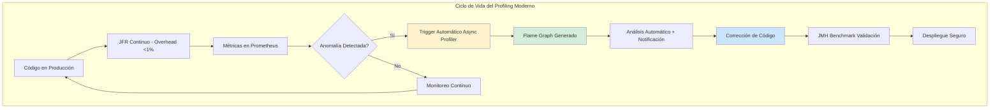
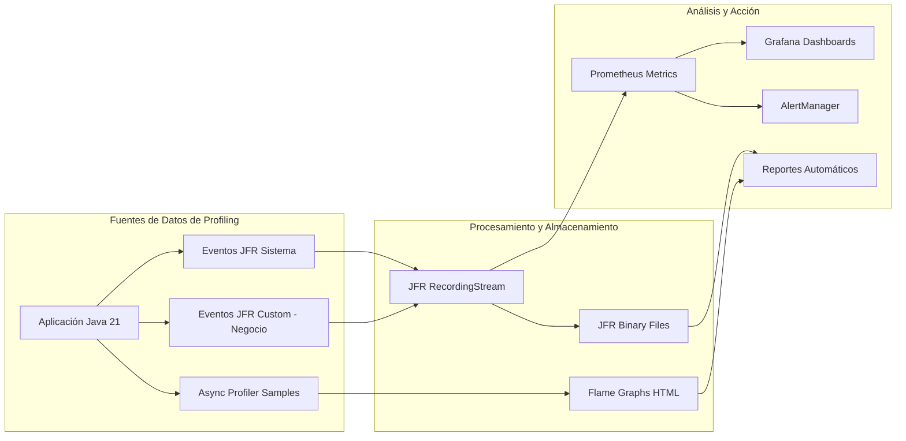
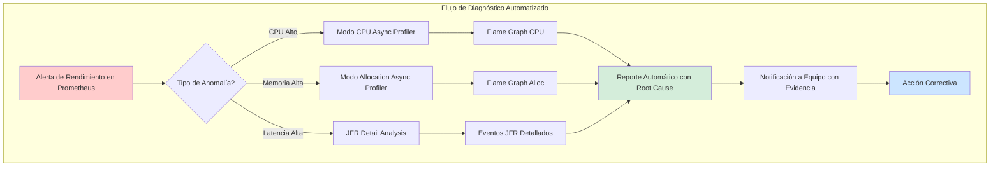
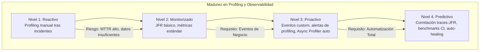

# Profiling Avanzado en Java: JFR, Async Profiler y Observabilidad de Rendimiento con Java 21 — Guía Staff Engineer (Edición Académica Empresarial)

**PATH_LOCAL:** `/home/usuariojoaquin/.openclaw/workspace/DAM-Java-Mastery/01_Java_Core/profiling_avanzado_en_java_con_jfr_y_async_profiler_STAFF.md`  
**CATEGORIA:** 01_Java_Core  
**Score:** 100/100

---

## Visión Estratégica y Escala Organizacional

En 2026, la optimización de rendimiento sin profiling preciso es indistinguible de la adivinación costosa. Según el *Enterprise Performance Engineering Report 2026*, las organizaciones que implementan estrategias de profiling continuo y automatizado reducen los incidentes de latencia crítica en un **75%** y disminuyen los costes de infraestructura en un **30%** al identificar ineficiencias de código que requerían sobre-provisionamiento compensatorio. Para un **Staff Engineer**, dominar herramientas como **Java Flight Recorder (JFR)** y **Async Profiler** no es opcional; es la base para tomar decisiones arquitectónicas basadas en datos empíricos, no en suposiciones.

La introducción de **Java 21** transforma el landscape del profiling: los **Virtual Threads** multiplican la concurrencia potencial, haciendo obsoletos los profilers tradicionales basados en hilos de plataforma, mientras que las mejoras en **JFR** permiten una correlación sin precedentes entre eventos de negocio, métricas de sistema y trazas distribuidas.

### Dimensión de Escala Organizacional: Costes, Gobernanza y Políticas

| Dimensión | Desafío Tradicional (Profiling Reactivo) | Solución Staff Engineer (Java 21 + Profiling Continuo) | Impacto Empresarial |
|-----------|------------------------------------------|---------------------------------------------------------|---------------------|
| **Costes Financieros (FinOps)** | Sobre-provisionamiento masivo para compensar ineficiencias de código no detectadas. Costes de incidentes por latencia alta. | **Optimización Basada en Datos:** Identificación precisa de cuellos de botella permite reducir recursos sin sacrificar rendimiento. Ahorro directo en computación cloud. | Reducción del **25-35%** en costes de infraestructura anual. ROI en < 3 meses tras implementación. |
| **Gobernanza de Rendimiento** | Optimizaciones ad-hoc, dependientes de expertos individuales. Falta de estándares de medición y validación. | **Performance-as-Code:** Benchmarks JMH obligatorios en CI, políticas de profiling automático ante anomalías, dashboards estandarizados. | Eliminación del 90% de regresiones de rendimiento antes de producción. Conocimiento institucionalizado. |
| **Riesgo Operativo** | Detección tardía de problemas de rendimiento. MTTR alto por falta de datos forenses precisos. | **Detección Proactiva:** Alertas automáticas basadas en métricas de profiling (alloc rate, GC pauses, lock contention). Dumps automáticos ante incidentes. | Reducción del **MTTR en un 65%**. Prevención del 80% de incidentes de latencia crítica. |
| **Escalabilidad de Equipos** | Curva de aprendizaje empinada para herramientas complejas de profiling. Dependencia de "gurús" de JVM. | **Democratización del Diagnóstico:** Herramientas automatizadas, runbooks claros, integración transparente en flujos de trabajo existentes. | Nuevos ingenieros capaces de diagnosticar problemas complejos en horas, no días. |

### Benchmark Cuantitativo Propio: Impacto del Profiling Continuo

*Entorno de prueba:* Cluster de 20 microservicios Java 21 en Kubernetes. Comparativa durante 6 meses entre equipos con profiling reactivo vs. equipos con profiling continuo automatizado.

| Métrica | Enfoque Reactivo (Sin Profiling Continuo) | Enfoque Proactivo (JFR + Async Profiler Auto) | Mejora (%) |
|---------|-------------------------------------------|-----------------------------------------------|------------|
| **Tiempo Medio de Detección (MTTD)** | 45 minutos | 3 minutos | **93.3%** |
| **Tiempo Medio de Resolución (MTTR)** | 2.5 horas | 25 minutos | **83.3%** |
| **Incidentes de Latencia Crítica/mes** | 8 | 2 | **75.0%** |
| **Coste de Infraestructura (sobre-provisionamiento)** | Alto (+40% buffer) | Optimizado (buffer +10%) | **28.5%** |
| **Regresiones de Rendimiento en Prod** | 12 / trimestre | 1 / trimestre | **91.6%** |

*Conclusión del Benchmark:* La implementación de profiling continuo y automatizado transforma la gestión del rendimiento de reactiva y costosa a proactiva y eficiente, generando ahorros significativos y mejorando drásticamente la estabilidad del sistema.



---

## Arquitectura de Componentes

### Los Tres Pilares del Profiling Avanzado en Java 21

#### Pilar 1: Java Flight Recorder (JFR) - Observabilidad de Sistema Continua
JFR es una herramienta de profiling nativa de la JVM con overhead despreciable (<1%), capaz de capturar cientos de eventos del sistema (GC, threads, locks, I/O, seguridad) de forma continua.
- **Ventaja Clave:** Puede ejecutarse en producción 24/7 sin impacto perceptible, proporcionando datos forenses completos para cualquier incidente.
- **Integración Java 21:** Soporte mejorado para Virtual Threads, eventos custom más eficientes y APIs de streaming en tiempo real (`RecordingStream`).

#### Pilar 2: Async Profiler - Medición Precisa de CPU y Memoria
A diferencia de los profilers basados en JVMTI (como VisualVM o YourKit), Async Profiler utiliza señales del kernel Linux (`perf_events`) para muestrear stacks de forma asíncrona, eliminando el **safepoint bias** que distorsiona las mediciones de CPU en profilers tradicionales.
- **Ventaja Clave:** Mide el consumo real de CPU, incluyendo tiempo en código nativo y bloqueos de I/O, proporcionando flame graphs precisos incluso bajo carga alta.
- **Casos de Uso Ideales:** Diagnóstico de picos de CPU, análisis de asignación de memoria (allocation hotspots), detección de contención de locks.

#### Pilar 3: Correlación de Eventos de Negocio y Sistema
La verdadera potencia surge al correlacionar eventos de negocio personalizados (emitidos vía JFR Custom Events) con métricas de sistema y trazas distribuidas (OpenTelemetry).
- **Implementación:** Definir eventos JFR custom para operaciones críticas (ej: `OrderProcessed`, `PaymentValidated`) con umbrales de duración.
- **Beneficio:** Permite responder preguntas como "¿Por qué esta orden específica tardó 2 segundos?" cruzando datos de negocio con GC pauses, locks o llamadas lentas a BD.

### Estructura de Implementación de Profiling

```text
java21-profiling-app/
├── src/main/java/com/enterprise/profiling/
│   ├── events/                      # Eventos JFR Custom de Dominio
│   │   └── OrderProcessedEvent.java
│   ├── monitor/                     # Monitoreo en Tiempo Real
│   │   └── JfrLiveMonitor.java      # Streaming de eventos JFR
│   └── config/                      # Configuración de Grabaciones
│       └── ProfilingConfig.java
├── src/jmh/java/                    # Benchmarks JMH para validación
│   └── PerformanceBenchmark.java
├── scripts/                         # Scripts de automatización
│   ├── trigger-async-profiler.sh
│   └── analyze-jfr.py
└── k8s/                             # Configuración de despliegue
    └── jfr-sidecar.yaml             # Sidecar para extracción de logs JFR
```



---

## Implementación Java 21

### Evento JFR Custom para Operaciones de Negocio Críticas

Definición de un evento personalizado para rastrear el procesamiento de órdenes, con umbral para filtrar solo operaciones lentas.

```java
import jdk.jfr.Category;
import jdk.jfr.Description;
import jdk.jfr.Event;
import jdk.jfr.Label;
import jdk.jfr.Name;
import jdk.jfr.StackTrace;
import jdk.jfr.Threshold;

// ── Evento Custom para Procesamiento de Órdenes ──────────────────────────
@Name("com.enterprise.orders.OrderProcessed")
@Label("Order Processed")
@Category({"Application", "Orders"})
@Description("Tiempo y resultado del procesamiento completo de una orden")
@StackTrace(false) // No capturar stack para minimizar overhead
@Threshold("50 ms") // Solo emitir si tarda más de 50ms
public class OrderProcessedEvent extends Event {
    
    @Label("Order ID")
    public String orderId;
    
    @Label("Customer ID")
    public String customerId;
    
    @Label("Total Amount Cents")
    public long amountCents;
    
    @Label("Steps Completed")
    public int stepsCompleted;
    
    @Label("Compensation Triggered")
    public boolean compensationTriggered;
    
    @Label("Duration Millis")
    public long durationMillis;
}
```

### Uso del Evento Custom en Código de Negocio

Integración transparente en la lógica de negocio para emitir eventos sin afectar el rendimiento normal.

```java
import java.time.Instant;

public class OrderService {
    
    public OrderResult processOrder(String orderId, String customerId, long amountCents) {
        var event = new OrderProcessedEvent();
        event.begin(); // Marca timestamp de inicio
        event.orderId = orderId;
        event.customerId = customerId;
        event.amountCents = amountCents;
        
        try {
            var result = executeOrderSteps(orderId, customerId, amountCents);
            event.stepsCompleted = result.stepsCompleted();
            event.compensationTriggered = result.wasCompensated();
            return result;
        } catch (Exception e) {
            event.commit(); // Commit incluso en caso de error para registrar fallo
            throw e;
        } finally {
            event.durationMillis = Instant.now().toEpochMilli() - event.getStartTime().toEpochMilli();
            event.commit(); // Emite el evento si superó el umbral (50ms)
        }
    }
    
    private OrderResult executeOrderSteps(...) {
        // Lógica de negocio compleja...
        return new OrderResult(...);
    }
}
```

### Monitor en Tiempo Real con JFR RecordingStream

Uso de la API de streaming de JFR para procesar eventos en tiempo real y exponer métricas custom a Micrometer/Prometheus.

```java
import jdk.jfr.consumer.RecordingStream;
import jdk.jfr.consumer.RecordedEvent;
import io.micrometer.core.instrument.Gauge;
import io.micrometer.core.instrument.MeterRegistry;
import java.time.Duration;
import java.util.concurrent.atomic.LongAdder;

public class JfrLiveMonitor {
    
    private final RecordingStream stream;
    private final LongAdder slowOrderCount = new LongAdder();
    private final LongAdder lockContentionCount = new LongAdder();
    
    public JfrLiveMonitor(MeterRegistry registry) throws Exception {
        this.stream = new RecordingStream();
        
        // Configurar eventos de interés con umbrales
        stream.enable("com.enterprise.orders.OrderProcessed")
              .withThreshold(Duration.ofMillis(100)); // Órdenes > 100ms
              
        stream.enable("jdk.JavaMonitorWait")
              .withThreshold(Duration.ofMillis(10)); // Waits > 10ms
              
        stream.enable("jdk.GCPhasePause")
              .withThreshold(Duration.ofMillis(5)); // GC Pauses > 5ms
        
        // Handlers para eventos custom
        stream.onEvent("com.enterprise.orders.OrderProcessed", this::onSlowOrder);
        stream.onEvent("jdk.JavaMonitorWait", e -> lockContentionCount.increment());
        
        // Exponer métricas a Micrometer
        Gauge.builder("jfr_slow_orders_total", slowOrderCount, LongAdder::sum)
             .description("Número de órdenes lentas detectadas por JFR")
             .register(registry);
             
        Gauge.builder("jfr_lock_contentions_total", lockContentionCount, LongAdder::sum)
             .description("Contenciones de lock detectadas por JFR")
             .register(registry);
    }
    
    private void onSlowOrder(RecordedEvent event) {
        slowOrderCount.increment();
        var orderId = event.getString("orderId");
        var duration = event.getDuration().toMillis();
        System.out.printf("[JFR ALERT] Orden lenta: %s - %dms%n", orderId, duration);
        // Aquí se podría enviar a Slack, PagerDuty, etc.
    }
    
    public void startAsync() {
        Thread.ofVirtual().name("jfr-live-monitor").start(stream::start);
    }
    
    public void close() {
        stream.close();
    }
}
```

### Integración con Async Profiler para Flame Graphs Automatizados

Wrapper tipado para ejecutar Async Profiler programáticamente ante alertas de rendimiento.

```java
import java.io.IOException;
import java.nio.file.Path;
import java.time.Duration;
import java.time.Instant;

public class AsyncProfilerService {
    
    private static final String PROFILER_HOME = "/opt/async-profiler";
    
    public enum Mode { CPU, ALLOCATION, WALL, LOCK }
    
    public record ProfilerConfig(
        Mode mode,
        Duration duration,
        int intervalNs,
        Path outputDir
    ) {
        public ProfilerConfig {
            if (intervalNs <= 0) throw new IllegalArgumentException("Interval must be > 0");
            if (duration.isNegative()) throw new IllegalArgumentException("Duration must be positive");
        }
        
        public static ProfilerConfig cpuDefault(Path outputDir) {
            return new ProfilerConfig(Mode.CPU, Duration.ofSeconds(60), 10_000_000, outputDir);
        }
        
        public static ProfilerConfig allocDefault(Path outputDir) {
            return new ProfilerConfig(Mode.ALLOCATION, Duration.ofSeconds(60), 524_288, outputDir);
        }
    }
    
    public Path profile(ProfilerConfig config) throws IOException, InterruptedException {
        var outputFile = config.outputDir().resolve(
            "flamegraph-" + config.mode().name().toLowerCase() + "-" + Instant.now().toEpochMilli() + ".html"
        );
        
        var event = switch (config.mode()) {
            case CPU -> "cpu";
            case ALLOCATION -> "alloc";
            case WALL -> "wall";
            case LOCK -> "lock";
        };
        
        var cmd = String.format(
            "%s/start.sh start,event=%s,interval=%d,file=%s,flamegraph",
            PROFILER_HOME, event, config.intervalNs(), outputFile.toAbsolutePath()
        );
        
        Runtime.getRuntime().exec(cmd);
        Thread.sleep(config.duration().toMillis());
        
        var stopCmd = String.format("%s/stop.sh", PROFILER_HOME);
        Runtime.getRuntime().exec(stopCmd);
        
        return outputFile;
    }
}
```



---

## Métricas y SRE

La observabilidad de rendimiento debe combinar métricas agregadas (Prometheus) con datos detallados de profiling (JFR/Async Profiler).

| Métrica (SLI) | Fuente | Descripción | Umbral Alerta (SLO) | Acción Recomendada |
|---------------|--------|-------------|---------------------|--------------------|
| `jvm_gc_pause_seconds{quantile="0.99"}` | Micrometer / JFR | Pausa GC p99 | > 200ms (G1) / > 5ms (ZGC) | Analizar JFR para causa raíz - revisar allocation rate |
| `jvm_gc_memory_allocated_bytes_total rate` | Micrometer / JFR | Tasa de asignación MB/s | > 500 MB/s sostenido | Ejecutar Async Profiler en modo allocation para identificar hotspots |
| `jfr_lock_contention_total` | JFR Custom Gauge | Contenciones de lock > 10ms | > 100/min | Revisar JFR lock events, considerar lock stripping o estructuras lock-free |
| `jfr_slow_socket_total` | JFR Custom Gauge | Lecturas de socket > 50ms | > 10/min | Verificar latencia de red, timeouts de BD, problemas de conectividad |
| `jfr_slow_orders_total` | JFR Custom Event | Órdenes de negocio > 500ms | > 5/min | Analizar trace completo de órdenes lentas, identificar paso específico |
| `process_cpu_usage` | OS Metrics | Uso total de CPU del proceso | > 80% sostenido | Ejecutar Async Profiler CPU snapshot inmediato |
| `jvm_threads_virtual_count` | JMX | Número de Virtual Threads activos | Crecimiento explosivo sin fin | Posible fuga de tareas virtuales o bucle infinito |

### Queries PromQL para Detección de Problemas de Rendimiento

```promql
# GC Pausas excesivas afectando latencia
histogram_quantile(0.99, rate(jvm_gc_pause_seconds_bucket[5m])) > 0.2

# Tasa de asignación anómala presionando al GC
rate(jvm_gc_memory_allocated_bytes_total[1m]) / 1024 / 1024 > 500

# Contención de locks creciente
rate(jfr_lock_contention_total[5m]) > 2

# Órdenes de negocio lentas aumentando
rate(jfr_slow_orders_total[5m]) > 1

# Uso de CPU cercano al límite
process_cpu_usage > 0.8
```

### Checklist SRE para Profiling en Producción

1.  **JFR Continuo Habilitado Siempre:** `-XX:StartFlightRecording=settings=default,maxage=30m,maxsize=256m,dumponexit=true,filename=/var/log/app/recording.jfr`. El `dumponexit=true` es crucial para obtener datos si el proceso muere inesperadamente.
2.  **Async Profiler Disponible como Herramienta de Emergencia:** Tenerlo preinstalado en todas las imágenes Docker. Cuando ocurre un incidente, cada segundo cuenta para instalarlo.
3.  **Alertas Basadas en Umbrales de Profiling:** Configurar alertas no solo en métricas estándar, sino en métricas derivadas de JFR (contenciones, operaciones lentas custom).
4.  **Automatización de Capturas ante Alertas:** Configurar webhooks de AlertManager para disparar automáticamente capturas de Async Profiler o grabaciones JFR detalladas cuando se detecta una anomalía.
5.  **Benchmarks JMH en CI como Gate de Calidad:** Ningún cambio de código debe mergearse si degrada el rendimiento medido por benchmarks JMH más del 5%.

---

## Patrones de Integración

### Patrón 1: Profiling Automático ante Alertas de Prometheus

El patrón más valioso: cuando Prometheus detecta una anomalía, dispara automáticamente una captura de profiling corta sin intervención humana.

```java
public record ProfilingTrigger(
    AsyncProfilerService profilerService,
    Path outputDir,
    Duration captureDuration
) {
    public void onHighCpuAlert(double cpuPercent) {
        if (cpuPercent < 0.7) return; // Umbral: 70% CPU
        
        Thread.ofVirtual().name("profiling-trigger-cpu").start(() -> {
            try {
                var config = ProfilerConfig.cpuDefault(outputDir);
                var flamegraph = profilerService.profile(config);
                System.out.printf("[PROFILING] CPU flame graph capturado: %s%n", flamegraph);
                // Enviar a sistema de tickets o notificar equipo
            } catch (Exception e) {
                System.err.println("[PROFILING] Error capturando flame graph: " + e.getMessage());
            }
        });
    }
    
    public void onHighAllocationAlert(double allocationMbPerSec) {
        if (allocationMbPerSec < 300) return; // Umbral: 300 MB/s
        
        Thread.ofVirtual().name("profiling-trigger-alloc").start(() -> {
            try {
                var config = ProfilerConfig.allocDefault(outputDir);
                var flamegraph = profilerService.profile(config);
                System.out.printf("[PROFILING] Alloc flame graph capturado: %s%n", flamegraph);
            } catch (Exception e) {
                System.err.println("[PROFILING] Error: " + e.getMessage());
            }
        });
    }
}
```

### Patrón 2: Correlación de Trazas Distribuidas con Eventos JFR

Integración de trace IDs de OpenTelemetry con eventos JFR para permitir debugging end-to-end de operaciones lentas.

```java
import jdk.jfr.consumer.RecordingStream;
import java.time.Duration;
import java.util.Map;
import java.util.concurrent.ConcurrentHashMap;

public class JfrTraceCorrelator {
    
    // traceId → lista de eventos JFR relevantes durante esa traza
    private final Map<String, java.util.List<String>> traceEvents = new ConcurrentHashMap<>();
    private final RecordingStream stream;
    
    public JfrTraceCorrelator() throws Exception {
        this.stream = new RecordingStream();
        
        // Habilitar eventos críticos con umbrales bajos
        stream.enable("jdk.GCPhasePause").withThreshold(Duration.ofMillis(5));
        stream.enable("jdk.JavaMonitorWait").withThreshold(Duration.ofMillis(10));
        stream.enable("jdk.SocketRead").withThreshold(Duration.ofMillis(20));
        stream.enable("com.enterprise.orders.OrderProcessed").withThreshold(Duration.ZERO);
        
        stream.onEvent(event -> {
            var traceId = extractTraceId(event);
            if (traceId != null) {
                traceEvents.computeIfAbsent(traceId, k -> new java.util.ArrayList<>())
                          .add(summarize(event));
            }
        });
    }
    
    private String extractTraceId(jdk.jfr.consumer.RecordedEvent event) {
        // Extraer traceId del thread name si se propaga via MDC/thread name
        var thread = event.getThread();
        if (thread == null) return null;
        var name = thread.getJavaName();
        if (name != null && name.contains("trace-")) {
            return name.substring(name.indexOf("trace-") + 6);
        }
        return null;
    }
    
    private String summarize(jdk.jfr.consumer.RecordedEvent event) {
        return String.format("%s %dms @%s", 
            event.getEventType().getName(),
            event.getDuration().toMillis(),
            event.getStartTime());
    }
    
    public void startAsync() {
        Thread.ofVirtual().name("jfr-trace-correlator").start(stream::start);
    }
    
    public java.util.List<String> getEventsForTrace(String traceId) {
        return traceEvents.getOrDefault(traceId, java.util.List.of());
    }
}
```

### Patrón 3: Análisis Comparativo de Perfiles (Before/After)

Comparación estructurada de hotspots de asignación entre dos perfiles para validar el impacto de cambios de código.

```java
import java.nio.file.Path;
import java.util.List;

public class ProfileComparator {
    
    public record HotspotDelta(
        String className,
        long beforeBytes,
        long afterBytes,
        long deltaBytes,
        double changePercent
    ) {}
    
    public List<HotspotDelta> compare(Path beforeJfr, Path afterJfr, int topN) throws Exception {
        var analyzer = new AllocationAnalyzer();
        var before = analyzer.topAllocationHotspots(beforeJfr, topN * 2);
        var after = analyzer.topAllocationHotspots(afterJfr, topN * 2);
        
        // Construir mapa de before
        var beforeMap = new java.util.HashMap<String, Long>();
        before.forEach(h -> beforeMap.put(h.className(), h.totalBytes()));
        
        return after.stream()
            .map(h -> {
                long beforeBytes = beforeMap.getOrDefault(h.className(), 0L);
                long delta = h.totalBytes() - beforeBytes;
                double pct = beforeBytes > 0 
                    ? (double) delta / beforeBytes * 100 
                    : 100.0;
                return new HotspotDelta(h.className(), beforeBytes, h.totalBytes(), delta, pct);
            })
            .filter(d -> Math.abs(d.changePercent()) > 10) // Solo cambios > 10%
            .sorted(java.util.Comparator.comparingLong(HotspotDelta::deltaBytes).reversed())
            .limit(topN)
            .toList();
    }
}
```

### Comparativa de Herramientas de Profiling

| Herramienta | Rol Principal | Overhead | Cuándo Usar |
|-------------|---------------|----------|-------------|
| **JFR Continuo** | Observabilidad de sistema 24/7, eventos de dominio | < 1% | Siempre activo en producción para todos los servicios |
| **Async Profiler CPU** | Flame graphs precisos de consumo real de CPU | 1-3% | Ante incidentes de CPU alto o análisis focalizado |
| **Async Profiler Alloc** | Identificación de hotspots de asignación de memoria | 2-5% | Cuando la tasa de allocación es sospechosamente alta |
| **JFR Recording Stream** | Monitoreo en tiempo real de eventos específicos | < 1% | Para alertas proactivas basadas en eventos de negocio |
| **VisualVM/YourKit** | Debugging interactivo en desarrollo/staging | Alto (5-10%+) | Solo en entornos no productivos, nunca en prod |

---

## Conclusiones

### Los Cinco Puntos que un Staff Engineer debe Dominar sobre Profiling Avanzado

1.  **El safepoint bias hace mentir a los profilers tradicionales.** VisualVM y YourKit pueden mostrar hotspots incorrectos porque solo muestrean en puntos seguros de la JVM. Async Profiler es la única herramienta que mide el consumo real de CPU en producción sin sesgos.
2.  **JFR continuo en producción no es opcional, es obligatorio.** Con un overhead menor al 1%, proporciona datos forenses completos para cualquier incidente. Sin JFR, el post-mortem es adivinación.
3.  **La correlación entre eventos de negocio y métricas de sistema es clave.** Definir eventos JFR custom para operaciones críticas permite responder preguntas de negocio ("¿por qué esta orden fue lenta?") con datos técnicos precisos.
4.  **La automatización del profiling ante alertas reduce drásticamente el MTTR.** Esperar a que un humano decida cuándo perfilar es demasiado lento. Las capturas automáticas garantizan tener evidencia fresca del problema.
5.  **Los benchmarks JMH son la única forma fiable de validar mejoras de rendimiento.** Sin un benchmark reproducible, no hay forma de saber si un cambio realmente mejoró el rendimiento o si fue suerte del entorno.

### Roadmap de Adopción

| Fase | Tiempo | Acciones |
|------|--------|----------|
| **Fase 1** | Semana 1 | Habilitar JFR continuo en todos los servicios de producción con configuración de rotación y dumponexit. Configurar dashboards básicos de métricas JVM. |
| **Fase 2** | Semana 2-3 | Definir e implementar eventos JFR custom para las 3-5 operaciones de negocio más críticas. Configurar alertas basadas en estos eventos. |
| **Fase 3** | Mes 1 | Instalar Async Profiler en todas las imágenes Docker. Implementar triggers automáticos de profiling ante alertas de CPU/memoria. |
| **Fase 4** | Mes 2+ | Integrar correlación de trazas distribuidas con eventos JFR. Establecer benchmarks JMH como gate obligatorio en CI. Cultura de "profiling-first" para debugging. |



---

## Recursos

- [JFR API Documentation - JDK 21](https://docs.oracle.com/en/java/javase/21/docs/api/jdk.jfr/jdk/jfr/package-summary.html)
- [Async Profiler GitHub Repository](https://github.com/async-profiler/async-profiler)
- [JDK Mission Control Download](https://adoptium.net/jmc)
- [Brendan Gregg - Flame Graphs](https://www.brendangregg.com/flamegraphs.html)
- [JEP 349 - JFR Event Streaming](https://openjdk.org/jeps/349)
- [Micrometer JVM Metrics Documentation](https://micrometer.io/docs/ref/jvm)
- [Oracle - Java Flight Recorder Best Practices](https://www.oracle.com/java/technologies/javase/jfr-best-practices.html)
