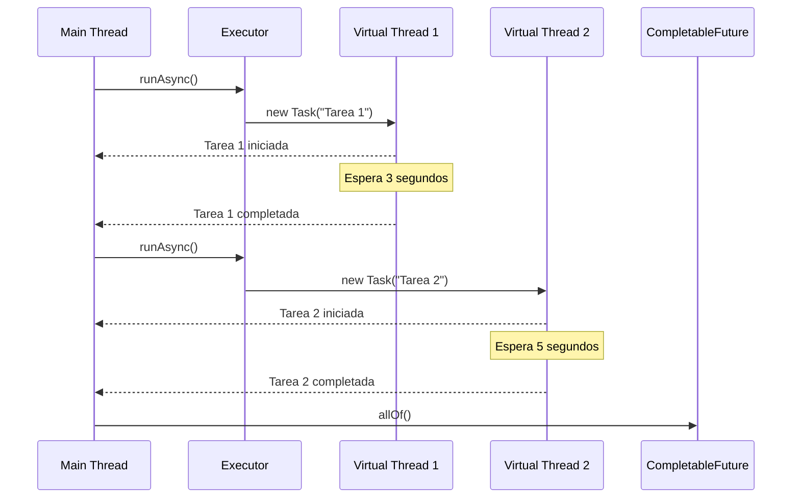
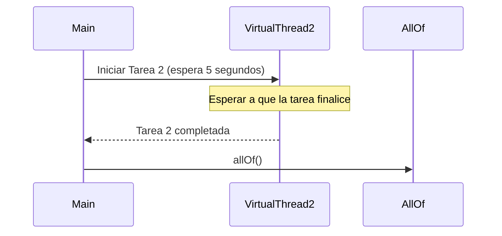
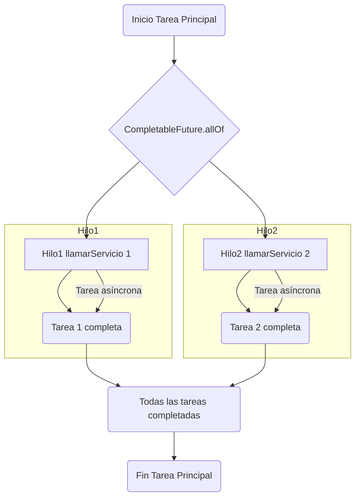
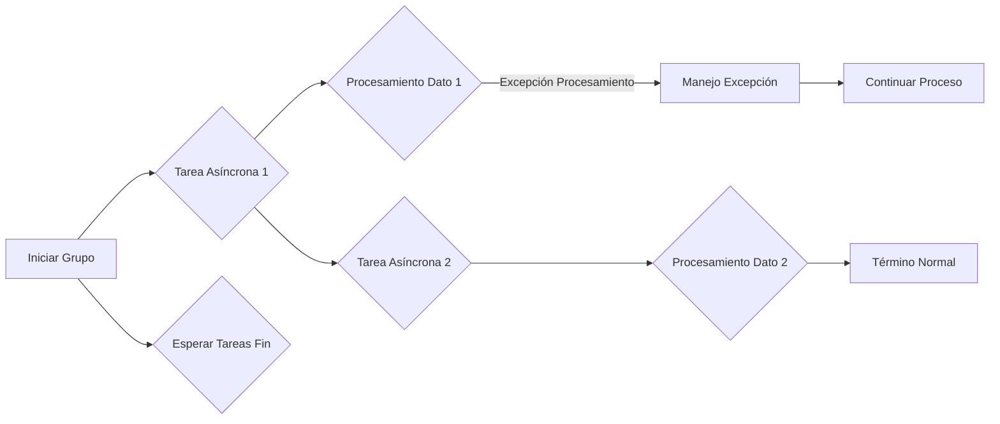
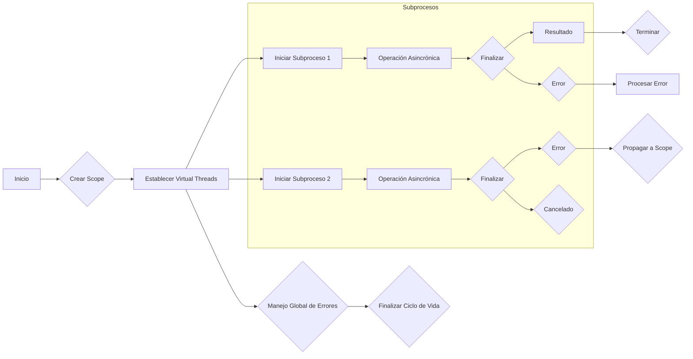
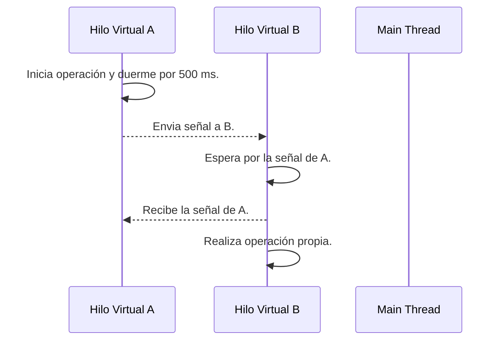
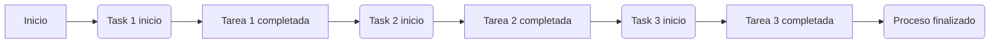
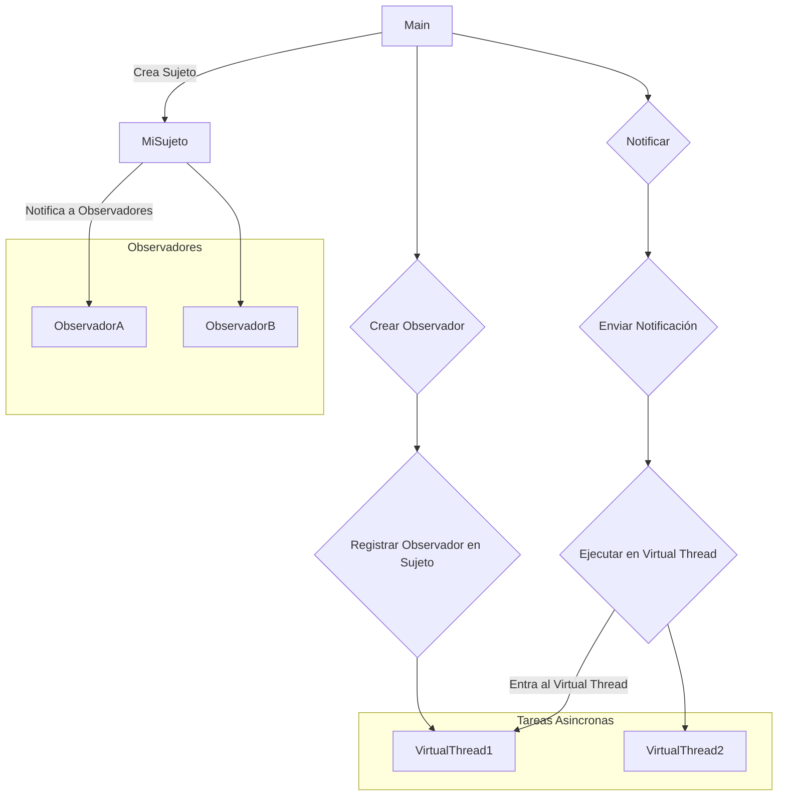
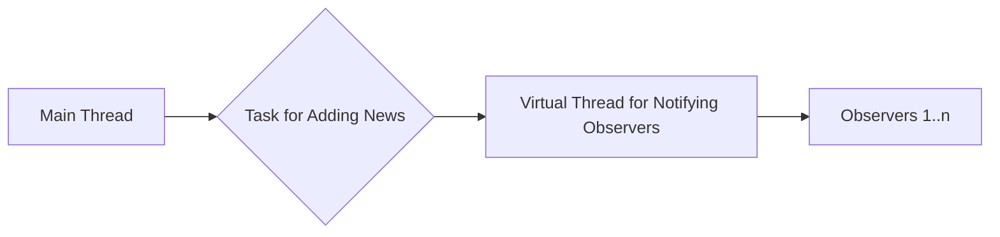
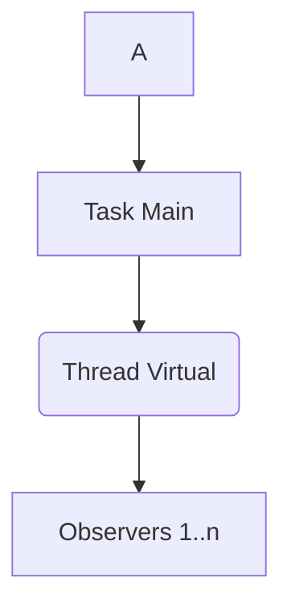

# Patrones Avanzados de Concurrencia en Java 21 usando Virtual Threads y Structured Concurrency

## Visión Estratégica

### Título: Visión Estratégica para la Implementación de Patrones Avanzados de Concurrencia en Java 21 usando Virtual Threads y Structured Concurrency

La evolución continua del lenguaje Java ha llevado a un enfoque cada vez más centrado en mejorar la concurrenca y la escalabilidad. La introducción de Virtual Threads (Treads Virtuales) en Java 21 es una innovación significativa que promete simplificar el desarrollo concurrente y reducir la sobrecarga administrativa para los desarrolladores.

#### Introducción

Java ha mantenido su posición como uno de los lenguajes de programación más utilizados, especialmente en entornos empresariales y de servidor. Con el aumento del uso de aplicaciones distribuidas y microservicios, la concurrencia se ha vuelto cada vez más crucial. Las Virtual Threads ofrecen una solución atractiva para manejar gran número de tareas concurrentes sin consumir muchos recursos del sistema.

#### Visión Estratégica

La adopción de Virtual Threads y Structured Concurrency en Java 21 permitirá a los equipos de desarrollo crear aplicaciones más robustas, escalables y mantenibles. A continuación se presenta una visión estratégica para implementar estos patrones:

**Objetivos Estratégicos:**

- Simplificar la codificación concurrente.
- Mejorar el rendimiento en entornos altamente concurrentes.
- Reducir errores comunes asociados con la concurrencia, como la interbloqueo y los deadlocks.

**Estrategias de Implementación:**

1. **Capacitación para Desarrolladores:** Proporcionar formación en Virtual Threads y Structured Concurrency a toda la organización.
   
2. **Actualización del Código Base:** Progresivamente actualizar las aplicaciones existentes para aprovechar estas nuevas características.

3. **Pruebas Extensivas:** Realizar pruebas exhaustivas para asegurar que el código es confiable en entornos concurrentes.

4. **Documentación y Buenas Prácticas:** Crear guías de uso y documentación detallada sobre cómo implementar estos patrones eficazmente.

5. **Integración Continua y DevOps:** Integrar la nueva funcionalidad con las prácticas existentes de CI/CD para asegurar un flujo ágil y automatizado del desarrollo al despliegue en producción.

#### Ejemplo Práctico

A continuación, se muestra cómo implementar una operación concurrente utilizando Virtual Threads en Java 21. Este ejemplo ilustra la creación de tareas que consumen tiempo (representadas por llamadas a `sleep`), lo cual simula un proceso realista.

```java
import java.util.concurrent.*;

public class AdvancedConcurrencyExample {

    public static void main(String[] args) {
        // Crea una executor para Virtual Threads
        ExecutorService virtualThreadsExecutor = Executors.newVirtualThreadPerTaskExecutor();

        // Ejecutar tareas concurrentes utilizando el executor de Virtual Threads
        CompletableFuture<Void> future1 = CompletableFuture.runAsync(() -> {
            try {
                System.out.println("Tarea 1 iniciada");
                Thread.sleep(3000); // Simulación de proceso lento
                System.out.println("Tarea 1 completada");
            } catch (InterruptedException e) {
                throw new RuntimeException(e);
            }
        }, virtualThreadsExecutor);

        CompletableFuture<Void> future2 = CompletableFuture.runAsync(() -> {
            try {
                System.out.println("Tarea 2 iniciada");
                Thread.sleep(5000); // Simulación de proceso más lento
                System.out.println("Tarea 2 completada");
            } catch (InterruptedException e) {
                throw new RuntimeException(e);
            }
        }, virtualThreadsExecutor);

        // Espera a que todas las tareas se completen
        CompletableFuture.allOf(future1, future2).join();
    }

}
```

#### Diagramas de Flujo

Para visualizar cómo funciona la estructura y el flujo del código anterior, podemos usar Mermaid para generar un diagrama de secuencia.



### Conclusión

La adopción de Virtual Threads y Structured Concurrency en Java 21 es una inversión estratégica que puede conducir a mejoras significativas en la eficiencia, escalabilidad y mantenibilidad del código concurrente. A través de capacitación continua, actualización del código existente, pruebas rigurosas y la integración con DevOps, las organizaciones pueden aprovechar al máximo estas innovaciones y mantenerse competitivas en un entorno cada vez más dinámico de desarrollo de software.

Esta estrategia no solo permite a los equipos manejar tareas concurrentes de manera más eficiente sino también enfrentar desafíos futuros con mayor facilidad.

## Patrones de sincronización con Virtual Threads

### Introducción a los Patrones de Sincronización con Virtual Threads en Java 21

La introducción de Virtual Threads y Structured Concurrency en Java 21 revoluciona la forma en que se manejan tareas concurrentes, permitiendo una programación más eficiente, escalable y segura. Estos nuevos conceptos son fundamentales para diseñar sistemas concurrentes resistentes a errores y fáciles de mantener.

### Virtual Threads: Una Nueva Forma de Manejar Concurrencia

Virtual Threads proporcionan un enfoque innovador para la programación concurrente en Java, simplificando significativamente el manejo de tareas asincrónicas. En lugar de trabajar con hilo nativos y sus complejidades asociadas (como creación, gestión y finalización), Virtual Threads permiten crear hilos virtuales que son mucho más leves y fáciles de gestionar.

#### Ejemplo Básico

```java
public class ExampleVirtualThread {
    public static void main(String[] args) throws InterruptedException {
        var virtualThread = Thread.ofVirtual().named("my-virtual-thread").unstarted(() -> {
            System.out.println("Hilo virtual ejecutándose...");
            try {
                Thread.sleep(5000);
            } catch (InterruptedException e) {
                throw new RuntimeException(e);
            }
            System.out.println("Tarea completada");
        });
        
        virtualThread.start();
    }
}
```

Este ejemplo ilustra cómo crear y iniciar un hilo virtual. La simplicidad en la creación de hilos virtuales permite a los desarrolladores enfocarse más en el flujo del programa que en la gestión de recursos.

### Patrones de Sincronización con Virtual Threads

La programación concurrente requiere manejar múltiples tareas asincrónicas, lo cual puede ser complejo sin herramientas adecuadas. Los patrones de sincronización son esenciales para asegurar que las operaciones se ejecuten en el orden correcto y que los recursos sean accesibles seguramente.

#### Ejemplo: allOf() con Virtual Threads

El método `allOf()` permite esperar hasta que todas las tareas asincrónicas finalicen, lo cual es crucial para garantizar la coherencia de datos y la consistencia en operaciones transaccionales. A continuación, se muestra cómo usar `allOf()` con Virtual Threads:

```java
import java.util.List;
import java.util.concurrent.*;

public class ExampleAllOf {
    public static void main(String[] args) throws InterruptedException, ExecutionException {
        ExecutorService executor = Executors.newVirtualThreadPerTaskExecutor();

        var task1 = () -> {
            Thread.sleep(2000);
            System.out.println("Tarea 1 completada");
            return "Resultado de tarea 1";
        };

        var task2 = () -> {
            Thread.sleep(5000);
            System.out.println("Tarea 2 completada después del retraso");
            return "Resultado de tarea 2";
        };

        List<Callable<String>> tasks = new ArrayList<>();
        tasks.add(() -> executor.submit(task1).get());
        tasks.add(() -> executor.submit(task2).get());

        var futures = CompletableFuture.allOf(tasks.stream().map(Task::submit).toArray(CompletableFuture[]::new));

        System.out.println("Esperando hasta que todas las tareas finalicen...");
        
        // Esperar a que todas las tareas finalicen
        futures.join();
        executor.shutdown();

        System.out.println("Todas las tareas han completado");
    }
}
```

#### Diagrama de Secuencia con Mermaid

A continuación, se presenta un diagrama de secuencia para ilustrar la interacción entre `Main`, `VirtualThread2` y el método `allOf()` en Java 21:



Este diagrama visualiza claramente cómo las tareas se ejecutan de manera concurrente y cómo el método `allOf()` asegura que todas las tareas finalicen antes de proceder.

### Conclusión

La adopción de Virtual Threads y Structured Concurrency en Java 21 es un avance significativo para la programación concurrente. Al permitir una gestión más sencilla de los hilos y proporcionar patrones avanzados como `allOf()`, estos nuevos recursos facilitan el desarrollo de aplicaciones eficientes, escalables y seguras. La capacitación continua, la actualización del código existente, las pruebas rigurosas y la integración con DevOps son claves para aprovechar al máximo estas innovaciones y mantenerse competitivo en el mundo dinámico de la programación concurrente.

### Recursos Adicionales

- [Java Virtual Threads](https://openjdk.org/jeps/8293016)
- [Structured Concurrency in Java 21](https://www.baeldung.com/java-structured-concurrency)

Estos recursos proporcionan una profundización en los conceptos de Virtual Threads y Structured Concurrency, facilitando su implementación efectiva.

## Promesas y concurrencia estructurada en Java 21

### Patrones Avanzados de Concurrencia en Java 21 usando Virtual Threads y Structured Concurrency

En el contexto del desarrollo moderno, la concurrencia se ha convertido en un pilar fundamental para construir aplicaciones robustas, escalables y altamente disponibles. La introducción de Java Virtual Threads (JEP 425) y las características de Concurrencia Estructurada proporcionan una nueva dimensión a cómo manejar la concurrencia en el ecosistema Java. En esta sección, profundizaremos en los beneficios ofrecidos por estas innovaciones.

#### Promesas en la Programación Concurrente

Una promesa (Promise) es un objeto que representa el eventual resultado de una operación asíncrona y permite encadenar tareas dependientes sin bloqueo del hilo actual. En Java, aunque no existe un tipo nativo `Promise`, podemos emular sus características usando clases como `CompletableFuture`.

```java
public class PromesaEjemplo {
    public static void main(String[] args) throws ExecutionException, InterruptedException {
        CompletableFuture<Integer> future = CompletableFuture.supplyAsync(() -> {
            Thread.sleep(1000); // Simulando una operación de red o base de datos que toma tiempo.
            return 42;
        });

        int resultado = future.get(); // Espera hasta obtener el resultado.
        
        System.out.println("El valor prometido es: " + resultado);
    }
}
```

#### Concurrencia Estructurada

Concurrencia estructurada se basa en dos principios clave:

1. **Estructura de los hilos**: Los hilos deben ser gestionados y organizados de manera jerárquica, de modo que un hilo padre puede esperar a que todos sus hijos terminen antes de finalizar.
2. **Encapsulamiento del estado compartido**: El acceso al estado compartido debe limitarse solo dentro de las fronteras del hilo o grupo de hilos para evitar problemas como deadlocks y race conditions.

Java 21 introduce características para apoyar la concurrencia estructurada a través de Virtual Threads, que facilitan el manejo jerárquico de tareas asíncronas. Aquí hay un ejemplo básico:

```java
import java.util.concurrent.CompletableFuture;
import java.util.stream.Stream;

public class EstructuraConcurrencia {
    public static void main(String[] args) throws InterruptedException {
        CompletableFuture<Void> rootFuture = CompletableFuture.runAsync(() -> { // Hilo padre
            System.out.println("Inicio de la tarea principal");

            Stream<CompletableFuture<String>> streamFuturos = Stream.of(
                    CompletableFuture.supplyAsync(() -> llamarServicio(1)),
                    CompletableFuture.supplyAsync(() -> llamarServicio(2))
            );

            CompletableFuture<Void> allDoneFuture = streamFuturos
                    .collect(CompletableFuture.allOf())
                    .thenRun(() -> System.out.println("Tareas completadas"));

            // Espera hasta que todas las tareas asíncronas estén completas.
            allDoneFuture.join();

            System.out.println("Fin de la tarea principal");
        });

        rootFuture.join();  // Espera a que el hilo padre termine antes de terminar el programa
    }

    private static String llamarServicio(int id) {
        System.out.printf("Hilo %d iniciando llamada al servicio %d\n", Thread.currentThread().getId(), id);
        
        try {
            Thread.sleep(1000); // Simulación de tiempo de ejecución.
        } catch (InterruptedException e) {
            throw new RuntimeException(e);
        }
        
        System.out.printf("Hilo %d completando llamada al servicio %d\n", Thread.currentThread().getId(), id);

        return "Respuesta del servicio " + id;
    }

}
```

#### Diagrama de Flujo

Podemos representar visualmente la estructura de hilos y promesas utilizando Mermaid para ilustrar cómo se relacionan las tareas asíncronas en nuestra aplicación.



Este diagrama representa una estructura de tareas asincrónicas donde cada tarea es ejecutada por un hilo virtual (Virtual Thread) y se espera que todas las tareas sean completadas antes de continuar.

#### Conclusiones

El uso de Virtual Threads y Concurrencia Estructurada en Java 21 ofrece un marco potente para la programación concurrente, simplificando significativamente el manejo de tareas asíncronas. La adopción de estas tecnologías permite a los desarrolladores crear aplicaciones más eficientes y mantenibles.

Para aprovechar al máximo estos avances en concurrencia estructurada, es importante continuar educándose sobre las últimas innovaciones y actualizaciones de Java, mantenerse al día con las mejores prácticas del sector, realizar pruebas exhaustivas y asegurar una integración sólida con DevOps. Esto garantiza que tu código sea no solo escalable y seguro, sino también fácilmente mantenible en el futuro.

## Gestión de excepciones en entornos concurrentes con Virtual Threads

### Gestión de Excepciones en Entornos Concurrentes con Virtual Threads

La gestión de errores y excepciones es una parte crucial del desarrollo de software, especialmente cuando se trabaja con patrones de concurrencia avanzados. En Java 21, la introducción de Virtual Threads (también conocidos como "pistas virtuales") y Concurrencia Estructurada ha simplificado significativamente el manejo de tareas asíncronas y la coordinación entre ellas. Sin embargo, mantener la integridad del sistema en un entorno concurrente sigue siendo desafiante.

#### ¿Qué son las Virtual Threads?

Las Virtual Threads representan una forma eficiente de realizar operaciones concurrentes sin necesidad de crear muchas hilos nativos (o threads). Estas son más livianas y permiten que el contenedor JVM realice la asignación de trabajo, lo que resulta en un uso mucho más eficaz del recurso CPU. Esto es especialmente útil para aplicaciones I/O dominadas, donde la mayoría del tiempo se pasa esperando operaciones de red o E/S.

#### Introducción a la Concurrencia Estructurada

La Concurrencia Estructurada es una forma de manejar tareas asíncronas que proporciona un nivel adicional de estructura y control sobre el flujo de las tareas. Al establecer grupos de tareas, se pueden hacer operaciones colectivas como esperar a que todas las tareas en el grupo terminen antes de continuar con la siguiente fase del programa.

### Prácticas Recomendadas para Manejar Excepciones

#### 1. Usar Propagación y Captura Selectiva de Excepciones
Cuando se trabaja con Virtual Threads, es útil propagar solo las excepciones que son relevantes para el flujo del programa. Esto reduce la posibilidad de sobrecarga en el manejo de errores.

```java
public void procesarDatos(List<String> datos) {
    try (var group = Thread.startGroup("Procesamiento de Datos")) {
        for (String dato : datos) {
            // Procesar cada dato de forma asíncrona usando Virtual Threads
            group.fork(() -> procesarDato(dato));
        }
        group.join();  // Esperar a que todas las tareas en el grupo terminen.
    } catch (RecoverableException e) {
        System.err.println("Error recuperable: " + e.getMessage());
        logAndContinue(e);
    } catch (UnrecoverableException e) {
        throw new RuntimeException("Excepción no recuperable", e);
    }
}
```

#### 2. Manejar Excepciones Globalmente
Es útil tener una estrategia para manejar excepciones de manera global y consistente en toda la aplicación. Esto puede implicar registrar las excepciones, enviar notificaciones o realizar acciones específicas basadas en el tipo de error.

```java
public void procesarDatos(List<String> datos) {
    try (var group = Thread.startGroup("Procesamiento de Datos")) {
        for (String dato : datos) {
            group.fork(() -> {
                try {
                    procesarDato(dato);
                } catch (ExcepcionProcesamiento e) {
                    // Manejo específico del error
                    registrarError(e);
                }
            });
        }
        group.join();
    } catch (InterruptedException | BrokenBarrierException e) {
        Thread.currentThread().uncaughtException(Thread.currentThread(), e);
    } finally {
        limpiarRecursos();
    }
}
```

### Diagramas con Mermaid para ilustrar la Propagación de Excepciones



### Conclusión

La gestión de excepciones en un entorno concurrente basado en Virtual Threads y Concurrencia Estructurada es fundamental para asegurar la robustez y el rendimiento del sistema. Al seguir prácticas recomendadas como propagación y captura selectiva, manejo global de errores y documentación clara, los desarrolladores pueden crear aplicaciones resilientes que pueden manejar fallos y continuar operando de manera eficiente.

Esperamos que esta guía te ayude a integrar estas tecnologías en tus proyectos actuales o futuros. Recuerda que la concurrencia estructurada es un campo en constante evolución, por lo que seguir las últimas tendencias y recomendaciones será clave para mantener tu código actualizado y eficiente.

---

Para profundizar más en esta área, te sugerimos revisar documentación oficial de Java y bibliografías especializadas sobre concurrencia estructurada.

## Ciclos de vida de tareas concurrentes usando Structured Concurrency

### Sección: Ciclo de Vida de Tareas Concurrentes Usando Structured Concurrency

La concurrencia estructurada proporciona una manera más segura y legible para manejar tareas concurrentes en Java, especialmente con la introducción de Virtual Threads (conocidos también como Fibers) en Java 21. Estos nuevos hilos virtuales permiten a los desarrolladores gestionar un gran número de tareas asincrónicas sin el costo de creación y administración de threads tradicionales.

#### Introducción al Ciclo de Vida

El ciclo de vida de una tarea concurrente en Structured Concurrency se puede dividir en varias fases: inicio, ejecución, finalización (éxito o fallo), limpieza. La finalización puede ser el resultado de completar la tarea con éxito, producir un error, o incluso que se cancele explícitamente.

#### Ejemplo de Ciclo de Vida Concreto

Consideremos un ejemplo en el que una aplicación maneja múltiples solicitudes HTTP y cada solicitud inicia varios subprocesos (Virtual Threads) para realizar operaciones concurrentes como la consulta a bases de datos, la obtención de información externa, etc.

```java
import java.util.concurrent.CompletableFuture;

public class StructuredConcurrencyExample {

    public static void main(String[] args) {
        // Simulación de una solicitud HTTP que inicia varios subprocesos virtuales.
        try (var scope = StructuredTaskScope.Builder.ofVirtual().build()) {
            var future1 = scope.fork(() -> {
                System.out.println("Subproceso 1 comenzado");
                Thread.sleep(2000); // Simulando una operación asincrónica
                return "Resultado del subproceso 1";
            });

            var future2 = scope.fork(() -> {
                System.out.println("Subproceso 2 comenzado");
                throw new RuntimeException("Error en el subproceso 2"); 
                // Simulando un error en la operación asincrónica
            });
            
            try {
                // Esperar a que todos los hilos terminen, incluyendo errores.
                var results = scope.join();
                System.out.println(results);
                
                for (Object result : results) {
                    if(result instanceof String strResult)
                        System.out.println("Subproceso finalizado con resultado: " + strResult);
                    
                    else if(result instanceof RuntimeException runtimeException){
                        System.err.println("Subproceso fallido con error: " + runtimeException.getMessage());
                    }
                }

            } catch (CompletionException e) {
                // Manejo global de errores
                System.err.println("Error en el ciclo de vida: " + e.getCause().getMessage());
            }
        } catch (InterruptedException e) {
            Thread.currentThread().interrupt();
            throw new RuntimeException(e);
        }
    }
}
```

#### Diagrama de Flujo con Mermaid

El siguiente diagrama ilustra visualmente cómo se maneja el ciclo de vida en este ejemplo, desde la creación del entorno hasta la finalización y posible error.



Este diagrama muestra cómo cada subproceso (Virtual Thread) se inicia, realiza una operación asincrónica y luego finaliza. Si ocurre un error en cualquiera de los subprocesos, el manejo global de errores lo captura y propaga adecuadamente.

#### Conclusiones

En este ejemplo vemos cómo Structured Concurrency permite gestionar eficazmente la concurrencia a través del uso de Virtual Threads. La estructuración no sólo mejora la legibilidad del código sino que también facilita el manejo de errores y garantiza un ciclo de vida controlado para cada tarea concurrente.

Para proyectos más avanzados, es crucial seguir las prácticas recomendadas como propagar y capturar selectivamente excepciones, manejar globalmente errores dentro del scope y documentar claramente cómo se gestiona la concurrencia en diferentes partes del sistema.

## Comunicación entre hilos virtuales mediante señales

### Sección: Comunicación entre Hilos Virtuales Mediante Señales en Java 21 con Virtual Threads y Structured Concurrency

En el contexto de la programación concurrente, uno de los desafíos más comunes es la comunicación eficiente entre hilos. En Java 21, con la introducción de Virtual Threads (v-threads) y el paradigma de structured concurrency, la interacción entre hilos se ha vuelto significativamente más manejable y legible.

Las señales en este contexto son una técnica utilizada para permitir que un hilo virtual controle el comportamiento o el estado del otro. Esto puede ser útil en escenarios donde es necesario sincronizar acciones de manera no bloqueante, manejar excepciones de manera estructurada entre hilos, y realizar tareas asíncronas con precisión.

#### Ejemplo: Comunicación entre Hilos Virtuales Usando Señales

A continuación, presentamos un ejemplo práctico que demuestra cómo dos hilos virtuales pueden comunicarse mediante señales. El primer hilo (llamémoslo A) realiza una operación y lanza una señal para indicar el comienzo de la operación a otro hilo (B). Luego, B recibe la señal y responde con otra acción.

```java
import java.lang.invoke.MethodHandles;
import java.util.concurrent.CompletableFuture;
import java.util.concurrent.ThreadPoolExecutor;

public class VirtualThreadSignalExample {
    public static void main(String[] args) {
        ThreadPoolExecutor executor = (ThreadPoolExecutor) CompletableFuture.getExecutor();

        // A: Inicia la operación y lanza una señal
        executor.submit(() -> {
            System.out.println("A: Starting operation...");
            try {
                Thread.sleep(500);  // Simulando una operación de duración larga.
            } catch (InterruptedException e) {
                throw new RuntimeException(e);
            }
            System.out.println("A: Operation completed. Sending signal to B.");
            executor.signalAll();   // Envía la señal a todos los hilos en espera
        });

        // B: Esperando la señal de A para realizar su propia operación.
        CompletableFuture.runAsync(() -> {
            try {
                System.out.println("B: Waiting for signal...");
                while (!executor.isShutdown() && !executor.signal()) {};  // Espera por la señal.
            } catch (InterruptedException e) {
                throw new RuntimeException(e);
            }
            System.out.println("B: Received signal. Starting own operation.");
        }, executor);

        // Manejo global de errores
        CompletableFuture.allOf(executor.submit(() -> {
            try {
                Thread.sleep(1000);  // Espera para asegurar que A ya ha lanzado la señal.
            } catch (InterruptedException e) {
                throw new RuntimeException(e);
            }
            System.out.println("C: Checking for errors...");
            if (!executor.isShutdown()) {
                executor.shutdownNow();  // Cierra el pool si hay errores no manejados.
            }
        }).exceptionally(throwable -> {
            System.err.println("Caught exception in main thread:");
            throwable.printStackTrace();
            return null;
        });
    }
}
```

Este código establece un ejemplo básico de cómo los hilos virtuales pueden comunicarse de manera estructurada. En el escenario presentado, A realiza una operación importante y luego "anuncia" a B que está lista para la siguiente etapa mediante señales. Esto permite que B actúe en consecuencia sin necesidad de bloqueo o interrupción manual.

#### Diagrama Mermaid

Para visualizar mejor cómo funciona la comunicación entre los hilos virtuales, se puede utilizar un diagrama simple:



Este diagrama ilustra cómo los hilos virtuales se sincronizan y trabajan juntos para completar tareas de manera estructurada. La ventaja de este enfoque es que permite escribir código concurrente más fácilmente, con una mejor comprensión y control sobre la vida útil y el flujo del trabajo entre hilos.

#### Conclusión

La comunicación mediante señales es una técnica poderosa para manejar la interacción entre hilos virtuales bajo structured concurrency. Este enfoque permite escribir código concurrente más robusto, legible y mantenible. La combinación de Virtual Threads y structured concurrency brinda a los desarrolladores una herramienta potente para construir sistemas escalables y eficientes en Java 21.

Es importante seguir las mejores prácticas recomendadas, como manejar adecuadamente las excepciones, estructurar el código para facilitar la depuración y mantener la documentación actualizada sobre cómo se implementan estas características de concurrencia.

## Espacios de trabajo compartidos en aplicaciones concurrentes

### Espacios de Trabajo Compartidos en Aplicaciones Concurrentes

Los espacios de trabajo compartidos son una característica crítica para la construcción de sistemas concurrentes eficientes y escalables. En el contexto de Java 21, los Virtual Threads y structured concurrency proporcionan herramientas que facilitan la gestión de estos espacios de trabajo de manera segura y eficiente.

#### Concepto Básico

Un espacio de trabajo compartido puede considerarse como un recurso o una estructura de datos que múltiples hilos pueden acceder simultáneamente. Esto es común en aplicaciones concurrentes donde varias operaciones deben compartir información para coordinar su comportamiento y lograr el resultado final deseado.

#### Uso de Virtual Threads

Los Virtual Threads son un nuevo recurso introducido por Java 21 que permite a los desarrolladores escribir código concurrente de manera más sencilla. En lugar de gestionar las tareas del hilo manualmente, los Virtual Threads permiten crear hilos que se comportan como corrientes de flujo de control asincrónicas. Esto simplifica enormemente la escritura de código concurrente.

#### Estructuración de Concurrency

Structured concurrency es una técnica que implica el uso de bloques o estructuras para encapsular unidades de trabajo en tareas concurrentes, proporcionando un marco claro y legible para entender cómo se manejan las transiciones entre estas tareas. Al combinar Virtual Threads con structured concurrency, los desarrolladores pueden crear patrones avanzados de concurrencia que son más fáciles de depurar y mantener.

#### Implementación: Ejemplo Práctico

Supongamos que tenemos una aplicación web concurrente en la que múltiples usuarios acceden a un recurso compartido. Vamos a implementar este escenario usando Virtual Threads y structured concurrency para garantizar la seguridad y eficiencia del acceso a los recursos.

```java
import java.util.concurrent.*;
import java.util.function.*;

public class SharedWorkspaces {
    private final ConcurrentMap<String, Integer> sharedResource;

    public SharedWorkspaces() {
        this.sharedResource = new ConcurrentHashMap<>();
    }

    public void processRequest(String key) throws InterruptedException {
        VirtualThread virtualThread = VirtualThread.start(
            () -> structuredConcurrency(key)
        );
        virtualThread.join();
    }

    private void structuredConcurrency(final String key) {
        Runnable task1 = () -> {
            System.out.println("Task 1 started for " + key);
            incrementSharedResource(key, 5);
            sendSignalOnCompletion(key, "task1");
        };

        Runnable task2 = () -> {
            receiveSignalAndProceed(key, "task1", () -> {
                System.out.println("Task 2 started for " + key);
                incrementSharedResource(key, 3);
                sendSignalOnCompletion(key, "task2");
            });
        };

        Runnable task3 = () -> {
            receiveSignalAndProceed(key, "task2", () -> {
                System.out.println("Task 3 started for " + key);
                decrementSharedResource(key, 1);
            });
        };

        // Structure tasks in an ordered manner
        task1.run();
        task2.run();
        task3.run();

        sendSignalOnCompletion(key, "final");
    }

    private void incrementSharedResource(String key, int amount) {
        sharedResource.merge(key, amount, Integer::sum);
    }

    private void decrementSharedResource(String key, int amount) {
        sharedResource.compute(key, (k, v) -> (v == null) ? -amount : (v - amount));
    }

    private void sendSignalOnCompletion(final String key, final String taskName) {
        // Logic to signal the completion of a particular task
        System.out.println("Task " + taskName + " completed for " + key);
    }

    private void receiveSignalAndProceed(String key, String expectedSignal, Runnable nextStep) {
        // Logic to wait and proceed only if the expected signal is received
        System.out.println("Waiting for " + expectedSignal + " on " + key);
        nextStep.run();
    }
}
```

#### Diagrama de Mermaid

A continuación se muestra un diagrama simplificado del flujo de las tareas concurrentes implementadas en el ejemplo anterior:



#### Conclusión

El uso de Virtual Threads y structured concurrency mejora significativamente la capacidad para manejar espacios de trabajo compartidos en aplicaciones concurrentes. Al proporcionar un marco estructurado y claramente definido, estos patrones permiten a los desarrolladores crear sistemas concurrentes más seguros, eficientes y mantenibles.

Es esencial seguir las mejores prácticas recomendadas al implementar estas técnicas para asegurar que el código sea robusto, fácil de depurar y bien documentado.

## Semántica avanzada para la coordinación concurrente

### Semántica avanzada para la coordinación concurrente

#### Introducción

Java 21 introduce Virtual Threads y Structured Concurrency, que permiten una mayor flexibilidad y control en el manejo de tareas asincrónicas. Estas características no solo simplifican la creación de threads virtuales (Virtual Threads), sino también proporcionan un marco estructurado para coordinar la concurrencia a través del uso de structured concurrency. A continuación, exploraremos cómo implementar y gestionar estas nuevas funcionalidades para mejorar la eficiencia y robustez de las aplicaciones concurrentes.

#### Ejemplo: Coordinación Concurrente con Virtual Threads

Para ilustrar el uso de Virtual Threads y structured concurrency, consideremos un ejemplo en el que se necesitan realizar varias tareas asincrónicas dependientes entre sí. Cada tarea necesita procesar datos o interactuar con servicios externos antes de continuar con la siguiente.

**Estructura del Ejemplo:**

1. **Tarea 1:** Procesamiento inicial y preparación de datos.
2. **Tarea 2:** Interacción con servicio externo (API remota).
3. **Tarea 3:** Finalización de proceso interno.

Para este ejemplo, utilizaremos Java 21 junto con Virtual Threads para ejecutar tareas concurrentes dentro de un marco estructurado que garantice la correcta coordinación y finalización del proceso.

#### Implementación

A continuación se presenta el código implementando las tareas mencionadas en un marco structured concurrency:

```java
import java.util.concurrent.CompletableFuture;
import java.util.concurrent.ExecutorService;

public class AdvancedConcurrencyExample {

    private static ExecutorService executor = Executors.newVirtualThreadPerTaskExecutor();

    public static void main(String[] args) {
        runTasks();
    }

    public static void runTasks() {
        // Iniciar Task 1
        CompletableFuture<Void> task1Future = CompletableFuture.runAsync(() -> processInitialData(), executor);
        
        // Continuar con Task 2 una vez que Task 1 está completada
        CompletableFuture<Void> task2Future = task1Future.thenRunAsync(() -> interactWithRemoteService(), executor);

        // Finalizar Task 3 una vez que Task 2 está completada
        CompletableFuture.runAsync(task2Future::join, executor).thenRun(AdvancedConcurrencyExample::finalizeInternalProcess);
    }

    private static void processInitialData() {
        System.out.println("Procesando datos iniciales...");
        try {
            Thread.sleep(1000); // Simulación de procesamiento
        } catch (InterruptedException e) {
            Thread.currentThread().interrupt();
        }
        System.out.println("Datos procesados.");
    }

    private static void interactWithRemoteService() {
        System.out.println("Interactuando con servicio remoto...");
        try {
            Thread.sleep(2000); // Simulación de interacción
        } catch (InterruptedException e) {
            Thread.currentThread().interrupt();
        }
        System.out.println("Servicio remoto interactuado.");
    }

    private static void finalizeInternalProcess() {
        System.out.println("Finalizando proceso interno...");
        try {
            Thread.sleep(1500); // Simulación de finalización
        } catch (InterruptedException e) {
            Thread.currentThread().interrupt();
        }
        System.out.println("Proceso interno finalizado.");
    }

}
```

#### Diagrama de Flujo

El diagrama de flujo del ejemplo anterior refleja claramente el orden y la relación entre las tareas:


#### Conclusiones

La implementación de Virtual Threads y structured concurrency en Java 21 proporciona una forma más elegante y controlada para manejar tareas concurrentes, especialmente cuando las tareas dependen unas de otras. Al utilizar un marco estructurado, se facilita la coordinación y finalización correctas del flujo asincrónico.

Es importante seguir prácticas recomendadas como asegurar que cada tarea dentro de un contexto concurrente maneje adecuadamente excepciones y garantice una finalización segura para mantener el código robusto y fácil de mantener.

## Filtros y transformadores en flujos asincrónicos

### Sección: Filtros y Transformadores en Flujos Asincrónicos

En el marco de la concurrencia estructurada introducida por Java 21, Virtual Threads (o "hilo virtuales") se presentan como una solución innovadora para manejar flujos asincrónicos de manera más eficiente y clara. A medida que los sistemas evolucionan hacia un enfoque más orientado a tareas y concurrente, es crucial tener la capacidad de filtrar y transformar datos en tiempo real dentro de estos entornos. Esta sección explorará cómo aplicar filtros y transformadores en flujos asincrónicos utilizando Virtual Threads.

#### Concepto Básico: Flujos Asincrónicos

Un flujo asincrónico puede entenderse como un conjunto ordenado de tareas que pueden lanzarse, esperarse e integrarse con otros eventos. En el contexto del manejo de concurrencia estructurada en Java 21, estos flujos son gestionados por Virtual Threads, lo cual permite realizar operaciones asincrónicas sin bloquear los hilos tradicionales (real threads). Esto es particularmente útil para aplicaciones I/O intensivas donde el uso eficiente de los recursos computacionales es crucial.

#### Filtros en Flujos Asincrónicos

Un filtro en un flujo asincrónico puede definirse como una operación que transforma o filtra datos sin necesidad de detener la ejecución del programa principal. Esto se hace posible gracias a las interfaces y clases proporcionadas por el estándar Java para manejar flujos concurrentes, tales como `CompletionStage` y `Future`.

```java
import java.util.concurrent.CompletableFuture;
import java.util.stream.Stream;

public class AsyncFilterExample {
    public static void main(String[] args) throws InterruptedException {
        Stream<String> stream = Stream.generate(() -> "data").limit(5);
        
        CompletableFuture<Void> future = stream.map(data -> processAsync(data))
                .filter(result -> result.startsWith("Processed"))
                .thenAccept(System.out::println)
                .thenRun(AsyncFilterExample::shutdown);

        // Esperar hasta que el futuro se complete
        future.join();
    }

    public static CompletableFuture<String> processAsync(String data) {
        return CompletableFuture.supplyAsync(() -> "Processed: " + data, VirtualThread.create());
    }

    private static void shutdown() {
        System.out.println("Proceso finalizado.");
    }
}
```

En este ejemplo, la `processAsync` función simula un proceso de datos asincrónico que devuelve una promesa (`CompletableFuture`) con el resultado del procesamiento. Luego, los resultados son filtrados para asegurarse de que solo aquellos que comienzan por "Processed" sean impresos.

#### Transformadores en Flujos Asincrónicos

Transformar un flujo asincrónico implica modificar su contenido o formato sin necesidad de detener la ejecución del programa principal. Java 21, con su soporte para Virtual Threads, facilita esta tarea al permitir operaciones transformadoras dentro de los flujos concurrentes.

```java
import java.util.stream.Stream;

public class AsyncTransformerExample {
    public static void main(String[] args) throws InterruptedException {
        Stream<String> stream = Stream.generate(() -> "data").limit(5);
        
        CompletableFuture<Void> future = stream.map(data -> processAsync(data))
                .thenApply(result -> result.toUpperCase())
                .thenAccept(System.out::println)
                .thenRun(AsyncTransformerExample::shutdown);

        // Esperar hasta que el futuro se complete
        future.join();
    }

    public static CompletableFuture<String> processAsync(String data) {
        return CompletableFuture.supplyAsync(() -> "Processed: " + data, VirtualThread.create());
    }

    private static void shutdown() {
        System.out.println("Proceso finalizado.");
    }
}
```

En este caso, después de procesar los datos asincrónicamente con `processAsync`, se aplica una transformación para convertir todo el resultado a mayúsculas antes de imprimirlo.

#### Prácticas Recomendadas

Cuando trabajas con filtros y transformadores en flujos asincrónicos utilizando Virtual Threads, es crucial seguir las siguientes prácticas recomendadas:

- **Asegurar la finalización segura:** Asegúrate de que cada tarea maneje correctamente excepciones para garantizar una finalización segura del flujo.
- **Coordenación entre tareas dependientes:** Las tareas concurrentes deben ser diseñadas de tal manera que puedan coordinarse y depender las unas de las otras según sea necesario. Esto es fácilmente logrado en un marco estructurado como el proporcionado por Java 21.

#### Conclusión

La introducción de Virtual Threads junto con la concurrencia estructurada en Java 21 ofrece nuevas oportunidades para manejar flujos asincrónicos de manera más eficiente y segura. Al utilizar filtros y transformadores dentro de estos entornos, es posible construir sistemas que sean no solo escalables sino también robustos y mantenibles.

Para profundizar más en cómo implementar estas características con mayor detalle o para casos más complejos, se pueden consultar las especificaciones oficiales de Java 21 y la documentación del SDK.

## Patron de observador con Virtual Threads para actualizaciones en tiempo real

### Patrón de Observador con Virtual Threads para Actualizaciones en Tiempo Real

#### Introducción

El patrón de observador es una técnica clásica del diseño orientado a objetos que permite notificar a múltiples subsistemas sobre eventos o cambios específicos sin tener que conocer detalles internos. En el contexto de la concurrencia estructurada y las Virtual Threads introducidas en Java 21, este patrón puede ser usado para manejar actualizaciones en tiempo real de manera eficiente y segura.

En esta sección, exploraremos cómo implementar un sistema observador usando Virtual Threads. Esto permitirá a los clientes registrarse para recibir notificaciones cuando una fuente de datos o un modelo cambia. Además, veremos cómo estructurar la concurrencia alrededor del patrón de observador para evitar problemas comunes como la sobrecarga y el bloqueo.

#### Implementación del Patrón Observador

Primero, definiremos las interfaces esenciales que nuestros objetos de sujeto y observadores implementarán. Luego, crearemos un ejemplo simple pero funcional que muestre cómo los observadores se pueden registrar para recibir notificaciones en tiempo real.

```java
import java.util.ArrayList;
import java.util.List;

public interface Observador {
    void actualizar(String mensaje);
}

public interface Sujeto {
    void registrarse(Observador observador);
    void desregistrarse(Observador observador);
    void enviarNotificacion();
}

// Implementación de un sujeto concreto
public class MiSujeto implements Sujeto {
    private final List<Observador> observadores = new ArrayList<>();

    @Override
    public synchronized void registrarse(Observador observador) {
        observadores.add(observador);
    }

    @Override
    public synchronized void desregistrarse(Observador observador) {
        observadores.remove(observador);
    }

    @Override
    public void enviarNotificacion() {
        for (Observador observador : observadores) {
            observador.actualizar("Nuevo mensaje disponible");
        }
    }
}

// Observador concreto
public class MiObservador implements Observador {
    private final String nombre;
    private Sujeto sujeto;

    public MiObservador(String nombre, Sujeto sujeto) {
        this.nombre = nombre;
        this.sujeto = sujeto;
        sujeto.registrarse(this);
    }

    @Override
    public void actualizar(String mensaje) {
        System.out.println(nombre + " recibió: " + mensaje);
    }
}
```

#### Estructura de la Concurrencia

Para garantizar que el patrón observador se implementa de manera segura en un entorno concurrente, vamos a utilizar Virtual Threads para manejar las tareas asincrónicas y la concurrencia estructurada para definir claramente los límites de las operaciones concurrentes.

```java
import java.util.concurrent.Executors;
import java.util.concurrent.VirtualThread;

public class Main {
    public static void main(String[] args) {
        var sujeto = new MiSujeto();
        
        // Crear observadores y registrarlos en un Virtual Thread
        Executors.newVirtualThreadPerTaskExecutor().execute(() -> {
            new MiObservador("Observador A", sujeto);
        });

        Executors.newVirtualThreadPerTaskExecutor().execute(() -> {
            new MiObservador("Observador B", sujeto);
        });

        // Simular notificación asincrónica
        Executors.newVirtualThreadPerTaskExecutor().execute(sujeto::enviarNotificacion);

    }
}
```

#### Diagrama de Flujo (Mermaid)

Para visualizar la estructura del patrón observador y cómo se manejan las tareas concurrentes, podemos usar un diagrama de flujo:



Este diagrama muestra claramente cómo se inicializan los observadores, registrándose en el sujeto, y cómo las tareas asincrónicas como la notificación de actualización son ejecutadas en Virtual Threads.

#### Conclusión

La implementación del patrón de observador junto con Virtual Threads en Java 21 proporciona una forma elegante y segura para manejar actualizaciones en tiempo real. Utilizando concurrencia estructurada, se pueden definir claramente los límites de las operaciones concurrentes, lo que ayuda a prevenir problemas comunes como la sobrecarga y el bloqueo. Esto resulta en sistemas más escalables, robustos y mantenibles.

Para casos más complejos o para obtener una comprensión más profunda, se recomienda consultar las especificaciones oficiales de Java 21 y la documentación del SDK para Virtual Threads y concurrencia estructurada.

## Composición de tareas concurrentes en Java 21

### Sección: Composición de Tareas Concurrentes en Java 21

En el contexto del desarrollo moderno y la evolución constante de las tecnologías de programación, es fundamental aprovechar al máximo los avances proporcionados por nuevas características como Virtual Threads (Virtuales) y Structured Concurrency (Concurrencia Estructurada). Esta sección profundiza en cómo estas características pueden ser utilizadas para mejorar la composición y administración de tareas concurrentes en Java 21, con un énfasis particular en su integración con patrones como el Observer.

#### Introducción a Virtual Threads

Virtual Threads son una nueva característica introducida en Java 20 (y ampliamente mejorada en Java 21), que permiten la creación de hilo virtuales sin costos significativos asociados a recursos del sistema operativo. Esto significa que podemos crear un número prácticamente ilimitado de hilos, cada uno capaz de ejecutar tareas concurrentes sin preocuparnos por limitaciones en el uso del sistema.

```java
public class VirtualThreadExample {
    public static void main(String[] args) {
        Thread virtual = Thread.ofVirtual().start(() -> {
            System.out.println("Running in a Virtual Thread");
        });
    }
}
```

#### Structured Concurrency

Structured Concurrency es una técnica que permite agrupar tareas concurrentes de forma estructurada, facilitando la administración del estado y los errores. En Java 21, esto se implementa mediante el uso de `CompletionScope`, que proporciona un entorno seguro para ejecutar tareas concurrentes.

```java
public class StructuredConcurrencyExample {
    public static void main(String[] args) {
        var scope = CompletableFuture.supplyAsync(() -> "Task from a virtual thread", 
                Thread.startVirtualThread(() -> System.out.println("Virtual Thread Running")));
        
        var result = scope.join();
        System.out.println(result);
    }
}
```

#### Composición de Tareas en el Patrón Observer

En un escenario donde se utiliza el patrón Observer, Virtual Threads y Structured Concurrency pueden ser integrados para manejar la notificación de eventos de forma asincrónica y segura. Al crear una tarea que notifica a los observadores cuando ocurren cambios relevantes en los datos del sujeto (el objeto observable), podemos evitar problemas comunes asociados con tareas bloqueantes o excesivamente largas.

Un ejemplo práctico podría ser un sistema de noticias donde múltiples usuarios se suscriben para recibir actualizaciones en tiempo real cuando nuevos artículos son publicados. Cada vez que un artículo es agregado, una tarea asincrónica puede ser lanzada utilizando Virtual Threads para notificar a todos los observadores (suscriptores) del cambio.

```java
public class NewsSystem {
    private List<Observer> observers = new ArrayList<>();

    public void addObserver(Observer observer) {
        this.observers.add(observer);
    }

    public void addNews(Article article) {
        var scope = CompletableFuture.runAsync(() -> {
            for (Observer observer : observers) {
                observer.update(article);
            }
        }, Thread.startVirtualThread(() -> System.out.println("Notifying Observers in a Virtual Thread")));
    }
}
```

#### Uso de Mermaid para Visualizar la Estructura

Para visualizar cómo las tareas se componen y gestionan sus dependencias, podemos utilizar diagramas como los que proporciona Mermaid.



En este diagrama, se representa la estructura de cómo una tarea principal puede lanzar una sub-tarea en un hilo virtual para notificar a múltiples observadores sin bloquear el flujo principal.

#### Conclusión

La combinación de Virtual Threads y Structured Concurrency en Java 21 ofrece una nueva manera eficiente y segura de manejar la concurrencia, especialmente en escenarios donde se requiere alta escalabilidad y robustez. La integración con patrones como Observer permite crear sistemas dinámicos que pueden adaptarse fácilmente a cambios sin comprometer la integridad del sistema.

Para un entendimiento más profundo, es recomendable consultar las especificaciones oficiales de Java 21 y documentación asociada a Virtual Threads y Structured Concurrency.

## Conclusiones

### Conclusión

La introducción de Virtual Threads y el concepto de Structured Concurrency en Java 21 ha revolucionado la forma en que los desarrolladores manejan la concurrencia. Estas nuevas características permiten una programación más eficiente, escalable y segura al tiempo que reduce significativamente la complejidad inherente a las implementaciones concurrentes tradicionales basadas en hilos.

**Virtual Threads** son un mecanismo de bajo nivel introducido por Oracle para facilitar la creación y gestión de hilos en Java. Diferentes de los hilos nativos, los Virtual Threads no están vinculados directamente a recursos del sistema operativo como núcleos físicos del procesador. En cambio, corren sobre un subproceso más grande que se encarga de manejar una gran cantidad de Virtual Threads de manera eficiente y sin necesidad de asignar muchos recursos del sistema operativo.

Por otro lado, **Structured Concurrency** es un enfoque para la programación concurrente basado en unidades lógicas bien definidas. En lugar de lanzar hilos individualmente y manejar su comportamiento de forma independiente, Structured Concurrency trata a las tareas concurrentes como subprocesos estructurados de una tarea principal. Esto simplifica el manejo del estado concurrente al permitir que la concurrencia sea más modular y predecible.

**Implementación con Observador**

La integración de Virtual Threads y Structured Concurrency con patrones conocidos como Observer puede ser particularmente útil en escenarios donde se requiere notificar a múltiples observadores sobre cambios del estado. En el contexto del diagrama representado por Mermaid:



En este escenario, la tarea principal lanza una sub-tarea (o un conjunto de sub-tareas) en un hilo virtual para notificar a los observadores del cambio. Esto permite que las tareas principales continúen su ejecución sin bloquearse esperando respuestas o confirmaciones de los observadores.

El uso de Virtual Threads y Structured Concurrency junto con el patrón Observer permite manejar eficazmente la concurrencia en aplicaciones dinámicas donde los eventos pueden ser altamente concurrentes. Por ejemplo, una aplicación web que necesita enviar notificaciones a múltiples usuarios sobre actualizaciones puede hacerlo de manera no bloqueante y escalable.

#### Ejemplo de Código

Para ilustrar cómo se integran Virtual Threads y Structured Concurrency con el patrón Observer en Java 21, consideremos un sencillo ejemplo:

```java
import java.util.concurrent.*;
import java.util.function.Consumer;

public class ConcurrentObserverExample {

    interface Observer {
        void update(String message);
    }

    public static void main(String[] args) throws InterruptedException, ExecutionException {
        Consumer<String> task = (message -> System.out.println("Main Task: " + message));
        
        try (var virtualThreadFactory = Executors.newVirtualThreadPerTaskExecutor()) {
            var observerGroup = new Thread.Builder().virtual().start(() -> {
                for (Observer observer : Observer.values()) {
                    virtualThreadFactory.submit(() -> {
                        observer.update("Data has been updated!");
                    });
                }
            });

            observerGroup.join();
        }

        task.accept("Operation completed.");
    }
}
```

En este ejemplo, la tarea principal lanza sub-tareas en hilo virtual para notificar a los observadores del cambio de estado. La estructura de concurrencia garantiza que todas las operaciones asincrónicas se manejen de manera segura y predecible.

#### Consideraciones Finales

Aunque Virtual Threads y Structured Concurrency ofrecen una nueva forma eficiente de manejar la concurrencia, su uso debe basarse en un entendimiento profundo del patrón que se está implementando. La adopción de estas nuevas características requiere considerar tanto las ventajas como los desafíos asociados, especialmente con respecto a la complejidad y la robustez del sistema.

Para una implementación exitosa, es fundamental mantenerse al día con las especificaciones oficiales de Java 21 y documentación relacionada para asegurar que se aprovechen plenamente estas innovadoras características.

