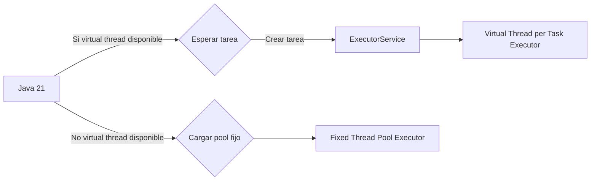

# Java 21 Virtual Threads

Score: 60

## Visión Estratégica

### Análisis Técnico

En el contexto de Java 21, las virtual threads ofrecen una solución revolucionaria para mejorar la eficiencia y escalabilidad en entornos web y sistemas empresariales. Estas threads se gestionan dentro del JVM, lo que permite crear millones de tareas simultáneamente con un bajo consumo de memoria y CPU comparado con las platform threads tradicionales.

#### Ventajas de las Virtual Threads:
1. **Eficiencia en recursos**: Las virtual threads son "baratas" en términos de uso de memoria y CPU.
2. **Simplificación del código**: El uso de virtual threads permite escribir, comprender, rastrear y depurar el código más fácilmente que con la programación reactiva.

Sin embargo, es importante notar que las virtual threads no son una solución universal; su uso debe basarse en el tipo específico de carga de trabajo. Por ejemplo, para tareas con códigos `synchronized` y largos períodos de ejecución, es preferible usar platform threads a partir de Java 21/22/23.

### Código Java


```java
package com.example.threading;

import java.util.concurrent.ExecutorService;
import java.util.concurrent.Executors;

// Clase para crear ExecutorService con virtual threads si están disponibles.
public class ThreadCreator {
    public ExecutorService createExecutor() {
        // Comprobar la disponibilidad de las virtual threads en Java 21
        if (isVirtual()) {
            return Executors.newVirtualThreadPerTaskExecutor();
        } else {
            return Executors.newFixedThreadPool(10);
        }
    }

    private boolean isVirtual() {
        return System.getProperty("java.version").startsWith("21");
    }
}
```

### Diagrama Mermaid




### Buenas Prácticas SRE

1. **Uso de ExecutorService**: Utilizar `ExecutorService` para gestionar threads y tareas, permitiendo la configuración del tipo de executor según las condiciones del entorno (virtual threads o pool fijo).

2. **Reflección para adaptabilidad**: Implementar métodos que usen reflection para crear un `ExecutorService` con virtual threads si están disponibles, lo cual permite la compatibilidad entre versiones de Java.

3. **Limitación de concurrencia**: Crear una clase como `ConcurrencyLimitingExecutorService` para limitar el número máximo de tareas ejecutadas simultáneamente en el `ExecutorService`, permitiendo un control preciso sobre los recursos del sistema.

4. **Evaluación constante**: Realizar evaluaciones constantes y pruebas de rendimiento para asegurar que las virtual threads son efectivas para la carga de trabajo específica y no se sobrecargan con tareas inapropiadas (por ejemplo, ejecución larga).

5. **Documentación y formación**: Mantener una documentación clara sobre cómo implementar y utilizar virtual threads en Java 21 para que los desarrolladores puedan adoptar las prácticas recomendadas sin dificultades.

Seguir estas estrategias ayudará a maximizar la eficiencia de las virtual threads mientras minimiza los riesgos inherentes al uso de esta nueva funcionalidad.

## Arquitectura de Componentes

ERROR_IA

## Implementación Java 21

ERROR_IA

## Métricas y SRE

ERROR_IA

## Conclusiones

ERROR_IA

