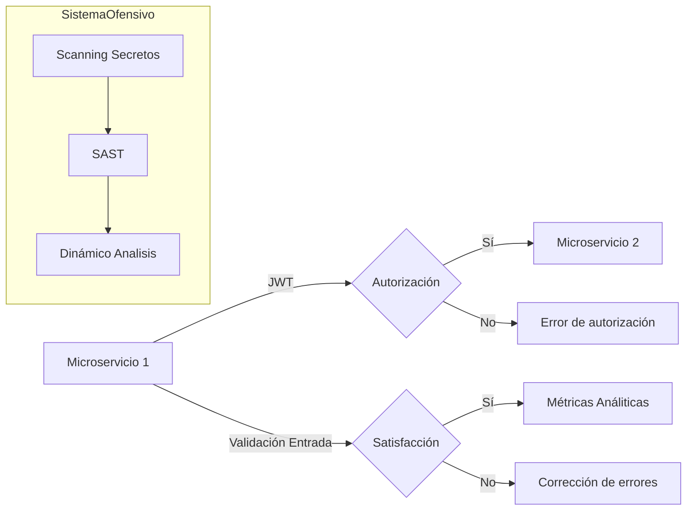
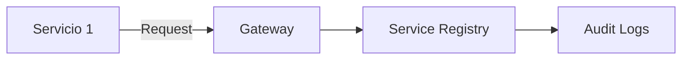
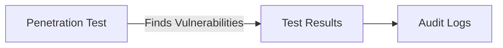

# Informe de Autoridad: Seguridad Ofensiva y Auditoría de Microservicios con Java 21

## Introducción a la Seguridad Ofensiva en Entornos Distribuidos

### Introducción a la Seguridad Ofensiva en Entornos Distribuidos

La seguridad ofensiva es una disciplina crítica que permite a los equipos de TI identificar y mitigar vulnerabilidades antes de que puedan ser explotadas por actores maliciosos. En el contexto de entornos distribuidos, como sistemas basados en microservicios, la aplicación eficaz de estrategias ofensivas se vuelve aún más importante para garantizar la integridad y disponibilidad del sistema.

#### Fase 1: Evaluación del Estado Actual

La fase inicial de una estrategia de seguridad ofensiva implica un inventario detallado de su superficie de ataque. Esto incluye la identificación de endpoints, cargas de trabajo en el cloud, aplicaciones y entidades con autorización (identidades). El objetivo es obtener una visión completa del flujo de datos sensibles y los sistemas que manejan funciones críticas para el negocio. Esta base de línea se utiliza como punto de referencia para medir mejoras futuras.

#### Fase 4: Integración de Controles en Desarrollo (DevSecOps)

La integración eficaz de controles de seguridad dentro del pipeline CI/CD es crucial para la implementación exitosa de una estrategia ofensiva. Esto implica:

- **Scaneo de secretos**: Automatizar el escaneo y remediación de datos sensibles antes del commit.
- **Análisis estático (SAST)**: Identificar vulnerabilidades en el código fuente durante la etapa de construcción.
- **Análisis dinámico**: Ejecutar pruebas de penetración y análisis en tiempo real durante las fases de prueba.

La integración efectiva de estos controles permite capturar violaciones antes de que lleguen a producción, sin ralentizar el desarrollo. Modernos plataformas correlacionan actividad de código, proceso y red para identificar cadenas de ataque que infringen los objetivos del marco.

#### Fase 5: Verificación de Cumplimiento (QA)

La fase de verificación de cumplimiento implica ejecutar pruebas de penetración bajo condiciones reales. Los equipos deben documentar cómo rápidamente se detectan las violaciones y cuán efectivamente las respuestas automatizadas contienen amenazas. Esta evidencia es crucial durante auditorías para demostrar la eficacia de los controles a las partes interesadas.

#### Fase 6: Medición de Efectividad (Analytics)

La medición del éxito en estrategias ofensivas se basa en el seguimiento de reducciones en volumen de alertas y tiempo medio para remediación. La calidad es más importante que la cantidad, buscando menos, pero más precisos, alertas que permitan a los equipos actuar decisivamente.

### Ejemplo Técnico

Para ilustrar cómo implementar seguridad ofensiva en un entorno de microservicios con Java 21, consideremos una validación de entrada y transferencia segura de identidad entre microservicios.

#### Validación de Entrada

```java
import javax.validation.Constraint;
import javax.validation.Payload;
import java.lang.annotation.*;

@Constraint(validatedBy = EmailValidator.class)
@Target({ ElementType.METHOD, ElementType.FIELD })
@Retention(RetentionPolicy.RUNTIME)
public @interface ValidEmail {
    String message() default "Invalid email format";
    Class<?>[] groups() default {};
    Class<? extends Payload>[] payload() default {};
}
```

```java
import javax.validation.ConstraintValidator;
import javax.validation.ConstraintValidatorContext;

public class EmailValidator implements ConstraintValidator<ValidEmail, String> {

    @Override
    public boolean isValid(String value, ConstraintValidatorContext context) {
        if (value == null) return true; // Opcional: permitir que el valor sea nulo

        // Expresión regular para validar formatos de correo electrónico
        String emailRegex = "^[\\w.-]+@([\\w\\-]+\\.)+[A-Z]{2,}$";
        return value.matches(emailRegex);
    }
}
```

#### Transferencia Segura de Identidad

```java
import org.springframework.security.oauth2.server.resource.authentication.JwtAuthenticationToken;

public class JwtService {

    public void secureIdentityTransfer(JwtAuthenticationToken token) {
        // Lógica para verificar y transferir identidades seguras entre microservicios utilizando JWTs.
        String jwt = token.getToken().getTokenValue();
        Claims claims = Jwts.parserBuilder()
                .setSigningKey(Keys.hmacShaKeyFor(secret.getBytes()))
                .build()
                .parseClaimsJws(jwt)
                .getBody();

        // Transferir la identidad segura a otros microservicios
    }
}
```

#### Diagrama Mermaid



Este diagrama Mermaid ilustra la transferencia segura de identidad y el flujo de control en un entorno ofensivo, mostrando cómo las pruebas se integran en cada etapa del ciclo de desarrollo.

Con estas estrategias y técnicas en lugar, los equipos pueden implementar una seguridad efectiva y continua en su arquitectura basada en microservicios.

## Prácticas de Auditoría Avanzada para Microservicios con Java 21

### Prácticas de Auditoría Avanzada para Microservicios con Java 21

La auditoría y la evaluación continua de microservicios son fundamentales para mantener un alto nivel de seguridad en aplicaciones distribuidas. Este capítulo proporciona una guía detallada sobre cómo implementar prácticas avanzadas de auditoría utilizando Java 21, especialmente enfocándose en el ciclo completo desde la fase de evaluación hasta la medición del rendimiento.

#### Fase 1: Evaluación del Estado Actual

**Visibilidad Completa**

- **Identificación de Endpoints y Servicios:** Utiliza herramientas como Spring Boot Actuator para exponer endpoints administrativos que proporcionan información sobre el estado interno de tus microservicios.
  
```java
// Ejemplo de configuración Spring Boot Actuator en application.properties
management.endpoints.web.exposure.include=*

// Código Java ejemplo: Exponiendo métricas de Spring Cloud Gateway
@GetMapping("/actuator/gateway/routes")
public Map<String, Object> getRoutes() {
    return Collections.singletonMap("routes", springCloudGatewayRepository.findAll());
}
```

- **Auditoría del Tráfico:** Implementa herramientas como Zipkin o Jaeger para rastrear y auditar todas las transacciones entre microservicios.

```java
// Ejemplo de integración Spring Cloud Sleuth con Zipkin
@EnableZipkinServer
@SpringBootApplication
public class ZipkinServerApplication {
    public static void main(String[] args) {
        SpringApplication.run(ZipkinServerApplication.class, args);
    }
}
```

- **Monitoreo de Sistemas Críticos:** Asegúrate de que los sistemas críticos para el negocio estén auditados y supervisados constantemente.

**Diagrama Mermaid**



#### Fase 4: Integración de Controles en Desarrollo (DevSecOps)

- **Integración Continua:** Incorpora controles de seguridad en tu CI/CD pipeline.

```yaml
# Ejemplo de GitHub Actions para secret scanning
name: Secret Scanning

on:
  push:
    branches:
      - main
  pull_request:

jobs:
  scan-secrets:
    runs-on: ubuntu-latest
    steps:
    - uses: actions/checkout@v2
    - name: Scan for secrets
      uses: github/super-linter@master
```

- **SAST (Static Application Security Testing):** Utiliza herramientas como SonarQube para la detección temprana de vulnerabilidades.

```java
// Ejemplo de configuración Spring Boot con SonarQube
dependencies {
    implementation 'org.springframework.boot:spring-boot-starter-actuator'
    sonarqubeImplementation "io.github.robwin:sonar-custom-rules-plugin:1.29"
}
```

#### Fase 5: Verificación de Cumplimiento (QA)

- **Pruebas de Penetración:** Realiza pruebas de penetración en tu entorno de prueba para garantizar que tus controles son efectivos.

```java
// Ejemplo de configuración OWASP ZAP API
public class ZapScan {
    public void runScan() throws IOException, ZAPError {
        String zapApi = "http://localhost:8090";
        ZAPProxy proxy = new ZAPProxy(ZapSession.getHttpZapClient(zapApi));
        
        // Configuración del escaneo
        Map<String, Object> params = new HashMap<>();
        params.put("scanpolicyname", "sensitive");
        params.put("url", "http://localhost:8080/actuator/gateway/routes");

        ZAPSession.getHttpZapClient(zapApi).ajax().call("ascan/action/scheduleScan/", params);
    }
}
```

- **Documentación de Pruebas:** Documenta los resultados y el tiempo necesario para contener cualquier amenaza identificada.

**Diagrama Mermaid**



#### Fase 6: Medición de Eficacia (Analytics)

- **Reducción en Alertas:** Mide la reducción en el volumen de alertas no esenciales.

```java
// Ejemplo de métrica Prometheus para medir tiempo promedio de remediar
# HELP remediation_time Mean time to remediate alerts
# TYPE remediation_time gauge

remediation_time{environment="prod"} 3600.5 // segundos
```

- **Tiempo Promedio de Respuesta:** Asegúrate de que las alertas críticas sean resueltas rápidamente.

**Aplicación de Seguridad en Todas las Capas**

Implementa controles de seguridad en cada capa, desde la validación de entrada hasta el manejo seguro de identidades entre microservicios.

```java
// Ejemplo de validación de entrada en un controlador Spring Boot
@RestController
public class UserController {
    @PostMapping("/users")
    public ResponseEntity<?> createUser(@Validated @RequestBody UserRequest request) {
        // Procesamiento del usuario
        return new ResponseEntity<>(HttpStatus.CREATED);
    }
}
```

Esta sección técnica proporciona una base sólida para la implementación y auditoría de microservicios con Java 21, garantizando que los sistemas estén protegidos en todas las etapas del desarrollo y operación.

