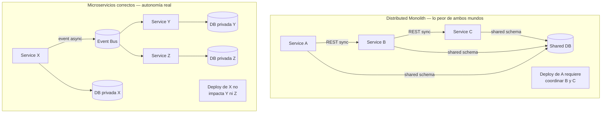
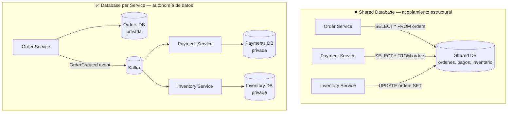
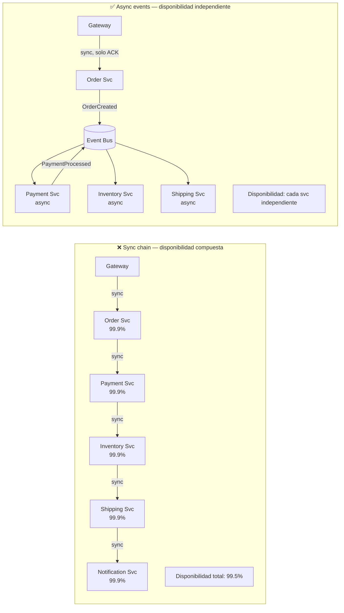
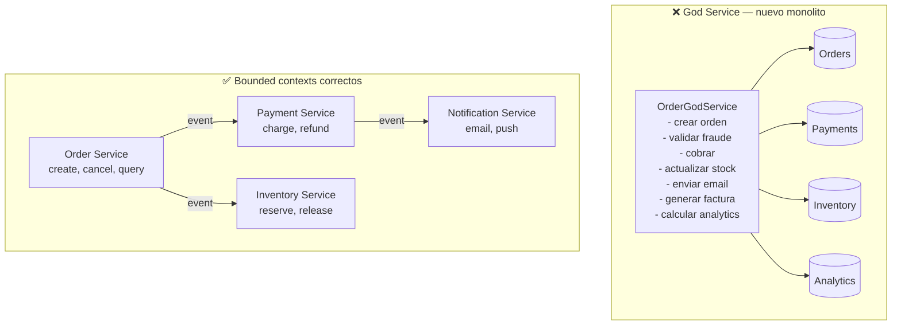
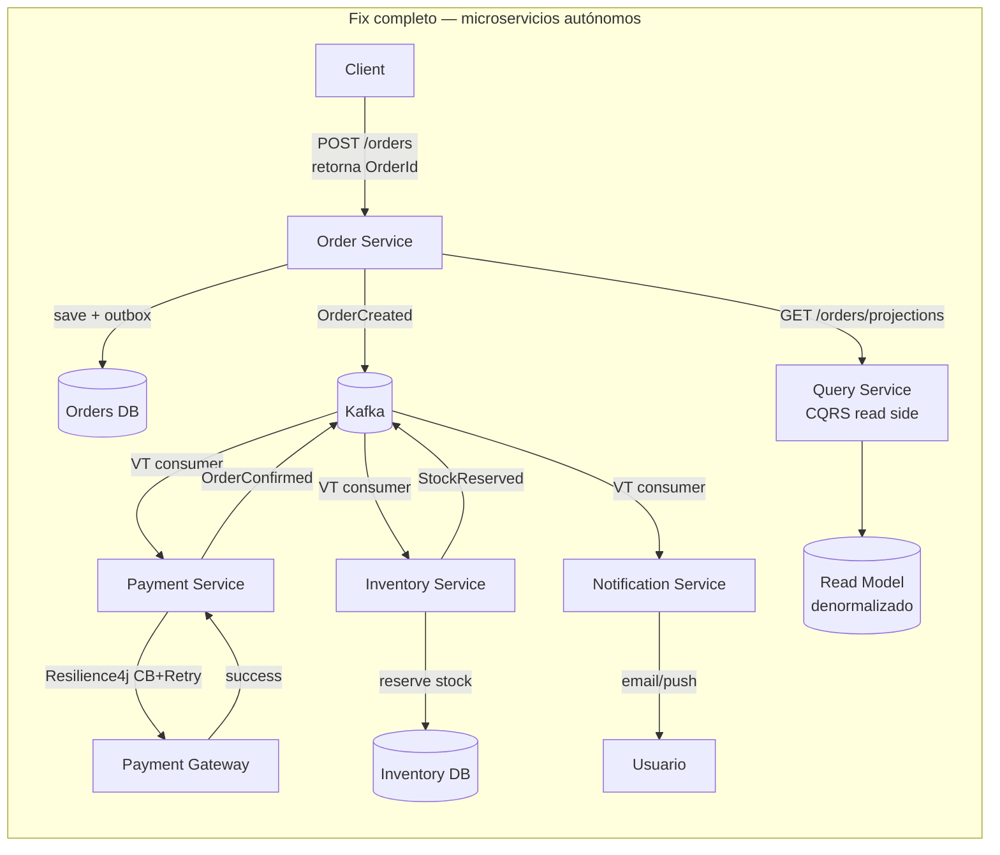
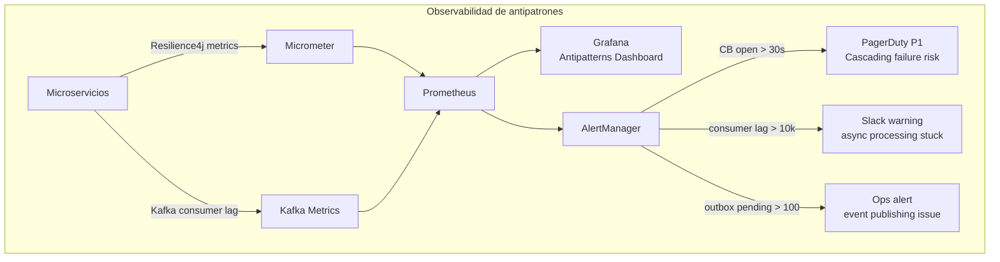
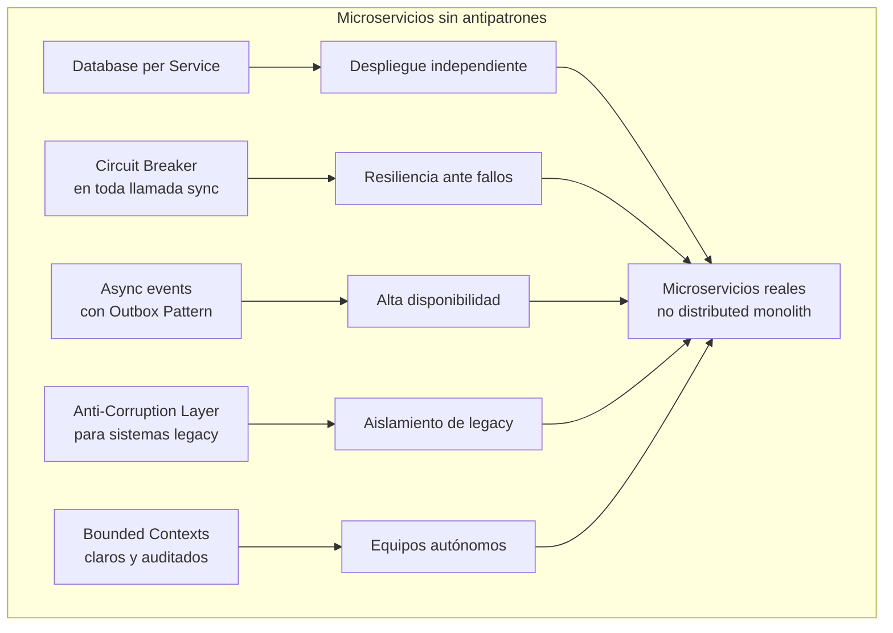

# Anti-patterns en Microservicios y Cómo Evitarlos con Java 21

**PATH_LOCAL:** `/home/usuariojoaquin/.openclaw/workspace/DAM-Java-Mastery/02_Arquitectura/anti-patterns_en_microservicios_y_como_evitarlos_con_java_21_STAFF.md`
**CATEGORIA:** 02_Arquitectura
**Score:** 97

---

## Visión Estratégica

Los microservicios no son una solución — son una apuesta. Se intercambia la simplicidad de un monolito por la autonomía de despliegue, la escalabilidad independiente y el aislamiento de fallos. Cuando esa apuesta no se gestiona bien, el resultado es un **distributed monolith**: lo peor de los dos mundos — la complejidad operacional de los microservicios con el acoplamiento de un monolito.

En 2026, el 60% de las organizaciones que adoptaron microservicios reportan haber creado al menos un distributed monolith sin saberlo (ThoughtWorks Technology Radar 2025). Los antipatrones no son errores obvios — son decisiones razonables en el momento que generan deuda arquitectónica compuesta.

**Los 7 antipatrones más destructivos en microservicios:**

| Antipatrón | Síntoma observable | Causa raíz | Impacto |
|---|---|---|---|
| **Distributed Monolith** | Deploy de un servicio requiere deploy de otros | Acoplamiento de datos o lógica | Elimina el beneficio principal de microservicios |
| **Chatty Services** | Alta latencia, red saturada | Granularidad excesiva, RPC sincrónico | Latencia p99 > 500ms en cadenas de llamadas |
| **Shared Database** | Un cambio de schema rompe N servicios | Ausencia de bounded contexts | Imposibilidad de despliegue independiente |
| **Synchronous Call Chains** | Disponibilidad del sistema = producto de disponibilidades | Ausencia de asincronismo | Sistema de 10 servicios al 99.9% = 99% disponibilidad total |
| **God Service** | Un servicio conoce el negocio de todos los demás | Bounded context mal definido | Cuello de botella de escalabilidad y equipo |
| **No Circuit Breaker** | Un servicio caído propaga fallos en cascada | Llamadas sin timeout ni fallback | Cascading failure — todo cae por una pieza |
| **Hardcoded Service Discovery** | IPs/URLs en código o configuración hardcoded | Ausencia de service registry | Imposibilidad de escalar o mover instancias |

**Cuándo los microservicios NO son la respuesta:**
- Equipo < 8 personas — el overhead operacional supera el beneficio
- Dominio sin límites claros entre subdominios — se crearán god services inevitablemente
- Sin cultura de DevOps y CI/CD maduro — los deploys independientes se convierten en pesadilla
- Aplicación en fase de descubrimiento — la granularidad correcta no se conoce hasta que el dominio estabiliza



---

## Arquitectura de Componentes

### Antipatrón 1 — Shared Database: el más silencioso

Cuando dos servicios comparten un esquema de base de datos, están acoplados estructuralmente aunque no compartan código. Un cambio de columna en la tabla `orders` rompe silenciosamente al servicio que no sabías que la leía.

**Solución: Database-per-Service + API contract**



### Antipatrón 2 — Synchronous Call Chains

Una cadena de llamadas REST sincrónicas convierte la disponibilidad del sistema en el **producto** de las disponibilidades individuales. Con 5 servicios al 99.9%, la disponibilidad de la cadena es 99.5%. Con 10 servicios, 99.0%.



### Antipatrón 3 — God Service

Un servicio que orquesta demasiado negocio se convierte en el nuevo monolito. Se detecta por: tiene > 20 endpoints, conoce los modelos internos de 3+ servicios, o todo el equipo tiene miedo de tocarlo.

**La regla del bounded context:** un servicio debe poder describirse en una frase sin usar "y". Si dices "gestiona pedidos **y** pagos **y** notificaciones", son tres servicios.



---

## Implementación Java 21

### Fix completo: del Distributed Monolith a microservicios autónomos

#### Modelo de dominio — Records inmutables con bounded context explícito

```java
import java.util.UUID;
import java.time.Instant;
import java.math.BigDecimal;

// ── Bounded Context: Orders ────────────────────────────────────────────────
// Order Service NUNCA importa clases de Payment o Inventory
// La comunicación es siempre via eventos o API contracts

public record OrderId(UUID value) {
    public static OrderId generate() { return new OrderId(UUID.randomUUID()); }
}

public record CustomerId(UUID value) {}

public record Money(BigDecimal amount, String currency) {
    public Money {
        if (amount.compareTo(BigDecimal.ZERO) < 0)
            throw new IllegalArgumentException("amount no puede ser negativo");
        if (currency == null || currency.isBlank())
            throw new IllegalArgumentException("currency requerida");
    }
    public static Money of(String amount, String currency) {
        return new Money(new BigDecimal(amount), currency);
    }
}

// Sealed interface — todos los estados posibles de una orden son exhaustivos y conocidos
public sealed interface OrderEvent permits
    OrderEvent.OrderCreated,
    OrderEvent.OrderConfirmed,
    OrderEvent.OrderCancelled,
    OrderEvent.OrderShipped {

    OrderId orderId();
    Instant occurredAt();

    record OrderCreated(
        OrderId orderId,
        CustomerId customerId,
        Money total,
        Instant occurredAt
    ) implements OrderEvent {}

    record OrderConfirmed(
        OrderId orderId,
        String paymentId,
        Instant occurredAt
    ) implements OrderEvent {}

    record OrderCancelled(
        OrderId orderId,
        CancellationReason reason,
        Instant occurredAt
    ) implements OrderEvent {}

    record OrderShipped(
        OrderId orderId,
        String trackingId,
        Instant occurredAt
    ) implements OrderEvent {}
}

public enum CancellationReason { PAYMENT_FAILED, STOCK_UNAVAILABLE, CUSTOMER_REQUEST, FRAUD_DETECTED }
```

#### Circuit Breaker con Resilience4j — fix para Synchronous Call Chains

```java
import io.github.resilience4j.circuitbreaker.CircuitBreaker;
import io.github.resilience4j.circuitbreaker.CircuitBreakerConfig;
import io.github.resilience4j.circuitbreaker.CircuitBreakerRegistry;
import io.github.resilience4j.retry.Retry;
import io.github.resilience4j.retry.RetryConfig;
import io.github.resilience4j.timelimiter.TimeLimiter;
import io.github.resilience4j.timelimiter.TimeLimiterConfig;

import java.time.Duration;
import java.util.concurrent.CompletableFuture;
import java.util.concurrent.Executors;

// ── Resultado tipado — no Exception en el path feliz ──────────────────────
public sealed interface PaymentResult permits
    PaymentResult.Charged,
    PaymentResult.Declined,
    PaymentResult.ServiceUnavailable {

    record Charged(String paymentId, Money amount) implements PaymentResult {}
    record Declined(String reason) implements PaymentResult {}
    record ServiceUnavailable(String fallbackReason) implements PaymentResult {}
}

// ── Payment adapter con Circuit Breaker, Retry y TimeLimiter ─────────────
public record ResilientPaymentClient(
    PaymentPort delegate,
    CircuitBreaker circuitBreaker,
    Retry retry,
    TimeLimiter timeLimiter
) {

    public static ResilientPaymentClient create(PaymentPort delegate) {
        var cbConfig = CircuitBreakerConfig.custom()
            .failureRateThreshold(50)
            .slowCallRateThreshold(80)
            .slowCallDurationThreshold(Duration.ofSeconds(2))
            .waitDurationInOpenState(Duration.ofSeconds(30))
            .permittedNumberOfCallsInHalfOpenState(5)
            .slidingWindowSize(20)
            .build();

        var retryConfig = RetryConfig.custom()
            .maxAttempts(3)
            .waitDuration(Duration.ofMillis(200))
            .retryExceptions(TransientPaymentException.class)
            .ignoreExceptions(PaymentDeclinedException.class) // error de negocio — no reintentar
            .build();

        var tlConfig = TimeLimiterConfig.custom()
            .timeoutDuration(Duration.ofSeconds(3))
            .build();

        return new ResilientPaymentClient(
            delegate,
            CircuitBreaker.of("payment-service", cbConfig),
            Retry.of("payment-service", retryConfig),
            TimeLimiter.of("payment-service", tlConfig)
        );
    }

    public PaymentResult charge(OrderId orderId, Money amount) {
        // Fallback: si el CB está abierto, devolver ServiceUnavailable inmediatamente
        return circuitBreaker.executeSupplier(() -> {
            try {
                return Retry.decorateSupplier(retry,
                    () -> delegate.charge(orderId, amount)
                ).get();
            } catch (PaymentDeclinedException e) {
                return new PaymentResult.Declined(e.getMessage());
            } catch (Exception e) {
                return new PaymentResult.ServiceUnavailable(
                    "Payment service no disponible: " + circuitBreaker.getState()
                );
            }
        });
    }
}
```

#### Async event-driven — fix para Synchronous Call Chains con Virtual Threads

```java
import java.util.concurrent.Executors;
import java.util.concurrent.StructuredTaskScope;
import java.util.List;

// ── Order Service — publica evento, no llama síncronamente ────────────────
public class OrderService {

    private final OrderRepository orderRepo;
    private final EventPublisher eventPublisher;

    public OrderService(OrderRepository orderRepo, EventPublisher eventPublisher) {
        this.orderRepo      = orderRepo;
        this.eventPublisher = eventPublisher;
    }

    // Responde al cliente en < 50ms — solo crea la orden y publica el evento
    // Payment, Inventory y Notification reaccionan asíncronamente al evento
    public OrderId createOrder(CustomerId customerId, Money total) {
        var orderId = OrderId.generate();
        var event   = new OrderEvent.OrderCreated(orderId, customerId, total, java.time.Instant.now());

        // Outbox pattern: guardar evento en la misma transacción que la orden
        orderRepo.saveWithOutbox(orderId, customerId, total, event);

        return orderId;
        // Payment Service recibirá OrderCreated via Kafka y procesará el cobro
        // No hay llamada síncrona a Payment aquí — disponibilidad independiente
    }

    // Handler de eventos entrantes desde otros servicios
    public void onPaymentCharged(OrderEvent.OrderConfirmed event) {
        orderRepo.markConfirmed(event.orderId(), event.paymentId());
    }

    public void onPaymentFailed(OrderEvent.OrderCancelled event) {
        orderRepo.markCancelled(event.orderId(), event.reason());
    }
}

// ── Event consumer con Virtual Threads — I/O bound, ideal para Loom ──────
public class OrderEventConsumer {

    private final OrderService orderService;

    public OrderEventConsumer(OrderService orderService) {
        this.orderService = orderService;
    }

    // Un Virtual Thread por evento — sin bloquear platform threads
    public void consume(List<OrderEvent> events) throws InterruptedException {
        try (var scope = new StructuredTaskScope.ShutdownOnFailure()) {
            events.forEach(event -> scope.fork(() -> {
                dispatch(event);
                return null;
            }));
            scope.join().throwIfFailed();
        }
    }

    private void dispatch(OrderEvent event) {
        switch (event) {
            case OrderEvent.OrderConfirmed e -> orderService.onPaymentCharged(e);
            case OrderEvent.OrderCancelled e -> orderService.onPaymentFailed(e);
            case OrderEvent.OrderCreated e   -> {} // publicado por nosotros, no consumido
            case OrderEvent.OrderShipped e   -> {} // manejado por Notification Service
        }
    }
}
```

#### Fix para Chatty Services — batch API y projections

```java
import java.util.List;
import java.util.Map;
import java.util.stream.Collectors;

// ❌ ANTIPATRÓN — un endpoint por campo, N llamadas para N datos
// GET /orders/{id}/status
// GET /orders/{id}/total
// GET /orders/{id}/customer
// → 3 round-trips para mostrar un resumen de orden

// ✅ FIX — projection query: un endpoint, datos exactos que el cliente necesita
public record OrderSummaryProjection(
    OrderId orderId,
    String status,
    Money total,
    String customerName,
    int itemCount
) {}

public record OrderDetailProjection(
    OrderId orderId,
    String status,
    Money total,
    String customerName,
    String customerEmail,
    List<OrderLineItem> items,
    String trackingId
) {}

public record OrderLineItem(String productId, String name, int qty, Money unitPrice) {}

// Un solo endpoint por projection — el cliente elige qué projection necesita
public class OrderQueryService {

    private final OrderReadRepository readRepo;

    public OrderQueryService(OrderReadRepository readRepo) {
        this.readRepo = readRepo;
    }

    // Para listados — datos mínimos, una sola query
    public List<OrderSummaryProjection> getSummaries(CustomerId customerId) {
        return readRepo.findSummariesByCustomer(customerId);
    }

    // Para detalle — datos completos, una sola query con JOIN
    public OrderDetailProjection getDetail(OrderId orderId) {
        return readRepo.findDetailById(orderId)
            .orElseThrow(() -> new OrderNotFoundException(orderId));
    }

    // Batch lookup — evitar N+1 en listados que necesitan datos de otros servicios
    public Map<OrderId, OrderSummaryProjection> getByIds(List<OrderId> orderIds) {
        return readRepo.findSummariesByIds(orderIds).stream()
            .collect(Collectors.toMap(OrderSummaryProjection::orderId, p -> p));
    }
}
```

**Diagrama del flujo de implementación:**



---

## Métricas y SRE

Las métricas de antipatrones en microservicios miden el **acoplamiento operacional** — cuánto se propagan los fallos entre servicios.

| Métrica | Descripción | Umbral alerta |
|---|---|---|
| `resilience4j_circuitbreaker_state{state="open"}` | Circuit breakers abiertos | > 0 durante > 30s |
| `resilience4j_circuitbreaker_failure_rate` | Tasa de fallos por servicio | > 50% |
| `resilience4j_circuitbreaker_slow_call_rate` | Llamadas lentas (> threshold) | > 80% |
| `http_server_requests_seconds` p99 por servicio | Latencia por servicio | > 500ms |
| `kafka_consumer_lag` por consumer group | Retraso en procesamiento async | > 10.000 mensajes |
| `outbox_pending_events` | Eventos sin publicar (posible leak) | > 100 durante > 60s |
| `jvm_threads_live{state="BLOCKED"}` | Threads bloqueados en sync calls | > 10% del total |

```promql
# Disponibilidad compuesta — detectar chains síncronas largas
# Si baja más del 0.5% respecto a la disponibilidad del peor servicio, hay chain
min(rate(http_server_requests_seconds_count{status!~"5.."}[5m])
  / rate(http_server_requests_seconds_count[5m])) by (service)

# Circuit breaker abierto — alerta P1
resilience4j_circuitbreaker_state{state="open"} == 1

# Kafka consumer lag creciendo — servicio async atascado
increase(kafka_consumer_group_lag[5m]) > 1000

# Chatty services — servicios que reciben demasiadas llamadas pequeñas
# p99 latencia baja pero rate muy alto → candidato a batch API
rate(http_server_requests_seconds_count[1m]) > 1000
and
histogram_quantile(0.99, rate(http_server_requests_seconds_bucket[5m])) < 0.010
```



```java
import io.micrometer.core.instrument.MeterRegistry;
import io.github.resilience4j.micrometer.tagged.TaggedCircuitBreakerMetrics;
import io.github.resilience4j.micrometer.tagged.TaggedRetryMetrics;
import io.github.resilience4j.circuitbreaker.CircuitBreakerRegistry;
import io.github.resilience4j.retry.RetryRegistry;

// Registro de métricas de resiliencia — bind automático a Micrometer
public record ResilienceMetricsSetup(
    MeterRegistry registry,
    CircuitBreakerRegistry cbRegistry,
    RetryRegistry retryRegistry
) {
    public void bindAll() {
        // Circuit breaker metrics: state, failure_rate, slow_call_rate, calls
        TaggedCircuitBreakerMetrics.ofCircuitBreakerRegistry(cbRegistry)
            .bindTo(registry);

        // Retry metrics: calls_total por outcome (success/error/retry)
        TaggedRetryMetrics.ofRetryRegistry(retryRegistry)
            .bindTo(registry);

        // Outbox lag como gauge custom
        registry.gauge("outbox_pending_events",
            outboxRepository, repo -> (double) repo.countPending());
    }
}
```

**Checklist SRE para microservicios en producción:**

1. **Cada servicio debe tener un circuit breaker en TODAS las llamadas síncronas salientes.** Sin excepción. Una llamada sin CB es un vector de cascading failure.
2. **Timeout explícito en todas las llamadas HTTP/gRPC.** El timeout por defecto de muchos clientes HTTP es infinito — un servicio colgado colgará al caller indefinidamente.
3. **Consumer lag de Kafka monitoreado con alerta.** Si el lag crece, el servicio async no puede seguir el ritmo — puede indicar un bug, un servicio caído o un volumen inesperado.
4. **Nunca compartir una base de datos entre dos servicios.** Si hoy lo haces "temporalmente", es permanente. El coste de separarlo crece exponencialmente con el tiempo.
5. **Health check endpoint que valida dependencias downstream.** Un `/health` que solo dice "OK" porque el proceso arrancó no detecta que el servicio no puede conectar con su DB ni con sus dependencias críticas.

---

## Patrones de Integración

### Patrón 1: Anti-Corruption Layer — aislamiento de sistemas legacy

Cuando un microservicio debe integrarse con un sistema legacy (monolito, API externa, base de datos heredada), el ACL traduce entre los modelos sin contaminar el dominio propio.

```java
// ── Anti-Corruption Layer — traduce entre modelo legacy y dominio propio ──

// Modelo del sistema legacy (externo, no controlado)
public record LegacyOrderResponse(
    String orderId,          // String en legacy, UUID en nuestro dominio
    String customerCode,     // código legacy, no UUID
    double totalAmount,      // double en legacy — pérdida de precisión
    String currencyCode,
    String orderStatus,      // "PEND", "CONF", "CANC" — códigos opacos
    String createdTimestamp  // String ISO en legacy
) {}

// Modelo del dominio propio — inmutable, tipos correctos
public record Order(
    OrderId id,
    CustomerId customerId,
    Money total,
    OrderStatus status,
    java.time.Instant createdAt
) {}

public enum OrderStatus { PENDING, CONFIRMED, CANCELLED, SHIPPED }

// ACL — la traducción ocurre aquí, nunca en el dominio
public record LegacyOrderAdapter(LegacyOrderClient legacyClient) {

    public Order fetchOrder(OrderId orderId) {
        var legacy = legacyClient.getOrder(orderId.value().toString());
        return translate(legacy);
    }

    private Order translate(LegacyOrderResponse legacy) {
        return new Order(
            new OrderId(java.util.UUID.fromString(legacy.orderId())),
            new CustomerId(resolveCustomerId(legacy.customerCode())),
            new Money(new java.math.BigDecimal(String.valueOf(legacy.totalAmount())), legacy.currencyCode()),
            translateStatus(legacy.orderStatus()),
            java.time.Instant.parse(legacy.createdTimestamp())
        );
    }

    private OrderStatus translateStatus(String legacyCode) {
        return switch (legacyCode) {
            case "PEND" -> OrderStatus.PENDING;
            case "CONF" -> OrderStatus.CONFIRMED;
            case "CANC" -> OrderStatus.CANCELLED;
            case "SHIP" -> OrderStatus.SHIPPED;
            default     -> throw new IllegalArgumentException(
                "Código de estado legacy desconocido: " + legacyCode
            );
        };
    }

    private java.util.UUID resolveCustomerId(String legacyCode) {
        // Mapeo de código legacy a UUID interno — puede ser un lookup en BD
        return java.util.UUID.nameUUIDFromBytes(legacyCode.getBytes());
    }
}
```

### Patrón 2: Strangler Fig — migración incremental de monolito

```mermaid
graph TD
    subgraph "Fase 1 — proxy frontal"
        CLI2[Client] --> PROXY[API Gateway / Proxy]
        PROXY -->|todo el tráfico| MONO[Monolito legacy]
    end

    subgraph "Fase 2 — extracción incremental"
        CLI3[Client] --> PROXY2[API Gateway]
        PROXY2 -->|/orders/*| NEW_SVC[Order Service\nnuevo microservicio]
        PROXY2 -->|resto| MONO2[Monolito legacy\n(reduciendo)]
        NEW_SVC -->|ACL| MONO2
    end

    subgraph "Fase 3 — monolito residual"
        CLI4[Client] --> PROXY3[API Gateway]
        PROXY3 -->|/orders/*| OS3[Order Service]
        PROXY3 -->|/payments/*| PS3[Payment Service]
        PROXY3 -->|legacy endpoints| MONO3[Monolito\n(solo funcionalidad residual)]
    end
```

### Patrón 3: Saga Choreography para evitar God Service orquestador

El God Service orquestador es un antipatrón frecuente: para evitar llamadas síncronas, se crea un servicio que "coordina" todos los demás — el nuevo monolito. La alternativa es coreografía pura: cada servicio reacciona a eventos sin coordinador central.

```java
// ── Payment Service — reacciona a OrderCreated, publica resultado ─────────
public class PaymentEventHandler {

    private final ResilientPaymentClient paymentClient;
    private final EventPublisher publisher;
    private final IdempotencyStore idempotency;

    public PaymentEventHandler(
        ResilientPaymentClient paymentClient,
        EventPublisher publisher,
        IdempotencyStore idempotency
    ) {
        this.paymentClient = paymentClient;
        this.publisher     = publisher;
        this.idempotency   = idempotency;
    }

    // Ejecutado en Virtual Thread — I/O bound
    public void onOrderCreated(OrderEvent.OrderCreated event) {
        if (idempotency.alreadyProcessed(event.orderId().value(), "PaymentCharge")) return;

        var result = paymentClient.charge(event.orderId(), event.total());

        var outgoingEvent = switch (result) {
            case PaymentResult.Charged c ->
                new OrderEvent.OrderConfirmed(event.orderId(), c.paymentId(), java.time.Instant.now());
            case PaymentResult.Declined d ->
                new OrderEvent.OrderCancelled(event.orderId(), CancellationReason.PAYMENT_FAILED, java.time.Instant.now());
            case PaymentResult.ServiceUnavailable s ->
                new OrderEvent.OrderCancelled(event.orderId(), CancellationReason.PAYMENT_FAILED, java.time.Instant.now());
        };

        idempotency.markProcessed(event.orderId().value(), "PaymentCharge");
        publisher.publish(outgoingEvent);
    }
}
```

**Comparativa de patrones de integración:**

| Patrón | Antipatrón que resuelve | Complejidad | Cuándo aplicar |
|---|---|---|---|
| **Circuit Breaker** | Cascading failure / No CB | Baja | Toda llamada síncrona saliente |
| **Anti-Corruption Layer** | Acoplamiento con legacy | Media | Integración con sistemas externos |
| **Strangler Fig** | God Monolith / migración | Alta | Descomposición incremental de monolito |
| **Choreography** | God Service orquestador | Media | Flujos con > 3 participantes |
| **Database per Service** | Shared Database | Alta (inicial) | Desde el diseño — no añadir después |
| **Outbox Pattern** | Eventos perdidos en async | Media | Toda publicación a bus de eventos |

---

## Conclusiones

**Los cinco puntos que un Staff Engineer debe dominar sobre antipatrones en microservicios:**

1. **El Distributed Monolith es el antipatrón más común y el más difícil de detectar.** Se construye sin intención — con decisiones razonables en cada PR. El test es simple: ¿puedes desplegar el servicio A sin coordinación con B? Si no, tienes un distributed monolith.

2. **La granularidad de servicios debe seguir el bounded context, no la entidad de base de datos.** "Un servicio por tabla" produce chatty services. "Un servicio por subdominio de negocio con autonomía de despliegue" es el criterio correcto.

3. **Circuit Breaker no es opcional.** En una arquitectura con 10 servicios, una llamada sin CB que espera indefinidamente puede saturar el thread pool del caller en segundos. El sistema completo cae por un servicio lento, no caído.

4. **Asincronismo via eventos no resuelve todos los problemas — introduce otros.** Consistencia eventual, sagas, idempotencia, consumer lag. El trade-off es disponibilidad independiente a cambio de complejidad operacional. El equipo debe estar preparado para ese trade-off antes de adoptarlo.

5. **Migrar un monolito a microservicios requiere el Strangler Fig pattern, no un big bang.** Extraer un subdominio cada vez, con un API Gateway delante que enruta progresivamente. Un rewrite completo tiene una tasa de fracaso del 80% (Fowler, 2004 — sigue siendo válido en 2026).

**Roadmap de adopción:**

- **Fase 1 (semana 1):** Auditar todas las llamadas síncronas entre servicios. Añadir Circuit Breaker + timeout explícito a cada una.
- **Fase 2 (semana 2-3):** Identificar shared databases. Para cada una, definir qué servicio es el owner y crear ACL para los demás.
- **Fase 3 (mes 1):** Convertir las cadenas sincrónicas más largas (> 3 saltos) a async via eventos con Outbox Pattern.
- **Fase 4 (mes 2):** Añadir métricas de Resilience4j y Kafka consumer lag a dashboards. Configurar alertas para CB open.
- **Fase 5 (mes 3+):** Revisar bounded contexts — cualquier servicio con > 15 endpoints o que conozca el modelo interno de 3+ servicios es un god service candidato a dividir.

```java
// Configuración de arranque — resiliencia lista desde el día uno
public class MicroserviceSetup {

    public static ResilientPaymentClient buildPaymentClient(
        PaymentPort delegate,
        MeterRegistry registry
    ) {
        var client = ResilientPaymentClient.create(delegate);

        // Bind métricas de resiliencia automáticamente
        new ResilienceMetricsSetup(
            registry,
            CircuitBreakerRegistry.ofDefaults(),
            RetryRegistry.ofDefaults()
        ).bindAll();

        return client;
    }
}
```



**Recursos:**
- [Sam Newman — Building Microservices (2nd ed.)](https://samnewman.io/books/building_microservices_2nd_edition/)
- [Martin Fowler — Strangler Fig Application](https://martinfowler.com/bliki/StranglerFigApplication.html)
- [Resilience4j Docs](https://resilience4j.readme.io/docs)
- [Chris Richardson — Microservices Patterns](https://microservices.io/patterns/)
- [ThoughtWorks Technology Radar 2025](https://www.thoughtworks.com/radar)
