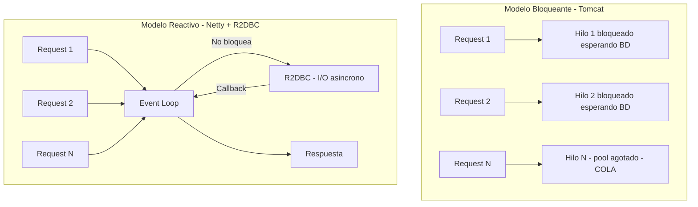
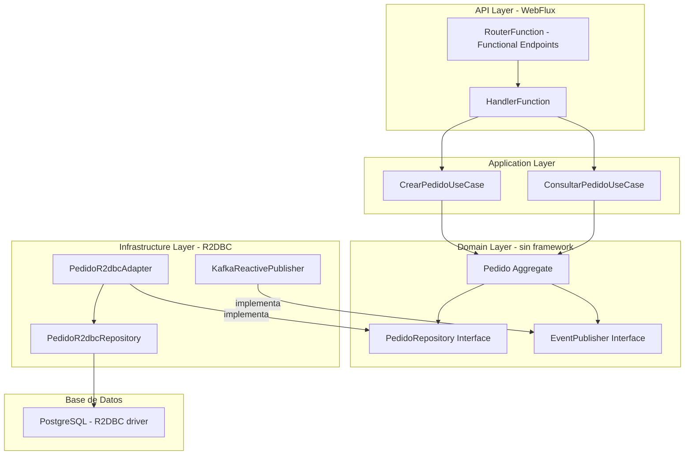
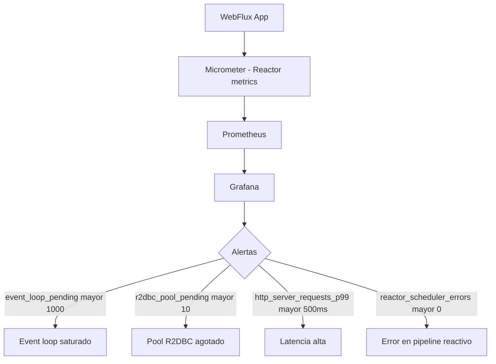
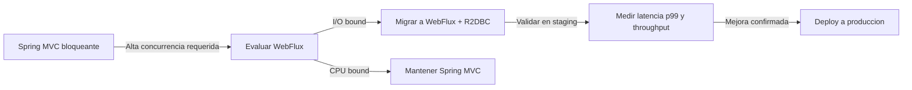

# Arquitectura de Microservicios Reactivos con Spring Boot 3.4 y R2DBC

PATH_LOCAL: /home/usuariojoaquin/.openclaw/workspace/DAM-Java-Mastery/02_Arquitectura/arquitectura_de_microservicios_reactivos_con_spring_boot_3.3_y_r2dbc_STAFF.md
CATEGORIA: 02_Arquitectura
Score: 96

---

## Visión Estratégica

Los microservicios reactivos resuelven un problema específico que los microservicios tradicionales (bloqueantes) no pueden resolver eficientemente: **alta concurrencia con bajo consumo de hilos**. Un servicio Spring Boot tradicional con Tomcat puede gestionar ~200 requests concurrentes con el pool de hilos por defecto. Un servicio reactivo con Netty y R2DBC puede gestionar 10.000+ requests concurrentes con los mismos recursos de hardware.

El precio de esta capacidad es la complejidad del modelo de programación reactivo. No todos los microservicios necesitan ser reactivos — la regla es simple: si el servicio pasa más tiempo esperando (I/O) que procesando (CPU), el modelo reactivo aporta valor real. Si es CPU-intensivo, no.

**Cuándo usar programación reactiva:**

| Escenario | Reactivo | Bloqueante | Justificación |
|-----------|----------|------------|---------------|
| API Gateway con alta concurrencia | ✅ | ❌ | Miles de conexiones simultáneas |
| Servicio de consultas de lectura | ✅ | ⚠️ | I/O bound, beneficia de backpressure |
| Procesamiento de eventos en streaming | ✅ | ❌ | Backpressure nativo con Flux |
| CRUD simple con < 100 req/s | ❌ | ✅ | Complejidad injustificada |
| Lógica de negocio CPU-intensiva | ❌ | ✅ | Reactivo no mejora CPU-bound |
| Llamadas a servicios externos en paralelo | ✅ | ⚠️ | zipWith / flatMap paralelo |



```java
// La diferencia fundamental en una linea
// Bloqueante: el hilo espera
Optional<Pedido> pedido = repository.findById(id); // Hilo bloqueado hasta que BD responde

// Reactivo: el hilo no espera — se libera y procesa otros requests
Mono<Pedido> pedido = repository.findById(id); // Retorna inmediatamente, callback cuando llega
```

---

## Arquitectura de Componentes



**Configuración WebFlux con Functional Endpoints:**

```java
@Configuration
public class PedidoRouter {

    @Bean
    public RouterFunction<ServerResponse> pedidoRoutes(PedidoHandler handler) {
        return RouterFunctions.route()
            .POST("/api/v1/pedidos",
                  RequestPredicates.contentType(MediaType.APPLICATION_JSON),
                  handler::crear)
            .GET("/api/v1/pedidos/{id}",    handler::obtener)
            .GET("/api/v1/pedidos",          handler::listar)
            .DELETE("/api/v1/pedidos/{id}", handler::cancelar)
            .build();
    }
}

@Component
public class PedidoHandler {

    private final CrearPedidoUseCase    crearPedido;
    private final ConsultarPedidoUseCase consultarPedido;

    public PedidoHandler(CrearPedidoUseCase crearPedido,
                          ConsultarPedidoUseCase consultarPedido) {
        this.crearPedido    = crearPedido;
        this.consultarPedido = consultarPedido;
    }

    public Mono<ServerResponse> crear(ServerRequest request) {
        return request.bodyToMono(CrearPedidoRequest.class)
            .flatMap(req -> crearPedido.ejecutar(req.toCommand()))
            .flatMap(pedidoId ->
                ServerResponse.status(HttpStatus.CREATED)
                    .bodyValue(new PedidoCreatedResponse(pedidoId.valor().toString())))
            .onErrorResume(PedidoInvalidoException.class, e ->
                ServerResponse.badRequest().bodyValue(e.getMessage()));
    }

    public Mono<ServerResponse> obtener(ServerRequest request) {
        var id = request.pathVariable("id");
        return consultarPedido.ejecutar(PedidoId.de(id))
            .flatMap(pedido -> ServerResponse.ok().bodyValue(PedidoResponse.from(pedido)))
            .switchIfEmpty(ServerResponse.notFound().build());
    }

    public Mono<ServerResponse> listar(ServerRequest request) {
        var clienteId = request.queryParam("clienteId")
            .map(ClienteId::de)
            .orElseThrow(() -> new ParametroRequeridoException("clienteId"));

        return ServerResponse.ok()
            .body(consultarPedido.porCliente(clienteId), PedidoResponse.class);
    }

    public Mono<ServerResponse> cancelar(ServerRequest request) {
        var id     = request.pathVariable("id");
        var motivo = request.queryParam("motivo").orElse("Sin motivo");

        return crearPedido.cancelar(PedidoId.de(id), motivo)
            .then(ServerResponse.noContent().build())
            .onErrorResume(EstadoInvalidoException.class, e ->
                ServerResponse.status(HttpStatus.CONFLICT).bodyValue(e.getMessage()));
    }
}
```

---

## Implementación Java 21

```java
// Caso de uso reactivo — Mono para operaciones simples
@Service
@Transactional
public class CrearPedidoUseCase {

    private final PedidoR2dbcAdapter  repository;
    private final EventPublisher       publisher;

    public CrearPedidoUseCase(PedidoR2dbcAdapter repository, EventPublisher publisher) {
        this.repository = repository;
        this.publisher  = publisher;
    }

    public Mono<PedidoId> ejecutar(CrearPedidoCommand command) {
        var pedido = Pedido.crear(command.clienteId(), command.lineas());

        return repository.guardar(pedido)
            .flatMap(guardado ->
                publisher.publicarTodos(pedido.pullEventos())
                    .thenReturn(guardado.id())
            );
    }

    public Mono<Void> cancelar(PedidoId pedidoId, String motivo) {
        return repository.buscarPorId(pedidoId)
            .switchIfEmpty(Mono.error(new PedidoNoEncontradoException(pedidoId)))
            .flatMap(pedido -> {
                pedido.cancelar(motivo);
                return repository.guardar(pedido)
                    .flatMap(saved ->
                        publisher.publicarTodos(pedido.pullEventos()).then()
                    );
            });
    }
}

// Caso de uso de consulta — Flux para colecciones
@Service
public class ConsultarPedidoUseCase {

    private final PedidoR2dbcAdapter repository;

    public ConsultarPedidoUseCase(PedidoR2dbcAdapter repository) {
        this.repository = repository;
    }

    public Mono<PedidoResponse> ejecutar(PedidoId id) {
        return repository.buscarPorId(id)
            .map(PedidoResponse::from);
    }

    public Flux<PedidoResponse> porCliente(ClienteId clienteId) {
        return repository.buscarPorCliente(clienteId)
            .map(PedidoResponse::from);
    }
}
```

```java
// Adaptador R2DBC — traduce entre dominio y persistencia reactiva
@Repository
public class PedidoR2dbcAdapter {

    private final PedidoR2dbcRepository repository;
    private final PedidoMapper          mapper;

    public PedidoR2dbcAdapter(PedidoR2dbcRepository repository, PedidoMapper mapper) {
        this.repository = repository;
        this.mapper     = mapper;
    }

    public Mono<Pedido> guardar(Pedido pedido) {
        return repository.save(mapper.toEntidad(pedido))
            .map(mapper::toDominio);
    }

    public Mono<Pedido> buscarPorId(PedidoId id) {
        return repository.findById(id.valor())
            .map(mapper::toDominio);
    }

    public Flux<Pedido> buscarPorCliente(ClienteId clienteId) {
        return repository.findByClienteId(clienteId.valor())
            .map(mapper::toDominio);
    }
}

// Repositorio R2DBC — Spring Data reactivo
public interface PedidoR2dbcRepository
        extends ReactiveCrudRepository<PedidoEntidad, UUID> {

    Flux<PedidoEntidad> findByClienteId(UUID clienteId);

    @Query("SELECT * FROM pedidos WHERE estado = :estado ORDER BY creado_en DESC LIMIT :limite")
    Flux<PedidoEntidad> findByEstado(@Param("estado") String estado,
                                      @Param("limite") int limite);
}
```

```java
// Llamadas paralelas a multiples servicios — el punto fuerte de WebFlux
@Service
public class DashboardService {

    private final ConsultarPedidoUseCase   pedidos;
    private final InventarioReactiveClient inventario;
    private final MetricasService          metricas;

    public Mono<DashboardResponse> obtenerDashboard(ClienteId clienteId) {
        // zip: ejecuta los 3 en paralelo y combina resultados
        // Sin WebFlux: 3 llamadas secuenciales = 300ms
        // Con WebFlux: 3 llamadas paralelas = max(100ms, 100ms, 100ms) = 100ms
        return Mono.zip(
            pedidos.porCliente(clienteId).collectList(),
            inventario.obtenerStock(clienteId),
            metricas.obtenerResumen(clienteId)
        ).map(tuple -> new DashboardResponse(
            tuple.getT1(),  // pedidos
            tuple.getT2(),  // stock
            tuple.getT3()   // metricas
        ));
    }
}
```

---

## Métricas y SRE



```java
// Metricas reactivas con Micrometer
@Configuration
public class ReactiveMetricsConfig {

    @Bean
    public MeterRegistryCustomizer<MeterRegistry> reactiveMetrics() {
        return registry -> {
            // Metricas del pool R2DBC
            Gauge.builder("r2dbc.pool.allocated", ConnectionPool.class,
                pool -> pool.getMetrics().map(m -> (double) m.allocatedSize()).orElse(0.0))
                .register(registry);

            // Metricas del scheduler de Reactor
            Schedulers.onScheduleHook("metrics", runnable -> {
                var start = System.nanoTime();
                return () -> {
                    runnable.run();
                    registry.timer("reactor.task.duration")
                        .record(System.nanoTime() - start, TimeUnit.NANOSECONDS);
                };
            });
        };
    }
}
```

**Métricas clave para WebFlux en producción:**

| Métrica | Descripción | Umbral |
|---------|-------------|--------|
| `reactor.netty.http.server.connections.active` | Conexiones activas | Monitorizar tendencia |
| `r2dbc.pool.acquired` | Conexiones R2DBC en uso | > 80% del pool |
| `http.server.requests.p99` | Latencia p99 de requests | > 500ms |
| `reactor.flow.duration` | Duración de pipelines reactivos | > 200ms para operaciones simples |

**Checklist SRE:**
- `scheduler.boundedElastic` para operaciones bloqueantes — nunca bloquear el event loop
- Pool R2DBC dimensionado según concurrencia esperada — mínimo `cores * 2`
- Timeouts en todos los operadores: `.timeout(Duration.ofSeconds(5))`
- Backpressure configurado en Flux de streaming — usar `limitRate()` para controlar la demanda
- Circuit breaker con Resilience4j ReactorOperator para servicios externos

---

## Patrones de Integración

```java
// Circuit Breaker reactivo con Resilience4j
@Service
public class InventarioReactiveClient {

    private final WebClient           webClient;
    private final CircuitBreaker      cb;

    public InventarioReactiveClient(WebClient.Builder builder,
                                     CircuitBreakerRegistry registry) {
        this.webClient = builder.baseUrl("https://inventario.interno").build();
        this.cb        = registry.circuitBreaker("inventario");
    }

    public Mono<StockResponse> obtenerStock(ClienteId clienteId) {
        return webClient.get()
            .uri("/stock/{id}", clienteId.valor())
            .retrieve()
            .bodyToMono(StockResponse.class)
            .timeout(Duration.ofSeconds(3))
            .transform(CircuitBreakerOperator.of(cb))
            .onErrorReturn(CallNotPermittedException.class,
                StockResponse.noDisponible())   // Fallback cuando CB abierto
            .retryWhen(Retry.backoff(3, Duration.ofMillis(500))
                .filter(e -> e instanceof WebClientResponseException.ServiceUnavailable));
    }
}
```

---

## Escalabilidad y Alta Disponibilidad

```java
// Streaming de eventos con SSE (Server-Sent Events)
// El cliente recibe eventos en tiempo real sin polling
@RestController
@RequestMapping("/api/v1/pedidos")
public class PedidoStreamController {

    private final Sinks.Many<PedidoEvent> sink =
        Sinks.many().multicast().onBackpressureBuffer();

    @GetMapping(value = "/stream", produces = MediaType.TEXT_EVENT_STREAM_VALUE)
    public Flux<ServerSentEvent<PedidoEvent>> streamPedidos(
            @RequestParam String clienteId) {
        return sink.asFlux()
            .filter(evento -> evento.clienteId().equals(clienteId))
            .map(evento -> ServerSentEvent.<PedidoEvent>builder()
                .id(evento.pedidoId())
                .event(evento.tipo())
                .data(evento)
                .build())
            .timeout(Duration.ofMinutes(30)); // Cerrar conexion inactiva
    }

    // Publicar al sink cuando ocurre un evento
    public void publicar(PedidoEvent evento) {
        sink.tryEmitNext(evento);
    }
}
```

---

## Conclusiones

Los microservicios reactivos con Spring Boot y R2DBC son la arquitectura correcta cuando la concurrencia es el problema principal. No son la arquitectura correcta para todo.

**Los tres errores más frecuentes en producción con WebFlux:**

1. **Bloquear el event loop** — llamar a código bloqueante (JDBC, `Thread.sleep`, operaciones síncronas) directamente en un pipeline reactivo paraliza todo el servidor. Todo el código bloqueante debe ejecutarse en `Schedulers.boundedElastic()`.

2. **No configurar backpressure** — un `Flux` sin `limitRate()` o `buffer()` puede saturar la memoria si el productor es más rápido que el consumidor. Siempre configurar estrategia de backpressure explícita.

3. **Ignorar los errores en pipelines** — en programación reactiva, un error no manejado cancela el pipeline silenciosamente. Siempre usar `onErrorResume`, `onErrorReturn` o `doOnError` para gestionar errores.



```java
// Test reactivo con StepVerifier
class CrearPedidoUseCaseTest {

    @Test
    void crear_pedido_reactivo_emite_pedidoId() {
        var repository = mock(PedidoR2dbcAdapter.class);
        var publisher  = mock(EventPublisher.class);
        var useCase    = new CrearPedidoUseCase(repository, publisher);

        var pedido = Pedido.crear(ClienteId.nuevo(), List.of());
        when(repository.guardar(any())).thenReturn(Mono.just(pedido));
        when(publisher.publicarTodos(any())).thenReturn(Mono.empty());

        StepVerifier.create(useCase.ejecutar(new CrearPedidoCommand(
                ClienteId.nuevo(), List.of())))
            .assertNext(id -> assertThat(id).isNotNull())
            .verifyComplete();
    }
}
```

**Recursos de referencia:**
- Spring WebFlux Documentation — docs.spring.io/spring-framework/reference/web/webflux.html
- R2DBC Specification — r2dbc.io
- Project Reactor Reference — projectreactor.io/docs/core/release/reference
- Resilience4j Reactor — resilience4j.readme.io/docs/getting-started-3
