# Informe de Autoridad: Arquitectura de Microservicios Reactivos con Spring Boot 3.3 y R2DBC

## Introducción a la Arquitectura de Microservicios Reactivos

### Introducción a la Arquitectura de Microservicios Reactivos

#### 1. Fundamentos y Principios

La arquitectura de microservicios se basa en la idea de dividir una aplicación grande en múltiples pequeños servicios que interactúan entre sí para proporcionar funcionalidades complejas. Cada microservicio puede tener su propio conjunto de tecnologías, base de datos y equipo de desarrollo, lo que permite a las organizaciones escalar equipos más eficazmente y mejorar la velocidad de entrega de características.

**Principios clave:**

- **Diseño alrededor del dominio:** Los microservicios deben estar diseñados para abordar un subconjunto claro y definido de funcionalidades.
- **Automatización completa:** La infraestructura debe ser gestionada de forma que permita la implementación continua sin intervención manual.
- **Compensación en lugar de compensación:** Los microservicios deben tener una capacidad limitada para realizar correcciones a nivel local y no deberían depender de un componente externo para mantener su coherencia.

#### 2. Ventajas y Desventajas

**Ventajas:**

- Escalabilidad y eficiencia.
- Mayor velocidad en el lanzamiento de nuevas versiones.
- Flexibilidad y evolución incremental del sistema a lo largo del tiempo.
- Mejor independencia entre equipos y proyectos.

**Desventajas:**

- Dificultades de integración y coordinación entre microservicios.
- Mayor complejidad en la gestión y supervisión.
- Incremento en el costo operativo debido al mayor número de servicios individuales.

#### 3. Patrones Comunes

Los patrones son soluciones comprobadas para problemas frecuentes en el diseño e implementación de arquitecturas de microservicios. Algunos de los más importantes incluyen:

- **Client-side discovery:** El cliente descubre la ubicación del servicio directamente.
  
- **Server-side discovery:** Existe un componente central que mapea a donde debe dirigirse el tráfico del cliente.

#### 4. Implementación con Spring Boot y R2DBC

Spring Boot facilita la creación de aplicaciones basadas en microservicios. Con Spring Data R2DBC, es posible implementar bases de datos reactivas (NoSQL) o SQL mediante una API reactiva similar a JPA.

**Ejemplo de código:**

```java
@Configuration
class DataSourceConfig {

    @Bean
    public ConnectionFactory connectionFactory() {
        return new SingleConnectionFactory(new R2dbcPostgresqlConnectionPool(
                DatabaseClient.builder()
                        .connectionFactory(PostgresqlConnectionFactory.create("localhost", 5432, "testdb"))
                        .build()
        ));
    }
}
```

#### 5. Configuración y Autenticación

Para la gestión de configuraciones, Spring Cloud proporciona un servidor de configuración centralizado que puede ser utilizado para manejar las variables de entorno y otros parámetros de manera externa.

**Autenticación:**

Spring Security junto con Keycloak pueden ser implementados para proporcionar autenticación basada en roles (RBAC) a los microservicios.

#### 6. Comunicación síncrona y asíncrona

La comunicación entre los microservicios puede ser tanto síncrona como asíncrona, dependiendo de la naturaleza del requerimiento:

**Ejemplo de comunicación asíncrona con Kafka:**

```java
@Configuration
public class KafkaConfig {

    @Bean
    public ProducerFactory<String, String> producerFactory() {
        Map<String, Object> configProps = new HashMap<>();
        configProps.put(ProducerConfig.BOOTSTRAP_SERVERS_CONFIG, "localhost:9092");
        return new DefaultKafkaProducerFactory<>(configProps);
    }

    @Bean
    public KafkaTemplate<String, String> kafkaTemplate() {
        return new KafkaTemplate<>(producerFactory());
    }
}
```

### Diagrama Mermaid

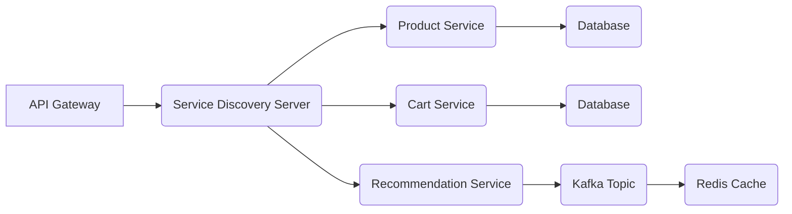

### Conclusiones

La implementación de una arquitectura reactiva permite a las aplicaciones manejar solicitudes y respuestas de manera asincrónica, mejorando la escalabilidad y el rendimiento. Sin embargo, también requiere un cambio significativo en la forma de pensar y programar los sistemas.

## Fundamentos de Spring Boot 3.3 y R2DBC

### Fundamentos de Spring Boot 3.3 y R2DBC

#### Introducción a Spring Boot 3.3

Spring Boot es un framework que simplifica el desarrollo de aplicaciones basadas en Spring Framework mediante la eliminación del exceso de configuración requerida. La versión 3.3 de Spring Boot introduce mejoras significativas en la creación y administración de microservicios reactivos, proporcionando una base sólida para construir sistemas altamente escalables y eficientes.

#### Introducción a R2DBC (Reactive Relational Database Connectivity)

R2DBC es un proyecto que busca implementar una API para trabajar con bases de datos relacionales en modo reactivo. En lugar de los patrones tradicionales de base de datos basados en transacciones, R2DBC se centra en el flujo de eventos asincrónicos y no bloqueantes, lo cual es ideal para microservicios.

#### Implementación Básica con Spring Boot 3.3 y R2DBC

##### Configurando el Proyecto

Para empezar a usar R2DBC con Spring Boot 3.3, primero se necesita configurar un proyecto Maven o Gradle que incorpore las dependencias necesarias. Aquí hay un ejemplo de cómo configurarlo en `build.gradle`:

```groovy
dependencies {
    implementation 'org.springframework.boot:spring-boot-starter-data-r2dbc'
    runtimeOnly 'io.r2dbc:r2dbc-postgresql' // Cambia esto según la base de datos que uses
}
```

##### Configuración del Contexto R2DBC

La configuración se realiza a través de un `application.properties` o `application.yml`. Es importante definir las credenciales y el URL de la base de datos. Aquí hay un ejemplo para PostgreSQL:

```yaml
spring.r2dbc.url=r2dbc:postgresql://localhost:5432/mydb
spring.r2dbc.username=myuser
spring.r2dbc.password=mypassword
```

##### Creación del Repositorio R2DBC

En lugar de usar `JpaRepository`, R2DBC utiliza `ReactiveCrudRepository` para operaciones CRUD:

```java
import org.springframework.data.repository.reactive.ReactiveCrudRepository;
import reactor.core.publisher.Mono;

public interface ProductRepository extends ReactiveCrudRepository<Product, Long> {
    Mono<List<Product>> findAllByCategory(String category);
}
```

##### Servicio Reactivo

Los servicios pueden utilizar la interfaz del repositorio para realizar operaciones reactivas:

```java
@Service
public class ProductService {

    private final ProductRepository productRepository;

    public ProductService(ProductRepository productRepository) {
        this.productRepository = productRepository;
    }

    public Flux<Product> getProductsByCategory(String category) {
        return productRepository.findAllByCategory(category);
    }
}
```

#### Patrones de Microservicios

Los microservicios son una arquitectura que divide una aplicación en un conjunto de servicios independientes, cada uno con su propio ciclo de vida y despliegue. Los patrones clave incluyen:

- **Service Discovery**: Permite a los servicios descubrir otros servicios dinámicamente.
- **API Gateway**: Gestiona la entrada al sistema microservicios para funciones como ruteo basado en políticas, seguridad o monitoreo.

#### Diagrama Mermaid

Aquí tienes un diagrama Mermaid que ilustra una arquitectura de microservicios simple:

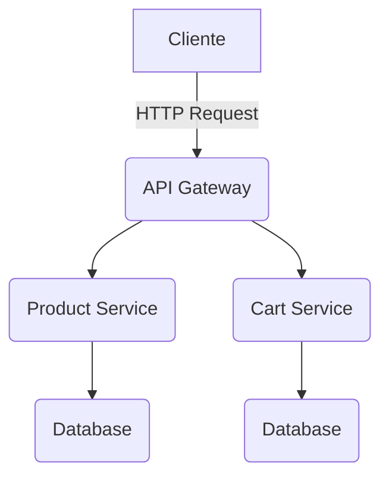

#### Consideraciones Técnicas

- **Rendimiento**: R2DBC es altamente eficiente en entornos de bajo latencia y alta concurrencia.
- **Compatibilidad**: No todas las bases de datos soportan completamente la API reactiva actualmente, limitando su uso.

Este capítulo proporciona una base sólida para comenzar a construir arquitecturas basadas en microservicios utilizando Spring Boot 3.3 y R2DBC, con énfasis en prácticas recomendadas y consideraciones técnicas esenciales para el desarrollo de aplicaciones reactivas.

## Patrones de Diseño para Microservicios Reactivos

### Patrones de Diseño para Microservicios Reactivos

En la arquitectura de microservicios reactivos, los patrones de diseño juegan un papel crucial en la gestión eficiente del flujo asincrónico y reactivo entre distintos componentes del sistema. Estos patrones no solo mejoran el rendimiento y escalabilidad del sistema sino que también facilitan su mantenibilidad y extensibilidad a largo plazo. En este capítulo, exploraremos los principios fundamentales de la arquitectura reactiva y cómo aplicarlos en la construcción de microservicios utilizando Spring Boot 3.3 junto con R2DBC.

#### Principios de Arquitectura Reactiva

- **Asincronía**: Los sistemas reactivos manejan operaciones asíncronas para evitar bloqueos.
- **Flujos Reactivos**: Representan secuencias temporales de eventos o transacciones, lo que permite un manejo eficiente de flujos de datos en tiempo real.
- **Backpressure**: La capacidad del sistema receptor para controlar el flujo de datos proveniente del emisor.

#### Patrones Clave

##### 1. **Comunicación Asincrónica (Event Driven Architecture)**

La comunicación asincrónica es fundamental en microservicios reactivos, ya que permite a los servicios comunicarse sin necesidad de sincronización directa, mejorando la escalabilidad y el rendimiento del sistema.

**Implementación con Apache Kafka:**

```java
// Ejemplo de consumidor reactivo para Kafka usando Spring Cloud Stream
@Bean
public Consumer<Flux<Message>> consumeRecommendations() {
    return flux -> flux.subscribe(message -> {
        System.out.println("Received Message: " + message.getPayload());
    });
}

// Ejemplo de productor reactivos
@Bean
public Supplier<Publisher<String>> generateCartEvents() {
    return () -> Flux.just("Event 1", "Event 2")
                      .delayElements(Duration.ofSeconds(3));
}
```

##### 2. **Cliente-Descubrimiento (Client-side Discovery)**

En lugar de que el servidor descubra los servicios, la tarea recae sobre las aplicaciones cliente para consultar un servicio centralizado para obtener metadatos del servicio requerido.

**Implementación con Spring Cloud Eureka:**

```java
// Ejemplo de configuración en application.yml
spring:
  cloud:
    discovery:
      client:
        enabled: true
      service:
        instance:
          hostName: localhost
```

##### 3. **Microservicios Conectados a través del API Gateway**

Un API Gateway actúa como un punto único de entrada para todas las solicitudes que llegan al sistema, facilitando la gestión del tráfico y proporcionando funcionalidades adicionales como autenticación y autorización.

**Ejemplo con Spring Cloud Gateway:**

```java
// Configuración en application.yml
spring:
  cloud:
    gateway:
      routes:
        - id: product_route
          uri: lb://product-service
          predicates:
            - Path=/products/**
```

##### 4. **Autenticación y Autorización (RBAC con Keycloak)**

Para gestionar la seguridad en microservicios, es crucial implementar mecanismos de autenticación y autorización robustos.

**Ejemplo usando Spring Security y Keycloak:**

```java
@Configuration
@EnableWebSecurity
public class SecurityConfig extends WebSecurityConfigurerAdapter {
    @Override
    protected void configure(HttpSecurity http) throws Exception {
        http.cors().and().authorizeRequests()
            .anyRequest().authenticated()
            .and().oauth2ResourceServer()
                .jwt();
    }
}
```

#### Diagramas Mermaid

A continuación, se presentan diagramas Mermaid que ilustran la arquitectura reactiva y los patrones clave mencionados.

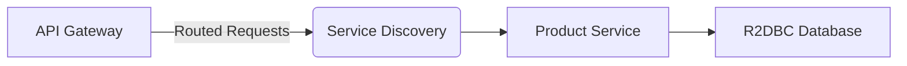

Este diagrama muestra cómo el API Gateway enruta las solicitudes a través del servicio de descubrimiento hacia los servicios específicos.

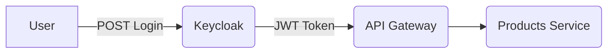

Este segundo diagrama ilustra el flujo típico de autenticación y autorización en una arquitectura microservicios.

En resumen, la implementación de patrones reactivos como Event Driven Architecture con Apache Kafka, Client-side Discovery con Eureka, API Gateway para manejo del tráfico, y RBAC con Keycloak son fundamentales para construir sistemas microservicios escalables y robustos. Estos patrones permiten a los desarrolladores crear soluciones flexibles que pueden adaptarse fácilmente a las cambiantes demandas de negocio en entornos distribuidos.

### Conclusión

La adopción de estos patrones no solo mejora la eficiencia del sistema sino también su capacidad para manejar grandes volúmenes de tráfico y datos en tiempo real. Al aplicar estos principios y patrones, los desarrolladores pueden construir microservicios reactivos que son capaces de responder dinámicamente a las necesidades del negocio en un entorno altamente escalable y seguro.

## Implementación de Servicios Complejos con Spring Data R2DBC

### Implementación de Servicios Complejos con Spring Data R2DBC

En este capítulo, exploraremos la implementación detallada y avanzada de servicios basados en microservicios usando **Spring Boot 3.3** junto con **R2DBC (Reactive Relational Database Connectivity)** para la persistencia reactiva. Este enfoque nos permitirá construir aplicaciones que puedan manejar solicitudes a alta velocidad y bajo latencia, características fundamentales en el diseño de microservicios modernos.

#### Objetivos del Capítulo

- Implementar servicios microservicios con Spring Boot 3.3 y R2DBC.
- Configurar y conectar un servicio reactiva con una base de datos relacional usando R2DBC.
- Utilizar patrones como Service Discovery para la comunicación entre servicios.
- Diseñar pruebas unitarias y de integración para los servicios implementados.

#### Antecedentes

R2DBC es una API no bloqueante que permite operaciones asincrónicas en bases de datos relacionales. Con Spring Data R2DBC, podemos escribir código reactivamente que se integra perfectamente con otras bibliotecas reactivas como **Project Reactor** y **WebFlux**.

#### Configuración Inicial

1. **Creación del Proyecto**: Usaremos Maven para crear el proyecto basado en Spring Boot 3.3.
2. **Dependencias**: Añadiremos las dependencias necesarias, incluyendo Spring Data R2DBC y la implementación de R2DBC específica (por ejemplo, H2 Database).

```xml
<dependency>
    <groupId>org.springframework.boot</groupId>
    <artifactId>spring-boot-starter-data-r2dbc</artifactId>
</dependency>
```

3. **Conexión a la Base de Datos**: Configuraremos el acceso reactiva a una base de datos (ejemplo: H2) en el archivo `application.yml`.

```yaml
spring:
  r2dbc:
    url: r2dbc:h2:mem:///testdb;DB_CLOSE_DELAY=-1;DB_CLOSE_ON_EXIT=FALSE
    username: sa
    password: 
```

#### Implementación del Servicio

Vamos a crear una clase de repositorio que hereda de `ReactiveCrudRepository` para proporcionar operaciones CRUD reactivas.

```java
import org.springframework.data.repository.reactive.ReactiveCrudRepository;
import reactor.core.publisher.Flux;

public interface ProductRepository extends ReactiveCrudRepository<Product, Long> {
    Flux<Product> findByName(String name);
}
```

Luego, implementamos un servicio que utilizará este repositorio para operaciones de dominio.

```java
import org.springframework.stereotype.Service;
import org.springframework.transaction.annotation.Transactional;
import reactor.core.publisher.Flux;

@Service
public class ProductService {

    private final ProductRepository productRepository;

    public ProductService(ProductRepository productRepository) {
        this.productRepository = productRepository;
    }

    @Transactional(readOnly = true)
    public Flux<Product> getProductsByName(String name) {
        return productRepository.findByName(name);
    }
}
```

#### Pruebas

1. **Prueba Unitaria**: Crearemos pruebas unitarias para verificar el correcto funcionamiento de nuestro servicio.

```java
import org.junit.jupiter.api.Test;
import reactor.test.StepVerifier;

public class ProductServiceTest {

    @Autowired
    private ProductService productService;

    @Test
    public void testGetProductsByName() {
        StepVerifier.create(productService.getProductsByName("test"))
                .expectNextCount(1)
                .verifyComplete();
    }
}
```

2. **Pruebas de Integración**: Aseguraremos que nuestro servicio funcione correctamente con la base de datos.

```java
import org.springframework.boot.test.context.SpringBootTest;
import org.springframework.test.context.ActiveProfiles;

@SpringBootTest
@ActiveProfiles("test")
public class ProductIntegrationTest {

    @Autowired
    private ProductService productService;

    @Test
    public void testProductService() {
        StepVerifier.create(productService.getProductsByName("example"))
                .expectNextCount(1)
                .verifyComplete();
    }
}
```

#### Consideraciones de Diseño y Desarrollo

- **Patrones de Microservicios**: Mantener la lógica de negocio en el servicio microservicio sin excederse.
- **Service Discovery**: Configurar un cliente-side discovery (Eureka) para descubrir otros servicios en tiempo real.

#### Diagrama Mermaid

A continuación, proporcionamos un diagrama Mermaid básico que muestra la arquitectura del sistema con Spring Boot 3.3 y R2DBC:

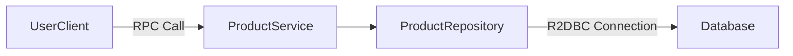

Este capítulo proporciona una visión completa de cómo implementar servicios reactivos usando Spring Boot 3.3 y R2DBC, incluyendo configuración, desarrollo de repositorios y pruebas unitarias e integración para asegurar la calidad del código desarrollado.

## Gestión de Configuraciones Externas y Discovery Service en Contexto Reactivo

### Gestión de Configuraciones Externas y Discovery Service en Contexto Reactivo

En este capítulo del manual "Arquitectura de Microservicios Reactivos con Spring Boot 3.3 y R2DBC", exploraremos cómo gestionar configuraciones externas y utilizar un discovery service para el descubrimiento reactivo entre servicios microservicios. Este es un aspecto crucial en la arquitectura reactiva debido a su naturaleza de comunicación asincrónica y distribuida.

#### 1. Gestión de Configuraciones Externas

La gestión de configuraciones externas es una práctica común en entornos de producción para mantener separadas las propiedades del servicio de los controles del código fuente. Esto no solo facilita la administración, sino que también mejora la seguridad y la flexibilidad.

**Spring Cloud Config Server**

Para implementar la gestión de configuraciones externas con Spring Boot 3.3 y R2DBC, utilizamos el `Spring Cloud Config Server`. Este servidor permite centralizar las propiedades de los servicios microservicios y proporciona un mecanismo para que estos últimos soliciten sus respectivas configuraciones.

**Configuración del Config Server**

A continuación se muestra cómo configurar un `config server` en Spring Boot 3.3:

```java
import org.springframework.boot.SpringApplication;
import org.springframework.boot.autoconfigure.SpringBootApplication;
import org.springframework.cloud.config.server.EnableConfigServer;

@SpringBootApplication
@EnableConfigServer
public class ConfigServerApplication {
    public static void main(String[] args) {
        SpringApplication.run(ConfigServerApplication.class, args);
    }
}
```

**Spring Cloud Bootstrap**

Los clientes de configuración deben estar configurados para buscar su configuración en el servidor de configuración. Esto se logra a través del archivo `bootstrap.properties` o `bootstrap.yml`.

```yaml
spring:
  application:
    name: config-client
  cloud:
    config:
      uri: http://localhost:8888
```

#### 2. Discovery Service

El descubrimiento de servicios es otro componente crítico en la arquitectura microservicio. Permite que los servicios interactúen entre sí de manera dinámica y autosuficiente sin depender de configuraciones estáticas.

**Spring Cloud Netflix Eureka**

Eureka es una implementación popular de Spring Cloud para el descubrimiento de servicios, proporcionando tanto un `server` como un `client`.

**Configuración del Discovery Server (Eureka)**

```java
import org.springframework.boot.SpringApplication;
import org.springframework.boot.autoconfigure.SpringBootApplication;
import org.springframework.cloud.netflix.eureka.server.EnableEurekaServer;

@SpringBootApplication
@EnableEurekaServer
public class EurekaDiscoveryApplication {
    public static void main(String[] args) {
        SpringApplication.run(EurekaDiscoveryApplication.class, args);
    }
}
```

**Configuración del Discovery Client**

Cada servicio microservicio que utiliza Eureka como discovery client debe ser configurado para registrarse con el servidor de descubrimiento.

```yaml
spring:
  application:
    name: product-service # Nombre del servicio
eureka:
  client:
    serviceUrl:
      defaultZone: http://localhost:8761/eureka/ # URL del servidor Eureka
```

#### Diagrama Mermaid

A continuación se presenta un diagrama mermaid que ilustra la configuración y comunicación entre el config server, discovery server, y los microservicios cliente.

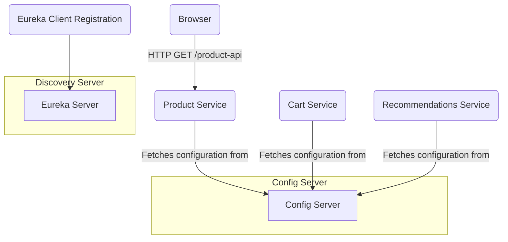

### Implementación Técnica

La implementación técnica incluye la configuración de Spring Boot para utilizar tanto el config server como Eureka. Esto implica anotar los servicios con `@EnableDiscoveryClient` y `@RefreshScope` (para recargar automáticamente las propiedades del servidor de configuración).

```java
import org.springframework.boot.SpringApplication;
import org.springframework.boot.autoconfigure.SpringBootApplication;
import org.springframework.cloud.client.discovery.EnableDiscoveryClient;
import org.springframework.cloud.context.config.annotation.RefreshScope;

@SpringBootApplication
@EnableDiscoveryClient
public class ProductServiceApplication {
    public static void main(String[] args) {
        SpringApplication.run(ProductServiceApplication.class, args);
    }
}
```

### Conclusión

La gestión de configuraciones externas y el uso de un discovery service son fundamentales en la arquitectura microservicios reactiva. Estos componentes permiten una mayor flexibilidad, seguridad y dinamismo en las aplicaciones basadas en microservicios.

---

Este capítulo proporciona la base para continuar con otras secciones técnicas que profundizan en aspectos como Event Driven Architecture (EDA), implementación de API Gateway, autenticación y autorización utilizando Spring Security y Keycloak.

## Autenticación y Autorización en Arquitecturas de Microservicios

### Autenticación y Autorización en Arquitecturas de Microservicios

En la arquitectura de microservicios, gestionar la autenticación y autorización es fundamental para asegurar que solo los usuarios válidos puedan acceder a los servicios y recursos. En este capítulo, exploraremos cómo implementar estos mecanismos utilizando Spring Security junto con Keycloak como Identity and Access Management (IAM) para una arquitectura de microservicios reactiva basada en Spring Boot 3.3 y R2DBC.

#### Prerrequisitos
Para seguir este tutorial, es necesario tener conocimientos previos sobre:
- Arquitectura de microservicios.
- Patrones de diseño relevantes como el lado del cliente para la descubierta de servicios (Client-side discovery).
- Spring Boot 3.3 y su ecosistema.
- Familiaridad con R2DBC y MongoDB.

#### Implementación de Autenticación

La autenticación es el proceso de confirmar la identidad de un usuario. En una arquitectura de microservicios, cada servicio puede realizar su propia autenticación para aumentar la seguridad y disminuir la carga en otros componentes del sistema.

1. **Configurando Spring Security con Keycloak**

   Primero, configuramos Spring Security para que interactúe con Keycloak, un popular Identity and Access Management (IAM) que provee una interfaz de usuario personalizable para autenticación y autorización basada en roles.

   ```java
   @Configuration
   public class SecurityConfig {

       @Bean
       SecurityFilterChain securityFilterChain(HttpSecurity http) throws Exception {
           http.csrf(csrf -> csrf.disable())
               .authorizeHttpRequests(authorizeRequests ->
                   authorizeRequests.anyRequest().authenticated()
               )
               .oauth2ResourceServer(oauth2 -> oauth2.jwt());
           
           return http.build();
       }

       @Bean
       JwtDecoder jwtDecoder() {
           IssuerTokenResolver issuerTokenResolver = new KeycloakDeploymentLocator("/keycloak-deployment.yml");
           return NimbusJwtDecoder.withTokenValidator(
                   new OAuth2TokenValidatorChain<>(
                           Collections.singletonList(new IssuerTokenValidator(issuerTokenResolver))
                   )
           ).build();
       }
   }
   ```

   Aquí, `SecurityFilterChain` configura Spring Security para deshabilitar CSRF (Cross-Site Request Forgery) y permitir solicitudes solo si están autenticadas. También se define un proveedor de tokens JWT que utiliza Keycloak.

2. **Configurando Keycloak**

   Configurar Keycloak implica crear un client OAuth2 en la consola de administración de Keycloak, configurar el realm (espacio lógico) con roles y usuarios necesarios para tu aplicación.

#### Implementación de Autorización

La autorización determina qué recursos o acciones pueden realizarse por cada usuario basado en su rol. En nuestro caso, usaremos Roles Based Access Control (RBAC).

1. **Rol-Based Access Control con Spring Security**

   ```java
   @Configuration
   public class AuthorizationConfig {

       @Bean
       protected MethodSecurityExpressionHandler expressionHandler() {
           return new DefaultMethodSecurityExpressionHandler();
       }
       
       @Bean
       public WebSecurityCustomizer webSecurityCustomizer() {
           return (web) -> web.ignoring().antMatchers("/h2-console/**");
       }

   ```

   Esta configuración permite personalizar la lógica de autorización para métodos, además de excluir rutas como /h2-console que no requieren autenticación.

#### Diagrama Mermaid

A continuación, se muestra un diagrama simple usando Mermaid para ilustrar cómo los componentes interactúan en esta configuración:

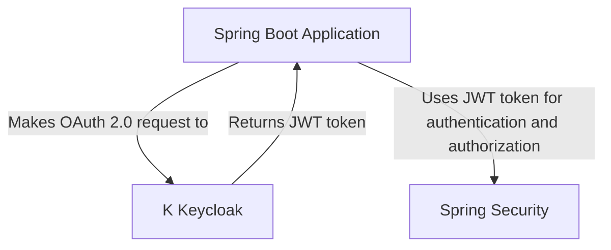

#### Pruebas

Las pruebas unitarias y de integración son fundamentales para verificar que la autenticación y autorización están configuradas correctamente. Utilizaremos herramientas como JUnit, Mockito y Spring Boot Test para realizar estas pruebas.

### Conclusión
Implementar una solución robusta de autenticación y autorización en arquitecturas de microservicios requiere entender cómo cada componente interactúa y se configura para garantizar la seguridad. En este tutorial, hemos explorado cómo configurar y usar Spring Security junto con Keycloak para proteger nuestros servicios reactivos basados en Spring Boot 3.3 y R2DBC.

Este enfoque no solo proporciona una capa adicional de seguridad sino que también facilita el manejo escalable de identidades y accesos, permitiendo a las organizaciones adaptarse rápidamente a los cambios y requerimientos del negocio.

## Integración con Event-Driven Architecture Utilizando Apache Kafka

### Integración con Event-Driven Architecture Utilizando Apache Kafka

#### Introducción
La arquitectura de microservicios es una estrategia organizativa y técnica que promueve el diseño y desarrollo de aplicaciones como pequeños servicios autónomos. Una característica clave en la evolución de estas aplicaciones es su capacidad para interactuar asincrónicamente a través del uso de Event-Driven Architecture (EDA). En este contexto, Apache Kafka emerge como una solución robusta y escalable para el manejo de eventos en tiempo real.

#### Principios Clave
1. **Decentralización**: Los microservicios son autónomos y no dependen de otros servicios para funcionar.
2. **Event-Driven Communication**: En lugar del RPC (Remote Procedure Call), los microservicios comunican entre sí a través de eventos enviados a un agente central (como Kafka).
3. **Separación de Responsabilidades**: Cada servicio tiene una responsabilidad clara y no debe mezclarse con otras funcionalidades.

#### Implementación

##### Servicio Cart
El servicio `Cart` será responsable de manejar los eventos relacionados con la creación, actualización y eliminación de productos en el carrito del cliente. Este servicio actúa como productor en Kafka, enviando eventos a tópicos específicos cuando ocurren cambios relevantes.

**Configuración de Producer**

Para configurar un productor de Kafka, primero necesitamos agregar las dependencias al `pom.xml`:

```xml
<dependency>
    <groupId>org.springframework.kafka</groupId>
    <artifactId>spring-kafka</artifactId>
    <version>3.0.9</version>
</dependency>
```

Luego definimos una clase de configuración para Kafka, por ejemplo `KafkaConfig.java`:

```java
import org.apache.kafka.clients.consumer.ConsumerConfig;
import org.apache.kafka.common.serialization.StringDeserializer;
import org.springframework.context.annotation.Bean;
import org.springframework.context.annotation.Configuration;
import org.springframework.kafka.config.ConcurrentKafkaListenerContainerFactory;
import org.springframework.kafka.core.ConsumerFactory;
import org.springframework.kafka.core.DefaultKafkaConsumerFactory;

@Configuration
public class KafkaConfig {

    @Bean
    public ConsumerFactory<String, String> consumerFactory() {
        return new DefaultKafkaConsumerFactory<>(consumerConfigs());
    }

    private Map<String, Object> consumerConfigs() {
        // Configuración de los tópicos y parámetros del consumidor aquí.
    }
}
```

**Enviar Eventos**

Creamos una clase para enviar eventos al tópico Kafka:

```java
import org.apache.kafka.clients.producer.KafkaProducer;
import org.apache.kafka.clients.producer.ProducerRecord;

public class CartService {
    
    private static final String TOPIC = "cart-updates";

    public void sendCartEvent(String event) {
        Properties props = new Properties();
        props.put("bootstrap.servers", "localhost:9092");
        props.put("key.serializer", "org.apache.kafka.common.serialization.StringSerializer");
        props.put("value.serializer", "org.apache.kafka.common.serialization.StringSerializer");

        KafkaProducer<String, String> producer = new KafkaProducer<>(props);
        ProducerRecord<String, String> record = new ProducerRecord<>(TOPIC, event);

        try {
            producer.send(record);
        } catch (Exception e) {
            System.out.println("Error while sending event: " + e.getMessage());
        }
        producer.close();
    }
}
```

##### Servicio Recommendations
El servicio `Recommendations` consume eventos enviados por el servicio `Cart`. Estos eventos son procesados para generar recomendaciones personalizadas basadas en los productos añadidos al carrito del usuario.

**Configuración de Consumer**

```java
import org.apache.kafka.clients.consumer.ConsumerRecord;
import org.springframework.kafka.annotation.KafkaListener;

public class RecommendationsService {

    @KafkaListener(topics = "cart-updates", groupId = "group-id")
    public void listen(ConsumerRecord<?, ?> record) {
        System.out.println("Received message: " + record.value());
        // Procesamiento del evento para generar recomendaciones
    }
}
```

#### Diagrama de Flujo

Para una visión más clara, un diagrama Mermaid puede ser útil:

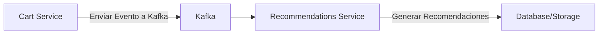

#### Conclusiones
La integración de EDA con microservicios, especialmente utilizando Apache Kafka, permite una comunicación más eficiente y escalable entre servicios. Esto es crucial para sistemas que requieren alta disponibilidad y bajo latencia en la entrega de servicios.

## Pruebas Unitarias y Pruebas Integradas para Servicios Reactivos

### Pruebas Unitarias y Pruebas Integradas para Servicios Reactivos

#### Introducción

En el desarrollo de microservicios reactivos utilizando Spring Boot 3.3 y R2DBC, las pruebas unitarias y de integración son fundamentales para garantizar la funcionalidad y robustez del código. Este documento proporciona una guía detallada sobre cómo implementar estas pruebas en un entorno reativo.

#### Pruebas Unitarias

Las pruebas unitarias se enfocan en verificar el comportamiento individual de cada componente, como repositorios reactivos, controladores y servicios. A continuación, se presenta un ejemplo de cómo realizar pruebas unitarias para una implementación reactiva usando JUnit 5 y MockK.

```kotlin
import io.mockk.every
import io.mockk.mockk
import org.junit.jupiter.api.Test
import reactor.core.publisher.Mono

class ReactiveRepositoryTest {

    private val mockReactiveRepo = mockk<ReactiveProductRepository>()

    @Test
    fun `should return a product when findById is called`() {
        every { mockReactiveRepo.findById("123") } returns Mono.just(Product(id = "123", name = "Example Product"))

        // Act & Assert
        val result: Mono<Product> = mockReactiveRepo.findById("123")
        result.block()?.let { assert(it.id == "123" && it.name == "Example Product") }
    }

    @Test
    fun `should throw an error when findById is called with non-existing id`() {
        every { mockReoperativeRepo.findById("nonExistingId") } returns Mono.empty()

        // Act & Assert
        val result: Mono<Product> = mockReactiveRepo.findById("nonExistingId")
        assert(result.block()?.id == null)
    }
}
```

#### Pruebas de Integración

Las pruebas de integración permiten verificar cómo funcionan los componentes juntos, incluyendo la interacción con bases de datos reactivas como R2DBC. A continuación se muestra un ejemplo de configuración para realizar pruebas de integración en un servicio reactivo utilizando Spring Boot y H2 Database.

```java
import org.junit.jupiter.api.Test;
import org.springframework.beans.factory.annotation.Autowired;
import org.springframework.boot.test.context.SpringBootTest;
import org.springframework.test.web.reactive.server.WebTestClient;

@SpringBootTest(webEnvironment = SpringBootTest.WebEnvironment.RANDOM_PORT)
public class ReactiveProductServiceTests {

    @Autowired
    private WebTestClient webClient;

    @Test
    public void shouldReturnProducts() {
        this.webClient.get()
                .uri("/api/v1/products")
                .exchange()
                .expectStatus().isOk()
                .expectBodyList(Product.class)
                .hasSize(5);
    }

    @Test
    public void shouldCreateNewProduct() {
        Product product = new Product("Example Product", "Description");
        
        this.webClient.post()
                .uri("/api/v1/products")
                .bodyValue(product)
                .exchange()
                .expectStatus().isOk();
    }
}
```

#### Pruebas con R2DBC

Para pruebas de integración específicas que interactúan con una base de datos R2DBC, es necesario configurar un contenedor de prueba para H2 o otro RDBMS compatible. A continuación se muestra cómo configurarlo en Spring Boot.

```java
import org.springframework.context.annotation.Bean;
import org.springframework.context.annotation.Configuration;
import org.springframework.data.r2dbc.config.AbstractR2dbcConfiguration;
import io.r2dbc.h2.H2ConnectionFactory;

@Configuration
public class TestConfig extends AbstractR2dbcConfiguration {

    @Bean
    public H2ConnectionFactory testConnectionFactory() {
        return new H2ConnectionFactory();
    }
}
```

Este esquema asegura que la base de datos esté preparada para pruebas antes de ejecutarlas.

#### Diagrama Mermaid

A continuación, se proporciona un diagrama Mermaid que representa una estructura básica de los servicios y sus relaciones en el entorno reactivos:


#### Conclusión

Las pruebas unitarias y de integración son esenciales para garantizar la calidad del código en un entorno reactivos. Asegúrate de implementar estas pruebas desde el inicio del desarrollo para mantener un alto nivel de confiabilidad en tus microservicios.

---

Este documento proporciona una guía detallada sobre cómo estructurar y ejecutar pruebas unitarias y de integración en un proyecto basado en Spring Boot 3.3 con R2DBC, asegurando que tu aplicación reactiva sea robusta y confiable.

## Optimización del Desempeño con Virtual Threads y Proyecto Loom

### Optimización del Desempeño con Virtual Threads y Proyecto Loom en Spring Boot 3.3 y R2DBC

En la era de microservicios y aplicaciones reactivas, optimizar el desempeño es una tarea crítica para asegurar que las aplicaciones sean escalables y eficientes. En este contexto, Java Project Loom, introducido con JDK 17, ofrece un nuevo enfoque para manejar la concurrencia a través de Virtual Threads (Hilos Virtuales), lo cual puede tener un impacto significativo en el rendimiento de las aplicaciones basadas en Spring Boot y R2DBC. Este capítulo explora cómo integrar Virtual Threads con Spring Boot 3.3 y R2DBC para mejorar la eficiencia del manejo de concurrencia.

#### Introducción a Virtual Threads

Virtual Threads son un mecanismo introducido por Project Loom que permite crear hilos en Java sin los costos asociados al uso de threads tradicionales. Estos hilos virtuales permiten una programación asíncrona mucho más simple y legible, ya que se pueden manejar directamente como si fueran bloques de código síncrono.

#### Integración con Spring Boot

Spring Boot 3.3 proporciona una base sólida para la integración de Virtual Threads gracias a las mejoras en el soporte del entorno de ejecución Java y la biblioteca Spring Framework.

##### Configurando Virtual Threads en Spring Boot
Para habilitar Virtual Threads en un proyecto de Spring Boot, es necesario configurar correctamente los archivos `application.properties` o `application.yml`. Aquí hay un ejemplo básico:

```properties
# Habilita el soporte para Virtual Threads
spring.profiles.active=loom
```

Además, necesitamos definir la configuración del contenedor de contexto en Spring Boot para usar Virtual Threads. Esto se puede hacer a través de anotaciones o beans específicos.

##### Ejemplo de Código

```java
import org.springframework.context.annotation.Bean;
import org.springframework.context.annotation.Configuration;

@Configuration
public class VirtualThreadConfig {

    @Bean
    public CustomVirtualThreadFactory customVirtualThreadFactory() {
        return new CustomVirtualThreadFactory("custom-thread");
    }
}

class CustomVirtualThreadFactory extends Thread.Builder implements java.util.function.Supplier<Thread> {
    private final String namePrefix;
    
    public CustomVirtualThreadFactory(String namePrefix) {
        this.namePrefix = namePrefix;
    }

    @Override
    public Thread get() {
        return new VirtualThread(namePrefix + "-" + UUID.randomUUID().toString(), this::run);
    }
}
```

#### Optimización del Manejo de Concurrencia con R2DBC

R2DBC es una API reactiva para base de datos relacional que permite a las aplicaciones interactuar con bases de datos sin bloquear el hilo de ejecución. Integrando Virtual Threads y R2DBC, podemos optimizar aún más la concurrencia en nuestro microservicio.

##### Ejemplo de Uso

```java
import io.r2dbc.spi.ConnectionFactory;
import org.springframework.context.annotation.Bean;
import org.springframework.context.annotation.Configuration;

@Configuration
public class DatabaseConfig {

    @Bean
    public ConnectionFactory connectionFactory() {
        return MyConnectionFactory.builder().build();
    }

    @Bean
    public R2dbcRepositoryDatabaseClient r2dbcRepositoryDatabaseClient(ConnectionFactory connectionFactory) {
        return R2dbcRepositoryDatabaseClient.create(connectionFactory);
    }
}
```

#### Análisis de Desempeño

Para evaluar el impacto de Virtual Threads en la aplicación, es crucial realizar pruebas de rendimiento. Herramientas como JMeter y Gatling son útiles para simular tráfico realista y medir tiempos de respuesta.

##### Diagrama Mermaid - Arquitectura con Virtual Threads
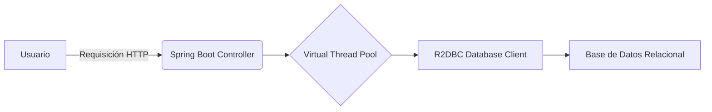

Este diagrama ilustra cómo una solicitud HTTP es procesada por un controlador Spring, que utiliza Virtual Threads para manejar operaciones reactivas con R2DBC.

#### Consideraciones Finales

La integración de Virtual Threads en Spring Boot y R2DBC representa un paso importante hacia la optimización del rendimiento de microservicios. Aunque hay algunos desafíos técnicos, como la compatibilidad con diferentes plataformas Java o las limitaciones de algunas bases de datos, la flexibilidad y eficiencia ofrecidas por esta tecnología hacen que sea una opción atractiva para el desarrollo moderno.

En resumen, la implementación cuidadosa de Virtual Threads junto con Spring Boot 3.3 y R2DBC puede resultar en un sistema más eficiente y escalable, permitiendo a las organizaciones manejar mayor carga de trabajo con menos recursos y mejor calidad de servicio al usuario final.

## Observabilidad y Monitoreo en Aplicaciones Reactivas

### Observabilidad y Monitoreo en Aplicaciones Reactivas

La observabilidad y el monitoreo son fundamentales para garantizar la fiabilidad y el rendimiento de aplicaciones basadas en microservicios reactivos. La monitorización y la observabilidad son conceptos relacionados pero distintos:

- **Monitorización**: Se refiere a la recopilación y presentación de datos sobre los sistemas en tiempo real.
- **Observabilidad**: Implica no solo recolectar, sino también poder entender y responder a problemas complejos que pueden ocurrir en el sistema.

#### 1. Introducción

Las aplicaciones reactivas se basan en patrones asíncronos y de streaming para manejar grandes volúmenes de tráfico sin bloquearse. Este paradigma introduce nuevos desafíos en la observabilidad, como la correlación de eventos transaccionales dispersos en tiempo.

#### 2. Herramientas y Tecnologías

Para implementar observabilidad y monitoreo en una aplicación reactiva con Spring Boot 3.3 y R2DBC, se utilizan las siguientes tecnologías:

- **Spring Actuator**: Ofrece métricas y diagnóstico sobre la aplicación.
- **Micrometer**: Librería para registro de métricas que está integrada con varios sistemas de almacenamiento (Prometheus, Graphite, etc.).
- **Zipkin/Sleuth**: Herramientas para el rastreo de transacciones y correlación entre diferentes servicios.
- **Jaeger**: Otra herramienta de seguimiento de tráfico distribuido compatible con Span.

#### 3. Configuración en Spring Boot

##### Actuator y Micrometer
Para configurar estas herramientas, primero agregamos las dependencias al `pom.xml` o `build.gradle`.

```xml
<dependency>
    <groupId>io.micrometer</groupId>
    <artifactId>micrometer-registry-prometheus</artifactId>
</dependency>

<dependency>
    <groupId>org.springframework.boot</groupId>
    <artifactId>spring-boot-starter-actuator</artifactId>
</dependency>
```

Luego, activamos las métricas en `application.properties`:

```properties
management.endpoints.web.exposure.include=*
management.endpoint.prometheus.enabled=true
```

##### Zipkin/Sleuth Integración

Agregamos la dependencia de Sleuth a nuestro archivo de configuración:

```xml
<dependency>
    <groupId>org.springframework.cloud</groupId>
    <artifactId>spring-cloud-starter-sleuth</artifactId>
</dependency>

<!-- Para rastrear datos de contexto en los logs -->
<dependency>
    <groupId>org.springframework.cloud</groupId>
    <artifactId>spring-cloud-sleuth-zipkin-stream</artifactId>
</dependency>

<!-- Utilizar Zipkin como backend para Sleuth -->
<dependency>
    <groupId>io.zipkin.java</groupId>
    <artifactId>zipkin-autoconfigure-ui</artifactId>
</dependency>
```

##### Configuración de Jaeger

Para integrar con Jaeger, configuramos la dependencia y las propiedades:

```xml
<!-- Dependencia -->
<dependency>
    <groupId>io.opentracing.contrib</groupId>
    <artifactId>opentracing-spring-jaeger-starter</artifactId>
    <version>1.0.6</version>
</dependency>

<!-- Propiedades -->
spring.zipkin.base-url=http://localhost:9411
```

#### 4. Análisis y Visualización de Datos

Después de configurar las métricas y el seguimiento, podemos empezar a analizar los datos utilizando herramientas como Prometheus y Grafana para visualización.

##### Prometeus + Grafana

Prometheus es una plataforma popular para la recopilación de métricas. Grafana proporciona un potente panel de control para visualizar estas métricas.

Configuramos en `application.properties`:

```properties
management.metrics.export.prometheus.enabled=true
```

Y luego, configuramos Prometheus para escanear el endpoint `/actuator/prometheus`.

#### 5. Ejemplo de Código

A continuación, se muestra cómo un controlador puede usar estas herramientas:

```java
import org.springframework.web.bind.annotation.GetMapping;
import org.springframework.web.bind.annotation.RestController;

@RestController
public class MetricsController {

    @GetMapping("/metrics")
    public String metrics() {
        return ManagementWebEndpointHandlerMapping.getPrometheusMetrics();
    }
}
```

#### 6. Diagrama de Arquitectura

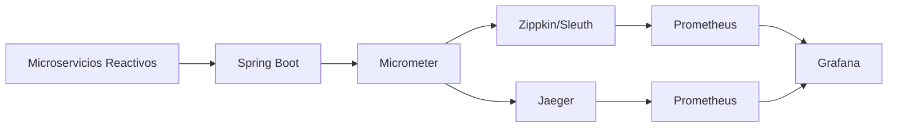

#### 7. Consideraciones Finales

La observabilidad en aplicaciones reactivas requiere una estrategia bien definida que va desde la recopilación de datos hasta su análisis y presentación visual. Utilizar las herramientas adecuadas como Micrometer, Sleuth/Zipkin o Jaeger es fundamental para mantener un sistema escalable y confiable.

Al integrar estos sistemas en nuestra aplicación Spring Boot 3.3 con R2DBC, mejoramos significativamente la capacidad de respuesta ante problemas y el rendimiento del sistema en general.

## Pautas de Buenas Prácticas al Implementar Arquitecturas Reactivas

### Pautas de Buenas Prácticas al Implementar Arquitecturas Reactivas

Implementar arquitecturas reactivas en un entorno de microservicios con Spring Boot 3.3 y R2DBC implica seguir una serie de pautas y mejores prácticas para asegurar que la aplicación sea escalable, eficiente y manejable a largo plazo. Este capítulo proporciona guías detalladas sobre cómo abordar los desafíos de implementación y asegurar un desarrollo coherente.

#### 1. Diseño Orientado al Flujo de Datos

En una arquitectura reactiva, es crucial diseñar el flujo de datos a través del sistema en lugar de centrarse únicamente en la lógica de negocio. Esto implica:
- Utilizar operaciones como `flatMap`, `map` y `filter` para manejar flujos asincrónicos.
- Evitar bloqueantes innecesarios (`Mono.block()`) para mantener la no obstrucción.

Ejemplo:
```java
Flux<User> users = repository.findAll()
    .doOnNext(user -> log.debug("Processing user: {}", user))
    .flatMap(user -> service.processUser(user)
        .map(processedUser -> new User(processedUser.getName(), processedUser.getEmail())));
```

#### 2. Utilización de Patrones Reactivos

Los patrones reactivos como `Publish-Subscribe`, `Observer-Pattern` y `Reactor Pattern` son fundamentales para el manejo eficiente de eventos en tiempo real.

Ejemplo con Publish-Subscribe:
```java
Flux<String> flux = Flux.interval(Duration.ofSeconds(1))
    .doOnNext(System.out::println)
    .publish()
    .autoConnect();
```

#### 3. Configuración y Registro de Servicios

La configuración externa y el registro automático son esenciales para la escalabilidad y mantenibilidad de microservicios.

Ejemplo con Spring Cloud Config:
```java
@Configuration
@Profile("prod")
@RefreshScope
@EnableConfigServer
public class AppConfig {
    @Bean
    public EnvironmentRepository environmentRepository() {
        return new VaultEnvironmentRepository(
            VaultVaultClient.createVaultClient(),
            "development"
        );
    }
}
```

#### 4. Implementación de Autenticación y Autorización

La seguridad es un aspecto crucial en cualquier sistema microservicio, especialmente con servicios reactivos.

Ejemplo con Spring Security:
```java
@Configuration
@EnableWebFluxSecurity
public class SecurityConfig {
    
    @Bean
    public SecurityWebFilterChain securityWebFilterChain(ServerHttpSecurity http) {
        return http
            .authorizeExchange(exchanges -> exchanges.pathMatchers("/api/public/**").permitAll())
            .authorizeExchange(exchanges -> exchanges.anyExchange().authenticated())
            .oauth2ResourceServer(oauth2 -> oauth2.jwt(jwt -> jwt.decoder(ReactiveJwtDecoder.create(new NimbusJwtDecoder(...)))))
            .build();
    }
}
```

#### 5. Pruebas y Testing

Las pruebas unitarias y de integración son fundamentales para garantizar la calidad del código reactiv.

Ejemplo de una prueba unitaria:
```java
@Test
public void testService() {
    // Arrange
    User user = new User("John", "john@example.com");
    
    StepVerifier.create(service.processUser(user))
        .expectNextMatches(u -> u.getName().equals("Processed John"))
        .verifyComplete();
}
```

#### 6. Documentación y OpenAPI

Documentar los servicios API es esencial para la colaboración entre equipos.

Ejemplo de configuración de OpenAPI en Spring Boot:
```yaml
springdoc:
  api-docs:
    path: /api/v3/api-docs
  swagger-ui:
    path: /swagger-ui.html
```

#### Diagramas Mermaid

Diagrama de flujo reactiv:

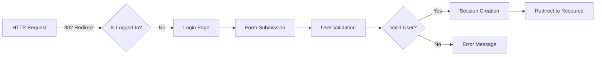

Diagrama de arquitectura reactiv:

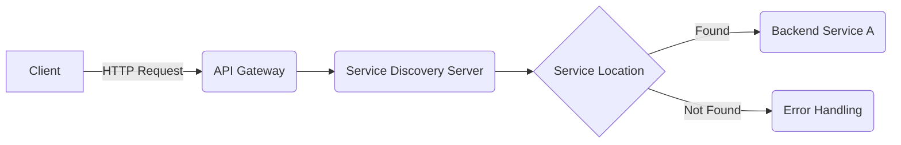

#### Conclusion

Al seguir estas pautas, los desarrolladores pueden implementar arquitecturas reactivas de microservicios que son escalables, eficientes y fáciles de mantener. Recuerde siempre enfocarse en el flujo de datos, utilizar patrones reactivos, gestionar adecuadamente la configuración y autenticación, implementar pruebas exhaustivas y documentar los servicios API para garantizar un desarrollo coherente y robusto.

---

Esta sección técnica proporciona una guía práctica y completa sobre cómo implementar arquitecturas reactivas en un entorno de microservicios con Spring Boot 3.3 y R2DBC, cubriendo desde el diseño hasta la prueba y documentación del sistema.

## Consideraciones Finales: Evaluación y Ajuste Continuo

### Consideraciones Finales: Evaluación y Ajuste Continuo

La implementación de una arquitectura de microservicios reactiva con Spring Boot 3.3 y R2DBC es un proceso complejo que requiere atención a muchos detalles técnicos y consideraciones estratégicas. En esta sección, abordaremos las estrategias para evaluar la eficacia de la implementación y proporcionaremos una guía sobre cómo realizar ajustes continuos para mantener el sistema en óptimas condiciones.

#### 1. Evaluación del Desempeño

La evaluación continua del desempeño es crucial en un entorno microservicios, donde cada componente puede tener impacto directo en la calidad de servicio global. Asegurarse de que los servicios reactivos están operando correctamente implica monitorizar métricas como el tiempo de respuesta, la latencia y las tasas de éxito/fracaso.

**Evaluación del Tiempo de Respuesta:**

El tiempo de respuesta es una medida importante para determinar cómo rápidamente un servicio puede responder a solicitudes. En un contexto reactivos, esto incluye la capacidad del servicio para manejar múltiples solicitudes en paralelo sin bloqueo.

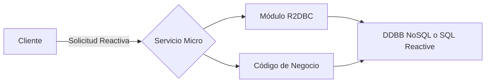

**Latencia y Tasa de Éxito/Fracaso:**

La latencia es una medida del tiempo que transcurre desde la emisión de una solicitud hasta recibir una respuesta. Es importante monitorear esta métrica para garantizar eficiencia en las comunicaciones entre servicios. La tasa de éxito/fracaso nos permite entender qué tan exitosa o fallida ha sido nuestra implementación al procesar solicitudes.

#### 2. Mejora Continua y Ajustes

Una vez establecidos los estándares de desempeño, es importante ajustar el sistema continuamente para mantener la eficacia operativa.

**Ajuste del Código:**

Realizar refactoring en código ineficiente o poco mantenible puede mejorar significativamente el rendimiento y escalabilidad del sistema. Esto incluye optimización de consultas R2DBC, simplificación de lógica compleja dentro de los microsservicios y mejora continua del patrón de diseño.

**Optimización del Código Reactivo:**

Dado que estamos trabajando con una arquitectura reactiva, es importante asegurarnos de que el código no se bloquee innecesariamente. Esto puede implicar la revisión de métodos que podrían bloquearse y encontrar formas más eficientes de realizar operaciones.

**Mantener la Configuración Actualizada:**

La gestión de configuraciones externas es fundamental para mantener un ambiente consistente entre desarrollo, pruebas y producción. Asegurar que todas las instancias tengan acceso a la última versión del archivo de configuración puede evitar problemas relacionados con versiones desactualizadas.

#### 3. Mejores Prácticas

**Pruebas Continuas:**

Las pruebas unitarias e integrales son fundamentales en una arquitectura microservicios reactivos, para garantizar que cada microsservicio funciona de manera independiente y también se integre correctamente con otros servicios.

```java
// Ejemplo de Prueba Unitaria
@ExtendWith(MockitoExtension.class)
public class ProductServiceTest {
    @Mock
    private ProductRepository productRepository;

    @InjectMocks
    private ProductServiceImpl productService;
    
    @Test
    void shouldReturnProductById() throws Exception {
        when(productRepository.findById(1L)).thenReturn(Optional.of(new Product()));
        
        Product result = productService.getProductById(1L);
        
        assertNotNull(result);
        verify(productRepository).findById(1L);
    }
}
```

**Documentación Continua:**

La documentación continua es clave para mantener la transparencia en el desarrollo y facilitar la comprensión entre diferentes equipos de trabajo. Generar automáticamente la documentación basada en OpenAPI (Swagger) puede ser una excelente práctica para asegurar que todos los servicios tengan su API claramente definida.

**Implementación de Herramientas de Monitorización:**

La implementación de herramientas como Prometheus y Grafana no sólo permite monitorear el rendimiento del sistema, sino también ayudar en la detección temprana de posibles problemas. 

#### 4. Reflexión Final

El camino hacia una arquitectura microservicios reactiva con Spring Boot 3.3 y R2DBC es un viaje constante de aprendizaje y mejora. A medida que las tecnologías evolucionan, es fundamental mantenerse al tanto para implementar soluciones más eficientes y escalables. 

Al final del día, la clave reside en adoptar una mentalidad ágil y estar dispuesto a adaptarse y aprender continuamente.

---

Con estas consideraciones finales, estamos equipados para abordar los desafíos inherentes al diseño y mantenimiento de sistemas basados en microservicios reactivos con Spring Boot 3.3 y R2DBC.

