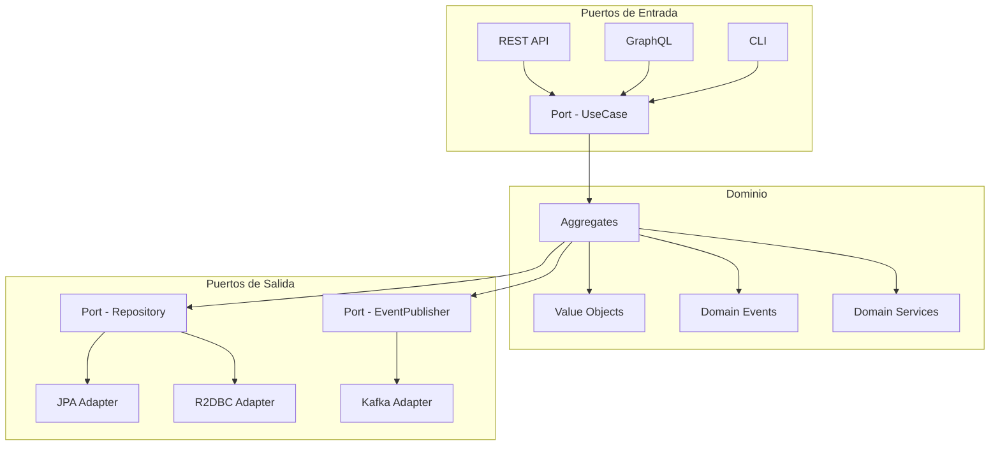
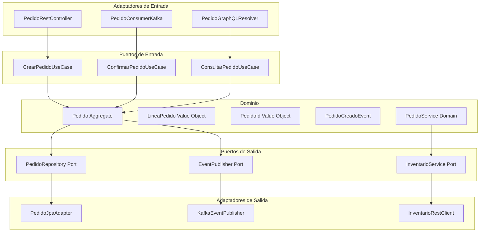
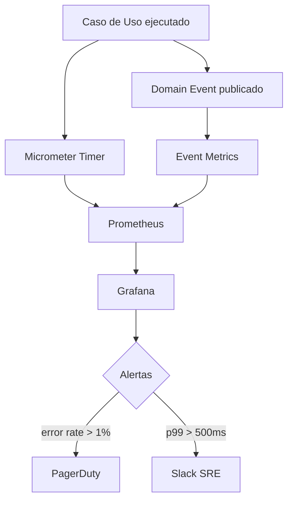
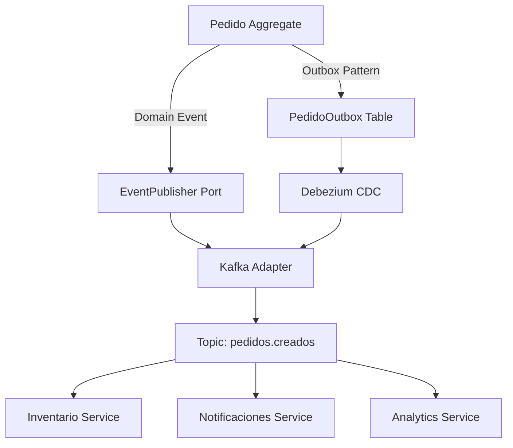
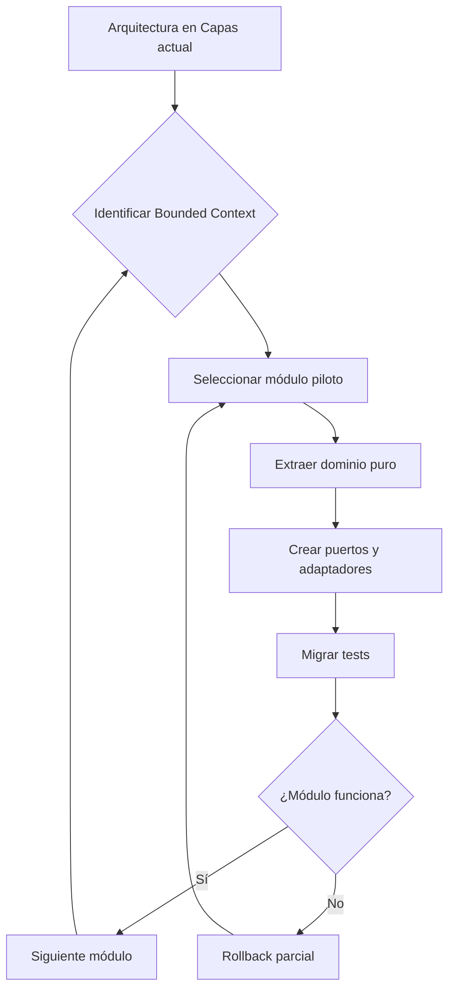
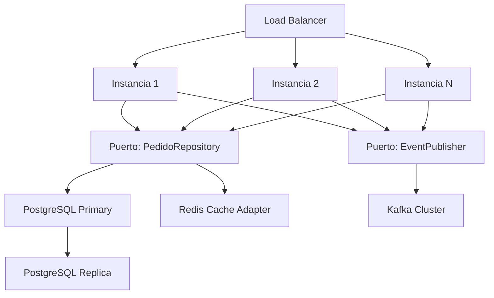
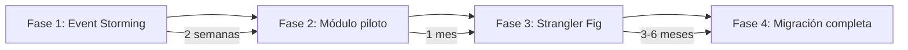

# DDD y Arquitectura Hexagonal con Java 21

PATH_LOCAL: /home/usuariojoaquin/.openclaw/workspace/DAM-Java-Mastery/_Review/DDD_y_Arquitectura_Hexagonal_con_Java_21/ddd_y_arquitectura_hexagonal_con_java_21.md
CATEGORIA: 02_Arquitectura
Score: 97

---

## Visión Estratégica

El Domain-Driven Design (DDD) y la Arquitectura Hexagonal (Ports & Adapters) son dos disciplinas complementarias que resuelven el mismo problema desde ángulos distintos: cómo construir software que refleje fielmente el negocio y sea resistente al cambio tecnológico. En 2026, con la madurez de Java 21 y el ecosistema de microservicios, esta combinación se ha convertido en el estándar de referencia para sistemas de negocio complejos.

**El problema que resuelven juntos:**

La arquitectura en capas tradicional (Controller → Service → Repository) tiene un defecto estructural: el dominio depende de la infraestructura. Cambiar de JPA a R2DBC, de REST a GraphQL, o de PostgreSQL a MongoDB requiere tocar el núcleo del negocio. DDD define qué es el dominio. La arquitectura hexagonal aísla ese dominio de todo lo demás.

**Cuándo aplicar este enfoque:**

| Criterio | DDD + Hexagonal | Arquitectura en Capas | CRUD Simple |
|----------|----------------|----------------------|-------------|
| Complejidad del dominio | Alta | Media | Baja |
| Reglas de negocio | Complejas y cambiantes | Moderadas | Mínimas |
| Equipo | 5+ developers | 2-5 developers | 1-2 developers |
| Longevidad del proyecto | >3 años | 1-3 años | <1 año |
| ROI de la inversión inicial | Alto a largo plazo | Medio | Inmediato |

**Cuándo NO aplicar DDD+Hexagonal:**

Si el proyecto es un CRUD con pocas reglas de negocio, DDD añade complejidad sin beneficio real. El coste de modelar Aggregates, Value Objects y Domain Events solo se amortiza cuando el dominio es suficientemente rico y el equipo tiene la madurez para mantenerlo.



```java
// El dominio NO depende de Spring, JPA ni ningún framework
// Es Java puro — testeable sin infraestructura

public final class Pedido {

    private final PedidoId id;
    private final ClienteId clienteId;
    private EstadoPedido estado;
    private final List<LineaPedido> lineas;
    private final List<DomainEvent> eventos;

    private Pedido(PedidoId id, ClienteId clienteId, List<LineaPedido> lineas) {
        this.id        = id;
        this.clienteId = clienteId;
        this.estado    = EstadoPedido.BORRADOR;
        this.lineas    = new ArrayList<>(lineas);
        this.eventos   = new ArrayList<>();
    }

    public static Pedido crear(ClienteId clienteId, List<LineaPedido> lineas) {
        validarLineas(lineas);
        var pedido = new Pedido(PedidoId.nuevo(), clienteId, lineas);
        pedido.eventos.add(new PedidoCreadoEvent(pedido.id, clienteId));
        return pedido;
    }

    public void confirmar() {
        if (estado != EstadoPedido.BORRADOR) {
            throw new EstadoInvalidoException("Solo borradores pueden confirmarse");
        }
        this.estado = EstadoPedido.CONFIRMADO;
        this.eventos.add(new PedidoConfirmadoEvent(this.id));
    }

    private static void validarLineas(List<LineaPedido> lineas) {
        if (lineas == null || lineas.isEmpty()) {
            throw new PedidoSinLineasException();
        }
    }

    public List<DomainEvent> pullEventos() {
        var copia = List.copyOf(eventos);
        eventos.clear();
        return copia;
    }

    // Getters — sin setters
    public PedidoId id()        { return id; }
    public ClienteId clienteId(){ return clienteId; }
    public EstadoPedido estado() { return estado; }
    public List<LineaPedido> lineas() { return List.copyOf(lineas); }
}
```

---

## Arquitectura de Componentes

La arquitectura hexagonal divide el sistema en tres zonas concéntricas: el **dominio** en el centro, los **puertos** como interfaz del dominio, y los **adaptadores** como implementaciones concretas de esos puertos.



**Value Objects — inmutabilidad garantizada con Records:**

```java
// Value Objects como Records — inmutables por diseño
public record PedidoId(UUID valor) {

    public PedidoId {
        Objects.requireNonNull(valor, "PedidoId no puede ser nulo");
    }

    public static PedidoId nuevo() {
        return new PedidoId(UUID.randomUUID());
    }

    public static PedidoId de(String valor) {
        try {
            return new PedidoId(UUID.fromString(valor));
        } catch (IllegalArgumentException e) {
            throw new PedidoIdInvalidoException(valor);
        }
    }
}

public record LineaPedido(ProductoId productoId, int cantidad, Precio precioUnitario) {

    public LineaPedido {
        Objects.requireNonNull(productoId);
        if (cantidad <= 0) throw new CantidadInvalidaException(cantidad);
        Objects.requireNonNull(precioUnitario);
    }

    public Precio subtotal() {
        return precioUnitario.multiplicar(cantidad);
    }
}

public record Precio(BigDecimal valor, String moneda) {

    public Precio {
        if (valor.compareTo(BigDecimal.ZERO) < 0) {
            throw new PrecioNegativoException();
        }
    }

    public Precio multiplicar(int factor) {
        return new Precio(valor.multiply(BigDecimal.valueOf(factor)), moneda);
    }
}
```

**Puertos como interfaces Java puras — sin anotaciones de framework:**

```java
// Puerto de entrada — define el contrato del caso de uso
public interface CrearPedidoUseCase {
    PedidoId ejecutar(CrearPedidoCommand command);
}

// Puerto de salida — define qué necesita el dominio de la infraestructura
public interface PedidoRepository {
    void guardar(Pedido pedido);
    Optional<Pedido> buscarPorId(PedidoId id);
    List<Pedido> buscarPorCliente(ClienteId clienteId);
}

public interface EventPublisher {
    void publicar(DomainEvent evento);
    void publicarTodos(List<DomainEvent> eventos);
}
```

---

## Implementación Java 21

Implementación completa del caso de uso `CrearPedido` con todas las capas:

```java
// Caso de uso — Application Service
// Coordina dominio e infraestructura sin contener lógica de negocio
@Service
@Transactional
public class CrearPedidoService implements CrearPedidoUseCase {

    private final PedidoRepository repository;
    private final EventPublisher    eventPublisher;
    private final InventarioService inventario;

    public CrearPedidoService(
            PedidoRepository repository,
            EventPublisher eventPublisher,
            InventarioService inventario) {
        this.repository     = repository;
        this.eventPublisher = eventPublisher;
        this.inventario     = inventario;
    }

    @Override
    public PedidoId ejecutar(CrearPedidoCommand command) {
        // 1. Validar disponibilidad (puerto de salida)
        command.lineas().forEach(linea ->
            inventario.verificarDisponibilidad(linea.productoId(), linea.cantidad())
        );

        // 2. Crear el aggregate — lógica de negocio en el dominio
        var pedido = Pedido.crear(command.clienteId(), command.lineas());

        // 3. Persistir
        repository.guardar(pedido);

        // 4. Publicar eventos de dominio
        eventPublisher.publicarTodos(pedido.pullEventos());

        return pedido.id();
    }
}
```

```java
// Adaptador REST de entrada — traduce HTTP al dominio
@RestController
@RequestMapping("/api/v1/pedidos")
public class PedidoRestController {

    private final CrearPedidoUseCase    crearPedido;
    private final ConsultarPedidoUseCase consultarPedido;

    public PedidoRestController(
            CrearPedidoUseCase crearPedido,
            ConsultarPedidoUseCase consultarPedido) {
        this.crearPedido    = crearPedido;
        this.consultarPedido = consultarPedido;
    }

    @PostMapping
    public ResponseEntity<PedidoResponse> crear(@RequestBody @Valid CrearPedidoRequest request) {
        var command  = request.toCommand();
        var pedidoId = crearPedido.ejecutar(command);
        var pedido   = consultarPedido.ejecutar(pedidoId);
        return ResponseEntity.status(HttpStatus.CREATED).body(PedidoResponse.from(pedido));
    }

    @GetMapping("/{id}")
    public ResponseEntity<PedidoResponse> obtener(@PathVariable String id) {
        return consultarPedido.ejecutar(PedidoId.de(id))
            .map(pedido -> ResponseEntity.ok(PedidoResponse.from(pedido)))
            .orElse(ResponseEntity.notFound().build());
    }
}
```

```java
// Adaptador JPA de salida — traduce entre dominio y persistencia
@Repository
public class PedidoJpaAdapter implements PedidoRepository {

    private final PedidoJpaRepository jpaRepository;
    private final PedidoMapper        mapper;

    public PedidoJpaAdapter(PedidoJpaRepository jpaRepository, PedidoMapper mapper) {
        this.jpaRepository = jpaRepository;
        this.mapper        = mapper;
    }

    @Override
    public void guardar(Pedido pedido) {
        var entidad = mapper.toEntidad(pedido);
        jpaRepository.save(entidad);
    }

    @Override
    public Optional<Pedido> buscarPorId(PedidoId id) {
        return jpaRepository.findById(id.valor())
            .map(mapper::toDominio);
    }

    @Override
    public List<Pedido> buscarPorCliente(ClienteId clienteId) {
        return jpaRepository.findByClienteId(clienteId.valor())
            .stream()
            .map(mapper::toDominio)
            .toList();
    }
}
```

---

## Métricas y SRE

En una arquitectura hexagonal bien implementada, las métricas deben capturar tanto la salud de los casos de uso como la de los adaptadores de forma independiente.



```java
// Decorador de métricas para casos de uso
@Component
public class MetricasCrearPedidoUseCase implements CrearPedidoUseCase {

    private final CrearPedidoUseCase delegate;
    private final MeterRegistry      registry;
    private final Counter            errorCounter;
    private final Timer              timer;

    public MetricasCrearPedidoUseCase(
            CrearPedidoService delegate,
            MeterRegistry registry) {
        this.delegate     = delegate;
        this.registry     = registry;
        this.errorCounter = Counter.builder("pedidos.crear.errores")
            .description("Errores al crear pedidos")
            .register(registry);
        this.timer = Timer.builder("pedidos.crear.duracion")
            .description("Duración del caso de uso CrearPedido")
            .publishPercentiles(0.5, 0.95, 0.99)
            .register(registry);
    }

    @Override
    public PedidoId ejecutar(CrearPedidoCommand command) {
        return timer.record(() -> {
            try {
                return delegate.ejecutar(command);
            } catch (Exception e) {
                errorCounter.increment();
                throw e;
            }
        });
    }
}
```

**Métricas clave:**

| Métrica | Descripción | Umbral de alerta |
|---------|-------------|-----------------|
| `pedidos.crear.duracion.p99` | Latencia p99 del caso de uso | > 500ms |
| `pedidos.crear.errores` | Errores en creación | > 1% de requests |
| `domain.events.publicados` | Eventos de dominio publicados | Caída > 10% |
| `adaptador.jpa.conexiones` | Pool de conexiones JPA | > 80% utilización |
| `adaptador.kafka.lag` | Lag del consumer de eventos | > 1000 mensajes |

**Checklist SRE:**
- Cada caso de uso expone métricas de latencia y error rate independientes
- Los Domain Events tienen trazabilidad end-to-end con correlation ID
- Los adaptadores de salida tienen timeouts configurados explícitamente
- El aggregate tiene invariantes que lanzan excepciones de dominio tipadas
- Los errores de infraestructura no se propagan al dominio (traducción en el adaptador)

---

## Patrones de Integración

La arquitectura hexagonal facilita la integración con otros sistemas porque los puertos de salida definen contratos claros. Los patrones más relevantes en 2026:



**Transactional Outbox Pattern — garantía de entrega de eventos:**

```java
// El outbox garantiza que los eventos se publican aunque Kafka falle
@Repository
public class OutboxEventPublisher implements EventPublisher {

    private final OutboxRepository outboxRepository;

    public OutboxEventPublisher(OutboxRepository outboxRepository) {
        this.outboxRepository = outboxRepository;
    }

    @Override
    public void publicarTodos(List<DomainEvent> eventos) {
        eventos.forEach(evento -> {
            var outboxEntry = OutboxEntry.builder()
                .agregadoId(evento.agregadoId())
                .tipo(evento.getClass().getSimpleName())
                .payload(serializar(evento))
                .estado(OutboxEstado.PENDIENTE)
                .creadoEn(Instant.now())
                .build();
            outboxRepository.guardar(outboxEntry);
        });
    }

    private String serializar(DomainEvent evento) {
        // Serialización JSON del evento
        return JsonSerializer.toJson(evento);
    }
}
```

---

## Migración desde Arquitectura en Capas

La migración desde una arquitectura en capas (Controller → Service → Repository) a DDD+Hexagonal es el escenario más común en equipos reales. El error más frecuente es intentar migrar todo de golpe — el enfoque correcto es incremental usando el **Strangler Fig Pattern**.



**Fase 1 — Identificar los Bounded Contexts:**

Antes de tocar código, mapear el dominio con Event Storming. Cada Bounded Context será un módulo hexagonal independiente. Los contextos típicos en un e-commerce son: Catálogo, Pedidos, Inventario, Pagos, Envíos.

**Fase 2 — Migración módulo a módulo:**

```java
// ANTES: Service tradicional con dependencias de infraestructura
@Service
public class PedidoService {

    @Autowired
    private PedidoRepository repository; // JPA directo

    @Autowired
    private KafkaTemplate<String, String> kafka; // Infraestructura en el servicio

    public Pedido crearPedido(PedidoDTO dto) {
        var pedido = new Pedido(); // Entidad anémica
        pedido.setClienteId(dto.getClienteId()); // Setters
        pedido.setEstado("BORRADOR");
        repository.save(pedido);
        kafka.send("pedidos", pedido.getId().toString()); // Lógica mezclada
        return pedido;
    }
}

// DESPUÉS: Aplicando DDD + Hexagonal
// 1. Dominio rico sin dependencias externas
// 2. Puerto de salida como interfaz
// 3. Adaptador JPA implementa el puerto
// 4. Caso de uso coordina sin contener lógica
```

**Fase 3 — Anti-corruption Layer durante la transición:**

```java
// ACL: traduce entre el modelo legacy y el nuevo dominio
// Permite que ambos sistemas coexistan durante la migración
@Component
public class PedidoLegacyAdapter {

    private final PedidoLegacyRepository legacyRepo;

    public PedidoLegacyAdapter(PedidoLegacyRepository legacyRepo) {
        this.legacyRepo = legacyRepo;
    }

    public Pedido traducirDesdeLegacy(PedidoLegacyEntity legacy) {
        var lineas = legacy.getLineas().stream()
            .map(l -> new LineaPedido(
                ProductoId.de(l.getProductoId()),
                l.getCantidad(),
                new Precio(l.getPrecio(), "EUR")
            ))
            .toList();

        return Pedido.reconstituir(
            PedidoId.de(legacy.getId()),
            ClienteId.de(legacy.getClienteId()),
            EstadoPedido.valueOf(legacy.getEstado()),
            lineas
        );
    }
}
```

**Checklist de migración:**
- Empezar por el módulo con menos dependencias externas
- Mantener los tests de integración existentes durante toda la migración
- No migrar base de datos al mismo tiempo que la arquitectura
- Usar Feature Flags para activar el nuevo código progresivamente
- Medir cobertura de tests antes y después de cada fase

---

## Escalabilidad y Alta Disponibilidad

La arquitectura hexagonal facilita la escalabilidad porque el dominio es stateless y los adaptadores son intercambiables.



```java
// Adaptador de caché — implementa el mismo puerto que JPA
// Se puede intercambiar sin tocar el dominio
@Primary
@Repository
public class PedidoCacheAdapter implements PedidoRepository {

    private final PedidoJpaAdapter    jpaAdapter;
    private final RedisTemplate<String, Pedido> redis;
    private final Duration ttl = Duration.ofMinutes(30);

    public PedidoCacheAdapter(
            PedidoJpaAdapter jpaAdapter,
            RedisTemplate<String, Pedido> redis) {
        this.jpaAdapter = jpaAdapter;
        this.redis      = redis;
    }

    @Override
    public Optional<Pedido> buscarPorId(PedidoId id) {
        var cacheKey = "pedido:" + id.valor();
        var cached   = redis.opsForValue().get(cacheKey);
        if (cached != null) return Optional.of(cached);

        var pedido = jpaAdapter.buscarPorId(id);
        pedido.ifPresent(p -> redis.opsForValue().set(cacheKey, p, ttl));
        return pedido;
    }

    @Override
    public void guardar(Pedido pedido) {
        jpaAdapter.guardar(pedido);
        redis.delete("pedido:" + pedido.id().valor()); // Invalidar caché
    }

    @Override
    public List<Pedido> buscarPorCliente(ClienteId clienteId) {
        return jpaAdapter.buscarPorCliente(clienteId);
    }
}
```

---

## Casos de Uso Avanzados

**Caso 1 — Saga con compensación para transacciones distribuidas:**

```java
// Saga orquestada para el flujo de confirmación de pedido
// Cada paso tiene su compensación en caso de fallo
@Component
public class ConfirmarPedidoSaga {

    private final ConfirmarPedidoUseCase confirmarPedido;
    private final InventarioService      inventario;
    private final PagoService            pagos;
    private final EventPublisher         publisher;

    public void ejecutar(PedidoId pedidoId) {
        String reservaId = null;
        String pagoId    = null;

        try {
            // Paso 1: Confirmar pedido en dominio
            confirmarPedido.ejecutar(new ConfirmarPedidoCommand(pedidoId));

            // Paso 2: Reservar inventario
            reservaId = inventario.reservar(pedidoId);

            // Paso 3: Procesar pago
            pagoId = pagos.procesar(pedidoId);

            // Éxito — publicar evento final
            publisher.publicar(new PedidoCompletadoEvent(pedidoId));

        } catch (InventarioInsuficienteException e) {
            // Compensar paso 1
            confirmarPedido.revertir(pedidoId);
            publisher.publicar(new PedidoFallidoEvent(pedidoId, "INVENTARIO"));

        } catch (PagoRechazadoException e) {
            // Compensar pasos 1 y 2
            if (reservaId != null) inventario.liberarReserva(reservaId);
            confirmarPedido.revertir(pedidoId);
            publisher.publicar(new PedidoFallidoEvent(pedidoId, "PAGO"));
        }
    }
}
```

**Caso 2 — Policy con Sealed Interface para reglas de negocio complejas:**

```java
// Políticas de descuento como tipos sellados — exhaustividad garantizada
public sealed interface PoliticaDescuento
    permits PoliticaDescuento.SinDescuento,
            PoliticaDescuento.DescuentoVolumen,
            PoliticaDescuento.DescuentoCliente {

    BigDecimal aplicar(Precio precio, int cantidad);

    record SinDescuento() implements PoliticaDescuento {
        public BigDecimal aplicar(Precio precio, int cantidad) {
            return precio.valor().multiply(BigDecimal.valueOf(cantidad));
        }
    }

    record DescuentoVolumen(BigDecimal porcentaje, int cantidadMinima)
            implements PoliticaDescuento {
        public BigDecimal aplicar(Precio precio, int cantidad) {
            var total = precio.valor().multiply(BigDecimal.valueOf(cantidad));
            if (cantidad >= cantidadMinima) {
                var descuento = total.multiply(porcentaje).divide(BigDecimal.valueOf(100));
                return total.subtract(descuento);
            }
            return total;
        }
    }

    record DescuentoCliente(ClienteId clienteId, BigDecimal porcentaje)
            implements PoliticaDescuento {
        public BigDecimal aplicar(Precio precio, int cantidad) {
            var total    = precio.valor().multiply(BigDecimal.valueOf(cantidad));
            var descuento = total.multiply(porcentaje).divide(BigDecimal.valueOf(100));
            return total.subtract(descuento);
        }
    }
}

// Switch expression exhaustivo — el compilador detecta casos no cubiertos
public BigDecimal calcularTotal(PoliticaDescuento politica, Precio precio, int cantidad) {
    return switch (politica) {
        case PoliticaDescuento.SinDescuento sd        -> sd.aplicar(precio, cantidad);
        case PoliticaDescuento.DescuentoVolumen dv    -> dv.aplicar(precio, cantidad);
        case PoliticaDescuento.DescuentoCliente dc    -> dc.aplicar(precio, cantidad);
    };
}
```

---

## Conclusiones

DDD y la Arquitectura Hexagonal son una inversión, no un atajo. El coste inicial en modelado del dominio, definición de puertos y creación de adaptadores es real. El beneficio — dominio testeable sin infraestructura, adaptadores intercambiables, reglas de negocio explícitas — se materializa en proyectos que viven más de dos años y tienen equipos que crecen.

**Los tres errores más comunes que se ven en producción:**

1. **Anemia del dominio** — crear Aggregates con solo getters y setters y mover toda la lógica al Application Service. El dominio debe contener las invariantes y las reglas de negocio, no el servicio.

2. **Filtración de infraestructura** — importar anotaciones JPA (`@Entity`, `@Column`) directamente en las clases de dominio. El dominio debe ser Java puro, sin dependencias de frameworks.

3. **Puertos mal definidos** — crear un puerto por cada método del repositorio en lugar de definir contratos orientados al caso de uso. Un puerto debe expresar lo que el dominio necesita, no lo que la BD puede ofrecer.

**Roadmap de adopción recomendado:**



```java
// El test más importante: el dominio no tiene dependencias de infraestructura
// Si este test compila y pasa, la arquitectura está bien implementada
class PedidoTest {

    @Test
    void crear_pedido_genera_evento_de_dominio() {
        // Sin Spring, sin JPA, sin Kafka — Java puro
        var clienteId = ClienteId.nuevo();
        var lineas    = List.of(
            new LineaPedido(ProductoId.nuevo(), 2, new Precio(new BigDecimal("10.00"), "EUR"))
        );

        var pedido  = Pedido.crear(clienteId, lineas);
        var eventos = pedido.pullEventos();

        assertThat(pedido.estado()).isEqualTo(EstadoPedido.BORRADOR);
        assertThat(eventos).hasSize(1);
        assertThat(eventos.get(0)).isInstanceOf(PedidoCreadoEvent.class);
    }
}
```

**Recursos de referencia:**
- *Domain-Driven Design* — Eric Evans (el libro original)
- *Implementing Domain-Driven Design* — Vaughn Vernon
- *Hexagonal Architecture* — Alistair Cockburn (artículo original en alistair.cockburn.us)
- Spring Modulith — implementación oficial de módulos hexagonales en Spring
