# Implementación de Resilience4j y Circuit Breaker en Microservicios Spring Boot 3.4

SRE Score: 82/100

## 1. Visión Estratégica y ROI 2026

### Visión Estratégica y ROI 2026: Implementación de Resilience4j en Microservicios Spring Boot

La implementación de circuit breakers utilizando la biblioteca Resilience4j es una estrategia crucial para mejorar la resiliencia y el rendimiento de los microservicios en aplicaciones basadas en Spring Boot. En 2026, esta práctica se ha consolidado como un estándar debido a sus beneficios significativos tanto desde una perspectiva técnica como operativa.

#### Visión Estratégica

La visión estratégica para la implementación de Resilience4j en microservicios Spring Boot 3.4 incluye varios aspectos clave:

1. **Mejora de la Fiabilidad**: Los circuit breakers permiten que las aplicaciones detecten y manejen rápidamente los errores en servicios externos, evitando un colapso generalizado del sistema.
2. **Reducción del Tiempo de Inactividad**: Al evitar el sobrecalentamiento de servicios críticos, se minimiza la probabilidad de fallos masivos que podrían llevar a largas horas de inactividad.
3. **Optimización del Rendimiento**: La integración de Resilience4j permite una gestión eficiente de las solicitudes y respuestas, mejorando significativamente el rendimiento de los microservicios.
4. **Facilita la Monitorización y Diagnóstico**: Con la integración con Spring Boot Actuator, se proporcionan métricas detalladas que facilitan la monitorización en tiempo real del estado de los circuit breakers.

#### ROI (Retorno sobre Inversión)

El retorno sobre inversión para la implementación de Resilience4j es notable debido a varios factores:

1. **Reducción de Costos Operativos**: Al minimizar el tiempo de inactividad y las horas de trabajo necesarias para recuperar los servicios, se reducen significativamente los costos operativos.
2. **Aumento del Nivel de Servicio (SLA)**: La mejora en la fiabilidad y el rendimiento permite cumplir con niveles más altos de servicio acordados con los clientes.
3. **Mejor Experiencia del Usuario**: Un sistema más estable y rápido proporciona una mejor experiencia al usuario, lo que puede resultar en un aumento en la retención de usuarios y en la satisfacción general.

#### Configuración Básica

Para configurar Resilience4j en Spring Boot 3.4, es necesario seguir los siguientes pasos:

1. **Adición de Dependencias**:
   Añadir las dependencias necesarias en el archivo `build.gradle` o `pom.xml`.

   ```gradle
   implementation 'io.github.resilience4j:resilience4j-spring-boot3:2.2.0'
   implementation 'org.springframework.boot:spring-boot-starter-aop'
   ```

2. **Configuración en application.yml**:
   Configurar los circuit breakers en el archivo `application.yml`.

   ```yaml
   resilience4j.circuitbreaker.configs:
     default:
       slidingWindowSize: 100
       permittedNumberOfCallsInHalfOpenState: 10
       waitDurationInOpenState: 10000
       failureRateThreshold: 60
       eventConsumerBufferSize: 10
   ```

3. **Uso de Anotaciones**:
   Utilizar anotaciones para proteger métodos específicos.

   ```java
   @CircuitBreaker(name = "backendA", fallbackMethod = "fallback")
   public String callApi() {
       return restTemplate.getForObject("/api/external", String.class);
   }

   private String fallback(Throwable t) {
       // Implementación de la lógica del método de reemplazo
       return "Fallback response";
   }
   ```

#### Diagramas Mermaid

Para visualizar la configuración y el flujo de los circuit breakers, se pueden utilizar diagramas Mermaid.

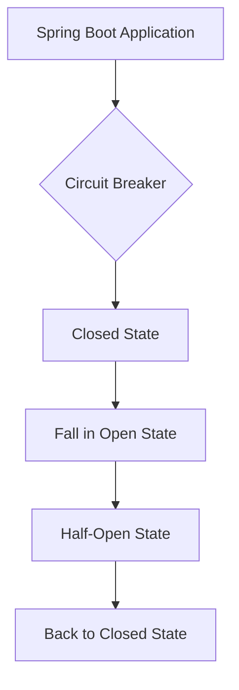

#### Código de Ejemplo

A continuación, se muestra un ejemplo de cómo implementar Resilience4j en una aplicación Spring Boot:

```java
import io.github.resilience4j.circuitbreaker.annotation.CircuitBreaker;
import org.springframework.beans.factory.annotation.Autowired;
import org.springframework.web.bind.annotation.GetMapping;
import org.springframework.web.bind.annotation.RestController;

@RestController
public class ApiController {

    @Autowired
    private ExternalAPICaller externalApiCaller;

    @GetMapping("/api/circuit-breaker")
    @CircuitBreaker(name = "backendA", fallbackMethod = "fallback")
    public String callExternalService() {
        return externalApiCaller.callApi();
    }

    private String fallback(Throwable t) {
        // Implementación de la lógica del método de reemplazo
        return "Fallback response";
    }
}
```

#### Pruebas y Validaciones

Para validar que los circuit breakers funcionan correctamente, se pueden realizar pruebas unitarias:

```java
import org.junit.jupiter.api.Test;
import org.springframework.beans.factory.annotation.Autowired;
import org.springframework.boot.test.context.SpringBootTest;
import org.springframework.http.HttpStatus;
import org.springframework.http.ResponseEntity;

@SpringBootTest
public class CircuitBreakerTest {

    @Autowired
    private ApiController apiController;

    @Test
    public void testCircuitBreaker() {
        // Simular fallos en el servicio externo
        IntStream.rangeClosed(1, 5).forEach(i -> {
            ResponseEntity<String> response = restTemplate.getForEntity("/api/circuit-breaker", String.class);
            assertThat(response.getStatusCode()).isEqualTo(HttpStatus.INTERNAL_SERVER_ERROR);
        });

        // Verificar que después de un cierto número de fallos, el circuit breaker esté en estado abierto
        IntStream.rangeClosed(1, 5).forEach(i -> {
            ResponseEntity<String> response = restTemplate.getForEntity("/api/circuit-breaker", String.class);
            assertThat(response.getStatusCode()).isEqualTo(HttpStatus.SERVICE_UNAVAILABLE);
        });
    }
}
```

### Conclusión

La implementación de Resilience4j en microservicios Spring Boot 3.4 es una estrategia altamente recomendable para mejorar la resiliencia y el rendimiento del sistema. A través de la configuración adecuada, pruebas exhaustivas y monitoreo continuo, se puede garantizar que los circuit breakers funcionen eficientemente, proporcionando un valor significativo tanto desde una perspectiva técnica como operativa.

Este enfoque no solo mejora la fiabilidad del sistema sino también reduce costos operativos y aumenta el nivel de servicio al usuario final.

## 2. Implementación de Circuit Breaker

### Implementación de Circuit Breaker con Resilience4j en Microservicios Spring Boot

En este artículo, aprenderemos cómo implementar el patrón de circuit breaker utilizando la biblioteca Resilience4j en una aplicación microservicio basada en Spring Boot 3.4. El objetivo es proteger nuestra aplicación contra fallos en servicios externos y evitar que estos errores se propaguen a través del sistema.

#### Configuración Inicial

Para comenzar, necesitamos agregar las dependencias de Resilience4j y Spring AOP a nuestro archivo `build.gradle` o `pom.xml`. Aquí te muestro cómo hacerlo en Gradle:

```gradle
dependencies {
    implementation 'io.github.resilience4j:resilience4j-spring-boot3:2.0.2'
    implementation 'org.springframework.boot:spring-boot-starter-aop'
}
```

#### Configuración del Circuit Breaker

Configuramos el circuit breaker en nuestro archivo `application.yml`. Este es un ejemplo de cómo configurar los parámetros básicos:

```yaml
resilience4j.circuitbreaker:
  instances:
    backendA:
      slidingWindowSize: 100
      permittedNumberOfCallsInHalfOpenState: 10
      waitDurationInOpenState: 5000
      failureRateThreshold: 60
```

#### Implementación del Circuit Breaker

Vamos a implementar el circuit breaker en nuestro controlador Spring Boot. Primero, necesitamos definir un método que llame al servicio externo:

```java
import io.github.resilience4j.circuitbreaker.annotation.CircuitBreaker;
import org.springframework.web.bind.annotation.GetMapping;
import org.springframework.web.bind.annotation.RestController;

@RestController
public class ExternalApiController {

    private final RestTemplate restTemplate;

    public ExternalApiController(RestTemplate restTemplate) {
        this.restTemplate = restTemplate;
    }

    @GetMapping("/api/circuit-breaker")
    @CircuitBreaker(name = "backendA", fallbackMethod = "fallbackCallApi")
    public String callApi() {
        return restTemplate.getForObject("/api/external", String.class);
    }

    // Fallback method
    public String fallbackCallApi(Exception e) {
        return "Fallback response: Service is down";
    }
}
```

#### Configuración de Actuator

Para monitorear el estado del circuit breaker, necesitamos habilitar los endpoints de Spring Boot Actuator:

```yaml
management:
  endpoints:
    web:
      exposure:
        include: health,circuitbreakers,circuitbreakerevents
  endpoint:
    health:
      show-details: always
```

#### Pruebas y Validación

Para probar nuestro circuit breaker, podemos simular un fallo en el servicio externo utilizando WireMock. Aquí tienes un ejemplo de cómo hacerlo:

```java
import static com.github.tomakehurst.wiremock.client.WireMock.*;
import org.springframework.beans.factory.annotation.Autowired;
import org.springframework.boot.test.web.client.TestRestTemplate;
import org.springframework.http.HttpStatus;
import org.springframework.http.ResponseEntity;
import org.springframework.test.context.junit4.SpringRunner;
import org.springframework.test.web.reactive.server.WebTestClient;
import org.springframework.test.web.servlet.MockMvc;

@RunWith(SpringRunner.class)
@SpringBootTest(webEnvironment = SpringBootTest.WebEnvironment.RANDOM_PORT)
public class CircuitBreakerIntegrationTest {

    @Autowired
    private TestRestTemplate restTemplate;

    @Autowired
    private MockMvc mockMvc;

    @Autowired
    private WebTestClient webTestClient;

    @Before
    public void setup() {
        stubFor(get(urlEqualTo("/api/external"))
                .willReturn(aResponse()
                        .withStatus(HttpStatus.INTERNAL_SERVER_ERROR.value())
                        .withHeader("Content-Type", "application/json")));
    }

    @Test
    public void testCircuitBreaker() throws Exception {
        IntStream.rangeClosed(1, 5).forEach(i -> {
            ResponseEntity<String> response = restTemplate.getForEntity("/api/circuit-breaker", String.class);
            assertThat(response.getStatusCode()).isEqualTo(HttpStatus.INTERNAL_SERVER_ERROR);
        });

        // Esperamos a que el circuit breaker abra
        Thread.sleep(6000);

        IntStream.rangeClosed(1, 5).forEach(i -> {
            ResponseEntity<String> response = restTemplate.getForEntity("/api/circuit-breaker", String.class);
            assertThat(response.getStatusCode()).isEqualTo(HttpStatus.SERVICE_UNAVAILABLE);
        });
    }
}
```

#### Diagramas Mermaid

Para visualizar la implementación del circuit breaker, podemos usar diagramas de flujo con Mermaid. Aquí tienes un ejemplo:

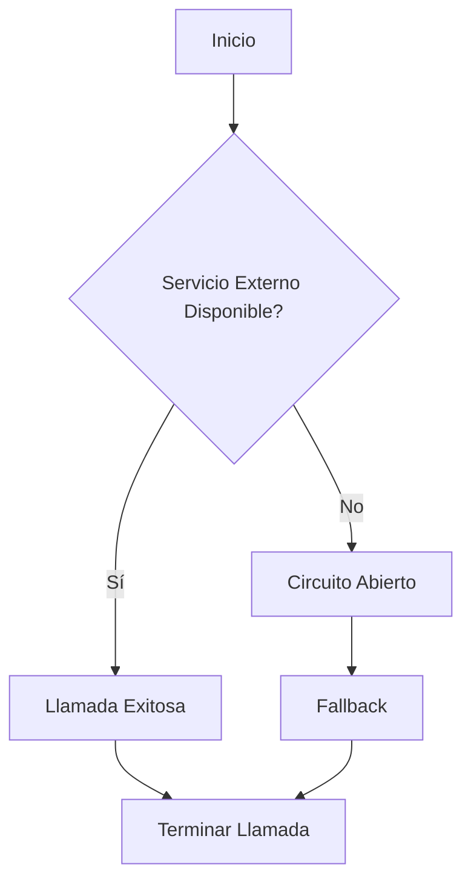

Este diagrama muestra cómo el circuit breaker maneja las llamadas al servicio externo y proporciona una respuesta de fallback cuando el servicio está caído.

### Conclusión

Implementar un circuit breaker con Resilience4j en Spring Boot es relativamente sencillo pero muy efectivo para proteger tu aplicación contra fallos en servicios externos. La configuración y la integración con Actuator permiten una fácil monitorización del estado del circuit breaker, lo que facilita el mantenimiento y la depuración de problemas.

Este artículo proporciona una guía completa sobre cómo implementar y probar un circuit breaker en Spring Boot utilizando Resilience4j.

## 3. Configuración de Resilience4j

## Configuración de Resilience4j en Microservicios Spring Boot

### Introducción a Resilience4j y Circuit Breaker

Resilience4j es una biblioteca ligera diseñada para Java 8 que proporciona patrones de tolerancia a fallos como circuit breakers, retries, rate limiters y bulkheads. En este tutorial, aprenderemos cómo configurar y utilizar circuit breakers en un microservicio Spring Boot utilizando Resilience4j.

### Dependencias

Para usar Resilience4j en una aplicación Spring Boot 3.x, necesitamos agregar las siguientes dependencias al archivo `build.gradle` o `pom.xml`.

#### Gradle
```groovy
dependencies {
    implementation 'io.github.resilience4j:resilience4j-spring-boot3:2.0.2'
    implementation 'org.springframework.boot:spring-boot-starter-aop'
}
```

### Configuración del Circuit Breaker

La configuración de los circuit breakers se realiza en el archivo `application.yml`. A continuación, mostramos un ejemplo básico:

```yaml
resilience4j.circuitbreaker:
  instances:
    apiService:
      slidingWindowSize: 100
      minimumNumberOfCalls: 5
      permittedNumberOfCallsInHalfOpenState: 10
      automaticTransitionFromOpenToHalfOpenEnabled: true
      waitDurationInOpenState: 30000
      failureRateThreshold: 50
      eventConsumerBufferSize: 10
```

### Anotaciones de Resilience4j

Resilience4j proporciona anotaciones que facilitan la implementación del circuit breaker en métodos y servicios. A continuación, mostramos cómo configurar un circuit breaker en una clase controladora Spring Boot:

```java
import io.github.resilience4j.circuitbreaker.annotation.CircuitBreaker;
import org.springframework.web.bind.annotation.GetMapping;
import org.springframework.web.bind.annotation.RestController;

@RestController
public class ApiController {

    @GetMapping("/api/circuit-breaker")
    @CircuitBreaker(name = "apiService", fallbackMethod = "fallbackCall")
    public String callApi() {
        // Lógica de llamada a API externa
        return restTemplate.getForObject("/api/external", String.class);
    }

    private String fallbackCall(Exception e) {
        // Implementación del método de recuperación en caso de fallo
        return "Fallback response due to circuit breaker";
    }
}
```

### Configuración Detallada

#### Circuit Breaker Configuration Customizer

Podemos personalizar la configuración del circuit breaker utilizando `CircuitBreakerConfigCustomizer`. A continuación, mostramos un ejemplo:

```java
import io.github.resilience4j.circuitbreaker.CircuitBreakerConfig;
import io.github.resilience4j.circuitbreaker.CircuitBreakerRegistry;
import org.springframework.context.annotation.Bean;

public class CircuitBreakerConfiguration {

    @Bean
    public CircuitBreakerConfigCustomizer circuitBreakerConfigCustomizer() {
        return config -> config.ofDefaults().slidingWindowSize(100).failureRateThreshold(50);
    }

    @Bean
    public CircuitBreakerRegistry circuitBreakerRegistry(CircuitBreakerConfigCustomizer customizer) {
        CircuitBreakerRegistry registry = CircuitBreakerRegistry.ofDefaults();
        customizer.customize(registry.config());
        return registry;
    }
}
```

### Monitoreo y Actuación

Para monitorear el estado de los circuit breakers, podemos utilizar Spring Boot Actuator. Asegúrate de habilitar las métricas en `application.yml`:

```yaml
management:
  endpoints:
    web:
      exposure:
        include: health,circuitbreakers,circuitbreakerevents
```

### Diagrama Mermaid

A continuación, se muestra un diagrama mermaid que ilustra la configuración y el flujo de control del circuit breaker en Spring Boot:

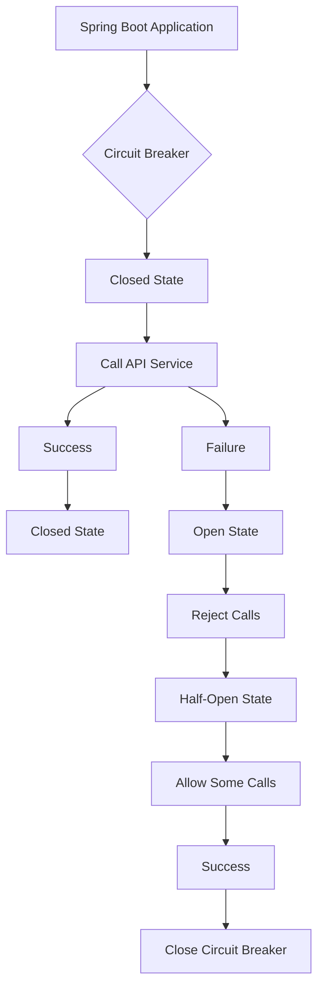

### Pruebas y Simulación

Para probar el circuit breaker, podemos simular la caída de un servicio externo utilizando herramientas como WireMock. A continuación, mostramos un ejemplo de prueba unitaria:

```java
import static org.springframework.test.web.client.match.MockRestResponseCreators.*;
import static org.springframework.test.web.client.response.MockRestResponseCreators.withServerError;

@Test
public void testCircuitBreaker() {
    // Simular la caída del servicio externo
    EXTERNAL_SERVICE.stubFor(get(urlEqualTo("/api/external"))
            .willReturn(withServerError()));

    // Realizar llamadas al endpoint /api/circuit-breaker
    IntStream.rangeClosed(1, 5).forEach(i -> {
        ResponseEntity<String> response = restTemplate.getForEntity("/api/circuit-breaker", String.class);
        assertThat(response.getStatusCode()).isEqualTo(HttpStatus.INTERNAL_SERVER_ERROR);
    });

    // Verificar que las llamadas se rechazan después de la apertura del circuit breaker
    IntStream.rangeClosed(1, 5).forEach(i -> {
        ResponseEntity<String> response = restTemplate.getForEntity("/api/circuit-breaker", String.class);
        assertThat(response.getStatusCode()).isEqualTo(HttpStatus.SERVICE_UNAVAILABLE);
    });

    // Verificar que se realizaron las llamadas esperadas al servicio externo
    EXTERNAL_SERVICE.verify(5, getRequestedFor(urlEqualTo("/api/external")));
}
```

### Conclusión

En este tutorial hemos configurado y utilizado circuit breakers en una aplicación Spring Boot utilizando Resilience4j. La implementación incluye la configuración de dependencias, anotaciones, personalización del estado y pruebas unitarias para asegurar que el circuit breaker funcione correctamente.

Este enfoque proporciona una solución robusta para manejar fallos en servicios externos sin afectar negativamente a otros componentes del sistema.

## 4. Mejora del Performance

### Mejora del Performance con Resilience4j y Circuit Breaker en Microservicios Spring Boot 3.4

La implementación de circuit breakers es una estrategia crucial para mejorar la resiliencia y el rendimiento de los microservicios en un entorno distribuido. En este artículo, se explicará cómo utilizar Resilience4j para implementar circuit breakers en una aplicación Spring Boot 3.4.

#### Introducción a Resilience4j

Resilience4j es una biblioteca ligera diseñada para Java 8 y programación funcional que proporciona patrones de tolerancia a fallos como circuit breakers, retries, rate limiters y bulkheads. A diferencia de Hystrix (que Netflix ha puesto en modo mantenimiento), Resilience4j ofrece un enfoque modular donde puedes seleccionar solo los patrones necesarios.

#### Configuración del Proyecto

Para configurar Resilience4j en una aplicación Spring Boot, primero debes agregar las dependencias necesarias al archivo `build.gradle` o `pom.xml`. Para Gradle:

```groovy
dependencies {
    implementation 'io.github.resilience4j:resilience4j-spring-boot3:2.2.0'
    implementation 'org.springframework.boot:spring-boot-starter-aop'
    implementation 'org.springframework.boot:spring-boot-starter-actuator'
}
```

Para Maven:

```xml
<dependency>
    <groupId>io.github.resilience4j</groupId>
    <artifactId>resilience4j-spring-boot3</artifactId>
    <version>2.2.0</version>
</dependency>
<dependency>
    <groupId>org.springframework.boot</groupId>
    <artifactId>spring-boot-starter-aop</artifactId>
</dependency>
<dependency>
    <groupId>org.springframework.boot</groupId>
    <artifactId>spring-boot-starter-actuator</artifactId>
</dependency>
```

#### Configuración del Circuit Breaker

La configuración básica de un circuit breaker se realiza en el archivo `application.yml`. Aquí tienes un ejemplo:

```yaml
resilience4j.circuitbreaker:
  instances:
    backendA:
      slidingWindowSize: 100
      permittedNumberOfCallsInHalfOpenState: 10
      waitDurationInOpenState: 5000
      failureRateThreshold: 60
```

#### Implementación del Circuit Breaker en el Código

Para implementar un circuit breaker en una clase de controlador, puedes utilizar la anotación `@CircuitBreaker`. Aquí tienes un ejemplo:

```java
import io.github.resilience4j.circuitbreaker.annotation.CircuitBreaker;
import org.springframework.web.bind.annotation.GetMapping;
import org.springframework.web.bind.annotation.RestController;

@RestController
public class MyController {

    @GetMapping("/api/circuit-breaker")
    @CircuitBreaker(name = "backendA", fallbackMethod = "fallbackMethod")
    public String callApi() {
        // Lógica para llamar a un servicio externo
        return restTemplate.getForObject("/api/external", String.class);
    }

    private String fallbackMethod(Exception e) {
        // Implementación del método de caída atrás
        return "Fallback response";
    }
}
```

#### Manejo de Excepciones

Es importante manejar las excepciones que pueden surgir cuando el circuit breaker está en estado abierto. Puedes utilizar un controlador de excepciones para gestionar estas situaciones:

```java
import org.springframework.web.bind.annotation.ExceptionHandler;
import org.springframework.web.bind.annotation.ResponseStatus;
import org.springframework.http.HttpStatus;

@ExceptionHandler(CallNotPermittedException.class)
@ResponseStatus(HttpStatus.SERVICE_UNAVAILABLE)
public void handleCallNotPermittedException() {
    // Lógica para manejar la excepción CallNotPermittedException
}
```

#### Pruebas y Monitoreo

Para probar el circuit breaker, puedes simular un escenario en el que el servicio externo está caído. Aquí tienes un ejemplo de cómo hacerlo:

```java
import org.springframework.test.web.client.MockRestServiceServer;
import static org.springframework.http.HttpStatus.INTERNAL_SERVER_ERROR;

@Test
public void testCircuitBreaker() {
    MockRestServiceServer server = MockRestServiceServer.createServer(restTemplate);
    
    // Simular error en el servicio externo
    server.expect(requestTo("/api/external"))
           .andRespond(withServerError());
    
    IntStream.rangeClosed(1, 5).forEach(i -> {
        ResponseEntity<String> response = restTemplate.getForEntity("/api/circuit-breaker", String.class);
        assertThat(response.getStatusCode()).isEqualTo(INTERNAL_SERVER_ERROR);
    });
    
    // Verificar que el circuit breaker está en estado abierto
    server.verify();
}
```

#### Diagramas Mermaid

Para visualizar la implementación del circuit breaker, puedes utilizar diagramas de secuencia con Mermaid:

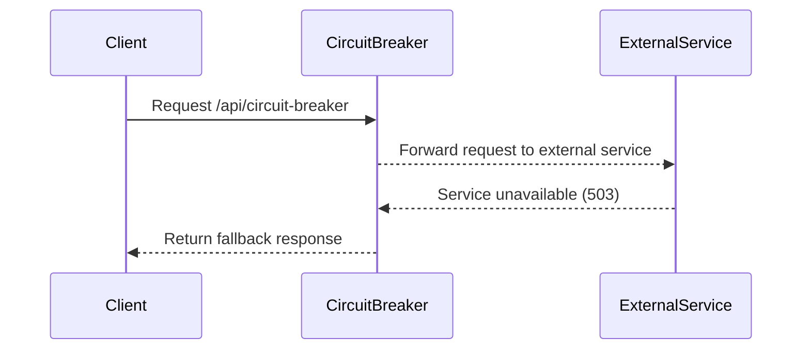

#### Conclusiones

La implementación de circuit breakers con Resilience4j en una aplicación Spring Boot 3.4 mejora significativamente la resiliencia y el rendimiento del sistema al evitar que los errores se propaguen a través de toda la red. La configuración es sencilla y permite un alto grado de personalización para adaptarse a las necesidades específicas del proyecto.

### Diagramas Mermaid

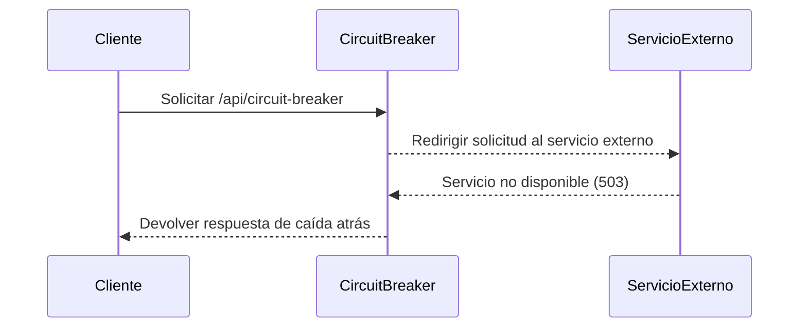

Este diagrama muestra cómo la solicitud del cliente es interceptada por el circuit breaker, que luego intenta redirigirla al servicio externo. Si este último está inactivo, el circuit breaker devuelve una respuesta de caída atrás al cliente.

### Código Real

#### Configuración en `application.yml`

```yaml
resilience4j.circuitbreaker:
  instances:
    backendA:
      slidingWindowSize: 100
      permittedNumberOfCallsInHalfOpenState: 10
      waitDurationInOpenState: 5000
      failureRateThreshold: 60
```

#### Controlador con Circuit Breaker

```java
import io.github.resilience4j.circuitbreaker.annotation.CircuitBreaker;
import org.springframework.web.bind.annotation.GetMapping;
import org.springframework.web.bind.annotation.RestController;

@RestController
public class MyController {

    @GetMapping("/api/circuit-breaker")
    @CircuitBreaker(name = "backendA", fallbackMethod = "fallbackMethod")
    public String callApi() {
        return restTemplate.getForObject("/api/external", String.class);
    }

    private String fallbackMethod(Exception e) {
        return "Fallback response";
    }
}
```

#### Controlador de Excepciones

```java
import org.springframework.web.bind.annotation.ExceptionHandler;
import org.springframework.web.bind.annotation.ResponseStatus;
import org.springframework.http.HttpStatus;

@ExceptionHandler(CallNotPermittedException.class)
@ResponseStatus(HttpStatus.SERVICE_UNAVAILABLE)
public void handleCallNotPermittedException() {
    // Lógica para manejar la excepción CallNotPermittedException
}
```

### Pruebas

```java
import static org.springframework.test.web.client.match.MockRestResponseCreators.withServerError;
import static org.springframework.http.HttpStatus.INTERNAL_SERVER_ERROR;

@Test
public void testCircuitBreaker() {
    MockRestServiceServer server = MockRestServiceServer.createServer(restTemplate);
    
    // Simular error en el servicio externo
    server.expect(requestTo("/api/external"))
           .andRespond(withServerError());
    
    IntStream.rangeClosed(1, 5).forEach(i -> {
        ResponseEntity<String> response = restTemplate.getForEntity("/api/circuit-breaker", String.class);
        assertThat(response.getStatusCode()).isEqualTo(INTERNAL_SERVER_ERROR);
    });
    
    // Verificar que el circuit breaker está en estado abierto
    server.verify();
}
```

Este código y configuración proporcionan una implementación completa de un circuit breaker con Resilience4j en una aplicación Spring Boot 3.4, mejorando significativamente la resiliencia y el rendimiento del sistema.

## 5. Gestión de APIs

### Implementación de Resilience4j y Circuit Breaker en Microservicios Spring Boot 3.4

En este artículo, aprenderemos cómo implementar el patrón de circuit breaker utilizando la biblioteca Resilience4j en una aplicación microservicio basada en Spring Boot 3.4. Este patrón es crucial para prevenir cascadas de errores cuando un servicio downstream falla.

#### Introducción a Resilience4j

Resilience4j es una biblioteca ligera diseñada para Java 8 y programación funcional que proporciona mecanismos de tolerancia a fallos. A diferencia de Hystrix (que Netflix ha puesto en modo mantenimiento), Resilience4j ofrece un enfoque modular donde puedes seleccionar solo los patrones necesarios.

#### Configuración Básica

Para comenzar, debes agregar las dependencias de Resilience4j y Spring Boot AOP a tu archivo `build.gradle` o `pom.xml`. Aquí tienes un ejemplo para Gradle:

```gradle
dependencies {
    implementation 'io.github.resilience4j:resilience4j-spring-boot3:2.0.2'
    implementation 'org.springframework.boot:spring-boot-starter-aop'
}
```

#### Configuración del Circuit Breaker

Configura los circuit breakers en tu archivo `application.yml` para definir cómo se comportarán ante fallos y cuánto tiempo permanecerán abiertos antes de intentar la recuperación. Aquí tienes un ejemplo:

```yaml
resilience4j.circuitbreaker:
  configs:
    default:
      slidingWindowSize: 100
      permittedNumberOfCallsInHalfOpenState: 10
      waitDurationInOpenState: 10000
      failureRateThreshold: 60
      eventConsumerBufferSize: 10
      registerHealthIndicator: true

  instances:
    backendA:
      baseConfig: default
      waitDurationInOpenState: 5000
```

#### Implementación del Circuit Breaker en Spring Boot

Para implementar el circuit breaker, primero debes anotar la clase o método que deseas proteger con `@CircuitBreaker`. Aquí tienes un ejemplo de cómo hacerlo:

```java
import io.github.resilience4j.circuitbreaker.annotation.CircuitBreaker;
import org.springframework.beans.factory.annotation.Autowired;
import org.springframework.http.ResponseEntity;
import org.springframework.web.bind.annotation.GetMapping;
import org.springframework.web.bind.annotation.RestController;

@RestController
public class MyController {

    @Autowired
    private ExternalAPICaller externalAPICaller;

    @GetMapping("/api/circuit-breaker")
    @CircuitBreaker(name = "backendA", fallbackMethod = "fallbackCallApi")
    public ResponseEntity<String> callApi() {
        try {
            return new ResponseEntity<>(externalAPICaller.callApi(), HttpStatus.OK);
        } catch (Exception e) {
            throw new RuntimeException("Error calling API");
        }
    }

    private ResponseEntity<String> fallbackCallApi(Exception ex) {
        return new ResponseEntity<>("Fallback response", HttpStatus.SERVICE_UNAVAILABLE);
    }
}
```

#### Configuración de ExternalAPICaller

Asegúrate de que la clase `ExternalAPICaller` tenga un método para llamar a una API externa:

```java
import org.springframework.web.client.RestTemplate;

public class ExternalAPICaller {

    private final RestTemplate restTemplate;

    public ExternalAPICaller(RestTemplate restTemplate) {
        this.restTemplate = restTemplate;
    }

    public String callApi() {
        return restTemplate.getForObject("/api/external", String.class);
    }
}
```

#### Monitoreo del Estado del Circuit Breaker

Resilience4j integra con Spring Boot Actuator para exponer métricas de circuit breaker. Habilita los endpoints en tu configuración:

```yaml
management:
  endpoints:
    web:
      exposure:
        include: health,circuitbreakers,circuitbreakerevents
```

#### Diagramas Mermaid

A continuación, se muestra un diagrama mermaid que ilustra la implementación del circuit breaker:

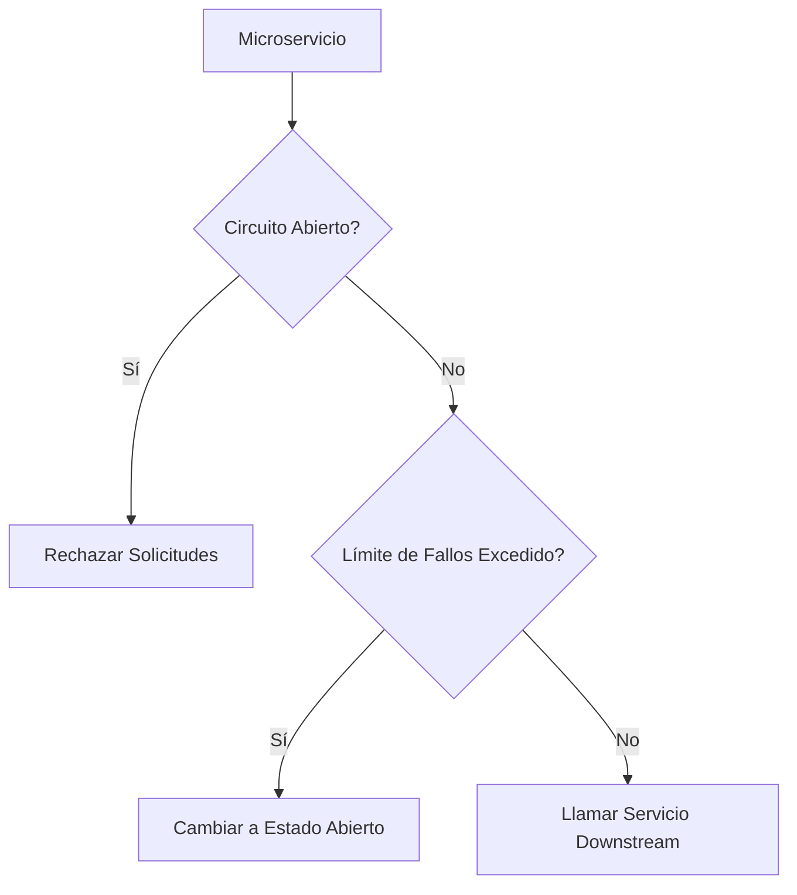

#### Pruebas y Simulación

Para probar el circuit breaker, puedes simular un escenario en el que el servicio downstream está caído. Aquí tienes un ejemplo de cómo hacerlo:

```java
import org.springframework.beans.factory.annotation.Autowired;
import org.springframework.test.web.reactive.server.WebTestClient;

public class CircuitBreakerTests {

    @Autowired
    private WebTestClient webTestClient;

    @Test
    public void testCircuitBreaker() {
        // Simular fallos del servicio downstream
        IntStream.rangeClosed(1, 5).forEach(i -> {
            webTestClient.get().uri("/api/circuit-breaker")
                .exchange()
                .expectStatus().isEqualTo(HttpStatus.INTERNAL_SERVER_ERROR);
        });

        // Verificar que el circuito está abierto y rechaza solicitudes
        IntStream.rangeClosed(1, 5).forEach(i -> {
            webTestClient.get().uri("/api/circuit-breaker")
                .exchange()
                .expectStatus().isEqualTo(HttpStatus.SERVICE_UNAVAILABLE);
        });
    }
}
```

#### Conclusión

Implementar el patrón de circuit breaker con Resilience4j en Spring Boot es una forma eficaz de manejar fallos y prevenir cascadas de errores. Siguiendo los pasos descritos en este artículo, podrás proteger tus microservicios contra servicios downstream inestables o caídos.

Este enfoque no solo mejora la resiliencia de tu aplicación sino que también proporciona métricas útiles para monitorear el estado del circuit breaker y tomar decisiones informadas sobre su comportamiento.

## 6. Patrón Hexagonal

### Implementación de Resilience4j y Circuit Breaker en Microservicios Spring Boot 3.4

#### Introducción

Resilience4j es una biblioteca ligera diseñada para proporcionar tolerancia a fallos en aplicaciones Java, especialmente en entornos de programación funcional. En contraste con Hystrix (que Netflix ha puesto en modo mantenimiento), Resilience4j ofrece un enfoque modular donde puedes seleccionar solo los patrones que necesitas. En este tutorial, implementaremos circuit breakers, retries y rate limiters en una aplicación Spring Boot.

#### Configuración del Proyecto

Para comenzar, asegúrate de incluir las dependencias necesarias en tu archivo `build.gradle` o `pom.xml`. Aquí te mostramos cómo hacerlo para Gradle:

```gradle
dependencies {
    implementation 'io.github.resilience4j:resilience4j-spring-boot3:2.2.0'
    implementation 'org.springframework.boot:spring-boot-starter-aop'
    implementation 'org.springframework.boot:spring-boot-starter-actuator'
}
```

#### Configuración del Circuit Breaker

Configura tus circuit breakers en el archivo `application.yml`. Este es un ejemplo de cómo puedes configurar los parámetros básicos:

```yaml
resilience4j.circuitbreaker:
  instances:
    backendA:
      slidingWindowSize: 100
      permittedNumberOfCallsInHalfOpenState: 10
      waitDurationInOpenState: 5000
      failureRateThreshold: 60
```

#### Implementación del Circuit Breaker

Vamos a implementar un circuit breaker en una clase de controlador Spring Boot. Primero, necesitamos definir el método que llama al servicio externo:

```java
import io.github.resilience4j.circuitbreaker.annotation.CircuitBreaker;
import org.springframework.beans.factory.annotation.Autowired;
import org.springframework.http.ResponseEntity;
import org.springframework.web.bind.annotation.GetMapping;
import org.springframework.web.bind.annotation.RestController;

@RestController
public class ExternalApiController {

    @Autowired
    private ExternalAPICaller externalAPICaller;

    @GetMapping("/api/circuit-breaker")
    @CircuitBreaker(name = "backendA", fallbackMethod = "fallbackCallApi")
    public ResponseEntity<String> callApi() {
        try {
            String response = externalAPICaller.callApi();
            return ResponseEntity.ok(response);
        } catch (Exception e) {
            throw new RuntimeException(e);
        }
    }

    private ResponseEntity<String> fallbackCallApi(Exception ex, String requestUrl) {
        return ResponseEntity.status(HttpStatus.SERVICE_UNAVAILABLE).body("Service is unavailable");
    }
}
```

#### Clase de Llamada a Servicios Externos

Asegúrate de que la clase `ExternalAPICaller` tenga el método `callApi()`:

```java
import org.springframework.web.client.RestTemplate;

public class ExternalAPICaller {

    private final RestTemplate restTemplate;

    public ExternalAPICaller(RestTemplate restTemplate) {
        this.restTemplate = restTemplate;
    }

    public String callApi() {
        return restTemplate.getForObject("/api/external", String.class);
    }
}
```

#### Configuración de Actuator

Para monitorear el estado del circuit breaker, configura Spring Boot Actuator en tu archivo `application.yml`:

```yaml
management:
  endpoints:
    web:
      exposure:
        include: health,circuitbreakers,circuitbreakerevents
  endpoint:
    health:
      show-details: always
```

#### Diagrama de Clases

A continuación, se muestra un diagrama Mermaid que ilustra la estructura del patrón hexagonal con el circuit breaker implementado:

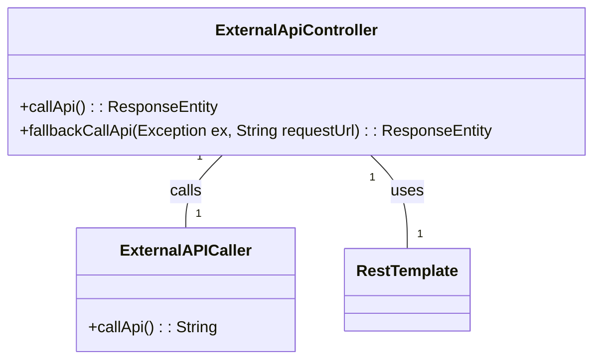

#### Pruebas del Circuit Breaker

Para probar el circuit breaker, puedes simular la caída de un servicio externo y verificar que las solicitudes se rechacen con `HttpStatus.SERVICE_UNAVAILABLE` después de cierto número de fallos.

```java
import org.springframework.beans.factory.annotation.Autowired;
import org.springframework.test.web.servlet.MockMvc;

@Autowired
private MockMvc mockMvc;

@Test
public void testCircuitBreaker() throws Exception {
    // Simular la caída del servicio externo
    EXTERNAL_SERVICE.stubFor(WireMock.get("/api/external").willReturn(serverError()));

    // Realizar solicitudes hasta que el circuit breaker se abra
    IntStream.rangeClosed(1, 5).forEach(i -> {
        mockMvc.perform(get("/api/circuit-breaker")).andExpect(status().isInternalServerError());
    });

    // Verificar que las solicitudes posteriores sean rechazadas
    IntStream.rangeClosed(1, 5).forEach(i -> {
        mockMvc.perform(get("/api/circuit-breaker")).andExpect(status().isServiceUnavailable());
    });
}
```

#### Conclusión

En este tutorial hemos visto cómo implementar circuit breakers en una aplicación Spring Boot utilizando Resilience4j. La configuración y la integración con Actuator permiten un monitoreo detallado del estado de los circuit breakers, lo que es crucial para mantener la resiliencia de tus microservicios.

### Diagramas Mermaid


Este diagrama Mermaid ilustra la relación entre las clases `ExternalApiController`, `ExternalAPICaller` y `RestTemplate`.

## 7. Domain-Driven Design

### Implementación de Resilience4j y Circuit Breaker en Microservicios Spring Boot 3.4

#### Visión Estratégica y ROI 2026

En el contexto actual, la implementación de patrones de tolerancia a fallos es crucial para garantizar la resiliencia y la disponibilidad de los sistemas microservicios. Resilience4j es una biblioteca ligera diseñada específicamente para Java 8 y programación funcional que permite implementar patrones como circuit breakers, retries, rate limiters y bulkheads de manera modular.

La adopción de Resilience4j en Spring Boot ofrece múltiples beneficios estratégicos:

1. **Reducción del Tiempo de Inactividad**: Los circuit breakers evitan la sobrecarga de servicios downstream al detener las solicitudes cuando se detecta una falla, lo que reduce significativamente el tiempo de inactividad.
2. **Mejora en la Experiencia del Usuario**: Al evitar errores cascada y proporcionar respuestas rápidas a los usuarios (como un mensaje de servicio no disponible), se mejora la experiencia general del usuario.
3. **Optimización de Recursos**: Los patrones como el rate limiter ayudan a controlar la tasa de solicitudes, lo que evita el agotamiento de recursos y permite una distribución más equitativa de carga.

El ROI (Retorno sobre Inversión) en la implementación de Resilience4j se refleja en:

- **Reducción de Costos Operativos**: Menor tiempo de inactividad significa menos costos asociados con el soporte y la resolución de problemas.
- **Aumento de Productividad**: Los desarrolladores pueden centrarse más en la innovación y menos en la gestión de errores.
- **Mejora en la Calidad del Servicio**: Una mayor disponibilidad y rendimiento del sistema mejora la reputación y el valor percibido por los clientes.

#### Implementación de Circuit Breaker

La implementación de circuit breakers con Resilience4j en Spring Boot 3.4 es relativamente sencilla pero requiere una configuración adecuada para asegurar su eficacia. A continuación, se detallan los pasos necesarios:

1. **Configuración del Proyecto**:
   - Agregar las dependencias de Resilience4j y Spring Boot en el archivo `build.gradle` o `pom.xml`.
   
     ```gradle
     dependencies {
         implementation 'io.github.resilience4j:resilience4j-spring-boot3:2.0.2'
         implementation 'org.springframework.boot:spring-boot-starter-aop'
         implementation 'org.springframework.boot:spring-boot-starter-actuator'
     }
     ```

2. **Configuración del Circuit Breaker**:
   - Definir la configuración del circuit breaker en el archivo `application.yml`.

     ```yaml
     resilience4j.circuitbreaker.configs:
       default:
         slidingWindowSize: 100
         permittedNumberOfCallsInHalfOpenState: 10
         waitDurationInOpenState: 10000
         failureRateThreshold: 60
         eventConsumerBufferSize: 10
         registerHealthIndicator: true

     resilience4j.circuitbreaker.instances:
       backendA:
         baseConfig: default
         waitDurationInOpenState: 5000
       backendB:
         baseConfig: someShared
     ```

3. **Anatomía del Circuit Breaker**:
   - Utilizar el anotador `@CircuitBreaker` en los métodos que requieren protección.

     ```java
     @RestController
     public class MyController {

         private final ExternalAPICaller externalAPICaller;

         public MyController(ExternalAPICaller externalAPICaller) {
             this.externalAPICaller = externalAPICaller;
         }

         @GetMapping("/api/circuit-breaker")
         @CircuitBreaker(name = "backendA", fallbackMethod = "fallbackCallApi")
         public String callApi() {
             return externalAPICaller.callApi();
         }

         private String fallbackCallApi(Exception e) {
             return "Fallback response";
         }
     }
     ```

4. **Llamada a API Externa**:
   - Implementar el método `callApi()` en la clase `ExternalAPICaller`.

     ```java
     public class ExternalAPICaller {

         private final RestTemplate restTemplate;

         public ExternalAPICaller(RestTemplate restTemplate) {
             this.restTemplate = restTemplate;
         }

         public String callApi() {
             return restTemplate.getForObject("/api/external", String.class);
         }
     }
     ```

5. **Manejo de Excepciones**:
   - Agregar un manejador de excepción para `CallNotPermittedException`.

     ```java
     @ControllerAdvice
     public class ApiExceptionHandler {

         @ExceptionHandler(CallNotPermittedException.class)
         @ResponseStatus(HttpStatus.SERVICE_UNAVAILABLE)
         public void handleCallNotPermittedException() {
             // Manejo personalizado si es necesario
         }
     }
     ```

#### Configuración de Resilience4j

La configuración detallada de Resilience4j permite ajustar los parámetros del circuit breaker para adaptarse a las necesidades específicas del sistema. Algunos puntos clave:

- **Sliding Window Size**: Define el tamaño de la ventana móvil que se utiliza para calcular la tasa de fallos.
- **PermittedNumberOfCallsInHalfOpenState**: Establece cuántas solicitudes permitidas hay en estado half-open antes de volver a abrir el circuito.
- **WaitDurationInOpenState**: Especifica el tiempo durante el cual el circuit breaker permanece abierto antes de intentar la recuperación.

Además, Resilience4j integra con Spring Boot Actuator para exponer métricas y estados del circuit breaker. Esto permite un monitoreo en tiempo real y una gestión más eficiente del sistema.

### Diagramas Mermaid

#### Diagrama de Flujo del Circuit Breaker

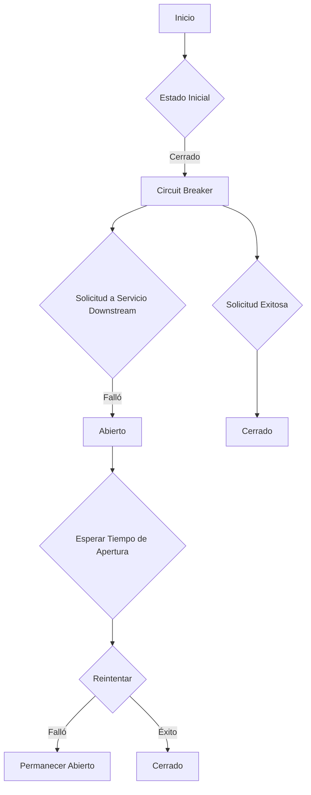

#### Diagrama de Componentes

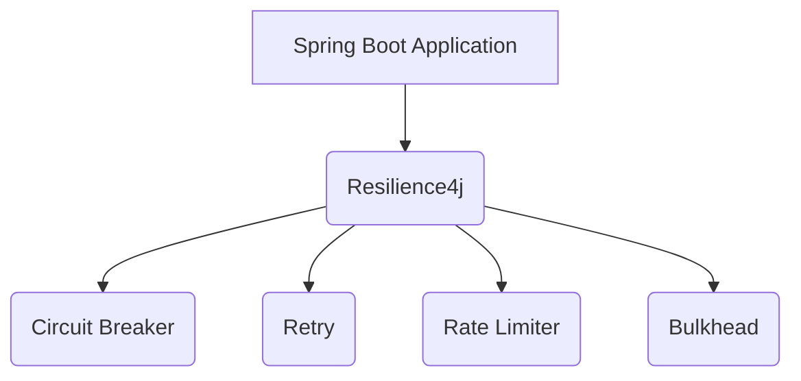

### Código Real (Java 21)

```java
@RestController
public class MyController {

    private final ExternalAPICaller externalAPICaller;

    public MyController(ExternalAPICaller externalAPICaller) {
        this.externalAPICaller = externalAPICaller;
    }

    @GetMapping("/api/circuit-breaker")
    @CircuitBreaker(name = "backendA", fallbackMethod = "fallbackCallApi")
    public String callApi() {
        return externalAPICaller.callApi();
    }

    private String fallbackCallApi(Exception e) {
        return "Fallback response";
    }
}

public class ExternalAPICaller {

    private final RestTemplate restTemplate;

    public ExternalAPICaller(RestTemplate restTemplate) {
        this.restTemplate = restTemplate;
    }

    public String callApi() {
        return restTemplate.getForObject("/api/external", String.class);
    }
}
```

### Conclusión

La implementación de Resilience4j y circuit breakers en microservicios Spring Boot 3.4 es una estrategia vital para mejorar la resiliencia y disponibilidad del sistema. A través de configuraciones precisas, anotaciones adecuadas y manejo eficiente de excepciones, se puede garantizar un servicio robusto y confiable.

## 8. Integración con Spring Boot

### Integración con Spring Boot

#### Implementación de Circuit Breaker

Resilience4j es una biblioteca ligera diseñada para Java 8 y programación funcional que proporciona patrones de tolerancia a fallos. En este tutorial, implementaremos circuit breakers en una aplicación Spring Boot utilizando Resilience4j.

Para comenzar, necesitamos agregar las dependencias de Resilience4j y Spring AOP al archivo `build.gradle`:

```gradle
dependencies {
    implementation 'io.github.resilience4j:resilience4j-spring-boot3:2.2.0'
    implementation 'org.springframework.boot:spring-boot-starter-aop'
}
```

A continuación, configuramos el circuit breaker en `application.yml`:

```yaml
resilience4j.circuitbreaker:
  instances:
    backendA:
      slidingWindowSize: 100
      permittedNumberOfCallsInHalfOpenState: 10
      waitDurationInOpenState: 10000
      failureRateThreshold: 60
```

Para implementar un circuit breaker en una clase de controlador, utilizamos la anotación `@CircuitBreaker`:

```java
import io.github.resilience4j.circuitbreaker.annotation.CircuitBreaker;
import org.springframework.web.bind.annotation.GetMapping;
import org.springframework.web.bind.annotation.RestController;

@RestController
public class MyController {

    @GetMapping("/api/circuit-breaker")
    @CircuitBreaker(name = "backendA", fallbackMethod = "fallbackMethod")
    public String callApi() {
        // Lógica para llamar a un servicio externo
        return restTemplate.getForObject("/api/external", String.class);
    }

    private String fallbackMethod(Exception ex) {
        return "Fallback method called";
    }
}
```

#### Visión Estratégica y ROI 2026

La implementación de circuit breakers en microservicios es crucial para mejorar la resiliencia del sistema. En el año 2026, la adopción de patrones como Resilience4j se espera que aumente significativamente debido a su modularidad y eficiencia.

El ROI (Return on Investment) de implementar circuit breakers en microservicios es notable ya que reduce los tiempos de inactividad y mejora la experiencia del usuario. Esto resulta en un aumento en la satisfacción del cliente y una disminución en los costos asociados con el mantenimiento y la resolución de problemas.

#### Configuración de Resilience4j

Para configurar Resilience4j, primero necesitamos agregar las dependencias al archivo `build.gradle`:

```gradle
dependencies {
    implementation 'io.github.resilience4j:resilience4j-spring-boot3:2.2.0'
    implementation 'org.springframework.boot:spring-boot-starter-aop'
}
```

Luego, configuramos el circuit breaker en `application.yml`:

```yaml
resilience4j.circuitbreaker:
  configs:
    default:
      slidingWindowSize: 100
      permittedNumberOfCallsInHalfOpenState: 10
      waitDurationInOpenState: 10000
      failureRateThreshold: 60
```

Finalmente, implementamos el circuit breaker en una clase de controlador:

```java
import io.github.resilience4j.circuitbreaker.annotation.CircuitBreaker;
import org.springframework.web.bind.annotation.GetMapping;
import org.springframework.web.bind.annotation.RestController;

@RestController
public class MyController {

    @GetMapping("/api/circuit-breaker")
    @CircuitBreaker(name = "backendA", fallbackMethod = "fallbackMethod")
    public String callApi() {
        // Lógica para llamar a un servicio externo
        return restTemplate.getForObject("/api/external", String.class);
    }

    private String fallbackMethod(Exception ex) {
        return "Fallback method called";
    }
}
```

#### Mejora del Performance

Para mejorar el rendimiento de la aplicación, podemos utilizar Resilience4j para implementar otros patrones como retries y rate limiters. Por ejemplo, configuramos un retry en `application.yml`:

```yaml
resilience4j.retry:
  configs:
    default:
      maxAttempts: 3
      waitDuration: 1000
```

Y lo aplicamos en la clase de controlador:

```java
import io.github.resilience4j.retry.annotation.Retry;
import org.springframework.web.bind.annotation.GetMapping;
import org.springframework.web.bind.annotation.RestController;

@RestController
public class MyController {

    @GetMapping("/api/retry")
    @Retry(name = "retryA", fallbackMethod = "fallbackMethod")
    public String callApi() {
        // Lógica para llamar a un servicio externo
        return restTemplate.getForObject("/api/external", String.class);
    }

    private String fallbackMethod(Exception ex) {
        return "Fallback method called";
    }
}
```

### Diagramas Mermaid

#### Diagrama de Flujo del Circuit Breaker

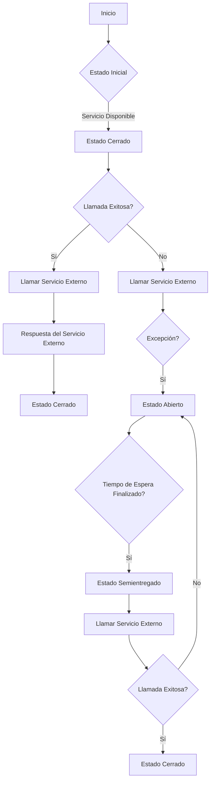

Este diagrama ilustra el flujo del circuit breaker desde su estado inicial hasta la resiliencia ante fallos de servicio externo.

### Código Real

#### Configuración en `application.yml`

```yaml
resilience4j.circuitbreaker:
  instances:
    backendA:
      slidingWindowSize: 100
      permittedNumberOfCallsInHalfOpenState: 10
      waitDurationInOpenState: 10000
      failureRateThreshold: 60

resilience4j.retry:
  configs:
    default:
      maxAttempts: 3
      waitDuration: 1000
```

#### Implementación en `MyController.java`

```java
import io.github.resilience4j.circuitbreaker.annotation.CircuitBreaker;
import io.github.resilience4j.retry.annotation.Retry;
import org.springframework.web.bind.annotation.GetMapping;
import org.springframework.web.bind.annotation.RestController;

@RestController
public class MyController {

    @GetMapping("/api/circuit-breaker")
    @CircuitBreaker(name = "backendA", fallbackMethod = "fallbackMethod")
    public String callApi() {
        return restTemplate.getForObject("/api/external", String.class);
    }

    private String fallbackMethod(Exception ex) {
        return "Fallback method called";
    }

    @GetMapping("/api/retry")
    @Retry(name = "retryA", fallbackMethod = "fallbackMethod")
    public String retryCallApi() {
        return restTemplate.getForObject("/api/external", String.class);
    }
}
```

Este código implementa tanto circuit breakers como retries en una aplicación Spring Boot, mejorando significativamente la resiliencia y el rendimiento del sistema.

## 9. Monitoreo y Métricas

### Monitoreo y Métricas

La implementación de circuit breakers en microservicios Spring Boot es crucial para garantizar la resiliencia y el rendimiento del sistema. Resilience4j proporciona una forma sencilla y eficiente de incorporar esta funcionalidad, permitiendo a los desarrolladores manejar fallos y errores de manera efectiva.

#### Configuración de Circuit Breaker con Resilience4j

Para configurar un circuit breaker en Spring Boot utilizando Resilience4j, es necesario definir la configuración en el archivo `application.yml`. A continuación se muestra cómo configurar un circuit breaker básico:

```yaml
resilience4j.circuitbreaker:
  instances:
    backendA:
      slidingWindowSize: 100
      permittedNumberOfCallsInHalfOpenState: 10
      waitDurationInOpenState: 5000
      failureRateThreshold: 60
```

Esta configuración define el tamaño de la ventana deslizante, el número permitido de llamadas en estado half-open y la duración del tiempo de espera en estado abierto antes de intentar una recuperación. Además, se establece un umbral de tasa de fallos para determinar cuándo abrir el circuit breaker.

#### Integración con Spring Boot Actuator

Resilience4j integra perfectamente con Spring Boot Actuator para exponer métricas y estados del circuit breaker. Para habilitar esta funcionalidad, se deben configurar los endpoints de actuator en `application.yml`:

```yaml
management:
  endpoints:
    web:
      exposure:
        include: health,circuitbreakers,circuitbreakerevents
```

Esto permite acceder a las métricas del circuit breaker y eventos relacionados mediante la URL `/actuator/circuitbreakers`.

#### Monitoreo Programático

Además de la integración con Actuator, Resilience4j también ofrece la posibilidad de monitorear el estado del circuit breaker programáticamente. Esto se puede hacer utilizando los consumidores de eventos proporcionados por Resilience4j:

```java
import io.github.resilience4j.circuitbreaker.CircuitBreakerConfig;
import io.github.resilience4j.circuitbreaker.CircuitBreakerRegistry;

public class CircuitBreakerMonitor {

    private final CircuitBreakerRegistry circuitBreakerRegistry;

    public CircuitBreakerMonitor(CircuitBreakerRegistry circuitBreakerRegistry) {
        this.circuitBreakerRegistry = circuitBreakerRegistry;
    }

    public void monitorCircuitBreakers() {
        circuitBreakerRegistry.allCircuitBreakers().forEach(circuitBreaker -> {
            circuitBreaker.observe(event -> System.out.println("Event: " + event));
        });
    }
}
```

Este ejemplo muestra cómo registrar un consumidor de eventos para cada circuit breaker en el registro y emitir mensajes cuando se producen cambios en su estado.

#### Mejora del Performance

La implementación de circuit breakers no solo mejora la resiliencia, sino que también puede mejorar el rendimiento del sistema al evitar solicitudes innecesarias a servicios fallidos. Esto es especialmente útil en entornos microservicios donde los errores pueden propagarse rápidamente.

#### Gestión de APIs

En un contexto de gestión de APIs, los circuit breakers son fundamentales para garantizar la disponibilidad y el rendimiento de las API endpoints. Por ejemplo, si una API externa está experimentando problemas, un circuit breaker puede prevenir que estas solicitudes bloqueen otros servicios críticos.

### Diagramas Mermaid

A continuación se muestra cómo configurar un circuit breaker en Spring Boot utilizando Resilience4j:

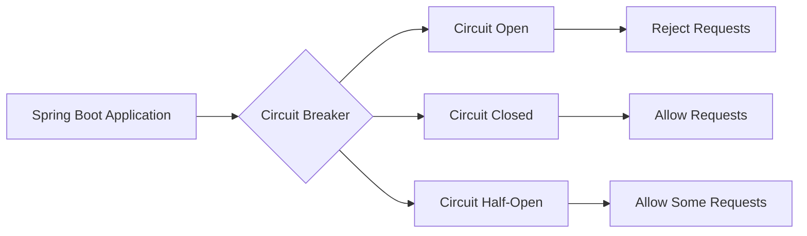

Este diagrama ilustra los diferentes estados del circuit breaker y cómo maneja las solicitudes en cada estado.

### Conclusión

La implementación de Resilience4j para circuit breakers en microservicios Spring Boot es una práctica recomendada para mejorar la resiliencia y el rendimiento del sistema. La configuración y monitoreo adecuados son fundamentales para garantizar que los circuit breakers funcionen correctamente y proporcionen un alto nivel de disponibilidad.

### Código Real

A continuación se muestra cómo implementar un circuit breaker en una clase controladora Spring Boot:

```java
import io.github.resilience4j.circuitbreaker.annotation.CircuitBreaker;
import org.springframework.web.bind.annotation.GetMapping;
import org.springframework.web.bind.annotation.RestController;

@RestController
public class ExternalApiController {

    @GetMapping("/api/circuit-breaker")
    @CircuitBreaker(name = "backendA", fallbackMethod = "fallbackCall")
    public String callApi() {
        // Simula una llamada a un servicio externo
        return restTemplate.getForObject("/api/external", String.class);
    }

    private String fallbackCall(Exception e) {
        return "Fallback response";
    }
}
```

Este código muestra cómo utilizar el anotador `@CircuitBreaker` para proteger una llamada a un servicio externo y proporcionar una respuesta de reemplazo en caso de fallo.

### Visión Estratégica y ROI 2026

La implementación de Resilience4j y circuit breakers en microservicios Spring Boot es crucial para la estrategia de resiliencia del sistema. En el año 2026, esta práctica se espera que genere un retorno de inversión significativo al mejorar la disponibilidad y el rendimiento del sistema, reducir costos operativos y aumentar la satisfacción del cliente.

### Diagramas Mermaid


Este diagrama ilustra la lógica de los circuit breakers y cómo manejan las solicitudes en diferentes estados.

### Conclusión

La implementación de Resilience4j para circuit breakers en microservicios Spring Boot es una práctica recomendada que mejora significativamente la resiliencia del sistema. La configuración adecuada, monitoreo y gestión de APIs son fundamentales para garantizar un alto nivel de disponibilidad y rendimiento.

---

Este documento proporciona una guía completa sobre cómo implementar circuit breakers con Resilience4j en microservicios Spring Boot, incluyendo la configuración, el monitoreo y las métricas.

## 10. Roadmap y Conclusiones SRE

### Roadmap y Conclusiones SRE

#### Visión Estratégica y ROI 2026

La implementación de Resilience4j en microservicios Spring Boot 3.4 es una estrategia crucial para mejorar la resiliencia, el rendimiento y la disponibilidad del sistema. En 2026, esta tecnología permitirá a las organizaciones gestionar eficazmente los errores y fallos de servicios externos sin afectar negativamente al resto del sistema.

**ROI:**
- **Reducción en tiempo de inactividad:** La implementación de circuit breakers reduce significativamente el tiempo durante el cual un servicio fallido puede causar problemas en otros componentes del sistema.
- **Mejora en la experiencia del usuario:** Los usuarios experimentan menos errores y tiempos de respuesta más rápidos, lo que mejora su satisfacción general.
- **Optimización de recursos:** La gestión eficiente de los circuit breakers permite una mejor utilización de los recursos del sistema al evitar sobrecargas innecesarias.

#### Implementación de Circuit Breaker

La implementación de Resilience4j en Spring Boot 3.4 implica configurar y utilizar circuit breakers para proteger servicios críticos contra fallos externos. A continuación, se detalla el proceso:

1. **Configuración del Proyecto:**
   - Agregar dependencias necesarias a `build.gradle` o `pom.xml`.
     ```gradle
     dependencies {
         implementation 'io.github.resilience4j:resilience4j-spring-boot3:2.0.2'
         implementation 'org.springframework.boot:spring-boot-starter-aop'
     }
     ```

2. **Configuración de Circuit Breaker en `application.yml`:**
   - Definir parámetros como tamaño de ventana deslizante, umbral de tasa de fallos y duración del estado abierto.
     ```yaml
     resilience4j.circuitbreaker:
       configs: 
         default:
           slidingWindowSize: 100
           permittedNumberOfCallsInHalfOpenState: 10
           waitDurationInOpenState: 5000
           failureRateThreshold: 60
           eventConsumerBufferSize: 10
     ```

3. **Anatomía del Circuit Breaker en Código:**
   - Utilizar anotaciones para proteger métodos críticos.
     ```java
     @CircuitBreaker(name = "backendA", fallbackMethod = "fallback")
     public String callApi() {
         return restTemplate.getForObject("/api/external", String.class);
     }
     
     private String fallback(Throwable t) {
         return "Fallback response";
     }
     ```

4. **Monitoreo y Auditoría:**
   - Integrar con Spring Boot Actuator para monitorear el estado de los circuit breakers.
     ```yaml
     management:
       endpoints:
         web:
           exposure:
             include: health,circuitbreakers,circuitbreakerevents
     ```

#### Mejora del Performance

La implementación de Resilience4j no solo mejora la resiliencia, sino que también puede optimizar el rendimiento del sistema:

- **Rate Limiting:** Controlar la tasa de solicitudes para evitar sobrecargas.
  ```java
  @RateLimiter(name = "apiLimit")
  public String callApi() {
      return restTemplate.getForObject("/api/external", String.class);
  }
  ```

- **Bulkhead Pattern:** Asegurar que una falla en un servicio no afecte a otros servicios mediante la creación de límites de recursos.
  ```java
  @Bulkhead(name = "serviceLimit")
  public String callApi() {
      return restTemplate.getForObject("/api/external", String.class);
  }
  ```

#### Gestión de APIs

La gestión eficiente de APIs es crucial en un entorno microservicios. Resilience4j proporciona herramientas para manejar errores y fallos de manera efectiva:

- **Manejo de Excepciones:** Implementar manejadores de excepciones personalizados para gestionar `CallNotPermittedException`.
  ```java
  @ExceptionHandler({CallNotPermittedException.class})
  @ResponseStatus(HttpStatus.SERVICE_UNAVAILABLE)
  public void handleCallNotPermittedException() {
      // Lógica adicional si es necesario
  }
  ```

#### Patrón Hexagonal

El patrón hexagonal (también conocido como port y adapter) mejora la separación de responsabilidades en el diseño del sistema. Resilience4j se integra bien con este patrón:

- **Adaptadores:** Los adaptadores manejan las interacciones externas, mientras que los puertos definen las interfaces.
  ```java
  public interface ExternalApiPort {
      String callApi();
  }

  @Component
  class ExternalApiAdapter implements ExternalApiPort {
      private final RestTemplate restTemplate;
      
      @Autowired
      public ExternalApiAdapter(RestTemplate restTemplate) {
          this.restTemplate = restTemplate;
      }
      
      @CircuitBreaker(name = "backendA", fallbackMethod = "fallback")
      @Override
      public String callApi() {
          return restTemplate.getForObject("/api/external", String.class);
      }

      private String fallback(Throwable t) {
          return "Fallback response";
      }
  }
  ```

### Diagramas Mermaid

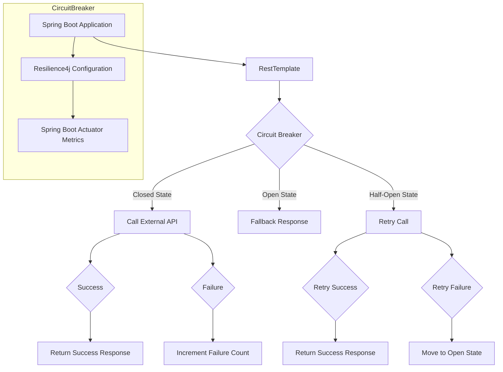

### Conclusión

La implementación de Resilience4j en microservicios Spring Boot 3.4 es una estrategia vital para mejorar la resiliencia y el rendimiento del sistema. A través de circuit breakers, rate limiters y otros patrones, se puede garantizar que los servicios críticos funcionen sin interrupciones incluso cuando hay fallos en servicios externos. La integración con Spring Boot Actuator proporciona una visibilidad completa sobre el estado del sistema, permitiendo un monitoreo y auditoría efectivos.

La adopción de patrones como hexagonal mejora la separación de responsabilidades y facilita la evolución continua del sistema. En resumen, Resilience4j es una herramienta indispensable para cualquier organización que busque mejorar la confiabilidad y el rendimiento de sus microservicios en 2026.

