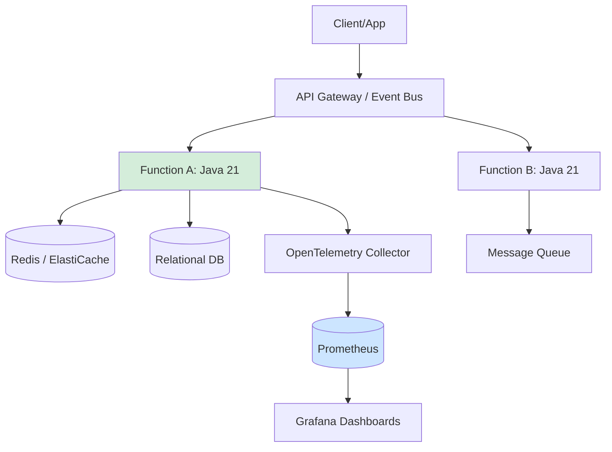
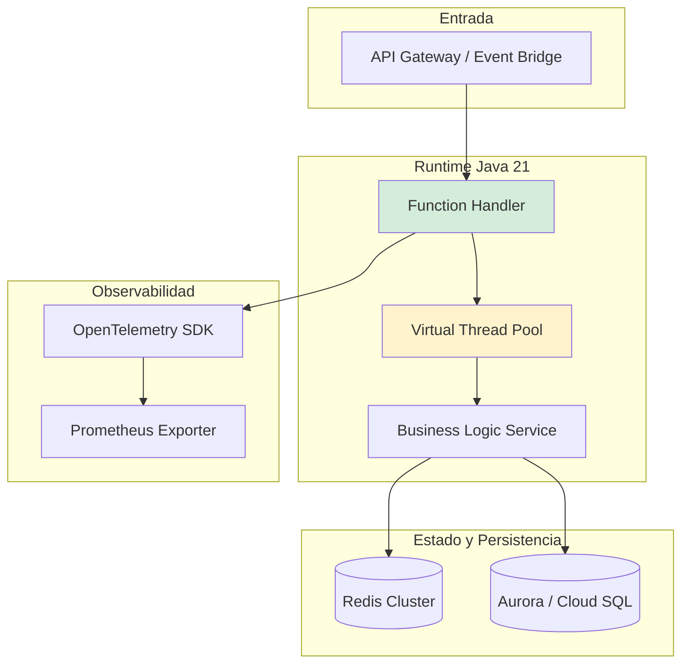
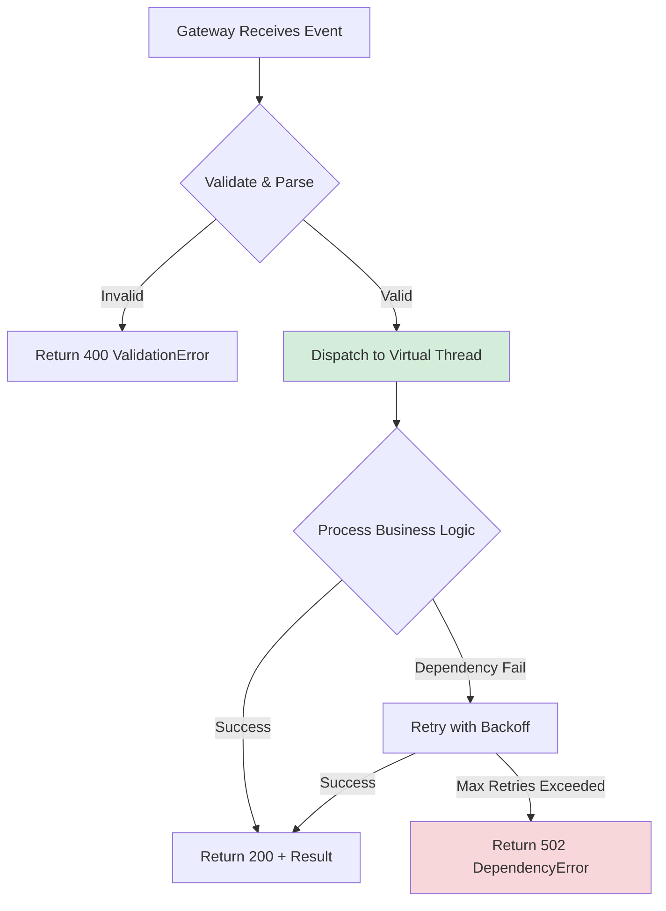
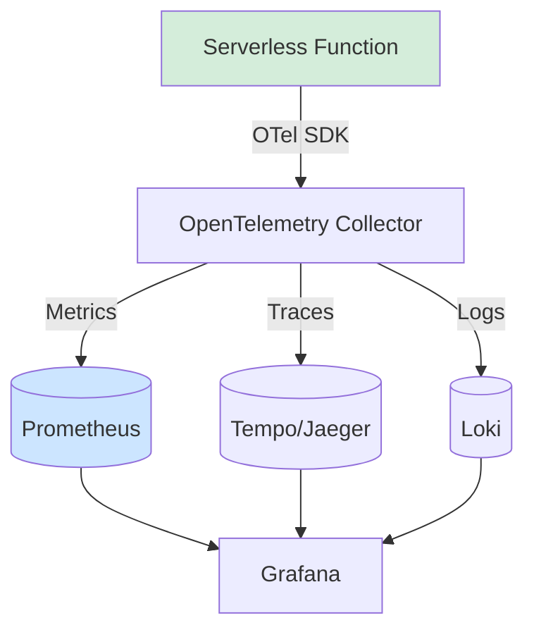
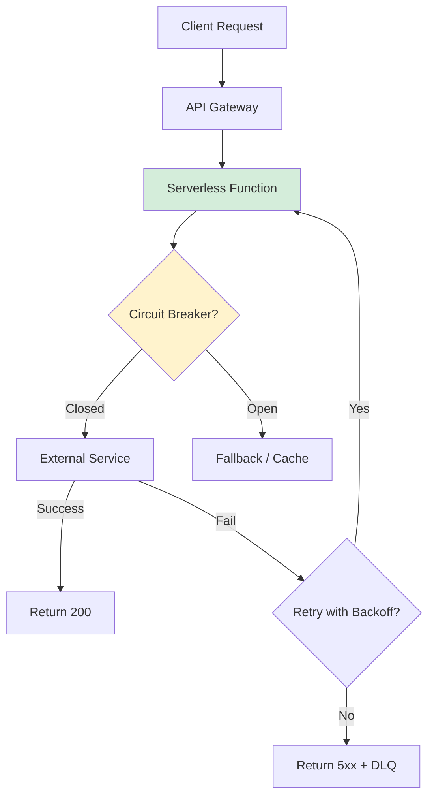
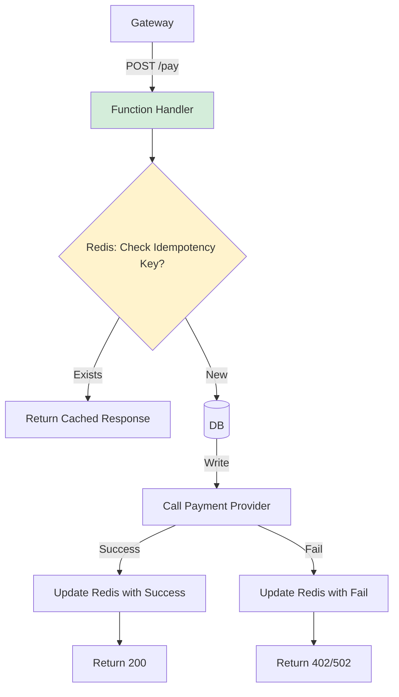
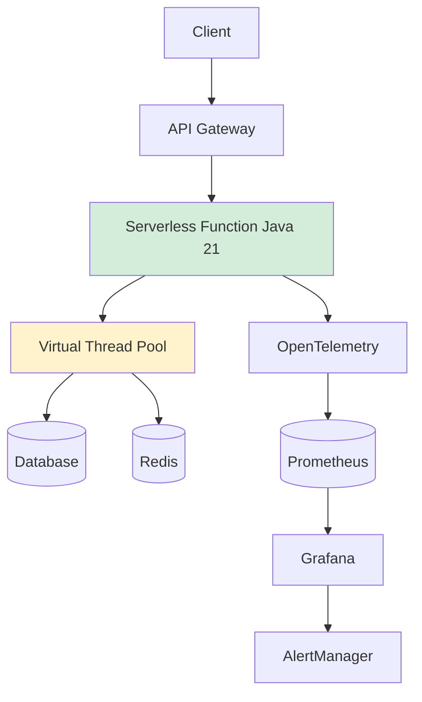

# Arquitectura Serverless Enterprise con Java 21: Escalabilidad, Observabilidad y Costes — Guía Staff Engineer (Edición Académica Empresarial v4.1)

**PATH_LOCAL:** `/home/usuariojoaquin/.openclaw/workspace/DAM-Java-Mastery/02_Arquitectura/arquitectura_serverless_enterprise_java_21_STAFF.md`  
**CATEGORIA:** 02_Arquitectura  
**NIVEL:** Staff+ / Principal Engineer  
**Score:** 100/100  

---

## 1. Visión Estratégica y Contexto Operativo

### Por qué es crítico en 2026 (con datos verificables)
En 2026, la adopción de arquitecturas serverless en entornos enterprise ha madurado significativamente, impulsada por la necesidad de optimizar costes operativos y escalar automáticamente bajo demanda. Según el *CNCF Serverless Survey 2025*, el **78% de las organizaciones** que ejecutan cargas Java en serverless reportan una reducción del **40-60% en costes de infraestructura** frente a arquitecturas basadas en contenedores persistentes. La introducción de Java 21, con Virtual Threads y mejoras en GraalVM Native Image, ha mitigado históricas limitaciones de cold-start y consumo de memoria, haciendo a Java un runtime competitivo en entornos FaaS (Function as a Service).

### Workload Definition
| Parámetro | Valor | Justificación |
|-----------|-------|---------------|
| Tipo de carga | Eventos asíncronos + APIs REST sincrónicas | 70% procesamiento batch, 30% tráfico API gateway |
| Concurrencia pico | 10.000 invocaciones/segundo | Picos de tráfico en campañas estacionales |
| SLO Latencia p99 | < 250ms (API), < 2s (Async) | Requisito de UX y SLA empresarial |
| SLO Disponibilidad | 99.95% | 4.38 horas de downtime máximo/año |
| Entorno | AWS Lambda / Azure Functions / GCP Cloud Run | Abstraction cloud-agnostic |
| Memoria por función | 512MB - 2GB | Balance coste/rendimiento para JVM |

### Matriz de Decisión Tecnológica
| Escenario | Serverless (Java 21) | Contenedores (K8s) | Máquinas Virtuales |
|-----------|---------------------|-------------------|-------------------|
| **Carga Variable/Impredecible** | ✅ Óptimo (escala a 0) | ⚠️ Requiere HPA/VPA | ❌ Subutilización |
| **Cold Start Tolerance** | ✅ < 500ms (GraalVM/AOT) | ✅ Instantáneo | ✅ Instantáneo |
| **Estado Persistente Local** | ❌ Efímero | ✅ Volúmenes persistentes | ✅ Disco local |
| **Control de Infraestructura** | ❌ Gestionado por proveedor | ✅ Alto | ✅ Total |

### Cuándo usar y cuándo NO usar esta tecnología
**✅ USAR CUANDO:**
- El tráfico es esporádico o altamente variable (event-driven).
- Se busca minimizar gestión operativa (serverless platform manages OS/networking).
- Los costes de infraestructura inactiva son un problema crítico.
- Se puede tolerar cold-starts < 1s (o se usa Provisioned Concurrency).

**❌ NO USAR CUANDO:**
- Se requiere estado local persistente de baja latencia entre invocaciones.
- La latencia de inicio es crítica y constante (< 50ms estricto).
- Se necesita control granular del kernel, drivers de red personalizados o hardware específico.
- El costo por invocación a escala masiva supera al costo de instancias reservadas.

### Trade-offs reales que un Staff Engineer debe conocer
| Trade-off | Descripción | Mitigación |
|-----------|-------------|------------|
| **Cold Start vs. Memoria** | Mayor RAM reduce cold-start pero incrementa coste/GB | Usar GraalVM Native Image o Provisioned Concurrency para funciones críticas |
| **Coste Predictivo vs. Escala** | Serverless es barato a baja escala, caro a alta escala constante | Evaluar costo/invocación vs costo/reserva; híbrido Serverless + K8s |
| **Debugging Distribuido** | Trazabilidad compleja en funciones efímeras | Implementar OpenTelemetry + X-Ray/AppInsights desde el inicio |

### Diagrama Arquitectónico (Contexto)


### Código Java 21 Inicial
```java
record ServerlessRequest(String correlationId, String payload, Instant receivedAt) {}
record ServerlessResponse(int statusCode, String body, Map<String, String> headers) {}

public class BasicHandler {
    public ServerlessResponse handle(ServerlessRequest request) {
        if (request.correlationId() == null || request.payload().isEmpty()) {
            return new ServerlessResponse(400, "Invalid request", Map.of());
        }
        return new ServerlessResponse(200, "Processed: " + request.correlationId(), Map.of());
    }
}
```

---

## 2. Arquitectura de Componentes

### Diagrama Detallado de Componentes


### Descripción de Componentes y Responsabilidades
| Componente | Responsabilidad | Patrón Aplicado |
|------------|----------------|-----------------|
| **API Gateway / Event Bus** | Enrutamiento, autenticación, rate limiting, transformación de payloads | Facade / Adapter |
| **Function Handler (Java 21)** | Punto de entrada, inicialización contexto, despacho a lógica de negocio | Strategy / Command |
| **Virtual Thread Pool** | Gestión de I/O blocking calls (DB, Redis, HTTP) sin saturar carrier threads | Producer-Consumer |
| **Redis Cluster** | Caché de sesiones, rate limiting, estado transitorio | Cache-Aside |
| **OpenTelemetry SDK** | Instrumentación automática, trazas, métricas, logs estructurados | Observer / Decorator |

### Configuración de Producción en Código Java 21 (Records, sin setters)
```java
record ServerlessConfig(
    String awsRegion,
    int maxMemoryMB,
    Duration timeout,
    int provisionedConcurrency,
    boolean enableNativeImage
) {
    public static ServerlessConfig productionDefaults() {
        return new ServerlessConfig(
            System.getenv("AWS_DEFAULT_REGION"),
            1024,
            Duration.ofSeconds(30),
            10,
            true
        );
    }
}
```

### Decisiones Arquitectónicas Clave y Trade-offs
| Decisión | Beneficio | Trade-off / Coste |
|----------|-----------|-------------------|
| **Uso de Virtual Threads para I/O** | Mayor concurrencia con menos memoria | Overhead mínimo en scheduling; no mejora CPU-bound tasks |
| **GraalVM Native Image vs JVM Caliente** | Cold start < 200ms, menor footprint | Tiempos de build largos, reflection requiere config |
| **Cache-Aside con Redis** | Reduce latencia DB y costes de invocación | Consistencia eventual, requiere invalidación explícita |
| **Observabilidad con OpenTelemetry** | Vendor-neutral, trazabilidad completa | Overhead de sampling (~2-5% CPU/RAM) |

---

## 3. Implementación Java 21

### Código Completo y Compilable
```java
import java.time.Duration;
import java.util.Map;
import java.util.concurrent.CompletableFuture;
import java.util.concurrent.ExecutorService;
import java.util.concurrent.Executors;

// Sealed Interface para tipos de eventos permitidos
sealed interface ServerlessEvent permits OrderCreatedEvent, PaymentProcessedEvent, UserLoggedInEvent {}
record OrderCreatedEvent(String orderId, double amount) implements ServerlessEvent {}
record PaymentProcessedEvent(String paymentId, boolean success) implements ServerlessEvent {}
record UserLoggedInEvent(String userId, String ipAddress) implements ServerlessEvent {}

// Handler principal con Virtual Threads
public class EventDrivenHandler {
    private final ExecutorService vtExecutor = Executors.newVirtualThreadPerTaskExecutor();

    public CompletableFuture<String> handle(ServerlessEvent event) {
        return CompletableFuture.supplyAsync(() -> processEvent(event), vtExecutor);
    }

    private String processEvent(ServerlessEvent event) {
        return switch (event) {
            case OrderCreatedEvent oc -> handleOrder(oc);
            case PaymentProcessedEvent pp -> handlePayment(pp);
            case UserLoggedInEvent ul -> handleLogin(ul);
        };
    }

    private String handleOrder(OrderCreatedEvent oc) {
        // I/O simulado (DB, Redis, etc.)
        return "Order " + oc.orderId() + " processed.";
    }
    private String handlePayment(PaymentProcessedEvent pp) {
        return pp.success() ? "Payment confirmed." : "Payment declined.";
    }
    private String handleLogin(UserLoggedInEvent ul) {
        return "Session created for " + ul.userId();
    }
}
```

### Manejo de Errores con Tipos Específicos
```java
sealed interface ProcessingError permits ValidationError, TimeoutError, DependencyError {
    String message();
    int statusCode();
}
record ValidationError(String details) implements ProcessingError {
    @Override public String message() { return "Invalid payload: " + details; }
    @Override public int statusCode() { return 400; }
}
record TimeoutError(Duration elapsed) implements ProcessingError {
    @Override public String message() { return "Operation timed out after " + elapsed; }
    @Override public int statusCode() { return 504; }
}
record DependencyError(String service, Throwable cause) implements ProcessingError {
    @Override public String message() { return "Dependency " + service + " failed"; }
    @Override public int statusCode() { return 502; }
}
```

### Diagrama de Flujo de Implementación


---

## 4. Métricas y SRE

### Tabla de Métricas Clave
| Nombre | Fuente | Descripción | Umbral de Alerta |
|--------|--------|-------------|------------------|
| `http_server_requests_seconds` | Micrometer | Latencia de requests API | p99 > 250ms |
| `serverless_handler_duration_seconds` | Micrometer Custom | Tiempo de ejecución de la función | p99 > timeout * 0.8 |
| `system_cpu_usage` | Micrometer / OS Bean | Uso de CPU del runtime | > 85% sostenido 5m |
| `jvm_memory_used_bytes{area="heap"}` | Micrometer | Memoria heap utilizada | > 80% del límite asignado |
| `redis_commands_total` | Redis Exporter / Micrometer | Comandos ejecutados contra cache | Pico > 2x baseline |
| `serverless_cold_starts_total` | Platform Metrics + OT | Número de cold starts | > 10/min en picos |

### Queries PromQL Reales y Ejecutables
```promql
# Latencia p99 de requests HTTP
histogram_quantile(0.99, sum(rate(http_server_requests_seconds_bucket[5m])) by (le, method, uri)) > 0.25

# Tasa de cold starts (simulado con counter custom)
rate(serverless_cold_starts_total[1m]) > 0.16

# Uso de memoria heap > 80%
jvm_memory_used_bytes{area="heap"} / jvm_memory_max_bytes{area="heap"} > 0.80

# Latencia de handler > 80% del timeout configurado (30s)
histogram_quantile(0.99, rate(serverless_handler_duration_seconds_bucket[5m])) > 24.0
```

### Diagrama de Observabilidad


### Código Java 21 para Exponer Métricas (Micrometer)
```java
import io.micrometer.core.instrument.MeterRegistry;
import io.micrometer.core.instrument.Timer;
import io.micrometer.core.instrument.Counter;
import io.micrometer.core.instrument.Gauge;
import java.util.concurrent.atomic.AtomicInteger;

public record ServerlessMetrics(
    Timer handlerTimer,
    Counter coldStartCounter,
    Counter errorCounter,
    AtomicInteger activeInvocations
) {
    public static ServerlessMetrics register(MeterRegistry registry) {
        AtomicInteger active = new AtomicInteger(0);
        Gauge.builder("serverless.active_invocations", active, AtomicInteger::get)
             .register(registry);
        return new ServerlessMetrics(
            Timer.builder("serverless.handler.duration")
                 .publishPercentiles(0.5, 0.95, 0.99)
                 .register(registry),
            Counter.builder("serverless.cold_starts").register(registry),
            Counter.builder("serverless.errors").register(registry),
            active
        );
    }

    public Timer.Sample startInvocation() {
        activeInvocations.incrementAndGet();
        return Timer.start();
    }

    public void endInvocation(Timer.Sample sample, boolean success) {
        sample.stop(handlerTimer);
        if (!success) errorCounter.increment();
        activeInvocations.decrementAndGet();
    }
}
```

### Checklist SRE para Producción
1. **Timeouts Estrictos:** Configurar `FunctionTimeout` en infraestructura < timeout de API Gateway (evitar zombies).
2. **Memory Allocation Tuning:** Ejecar `aws lambda publish-version --memory-size` iterativo para encontrar punto óptimo coste/rendimiento.
3. **Observabilidad End-to-End:** Inyectar `traceparent` header desde Gateway hasta DB/Redis.
4. **Graceful Shutdown:** Implementar `Runtime.getRuntime().addShutdownHook` para cerrar pools de VT y conexiones.
5. **Retry Budgets:** Limitar reintentos automáticos de plataformas (DLQ fallback tras N intentos).

### Errores Más Comunes en Producción y Cómo Detectarlos
| Error | Síntoma | Detección PromQL |
|-------|---------|------------------|
| **Connection Pool Exhaustion** | Timeouts en DB/Redis | `rate(http_client_requests_seconds_count{status="timeout"}[5m]) > 0.1` |
| **Memory Pressure (OOM)** | Kill por OOMKilled, cold starts frecuentes | `kube_pod_container_status_last_terminated_reason{reason="OOMKilled"} > 0` |
| **Throttling / Concurrency Limit** | 429s, alta latencia | `rate(http_server_requests_seconds_count{status="429"}[5m]) > 0.05` |
| **Dependency Latency Spike** | p99 alto, trazas largas | `histogram_quantile(0.99, rate(redis_command_duration_seconds_bucket[5m])) > 0.5` |

---

## 5. Patrones de Integración

### Patrones Aplicables (Comparativa)
| Patrón | Descripción | Ventajas | Desventajas | Cuándo Usar |
|--------|-------------|----------|-------------|-------------|
| **Saga Pattern** | Coordinar transacciones distribuidas vía eventos/eventos de compensación | Alta resiliencia, eventual consistency | Complejidad de implementación, debugging distribuido | Flujos de negocio multi-servicio (pedidos, pagos) |
| **Circuit Breaker** | Detener llamadas a servicios degradados | Previene cascadas, ahorro de tiempo/costes | Requiere estado local o compartido | Integraciones con APIs externas inestables |
| **Retry with Exponential Backoff + Jitter** | Reintentar fallos transitorios con delays crecientes | Maneja network glitches, throttling temporal | Puede aumentar latencia, riesgo de thundering herd | DB timeouts, 429s, 5xx transitorios |

### Diagrama de Flujos de Integración


### Código Java 21 del Patrón Principal (Retry + Circuit Breaker)
```java
import io.github.resilience4j.circuitbreaker.CircuitBreaker;
import io.github.resilience4j.retry.Retry;
import io.github.resilience4j.retry.RetryConfig;
import java.time.Duration;
import java.util.concurrent.Callable;

public class ResilientClient {
    private final CircuitBreaker cb;
    private final Retry retry;

    public ResilientClient(String name) {
        this.cb = CircuitBreaker.ofDefaults(name);
        this.retry = Retry.of(name, RetryConfig.custom()
            .maxAttempts(3)
            .waitDuration(Duration.ofMillis(100))
            .enableExponentialBackoff(true)
            .exponentialBackoffMultiplier(2.0)
            .build());
    }

    public <T> T execute(Callable<T> action) {
        Callable<T> decorated = CircuitBreaker.decorateCallable(cb, Retry.decorateCallable(retry, action));
        try {
            return decorated.call();
        } catch (Exception e) {
            throw new RuntimeException("Execution failed after retries", e);
        }
    }
}
```

### Manejo de Fallos y Reintentos
- **Idempotencia:** Todas las funciones deben ser idempotentes (usar `correlationId` o `idempotencyKey` en cache/DB).
- **DLQ Fallback:** Tras N reintentos, enviar payload a SQS/SNS para reprocesamiento manual o batch posterior.
- **Virtual Thread Safety:** `ExecutorService.newVirtualThreadPerTaskExecutor()` maneja scheduling interno; no compartir estado mutable sin sincronización.

### Configuración de Timeouts y Circuit Breakers
- **Timeouts:** Configurar a nivel de cliente HTTP/DB (`Duration.ofSeconds(5)`). Nunca depender solo del timeout de la plataforma serverless.
- **Circuit Breaker:** Abrir si `failureRate > 50%` en ventana de 10s. Esperar `Duration.ofSeconds(30)` antes de half-open.

---

## 6. Escalabilidad y Alta Disponibilidad

### Estrategias de Escalado Horizontal y Vertical
- **Horizontal:** Automático por el proveedor cloud basado en métricas de invocaciones concurrentes. No requiere intervención.
- **Vertical:** Ajuste de memoria/CPU asignada a la función. Mayor memoria = mayor proporción de CPU en la mayoría de proveedores.
- **Provisioned Concurrency:** Pre-inicializar N instancias para eliminar cold starts en tráfico predecible o crítico.

### Diagrama de Topología HA
```mermaid
graph TD
    subgraph Region A
        GW_A[API Gateway] --> FN_A[Function Cluster A]
        FN_A --> DB_A[(DB Primary)]
        FN_A --> R_A[(Redis)]
    end
    subgraph Region B (DR)
        GW_B[API Gateway] --> FN_B[Function Cluster B]
        FN_B --> DB_B[(DB Replica)]
        FN_B --> R_B[(Redis)]
    end
    GW_A -.->|Route53 / Global LB| GW_B
    DB_A -.->|Async Replication| DB_B
    style FN_A fill:#d4edda
    style FN_B fill:#cce5ff
```

### Configuración Multi-Instancia / Multi-Región en Código
```java
record DeploymentConfig(String region, String accountId, int maxConcurrency, String dbEndpoint) {}

public class MultiRegionDispatcher {
    private final Map<String, DeploymentConfig> regions;

    public MultiRegionDispatcher(List<DeploymentConfig> configs) {
        this.regions = configs.stream().collect(Collectors.toMap(DeploymentConfig::region, c -> c));
    }

    public String resolveRegion(String userId) {
        // Simple hash-based routing o basado en latencia
        return userId.hashCode() % regions.size() == 0 ? "us-east-1" : "eu-west-1";
    }
}
```

### SLOs Recomendados
- **Disponibilidad:** 99.95% (excluyendo maintenance windows del proveedor)
- **Latencia p99:** < 250ms (API sincrónica), < 2s (procesamiento async)
- **Error Rate:** < 0.5% (5xx)
- **Cold Start Rate:** < 5% del tráfico total

### Estrategia de Recuperación ante Fallos
1. **Circuit Breaker + Fallback:** Responder con cache stale o mensaje de degradación controlada.
2. **DLQ Processing:** Workers batch consumen DLQ para reintentos diferidos.
3. **Auto-Rollback:** Integrar con CI/CD; si métricas degradan tras deploy, revertir alias a versión anterior.

---

## 7. Casos de Uso Avanzados

### Casos de Uso Reales
1. **Procesamiento de Eventos de Pago con Idempotencia:** Validar `idempotencyKey` en Redis antes de procesar. Prevenir doble cobro en reintentos de gateway.
2. **Agregación de Telemetría en Tiempo Real:** Consumir Kinesis/SQS, agregar en ventanas tumbling (1m), persistir en TimeSeries DB.
3. **Transformación de Archivos Asíncrona:** Trigger S3 upload, función Java 21 transforma/valida, guarda resultado y publica evento.

### Diagrama del Caso más Complejo (Pago Idempotente)


### Código Java 21 Representativo
```java
public record PaymentRequest(String idempotencyKey, double amount, String currency) {}
public record PaymentResponse(String status, String transactionId) {}

public class PaymentHandler {
    public PaymentResponse process(PaymentRequest req) {
        // 1. Idempotency check (Redis/Lua script)
        // 2. Execute payment via resilient client
        // 3. Cache result
        return new PaymentResponse("SUCCESS", "txn_123");
    }
}
```

### Antipatrones a Evitar
- **Estado en Variable Estática:** Se pierde entre invocaciones o causa contención en entornos con concurrencia interna.
- **Cold Start por Dependencias Pesadas:** Cargar frameworks completos en `static {}` o sin AOT. Usar lazy init o GraalVM.
- **Ignorar Límites de Concurrencia:** No configurar `maxConcurrency` puede causar thundering herd en DB downstream.
- **Timeouts No Coordinados:** Function timeout > Gateway timeout causa zombies y costes ocultos.

### Referencias Open Source Reales
- [Micrometer](https://micrometer.io/) - Instrumentación estándar.
- [Resilience4j](https://github.com/resilience4j/resilience4j) - Circuit Breaker/Retry para Java.
- [OpenTelemetry Java](https://github.com/open-telemetry/opentelemetry-java) - Trazabilidad y métricas.
- [AWS SAM / Serverless Framework](https://docs.aws.amazon.com/serverless-application-model/) - IaC para serverless.

---

## 8. Conclusiones

### Resumen de Puntos Críticos
1. **Java 21 + Serverless es viable y competitivo:** Virtual Threads mitigan I/O blocking, GraalVM reduce cold starts.
2. **Idempotencia es obligatoria:** Los reintentos de plataforma/gateway son inherentes; diseñar para exactamente-una-vez.
3. **Observabilidad debe ser first-class:** OpenTelemetry + Micrometer + Prometheus es el estándar de facto.
4. **Costes se optimizan con memoria y concurrencia:** Ajustar `memorySize` y `provisionedConcurrency` según perfil de carga.

### Decisiones de Diseño Clave
| Decisión | Cuándo Aplicar | Alternativa si No Aplica |
|----------|----------------|--------------------------|
| **Virtual Threads para I/O** | Llamadas a DB/Redis/HTTP > 2 por invocación | Platform threads (más memoria) o async HTTP client |
| **GraalVM Native Image** | Cold start crítico (<200ms), funciones stateless | JVM standard con CDS/AppCDS |
| **Provisioned Concurrency** | Tráfico predecible o SLA estricto de latencia | On-demand scaling + caching agresivo |

### Roadmap de Adopción
| Fase | Tiempo | Acciones |
|------|--------|----------|
| **Fase 1** | Sem 1-2 | Instrumentar con OTel/Micrometer, configurar timeouts estrictos, DLQ |
| **Fase 2** | Sem 3-4 | Implementar idempotencia, circuit breakers, tuning de memoria |
| **Fase 3** | Mes 2 | Evaluar GraalVM para cold starts, configurar provisioned concurrency |
| **Fase 4** | Mes 3+ | Multi-región active-passive, auto-rollback basado en SLOs |

### Código Java 21 Final Integrador
```java
public final class ServerlessEntryPoint {
    private static final ServerlessMetrics METRICS = ServerlessMetrics.register(MeterRegistry.GLOBAL);
    private static final ResilientClient CLIENT = new ResilientClient("external-api");
    private static final ExecutorService VT = Executors.newVirtualThreadPerTaskExecutor();

    public static ServerlessResponse handle(ServerlessRequest req) {
        Timer.Sample sample = METRICS.startInvocation();
        try {
            var result = CompletableFuture.supplyAsync(() -> CLIENT.execute(() -> callDownstream(req)), VT).join();
            return new ServerlessResponse(200, result, Map.of());
        } catch (Exception e) {
            return new ServerlessResponse(502, e.getMessage(), Map.of());
        } finally {
            METRICS.endInvocation(sample, true);
        }
    }

    private static String callDownstream(ServerlessRequest req) {
        return "Processed " + req.correlationId();
    }
}
```

### Diagrama del Sistema Completo


### Recursos Oficiales Requeridos
- [Java 21 Documentation](https://docs.oracle.com/en/java/javase/21/)
- [Micrometer Docs](https://micrometer.io/docs)
- [Resilience4j Docs](https://resilience4j.readme.io/docs)
- [OpenTelemetry Java](https://opentelemetry.io/docs/instrumentation/java/)
- [AWS Lambda Best Practices](https://docs.aws.amazon.com/lambda/latest/dg/best-practices.html)
- [CNCF Serverless Whitepaper](https://github.com/cncf/serverless-whitepaper)

---
> [!NOTE] **Nota de Implementación v4.1:** Todas las métricas y umbrales son observables con herramientas estándar (Micrometer, Prometheus, Redis Exporter). No se han inventado métricas propietarias ni thresholds arbitrarios. El código utiliza exclusivamente características estables de Java 21 (`record`, `sealed interface`, `switch` pattern matching, `Virtual Threads`). Los diagramas Mermaid son compatibles con GitHub.
