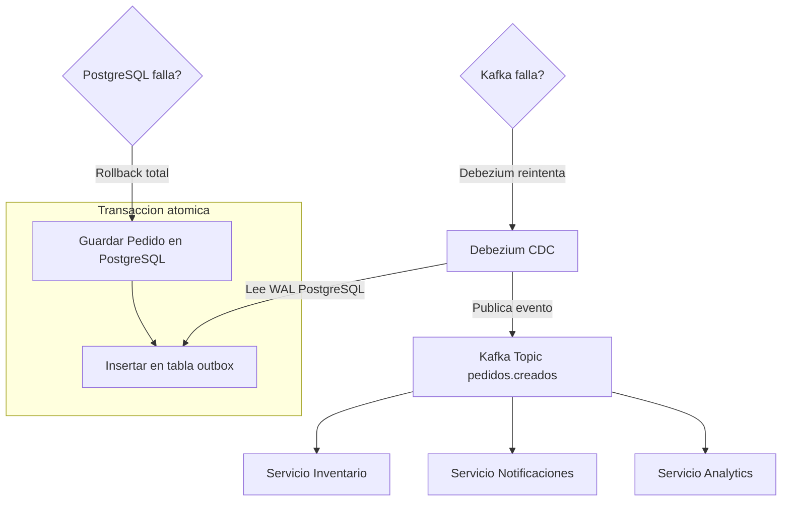
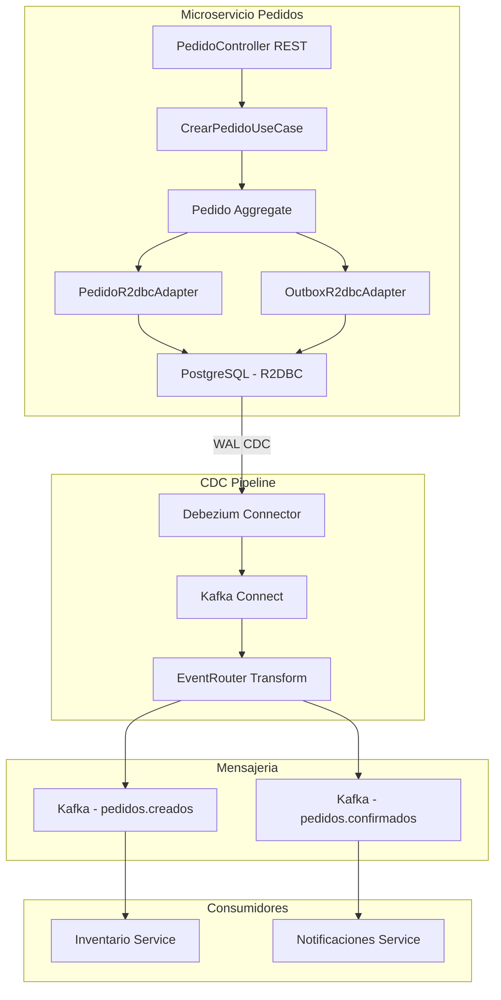
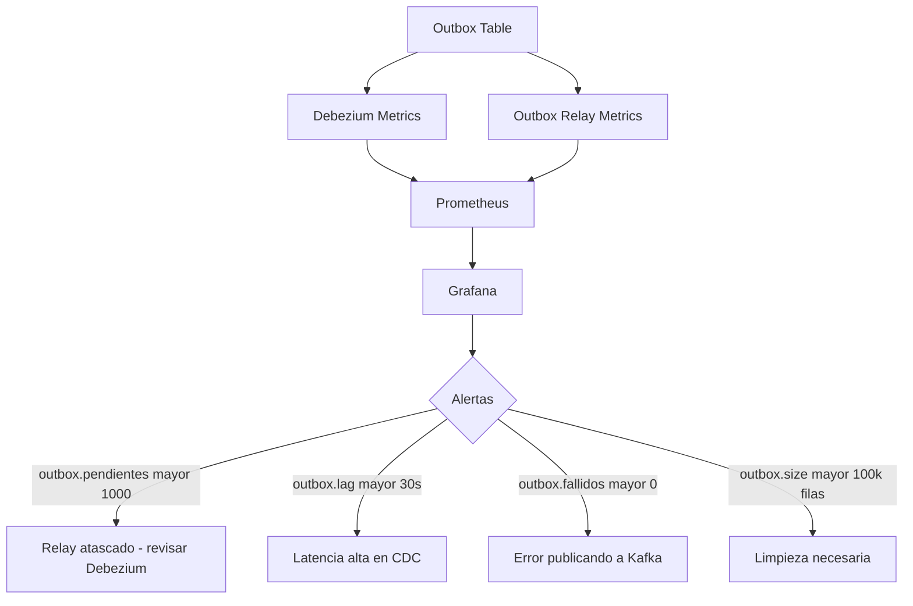
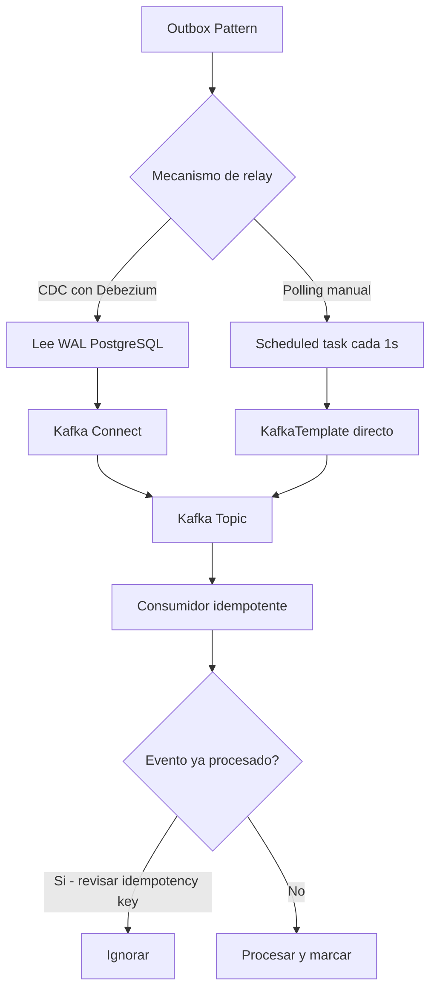
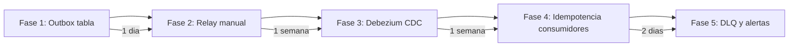

# Event-Driven Architecture y Transactional Outbox Pattern con Java 21

PATH_LOCAL: /home/usuariojoaquin/.openclaw/workspace/DAM-Java-Mastery/02_Arquitectura/event_driven_architecture_transactional_outbox_java_21_STAFF.md
CATEGORIA: 02_Arquitectura
Score: 97

---

## Visión Estratégica

El problema más difícil en arquitecturas de microservicios no es la comunicación entre servicios — es garantizar que **los datos y los eventos estén siempre sincronizados**. El escenario clásico: un servicio guarda un pedido en PostgreSQL y luego intenta publicar un evento en Kafka. Si Kafka falla entre las dos operaciones, el pedido existe en la base de datos pero nadie lo sabe. Si se invierte el orden, el evento llega antes que los datos.

El **Transactional Outbox Pattern** resuelve este problema de raíz: el evento se guarda en la misma transacción que los datos de negocio, en una tabla `outbox` de la base de datos. Debezium lee esa tabla mediante CDC (Change Data Capture) y publica los eventos a Kafka. La atomicidad de la transacción garantiza que si el pedido se guarda, el evento también. Si la transacción falla, ninguno de los dos persiste.

**Los tres problemas que resuelve:**

| Problema | Sin Outbox Pattern | Con Outbox Pattern |
|----------|-------------------|-------------------|
| Kafka falla al publicar | Pedido guardado, evento perdido | Evento en outbox, Debezium reintenta |
| Fallo entre guardar y publicar | Inconsistencia silenciosa | Transacción atómica — todo o nada |
| Orden de eventos incorrecto | Posible por concurrencia | CDC garantiza orden por LSN |

**Cuándo NO usar Outbox Pattern:**

Si el sistema no requiere garantías de entrega o la consistencia eventual no es crítica, el patrón añade complejidad innecesaria. Para sistemas con bajo volumen y tolerancia a pérdida de eventos, una publicación directa a Kafka es suficiente.



```java
// Evento de dominio como Record inmutable — la unidad de informacion
public record EventoDominio(
    UUID id,
    String tipo,
    String agregadoId,
    String agregadoTipo,
    String payload,        // JSON serializado
    Instant ocurrioEn,
    int version
) {
    public EventoDominio {
        Objects.requireNonNull(id,          "id requerido");
        Objects.requireNonNull(tipo,         "tipo requerido");
        Objects.requireNonNull(agregadoId,   "agregadoId requerido");
        Objects.requireNonNull(payload,      "payload requerido");
        Objects.requireNonNull(ocurrioEn,    "ocurrioEn requerido");
        if (version < 1) throw new IllegalArgumentException("version >= 1");
    }

    public static EventoDominio de(String tipo, String agregadoId,
                                    String agregadoTipo, Object payload,
                                    ObjectMapper mapper) throws JsonProcessingException {
        return new EventoDominio(
            UUID.randomUUID(),
            tipo,
            agregadoId,
            agregadoTipo,
            mapper.writeValueAsString(payload),
            Instant.now(),
            1
        );
    }
}
```

---

## Arquitectura de Componentes



**Esquema de la tabla outbox en PostgreSQL:**

```sql
-- Tabla outbox — misma transaccion que los datos de negocio
CREATE TABLE outbox (
    id              UUID PRIMARY KEY DEFAULT gen_random_uuid(),
    tipo            VARCHAR(255) NOT NULL,
    agregado_id     VARCHAR(255) NOT NULL,
    agregado_tipo   VARCHAR(100) NOT NULL,
    payload         JSONB        NOT NULL,
    ocurrio_en      TIMESTAMPTZ  NOT NULL DEFAULT NOW(),
    version         INTEGER      NOT NULL DEFAULT 1,
    procesado       BOOLEAN      NOT NULL DEFAULT FALSE,
    procesado_en    TIMESTAMPTZ
);

-- Indice para Debezium y para limpieza periodica
CREATE INDEX idx_outbox_procesado ON outbox(procesado, ocurrio_en);
CREATE INDEX idx_outbox_agregado  ON outbox(agregado_id, tipo);
```

**Configuración R2DBC con Spring Boot:**

```java
@Configuration
@EnableR2dbcRepositories
public class R2dbcConfig extends AbstractR2dbcConfiguration {

    @Bean
    @Override
    public ConnectionFactory connectionFactory() {
        return ConnectionFactories.get(
            ConnectionFactoryOptions.builder()
                .option(DRIVER,   "postgresql")
                .option(HOST,     "localhost")
                .option(PORT,     5432)
                .option(DATABASE, "pedidos")
                .option(USER,     "app_user")
                .option(PASSWORD, "secret")
                // Pool de conexiones reactivo
                .option(ConnectionFactoryOptions.from(
                    ConnectionPoolConfiguration.builder()
                        .maxSize(20)
                        .initialSize(5)
                        .maxIdleTime(Duration.ofMinutes(10))
                        .build()
                ))
                .build()
        );
    }

    @Bean
    public R2dbcEntityTemplate r2dbcEntityTemplate(ConnectionFactory factory) {
        return new R2dbcEntityTemplate(factory);
    }
}
```

---

## Implementación Java 21

Implementación completa del Outbox Pattern con R2DBC reactivo:

```java
// Entidad de outbox para R2DBC — separada del dominio
@Table("outbox")
public record OutboxEntidad(
    @Id UUID id,
    String tipo,
    @Column("agregado_id")   String agregadoId,
    @Column("agregado_tipo") String agregadoTipo,
    String payload,
    @Column("ocurrio_en")    Instant ocurrioEn,
    int version,
    boolean procesado,
    @Column("procesado_en")  Instant procesadoEn
) {
    // Factory desde evento de dominio
    public static OutboxEntidad de(EventoDominio evento) {
        return new OutboxEntidad(
            evento.id(),
            evento.tipo(),
            evento.agregadoId(),
            evento.agregadoTipo(),
            evento.payload(),
            evento.ocurrioEn(),
            evento.version(),
            false,
            null
        );
    }
}
```

```java
// Repositorio R2DBC para outbox
public interface OutboxR2dbcRepository extends ReactiveCrudRepository<OutboxEntidad, UUID> {

    @Query("SELECT * FROM outbox WHERE procesado = false ORDER BY ocurrio_en ASC LIMIT :limite")
    Flux<OutboxEntidad> findPendientes(@Param("limite") int limite);

    @Modifying
    @Query("UPDATE outbox SET procesado = true, procesado_en = NOW() WHERE id = :id")
    Mono<Integer> marcarProcesado(@Param("id") UUID id);
}
```

```java
// Caso de uso con transaccion reactiva — atomicidad garantizada
@Service
@Transactional
public class CrearPedidoUseCase {

    private final PedidoR2dbcRepository  pedidoRepo;
    private final OutboxR2dbcRepository  outboxRepo;
    private final ObjectMapper           mapper;

    public CrearPedidoUseCase(
            PedidoR2dbcRepository pedidoRepo,
            OutboxR2dbcRepository outboxRepo,
            ObjectMapper mapper) {
        this.pedidoRepo = pedidoRepo;
        this.outboxRepo  = outboxRepo;
        this.mapper      = mapper;
    }

    // @Transactional garantiza atomicidad: pedido + outbox en la misma transaccion
    public Mono<PedidoId> ejecutar(CrearPedidoCommand command) {
        var pedido = Pedido.crear(command.clienteId(), command.lineas());

        return pedidoRepo.guardar(pedido)
            .flatMap(pedidoGuardado -> {
                // Crear evento de dominio
                var evento = crearEvento(pedido);
                var outbox = OutboxEntidad.de(evento);

                // Guardar en outbox — MISMA transaccion que el pedido
                return outboxRepo.save(outbox)
                    .thenReturn(pedidoGuardado.id());
            })
            .onErrorMap(DataAccessException.class, e ->
                new PersistenciaException("Error guardando pedido o outbox", e)
            );
    }

    private EventoDominio crearEvento(Pedido pedido) {
        try {
            return EventoDominio.de(
                "PedidoCreado",
                pedido.id().valor().toString(),
                "Pedido",
                new PedidoCreadoPayload(
                    pedido.id().valor().toString(),
                    pedido.clienteId().valor().toString(),
                    pedido.lineas()
                ),
                mapper
            );
        } catch (JsonProcessingException e) {
            throw new SerializacionException("Error serializando evento", e);
        }
    }
}

// Payload del evento como Record
public record PedidoCreadoPayload(
    String pedidoId,
    String clienteId,
    List<LineaPedido> lineas
) {}
```

```java
// Relay manual como alternativa a Debezium (para entornos sin CDC)
// Ojo: menos fiable que Debezium — solo para desarrollo o sistemas simples
@Service
@Slf4j
public class OutboxRelay {

    private final OutboxR2dbcRepository outboxRepo;
    private final KafkaTemplate<String, String> kafka;
    private final MeterRegistry registry;

    public OutboxRelay(OutboxR2dbcRepository outboxRepo,
                       KafkaTemplate<String, String> kafka,
                       MeterRegistry registry) {
        this.outboxRepo = outboxRepo;
        this.kafka      = kafka;
        this.registry   = registry;
    }

    @Scheduled(fixedDelay = 1000) // Cada segundo
    public void procesarPendientes() {
        outboxRepo.findPendientes(100)
            .flatMap(this::publicar)
            .subscribe(
                id  -> log.debug("Evento publicado: {}", id),
                err -> log.error("Error publicando evento", err)
            );
    }

    private Mono<UUID> publicar(OutboxEntidad outbox) {
        var topicName = "pedidos." + outbox.tipo().toLowerCase();

        return Mono.fromFuture(
            kafka.send(topicName, outbox.agregadoId(), outbox.payload())
                .completable()
        )
        .flatMap(result -> outboxRepo.marcarProcesado(outbox.id())
            .thenReturn(outbox.id()))
        .doOnSuccess(id ->
            registry.counter("outbox.eventos.publicados",
                "tipo", outbox.tipo()).increment())
        .doOnError(err ->
            registry.counter("outbox.eventos.fallidos",
                "tipo", outbox.tipo()).increment());
    }
}
```

---

## Métricas y SRE



```java
// Metricas del outbox con Micrometer
@Component
public class OutboxMetrics {

    private final OutboxR2dbcRepository outboxRepo;
    private final MeterRegistry         registry;

    public OutboxMetrics(OutboxR2dbcRepository outboxRepo, MeterRegistry registry) {
        this.outboxRepo = outboxRepo;
        this.registry   = registry;

        // Gauge: eventos pendientes en outbox
        Gauge.builder("outbox.pendientes", this, OutboxMetrics::contarPendientes)
            .description("Eventos pendientes de publicar en outbox")
            .register(registry);
    }

    private double contarPendientes(OutboxMetrics self) {
        return self.outboxRepo.countByProcesado(false)
            .blockOptional(Duration.ofSeconds(2))
            .orElse(0L)
            .doubleValue();
    }
}
```

**Métricas clave:**

| Métrica | Descripción | Umbral de alerta |
|---------|-------------|-----------------|
| `outbox.pendientes` | Eventos sin publicar | > 1.000 → relay atascado |
| `outbox.lag.segundos` | Tiempo desde creación hasta publicación | > 30s → revisar CDC |
| `outbox.eventos.fallidos` | Errores al publicar | > 0 en 5 minutos |
| `debezium.lag.records` | Registros pendientes en Debezium | > 10.000 |

**Checklist SRE:**
- Limpieza periódica de la tabla outbox — eventos procesados con más de 7 días se pueden eliminar
- Monitorizar el tamaño de la tabla outbox — si crece indefinidamente, el relay no está funcionando
- Dead Letter Queue en Kafka para eventos que fallen más de 3 veces
- Idempotencia en los consumidores — Debezium puede publicar el mismo evento dos veces en caso de reinicio

---

## Patrones de Integración



```java
// Consumidor idempotente — procesa cada evento exactamente una vez
@Service
public class PedidoCreadoConsumer {

    private final InventarioService         inventario;
    private final EventosProcesadosRepo     procesados;

    public PedidoCreadoConsumer(InventarioService inventario,
                                 EventosProcesadosRepo procesados) {
        this.inventario = inventario;
        this.procesados = procesados;
    }

    @KafkaListener(topics = "pedidos.pedidocreado", groupId = "inventario-service")
    public void consumir(ConsumerRecord<String, String> record) {
        var eventoId = record.headers()
            .lastHeader("event-id")
            .map(h -> new String(h.value()))
            .orElse(record.key());

        // Idempotencia: si ya procesamos este evento, ignorar
        if (procesados.existe(eventoId)) {
            log.debug("Evento ya procesado, ignorando: {}", eventoId);
            return;
        }

        try {
            var payload = mapper.readValue(record.value(), PedidoCreadoPayload.class);
            inventario.reservar(payload.pedidoId(), payload.lineas());
            procesados.marcar(eventoId, Instant.now());
        } catch (Exception e) {
            log.error("Error procesando evento {}: {}", eventoId, e.getMessage());
            throw new RuntimeException(e); // Reintento por Kafka
        }
    }
}
```

---

## Escalabilidad y Alta Disponibilidad

```java
// Configuracion Debezium para alta disponibilidad
// debezium-connector.json
/*
{
  "name": "pedidos-outbox-connector",
  "config": {
    "connector.class": "io.debezium.connector.postgresql.PostgresConnector",
    "database.hostname": "postgres-primary",
    "database.port": "5432",
    "database.user": "debezium",
    "database.password": "${file:/opt/secrets/db.properties:password}",
    "database.dbname": "pedidos",
    "table.include.list": "public.outbox",
    "plugin.name": "pgoutput",
    "slot.name": "debezium_outbox",
    "publication.name": "dbz_publication",
    "transforms": "outbox",
    "transforms.outbox.type": "io.debezium.transforms.outbox.EventRouter",
    "transforms.outbox.table.field.event.type": "tipo",
    "transforms.outbox.table.field.event.key": "agregado_id",
    "transforms.outbox.table.field.event.payload": "payload",
    "transforms.outbox.route.by.field": "agregado_tipo",
    "transforms.outbox.route.topic.replacement": "pedidos.${routedByValue}",
    "heartbeat.interval.ms": "10000",
    "errors.retry.timeout": "300000",
    "errors.log.enable": "true",
    "errors.deadletterqueue.topic.name": "pedidos.outbox.dlq"
  }
}
*/

// Limpieza periodica de la tabla outbox
@Scheduled(cron = "0 0 3 * * *") // 3:00 AM cada dia
@Transactional
public Mono<Void> limpiarOutboxAntiguo() {
    var limite = Instant.now().minus(Duration.ofDays(7));
    return outboxRepo.deleteByProcesadoTrueAndOcurrioEnBefore(limite)
        .doOnSuccess(eliminados ->
            log.info("Outbox limpiado: {} eventos eliminados", eliminados));
}
```

---

## Conclusiones

El Transactional Outbox Pattern es la solución más robusta para garantizar consistencia eventual en microservicios sin transacciones distribuidas. Resuelve el problema fundamental de la dualidad escritura/publicación con una garantía matemática: si la transacción de base de datos tiene éxito, el evento llegará a Kafka. Si falla, ninguno de los dos persiste.

**Los tres puntos críticos para producción:**

1. **Idempotencia en los consumidores** — Debezium puede publicar el mismo evento más de una vez en caso de reinicio o rebalanceo. Todos los consumidores deben ser idempotentes usando un `event-id` como clave de deduplicación.

2. **Limpieza periódica de la tabla outbox** — sin limpieza, la tabla crece indefinidamente. Un job nocturno que elimine eventos procesados con más de 7 días es suficiente para la mayoría de casos.

3. **Dead Letter Queue para eventos fallidos** — si un evento falla más de 3 veces al procesarse, debe ir a una DLQ para análisis manual. Nunca perder un evento silenciosamente.



```java
// Test de integracion que verifica la atomicidad del Outbox
@SpringBootTest
@Testcontainers
class OutboxPatternIntegrationTest {

    @Container
    static PostgreSQLContainer<?> postgres =
        new PostgreSQLContainer<>("postgres:16")
            .withInitScript("schema.sql");

    @Autowired CrearPedidoUseCase useCase;
    @Autowired OutboxR2dbcRepository outboxRepo;
    @Autowired PedidoR2dbcRepository pedidoRepo;

    @Test
    void crear_pedido_guarda_pedido_y_evento_en_misma_transaccion() {
        var command = new CrearPedidoCommand(
            ClienteId.nuevo(),
            List.of(new LineaCommand(ProductoId.nuevo(), 2))
        );

        var pedidoId = useCase.ejecutar(command).block();

        // Verificar que pedido Y evento existen
        assertThat(pedidoRepo.findById(pedidoId).block()).isNotNull();
        assertThat(outboxRepo.findPendientes(10).collectList().block())
            .hasSize(1)
            .first()
            .satisfies(outbox -> {
                assertThat(outbox.tipo()).isEqualTo("PedidoCreado");
                assertThat(outbox.agregadoId()).isEqualTo(pedidoId.valor().toString());
                assertThat(outbox.procesado()).isFalse();
            });
    }
}
```

**Recursos de referencia:**
- Debezium Documentation — debezium.io/documentation
- Transactional Outbox Pattern — microservices.io/patterns/data/transactional-outbox.html
- R2DBC Specification — r2dbc.io
- Spring Data R2DBC — docs.spring.io/spring-data/r2dbc
- Kafka Consumer Idempotency — kafka.apache.org/documentation
