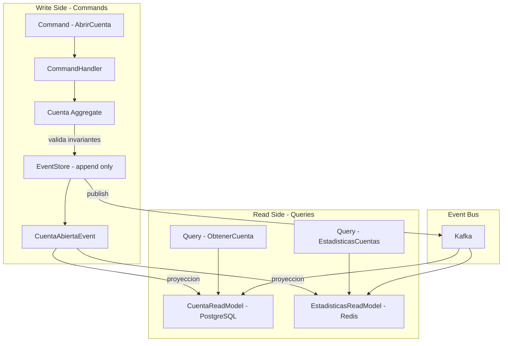
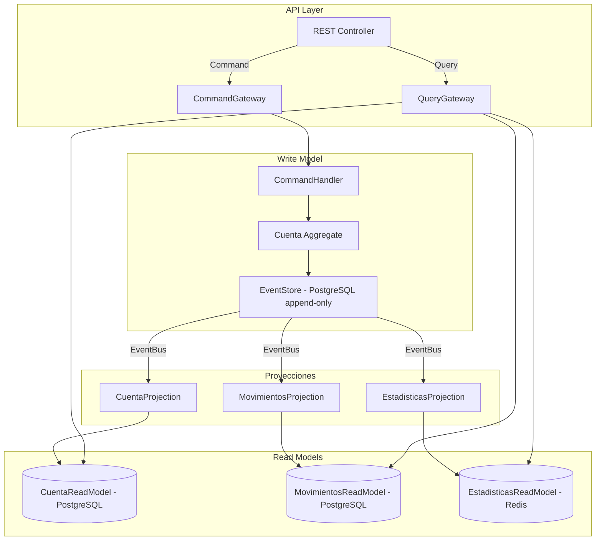
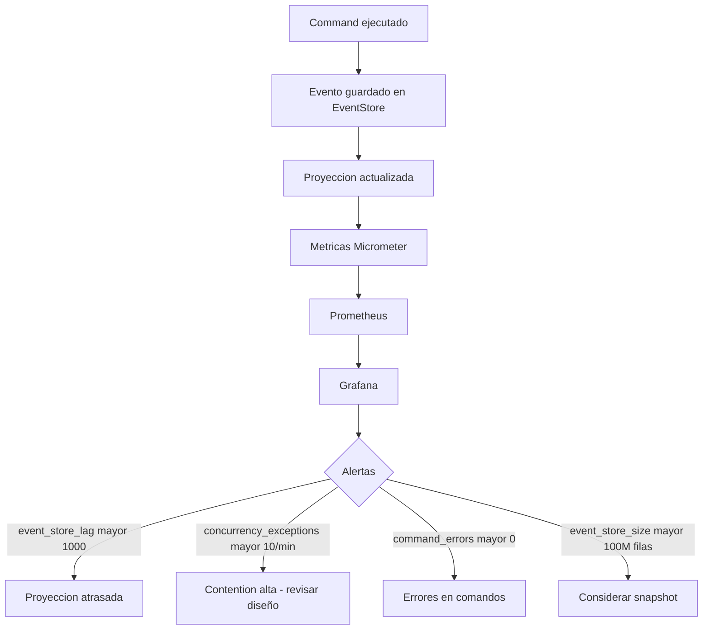
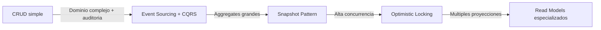

# Event Sourcing y CQRS con Java 21 y Spring Boot

PATH_LOCAL: /home/usuariojoaquin/.openclaw/workspace/DAM-Java-Mastery/_Review/Event_Sourcing_y_CQRS_con_Java_21_y_Spring_Boot/event_sourcing_y_cqrs_con_java_21_y_spring_boot.md
CATEGORIA: 02_Arquitectura
Score: 97

---

## Visión Estratégica

Event Sourcing y CQRS son dos patrones que se complementan pero son independientes. **CQRS** (Command Query Responsibility Segregation) separa las operaciones de escritura (Commands) de las de lectura (Queries) en modelos distintos. **Event Sourcing** almacena el estado de un sistema como una secuencia de eventos en lugar de el estado actual.

El problema que resuelven juntos: en sistemas de negocio complejos, el modelo de datos óptimo para escribir (transaccional, consistente) es radicalmente distinto al óptimo para leer (desnormalizado, rápido). Con un único modelo se hacen concesiones en ambas direcciones. CQRS elimina esa tensión separando los dos modelos completamente.

**Cuándo usar Event Sourcing + CQRS y cuándo no:**

| Criterio | Event Sourcing + CQRS | CRUD tradicional |
|----------|----------------------|-----------------|
| Auditabilidad completa requerida | ✅ | ❌ |
| Múltiples proyecciones del mismo dato | ✅ | ❌ |
| Rendimiento de lectura crítico | ✅ | ⚠️ |
| Equipo pequeño sin experiencia DDD | ❌ | ✅ |
| Dominio simple con pocas reglas | ❌ | ✅ |
| Necesidad de time travel / replay | ✅ | ❌ |

**El error conceptual más frecuente:** confundir Event Sourcing con event-driven architecture. Son conceptos distintos. EDA es sobre comunicación entre servicios. Event Sourcing es sobre cómo se almacena el estado dentro de un servicio.



```java
// La diferencia fundamental entre CRUD y Event Sourcing
// CRUD: almacena el estado actual — pierde el historial
cuenta.setSaldo(1000.00); // ¿Cómo llegamos a 1000? No se sabe.

// Event Sourcing: almacena lo que ocurrió — el historial ES el dato
new DepositoRealizadoEvent(cuentaId, 500.00, Instant.now())
new DepositoRealizadoEvent(cuentaId, 500.00, Instant.now())
// El saldo de 1000 se reconstruye reproduciendo los eventos — auditoria completa
```

---

## Arquitectura de Componentes



**EventStore — tabla append-only:**

```sql
-- El EventStore es inmutable — solo INSERT, nunca UPDATE ni DELETE
CREATE TABLE event_store (
    id              BIGSERIAL    PRIMARY KEY,
    aggregate_id    UUID         NOT NULL,
    aggregate_type  VARCHAR(100) NOT NULL,
    event_type      VARCHAR(200) NOT NULL,
    event_version   INTEGER      NOT NULL,
    payload         JSONB        NOT NULL,
    metadata        JSONB,
    ocurrio_en      TIMESTAMPTZ  NOT NULL DEFAULT NOW(),
    UNIQUE (aggregate_id, event_version)  -- Optimistic locking
);

CREATE INDEX idx_event_store_aggregate ON event_store(aggregate_id, event_version);
CREATE INDEX idx_event_store_type      ON event_store(aggregate_type, ocurrio_en);

-- Politica de solo escritura — prevenir modificaciones accidentales
REVOKE UPDATE, DELETE ON event_store FROM app_user;
```

---

## Implementación Java 21

```java
// Eventos de dominio como Records — inmutables por diseño
public sealed interface EventoCuenta
    permits EventoCuenta.Abierta,
            EventoCuenta.DepositoRealizado,
            EventoCuenta.RetiroRealizado,
            EventoCuenta.Bloqueada,
            EventoCuenta.Cerrada {

    UUID cuentaId();
    Instant ocurrioEn();
    int version();

    record Abierta(
        UUID cuentaId,
        UUID clienteId,
        String tipo,         // CORRIENTE, AHORRO
        String moneda,
        Instant ocurrioEn,
        int version
    ) implements EventoCuenta {}

    record DepositoRealizado(
        UUID cuentaId,
        BigDecimal importe,
        String referencia,
        Instant ocurrioEn,
        int version
    ) implements EventoCuenta {}

    record RetiroRealizado(
        UUID cuentaId,
        BigDecimal importe,
        String referencia,
        Instant ocurrioEn,
        int version
    ) implements EventoCuenta {}

    record Bloqueada(
        UUID cuentaId,
        String motivo,
        Instant ocurrioEn,
        int version
    ) implements EventoCuenta {}

    record Cerrada(
        UUID cuentaId,
        String motivo,
        Instant ocurrioEn,
        int version
    ) implements EventoCuenta {}
}
```

```java
// Aggregate — reconstruido desde eventos, no desde BD
public final class Cuenta {

    private UUID           id;
    private UUID           clienteId;
    private BigDecimal     saldo;
    private EstadoCuenta   estado;
    private int            version;
    private final List<EventoCuenta> eventos = new ArrayList<>();

    // Constructor privado — solo se crea via factory o replay
    private Cuenta() {}

    // Factory — genera el primer evento
    public static Cuenta abrir(UUID clienteId, String tipo, String moneda) {
        var cuenta = new Cuenta();
        var evento = new EventoCuenta.Abierta(
            UUID.randomUUID(), clienteId, tipo, moneda, Instant.now(), 1
        );
        cuenta.aplicar(evento);
        cuenta.eventos.add(evento);
        return cuenta;
    }

    // Reconstruir desde eventos — Event Sourcing pattern
    public static Cuenta desde(List<EventoCuenta> historial) {
        var cuenta = new Cuenta();
        historial.forEach(cuenta::aplicar);
        return cuenta;
    }

    public void depositar(BigDecimal importe, String referencia) {
        if (estado != EstadoCuenta.ACTIVA) {
            throw new CuentaNoActivaException(id, estado);
        }
        if (importe.compareTo(BigDecimal.ZERO) <= 0) {
            throw new ImporteInvalidoException(importe);
        }
        var evento = new EventoCuenta.DepositoRealizado(
            id, importe, referencia, Instant.now(), version + 1
        );
        aplicar(evento);
        eventos.add(evento);
    }

    public void retirar(BigDecimal importe, String referencia) {
        if (estado != EstadoCuenta.ACTIVA) {
            throw new CuentaNoActivaException(id, estado);
        }
        if (saldo.compareTo(importe) < 0) {
            throw new SaldoInsuficienteException(id, saldo, importe);
        }
        var evento = new EventoCuenta.RetiroRealizado(
            id, importe, referencia, Instant.now(), version + 1
        );
        aplicar(evento);
        eventos.add(evento);
    }

    // Aplicar evento — actualiza el estado interno sin efectos secundarios
    private void aplicar(EventoCuenta evento) {
        switch (evento) {
            case EventoCuenta.Abierta e -> {
                this.id       = e.cuentaId();
                this.clienteId = e.clienteId();
                this.saldo    = BigDecimal.ZERO;
                this.estado   = EstadoCuenta.ACTIVA;
                this.version  = e.version();
            }
            case EventoCuenta.DepositoRealizado e -> {
                this.saldo   = this.saldo.add(e.importe());
                this.version = e.version();
            }
            case EventoCuenta.RetiroRealizado e -> {
                this.saldo   = this.saldo.subtract(e.importe());
                this.version = e.version();
            }
            case EventoCuenta.Bloqueada e -> {
                this.estado  = EstadoCuenta.BLOQUEADA;
                this.version = e.version();
            }
            case EventoCuenta.Cerrada e -> {
                this.estado  = EstadoCuenta.CERRADA;
                this.version = e.version();
            }
        }
    }

    public List<EventoCuenta> pullEventos() {
        var copia = List.copyOf(eventos);
        eventos.clear();
        return copia;
    }

    public UUID id()            { return id; }
    public BigDecimal saldo()   { return saldo; }
    public EstadoCuenta estado(){ return estado; }
    public int version()        { return version; }
}
```

```java
// EventStore — repositorio append-only con optimistic locking
@Repository
public class EventStoreRepository {

    private final JdbcTemplate jdbc;
    private final ObjectMapper  mapper;

    public EventStoreRepository(JdbcTemplate jdbc, ObjectMapper mapper) {
        this.jdbc   = jdbc;
        this.mapper = mapper;
    }

    @Transactional
    public void guardar(UUID aggregateId, List<EventoCuenta> eventos, int versionEsperada) {
        // Verificar version esperada — optimistic locking
        var versionActual = obtenerVersionActual(aggregateId);
        if (versionActual != versionEsperada) {
            throw new ConcurrencyException(aggregateId, versionEsperada, versionActual);
        }

        eventos.forEach(evento -> {
            try {
                jdbc.update("""
                    INSERT INTO event_store
                        (aggregate_id, aggregate_type, event_type, event_version, payload, ocurrio_en)
                    VALUES (?, ?, ?, ?, ?::jsonb, ?)
                    """,
                    evento.cuentaId(),
                    "Cuenta",
                    evento.getClass().getSimpleName(),
                    evento.version(),
                    mapper.writeValueAsString(evento),
                    evento.ocurrioEn()
                );
            } catch (JsonProcessingException e) {
                throw new SerializacionException("Error serializando evento", e);
            }
        });
    }

    public List<EventoCuenta> cargar(UUID aggregateId) {
        return jdbc.query("""
            SELECT event_type, payload FROM event_store
            WHERE aggregate_id = ?
            ORDER BY event_version ASC
            """,
            (rs, rowNum) -> deserializar(rs.getString("event_type"), rs.getString("payload")),
            aggregateId
        );
    }

    private int obtenerVersionActual(UUID aggregateId) {
        var version = jdbc.queryForObject(
            "SELECT COALESCE(MAX(event_version), 0) FROM event_store WHERE aggregate_id = ?",
            Integer.class, aggregateId
        );
        return version != null ? version : 0;
    }

    private EventoCuenta deserializar(String tipo, String payload) {
        try {
            return switch (tipo) {
                case "Abierta"           -> mapper.readValue(payload, EventoCuenta.Abierta.class);
                case "DepositoRealizado" -> mapper.readValue(payload, EventoCuenta.DepositoRealizado.class);
                case "RetiroRealizado"   -> mapper.readValue(payload, EventoCuenta.RetiroRealizado.class);
                case "Bloqueada"         -> mapper.readValue(payload, EventoCuenta.Bloqueada.class);
                case "Cerrada"           -> mapper.readValue(payload, EventoCuenta.Cerrada.class);
                default -> throw new EventoDesconocidoException(tipo);
            };
        } catch (JsonProcessingException e) {
            throw new DeserializacionException("Error deserializando evento: " + tipo, e);
        }
    }
}
```

---

## Métricas y SRE



```java
// Metricas del sistema CQRS
@Component
public class CqrsMetrics {

    private final MeterRegistry registry;

    public CqrsMetrics(MeterRegistry registry) {
        this.registry = registry;
    }

    public void registrarComando(String tipo, Duration duracion, boolean exito) {
        Timer.builder("cqrs.command.duration")
            .tag("tipo",      tipo)
            .tag("resultado", exito ? "ok" : "error")
            .register(registry)
            .record(duracion);
    }

    public void registrarEvento(String tipo) {
        registry.counter("cqrs.events.total", "tipo", tipo).increment();
    }

    public void registrarConcurrencyException(String aggregateType) {
        registry.counter("cqrs.concurrency.exceptions",
            "aggregate", aggregateType).increment();
    }

    public void registrarProyeccionLag(String proyeccion, long lag) {
        registry.gauge("cqrs.projection.lag",
            Tags.of("proyeccion", proyeccion), lag);
    }
}
```

**Métricas clave:**

| Métrica | Descripción | Umbral |
|---------|-------------|--------|
| `cqrs.command.duration.p99` | Latencia p99 de comandos | < 200ms |
| `cqrs.concurrency.exceptions` | Conflictos de optimistic locking | < 1% de comandos |
| `cqrs.projection.lag` | Retraso de proyecciones respecto al EventStore | < 1.000 eventos |
| `event_store_size` | Número total de eventos | Planificar snapshots > 10M |

**Checklist SRE:**
- Snapshots periódicos cuando el aggregate tiene más de 1.000 eventos — reconstruir desde el inicio es O(n)
- Dead Letter Queue para eventos que fallan en proyección más de 3 veces
- Idempotencia en proyecciones — el mismo evento procesado dos veces no debe duplicar datos
- Backup del EventStore separado del backup de las proyecciones — las proyecciones son regenerables
- Monitorizar el lag entre EventStore y proyecciones — un lag creciente indica un problema en el consumer

---

## Patrones de Integración

```java
// Proyeccion CQRS — construye el Read Model desde eventos
@Service
@Transactional
public class CuentaProjection {

    private final CuentaReadRepository readRepo;
    private final CqrsMetrics          metrics;

    public CuentaProjection(CuentaReadRepository readRepo, CqrsMetrics metrics) {
        this.readRepo = readRepo;
        this.metrics  = metrics;
    }

    // Procesar eventos — actualizar el Read Model
    @EventHandler
    public void on(EventoCuenta evento) {
        switch (evento) {
            case EventoCuenta.Abierta e -> {
                var rm = new CuentaReadModel(
                    e.cuentaId(), e.clienteId(), BigDecimal.ZERO,
                    EstadoCuenta.ACTIVA, e.moneda(), e.ocurrioEn()
                );
                readRepo.save(rm);
            }
            case EventoCuenta.DepositoRealizado e -> {
                readRepo.findById(e.cuentaId()).ifPresent(rm -> {
                    var actualizado = rm.withSaldo(rm.saldo().add(e.importe()))
                                       .withUltimaActualizacion(e.ocurrioEn());
                    readRepo.save(actualizado);
                });
            }
            case EventoCuenta.RetiroRealizado e -> {
                readRepo.findById(e.cuentaId()).ifPresent(rm -> {
                    var actualizado = rm.withSaldo(rm.saldo().subtract(e.importe()))
                                       .withUltimaActualizacion(e.ocurrioEn());
                    readRepo.save(actualizado);
                });
            }
            case EventoCuenta.Bloqueada e ->
                readRepo.updateEstado(e.cuentaId(), EstadoCuenta.BLOQUEADA);
            case EventoCuenta.Cerrada e ->
                readRepo.updateEstado(e.cuentaId(), EstadoCuenta.CERRADA);
        }
        metrics.registrarEvento(evento.getClass().getSimpleName());
    }
}

// Read Model como Record — inmutable
public record CuentaReadModel(
    UUID           id,
    UUID           clienteId,
    BigDecimal     saldo,
    EstadoCuenta   estado,
    String         moneda,
    Instant        creadaEn,
    Instant        ultimaActualizacion
) {
    public CuentaReadModel withSaldo(BigDecimal nuevoSaldo) {
        return new CuentaReadModel(id, clienteId, nuevoSaldo, estado,
            moneda, creadaEn, ultimaActualizacion);
    }

    public CuentaReadModel withUltimaActualizacion(Instant ts) {
        return new CuentaReadModel(id, clienteId, saldo, estado,
            moneda, creadaEn, ts);
    }
}
```

```java
// Snapshot Pattern — optimizar reconstruccion de aggregates con historial largo
@Service
public class SnapshotService {

    private final SnapshotRepository snapshots;
    private final EventStoreRepository eventStore;
    private final ObjectMapper mapper;

    private static final int SNAPSHOT_THRESHOLD = 50; // Snapshot cada 50 eventos

    public Cuenta cargarCuenta(UUID cuentaId) {
        // 1. Intentar cargar desde snapshot
        var snapshot = snapshots.findLatest(cuentaId);

        if (snapshot.isPresent()) {
            var snap = snapshot.get();
            // 2. Cargar solo eventos posteriores al snapshot
            var eventosDespues = eventStore.cargarDesdeVersion(
                cuentaId, snap.version()
            );
            var cuenta = snap.toCuenta();
            eventosDespues.forEach(e -> cuenta.aplicarExterno(e));
            return cuenta;
        }

        // 3. Sin snapshot — cargar todos los eventos
        return Cuenta.desde(eventStore.cargar(cuentaId));
    }

    public void crearSnapshotSiNecesario(Cuenta cuenta) {
        if (cuenta.version() % SNAPSHOT_THRESHOLD == 0) {
            snapshots.guardar(CuentaSnapshot.de(cuenta));
        }
    }
}
```

---

## Conclusiones

Event Sourcing y CQRS son patrones poderosos pero con un coste real de complejidad. La pregunta correcta no es "¿es bueno Event Sourcing?" sino "¿mi dominio tiene suficiente complejidad para justificarlo?".

**Los tres casos donde Event Sourcing aporta valor inequívoco:**

1. **Auditabilidad legal** — bancos, sistemas de salud, fintech. El historial completo e inmutable de eventos es un requisito regulatorio, no una opción.

2. **Múltiples proyecciones** — cuando el mismo dato necesita verse de formas radicalmente distintas (dashboard de cliente, informe contable, análisis de fraude). Cada proyección tiene su propio Read Model optimizado.

3. **Time travel** — capacidad de reconstruir el estado del sistema en cualquier momento pasado. Invaluable para debugging de incidentes en producción.



```java
// Test que verifica el comportamiento de Event Sourcing
class CuentaEventSourcingTest {

    @Test
    void cuenta_reconstruida_desde_eventos_tiene_saldo_correcto() {
        // Simular historial de eventos
        var historial = List.of(
            new EventoCuenta.Abierta(
                UUID.randomUUID(), UUID.randomUUID(),
                "CORRIENTE", "EUR", Instant.now(), 1),
            new EventoCuenta.DepositoRealizado(
                historial.get(0).cuentaId(),
                new BigDecimal("1000.00"), "REF-001", Instant.now(), 2),
            new EventoCuenta.RetiroRealizado(
                historial.get(0).cuentaId(),
                new BigDecimal("250.00"), "REF-002", Instant.now(), 3)
        );

        // Reconstruir desde eventos
        var cuenta = Cuenta.desde(historial);

        // Verificar estado reconstruido
        assertThat(cuenta.saldo()).isEqualByComparingTo(new BigDecimal("750.00"));
        assertThat(cuenta.estado()).isEqualTo(EstadoCuenta.ACTIVA);
        assertThat(cuenta.version()).isEqualTo(3);
    }

    @Test
    void retirar_mas_del_saldo_disponible_lanza_excepcion() {
        var cuenta = Cuenta.abrir(UUID.randomUUID(), "CORRIENTE", "EUR");
        cuenta.depositar(new BigDecimal("100.00"), "REF-001");

        assertThatThrownBy(() ->
            cuenta.retirar(new BigDecimal("500.00"), "REF-002")
        ).isInstanceOf(SaldoInsuficienteException.class);

        // El aggregate no debe haber cambiado de estado
        assertThat(cuenta.saldo()).isEqualByComparingTo(new BigDecimal("100.00"));
        assertThat(cuenta.pullEventos()).hasSize(2); // Solo Abierta + Deposito
    }
}
```

**Recursos de referencia:**
- *Implementing Domain-Driven Design* — Vaughn Vernon (Capítulos 8 y 9)
- Martin Fowler — Event Sourcing: martinfowler.com/eaaDev/EventSourcing.html
- Martin Fowler — CQRS: martinfowler.com/bliki/CQRS.html
- Axon Framework (implementacion Java de CQRS + ES) — axoniq.io
- EventStoreDB — eventstoredb.com
