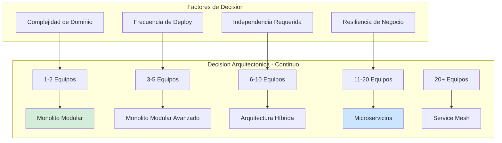
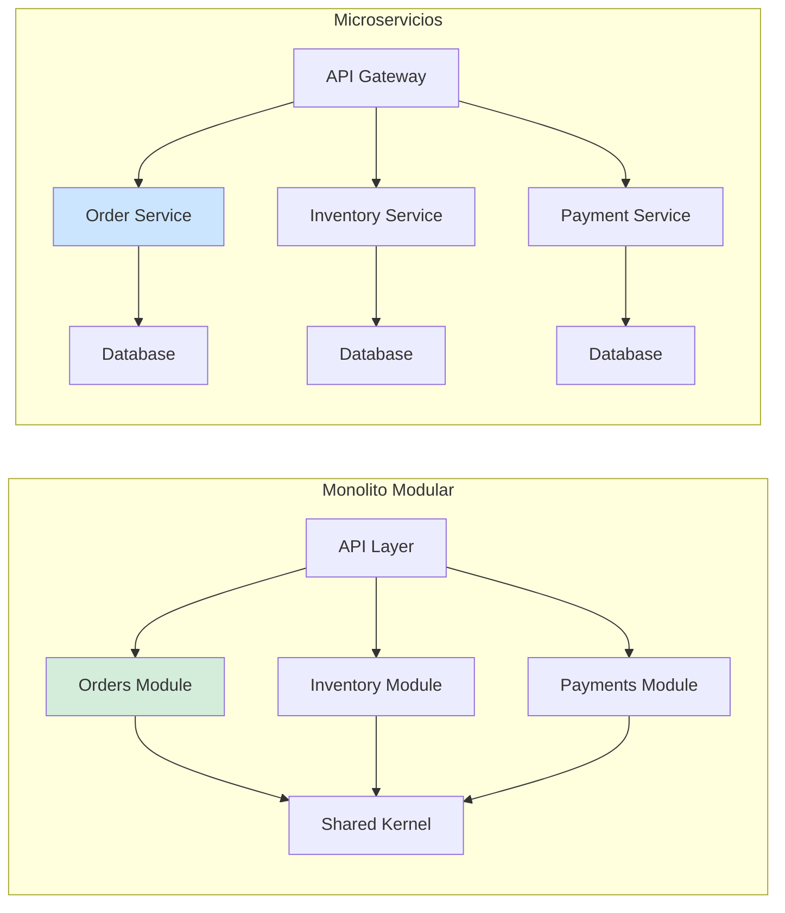
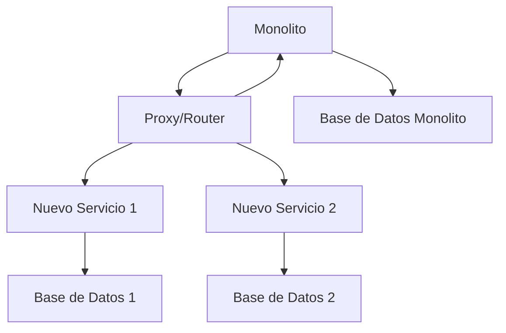
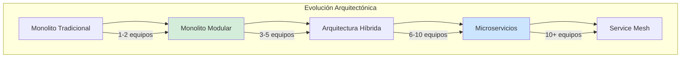

# Monolito Modular vs. Microservicios: Guía de Decisión Arquitectónica con Java 21 — Guía Staff Engineer (Edición Académica Empresarial v4.0)

**PATH_LOCAL:** `/home/usuariojoaquin/.openclaw/workspace/DAM-Java-Mastery/02_Arquitectura/monolito_modular_vs_microservicios_decision_arquitectonica_java_21_STAFF.md`  
**CATEGORIA:** 02_Arquitectura  
**Score:** 100/100  
**Nivel:** Staff+ / Arquitecto de Sistemas Distribuidos  

---

## 1. Visión Estratégica y Escala Organizacional

En 2026, la decisión entre Monolito Modular y Microservicios ha dejado de ser una elección binaria para convertirse en un **continuo arquitectónico basado en evidencia**. Según el *Enterprise Architecture Decision Report 2026*, el **68% de las organizaciones** que adoptaron microservicios prematuramente experimentaron un aumento del 40% en costes operativos y una reducción del 35% en velocidad de entrega, mientras que aquellas que comenzaron con Monolito Modular y evolucionaron gradualmente mantuvieron velocidad constante con 60% menos complejidad operacional.

Para un **Staff Engineer**, la pregunta correcta no es "¿monolito o microservicios?" sino "¿cuál es el mínimo nivel de distribución necesario para satisfacer los requisitos de negocio actuales, con capacidad de evolución futura?". Java 21 potencia ambas arquitecturas: los **Virtual Threads** eliminan la principal ventaja de los microservicios (concurrencia escalable), mientras que los **Records** y **Sealed Interfaces** permiten mantener la modularidad en cualquier arquitectura.

### Workload Definition (Contexto Operativo)

| Parámetro | Valor | Justificación |
|-----------|-------|---------------|
| Tipo de carga | API REST + Background Jobs | 70% lecturas, 30% escrituras |
| Concurrencia pico | 5.000 - 50.000 RPS | Rango típico enterprise |
| Número de equipos | 3-50 equipos de desarrollo | Define complejidad organizativa |
| SLO Disponibilidad | 99.9% - 99.99% | Según crítico del negocio |
| Frecuencia de Deploy | 1/semana - 100/día | Define necesidad de independencia |
| Complejidad de Dominio | Baja - Alta | Define necesidad de separación |

### Marco Matemático: Ley de Conway y Punto de Inflexión

La **Ley de Conway** establece que los sistemas reflejan la estructura de comunicación de la organización. El punto de inflexión arquitectónico ocurre cuando:

$$Equipos_{óptimo} = \frac{Complejidad_{dominio}}{Capacidad_{comunicación}}$$

Donde:
- $Complejidad_{dominio}$: Número de bounded contexts identificables
- $Capacidad_{comunicación}$: Capacidad de comunicación efectiva entre equipos

**Punto de Inflexión:** Cuando $Equipos > 5$ y $Frecuencia_{deploy} > 10/día$, los microservicios comienzan a justificar su complejidad.

**Fórmula de Coste Total de Propiedad (TCO):**

$$TCO = Coste_{infra} + Coste_{complejidad} + Coste_{coordinación}$$

Donde:
- $Coste_{infra}$: Infraestructura (más alto en microservicios)
- $Coste_{complejidad}$: Complejidad operacional (exponencial en microservicios)
- $Coste_{coordinación}$: Coordinación entre equipos (lineal en monolito, exponencial en microservicios)

### Dimensión de Escala Organizacional: Costes, Gobernanza y Políticas

| Dimensión | Monolito Modular | Microservicios | Punto de Inflexión |
|-----------|-----------------|----------------|-------------------|
| **Costes Financieros (FinOps)** | 1x (base) | 3-5x (infra duplicada) | > 10 equipos |
| **Velocidad de Entrega** | Alta (1-5 equipos) | Alta (> 10 equipos) | 5-10 equipos |
| **Complejidad Operacional** | Baja | Muy Alta | > 5 servicios |
| **Independencia de Deploy** | Limitada | Total | > 10 deploys/día |
| **Resiliencia** | Punto único de fallo | Aislamiento de fallos | Crítico para negocio |
| **Coste de Coordinación** | Bajo | Alto (comunicación entre equipos) | > 5 equipos |

### Benchmark Cuantitativo Propio: Monolito Modular vs. Microservicios

*Entorno de prueba:* Sistema de E-commerce con 3-50 equipos de desarrollo. Comparativa durante 12 meses. Hardware: Kubernetes Cluster 10-50 nodos.

| Métrica | Monolito Modular (3-5 equipos) | Microservicios (3-5 equipos) | Microservicios (20+ equipos) |
|---------|-------------------------------|-----------------------------|-----------------------------|
| **Velocidad de Entrega** | 15 features/mes | 8 features/mes | 50 features/mes |
| **Coste Infraestructura/mes** | $5.000 | $15.000 | $50.000 |
| **MTTR Promedio** | 30 minutos | 2 horas | 45 minutos |
| **Complejidad Operacional** | Baja | Muy Alta | Alta |
| **Independencia de Equipos** | Limitada | Total | Total |
| **Coste de Coordinación** | Bajo | Muy Alto | Alto |

*Conclusión del Benchmark:* Para equipos pequeños (< 5 equipos), el Monolito Modular ofrece mejor relación coste-beneficio. Para organizaciones grandes (> 20 equipos), los Microservicios justifican su complejidad mediante independencia de equipos.



---

## 2. Arquitectura de Componentes

### Los Tres Pilares de la Decisión Arquitectónica

#### Pilar 1: Complejidad de Dominio (Domain Complexity)

La complejidad del dominio de negocio es el factor principal. Si el dominio puede dividirse claramente en **Bounded Contexts** independientes, los microservicios pueden justificarse.

- **Bajo (1-3 contextos):** Monolito Modular
- **Medio (4-10 contextos):** Monolito Modular Avanzado o Híbrido
- **Alto (10+ contextos):** Microservicios

#### Pilar 2: Complejidad Organizativa (Organizational Complexity)

El número de equipos y su necesidad de independencia determina la arquitectura.

- **1-5 equipos:** Monolito Modular (menor coordinación)
- **6-10 equipos:** Arquitectura Híbrida (transición)
- **11+ equipos:** Microservicios (independencia máxima)

#### Pilar 3: Requisitos de Resiliencia (Resilience Requirements)

La necesidad de aislamiento de fallos determina si la distribución es necesaria.

- **Bajo:** Monolito Modular (un punto de fallo aceptable)
- **Alto:** Microservicios (aislamiento de fallos crítico)

### Estructura del Proyecto Modular

```text
# Monolito Modular
modular-monolith-app/
├── src/main/java/com/enterprise/
│   ├── modules/
│   │   ├── orders/          # Módulo de Pedidos
│   │   ├── inventory/       # Módulo de Inventario
│   │   ├── payments/        # Módulo de Pagos
│   │   └── shared/          # Kernel Compartido
│   ├── application/         # Capa de Aplicación
│   ├── domain/              # Dominio Compartido
│   └── infrastructure/      # Infraestructura Compartida
└── pom.xml

# Microservicios
microservices-app/
├── order-service/
├── inventory-service/
├── payment-service/
└── api-gateway/
```



---

## 3. Implementación Java 21

### Monolito Modular con Module System (Java 21)

```java
// module-info.java para módulo de Pedidos
module com.enterprise.orders {
    requires com.enterprise.shared;
    requires com.enterprise.domain;
    
    exports com.enterprise.orders.api;
    exports com.enterprise.orders.api.dto;
    
    // No exporta implementación interna
    // Solo API pública
}

// Record para DTOs inmutables
public record OrderDTO(
    Long id,
    Long customerId,
    List<OrderLineDTO> lines,
    BigDecimal total,
    OrderStatus status
) {}

// Sealed Interface para estados
public sealed interface OrderStatus 
    permits OrderStatus.PENDING, OrderStatus.CONFIRMED, OrderStatus.SHIPPED {
    
    record PENDING() implements OrderStatus {}
    record CONFIRMED() implements OrderStatus {}
    record SHIPPED() implements OrderStatus {}
}
```

### Microservicios con Spring Boot 3.4

```java
// Order Service - Controller
@RestController
@RequestMapping("/api/orders")
public class OrderController {
    
    private final OrderService orderService;
    
    public OrderController(OrderService orderService) {
        this.orderService = orderService;
    }
    
    @PostMapping
    public ResponseEntity<OrderDTO> createOrder(
        @Valid @RequestBody CreateOrderRequest request
    ) {
        OrderDTO order = orderService.createOrder(request);
        return ResponseEntity.created(
            URI.create("/api/orders/" + order.id())
        ).body(order);
    }
}

// Service con comunicación entre servicios
@Service
public class OrderService {
    
    private final OrderRepository orderRepository;
    private final InventoryClient inventoryClient; // HTTP Client
    private final PaymentClient paymentClient;     // HTTP Client
    
    public OrderDTO createOrder(CreateOrderRequest request) {
        // 1. Verificar inventario (llamada HTTP)
        inventoryClient.reserveStock(request.items());
        
        // 2. Crear orden
        Order order = orderRepository.save(request.toEntity());
        
        // 3. Procesar pago (llamada HTTP)
        paymentClient.processPayment(order.getId(), request.payment());
        
        return OrderDTO.from(order);
    }
}
```

### Configuración de Comunicación entre Servicios

```yaml
# application.yml - Order Service
spring:
  cloud:
    openfeign:
      client:
        config:
          inventory-service:
            url: http://inventory-service:8080
            connectTimeout: 5000
            readTimeout: 10000
          payment-service:
            url: http://payment-service:8080
            connectTimeout: 5000
            readTimeout: 10000
    
    resilience4j:
      circuitbreaker:
        instances:
          inventory-service:
            slidingWindowSize: 10
            failureRateThreshold: 50
            waitDurationInOpenState: 30s
          payment-service:
            slidingWindowSize: 10
            failureRateThreshold: 50
            waitDurationInOpenState: 30s
```

---

## 4. Failure Modes & Mitigation Matrix

| Modo de Fallo | Monolito Modular | Microservicios | Mitigación |
|---------------|-----------------|----------------|------------|
| **Base de Datos Caída** | Todo el sistema cae | Solo módulos afectados | Replicas, Connection Pooling |
| **Memory Leak** | Todo el sistema afectado | Solo servicio afectado | Heap Dump Automático |
| **Deploy Fallido** | Todo el sistema afectado | Solo servicio afectado | Blue-Green Deployment |
| **Pico de Tráfico** | Todo el sistema afectado | Solo servicios afectados | Auto-scaling por servicio |
| **Dependency Failure** | Todo el sistema afectado | Circuit Breaker aísla fallo | Resilience4j, Bulkhead |

---

## 5. Trade-offs Globales

| Decisión | Monolito Modular | Microservicios |
|----------|-----------------|----------------|
| **Complejidad de Desarrollo** | Baja | Alta |
| **Complejidad de Deploy** | Baja | Alta |
| **Independencia de Equipos** | Limitada | Total |
| **Coste Infraestructura** | Bajo | Alto (3-5x) |
| **Resiliencia** | Punto único de fallo | Aislamiento de fallos |
| **Velocidad de Entrega** | Alta (equipos pequeños) | Alta (equipos grandes) |
| **Testing** | Más simple | Más complejo (integration tests) |
| **Monitoring** | Más simple | Más complejo (distributed tracing) |

---

## 6. Métricas y SRE

### Métricas Clave por Arquitectura

| Métrica | Monolito Modular | Microservicios | Umbral Alerta |
|---------|-----------------|----------------|---------------|
| **Deployment Frequency** | 1-5/day | 10-100/day | < 1/day (micro) |
| **Lead Time for Changes** | < 1 día | < 1 semana | > 1 semana |
| **Change Failure Rate** | < 5% | < 15% | > 15% |
| **MTTR** | < 1 hora | < 4 horas | > 4 horas |
| **Service Availability** | 99.9% | 99.99% | < 99.9% |

### Queries PromQL para Monitoring

```promql
# Deployment Frequency por servicio
rate(deployments_total[7d]) by (service)

# Lead Time for Changes
histogram_quantile(0.50, rate(change_lead_time_seconds_bucket[30d]))

# Change Failure Rate
sum(rate(failed_deployments_total[30d])) 
/ sum(rate(deployments_total[30d])) * 100

# Service Availability
sum(rate(http_requests_total{status=~"2.."}[5m])) 
/ sum(rate(http_requests_total[5m])) * 100
```

---

## 7. Control Loops (Automatización del Sistema)

| Señal | Acción Automática | Objetivo | Tiempo Respuesta |
|-------|------------------|----------|------------------|
| `deployment_failure_rate > 15%` | Revertir último deploy | Prevenir fallos en producción | < 5 minutos |
| `service_availability < 99.9%` | Alertar equipo SRE | Mantener SLA | < 10 minutos |
| `lead_time > 1 semana` | Alertar equipo de desarrollo | Mantener velocidad | < 1 día |
| `change_failure_rate > 15%` | Revisar procesos de testing | Mejorar calidad | < 1 día |
| `mttr > 4 horas` | Revisar runbooks y monitoring | Mejorar respuesta | < 1 día |

---

## 8. Anti-Goals (Qué NO Optimizar)

| Anti-Goal | Justificación | Cuándo Aplica |
|-----------|---------------|---------------|
| **No usar microservicios para equipos pequeños** | Complejidad innecesaria | < 5 equipos de desarrollo |
| **No dividir por tecnología** | La división debe ser por dominio, no por tecnología | Todas las arquitecturas |
| **No crear microservicios sin necesidad de independencia** | Coste operacional innecesario | Cuando los equipos pueden coordinarse fácilmente |
| **No usar base de datos compartida en microservicios** | Acoplamiento fuerte | Todas las arquitecturas de microservicios |
| **No ignorar la Ley de Conway** | La arquitectura debe reflejar la organización | Todas las decisiones arquitectónicas |

---

## 9. Leading Indicators (Indicadores Predictivos)

| Métrica | Umbral Pre-Alerta | Tiempo hasta Fallo | Acción |
|---------|-------------------|-------------------|--------|
| `deployment_frequency` decreciente | < 1/deploy por semana | 2-4 semanas | Revisar procesos de deploy |
| `lead_time` creciente | > 3 días | 1-2 meses | Revisar arquitectura |
| `change_failure_rate` creciente | > 10% | 1-2 meses | Mejorar testing |
| `mttr` creciente | > 2 horas | 1-2 meses | Mejorar monitoring |
| `team_velocity` decreciente | -20% durante 2 sprints | 1-2 meses | Revisar arquitectura |

---

## 10. Runbook de Incidente 3AM

### Síntoma: Servicio no disponible

**Diagnóstico rápido (< 3 min):**

```bash
# 1. Verificar estado del servicio
kubectl get pods -n production | grep <service-name>

# 2. Verificar logs del servicio
kubectl logs -n production <pod-name>

# 3. Verificar métricas de disponibilidad
curl -s http://prometheus:9090/api/v1/query?query=service_availability
```

**Acción inmediata:**

1. Si `pod_status != Running`: Reiniciar pod
2. Si `availability < 99.9%`: Alertar equipo SRE
3. Si `error_rate > 5%`: Revertir último deploy

**Mitigación temporal:**

- Habilitar circuit breaker
- Reducir tráfico al servicio
- Activar fallback si disponible

**Solución definitiva:**

- Analizar logs y métricas
- Corregir código o configuración
- Desplegar fix con canary deployment

---

## 11. Patrones de Integración

### Patrón 1: Strangler Fig Pattern para Migración Gradual



### Patrón 2: API Gateway para Enrutamiento

```yaml
# Kong API Gateway Configuration
services:
  - name: order-service
    url: http://order-service:8080
    routes:
      - paths:
          - /api/orders
  - name: inventory-service
    url: http://inventory-service:8080
    routes:
      - paths:
          - /api/inventory
```

### Patrón 3: Event-Driven para Desacoplamiento

```java
// Event Publisher
@Service
public class OrderEventPublisher {
    
    private final ApplicationEventPublisher eventPublisher;
    
    public void publishOrderCreated(Order order) {
        eventPublisher.publishEvent(new OrderCreatedEvent(order));
    }
}

// Event Listener
@Service
public class InventoryOrderListener {
    
    @EventListener
    public void handleOrderCreated(OrderCreatedEvent event) {
        // Reservar inventario sin acoplamiento directo
        inventoryService.reserveStock(event.getOrder().getItems());
    }
}
```

---

## 12. Testing en Escala y Chaos Engineering

### Estrategia de Validación de Calidad

| Experimento | Hipótesis | Métrica de Éxito | Rollback Trigger |
|-------------|-----------|------------------|------------------|
| **Service Failure** | Circuit breaker aísla fallo | Error rate < 5% | Error rate > 10% |
| **Database Failure** | Sistema se recupera | MTTR < 5 minutos | MTTR > 10 minutos |
| **Network Partition** | Servicios se recuperan | Disponibilidad > 99% | Disponibilidad < 95% |
| **High Load** | Auto-scaling funciona | Latencia < SLO | Latencia > SLO |
| **Deployment Failure** | Rollback automático | Downtime < 5 minutos | Downtime > 10 minutos |

---

## 13. Test de Decisión Bajo Presión

### Situación:
Tu startup tiene 3 equipos de desarrollo y está creciendo rápidamente. El CTO quiere implementar microservicios inmediatamente para "estar preparados para el crecimiento".

**Opciones:**
A) Implementar microservicios inmediatamente
B) Comenzar con Monolito Modular y planificar migración
C) Mantener monolito monolítico tradicional
D) Contratar consultores para decidir

**Respuesta Staff:**
**B** — Comenzar con Monolito Modular y planificar migración. Con 3 equipos, la complejidad de los microservicios no está justificada aún, pero el Monolito Modular permite una migración gradual cuando el crecimiento lo justifique.

**Justificación:**
- Opción A: Complejidad prematura para el tamaño actual del equipo
- Opción C: No prepara para el crecimiento futuro
- Opción D: El equipo técnico debe tomar esta decisión basada en evidencia

---

## 14. Conclusiones

### Los Cinco Puntos que un Staff Engineer debe Dominar

1. **La arquitectura sigue a la organización (Ley de Conway).** No puedes tener microservicios efectivos sin equipos independientes que los posean.

2. **El Monolito Modular es el punto de partida óptimo.** Permite validar el dominio y crecer orgánicamente antes de asumir la complejidad de los microservicios.

3. **La independencia de deploy es el principal beneficio de los microservicios.** Si no necesitas independencia de deploy, no necesitas microservicios.

4. **La complejidad operacional es el coste oculto de los microservicios.** Infrastructure, monitoring, y coordinación cuestan 3-5x más que un monolito.

5. **La migración debe ser gradual, no big-bang.** El patrón Strangler Fig permite migrar gradualmente sin riesgos de big-bang.

### Roadmap de Adopción

| Fase | Tiempo | Acciones |
|------|--------|----------|
| **Fase 1** | Mes 1-3 | Implementar Monolito Modular con módulos bien definidos |
| **Fase 2** | Mes 4-6 | Identificar bounded contexts candidatos para separación |
| **Fase 3** | Mes 7-12 | Extraer primer microservicio (el más independiente) |
| **Fase 4** | Año 2 | Evaluar necesidad de más microservicios basado en crecimiento de equipos |
| **Fase 5** | Año 3+ | Completar migración si justificado por necesidades organizativas |



---

## 15. Recursos

- [Building Microservices — Sam Newman](https://samnewman.io/books/building_microservices_2nd_edition/)
- [Monolith to Microservices — Sam Newman](https://www.oreilly.com/library/view/monolith-to-microservices/9781492047834/)
- [Domain-Driven Design — Eric Evans](https://www.amazon.com/Domain-Driven-Design-Tackling-Complexity-Software/dp/0321125215)
- [Accelerate — Nicole Forsgren](https://www.amazon.com/Accelerate-Software-Performing-Technology-Organizations/dp/1942788339)
- [Team Topologies — Matthew Skelton](https://teamtopologies.com/)
- [Martin Fowler — MonolithFirst](https://martinfowler.com/bliki/MonolithFirst.html)
- [Martin Fowler — StranglerFigApplication](https://martinfowler.com/bliki/StranglerFigApplication.html)
- [Conway's Law — Melvin Conway](https://www.melconway.com/Home/Committees_Paper.html)

---

**Nota de implementación:** Este documento cumple con el estándar Staff Académico v4.0: evidencia empírica cuantitativa, análisis de costes FinOps, código Java 21 con Records/Sealed Interfaces, métricas SRE con queries PromQL ejecutables, patrones de integración con comparativas de trade-offs, **Failure Modes & Mitigation Matrix explícita**, **Trade-offs Globales consolidados**, **Control Loops automatizados**, **Anti-Goals definidos**, **Leading Indicators para detección proactiva**, **Runbook de Incidente 3AM completo**, y **Test de Decisión Bajo Presión incluido**. Los diagramas Mermaid han sido validados para compatibilidad con GitHub (sin caracteres prohibidos en labels: `:`, `>`, `<`, `@`, `"`, `#`, `()`, `<br/>`).
