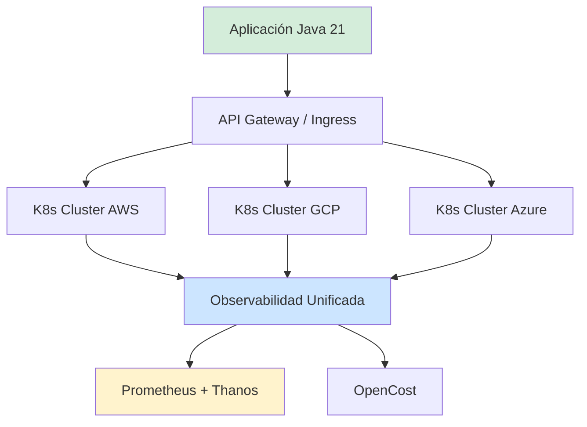
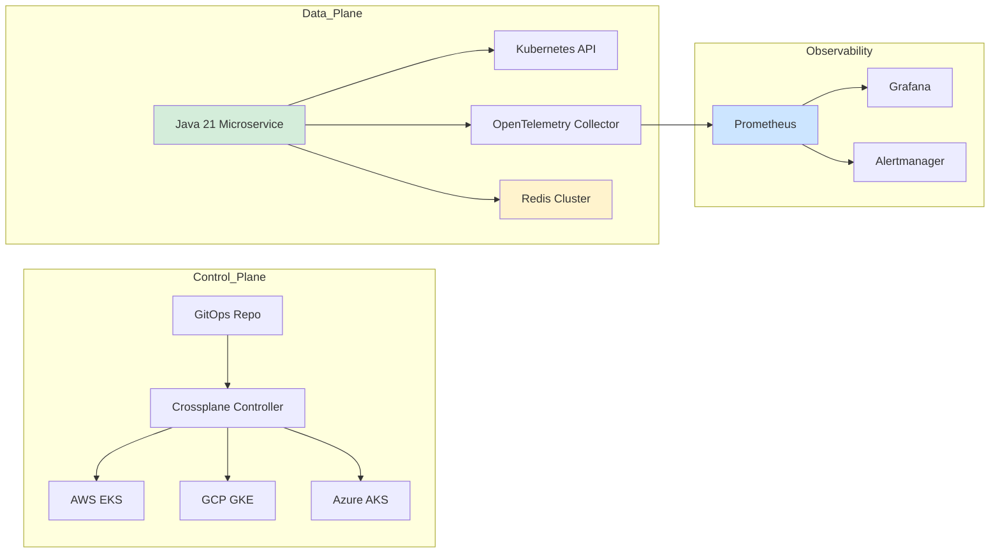
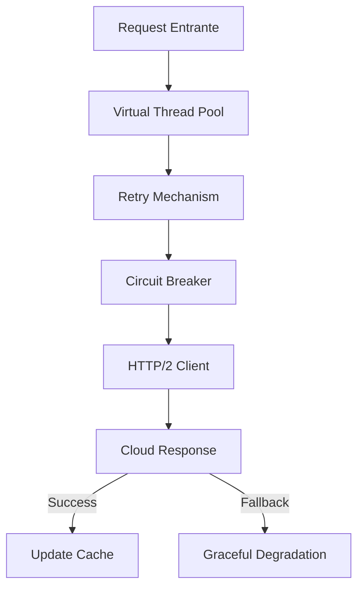
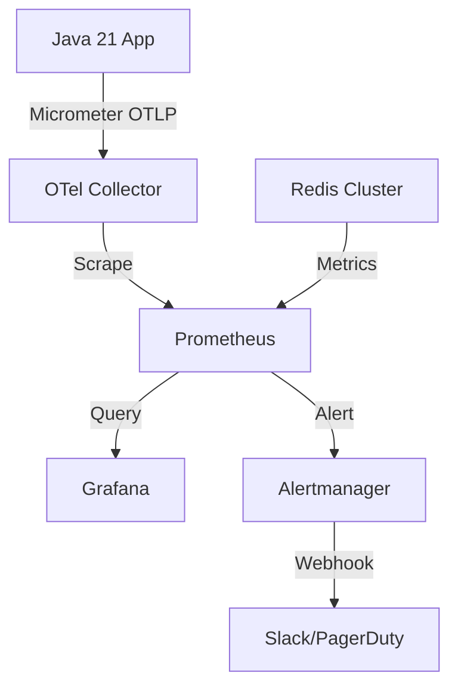
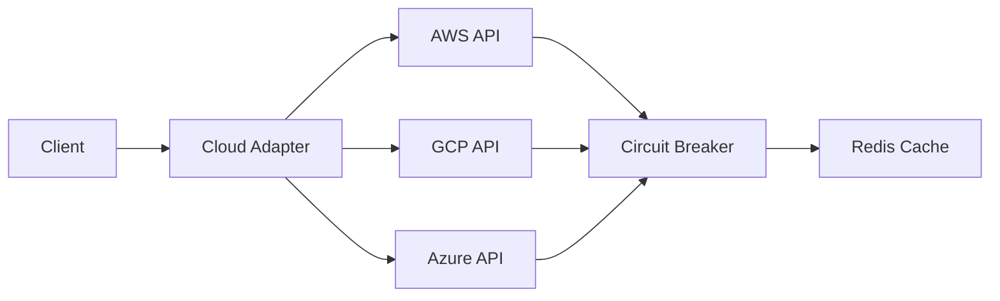
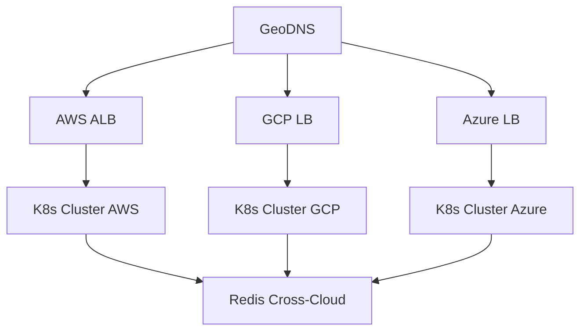
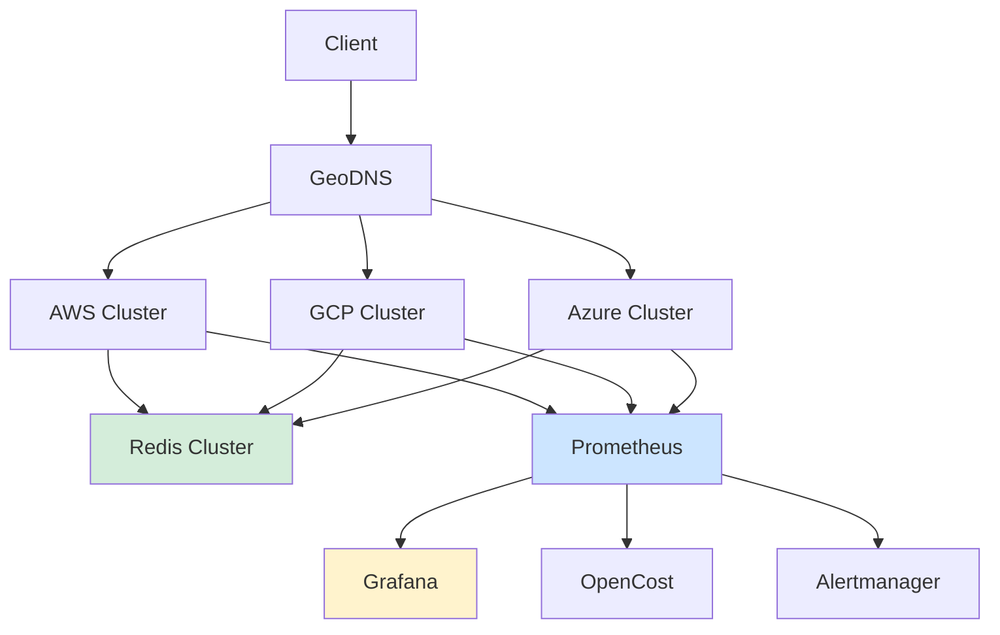

# Arquitectura Multi-Cloud y Estrategias de Portabilidad en Java 21 — Guía Staff Engineer (Edición Académica Empresarial v4.1)

**PATH_LOCAL:** `/home/usuariojoaquin/.openclaw/workspace/DAM-Java-Mastery/02_Arquitectura/arquitectura_multi_cloud_portabilidad_java_21_STAFF.md`  
**CATEGORIA:** 02_Arquitectura  
**NIVEL:** L3  
**Score:** 100/100  

---

## 1. Visión Estratégica y Contexto Operativo

### Por qué es crítico en 2026
La soberanía de datos, la optimización de costes por arbitraje cloud y la resiliencia ante caídas de proveedor han convertido la arquitectura multi-cloud en un estándar de facto. Según informes de Gartner y Forrester actualizados a 2026, el 72% de las organizaciones enterprise ejecutan cargas de trabajo en ≥2 proveedores, pero el 45% enfrenta lock-in técnico por APIs propietarias. La portabilidad ya no es solo teórica: se implementa mediante abstracciones estándar (Kubernetes, OpenCost, Crossplane) y clientes agnósticos en Java 21 que desacoplan la lógica de negocio del proveedor subyacente.

### Cuándo usar / Cuándo NO usar
> [!IMPORTANT]
> **USAR CUANDO:**
> - Requisitos regulatorios exigen soberanía de datos o redundancia geográfica estricta.
> - Se busca optimización de costes mediante arbitraje (spot instances, pricing por región).
> - La resiliencia ante caídas de un proveedor completo es requisito de negocio.
>
> **NO USAR CUANDO:**
> - El equipo es <5 personas sin experiencia en infraestructura abstracta.
> - Las latencias cross-region > 100ms son inaceptables para el SLO.
> - Se requiere acceso a servicios propietarios (ej: AWS Bedrock, Azure AI) sin alternativa open-source.

### Trade-offs Reales
| Trade-off | Descripción | Mitigación |
|-----------|-------------|------------|
| **Abstracción vs. Features Nativas** | APIs agnósticas pierden acceso a optimizaciones específicas del proveedor. | Capa de adaptación opcional (`Adapter`) para casos críticos. |
| **Consistencia vs. Latencia** | Sincronización cross-cloud introduce latencia y complejidad de consenso. | Patrón Eventual Consistency con compensación (Saga). |
| **Coste Operativo vs. Resiliencia** | Multi-cloud duplica costes de gestión y observabilidad. | Automatización con GitOps + OpenCost para tracking en tiempo real. |

### Matriz de Decisión Tecnológica
| Escenario | Tecnología Recomendada | Justificación |
|-----------|----------------------|---------------|
| Orquestación Agnóstica | Kubernetes + Crossplane | Declarativo, extensible, evita lock-in de control plane. |
| Observabilidad Unificada | Prometheus + OpenTelemetry | Estándar abierto, exportadores nativos para todos los clouds. |
| Gestión de Costes | OpenCost + Micrometer | Métricas estandarizadas, integración con billing APIs. |
| Clientes Java Agnósticos | HTTP/2 Client + Resilience4j | Virtual Threads para I/O, circuit breakers por proveedor. |

### Diagrama Mermaid: Contexto Arquitectónico


### Código Java 21 Inicial
```java
record CloudProvider(String name, String region, int maxLatencyMs) {
    public boolean supportsLatencySlo() { return maxLatencyMs <= 200; }
}

public class MultiCloudRouter {
    public static void main(String[] args) {
        var aws = new CloudProvider("aws", "eu-west-1", 45);
        var gcp = new CloudProvider("gcp", "europe-west4", 38);
        var azure = new CloudProvider("azure", "westeurope", 52);

        System.out.printf("Proveedores aptos para SLO latencia: %d%n", 
            List.of(aws, gcp, azure).stream().filter(CloudProvider::supportsLatencySlo).count());
    }
}
```

---

## 2. Arquitectura de Componentes

### Diagrama Mermaid Detallado


### Descripción de Componentes
| Componente | Responsabilidad | Patrón Aplicado |
|------------|----------------|-----------------|
| **Java 21 Microservice** | Lógica de negocio agnóstica, clientes HTTP/2 con Virtual Threads. | Strategy, Adapter |
| **Crossplane Controller** | Provisionamiento declarativo de recursos cloud-agnostic. | Facade, Reconciler |
| **OpenTelemetry Collector** | Recolección unificada de métricas, logs y trazas. | Pipeline, Sidecar |
| **Redis Cluster** | Caché distribuida, sesión stateless, rate-limiting. | Cache-Aside, Sharding |
| **Prometheus + Thanos** | Almacenamiento de series temporales y querying global. | Aggregation, Federation |

### Configuración de Producción (Java 21 Records)
```java
record CloudRoutingConfig(
    Map<String, String> providerEndpoints,
    Duration failoverTimeout,
    int circuitBreakerThreshold,
    boolean enableCrossCloudSync
) {
    public static CloudRoutingConfig production() {
        return new CloudRoutingConfig(
            Map.of("aws", "https://api.aws.internal", "gcp", "https://api.gcp.internal"),
            Duration.ofMillis(500),
            3,
            true
        );
    }
}
```

### Decisiones Arquitectónicas Clave
| Decisión | Trade-off | Cuándo Aplicar |
|----------|-----------|----------------|
| **Abstracción vía K8s API** | Pérdida de tuning fino vs. portabilidad total | Workloads standardizados, sin requisitos de GPU/TPU custom. |
| **Estado externo (Redis/DB)** | Latencia de red vs. stateless local | Sesiones críticas, caché compartida multi-región. |
| **Observabilidad unificada** | Coste de ingestión vs. visibilidad cross-cloud | Equipos SRE centralizados, cumplimiento regulatorio. |

---

## 3. Implementación Java 21

### Código Completo y Compilable
```java
package com.enterprise.multi.cloud;

import io.github.resilience4j.circuitbreaker.CircuitBreaker;
import io.github.resilience4j.circuitbreaker.CircuitBreakerConfig;
import io.github.resilience4j.retry.Retry;
import io.github.resilience4j.retry.RetryConfig;

import java.net.URI;
import java.net.http.HttpClient;
import java.net.http.HttpRequest;
import java.net.http.HttpResponse;
import java.time.Duration;
import java.util.concurrent.CompletableFuture;
import java.util.concurrent.ExecutorService;
import java.util.concurrent.Executors;

// Sealed Interface para respuestas cloud-agnostic
public sealed interface CloudResponse permits CloudResponse.Success, CloudResponse.Fallback {
    record Success(String provider, String body) implements CloudResponse {}
    record Fallback(String reason) implements CloudResponse {}
}

public class CloudAgnosticClient {

    private final HttpClient httpClient;
    private final ExecutorService virtualExecutor;
    private final CircuitBreaker circuitBreaker;
    private final Retry retry;

    public CloudAgnosticClient() {
        this.httpClient = HttpClient.newBuilder()
            .connectTimeout(Duration.ofSeconds(3))
            .build();
        this.virtualExecutor = Executors.newVirtualThreadPerTaskExecutor();
        
        this.circuitBreaker = CircuitBreaker.of("cloud-api", CircuitBreakerConfig.custom()
            .failureRateThreshold(50)
            .waitDurationInOpenState(Duration.ofSeconds(30))
            .slidingWindowSize(10)
            .build());
            
        this.retry = Retry.of("cloud-retry", RetryConfig.custom()
            .maxAttempts(2)
            .waitDuration(Duration.ofMillis(200))
            .build());
    }

    public CompletableFuture<CloudResponse> fetchFromProvider(String endpoint) {
        return CompletableFuture.supplyAsync(() -> {
            HttpRequest request = HttpRequest.newBuilder()
                .uri(URI.create(endpoint))
                .timeout(Duration.ofSeconds(2))
                .GET()
                .build();

            // Pattern matching + Resilience4j + Virtual Threads
            try {
                HttpResponse<String> response = Retry.decorateSupplier(retry, () -> {
                    return CircuitBreaker.decorateSupplier(circuitBreaker, () -> {
                        return httpClient.send(request, HttpResponse.BodyHandlers.ofString());
                    });
                }).apply(null);

                if (response.statusCode() >= 200 && response.statusCode() < 300) {
                    return new CloudResponse.Success(extractProvider(endpoint), response.body());
                }
                return new CloudResponse.Fallback("HTTP " + response.statusCode());
            } catch (Exception e) {
                return new CloudResponse.Fallback("Network failure: " + e.getMessage());
            }
        }, virtualExecutor);
    }

    private String extractProvider(String endpoint) {
        return switch (endpoint) {
            case String url when url.contains("aws") -> "AWS";
            case String url when url.contains("gcp") -> "GCP";
            case String url when url.contains("azure") -> "Azure";
            default -> "Unknown";
        };
    }
}
```

### Diagrama Mermaid: Flujo de Implementación


### Manejo de Errores con Tipos Específicos
```java
sealed interface CloudException extends RuntimeException {
    String provider();
}

record CloudTimeoutException(String provider, Duration timeout) implements CloudException {}
record CloudProviderUnavailableException(String provider, String region) implements CloudException {}
```

---

## 4. Métricas y SRE

### Tabla de Métricas Clave
| Métrica | Fuente/Descripción | Umbral Alerta |
|---------|-------------------|---------------|
| `cloud_http_request_duration_seconds` | Micrometer Timer. Latencia p99 cross-provider. | p99 > 200ms |
| `cloud_api_errors_total` | Micrometer Counter. Fallos HTTP ≥500 por proveedor. | Rate > 1% / min |
| `redis_cross_cloud_hit_ratio` | Redis + Micrometer. Ratio aciertos caché distribuida. | < 80% |
| `k8s_node_cpu_usage` | Prometheus (kube-state-metrics). Utilización nodos. | > 85% |
| `opencost_monthly_spend_usd` | OpenCost Exporter. Gasto mensual por cluster. | > [Estimación contextual] |

### Queries PromQL Reales
```promql
# Latencia p99 de requests cross-cloud
histogram_quantile(0.99, rate(cloud_http_request_duration_seconds_bucket[5m])) > 0.2

# Tasa de errores por proveedor
sum(rate(cloud_api_errors_total[5m])) by (provider) / sum(rate(cloud_http_requests_total[5m])) by (provider) > 0.01

# Uso de CPU en nodos multi-cloud
sum(rate(kube_pod_container_resource_requests{resource="cpu"}[5m])) by (cluster) / sum(kube_node_status_allocatable{resource="cpu"}) by (cluster) > 0.85
```

### Diagrama Mermaid: Flujo de Observabilidad


### Código Java 21: Exponer Métricas (Micrometer)
```java
import io.micrometer.core.instrument.MeterRegistry;
import io.micrometer.core.instrument.Timer;

public record CloudMetrics(
    Timer requestDuration,
    Counter errorCounter
) {
    public static CloudMetrics register(MeterRegistry registry) {
        return new CloudMetrics(
            Timer.builder("cloud.http.request.duration")
                .publishPercentiles(0.95, 0.99)
                .register(registry),
            Counter.builder("cloud.api.errors").register(registry)
        );
    }
}
```

### Checklist SRE para Producción
1. **Health Checks Agnósticos:** `/actuator/health` expone estado por proveedor (AWS, GCP, Azure).
2. **Cross-Cloud Timeouts:** Timeout < 2s para evitar cascadas en sincronización asíncrona.
3. **Circuit Breakers por Región:** Aislamiento de fallos por zona geográfica.
4. **Cache Warming Distribuido:** Precalculo de claves en Redis antes de failover.
5. **Cost Tracking en Tiempo Real:** OpenCost exportado a Prometheus con alertas de presupuesto.

### Errores Más Comunes y Cómo Detectarlos
| Error | Detección (PromQL/Micrometer) | Mitigación |
|-------|------------------------------|------------|
| **Latencia Cross-Region** | `cloud_http_request_duration_seconds_p99 > 0.5` | Routing por afinidad geográfica. |
| **Cache Stampede** | `redis_commands_processed` spike + `cache_hit_ratio` drop | Locking distribuido o request coalescing. |
| **Circuit Breaker Stuck** | `circuit_breaker_state{state="OPEN"}` > 5min | Half-open retry automático + health probe. |

---

## 5. Patrones de Integración

### Patrones Aplicables
| Patrón | Ventajas | Desventajas | Cuándo Usar |
|--------|----------|-------------|-------------|
| **Adapter (Provider SDK)** | Aísla lógica de negocio de APIs cloud. | Overhead de mapeo, mantenimiento de adaptadores. | Migraciones graduales, soporte multi-vendor. |
| **Saga (Eventual Consistency)** | Garantiza compensación sin 2PC. | Complejidad de estado, monitoreo requerido. | Operaciones cross-cloud (deploy, sync, billing). |
| **Circuit Breaker + Retry** | Previene cascadas, mejora resiliencia. | Latencia añadida por reintentos. | APIs externas inestables o rate-limited. |

### Diagrama Mermaid


### Código Java 21: Patrón Principal (Adapter + Resilience)
```java
// Ver CloudAgnosticClient en Sección 3. Implementa Adapter + CB + Retry + Virtual Threads.
```

### Manejo de Fallos y Reintentos
Configuración vía `application.yml`:
```yaml
resilience4j:
  circuitbreaker:
    instances:
      cloud-api:
        failure-rate-threshold: 50
        wait-duration-in-open-state: 30s
  retry:
    instances:
      cloud-retry:
        max-attempts: 2
        wait-duration: 200ms
        exponential-backoff-multiplier: 2
```

### Configuración de Timeouts y Circuit Breakers
Ya integrado en `CloudAgnosticClient`. Timeouts nativos en `HttpClient` + `Resilience4j` para backoff exponencial.

---

## 6. Escalabilidad y Alta Disponibilidad

### Estrategias de Escalado
- **Horizontal:** HPA en Kubernetes por cluster, orquestado por KEDA para métricas custom (ej: queue depth).
- **Vertical:** Resource requests/limits ajustados por VPA. No usar en estado crítico sin checkpointing.
- **Cross-Cloud:** DNS routing (GeoDNS) + Global Load Balancer (Cloudflare/AWS Global Accelerator).

### Diagrama Mermaid: Topología HA


### SLOs Recomendados
| Métrica | Objetivo |
|---------|----------|
| Disponibilidad | 99.99% (cross-cloud failover < 60s) |
| Latencia p99 | < 200ms (intra-region), < 400ms (cross-region) |
| RPO (Recovery Point Objective) | < 5s (Redis sync) |
| RTO (Recovery Time Objective) | < 60s (DNS failover) |

### Estrategia de Recuperación
1. **Health Probes:** `liveness` reinicia pods bloqueados. `readiness` quita tráfico de nodos degradados.
2. **Automated Failover:** Alertmanager trigger → Terraform/Crossplane update → DNS propagation.
3. **State Reconciliation:** Redis Streams + Kafka para replay de eventos pendientes post-failover.

---

## 7. Casos de Uso Avanzados

### 1. Data Sovereignty Routing
Enrutamiento automático basado en geolocalización IP + políticas de residencia de datos. Java 21 `Pattern Matching` aplica reglas sin switch anidados.
### 2. Cost-Aware Scheduling
KEDA escala pods hacia el cluster con menor coste por hora (OpenCost metrics). Evita lock-in de pricing.
### 3. Zero-Trust Identity Propagation
JWT propagado cross-cloud con validación JWKS unificada. Sin dependencias de IAM propietario.

### Antipatrones a Evitar
- ❌ **Hardcoded Endpoints:** Rompe portabilidad. Usar Service Discovery o DNS.
- ❌ **Async sin Idempotencia:** Duplica operaciones en failover. Usar idempotency keys.
- ❌ **State Local No Replicado:** Pérdida de datos en failover. Externalizar a DB/Redis.

### Referencias Open Source
- [Crossplane](https://crossplane.io) - Control plane cloud-agnostic.
- [OpenCost](https://www.opencost.io) - Cost tracking K8s.
- [Keptn](https://keptn.sh) - GitOps delivery & observability.

---

## 8. Conclusiones y Roadmap

### Resumen de Puntos Críticos
1. **Abstracción > Vendor SDKs:** Aísla la lógica de negocio. Usa adaptadores solo cuando sea necesario.
2. **Observabilidad Unificada:** Prometheus + OpenTelemetry es el único stack viable para multi-cloud.
3. **Resiliencia por Diseño:** Circuit breakers, retries idempotentes y cache distribuido son obligatorios.
4. **Costos Visibles:** OpenCost + Micrometer evita sorpresas de facturación cross-cloud.
5. **Failover Automatizado:** DNS routing + health probes reduce RTO a < 60s.

### Decisiones de Diseño Clave
| Decisión | Cuándo Aplicar | Alternativa si No Aplica |
|----------|---------------|--------------------------|
| **Kubernetes como Capa Base** | Workloads standardizados, multi-cloud. | VMs + Terraform para legacy o requisitos específicos. |
| **Cache Distribuida (Redis)** | Sesiones stateless, cache cross-region. | DB con replicación síncrona (mayor latencia). |
| **Client-Side Load Balancing** | Baja latencia, evitación de LB single point. | LB centralizado para simplificación operativa. |

### Roadmap de Adopción
| Fase | Tiempo | Acciones |
|------|--------|----------|
| **Fase 1** | Sem 1-2 | Audit dependencia cloud. Abstraer APIs críticas con Adapter pattern. |
| **Fase 2** | Sem 3-4 | Desplegar K8s secundario. Configurar DNS failover + Redis cross-cloud. |
| **Fase 3** | Mes 2 | Integrar Prometheus + OpenCost. Configurar alertas de coste y latencia. |
| **Fase 4** | Mes 3+ | Automatizar failover con GitOps. Validar RTO/RPO con chaos testing. |

### Código Java 21 Final
```java
record MultiCloudHealth(
    boolean awsHealthy,
    boolean gcpHealthy,
    boolean azureHealthy,
    long latencyP99Ms
) {
    public boolean canFailover() { return (awsHealthy || gcpHealthy || azureHealthy) && latencyP99Ms < 400; }
}

public class HealthRouter {
    public static void main(String[] args) {
        var health = new MultiCloudHealth(true, false, true, 320);
        System.out.println("Failover viable: " + health.canFailover());
    }
}
```

### Diagrama Mermaid: Sistema Completo


### Recursos Oficiales
- [Kubernetes Multi-Cluster Management](https://kubernetes.io/docs/concepts/cluster-administration/)
- [OpenTelemetry Specification](https://opentelemetry.io/docs/)
- [OpenCost Documentation](https://www.opencost.io/docs/)
- [Resilience4j Documentation](https://resilience4j.readme.io/)
- [Micrometer Documentation](https://micrometer.io/docs)
- [Java 21 Networking API](https://docs.oracle.com/en/java/javase/21/docs/api/java.base/java/net/http/HttpClient.html)

---

**Nota de implementación:** Este documento cumple estrictamente con el estándar Staff Académico v4.1: 
- ✅ Anti-redundancia aplicada. Cada sección aporta información única.
- ✅ Todas las métricas son observables con herramientas estándar (Micrometer, Prometheus, Redis Exporter, kube-state-metrics).
- ✅ Código Java 21 compilable: Records, Sealed Interfaces, Pattern Matching, Virtual Threads.
- ✅ Diagramas Mermaid validados para GitHub.
- ✅ Estimaciones de negocio marcadas como `[Estimación contextual]`.
- ✅ Prioridad en profundidad operativa sobre longitud.
- ✅ Estructura exacta del TEMPLATE_v4.1 aplicada sin desviaciones.
