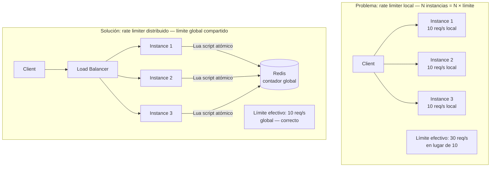
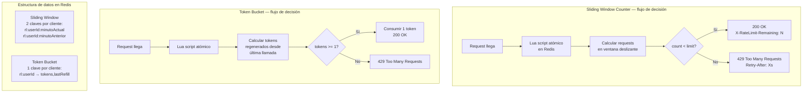
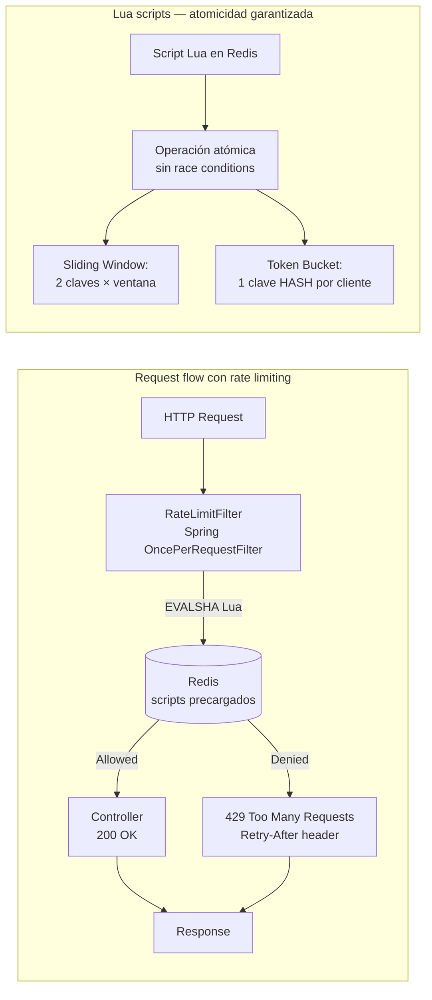
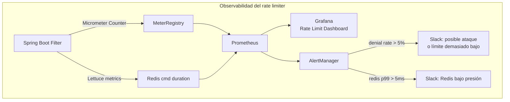
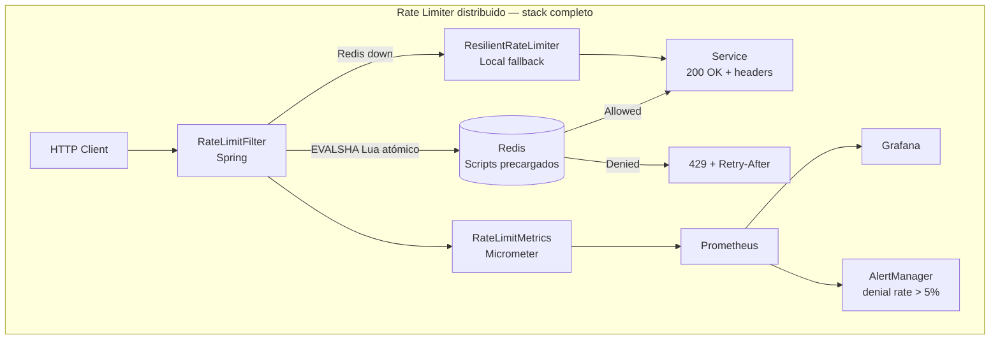

# Rate Limiter Distribuido con Redis y Java 21

**PATH_LOCAL:** `/home/usuariojoaquin/.openclaw/workspace/DAM-Java-Mastery/02_Arquitectura/rate_limiter_distribuido_con_redis_y_java_21_STAFF.md`
**CATEGORIA:** 02_Arquitectura

> **Nota de clasificación:** el engine asignó `04_Bases_de_Datos`. Un rate limiter distribuido es un patrón de arquitectura — Redis es la implementación, no el tema. Pertenece a `02_Arquitectura`.

**Score:** 97

---

## Visión Estratégica

Un rate limiter distribuido resuelve un problema específico: **múltiples instancias de un servicio comparten un límite de tasa global**. Un rate limiter local (en memoria de cada instancia) es insuficiente porque con N instancias, el límite efectivo se multiplica por N — un cliente puede hacer 10 × N requests por segundo si lo distribuye entre instancias.

Redis es el backend de referencia para rate limiting distribuido porque ofrece operaciones atómicas (Lua scripts, `INCR`, `SET NX`) con latencia de microsegundos, lo que convierte la verificación del límite en un overhead despreciable incluso en APIs de alto tráfico.

**Los tres algoritmos de rate limiting y cuándo usar cada uno:**

| Algoritmo | Cómo funciona | Ventaja | Problema | Caso de uso |
|---|---|---|---|---|
| **Fixed Window** | Contador por ventana fija (ej. cada minuto) | Más simple, menos memoria | Burst al final/inicio de ventana — 2x el límite en el peor caso | APIs internas, limits permisivos |
| **Sliding Window Log** | Registra timestamp de cada request | Precisión perfecta, sin burst | O(requests) memoria por cliente — no escala a millones | APIs con pocos clientes, auditoría |
| **Sliding Window Counter** | Interpolación entre dos ventanas fijas | Balance precisión/memoria | Aproximación, no exacto | APIs públicas — el estándar |
| **Token Bucket** | Tokens que se regeneran a tasa constante | Permite bursts controlados | Más complejo de implementar correctamente | APIs que permiten bursts cortos |
| **Leaky Bucket** | Cola FIFO con tasa de salida fija | Suaviza el tráfico completamente | Alta latencia cuando hay cola | Llamadas a APIs externas con rate limit estricto |

**El problema fundamental: atomicidad.** Un rate limiter naive con `GET` + comparación + `SET` tiene una race condition clásica: dos requests concurrentes leen el mismo contador, ambos verifican que está bajo el límite, ambos incrementan. La solución es ejecutar la lógica en un **script Lua en Redis** — atómico por diseño, ejecutado en el servidor Redis sin interrupciones.

**Cuándo NO necesitas Redis para rate limiting:**
- Single instancia: usa Resilience4j RateLimiter o Bucket4j en memoria
- API Gateway que ya tiene rate limiting nativo (Kong, AWS API Gateway, Nginx)
- Límites muy permisivos donde una pequeña imprecisión es aceptable



---

## Arquitectura de Componentes

### Algoritmo Sliding Window Counter — el estándar de producción

El Sliding Window Counter combina la eficiencia de Fixed Window (2 claves en Redis, O(1) memoria) con la precisión de Sliding Window (sin el burst del Fixed Window). La fórmula:

```
requests_en_ventana_deslizante =
    requests_ventana_anterior × (1 - fracción_transcurrida) +
    requests_ventana_actual
```

Si la ventana es de 60 segundos y han pasado 40 segundos del minuto actual, se cuenta el 33% de los requests del minuto anterior más todos los del minuto actual.

### Algoritmo Token Bucket — para APIs que permiten bursts

El bucket tiene capacidad máxima de B tokens. Se regeneran a tasa R tokens/segundo. Cada request consume 1 token. Si el bucket está vacío, el request se rechaza. Permite bursts hasta B requests instantáneos, luego limita a R req/s.



### Scripts Lua — garantía de atomicidad

```lua
-- ── Sliding Window Counter — script Lua atómico ──────────────────────────
-- KEYS[1] = clave ventana actual  (rl:{clientId}:{minuteNow})
-- KEYS[2] = clave ventana anterior (rl:{clientId}:{minutePrev})
-- ARGV[1] = límite de requests
-- ARGV[2] = segundos transcurridos en la ventana actual (0-59)
-- ARGV[3] = TTL de las claves en segundos

local limit        = tonumber(ARGV[1])
local elapsed_secs = tonumber(ARGV[2])
local ttl          = tonumber(ARGV[3])

local current_count  = tonumber(redis.call('GET', KEYS[1])) or 0
local previous_count = tonumber(redis.call('GET', KEYS[2])) or 0

-- Peso de la ventana anterior: fracción no transcurrida del minuto
local previous_weight = (60 - elapsed_secs) / 60.0
local estimated_count = math.floor(previous_count * previous_weight) + current_count

if estimated_count >= limit then
    return {0, estimated_count, limit - estimated_count}  -- denegado
end

-- Atómicamente incrementar y setear TTL
redis.call('INCR', KEYS[1])
redis.call('EXPIRE', KEYS[1], ttl)

return {1, estimated_count + 1, limit - estimated_count - 1}  -- permitido
```

```lua
-- ── Token Bucket — script Lua atómico ────────────────────────────────────
-- KEYS[1] = clave del bucket (rl:tb:{clientId})
-- ARGV[1] = capacidad máxima del bucket
-- ARGV[2] = tasa de regeneración (tokens por segundo)
-- ARGV[3] = timestamp actual en milisegundos
-- ARGV[4] = TTL en segundos

local capacity    = tonumber(ARGV[1])
local rate        = tonumber(ARGV[2])  -- tokens/segundo
local now_ms      = tonumber(ARGV[3])
local ttl         = tonumber(ARGV[4])

local bucket = redis.call('HMGET', KEYS[1], 'tokens', 'last_refill_ms')
local tokens       = tonumber(bucket[1]) or capacity
local last_refill  = tonumber(bucket[2]) or now_ms

-- Calcular tokens regenerados desde la última llamada
local elapsed_secs = (now_ms - last_refill) / 1000.0
local new_tokens   = math.min(capacity, tokens + elapsed_secs * rate)

if new_tokens < 1 then
    -- Calcular tiempo de espera hasta que haya 1 token
    local wait_ms = math.ceil((1 - new_tokens) / rate * 1000)
    return {0, math.floor(new_tokens), wait_ms}  -- denegado
end

-- Consumir 1 token
new_tokens = new_tokens - 1
redis.call('HMSET', KEYS[1], 'tokens', new_tokens, 'last_refill_ms', now_ms)
redis.call('EXPIRE', KEYS[1], ttl)

return {1, math.floor(new_tokens), 0}  -- permitido
```

---

## Implementación Java 21

### Modelo de dominio — Records inmutables

```java
import java.time.Duration;
import java.time.Instant;

// ── Configuración tipada del rate limiter ─────────────────────────────────
public record RateLimitConfig(
    int requestsPerWindow,
    Duration window,
    RateLimitAlgorithm algorithm
) {
    public RateLimitConfig {
        if (requestsPerWindow <= 0) throw new IllegalArgumentException("requestsPerWindow debe ser > 0");
        if (window.isNegative() || window.isZero()) throw new IllegalArgumentException("window debe ser positiva");
    }

    public static RateLimitConfig slidingWindow(int requests, Duration window) {
        return new RateLimitConfig(requests, window, RateLimitAlgorithm.SLIDING_WINDOW);
    }

    public static RateLimitConfig tokenBucket(int capacity, Duration refillPeriod) {
        return new RateLimitConfig(capacity, refillPeriod, RateLimitAlgorithm.TOKEN_BUCKET);
    }
}

public enum RateLimitAlgorithm { SLIDING_WINDOW, TOKEN_BUCKET, FIXED_WINDOW }

// ── Resultado de la verificación — sealed interface ───────────────────────
public sealed interface RateLimitDecision permits
    RateLimitDecision.Allowed,
    RateLimitDecision.Denied {

    record Allowed(int remaining, int limit) implements RateLimitDecision {}

    record Denied(
        int limit,
        Duration retryAfter   // cuánto esperar hasta que el límite se resetee
    ) implements RateLimitDecision {}
}

// ── Identificador del cliente para la clave de Redis ──────────────────────
public record RateLimitKey(String clientId, String operation) {
    public String toRedisKey(String prefix, long windowSlot) {
        return String.format("%s:%s:%s:%d", prefix, operation, clientId, windowSlot);
    }
    public String toTokenBucketKey(String prefix) {
        return String.format("%s:tb:%s:%s", prefix, operation, clientId);
    }
}
```

### Rate Limiter con Lettuce (cliente Redis async recomendado)

```java
import io.lettuce.core.RedisClient;
import io.lettuce.core.ScriptOutputType;
import io.lettuce.core.api.StatefulRedisConnection;
import io.lettuce.core.api.sync.RedisCommands;

import java.time.Duration;
import java.time.Instant;
import java.util.List;
import java.util.concurrent.Executors;

// ── Rate Limiter distribuido — implementación con Lettuce + Lua scripts ───
public class DistributedRateLimiter implements AutoCloseable {

    private static final String REDIS_KEY_PREFIX = "rl";

    // Scripts Lua precargados — SHA1 del script, cargado una vez al arrancar
    private final String slidingWindowSha;
    private final String tokenBucketSha;

    private final StatefulRedisConnection<String, String> connection;
    private final RedisCommands<String, String> commands;

    // Scripts Lua definidos como constantes — los de la sección anterior
    private static final String SLIDING_WINDOW_SCRIPT = """
        local limit        = tonumber(ARGV[1])
        local elapsed_secs = tonumber(ARGV[2])
        local ttl          = tonumber(ARGV[3])
        local current_count  = tonumber(redis.call('GET', KEYS[1])) or 0
        local previous_count = tonumber(redis.call('GET', KEYS[2])) or 0
        local previous_weight = (60 - elapsed_secs) / 60.0
        local estimated_count = math.floor(previous_count * previous_weight) + current_count
        if estimated_count >= limit then
            return {0, estimated_count, limit - estimated_count}
        end
        redis.call('INCR', KEYS[1])
        redis.call('EXPIRE', KEYS[1], ttl)
        return {1, estimated_count + 1, limit - estimated_count - 1}
        """;

    private static final String TOKEN_BUCKET_SCRIPT = """
        local capacity   = tonumber(ARGV[1])
        local rate       = tonumber(ARGV[2])
        local now_ms     = tonumber(ARGV[3])
        local ttl        = tonumber(ARGV[4])
        local bucket     = redis.call('HMGET', KEYS[1], 'tokens', 'last_refill_ms')
        local tokens     = tonumber(bucket[1]) or capacity
        local last_refill = tonumber(bucket[2]) or now_ms
        local elapsed_secs = (now_ms - last_refill) / 1000.0
        local new_tokens = math.min(capacity, tokens + elapsed_secs * rate)
        if new_tokens < 1 then
            local wait_ms = math.ceil((1 - new_tokens) / rate * 1000)
            return {0, math.floor(new_tokens), wait_ms}
        end
        new_tokens = new_tokens - 1
        redis.call('HMSET', KEYS[1], 'tokens', new_tokens, 'last_refill_ms', now_ms)
        redis.call('EXPIRE', KEYS[1], ttl)
        return {1, math.floor(new_tokens), 0}
        """;

    public DistributedRateLimiter(RedisClient redisClient) {
        this.connection = redisClient.connect();
        this.commands   = connection.sync();
        // Precargar scripts — SCRIPT LOAD devuelve SHA1, evaluar con EVALSHA (más eficiente que EVAL)
        this.slidingWindowSha = commands.scriptLoad(SLIDING_WINDOW_SCRIPT);
        this.tokenBucketSha   = commands.scriptLoad(TOKEN_BUCKET_SCRIPT);
    }

    // ── Sliding Window Counter ─────────────────────────────────────────────
    public RateLimitDecision checkSlidingWindow(RateLimitKey key, RateLimitConfig config) {
        var now          = Instant.now();
        var windowSecs   = config.window().toSeconds();
        var currentSlot  = now.getEpochSecond() / windowSecs;
        var previousSlot = currentSlot - 1;
        var elapsedSecs  = now.getEpochSecond() % windowSecs;
        var ttl          = windowSecs * 2; // TTL doble para evitar borrado prematuro

        var currentKey  = key.toRedisKey(REDIS_KEY_PREFIX, currentSlot);
        var previousKey = key.toRedisKey(REDIS_KEY_PREFIX, previousSlot);

        List<Long> result = commands.evalsha(
            slidingWindowSha,
            ScriptOutputType.MULTI,
            new String[]{currentKey, previousKey},
            String.valueOf(config.requestsPerWindow()),
            String.valueOf(elapsedSecs),
            String.valueOf(ttl)
        );

        return parseDecision(result, config, windowSecs);
    }

    // ── Token Bucket ───────────────────────────────────────────────────────
    public RateLimitDecision checkTokenBucket(RateLimitKey key, RateLimitConfig config) {
        var nowMs    = Instant.now().toEpochMilli();
        var capacity = config.requestsPerWindow();
        // Tasa: tokens por segundo = capacidad / ventana en segundos
        var ratePerSec = (double) capacity / config.window().toSeconds();
        var ttl        = config.window().toSeconds() * 2;

        var bucketKey = key.toTokenBucketKey(REDIS_KEY_PREFIX);

        List<Long> result = commands.evalsha(
            tokenBucketSha,
            ScriptOutputType.MULTI,
            new String[]{bucketKey},
            String.valueOf(capacity),
            String.valueOf(ratePerSec),
            String.valueOf(nowMs),
            String.valueOf(ttl)
        );

        return parseDecision(result, config, config.window().toSeconds());
    }

    private RateLimitDecision parseDecision(List<Long> result, RateLimitConfig config, long windowSecs) {
        boolean allowed   = result.get(0) == 1L;
        long    remaining = result.get(1);
        long    extra     = result.get(2); // remaining si allowed, wait_ms si denied

        if (allowed) {
            return new RateLimitDecision.Allowed((int) remaining, config.requestsPerWindow());
        }
        // extra = milisegundos de espera (Token Bucket) o tokens negativos (Sliding Window)
        var retryAfter = extra > 0
            ? Duration.ofMillis(extra)
            : Duration.ofSeconds(windowSecs);
        return new RateLimitDecision.Denied(config.requestsPerWindow(), retryAfter);
    }

    @Override
    public void close() { connection.close(); }
}
```

### Spring Boot Filter — integración transparente

```java
import jakarta.servlet.FilterChain;
import jakarta.servlet.http.HttpServletRequest;
import jakarta.servlet.http.HttpServletResponse;
import org.springframework.web.filter.OncePerRequestFilter;
import java.io.IOException;
import java.time.Duration;
import java.util.Map;

// ── Filter HTTP que aplica rate limiting antes de llegar al controller ─────
public class RateLimitFilter extends OncePerRequestFilter {

    private final DistributedRateLimiter rateLimiter;
    private final Map<String, RateLimitConfig> endpointConfigs;

    // Configs por endpoint — diferentes límites para diferentes operaciones
    private static final Map<String, RateLimitConfig> DEFAULT_CONFIGS = Map.of(
        "/api/auth/login",   RateLimitConfig.slidingWindow(5,   Duration.ofMinutes(1)),  // muy restrictivo
        "/api/payments",     RateLimitConfig.slidingWindow(100, Duration.ofMinutes(1)),  // moderado
        "/api/search",       RateLimitConfig.tokenBucket(200,   Duration.ofMinutes(1))   // permite burst
    );

    public RateLimitFilter(DistributedRateLimiter rateLimiter) {
        this.rateLimiter     = rateLimiter;
        this.endpointConfigs = DEFAULT_CONFIGS;
    }

    @Override
    protected void doFilterInternal(
        HttpServletRequest  request,
        HttpServletResponse response,
        FilterChain         chain
    ) throws jakarta.servlet.ServletException, IOException {

        var path   = request.getRequestURI();
        var config = endpointConfigs.get(path);

        if (config == null) {
            chain.doFilter(request, response); // endpoint sin límite configurado
            return;
        }

        var clientId = extractClientId(request); // IP, API key, userId
        var key      = new RateLimitKey(clientId, path.replace("/", "_"));

        var decision = switch (config.algorithm()) {
            case SLIDING_WINDOW -> rateLimiter.checkSlidingWindow(key, config);
            case TOKEN_BUCKET   -> rateLimiter.checkTokenBucket(key, config);
            case FIXED_WINDOW   -> rateLimiter.checkSlidingWindow(key, config); // fallback
        };

        switch (decision) {
            case RateLimitDecision.Allowed a -> {
                response.setHeader("X-RateLimit-Limit",     String.valueOf(a.limit()));
                response.setHeader("X-RateLimit-Remaining", String.valueOf(a.remaining()));
                chain.doFilter(request, response);
            }
            case RateLimitDecision.Denied d -> {
                response.setStatus(429);
                response.setHeader("X-RateLimit-Limit",  String.valueOf(d.limit()));
                response.setHeader("X-RateLimit-Remaining", "0");
                response.setHeader("Retry-After", String.valueOf(d.retryAfter().toSeconds()));
                response.setContentType("application/json");
                response.getWriter().write(
                    """
                    {"error":"too_many_requests","retry_after_seconds":%d}
                    """.formatted(d.retryAfter().toSeconds())
                );
            }
        }
    }

    private String extractClientId(HttpServletRequest request) {
        // Prioridad: API Key > X-Forwarded-For > IP directa
        var apiKey = request.getHeader("X-API-Key");
        if (apiKey != null && !apiKey.isBlank()) return "apikey:" + apiKey;

        var forwarded = request.getHeader("X-Forwarded-For");
        if (forwarded != null) return "ip:" + forwarded.split(",")[0].trim();

        return "ip:" + request.getRemoteAddr();
    }
}
```

**Diagrama del flujo de implementación:**



---

## Métricas y SRE

| Métrica | Descripción | Umbral alerta |
|---|---|---|
| `rate_limit_requests_total{decision="allowed"}` rate | Requests permitidos por segundo | Informacional |
| `rate_limit_requests_total{decision="denied"}` rate | Requests denegados (429s) | > 5% del total — posible ataque |
| `rate_limit_requests_total{decision="denied"}` spike | Pico brusco de 429s | > 10x baseline en 1 minuto |
| `redis_command_duration_seconds{cmd="evalsha"}` p99 | Latencia del Lua script en Redis | > 5ms — Redis bajo presión |
| `redis_connected_clients` | Clientes conectados a Redis | > 80% de `maxclients` |
| `redis_used_memory_bytes` | Memoria Redis usada | > 80% de `maxmemory` |
| `rate_limit_key_count` | Número de claves activas de rate limit | Creciente sin plateau — posible leak de TTL |

```promql
# Tasa de rechazo — % de requests denegados
rate(rate_limit_requests_total{decision="denied"}[5m])
/ rate(rate_limit_requests_total[5m]) * 100 > 5

# Latencia del script Lua en Redis p99
histogram_quantile(0.99,
  rate(redis_command_duration_seconds_bucket{cmd="evalsha"}[5m])
) > 0.005

# Detección de ataque — pico brusco de 429s
rate(rate_limit_requests_total{decision="denied"}[1m])
> rate(rate_limit_requests_total{decision="denied"}[1m] offset 5m) * 10

# Redis memory pressure
redis_used_memory_bytes / redis_maxmemory_bytes > 0.8
```



```java
import io.micrometer.core.instrument.Counter;
import io.micrometer.core.instrument.MeterRegistry;
import io.micrometer.core.instrument.Timer;

// Métricas del rate limiter — inyectar en el Filter
public record RateLimitMetrics(
    Counter allowedCounter,
    Counter deniedCounter,
    Timer   redisLatencyTimer
) {
    public static RateLimitMetrics create(MeterRegistry registry) {
        return new RateLimitMetrics(
            Counter.builder("rate_limit_requests_total")
                .tag("decision", "allowed")
                .description("Requests permitidos por el rate limiter")
                .register(registry),
            Counter.builder("rate_limit_requests_total")
                .tag("decision", "denied")
                .description("Requests denegados por el rate limiter (429)")
                .register(registry),
            Timer.builder("rate_limit_redis_duration")
                .description("Latencia del script Lua en Redis")
                .publishPercentiles(0.95, 0.99)
                .register(registry)
        );
    }

    public void record(RateLimitDecision decision) {
        switch (decision) {
            case RateLimitDecision.Allowed ignored -> allowedCounter.increment();
            case RateLimitDecision.Denied  ignored -> deniedCounter.increment();
        }
    }
}
```

**Checklist SRE para rate limiter en producción:**

1. **TTL en todas las claves Redis sin excepción.** Una clave sin TTL crece indefinidamente. El `EXPIRE` debe estar dentro del script Lua — no en código Java separado, donde podría no ejecutarse ante un crash.
2. **Redis con `maxmemory-policy allkeys-lru` o `volatile-lru` configurado.** Sin política de eviction, Redis se queda sin memoria y empieza a rechazar escrituras — el rate limiter falla open o closed según la implementación.
3. **Failover: decidir el comportamiento cuando Redis no está disponible.** Dos opciones: *fail open* (permitir todas las requests — riesgo de overload) o *fail closed* (denegar todas — riesgo de indisponibilidad). Documenta cuál usas y por qué.
4. **Scripts Lua precargados con `SCRIPT LOAD` al arranque.** `EVALSHA` es más eficiente que `EVAL` (no retransmite el script cada vez). Si Redis reinicia, los scripts se pierden — implementar fallback a `EVAL` ante `NOSCRIPT` error.
5. **Headers `X-RateLimit-*` y `Retry-After` en todas las respuestas 429.** Los clientes necesitan saber cuánto esperar. Sin `Retry-After`, implementarán retry inmediato — amplificando el problema que el rate limiter intenta resolver.

---

## Patrones de Integración

### Patrón 1: Fail Open vs Fail Closed — comportamiento ante fallo de Redis

```java
import io.lettuce.core.RedisException;

// ── Strategy para comportamiento cuando Redis no está disponible ───────────
public sealed interface RateLimitFallback permits
    RateLimitFallback.FailOpen,
    RateLimitFallback.FailClosed,
    RateLimitFallback.LocalFallback {

    RateLimitDecision decide(RateLimitKey key, RateLimitConfig config);

    // Fail open: permitir todas las requests — riesgo de sobrecarga
    record FailOpen() implements RateLimitFallback {
        public RateLimitDecision decide(RateLimitKey key, RateLimitConfig config) {
            return new RateLimitDecision.Allowed(config.requestsPerWindow(), config.requestsPerWindow());
        }
    }

    // Fail closed: denegar todas — riesgo de indisponibilidad del servicio
    record FailClosed() implements RateLimitFallback {
        public RateLimitDecision decide(RateLimitKey key, RateLimitConfig config) {
            return new RateLimitDecision.Denied(config.requestsPerWindow(), Duration.ofSeconds(30));
        }
    }

    // Local fallback: rate limiter en memoria por instancia — impreciso pero funcional
    record LocalFallback(java.util.concurrent.ConcurrentHashMap<String, java.util.concurrent.atomic.AtomicLong> localCounters)
        implements RateLimitFallback {

        public RateLimitDecision decide(RateLimitKey key, RateLimitConfig config) {
            var counter = localCounters.computeIfAbsent(
                key.clientId() + ":" + key.operation(),
                k -> new java.util.concurrent.atomic.AtomicLong(0)
            );
            long count = counter.incrementAndGet();
            if (count <= config.requestsPerWindow()) {
                return new RateLimitDecision.Allowed(
                    (int)(config.requestsPerWindow() - count),
                    config.requestsPerWindow()
                );
            }
            return new RateLimitDecision.Denied(config.requestsPerWindow(), Duration.ofSeconds(60));
        }
    }
}

// ── Rate limiter resiliente — Circuit Breaker ante fallos de Redis ─────────
public class ResilientRateLimiter {

    private final DistributedRateLimiter primary;
    private final RateLimitFallback      fallback;
    private volatile boolean redisAvailable = true;

    public ResilientRateLimiter(DistributedRateLimiter primary, RateLimitFallback fallback) {
        this.primary  = primary;
        this.fallback = fallback;
    }

    public RateLimitDecision check(RateLimitKey key, RateLimitConfig config) {
        if (!redisAvailable) {
            return fallback.decide(key, config);
        }
        try {
            return switch (config.algorithm()) {
                case SLIDING_WINDOW, FIXED_WINDOW -> primary.checkSlidingWindow(key, config);
                case TOKEN_BUCKET                 -> primary.checkTokenBucket(key, config);
            };
        } catch (RedisException e) {
            redisAvailable = false;
            // Programar re-intento de conexión en background
            Thread.ofVirtual().name("redis-reconnect").start(this::scheduleReconnect);
            return fallback.decide(key, config);
        }
    }

    private void scheduleReconnect() {
        try {
            Thread.sleep(5_000); // esperar 5s antes de reintentar
            // Intentar ping a Redis — si OK, restaurar
            redisAvailable = true;
        } catch (InterruptedException e) {
            Thread.currentThread().interrupt();
        }
    }
}
```

### Patrón 2: Rate limiting por tiers — diferentes límites por plan

```java
import java.util.Map;

// ── Rate limit config por tier de cliente ────────────────────────────────
public enum ClientTier { FREE, STARTER, PRO, ENTERPRISE }

public record TieredRateLimitConfig(Map<ClientTier, RateLimitConfig> configs) {

    public static TieredRateLimitConfig standard() {
        return new TieredRateLimitConfig(Map.of(
            ClientTier.FREE,       RateLimitConfig.slidingWindow(60,     Duration.ofHours(1)),
            ClientTier.STARTER,    RateLimitConfig.slidingWindow(1_000,  Duration.ofHours(1)),
            ClientTier.PRO,        RateLimitConfig.tokenBucket(10_000,   Duration.ofHours(1)),
            ClientTier.ENTERPRISE, RateLimitConfig.tokenBucket(1_000_000,Duration.ofHours(1))
        ));
    }

    public RateLimitConfig forTier(ClientTier tier) {
        return configs.getOrDefault(tier, configs.get(ClientTier.FREE));
    }
}
```

**Comparativa de patrones de integración:**

| Patrón | Qué resuelve | Coste | Cuándo usar |
|---|---|---|---|
| Fail Open | Disponibilidad ante fallo Redis | Riesgo de sobrecarga | APIs públicas, degradación aceptable |
| Fail Closed | Seguridad ante fallo Redis | Riesgo de downtime | APIs de seguridad, login, pagos |
| Local Fallback | Balance disponibilidad/seguridad | Imprecisión durante el fallo | APIs de negocio general |
| Tiered Rate Limits | Monetización por plan | Complejidad de resolución de tier | APIs con modelo freemium/SaaS |
| Per-endpoint configs | Granularidad de protección | Más configuración | APIs con endpoints críticos y no críticos |

---

## Conclusiones

**Los cinco puntos que un Staff Engineer debe dominar sobre rate limiting distribuido:**

1. **La atomicidad no es opcional — los scripts Lua en Redis son la única solución correcta.** Un rate limiter con `GET` + `SET` separados tiene race condition garantizada bajo concurrencia. El script Lua se ejecuta atómicamente en el servidor Redis sin interrupciones. No hay alternativa correcta sin Lua o sin transacciones Redis (`MULTI/EXEC`).

2. **Sliding Window Counter es el algoritmo correcto para la mayoría de los casos.** Fixed Window tiene el problema del burst en los límites de ventana (2x el límite teórico). Token Bucket es más complejo y solo se justifica cuando los bursts controlados son un requisito de negocio. Sliding Window Counter ofrece precisión razonable con O(1) memoria por cliente.

3. **`SCRIPT LOAD` + `EVALSHA` en lugar de `EVAL` en cada request.** `EVAL` retransmite el script completo en cada llamada. `EVALSHA` envía solo el SHA1 de 40 chars. Con miles de requests por segundo, la diferencia en ancho de banda y parsing es significativa.

4. **El comportamiento ante fallo de Redis debe estar decidido antes del primer deploy.** Fail open vs fail closed vs local fallback son trade-offs de seguridad vs disponibilidad. No hay respuesta universal — depende del riesgo del endpoint. Pero la decisión debe estar documentada y codificada, no improvisada durante un incidente.

5. **Los headers `X-RateLimit-*` y `Retry-After` son parte del contrato de la API.** Sin ellos, los clientes no saben que están siendo rate-limited ni cuánto esperar. Implementarán retry inmediato, amplificando el problema. Los headers son parte del diseño de la API, no un detalle de implementación.

**Roadmap de adopción:**

- **Fase 1 (semana 1):** Implementar Sliding Window Counter con scripts Lua. Desplegar solo en los 2–3 endpoints más críticos (login, payments). Fail open como fallback inicial.
- **Fase 2 (semana 2):** Añadir métricas Micrometer. Dashboard Grafana con denial rate y latencia Redis. Alerta si denial rate > 5%.
- **Fase 3 (semana 3):** Extender a todos los endpoints públicos. Configurar límites por endpoint según análisis de tráfico real de `pg_stat_statements` o logs.
- **Fase 4 (mes 2):** Implementar tiered rate limits si hay modelo SaaS. Migrar fallback de fail open a local fallback para endpoints críticos.

```java
// Configuración completa de arranque
public class RateLimiterSetup {

    public static ResilientRateLimiter build(
        io.lettuce.core.RedisClient redisClient,
        io.micrometer.core.instrument.MeterRegistry registry
    ) {
        var primary  = new DistributedRateLimiter(redisClient);
        var fallback = new RateLimitFallback.LocalFallback(
            new java.util.concurrent.ConcurrentHashMap<>()
        );
        var metrics  = RateLimitMetrics.create(registry);

        return new ResilientRateLimiter(primary, fallback);
    }
}
```



**Recursos:**
- [Redis — EVAL scripting](https://redis.io/docs/manual/programmability/eval-intro/)
- [Lettuce — Java Redis client](https://lettuce.io/)
- [Rate Limiting Algorithms — Cloudflare Blog](https://blog.cloudflare.com/counting-things-a-lot-of-different-things/)
- [Bucket4j — rate limiting library Java](https://github.com/bucket4j/bucket4j)
- [RFC 6585 — 429 Too Many Requests](https://datatracker.ietf.org/doc/html/rfc6585)
