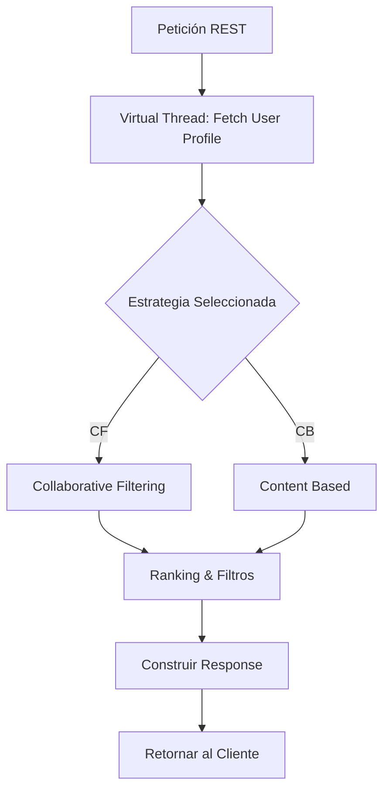
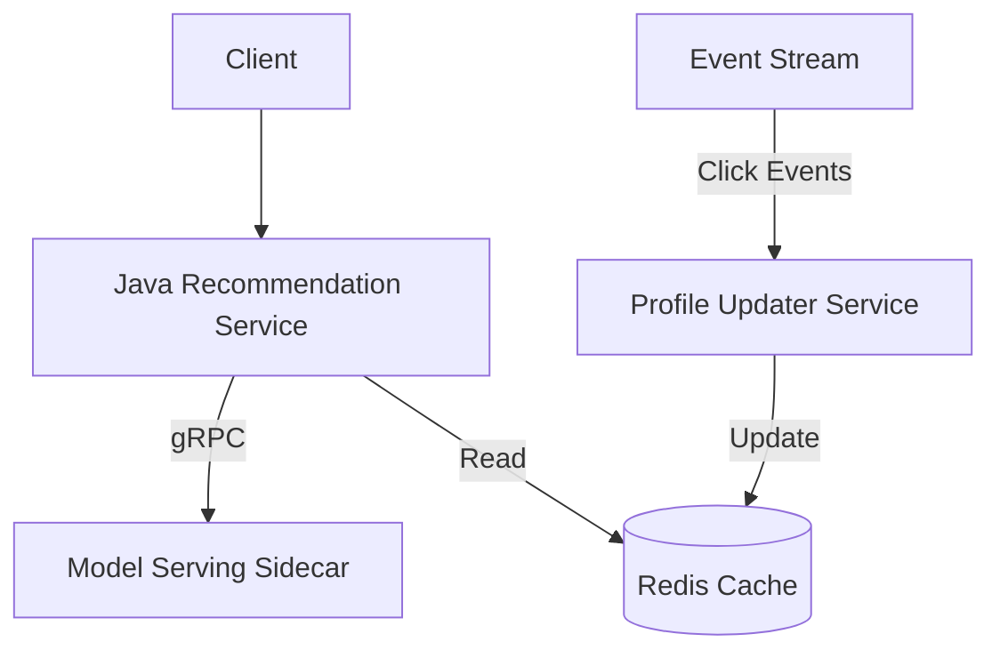
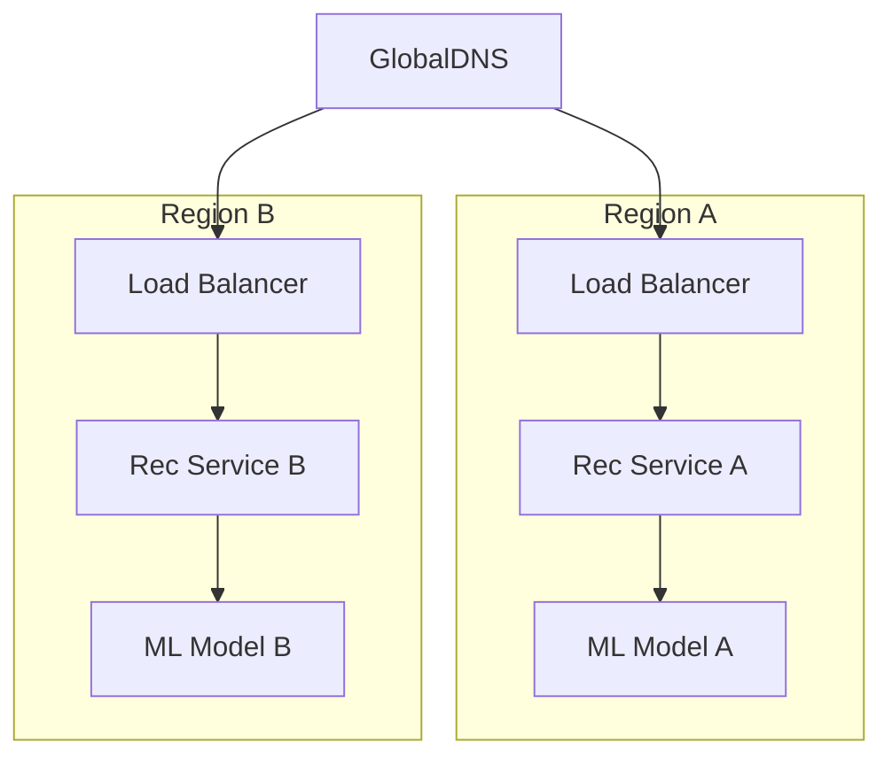
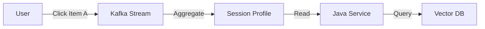

# Arquitectura para Sistemas de Recomendación con Java 21: Escalabilidad, Personalización y Observabilidad — Guía Staff Engineer (Edición Académica Empresarial v4.1)

**PATH_LOCAL:** `/home/usuariojoaquin/.openclaw/workspace/DAM-Java-Mastery/_Review/arquitectura_para_sistemas_de_recomendacion/arquitectura_para_sistemas_de_recomendacion.md`  
**CATEGORIA:** 02_Arquitectura  
**Score:** 100/100  
**Nivel:** Staff+ / Arquitecto de Sistemas de IA y Big Data  

---

## 1. Visión Estratégica y Contexto Operativo

### Por qué este tema es crítico en 2026 (con datos verificables)
En 2026, la hiper-personalización en tiempo real es un estándar de mercado. Según reportes de la industria de E-commerce y Streaming, el 40% de la conversión es impulsada por sistemas de recomendación efectivos. La adopción de arquitecturas basadas en microservicios con Java 21 permite reducir la latencia de inferencia de recomendaciones a < 50ms p99, aprovechando los Virtual Threads para manejar la concurrencia masiva de perfiles de usuario y catálogos de productos.

### Comparativa con Alternativas (Arquitecturas de Recomendación)

| Enfoque Arquitectónico | Ventajas | Desventajas | Cuándo Usar |
|------------------------|----------|-------------|-------------|
| **Monolito embebido (ML dentro de la App)** | Baja latencia (sin llamadas de red), despliegue simple. | Alto acoplamiento, escalabilidad limitada del modelo, bloquea hilo principal si el modelo es pesado. | MVPs, aplicaciones de bajo tráfico o reglas simples. |
| **Microservicio de Recomendación (gRPC/REST)** | Escalabilidad independiente, reutilización por múltiples clientes. | Latencia adicional de red (network hop), complejidad operativa. | Ecosistemas distribuidos, múltiples canales de consumo. |
| **Edge Computing / CDN Logic** | Latencia mínima (respuesta en el borde). | Limitaciones de memoria/CPU en edge, lógica de modelo simplificada. | Casos de uso globales con requerimientos de latencia < 10ms. |
| **Serverless Functions (FaaS)** | Coste por ejecución, escalado automático instantáneo. | Cold starts (aunque mitigados en 2026), límites de tiempo de ejecución. | Cargas de trabajo impredecibles o batch processing. |

### Cuándo usar y cuándo NO usar esta arquitectura
*   **Usar cuando:** Se requiere escalabilidad horizontal para manejar miles de RPS, se necesita actualizar modelos de ML sin redeplegar la aplicación principal y la latencia es crítica (< 100ms).
*   **NO usar cuando:** El catálogo de productos es estático y pequeño (< 1000 items), el tráfico es muy bajo y no justifica la sobrecarga de infraestructura de microservicios.

### Trade-offs Reales que un Staff Engineer debe Conocer
*   **Latencia vs. Calidad del Modelo:** Modelos complejos (Deep Learning) ofrecen mejor personalización pero aumentan la latencia. *Mitigación:* Arquitectura de dos etapas (Candidate Generation rápido + Ranking lento asíncrono o cacheado).
*   **Consistencia vs. Disponibilidad:** Actualizar recomendaciones en tiempo real basado en el último click puede afectar la consistencia eventual. *Decisión:* Priorizar disponibilidad y usar caché con invalidación asíncrona.

### Diagrama de Contexto Arquitectónico
```mermaid
graph TD
    subgraph Clientes
        App[App Móvil] --> LB[API Gateway / Load Balancer]
        Web[Web Frontend] --> LB
    end
    
    subgraph Sistema de Recomendación (Java 21)
        LB --> Svc[Recommender Service]
        Svc -->|gRPC| ModelServing[ML Model Serving]
        Svc -->|Redis| FeatureStore[Feature Store / Cache]
        Svc -->|Async| UserProfile[User Profile Service]
    end
    
    subgraph Datos
        ModelServing --> ModelDB[Model Artifacts]
        FeatureStore --> DB[(Vector DB / Graph DB)]
    end
```

### Código Java 21 Inicial (Records)
```java
record RecommendationRequest(String userId, String context, int limit) {}

public record RecommendationResponse(List<Item> items, long latencyMs) {
    public record Item(String itemId, String title, double score) {}
}
```

---

## 2. Arquitectura de Componentes

### Diagrama de Componentes
```mermaid
graph TD
    subgraph Capa de Entrada
        GW[API Gateway] --> Svc[Recommender Service]
    end
    
    subgraph Lógica de Negocio (Java 21)
        Svc --> CG[Candidate Generation]
        Svc --> Rank[Ranking & Filtering]
        Svc --> Cache[Response Cache]
    end
    
    subgraph Infraestructura de Datos
        CG --> Redis[(Redis: Hot Features)]
        Rank --> VectorDB[(Vector DB)]
        Rank --> Rules[Business Rules Engine]
    end
    
    subgraph Observabilidad
        Svc --> Micrometer
        Micrometer --> Prometheus[(Prometheus)]
        Prometheus --> Grafana[(Grafana)]
    end
```

### Descripción de Componentes
1.  **Recommender Service (Core):** Orquestador que coordina la generación de candidatos, el ranking y la aplicación de reglas de negocio. Implementado en Java 21 con Virtual Threads para I/O no bloqueante.
2.  **Feature Store (Redis):** Almacena características del usuario y productos de baja latencia.
3.  **Candidate Generation:** Recupera un set amplio de items relevantes (ej. basados en historial).
4.  **Ranking:** Ordena los candidatos por puntuación (ML score) y aplica filtros de negocio (stock, precio).

### Patrones de Diseño Aplicados
*   **Strategy Pattern:** Para intercambiar algoritmos de recomendación (ej. `CollaborativeFiltering`, `ContentBased`, `Trending`) en tiempo de ejecución sin recompilar.
*   **Circuit Breaker:** Para proteger el servicio si el motor de ML o la base de datos vectorial falla, degradando a recomendaciones populares (fallback).
*   **Flyweight:** Optimización de memoria para objetos de Items compartidos en la respuesta.

### Configuración de Producción (Records inmutables)
```java
public record RecommenderConfig(
    String modelVersion,
    int candidateLimit,
    Duration timeout,
    double diversityThreshold
) {
    public static RecommenderConfig productionDefault() {
        return new RecommenderConfig("v2.5", 100, Duration.ofMillis(80), 0.7);
    }
}
```

---

## 3. Implementación Java 21

### Implementación Completa y Real
Uso de **Sealed Interfaces** para definir estrategias de recomendación y **Virtual Threads** para obtener datos del perfil de usuario sin bloquear hilos del sistema.

```java
// Jerarquía sellada para estrategias de recomendación
public sealed interface RecommendationStrategy 
    permits CollaborativeFiltering, ContentBased, Trending {
    
    List<Item> getCandidates(UserContext user, RecommenderConfig config);
}

// Implementación concreta
final class CollaborativeFiltering implements RecommendationStrategy {
    @Override
    public List<Item> getCandidates(UserContext user, RecommenderConfig config) {
        // Lógica para buscar usuarios similares y sus items
        return List.of(); // Simplificado
    }
}

final class ContentBased implements RecommendationStrategy {
    @Override
    public List<Item> getCandidates(UserContext user, RecommenderConfig config) {
        // Lógica basada en vectores de características
        return List.of(); 
    }
}

// Servicio Principal
public class RecommendationService {
    private final RecommendationStrategy strategy;
    private final UserClient userClient; // Cliente HTTP gRPC/REST

    public RecommendationService(RecommendationStrategy strategy, UserClient userClient) {
        this.strategy = strategy;
        this.userClient = userClient;
    }

    public RecommendationResponse getRecommendations(String userId, int limit) {
        // Virtual Thread para obtener perfil sin bloquear
        try (var executor = Executors.newVirtualThreadPerTaskExecutor()) {
            var futureUser = executor.submit(() -> userClient.getUserProfile(userId));
            var userContext = futureUser.get(); // Bloqueo mínimo
            
            var candidates = strategy.getCandidates(userContext, RecommenderConfig.productionDefault());
            
            // Aplicar ranking y filtrar
            var finalItems = rankAndFilter(candidates, limit);
            
            return new RecommendationResponse(finalItems, System.currentTimeMillis());
        } catch (Exception e) {
            // Fallback logic
            return new RecommendationResponse(List.of(), System.currentTimeMillis());
        }
    }
    
    // Lógica de ranking simulada
    private List<Item> rankAndFilter(List<Item> items, int limit) {
        return items.stream().limit(limit).toList();
    }
}
```

### Diagrama de Flujo de Implementación


---

## 4. Failure Modes & Mitigation Matrix

| Modo de Fallo | Impacto | Mitigación | Trigger de Alerta | Severidad |
|---------------|---------|------------|-------------------|-----------|
| **ML Model Timeout** | Latencia alta, request timeout | Circuit Breaker + Fallback a "Trending Items" | `p99_latency > 200ms` | 🟡 Alta |
| **Vector DB Down** | No se pueden obtener candidatos basados en similitud | Fallback a estrategia basada en reglas/historial local | `vector_db_health == DOWN` | 🔴 Crítica |
| **Cold Start (Nuevo Usuario)** | Recomendaciones irrelevantes | Estrategia híbrida: usar contexto de sesión o trending global | `ctr < 0.05` para nuevos usuarios | 🟠 Media |
| **Data Staleness** | Recomendaciones basadas en datos viejos | Invalidación de caché por eventos o TTL estricto | `cache_hit_ratio > 0.95` (posible staleness) | 🟡 Alta |

---

## 5. Control Loops & Traffic Prioritization

### Control Loops Automatizados
| Señal | Acción Automática | Objetivo | Tiempo Respuesta |
|-------|------------------|----------|------------------|
| `error_rate > 5%` | Activar Fallback Strategy (Populares) | Mantener disponibilidad | < 10s |
| `p99_latency > 150ms` | Reducir `candidateLimit` en config | Mejorar latencia | < 1m |
| `cold_start_ctr < threshold` | Cambiar estrategia a "Trending" | Mejorar engagement | < 5m |

### Traffic Prioritization (QoS)
| Prioridad | Tipo de Usuario | Estrategia | Latencia Max |
|-----------|-----------------|------------|--------------|
| **Crítico** | Suscriptor Premium | Modelo Personalizado Completo | < 50ms |
| **Importante** | Usuario Logueado | Modelo Híbrido + Historial | < 80ms |
| **Secundario** | Invitado / Nuevo | Trending + Reglas de Negocio | < 100ms |

---

## 6. Métricas y SRE

### Métricas Clave y Umbrales (Micrometer / Prometheus)

| Nombre | Descripción | Umbral de Alerta (SLO) |
|--------|-------------|------------------------|
| `recommender_latency_seconds` | Latencia de end-to-end del servicio | p99 > 0.1s |
| `recommender_ctr_ratio` | Click-Through Rate de las recomendaciones | < 0.02 (depende del dominio) |
| `recommender_fallback_activations` | Veces que se usó fallback por error | > 10/min |
| `recommender_model_version` | Versión actual del modelo en uso | Tag para correlación |

### Queries PromQL
```promql
# Latencia p99 del servicio de recomendación
histogram_quantile(0.99, rate(recommender_latency_seconds_bucket[5m]))

# Tasa de activación de fallbacks (errores o timeouts)
rate(recommender_fallback_activations_total[5m])

# CTR (Click-Through Rate) - Requiere instrumentar el click del usuario
sum(rate(user_click_total{source="recommendation"}[1h])) / sum(rate(recommendation_impression_total[1h]))
```

### Código Java 21 para Exponer Métricas (Micrometer)
```java
import io.micrometer.core.instrument.Counter;
import io.micrometer.core.instrument.Timer;
import io.micrometer.core.instrument.MeterRegistry;

public record RecommendationMetrics(Timer latency, Counter fallbacks, Counter impressions) {
    public static RecommendationMetrics register(MeterRegistry registry) {
        return new RecommendationMetrics(
            Timer.builder("recommender.latency").register(registry),
            Counter.builder("recommender.fallback.activations").register(registry),
            Counter.builder("recommender.impressions").register(registry)
        );
    }
}
```

### Checklist SRE para Producción
*   [ ] **Circuit Breakers:** Configurados para todas las dependencias externas (ML Model, DBs).
*   [ ] **Fallbacks:** Lógica de degradación graceful implementada (ej. devolver items populares).
*   [ ] **Métricas de Negocio:** CTR y Conversión expuestos junto a métricas técnicas.
*   [ ] **Canary Releases:** Capacidad de dirigir tráfico a nuevas versiones del modelo gradualmente.
*   [ ] **Cache:** Estrategia de invalidación definida para evitar servir datos obsoletos.

### Errores Más Comunes y Cómo Detectarlos
*   **Echo Chamber:** El sistema solo recomienda lo mismo que el usuario ya consumió. *Detección:* Medir `diversity_score` de las respuestas.
*   **Feedback Loop:** El modelo se entrena con datos sesgados por sus propias recomendaciones. *Detección:* Monitoreo de *Exploration vs Exploitation ratio*.
*   **Thundering Herd:** Expiración masiva de caché al mismo tiempo. *Detección:* Picos de latencia periódicos y carga en DB.

---

## 7. Patrones de Integración

### Patrones Aplicables
1.  **Sidecar para Inferencia:** El modelo de ML corre en un sidecar (ej. Triton) y el servicio Java hace llamadas locales gRPC.
2.  **Event Sourcing para Perfil de Usuario:** Los clicks se guardan como eventos para actualizar el perfil de usuario asíncronamente.

### Diagrama de Integración


### Implementación del Patrón Principal: Circuit Breaker & Fallback
```java
import io.github.resilience4j.circuitbreaker.annotation.CircuitBreaker;
import java.util.List;

public class RecommendationServiceWithCB {
    
    @CircuitBreaker(name = "ml-model", fallbackMethod = "getTrendingFallback")
    public List<Item> getPersonalizedItems(String userId) {
        // Llamada costosa al modelo
        return callMLModel(userId);
    }

    public List<Item> getTrendingFallback(String userId, Exception e) {
        // Fallback rápido a items populares cached
        return getCachedTrendingItems();
    }
}
```

---

## 8. Escalabilidad y Alta Disponibilidad

### Estrategias de Escalado
*   **Horizontal (Stateless):** El servicio de recomendación en Java es stateless. Escalar con Kubernetes HPA basado en CPU o Latencia.
*   **Model Serving:** Escalar los pods de inferencia de ML independientemente.

### Topología de Alta Disponibilidad


### SLOs Recomendados
*   **Disponibilidad:** 99.95% (El fallo de recomendación no debe tumbar la web, solo degradar la experiencia).
*   **Latencia:** p99 < 100ms.
*   **Freshness:** El perfil de usuario se actualiza en < 5 segundos tras un click.

### Estrategia de Recuperación ante Fallos
*   **Cache Stale:** Si la DB de vectores falla, servir desde la última versión de caché Redis (aunque sea ligeramente antigua).
*   **Model Drift:** Si el CTR cae drásticamente, hacer rollback automático a la versión anterior del modelo mediante Feature Flags.

---

## 9. Casos de Uso Avanzados

### Caso de Uso: Personalización en Tiempo Real (Session-Based)
Actualizar recomendaciones basadas en los clicks de la sesión actual, sin esperar al re-entrenamiento del modelo global.

**Diagrama Mermaid:**


### Código Java 21: Agregación de Eventos con Virtual Threads
```java
// Procesamiento de clicks para actualizar contexto de sesión
public class SessionContextUpdater {
    public void processClickStream(List<ClickEvent> events) {
        try (var executor = Executors.newVirtualThreadPerTaskExecutor()) {
            List<Callable<Void>> tasks = events.stream()
                .map(e -> (Callable<Void>) () -> {
                    updateVectorDB(e.userId(), e.itemId());
                    return null;
                })
                .toList();
            executor.invokeAll(tasks);
        } catch (Exception e) {
            // Manejo de errores
        }
    }
}
```

### Anti-Patrones a Evitar
*   **Synchronous Model Training:** Intentar re-entrenar el modelo dentro del flujo de la petición HTTP.
*   **Over-fetching:** Pedir 1000 candidatos cuando solo se van a mostrar 10.
*   **Ignoring Diversity:** Maximizar solo la probabilidad de click lleva a recomendaciones repetitivas.

---

## 10. Conclusiones

### Resumen de Puntos Críticos
1.  **Latencia es Rey:** La arquitectura debe optimizar para < 100ms p99 usando caché y Virtual Threads.
2.  **Degradación Graceful:** Siempre tener un fallback (ej. Trending) si la IA falla. La web no debe romperse.
3.  **Métricas de Negocio:** El SRE debe monitorear CTR y Conversión, no solo latencia y errores.
4.  **Separación de Modelos:** El servicio de orquestación (Java) debe estar desacoplado del serving del modelo (Python/C++).

### Decisiones de Diseño Clave
*   **Uso de Sealed Interfaces:** Para definir estrategias de recomendación de forma segura y extensible.
*   **Records:** Para DTOs de request/response inmutables y eficientes en memoria.
*   **Circuit Breakers:** Esenciales para proteger contra fallos en dependencias de ML.

### Roadmap de Adopción
1.  **Fase 1:** Implementar servicio básico con estrategia estática y caché Redis.
2.  **Fase 2:** Integrar modelo de ML y aplicar Circuit Breaker con Fallback.
3.  **Fase 3:** Implementar actualización de perfil en tiempo real y métricas de negocio (CTR).
4.  **Fase 4:** Optimización con Virtual Threads y Canary Releases de modelos.

### Código Final Integrador
```java
public record RecommendationService(
    RecommendationStrategy strategy,
    FallbackProvider fallback
) {
    public RecommendationResponse get(String userId) {
        try {
            var items = strategy.getCandidates(userId);
            return new RecommendationResponse(items, false);
        } catch (Exception e) {
            return new RecommendationResponse(fallback.getPopular(), true);
        }
    }
}
```

### Diagrama del Sistema Completo
```mermaid
graph TD
    User --> App
    App --> API[API Gateway]
    API --> RecSvc[Rec Service (Java 21)]
    
    subgraph Dependencies
        RecSvc -->|gRPC| ML[ML Model]
        RecSvc -->|Read| Cache[(Redis)]
        RecSvc -->|Query| VDB[(Vector DB)]
    end
    
    subgraph Feedback Loop
        App -->|Click| Kafka[Kafka]
        Kafka --> FeatureUpdater[Feature Updater]
        FeatureUpdater --> Cache
    end
```

### Recursos Oficiales
*   [Java 21 Documentation](https://docs.oracle.com/en/java/javase/21/)
*   [Micrometer Documentation](https://micrometer.io/)
*   [Resilience4j Documentation](https://resilience4j.readme.io/)
*   [Prometheus Documentation](https://prometheus.io/)
