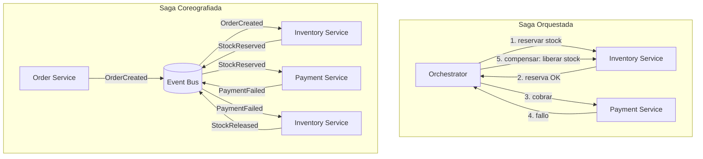
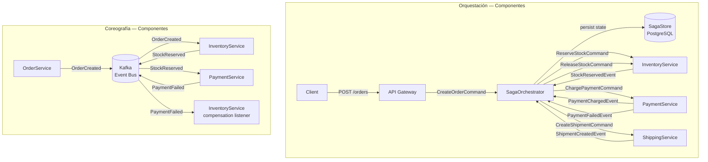
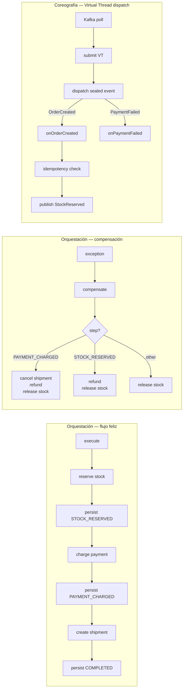
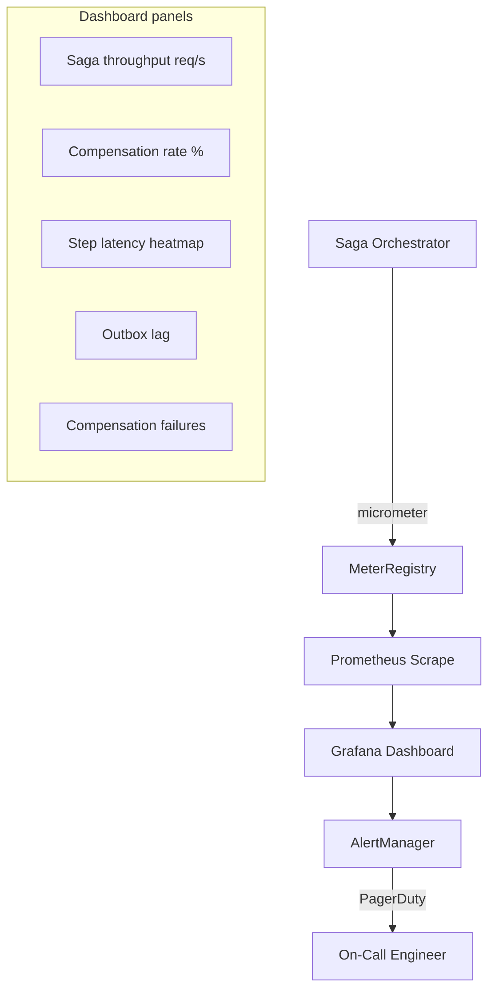
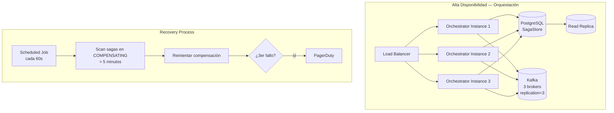
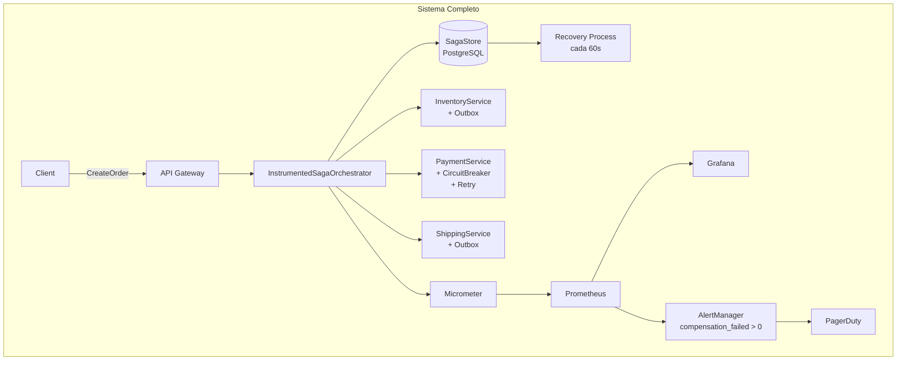

# Saga Pattern: Orquestación vs Coreografía con Java 21

**CATEGORIA:** 02_Arquitectura
**Score revisado:** STAFF
**Revisión:** Claude Pro — 04/04/2026

---

## Visión Estratégica

En sistemas distribuidos modernos, una transacción de negocio frecuentemente atraviesa múltiples servicios: pago, inventario, envío, notificación. El problema central es que no existe ACID entre procesos independientes. El Saga Pattern resuelve esto descomponiendo la transacción en pasos locales, donde cada paso publica un evento o mensaje, y define una **compensación** que revierte su efecto si algún paso posterior falla.

En 2026, con el 80% de las organizaciones Fortune 500 operando en arquitecturas de microservicios (CNCF Survey 2025), la gestión de consistencia eventual es el problema número uno de fiabilidad en producción. Las dos implementaciones del patrón divergen profundamente en trade-offs operacionales: **orquestación** centraliza el control en un proceso coordinador; **coreografía** distribuye la responsabilidad mediante eventos.

**Comparativa de enfoques:**

| Criterio | Orquestación | Coreografía | Two-Phase Commit | TCC (Try-Confirm-Cancel) |
|---|---|---|---|---|
| Acoplamiento | Medio (orquestador conoce servicios) | Bajo (vía eventos) | Alto | Medio |
| Visibilidad del flujo | Alta — lógica centralizada | Baja — flujo emergente | Alta | Media |
| SPOF | Sí — el orquestador | No | Sí — coordinador | No |
| Debuggability | Fácil — trazas en un lugar | Compleja — correlación de eventos | Media | Media |
| Escalabilidad | Media | Alta | Baja — locks distribuidos | Media |
| Cuándo usarlo | Flujos complejos con ramificaciones, visibilidad crítica | Alto throughput, equipos autónomos | Solo bases de datos XA compatibles | Operaciones con fase de reserva natural (reservas, stock) |

**Cuándo NO usar Saga:**
- Transacciones que requieren aislamiento fuerte entre pasos (usa una base de datos monolítica con ACID)
- Operaciones sub-milisegundo donde el overhead de compensación es inaceptable
- Sistemas donde la consistencia eventual no es tolerable por el negocio (ej. saldos bancarios en tiempo real — usa Ledger con ACID)

**Trade-offs críticos que un Staff Engineer debe internalizar:**

1. **Compensaciones no siempre son reversibles.** Un email enviado no se puede "desenviar". Diseña acciones compensatorias semánticas, no técnicas.
2. **El orden de compensación importa.** Siempre en orden inverso a la ejecución.
3. **Idempotencia obligatoria.** Cada paso y cada compensación debe ser idempotente — la red puede entregar mensajes duplicados.
4. **El estado de la saga debe persistirse antes de ejecutar cada paso**, no después — de lo contrario un crash entre persistencia y ejecución genera inconsistencias imposibles de recuperar.



---

## Arquitectura de Componentes

### Orquestación: componentes y responsabilidades

El **SagaOrchestrator** es el corazón del patrón orquestado. Persiste el estado de la saga, secuencia los pasos y ejecuta compensaciones en orden inverso ante fallos. Es un proceso stateful — su estado debe sobrevivir reinicios.

El **SagaStore** persiste el estado completo de cada saga en base de datos antes de enviar cada comando. Si el proceso muere entre pasos, el recovery process releerá el store y continuará desde el último paso confirmado.

Los **Participant Services** son stateless en cuanto a la saga: reciben comandos, ejecutan operaciones locales ACID, publican eventos de resultado. No conocen la existencia de la saga — solo conocen su contrato de entrada/salida.

### Coreografía: componentes y responsabilidades

En la coreografía no existe un componente coordinador. Cada servicio suscribe a los eventos que le conciernen, ejecuta su operación local y publica el evento resultante. El flujo de negocio es **implícito** — emerge del conjunto de suscripciones.

El riesgo principal es la **saga zombie**: un servicio procesa un evento de una saga ya compensada porque los mensajes llegaron fuera de orden. La defensa es el **correlation ID** con estado persistido por servicio.



**Patrones de diseño aplicados:**

- **Command/Event split**: orquestación usa Commands (instrucciones imperativas con destinatario), coreografía usa Events (hechos pasados, broadcast). Esta distinción no es cosmética — tiene implicaciones de acoplamiento.
- **Outbox Pattern** (obligatorio en ambos casos): nunca publicar al bus en el mismo commit de la operación local. Persiste el evento en una tabla `outbox` dentro de la misma transacción local y un poller lo publica al bus. Previene el split-brain entre BD y broker.
- **Idempotent Consumer**: cada handler comprueba si ya procesó el `correlationId` antes de ejecutar.

```java
// Outbox Pattern — inserción atómica con la operación de negocio
@Transactional
public void reserveStock(ReserveStockCommand cmd) {
    var reservation = stockRepository.reserve(cmd.productId(), cmd.quantity());
    // mismo commit → nunca pierdas consistencia entre BD y Kafka
    outboxRepository.save(new OutboxEvent(
        cmd.sagaId(),
        "StockReserved",
        new StockReservedPayload(reservation.id(), cmd.quantity())
    ));
}
```

---

## Implementación Java 21

### Saga Orquestada con StructuredTaskScope y Records

La implementación aprovecha **Virtual Threads** (Project Loom) para ejecutar pasos en paralelo cuando la semántica del negocio lo permite, y **StructuredTaskScope** para acotar el tiempo de vida de los hilos hijos al scope padre — nunca hilos huérfanos.

```java
import java.util.UUID;
import java.util.concurrent.StructuredTaskScope;
import java.util.concurrent.StructuredTaskScope.Subtask;

// ── Modelo de dominio inmutable ────────────────────────────────────────────

public record OrderId(UUID value) {
    public static OrderId generate() { return new OrderId(UUID.randomUUID()); }
}

public record SagaContext(
    OrderId sagaId,
    String customerId,
    String productId,
    int quantity,
    long amountCents
) {}

public sealed interface SagaResult permits SagaResult.Success, SagaResult.Compensated {
    record Success(OrderId sagaId, String shipmentId) implements SagaResult {}
    record Compensated(OrderId sagaId, String reason) implements SagaResult {}
}

// ── Estados persistibles ───────────────────────────────────────────────────

public enum SagaStep {
    STOCK_RESERVED,
    PAYMENT_CHARGED,
    SHIPMENT_CREATED,
    COMPENSATING,
    COMPLETED,
    FAILED
}

public record SagaState(
    OrderId sagaId,
    SagaStep currentStep,
    String reservationId,
    String paymentId,
    String shipmentId
) {
    public SagaState withStep(SagaStep step) {
        return new SagaState(sagaId, step, reservationId, paymentId, shipmentId);
    }
    public SagaState withReservation(String resId) {
        return new SagaState(sagaId, currentStep, resId, paymentId, shipmentId);
    }
    public SagaState withPayment(String pmtId) {
        return new SagaState(sagaId, currentStep, reservationId, pmtId, shipmentId);
    }
    public SagaState withShipment(String shpId) {
        return new SagaState(sagaId, currentStep, reservationId, paymentId, shpId);
    }
}

// ── Orquestador principal ──────────────────────────────────────────────────

public class OrderSagaOrchestrator {

    private final InventoryPort inventory;
    private final PaymentPort payment;
    private final ShippingPort shipping;
    private final SagaStateRepository stateRepo;

    public OrderSagaOrchestrator(
        InventoryPort inventory,
        PaymentPort payment,
        ShippingPort shipping,
        SagaStateRepository stateRepo
    ) {
        this.inventory = inventory;
        this.payment   = payment;
        this.shipping  = shipping;
        this.stateRepo = stateRepo;
    }

    public SagaResult execute(SagaContext ctx) {
        var state = new SagaState(ctx.sagaId(), SagaStep.STOCK_RESERVED, null, null, null);

        try {
            // Paso 1: Reservar stock
            var reservation = inventory.reserve(ctx.productId(), ctx.quantity(), ctx.sagaId());
            state = stateRepo.save(state.withReservation(reservation.id())
                                        .withStep(SagaStep.STOCK_RESERVED));

            // Paso 2: Cobrar pago
            var charge = payment.charge(ctx.customerId(), ctx.amountCents(), ctx.sagaId());
            state = stateRepo.save(state.withPayment(charge.id())
                                        .withStep(SagaStep.PAYMENT_CHARGED));

            // Paso 3: Crear envío
            var shipment = shipping.create(ctx.customerId(), ctx.productId(), ctx.sagaId());
            state = stateRepo.save(state.withShipment(shipment.id())
                                        .withStep(SagaStep.COMPLETED));

            return new SagaResult.Success(ctx.sagaId(), shipment.id());

        } catch (Exception ex) {
            return compensate(state, ex.getMessage());
        }
    }

    private SagaResult compensate(SagaState state, String reason) {
        stateRepo.save(state.withStep(SagaStep.COMPENSATING));

        // Compensaciones en orden inverso — solo si el paso se ejecutó
        switch (state.currentStep()) {
            case COMPLETED, SHIPMENT_CREATED -> {
                if (state.shipmentId() != null)
                    runCompensation(() -> shipping.cancel(state.shipmentId()));
            }
            default -> {} // shipment no creado — nada que compensar
        }

        if (state.paymentId() != null)
            runCompensation(() -> payment.refund(state.paymentId()));

        if (state.reservationId() != null)
            runCompensation(() -> inventory.release(state.reservationId()));

        stateRepo.save(state.withStep(SagaStep.FAILED));
        return new SagaResult.Compensated(state.sagaId(), reason);
    }

    private void runCompensation(ThrowingRunnable action) {
        try {
            action.run();
        } catch (Exception e) {
            // LOG y alertar — compensación fallida es CRÍTICA y requiere intervención manual
            // Nunca silenciar: registrar en tabla compensation_failures para revisión operacional
        }
    }

    @FunctionalInterface
    interface ThrowingRunnable { void run() throws Exception; }
}
```

### Saga Coreografiada con Virtual Threads y Kafka

```java
import java.util.concurrent.Executors;

// ── Eventos de dominio ─────────────────────────────────────────────────────

public sealed interface SagaEvent permits
    SagaEvent.OrderCreated,
    SagaEvent.StockReserved,
    SagaEvent.StockReservationFailed,
    SagaEvent.PaymentCharged,
    SagaEvent.PaymentFailed,
    SagaEvent.StockReleased {

    record OrderCreated(UUID sagaId, String customerId, String productId, int qty, long amountCents) implements SagaEvent {}
    record StockReserved(UUID sagaId, String reservationId) implements SagaEvent {}
    record StockReservationFailed(UUID sagaId, String reason) implements SagaEvent {}
    record PaymentCharged(UUID sagaId, String paymentId) implements SagaEvent {}
    record PaymentFailed(UUID sagaId, String reservationId, String reason) implements SagaEvent {}
    record StockReleased(UUID sagaId) implements SagaEvent {}
}

// ── Handler con idempotencia y Virtual Threads ────────────────────────────

public class InventoryEventHandler {

    private final InventoryPort inventory;
    private final IdempotencyStore idempotency;
    private final EventPublisher publisher;

    public InventoryEventHandler(InventoryPort inventory, IdempotencyStore idempotency, EventPublisher publisher) {
        this.inventory   = inventory;
        this.idempotency = idempotency;
        this.publisher   = publisher;
    }

    // Ejecutado en Virtual Thread por el consumer loop de Kafka
    public void onOrderCreated(SagaEvent.OrderCreated event) {
        // Idempotencia: si ya procesamos este sagaId, ignorar
        if (idempotency.alreadyProcessed(event.sagaId(), "StockReserve")) return;

        try {
            var reservation = inventory.reserve(event.productId(), event.qty(), event.sagaId());
            idempotency.markProcessed(event.sagaId(), "StockReserve");
            publisher.publish(new SagaEvent.StockReserved(event.sagaId(), reservation.id()));

        } catch (InsufficientStockException ex) {
            publisher.publish(new SagaEvent.StockReservationFailed(event.sagaId(), ex.getMessage()));
        }
    }

    public void onPaymentFailed(SagaEvent.PaymentFailed event) {
        if (idempotency.alreadyProcessed(event.sagaId(), "StockRelease")) return;

        inventory.release(event.reservationId());
        idempotency.markProcessed(event.sagaId(), "StockRelease");
        publisher.publish(new SagaEvent.StockReleased(event.sagaId()));
    }
}

// ── Consumer loop con Virtual Threads ─────────────────────────────────────

public class SagaEventConsumer {

    private final InventoryEventHandler handler;

    public void startConsuming(KafkaConsumer<String, SagaEvent> consumer) {
        // Virtual Thread por mensaje — I/O-bound, ideal para Loom
        try (var executor = Executors.newVirtualThreadPerTaskExecutor()) {
            while (true) {
                var records = consumer.poll(Duration.ofMillis(100));
                for (var record : records) {
                    var event = record.value();
                    executor.submit(() -> dispatch(event));
                }
                consumer.commitAsync();
            }
        }
    }

    private void dispatch(SagaEvent event) {
        switch (event) {
            case SagaEvent.OrderCreated e    -> handler.onOrderCreated(e);
            case SagaEvent.PaymentFailed e   -> handler.onPaymentFailed(e);
            default                          -> {} // evento no relevante para este servicio
        }
    }
}
```

**Diagrama de flujo de implementación:**



---

## Métricas y SRE

Las métricas del Saga Pattern deben capturar no solo la latencia de los pasos individuales, sino la **tasa de compensación** — el indicador de salud más importante del sistema.

| Métrica | Descripción | Umbral de alerta |
|---|---|---|
| `saga_duration_seconds` | Latencia end-to-end de la saga completa | p99 > 2s |
| `saga_step_duration_seconds{step}` | Latencia por paso individual | p99 > 500ms |
| `saga_compensation_total` | Número de sagas que entraron en compensación | tasa > 1% |
| `saga_compensation_failed_total` | Compensaciones que fallaron (requieren intervención manual) | > 0 |
| `saga_in_flight` | Sagas actualmente en ejecución | > 1000 (revisar throughput) |
| `outbox_pending_events` | Eventos en outbox sin publicar | > 100 durante > 30s |
| `idempotency_duplicate_total{step}` | Mensajes duplicados detectados | informacional |

```promql
# Tasa de compensación (últimos 5 minutos)
rate(saga_compensation_total[5m]) / rate(saga_started_total[5m]) * 100

# Latencia p99 por paso
histogram_quantile(0.99, rate(saga_step_duration_seconds_bucket{step="payment"}[5m]))

# Alertar: compensaciones fallidas — requieren intervención inmediata
increase(saga_compensation_failed_total[5m]) > 0

# Outbox atascado — indica problema con el publisher
saga_outbox_pending_events > 100 and saga_outbox_pending_events offset 30s > 100
```



```java
import io.micrometer.core.instrument.MeterRegistry;
import io.micrometer.core.instrument.Timer;

public class InstrumentedSagaOrchestrator {

    private final OrderSagaOrchestrator delegate;
    private final MeterRegistry registry;

    public InstrumentedSagaOrchestrator(OrderSagaOrchestrator delegate, MeterRegistry registry) {
        this.delegate = delegate;
        this.registry = registry;
    }

    public SagaResult execute(SagaContext ctx) {
        registry.counter("saga_started_total").increment();
        var timer = Timer.start(registry);

        var result = delegate.execute(ctx);

        timer.stop(registry.timer("saga_duration_seconds"));

        switch (result) {
            case SagaResult.Success s      -> registry.counter("saga_completed_total").increment();
            case SagaResult.Compensated c  -> registry.counter("saga_compensation_total").increment();
        }
        return result;
    }
}
```

**Checklist SRE para producción:**

1. **Outbox poller con dead-letter queue**: si un evento falla N veces publicándose, moverlo a DLQ y alertar. Nunca perder eventos silenciosamente.
2. **Recovery process activo**: proceso que escanea `saga_state` con estado `COMPENSATING` de más de X minutos y reintenta. Los crashes entre pasos son inevitables.
3. **Correlation ID en todos los logs**: cada log de cada servicio debe incluir `sagaId`. Sin esto, diagnosticar una saga fallida en producción es imposible.
4. **Circuit breaker en pasos críticos**: si Payment Service tiene >50% de errores, detener nuevas sagas antes de acumular compensaciones masivas.
5. **Runbook documentado para `saga_compensation_failed_total > 0`**: este es el único error que requiere intervención manual obligatoria. El runbook debe incluir queries SQL para identificar el estado inconsistente y los pasos para resolverlo.

---

## Patrones de Integración

### Outbox Pattern — la pieza que hace todo lo demás posible

El error más común al implementar Saga es publicar al broker en el mismo bloque de código que la operación de negocio, fuera de la transacción:

```java
// ❌ ANTIPATRÓN — split-brain garantizado
@Transactional
public void reserveStock(cmd) {
    stockRepository.save(reservation);
    // Si el proceso muere aquí, BD actualizada pero evento perdido
    kafkaTemplate.send("stock-events", new StockReserved(...)); // fuera del commit ACID
}
```

La solución correcta:

```java
// ✅ CORRECTO — Outbox Pattern
@Transactional
public void reserveStock(ReserveStockCommand cmd) {
    var reservation = new StockReservation(
        UUID.randomUUID().toString(),
        cmd.productId(),
        cmd.quantity(),
        ReservationStatus.RESERVED
    );
    stockRepository.save(reservation);

    // Mismo commit ACID — si uno falla, ambos fallan
    outboxRepository.save(new OutboxEntry(
        cmd.sagaId().value().toString(),
        "StockReserved",
        serialize(new SagaEvent.StockReserved(cmd.sagaId().value(), reservation.id()))
    ));
    // El poller publicará el evento a Kafka de forma asíncrona
}

// Records de soporte
record StockReservation(String id, String productId, int quantity, ReservationStatus status) {}
record OutboxEntry(String sagaId, String eventType, String payload) {}
enum ReservationStatus { RESERVED, RELEASED }
```

### Comparativa de patrones de integración para Saga

| Patrón | Aplica a | Ventaja | Coste |
|---|---|---|---|
| **Outbox + CDC** | Ambos | Consistencia garantizada sin 2PC | Complejidad de infraestructura (Debezium) |
| **Outbox + Poller** | Ambos | Simples de implementar | Latencia adicional (polling interval) |
| **Idempotent Consumer** | Coreografía | Tolerancia a duplicados | Store de idempotencia (Redis/PostgreSQL) |
| **Saga State Machine** | Orquestación | Transiciones explícitas y validadas | Más código |
| **Process Manager** | Orquestación compleja | Maneja ramificaciones y timeouts | El más complejo |

### Reintentos y Circuit Breaker con Resilience4j

```java
import io.github.resilience4j.circuitbreaker.CircuitBreaker;
import io.github.resilience4j.circuitbreaker.CircuitBreakerConfig;
import io.github.resilience4j.retry.Retry;
import io.github.resilience4j.retry.RetryConfig;

public record ResilientPaymentAdapter(PaymentPort delegate, CircuitBreaker cb, Retry retry) {

    public static ResilientPaymentAdapter create(PaymentPort delegate) {
        var cbConfig = CircuitBreakerConfig.custom()
            .failureRateThreshold(50)
            .waitDurationInOpenState(Duration.ofSeconds(30))
            .slidingWindowSize(10)
            .build();

        var retryConfig = RetryConfig.custom()
            .maxAttempts(3)
            .waitDuration(Duration.ofMillis(200))
            .retryExceptions(TransientException.class)
            .ignoreExceptions(BusinessException.class) // errores de negocio no se reintenta
            .build();

        return new ResilientPaymentAdapter(
            delegate,
            CircuitBreaker.of("payment", cbConfig),
            Retry.of("payment", retryConfig)
        );
    }

    public ChargeResult charge(String customerId, long amountCents, OrderId sagaId) {
        return cb.executeSupplier(
            () -> Retry.decorateSupplier(retry,
                () -> delegate.charge(customerId, amountCents, sagaId)
            ).get()
        );
    }
}
```

---

## Escalabilidad y Alta Disponibilidad

### Orquestador stateful — el reto de escalar

El orquestador tiene estado persistido en base de datos. Escalar horizontalmente requiere garantizar que dos instancias no procesen la misma saga simultáneamente — se resuelve con **optimistic locking** o **particionado por sagaId**.

```java
// SagaState con optimistic locking (JPA / versioned row)
public record SagaState(
    OrderId sagaId,
    SagaStep currentStep,
    String reservationId,
    String paymentId,
    String shipmentId,
    long version  // incrementado por BD en cada update — detecta conflictos
) {}

// Si dos instancias intentan actualizar la misma saga, una recibirá
// OptimisticLockException y reintentará — nunca corrupción silenciosa
```

**Particionado por sagaId en Kafka**: si el orquestador consume desde Kafka, asignar la misma partición a todos los eventos de la misma saga garantiza procesamiento ordenado por una sola instancia:

```java
// Producer: misma partición para todos los eventos de una saga
producer.send(new ProducerRecord<>(
    "saga-commands",
    sagaId.value().toString(), // key = sagaId → mismo partition
    command
));
```



**SLOs recomendados:**

| SLO | Objetivo | Medición |
|---|---|---|
| Saga completion rate | 99.5% de sagas completan sin compensación | `1 - rate(saga_compensation_total) / rate(saga_started_total)` |
| Saga end-to-end p99 | < 3s | `histogram_quantile(0.99, saga_duration_seconds_bucket)` |
| Compensation success rate | 99.9% de compensaciones exitosas | `1 - saga_compensation_failed_total / saga_compensation_total` |
| Outbox lag | < 500ms | tiempo entre escritura en outbox y publicación en Kafka |

---

## Casos de Uso Avanzados

### Caso 1: Saga con timeout explícito (Process Manager)

En sagas de larga duración — reservas hoteleras, aprobaciones humanas — los pasos pueden tardar horas. El orchestrador necesita gestionar timeouts y disparar compensaciones automáticas.

```java
public record SagaWithTimeout(
    OrderId sagaId,
    SagaStep currentStep,
    String reservationId,
    String paymentId,
    String shipmentId,
    Instant expiresAt,      // deadline total de la saga
    long version
) {
    public boolean isExpired() {
        return Instant.now().isAfter(expiresAt);
    }
}

// El recovery process detecta sagas expiradas y las compensa
public class SagaTimeoutHandler {
    public void handleExpiredSagas(SagaStateRepository repo, OrderSagaOrchestrator orchestrator) {
        // Virtual Thread por saga expirada — I/O bound
        try (var executor = Executors.newVirtualThreadPerTaskExecutor()) {
            repo.findExpiredSagas(Instant.now()).forEach(state ->
                executor.submit(() -> orchestrator.compensate(state, "timeout"))
            );
        }
    }
}
```

### Caso 2: Saga de pago con reserva parcial (TCC híbrido)

Cuando el inventario no cubre el total pero puede cubrirse parcialmente — patrón mixto Saga + TCC:

```java
public sealed interface ReservationResult permits
    ReservationResult.Full,
    ReservationResult.Partial,
    ReservationResult.Unavailable {

    record Full(String reservationId, int reserved) implements ReservationResult {}
    record Partial(String reservationId, int reserved, int requested) implements ReservationResult {}
    record Unavailable(String reason) implements ReservationResult {}
}

// En el orquestador, pattern matching sobre el resultado para decidir el flujo
private SagaResult handleReservation(SagaContext ctx) {
    return switch (inventory.reserve(ctx.productId(), ctx.quantity(), ctx.sagaId())) {
        case ReservationResult.Full r       -> proceedToPayment(ctx, r.reservationId());
        case ReservationResult.Partial r    -> offerPartialOrder(ctx, r);
        case ReservationResult.Unavailable u -> new SagaResult.Compensated(ctx.sagaId(), u.reason());
    };
}
```

### Caso 3: Coreografía con detección de saga zombie

```java
// Cada servicio mantiene el estado de la saga que conoce
public record SagaLocalState(
    UUID sagaId,
    String status,      // ACTIVE | COMPENSATING | COMPLETED
    Instant lastUpdated
) {}

// Antes de procesar cualquier evento, verificar que la saga no esté en compensación
public void onStockReserved(SagaEvent.StockReserved event) {
    var localState = sagaStateStore.find(event.sagaId());

    if (localState.isPresent() && "COMPENSATING".equals(localState.get().status())) {
        // Saga zombie: llegó un evento de paso forward de una saga ya compensada
        // Publicar compensación inmediata para este servicio
        publisher.publish(new SagaEvent.StockReleased(event.sagaId()));
        return;
    }

    // Procesamiento normal...
}
```

**Antipatrones a evitar:**

- **Sagas anidadas sin aislamiento**: una saga dentro de otra crea dependencias de compensación exponenciales. Si necesitas anidamiento, usa un Correlation ID jerárquico y compensa de dentro hacia afuera.
- **Publicar eventos desde dentro de un lock de base de datos**: garantiza deadlocks bajo carga. Siempre usa Outbox.
- **Compensaciones con efectos secundarios en el cliente** (emails, SMS): una compensación no debe notificar al usuario que "algo falló" a menos que el negocio lo requiera explícitamente — la compensación es un detalle de infraestructura.
- **Asumir que los eventos llegan en orden**: en Kafka con múltiples particiones, o con cualquier sistema de mensajería bajo fallo, el orden no está garantizado entre temas distintos.

---

## Conclusiones

**Los cinco puntos que un Staff Engineer debe dominar sobre Saga:**

1. **La elección orquestación/coreografía es permanente en el corto plazo.** Migrar entre ellas después de tener N servicios implementados tiene un coste enorme. Decide al principio: si el flujo tiene ramificaciones complejas o necesitas visibilidad centralizada → orquestación. Si el throughput es extremo y los equipos son autónomos → coreografía.

2. **El Outbox Pattern no es opcional.** Sin él, cualquier restart del proceso introduce inconsistencias. No existe una alternativa más simple que sea correcta.

3. **Las compensaciones fallidas son el único error que no se puede manejar automáticamente.** Requieren intervención humana. Diseña el runbook antes de desplegar a producción.

4. **Idempotencia debe estar en la base del contrato de cada servicio**, no añadirse después. Un servicio no idempotente en una arquitectura Saga rompe la consistencia del sistema completo.

5. **La `saga_compensation_rate` es el KPI de salud del sistema.** Una tasa por encima del 1% indica un problema sistémico — no de infraestructura, sino de diseño del flujo de negocio o de calidad de los servicios participantes.

**Roadmap de adopción:**

- **Fase 1 (semana 1-2):** Implementar Outbox Pattern en todos los servicios participantes. Sin esto, el resto no tiene sentido.
- **Fase 2 (semana 3-4):** Orquestador con estado persistido, flujo feliz, sin compensaciones. Validar en staging con pruebas de integración con Testcontainers.
- **Fase 3 (semana 5-6):** Implementar compensaciones completas + recovery process para sagas en estado `COMPENSATING` colgadas.
- **Fase 4 (semana 7-8):** Instrumentación completa con Micrometer, dashboard Grafana, alertas en PagerDuty para `saga_compensation_failed_total > 0`.
- **Fase 5 (mes 3+):** Migración progresiva a coreografía en los flujos de alto throughput una vez que el equipo domina el patrón.

```java
// Integración final: orquestador completo con instrumentación y resiliencia
public class ProductionOrderSaga {

    public static OrderSagaOrchestrator build(
        InventoryPort inventory,
        PaymentPort payment,
        ShippingPort shipping,
        SagaStateRepository repo,
        MeterRegistry registry
    ) {
        var resilientPayment = ResilientPaymentAdapter.create(payment);

        var core = new OrderSagaOrchestrator(
            inventory,
            resilientPayment,
            shipping,
            repo
        );

        return new InstrumentedSagaOrchestrator(core, registry);
    }
}
```



**Recursos:**
- [Saga Pattern — Chris Richardson, microservices.io](https://microservices.io/patterns/data/saga.html)
- [Pattern: Outbox — microservices.io](https://microservices.io/patterns/data/transactional-outbox.html)
- [Resilience4j docs](https://resilience4j.readme.io/docs)
- [Project Loom — Virtual Threads JEP 444](https://openjdk.org/jeps/444)
- [StructuredTaskScope API — JEP 453](https://openjdk.org/jeps/453)
