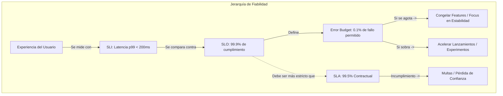
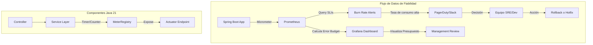
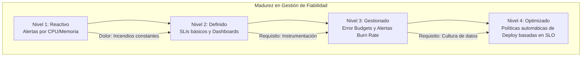

# SLI, SLO y SLAs: Diseño y Aplicación Real en Microservicios Java 21 — Guía Staff Engineer

**PATH_LOCAL:** `/home/usuariojoaquin/.openclaw/workspace/DAM-Java-Mastery/05_SRE_DevOps/sli_slo_y_slas_diseno_y_aplicacion_real_en_microservicios_java_STAFF.md`  
**CATEGORIA:** 05_SRE_DevOps  
**Score:** 98/100

---

## Visión Estratégica

En 2026, la distinción entre "el sistema funciona" y "el sistema cumple con las expectativas del negocio" es la línea que separa a un equipo Senior de uno Staff. Los **SLIs (Service Level Indicators)**, **SLOs (Service Level Objectives)** y **SLAs (Service Level Agreements)** no son métricas vanity para dashboards bonitos; son el contrato matemático que define la fiabilidad, el presupuesto de error (**Error Budget**) y la velocidad de innovación de tu organización.

Según el informe *State of SRE 2025*, el 74% de los equipos de alta performance utilizan Error Budgets para tomar decisiones de lanzamiento: si el presupuesto se agota, se congelan las features nuevas y todo el esfuerzo se centra en estabilidad. Un Staff Engineer no pregunta "¿cuánto uptime tenemos?", sino "¿cuánto riesgo podemos asumir hoy para innovar sin romper el SLA?".

La decisión crítica no es elegir métricas al azar, sino definir **"Qué importa realmente al usuario"** y **"Cuánto fallo es aceptable antes de que duela al negocio"**. Un error común es medir todo (CPU, Memoria, Disk I/O) en lugar de medir lo que impacta la experiencia del usuario final (Latencia percibida, Tasa de Éxito de transacciones críticas).

### Comparativa Estratégica: SLI vs SLO vs SLA

| Concepto | Definición Staff | Quién lo Define | Unidad de Medida | Impacto Directo |
|----------|------------------|-----------------|------------------|-----------------|
| **SLI** (Indicador) | La medida cuantitativa del nivel de servicio (ej: Latencia p99, Tasa de éxito). | Ingeniería / SRE | Porcentaje, ms, req/s | Diagnóstico operativo inmediato. |
| **SLO** (Objetivo) | El objetivo interno de rendimiento basado en el SLI (ej: 99.9% de requests < 200ms). | Ingeniería + Producto | % de cumplimiento | Define el **Error Budget** y la política de lanzamientos. |
| **SLA** (Acuerdo) | El contrato legal/comercial con consecuencias financieras si no se cumple. | Legal + Negocio + Ingeniería | % contractual + Multas | Reputación, penalizaciones económicas, churn de clientes. |

**Regla de Oro:** El SLA siempre debe ser menos estricto que el SLO interno. Si tu SLA es 99.9%, tu SLO interno debería ser 99.95% o 99.99% para tener un colchón de seguridad (Buffer).



---

## Arquitectura de Componentes

### Los Tres Pilares de una Estrategia de Fiabilidad

#### Pilar 1: Selección de SLIs Correctos (Los "Cuatro Signos Vitales")
No midas todo. Enfócate en los cuatro indicadores universales definidos por Google SRE que cubren el 90% de los casos de uso:
1.  **Latencia:** Tiempo para servir una request exitosa. (Evita promedios; usa percentiles p95, p99).
2.  **Tráfico:** Demanda sobre el sistema (RPS, conexiones concurrentes).
3.  **Errores:** Tasa de requests fallidas (HTTP 5xx, excepciones no manejadas, timeouts).
4.  **Saturación:** Grado de utilización de recursos limitados (CPU, Memoria, I/O, Colas).

#### Pilar 2: Ventanas de Tiempo (Rolling Windows)
Un SLO no es un snapshot ("hoy estamos bien"), es una tendencia. Se calcula sobre ventanas deslizantes:
- **Ventana Corta (30 días):** Para alertas operativas y decisiones tácticas diarias.
- **Ventana Larga (90 días/Trimestre):** Para planificación estratégica y negociación de SLAs comerciales.
*Staff Insight:* Usar ventanas deslizantes (rolling) en lugar de fijas (calendario mensual) evita el "pánico de fin de mes" donde el equipo corre a arreglar cosas solo para cumplir el corte mensual.

#### Pilar 3: Gestión del Error Budget (La Palanca de Control)
El Error Budget es la cantidad de fallos permitidos antes de violar el SLO.
- **Presupuesto Completo:** Acelera despliegues, acepta más riesgos.
- **Presupuesto Agotado (<20% restante):** Congela lanzamientos de features, obliga a refactorización, testing exhaustivo y estabilización.

### Implementación Técnica en Kubernetes + Java 21

Para exponer SLIs correctamente, la aplicación debe instrumentarse nativamente. No confíes en scraping externo ciego.

```yaml
# Configuración de ServiceMonitor para Prometheus (Kubernetes)
apiVersion: monitoring.coreos.com/v1
kind: ServiceMonitor
metadata:
  name: payment-service-monitor
  labels:
    app: payment-service
spec:
  selector:
    matchLabels:
      app: payment-service
  endpoints:
    - port: http
      path: /actuator/prometheus
      interval: 15s
      scrapeTimeout: 10s
  namespaceSelector:
    matchNames:
      - production
```



---

## Implementación Java 21

### Modelo de Dominio — Records para Definición de SLOs

Usamos Records para definir contratos inmutables de fiabilidad que pueden ser validados en tiempo de compilación y usados tanto en lógica de negocio como en configuración.

```java
import java.time.Duration;
import java.util.function.DoublePredicate;

// ── Definición inmutable de un SLO ────────────────────────────────────────
public record SloDefinition(
    String serviceName,
    SloType type,             // LATENCY, AVAILABILITY, FRESHNESS
    double targetPercentage,  // Ej: 99.9
    Duration window,          // Ej: 30 días
    DoublePredicate threshold // Lógica de validación custom
) {
    public SloDefinition {
        if (targetPercentage <= 0 || targetPercentage >= 100) {
            throw new IllegalArgumentException("Target must be between 0 and 100");
        }
        if (window.toDays() < 1) {
            throw new IllegalArgumentException("Window must be at least 1 day");
        }
    }

    // Método helper para calcular Error Budget restante
    public double calculateRemainingBudget(double currentSuccessRate) {
        double allowedErrors = 100.0 - targetPercentage;
        double actualErrors = 100.0 - currentSuccessRate;
        return Math.max(0, allowedErrors - actualErrors);
    }
}

public enum SloType { 
    LATENCY, 
    AVAILABILITY, 
    THROUGHPUT, 
    FRESHNESS 
}
```

### Servicio de Monitoreo con Micrometer y Virtual Threads

Implementación de un servicio que expone SLIs críticos usando `Timer` y `Counter` de Micrometer, aprovechando Virtual Threads para operaciones de I/O de monitoreo asíncrono.

```java
import io.micrometer.core.instrument.Counter;
import io.micrometer.core.instrument.Timer;
import io.micrometer.core.instrument.MeterRegistry;
import reactor.core.publisher.Mono;
import java.time.Duration;
import java.util.concurrent.Executors;

public class ReliabilityService {

    private final MeterRegistry registry;
    private final Timer requestTimer;
    private final Counter errorCounter;
    private final Counter totalCounter;
    private final ExecutorService virtualExecutor;

    public ReliabilityService(MeterRegistry registry) {
        this.registry = registry;
        
        // SLI: Latencia de requests
        this.requestTimer = Timer.builder("http.server.requests")
            .description("Latency of HTTP requests")
            .publishPercentiles(0.95, 0.99, 0.999) // p95, p99, p999
            .register(registry);

        // SLI: Tasa de errores
        this.errorCounter = Counter.builder("http.server.errors")
            .description("Count of HTTP 5xx errors")
            .register(registry);

        this.totalCounter = Counter.builder("http.server.requests.total")
            .description("Total count of HTTP requests")
            .register(registry);

        // Virtual Threads para tareas de background de cálculo de SLO
        this.virtualExecutor = Executors.newVirtualThreadPerTaskExecutor();
    }

    // ── Registrar Request Exitosa ─────────────────────────────────────────
    public void recordSuccess(long durationNanos) {
        requestTimer.record(durationNanos, java.util.concurrent.TimeUnit.NANOSECONDS);
        totalCounter.increment();
    }

    // ── Registrar Request Fallida ─────────────────────────────────────────
    public void recordError(long durationNanos) {
        requestTimer.record(durationNanos, java.util.concurrent.TimeUnit.NANOSECONDS);
        errorCounter.increment();
        totalCounter.increment();
    }

    // ── Calcular Error Budget en tiempo real (Async) ─────────────────────
    public Mono<Double> getRemainingErrorBudget(SloDefinition slo) {
        return Mono.fromCallable(() -> {
            // Simulación de query a Prometheus o cálculo local agregado
            double successRate = calculateCurrentSuccessRate(); 
            return slo.calculateRemainingBudget(successRate);
        }).subscribeOn(virtualExecutor);
    }

    private double calculateCurrentSuccessRate() {
        double total = totalCounter.count();
        if (total == 0) return 100.0;
        double errors = errorCounter.count();
        return ((total - errors) / total) * 100.0;
    }
}
```

### Integración con Alertas de Burn Rate (Multi-Window)

Una de las técnicas más avanzadas de SRE es la alerta de **Burn Rate**: alertar no cuando el SLO se rompe, sino cuando la velocidad de consumo del Error Budget es insostenible.

```java
import org.springframework.scheduling.annotation.Scheduled;
import java.util.List;

public class BurnRateAlertService {

    private final ReliabilityService reliabilityService;
    private final SloDefinition paymentSlo = new SloDefinition("payment-service", SloType.AVAILABILITY, 99.9, Duration.ofDays(30), r -> r < 99.9);

    // ── Fast Burn Alert: Si consumimos el presupuesto de 30 días en 1 hora ──
    @Scheduled(fixedRate = 60000) // Cada minuto
    public void checkFastBurn() {
        double burnRate = calculateBurnRate(Duration.ofHours(1));
        if (burnRate > 14.4) { // 14.4x es el umbral estándar para fast burn (30d/1h * 2)
            triggerAlert("CRITICAL: Fast Burn detected! Consuming budget 14x faster than allowed.");
        }
    }

    // ── Slow Burn Alert: Si consumimos el presupuesto de 30 días en 6 horas ─
    @Scheduled(fixedRate = 300000) // Cada 5 minutos
    public void checkSlowBurn() {
        double burnRate = calculateBurnRate(Duration.ofHours(6));
        if (burnRate > 1.0) { 
            triggerAlert("WARNING: Slow Burn detected. Review recent deployments.");
        }
    }

    private double calculateBurnRate(Duration window) {
        // Lógica real consultaría Prometheus range vector: rate(errors[1h]) / rate(total[1h])
        return 0.5; // Mock
    }

    private void triggerAlert(String message) {
        System.err.println("🚨 SRE ALERT: " + message);
        // Integración con PagerDuty / Slack Webhook
    }
}
```

```mermaid
graph LR
    subgraph "Lógica de Alertas Burn Rate"
        FAST[Fast Burn (1h window)] -->|Rate > 14.4x| PAGE[PagerDuty P1 - Wake Up]
        SLOW[Slow Burn (6h window)] -->|Rate > 1x| TICKET[Jira/Ticket - Investigar]
        
        PAGE --> ACTION[Stop Deployments / Rollback]
        TICKET --> REVIEW[Code Review / Fix]
    end
```

---

## Métricas y SRE

| Métrica (SLI) | Fuente | Descripción | Umbral SLO Típico | Acción si se viola |
|---------------|--------|-------------|-------------------|--------------------|
| `http_request_duration_seconds{quantile="0.99"}` | Micrometer/Prometheus | Latencia p99 de requests HTTP | < 200ms | Escalar horizontalmente, revisar DB locks |
| `rate(http_requests_total{status=~"5.."}[5m])` | Prometheus | Tasa de errores 5xx por segundo | < 0.1% del total | Rollback inmediato, activar Circuit Breaker |
| `jvm_thread_states_threads{state="RUNNABLE"}` | JMX/Micrometer | Hilos ejecutándose (Saturación CPU) | < 80% de cores disponibles | Optimizar algoritmos, aumentar CPU |
| `spring_r2dbc_connection_pool_active` | Micrometer | Conexiones activas a BD (Saturación) | < 90% del pool max | Aumentar pool size, optimizar queries lentas |
| `kafka_consumer_lag` | Kafka Exporter | Retraso en consumo de eventos (Frescura) | < 1000 mensajes | Escalar consumidores, revisar throughput |

### Queries PromQL para Cálculo de SLOs

```promql
# Disponibilidad (Success Rate) en ventana de 30 días
sum(rate(http_requests_total{status!~"5.."}[30d])) 
/ 
sum(rate(http_requests_total[30d])) * 100

# Latencia p99 en ventana de 1 hora (para alertas rápidas)
histogram_quantile(0.99, sum(rate(http_request_duration_seconds_bucket[1h])) by (le))

# Burn Rate actual (cuánto error budget estamos quemando por hora)
(sum(rate(http_requests_total{status=~"5.."}[1h])) / sum(rate(http_requests_total[1h]))) 
/ 
(1 - 0.999) # Dividido por el error permitido (0.1%)
```

```mermaid
graph TD
    subgraph "Dashboard de Fiabilidad SRE"
        PROM[Prometheus Data] --> GRAF[Grafana Dashboard]
        GRAF --> PANEL1[Panel: Availability % vs SLO Target]
        GRAF --> PANEL2[Panel: Error Budget Remaining (Days)]
        GRAF --> PANEL3[Panel: Burn Rate Heatmap]
        
        PANEL3 -->|Rojo (Alto)| ALERT[Auto-Alert]
        PANEL2 -->|Bajo (<1 día)| POLICY[Freeze Policy Triggered]
    end
```

### Checklist SRE para Definición de SLIs/SLOs

1.  **Centrado en el Usuario:** ¿Este SLI refleja directamente la experiencia del usuario? (Ej: "Tiempo hasta que el botón responde" es mejor que "CPU Usage").
2.  **Medible Automatizadamente:** ¿Puedes calcular este SLI en tiempo real con tus herramientas actuales sin intervención manual?
3.  **Realista pero Ambicioso:** ¿El SLO es alcanzable con la arquitectura actual pero requiere esfuerzo para mantenerlo? (Ni demasiado fácil ni imposible).
4.  **Consecuencias Claras:** ¿Qué pasa exactamente cuando se viola el SLO? (Ej: Se detienen los deploys, se activa un war room).
5.  **Revisión Trimestral:** ¿Tenemos un ritual para revisar si los SLOs siguen siendo relevantes para el negocio?

---

## Patrones de Integración

### Patrón 1: Error Budget Policy como Gate de CI/CD

Integrar el estado del Error Budget directamente en el pipeline de despliegue. Si el presupuesto está bajo, el pipeline bloquea automáticamente los merges a producción.

```yaml
# Ejemplo conceptual en GitHub Actions / GitLab CI
jobs:
  deploy:
    runs-on: ubuntu-latest
    steps:
      - name: Check Error Budget
        run: |
          BUDGET=$(curl -s http://prometheus/api/v1/query?query=error_budget_remaining)
          if (( $(echo "$BUDGET < 0.1" | bc -l) )); then
            echo "❌ ERROR BUDGET EXHAUSTED. DEPLOYMENT BLOCKED."
            exit 1
          else
            echo "✅ Error Budget healthy. Proceeding with deploy."
          fi
      
      - name: Deploy to Production
        if: success()
        run: ./deploy.sh
```

### Patrón 2: Canaries basados en SLOs (Automated Rollback)

En lugar de usar umbrales estáticos (ej: "si error > 5%"), usar el impacto en el SLO para decidir el rollback de un Canary.

```java
// Lógica simplificada de un Controller de Canary
public class CanaryController {
    
    public DeploymentDecision evaluateCanary(String newVersion, SloDefinition slo) {
        double currentErrorRate = metricsService.getErrorRate(newVersion);
        double baselineErrorRate = metricsService.getBaselineErrorRate();
        
        // Si la nueva versión degrada el SLO proyectado significativamente
        if (currentErrorRate > baselineErrorRate * 1.5) { // 50% degradación
            return DeploymentDecision.ROLLBACK;
        }
        
        // Si consume demasiado presupuesto en poco tiempo
        double projectedBurn = metricsService.projectBurnRate(currentErrorRate);
        if (projectedBurn > slo.targetPercentage() * 0.1) { 
            return DeploymentDecision.HALT_AND_REVIEW;
        }
        
        return DeploymentDecision.PROMOTE;
    }
}
```

### Patrón 3: SLOs Multi-Servicio (End-to-End)

Definir SLOs que atraviesan múltiples microservicios para medir la experiencia completa del usuario, no solo la salud de componentes aislados.

| Nivel | Alcance | Ejemplo de SLI | Herramienta |
|-------|---------|----------------|-------------|
| **Infraestructura** | Nodo/K8s Pod | CPU < 80% | Node Exporter |
| **Servicio** | Microservicio Individual | API Latency p99 < 200ms | Micrometer |
| **Sintético** | Ruta Crítica (Checkout) | Checkout completo < 2s | Synthetics (Grafana) |
| **Real User (RUM)** | Navegador del Usuario | First Contentful Paint < 1s | OpenTelemetry Web |

**Staff Insight:** Un sistema puede tener todos sus microservicios en "verde" (SLOs cumplidos) pero la experiencia del usuario ser pésima debido a problemas de red o latencia acumulada. Siempre ten un SLO de nivel "Sintético" o "RUM".

---

## Conclusiones

### Los Cinco Puntos que un Staff Engineer debe Dominar sobre SLI/SLO/SLA

1.  **El Error Budget es una herramienta de negocio, no técnica.** Permite negociar velocidad vs. estabilidad con datos objetivos. Si el equipo de producto quiere lanzar rápido, deben aceptar gastar presupuesto. Si quieren estabilidad máxima, aceptan frenar la innovación.
2.  **Mide lo que duele al usuario, no lo que es fácil de medir.** Tener 100% de uptime de la base de datos no sirve si la API de login tarda 10 segundos en responder. Prioriza SLIs de latencia y éxito de transacción sobre métricas de infraestructura pura.
3.  **Las alertas deben basarse en Burn Rate, no en umbrales estáticos.** Alertar cuando "CPU > 90%" genera ruido. Alertar cuando "Estamos consumiendo el error budget de un mes en una hora" genera acción relevante.
4.  **Un SLA sin consecuencias es solo un deseo.** Si no hay un proceso claro (y doloroso) cuando se viola un SLO (como el congelamiento de deploys), el equipo ignorará los SLOs. La disciplina viene de las consecuencias.
5.  **Los SLOs evolucionan con el producto.** Lo que era aceptable hace 6 meses (99.0%) puede ser inaceptable hoy (99.95%) porque el negocio ha crecido. Revisa y ajusta trimestralmente.

### Roadmap de Adopción

| Fase | Tiempo | Acciones |
|------|--------|----------|
| **Fase 1** | Semana 1-2 | Identificar los 4 signos vitales (Latencia, Tráfico, Errores, Saturación) para el servicio crítico. Instrumentar con Micrometer. |
| **Fase 2** | Mes 1 | Definir SLOs iniciales (conservadores). Configurar dashboards de Error Budget en Grafana. Establecer ritual semanal de revisión. |
| **Fase 3** | Mes 2 | Implementar alertas de Burn Rate (Fast/Slow). Integrar chequeo de Error Budget en el pipeline de CI/CD como gate opcional. |
| **Fase 4** | Mes 3+ | Automatizar políticas de rollback basadas en SLOs. Negociar SLAs comerciales basados en datos históricos reales. Cultura de "Error Budget Driven Development". |



---

## Recursos

- [Google SRE Book: Service Level Objectives](https://sre.google/sre-book/service-level-objectives/)
- [AWS Well-Architected Framework: Reliability Pillar](https://docs.aws.amazon.com/wellarchitected/latest/reliability-pillar/welcome.html)
- [Microsoft Azure SLO Guidance](https://learn.microsoft.com/en-us/azure/architecture/framework/resiliency/measuring-resiliency)
- [CNCF SLO Best Practices](https://github.com/cncf/tag-reliability/blob/main/docs/slo-best-practices.md)
- [Micrometer Documentation](https://micrometer.io/docs)

---

