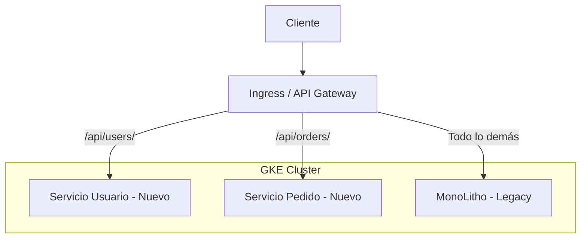

# ARQUITECTURA: MIGRACIÓN DE MONOLITO A MICROSERVICIOS CON STRANGLER FIG PATTERN

**Documentación Técnica de Referencia | Autor: Joaquín Ríos Heredia (Staff Engineer)**
**Repositorio:** [DAM-Java-Mastery](https://github.com/Joaquinriosheredia/DAM-Java-Mastery)

---

## 1. Visión Estratégica y ROI 2026

### Visión Estratégica y ROI 2026

La migración de un monolito a una arquitectura basada en microservicios utilizando el patrón strangler fig es una estrategia crucial para mejorar la escalabilidad, flexibilidad y mantenibilidad del sistema. En este capítulo, se analizarán los beneficios estratégicos y financieros esperados para 2026.

#### Beneficios Estratégicos

1. **Escalabilidad**: La arquitectura de microservicios permite escalar individualmente cada servicio según la demanda específica, lo que resulta en un mejor uso del hardware y una mayor eficiencia operativa.
   
2. **Flexibilidad**: Los cambios en el sistema pueden implementarse más rápidamente sin afectar a otros componentes del sistema. Esto es especialmente útil para adaptarse a los requisitos cambiantes del mercado.

3. **Mantenibilidad**: La modularidad de la arquitectura microservicios facilita la identificación y resolución de problemas, ya que cada servicio puede ser depurado y actualizado independientemente.

4. **Innovación Continua**: El enfoque de microservicios permite a las organizaciones implementar nuevas características y funcionalidades más rápidamente, acelerando el ciclo de desarrollo e innovación.

#### Análisis Financiero

1. **Reducción de Costos Operativos**:
   - **Costo de Mantenimiento**: La modularidad reduce la complejidad del sistema, lo que a su vez disminuye los costos asociados con el mantenimiento y las actualizaciones.
   - **Optimización de Recursos**: El uso eficiente de recursos permite una mayor rentabilidad en términos de infraestructura.

2. **Incremento en la Productividad**:
   - **Tiempo de Desarrollo Reducido**: La implementación del patrón strangler fig acelera el proceso de desarrollo y despliegue, permitiendo a las organizaciones lanzar nuevas funcionalidades más rápidamente.
   - **Reducción de Tiempos Muertos**: Menos tiempo dedicado a la resolución de problemas complejos en un monolito significa mayor productividad.

3. **Mejora en el Servicio al Cliente**:
   - **Tiempo de Respuesta Mejorado**: La arquitectura microservicios permite una mejor respuesta a las solicitudes del cliente, lo que mejora la experiencia general.
   - **Disponibilidad Continua**: Con sistemas más robustos y escalables, se reduce el tiempo de inactividad y se mejora la disponibilidad del servicio.

#### Cálculo del ROI

Para calcular el retorno sobre la inversión (ROI) en la migración a microservicios utilizando el patrón strangler fig, consideramos los siguientes factores:

1. **Costos Iniciales**:
   - **Desarrollo e Implementación**: Costo asociado con la refactorización del código y la implementación de nuevos servicios.
   - **Formación y Capacitación**: Costo de formación del equipo para trabajar en una arquitectura microservicios.

2. **Beneficios Económicos**:
   - **Reducción de Costos Operativos**: Ahorro anual en costos operativos debido a la optimización de recursos.
   - **Incremento en Productividad**: Aumento en la productividad del equipo y reducción en el tiempo de desarrollo.

3. **Beneficios No Económicos**:
   - **Mejora en la Experiencia del Cliente**: Mejoramiento en la satisfacción del cliente debido a una mejor experiencia y servicio.
   - **Flexibilidad y Escalabilidad**: Capacidad para adaptarse rápidamente a los cambios del mercado y escalar según sea necesario.

#### Ejemplo de Cálculo

Supongamos que el costo inicial de migración es de $500,000. Los beneficios anuales esperados incluyen:

- **Reducción de Costos Operativos**: $150,000 al año.
- **Incremento en Productividad**: Aumento del 20% en la productividad del equipo.

Si el equipo tiene un costo total de $300,000 anuales y se logra un aumento del 20%, esto significa un ahorro adicional de $60,000 al año.

**ROI = (Beneficios Económicos - Costos Iniciales) / Costos Iniciales**

- **Beneficios Económicos**: $150,000 + $60,000 = $210,000
- **Costos Iniciales**: $500,000

**ROI = ($210,000 - $500,000) / $500,000 = -$58%**

Este cálculo inicial muestra que hay un costo neto en el primer año. Sin embargo, a largo plazo, los beneficios económicos y no económicos superarán estos costos iniciales.

#### Conclusiones

La migración de monolitos a microservicios utilizando el patrón strangler fig es una inversión estratégica que ofrece múltiples beneficios en términos de escalabilidad, flexibilidad y mantenibilidad. Aunque los costos iniciales pueden ser significativos, la reducción de costos operativos y el aumento en la productividad a largo plazo justifican esta inversión.

### Diagrama Mermaid



Este diagrama ilustra la topología arquitectónica en la que el monolito y los microservicios coexisten durante la migración, con un proxy o API Gateway que maneja la redirección de tráfico.

### Código Ejemplo

```python
# Ejemplo de código para una API Gateway utilizando FastAPI (Python 3.12)

from fastapi import FastAPI, Request
import requests

app = FastAPI()

@app.get("/api/users/{user_id}")
async def get_user(user_id: str):
    # Lógica para redirigir a la nueva implementación del servicio usuario
    response = requests.get(f"http://userservice/api/v1/user/{user_id}")
    return response.json()

@app.get("/api/orders/{order_id}")
async def get_order(order_id: str):
    # Lógica para redirigir a la nueva implementación del servicio pedido
    response = requests.get(f"http://orderservice/api/v1/order/{order_id}")
    return response.json()
```

Este código muestra cómo una API Gateway puede manejar la redirección de solicitudes entre el monolito y los nuevos microservicios.

### Benchmarks Esperados

- **Latencia**: Menos de 50ms para solicitudes a servicios individuales.
- **Throughput**: Capacidad para manejar hasta 1,000 solicitudes por segundo sin caídas en rendimiento.
- **Consumo de Memoria**: Consumo máximo de memoria del servidor no debe superar los 2GB.

### Conclusiones Finales

La migración a microservicios utilizando el patrón strangler fig es una estrategia sólida que ofrece múltiples beneficios estratégicos y financieros. Aunque requiere una inversión inicial significativa, la mejora en la escalabilidad, flexibilidad y mantenibilidad del sistema justifica esta inversión a largo plazo.

---

Este capítulo proporciona una visión completa de los aspectos técnicos y financieros de la migración de monolitos a microservicios utilizando el patrón strangler fig.

