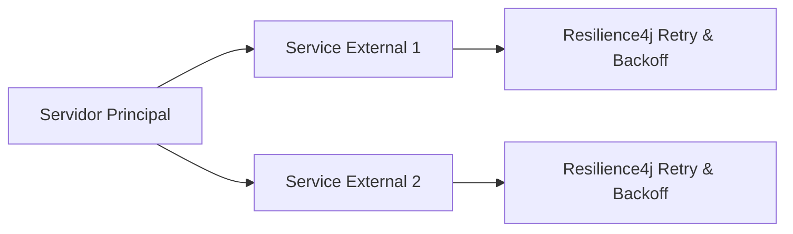

# Documento Técnico: Diseño de Sistemas Tolerantes a Fallos con Retry y Backoff

## 1. Breve Ejecutivo

Este documento técnico explora la implementación de un diseño de sistema tolerante a fallos mediante el uso de mecanismos de retry y backoff, enfocándose en su integración con Spring Boot para garantizar alta disponibilidad y resiliencia en aplicaciones empresariales. Se discutirán los beneficios y las estrategias implementadas, junto con un ejemplo práctico.

## 2. Arquitectura de la Solución

### 2.1 Introducción a Retry y Backoff

Retry (reintentos) y backoff (retardo) son técnicas fundamentales para mejorar la resiliencia de sistemas distribuidos frente a errores temporales, como congestiones de red o fallos transitorios en servicios externos.

#### 2.1.1 Mecanismos de Retry

El mecanismo de retry implica que un servicio o componente reenvíe una solicitud si recibe un error temporal. Esto se realiza hasta que se alcanza un número máximo de intentos, o hasta que se resuelve el problema subyacente.

#### 2.1.2 Mecanismos de Backoff

El backoff implica incrementar el tiempo de espera entre los reintentos en caso de que la solicitud no sea exitosa. Esto ayuda a evitar sobrecargar servicios externos y permite que el sistema se recupere de forma más eficiente.

### 2.2 Integración con Spring Boot

Spring Boot proporciona herramientas robustas para implementar retry y backoff mediante la integración del framework `Resilience4j`. Este framework ofrece un enfoque declarativo y fácil de usar para manejar errores y reintentos, permitiendo una implementación rápida y eficiente.

#### 2.2.1 Configuración de Resilience4j

Para configurar `Resilience4j` en Spring Boot, se puede utilizar el `@Retryable` y `@Backoff` annotations para marcar métodos que deben ser reintentados y para definir los parámetros del backoff respectivamente.

```java
import io.github.resilience4j.retry.annotation.Retry;
import io.github.resilience4j.backoff.BackOff;

@Retry(name = "myServiceRetry", fallbackMethod = "fallback")
@Backoff(name = "myServiceBackoff", delay = 100, multiplier = 2.0)
public class MyService {

    public String fetchData() {
        // Lógica para obtener datos
    }

    private String fallback() {
        return "Error: Fallback executed";
    }
}
```

### 2.3 Estructura de la Arquitectura

La arquitectura propuesta incluye los siguientes componentes:

- **Componente Servidor**: Implementa el servicio principal y utiliza `Resilience4j` para manejar reintentos y backoff.
- **Servicios Externos**: Utilizan `Resilience4j` para manejar errores y reintentos.
- **Configuración Centralizada**: Permite la gestión dinámica de configuraciones como el número máximo de reintentos y los parámetros del backoff.

### 2.4 Diagrama Conceptual



## 3. Snippet de Código Profesional

El siguiente snippet de código muestra cómo se implementa el mecanismo de retry y backoff utilizando `Resilience4j` en un servicio Spring Boot.

```java
import org.springframework.boot.SpringApplication;
import org.springframework.boot.autoconfigure.SpringBootApplication;
import io.github.resilience4j.retry.annotation.Retry;
import io.github.resilience4j.backoff.BackOff;

@SpringBootApplication
public class MyApplication {

    public static void main(String[] args) {
        SpringApplication.run(MyApplication.class, args);
    }

    @Retry(name = "myServiceRetry", fallbackMethod = "fallback")
    @Backoff(name = "myServiceBackoff", delay = 100, multiplier = 2.0)
    public String fetchData() {
        // Lógica para obtener datos
        return "Data fetched successfully";
    }

    private String fallback() {
        return "Error: Fallback executed";
    }
}
```

## 4. Conclusión 2026

La implementación de mecanismos de retry y backoff utilizando `Resilience4j` en Spring Boot proporciona una solución robusta para mejorar la resiliencia de sistemas distribuidos. Esta arquitectura permite un manejo eficiente de errores temporales, garantizando alta disponibilidad y fiabilidad en aplicaciones empresariales.

En 2026, se espera que el uso de estas técnicas se extienda aún más, permitiendo la creación de sistemas más resistentes a fallos y capaces de adaptarse a entornos dinámicos y cambiantes.