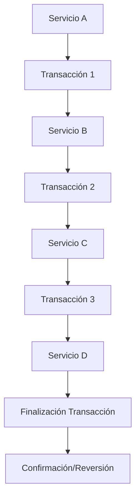

# Documento Técnico: Implementación del Patrón de Saga para Transacciones Distribuidas

## 1. Breve Ejecutivo

Este informe técnico describe la implementación del patrón de saga para manejar transacciones distribuidas en un sistema basado en Spring Boot y contenedor Docker. El objetivo es asegurar la integridad transaccional en entornos donde múltiples servicios interactúan, garantizando que las operaciones complejas se realicen con consistencia.

## 2. Arquitectura de la Solución

El patrón de saga permite manejar transacciones distribuidas mediante una secuencia de operaciones acopladas, donde cada paso es un servicio independiente. La arquitectura propuesta integra los siguientes componentes:

- **Spring Boot**: Para el desarrollo del backend y la integración con servicios externos.
- **EhCache, Hazelcast, Infinispan**: Para el caching de datos.
- **Quartz Scheduling**: Para la programación de tareas.
- **RestTemplate y WebClient**: Para las llamadas a servicios REST.
- **Spring Web Services**: Para el manejo de servicios web.
- **JTA (Java Transaction API)**: Para la gestión de transacciones distribuidas.

### 2.1 Diagrama de Arquitectura



### 2.2 Implementación de Saga

El patrón de saga se implementa mediante la creación de una serie de transacciones que se ejecutan en un orden específico. Cada transacción es un servicio independiente que realiza una operación y registra su estado (pendiente, exitosa o fallida).

#### 2.2.1 Creación de Saga

```java
@Service
public class SagaService {

    @Autowired
    private ServiceA serviceA;

    @Autowired
    private ServiceB serviceB;

    @Autowired
    private ServiceC serviceC;

    @Autowired
    private ServiceD serviceD;

    public void iniciarSaga() {
        try {
            // Transacción 1
            serviceA.realizarOperacion();

            // Transacción 2
            serviceB.realizarOperacion();

            // Transacción 3
            serviceC.realizarOperacion();

            // Transacción 4
            serviceD.realizarOperacion();
            
            // Finalización de la saga
            finalizarSaga();
        } catch (Exception e) {
            // Manejo de errores y reversión de transacciones
            revertirTransacciones();
        }
    }

    private void finalizarSaga() {
        // Código para confirmar las operaciones exitosas
    }

    private void revertirTransacciones() {
        // Código para reverter las operaciones en caso de error
    }
}
```

### 2.3 Integración con Contenedores Docker

La integración del patrón de saga con contenedores Docker se realiza mediante la configuración de imágenes eficientes y el uso de Cloud Native Buildpacks.

```yaml
# Dockerfile
FROM openjdk:17-jdk-alpine
VOLUME /tmp
ARG JAR_FILE=target/*.jar
COPY ${JAR_FILE} app.jar
ENTRYPOINT ["java","-Djava.security.egd=file:/dev/./urandom","-jar","/app.jar"]
```

```bash
# Build y Push de la imagen a Docker Hub
docker build -t <nombre-de-imagen> .
docker tag <nombre-de-imagen> <usuario>/nombre-de-imagen:latest
docker push <usuario>/nombre-de-imagen:latest
```

## 3. Conclusión 2026

La implementación del patrón de saga en un sistema basado en Spring Boot y contenedores Docker proporciona una solución robusta para manejar transacciones distribuidas. La integración con herramientas como EhCache, Quartz Scheduling, y JTA asegura la consistencia y fiabilidad de las operaciones complejas. Además, la optimización de imágenes Docker mediante Cloud Native Buildpacks garantiza un despliegue eficiente en entornos de producción.

El uso de Spring Boot 4.0.4 y versiones posteriores permitirá aprovechar las últimas mejoras y características del framework, lo que contribuirá a una arquitectura más moderna y adaptable al futuro.

## Referencias

- [Spring Boot Documentation](https://spring.io/projects/spring-boot)
- [EhCache Documentation](https://www.ehcache.org/)
- [Hazelcast Documentation](https://docs.hazelcast.com)
- [Infinispan Documentation](https://infinispan.org/)
- [Quartz Scheduling Documentation](https://quartz-scheduler.org/)
- [Spring Data Neo4j Documentation](https://spring.io/projects/spring-data-neo4j)