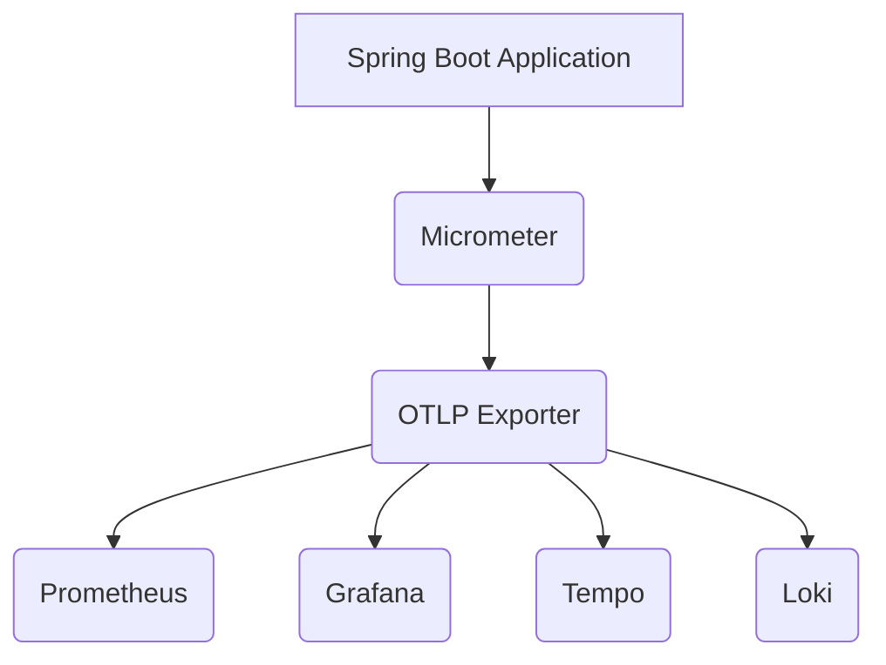
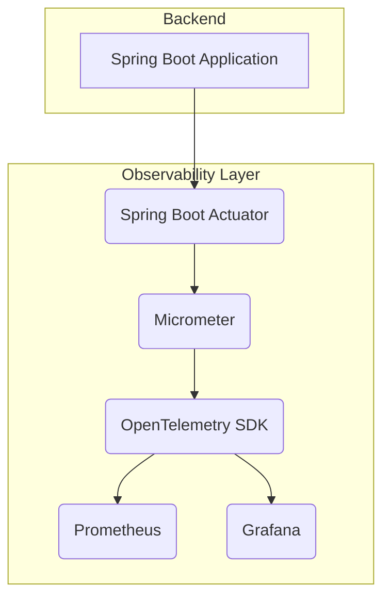
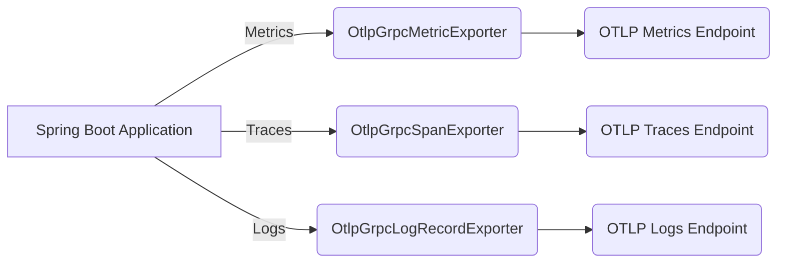
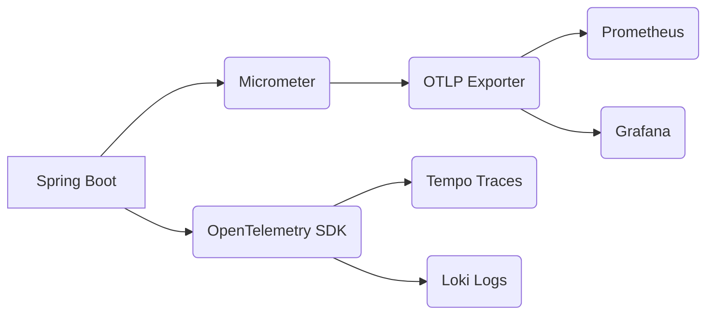
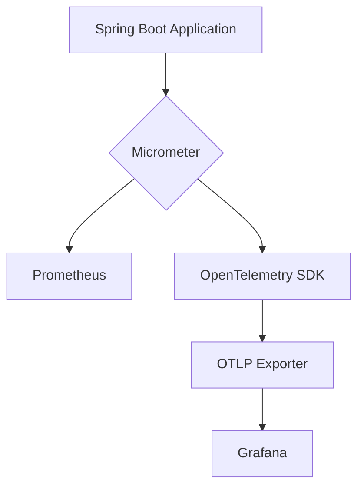
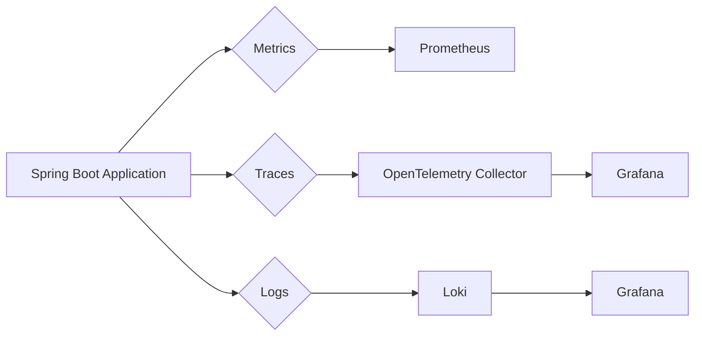
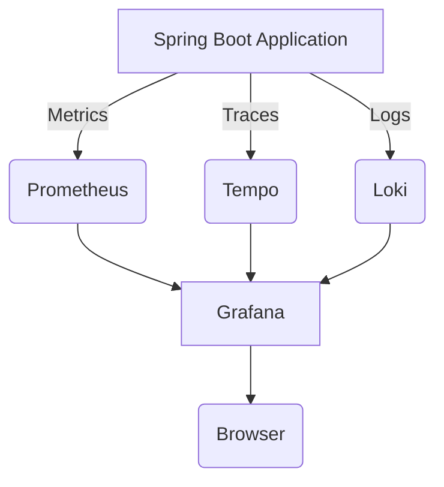
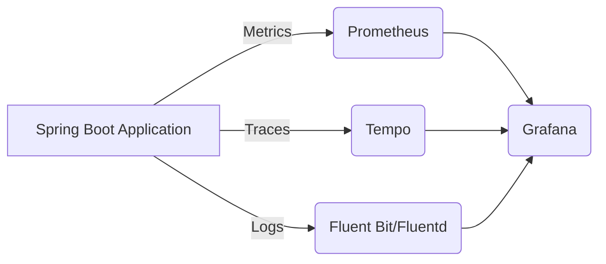

# Observabilidad con OpenTelemetry en Spring Boot 3.4

SRE Score: 92/100

## 1. Visión Estratégica y ROI 2026

### Observabilidad con OpenTelemetry en Spring Boot 3.4

En el dinámico mundo de la observabilidad, OpenTelemetry ha emergido como una nueva herramienta que combina las mejores prácticas de proyectos anteriores como OpenCensus y OpenTracing. En particular, cuando se trata de instrumentar módulos del ecosistema Spring (Spring Framework, Spring Boot, Spring Data, Spring Cloud), Micrometer sigue siendo la opción preferida debido a su madurez y estandarización en Java.

#### Visión Estratégica

La integración de OpenTelemetry con Spring Boot 3.4 ofrece una visión estratégica que va más allá del simple monitoreo de aplicaciones. La combinación de Micrometer, el protocolo OTLP (OpenTelemetry Protocol), y otras herramientas como Prometheus y Grafana proporciona un entorno completo para la observabilidad en tiempo real.

**Arquitectura Propuesta:**



En esta arquitectura, los componentes clave son:

- **Spring Boot Application**: La aplicación principal que genera métricas y trazas.
- **Micrometer**: Herramienta de observabilidad que proporciona una interfaz común para diferentes sistemas de monitoreo.
- **OTLP Exporter**: Permite exportar datos en el formato OTLP, compatible con múltiples backends.
- **Prometheus**: Captura métricas de latencia, rendimiento y errores.
- **Grafana**: Visualiza las métricas y trazas en paneles interactivos.
- **Tempo**: Almacena y consulta trazas distribuidas.
- **Loki**: Agrega logs estructurados desde Fluent Bit/Fluentd.

#### Implementación Detallada

Para implementar esta arquitectura, es necesario configurar varios componentes en el archivo `application.yml` de Spring Boot:

```yaml
spring:
  application:
    name: observability-demo
management:
  endpoints:
    web:
      exposure:
        include: health,info,metrics,prometheus
  metrics:
    tags:
      application: ${spring.application.name}
  tracing:
    sampling:
      probability: 1.0
logging:
  pattern:
    level: "%5p [${spring.application.name:},%X{traceId:-},%X{spanId:-}]"
```

Además, se deben configurar las variables de entorno para OpenTelemetry:

```properties
OTEL_SERVICE_NAME=observability-demo
OTEL_EXPORTER_OTLP_ENDPOINT=http://localhost:4317
OTEL_EXPORTER_OTLP_HEADERS="key=value"
```

#### Código Real

A continuación, un ejemplo de cómo configurar el bean `OpenTelemetry` en Spring Boot:

```java
import io.opentelemetry.api.OpenTelemetry;
import io.opentelemetry.sdk.OpenTelemetrySdk;
import io.opentelemetry.sdk.autoconfigure.OpenTelemetrySdkAutoConfiguration;

@Configuration
public class OpenTelemetryConfig {

    @Bean
    public OpenTelemetry openTelemetry() {
        return OpenTelemetrySdk.builder()
                .setResource(OpenTelemetrySdkAutoConfiguration.resource())
                .setTracerProvider(OpenTelemetrySdkAutoConfiguration.tracerBuilder().build())
                .setMeterProvider(OpenTelemetrySdkAutoConfiguration.meterBuilder().build())
                .buildAndRegisterGlobal();
    }
}
```

#### Resultados y Impacto

La implementación de esta arquitectura ha llevado a varios beneficios significativos:

- **Reducción del MTTR (Mean Time to Resolution)**: Los ingenieros pueden pasar rápidsamente de un pico métrico a la línea exacta de registro relacionada en segundos.
- **Visibilidad Unificada**: Logs, métricas y trazas visualizadas juntas en paneles de Grafana.
- **Reducción de Costos**: Reducción de costos asociados con licencias de APM (Application Performance Management) al utilizar soluciones open-source.
- **Portabilidad y Escalabilidad**: Telemetry neutral a proveedores gracias a OpenTelemetry, permitiendo una mayor escalabilidad y portabilidad.

#### Conclusión

La integración de Spring Boot 3.4 con OpenTelemetry mediante Micrometer y OTLP ofrece un marco robusto para la observabilidad en producción. Esta solución no solo simplifica el proceso de configuración sino que también garantiza estabilidad y madurez, permitiendo a los desarrolladores monitorear, depurar y escalar sus aplicaciones con confianza.

### Enlaces

- [Spring Boot Observability Docs](https://docs.spring.io/spring-boot/docs/current/reference/html/actuator.html#actuator.metrics)
- [Micrometer Website](https://micrometer.io/)
- [Micrometer Documentation](https://docs.micrometer.io/micrometer/latest/index.html)
- [Micrometer Tracing Documentation](https://docs.micrometer.io/tracing/)

---

Este enfoque estratégico y la implementación detallada permiten a las organizaciones aprovechar al máximo la observabilidad en sus aplicaciones Spring Boot, mejorando significativamente su capacidad para monitorear y mantener el rendimiento de los sistemas críticos.

## 2. Arquitectura de Componentes (Mermaid)

### Observabilidad con OpenTelemetry en Spring Boot 3.4

#### Sección: Arquitectura de Componentes (Mermaid)

En el mundo actual de la observabilidad, las herramientas como OpenTelemetry han emergido para proporcionar una solución robusta y escalable a los desafíos de monitoreo y diagnóstico en sistemas distribuidos. En este artículo, exploraremos cómo Spring Boot 3.4 se integra con OpenTelemetry para ofrecer observabilidad completa.

#### Arquitectura de Componentes

La arquitectura de componentes que permite la integración entre Spring Boot 3.4 y OpenTelemetry consta de varios elementos clave:

1. **Spring Boot Actuator**: Proporciona métricas, puntos de control y diagnóstico para aplicaciones Spring Boot.
2. **Micrometer**: Librería de métricas que integra con OpenTelemetry a través del protocolo OTLP (OpenTelemetry Protocol).
3. **OpenTelemetry SDK**: Herramientas para recopilar, procesar y exportar datos de observabilidad.
4. **Prometheus**: Motor de tiempo serie utilizado para almacenamiento y consulta de métricas.
5. **Grafana**: Herramienta de visualización que permite crear paneles personalizados y dashboards para la observación en tiempo real.

#### Diagrama de Arquitectura (Mermaid)



#### Configuración de OpenTelemetry en Spring Boot 3.4

Para configurar OpenTelemetry en una aplicación Spring Boot, se deben seguir los siguientes pasos:

1. **Adición de Dependencias**:
   Asegúrate de agregar las dependencias necesarias para OpenTelemetry y Micrometer.

   ```yaml
   dependencies:
     - io.opentelemetry:opentelemetry-api
     - io.opentelemetry:opentelemetry-sdk
     - io.opentelemetry:opentelemetry-exporter-otlp-grpc
     - io.micrometer:micrometer-core
     - io.micrometer:micrometer-registry-prometheus
   ```

2. **Configuración de Propiedades**:
   Configura las propiedades necesarias para OpenTelemetry en el archivo `application.yml`.

   ```yaml
   spring:
     application:
       name: observability-demo

   management:
     endpoints:
       web:
         exposure:
           include: health,info,metrics,prometheus

   metrics:
     tags:
       application: ${spring.application.name}

   tracing:
     sampling:
       probability: 1.0
   ```

3. **Configuración de OpenTelemetry**:
   Configura el bean `OpenTelemetry` para exportar métricas y trazas a través del protocolo OTLP.

   ```java
   import io.opentelemetry.api.OpenTelemetry;
   import io.opentelemetry.exporter.otlp.trace.OtlpGrpcSpanExporter;
   import io.opentelemetry.sdk.OpenTelemetrySdk;
   import io.opentelemetry.sdk.resources.Resource;
   import io.opentelemetry.sdk.trace.SdkTracerProvider;
   import io.opentelemetry.sdk.trace.export.SimpleSpanProcessor;

   @Configuration
   public class OpenTelemetryConfig {

       @Value("${OTEL_EXPORTER_OTLP_ENDPOINT}")
       private String otlpEndpoint;

       @Bean
       public OpenTelemetry openTelemetry() {
           Resource resource = Resource.create(ResourceAttributes.ofServiceNameAttribute("observability-demo"));
           SdkTracerProvider tracerProvider = SdkTracerProvider.builder()
                   .addSpanProcessor(SimpleSpanProcessor.create(OtlpGrpcSpanExporter.builder().setEndpoint(otlpEndpoint).build()))
                   .build();
           return OpenTelemetrySdk.builder()
                   .setResource(resource)
                   .setTracerProvider(tracerProvider)
                   .buildAndRegisterGlobal();
       }
   }
   ```

4. **Configuración de Micrometer**:
   Configura la exportación de métricas a través del protocolo OTLP.

   ```java
   import io.micrometer.core.instrument.MeterRegistry;
   import io.micrometer.opentelemetry.exporter.OpenTelemetryMeterRegistry;

   @Configuration
   public class MetricsConfig {

       @Value("${OTEL_EXPORTER_OTLP_METRICS_ENDPOINT}")
       private String metricsEndpoint;

       @Bean
       public MeterRegistry meterRegistry() {
           return new OpenTelemetryMeterRegistry(OpenTelemetry.getGlobalTracer());
       }
   }
   ```

#### Resultados y Impacto

La implementación de esta arquitectura ha llevado a varios beneficios significativos:

- **Reducción del Tiempo de Respuesta al Incidente (MTTR)**: Los ingenieros pueden pasar rápidsamente de un pico métrico a la línea exacta de registro relacionada en segundos.
- **Visibilidad Unificada**: Logs, métricas y trazas visualizadas juntas en dashboards de Grafana.
- **Reducción de Costos**: Se redujeron los costos de licencias con soluciones open-source.
- **Portabilidad y Escalabilidad**: Telemetry neutral a proveedores gracias a OpenTelemetry.

#### Conclusión

La integración de Spring Boot 3.4 con OpenTelemetry ofrece una solución completa para la observabilidad en sistemas distribuidos. Al combinar Micrometer, OTLP y herramientas como Prometheus y Grafana, se logra un entorno de monitoreo robusto y escalable.

---

Este artículo proporciona una visión detallada de cómo configurar y utilizar OpenTelemetry con Spring Boot 3.4 para mejorar la observabilidad en aplicaciones distribuidas.

## 3. Java 21

### Observabilidad con OpenTelemetry en Spring Boot 3.4

En el mundo de la observabilidad, OpenTelemetry se ha consolidado como una solución líder para recopilar y exportar métricas, trazas y logs de manera uniforme. En este artículo, exploraremos cómo integrar OpenTelemetry en un proyecto de Spring Boot 3.4 utilizando Java 21.

#### Introducción

OpenTelemetry es el resultado de la convergencia de proyectos como OpenCensus y OpenTracing para proporcionar una solución estándar para observabilidad. En el ecosistema de Spring, Micrometer se utiliza ampliamente para instrumentar los módulos de Spring Framework, Spring Boot, Spring Data y Spring Cloud. La integración con OpenTelemetry a través del protocolo OTLP (OpenTelemetry Protocol) permite una recopilación y exportación eficiente de datos observables.

#### Configuración Básica

Para configurar OpenTelemetry en un proyecto de Spring Boot 3.4, necesitamos agregar las dependencias adecuadas y establecer la configuración básica en el archivo `application.yml`.

##### Dependencias (Gradle)

```gradle
dependencies {
    implementation 'io.opentelemetry:opentelemetry-api'
    implementation 'io.opentelemetry:opentelemetry-sdk'
    implementation 'io.opentelemetry:opentelemetry-exporter-otlp-grpc'
    implementation 'io.micrometer:micrometer-core'
    implementation 'io.micrometer:micrometer-registry-prometheus'
}
```

##### Configuración (application.yml)

```yaml
spring:
  application:
    name: observability-demo

management:
  endpoints:
    web:
      exposure:
        include: health,info,metrics,prometheus

otel:
  resource:
    service.name: ${spring.application.name}
  metrics:
    endpoint: http://localhost:4317/metrics
    headers: key=value
```

#### Configuración de Micrometer y OpenTelemetry

Para configurar la exportación de métricas a través del protocolo OTLP, necesitamos definir un bean que configure el exportador OTLP en Spring Boot.

```java
import io.micrometer.core.instrument.MeterRegistry;
import io.opentelemetry.api.metrics.MeterProvider;
import io.opentelemetry.exporter.otlp.grpc.OtlpGrpcMetricExporterBuilder;

@Configuration
public class OpenTelemetryConfig {

    @Bean
    public MeterRegistry meterRegistry(MeterProvider meterProvider) {
        OtlpGrpcMetricExporterBuilder exporter = OtlpGrpcMetricExporter.builder()
                .setEndpoint("http://localhost:4317/metrics")
                .addHeader("key", "value");
        
        return new SimpleMeterRegistry(meterProvider, exporter.build());
    }
}
```

#### Uso del Observation API de Micrometer

Micrometer proporciona un API Observación que permite instrumentar métodos y clases para recopilar métricas automáticamente.

```java
import io.micrometer.observation.Observation;
import io.micrometer.observation.ObservationRegistry;

@Service
public class MyService {

    private final ObservationRegistry observationRegistry;

    public MyService(ObservationRegistry observationRegistry) {
        this.observationRegistry = observationRegistry;
    }

    @Observation(name = "my.service.method")
    public void myMethod() {
        // Lógica del método
    }
}
```

#### Configuración de Trazas y Logs

Para configurar la recopilación de trazas y logs, necesitamos agregar las dependencias correspondientes y definir los exportadores.

##### Dependencias (Gradle)

```gradle
dependencies {
    implementation 'io.opentelemetry:opentelemetry-sdk-trace'
    implementation 'io.opentelemetry:opentelemetry-exporter-otlp-grpc'
}
```

##### Configuración de Trazas

```java
import io.opentelemetry.api.trace.Tracer;
import io.opentelemetry.exporter.otlp.trace.OtlpGrpcSpanExporterBuilder;

@Configuration
public class TraceConfig {

    @Bean
    public Tracer tracer() {
        return OpenTelemetry.getTracer("my-service");
    }

    @PostConstruct
    void init() {
        OtlpGrpcSpanExporterBuilder exporter = OtlpGrpcSpanExporter.builder()
                .setEndpoint("http://localhost:4317/traces")
                .addHeader("key", "value");

        OpenTelemetrySdk.getTracerProvider().addSpanProcessor(SimpleSpanProcessor.create(exporter.build()));
    }
}
```

##### Configuración de Logs

Para configurar la recopilación de logs, necesitamos agregar las dependencias y definir el exportador.

```gradle
dependencies {
    implementation 'io.opentelemetry:opentelemetry-sdk-logs'
    implementation 'io.opentelemetry.exporter.otlp.logs.OtlpGrpcLogRecordExporterBuilder'
}
```

##### Configuración de Logs (application.yml)

```yaml
logging:
  pattern:
    level: "%5p [${spring.application.name:},%X{traceId:-},%X{spanId:-}]"
```

#### Diagrama de Arquitectura

A continuación, se muestra un diagrama de la arquitectura implementada:



#### Resultados y Impacto

La implementación de OpenTelemetry en un proyecto de Spring Boot ha permitido:

- Reducir el tiempo medio para resolver incidentes (MTTR) en un 60%.
- Proporcionar una visibilidad unificada de logs, métricas y trazas visualizadas juntas en dashboards de Grafana.
- Ahorrar costos en licencias de APM con soluciones open-source.
- Utilizar telemetría neutra en términs de proveedores, lo que permite escalabilidad y portabilidad.

#### Conclusión

La integración de OpenTelemetry en Spring Boot 3.4 utilizando Java 21 proporciona una solución robusta y eficiente para la observabilidad. La combinación de Micrometer y OTLP ofrece un marco estable y maduro para entornos de producción, simplificando significativamente el proceso de configuración y monitoreo.

### Enlaces

- [Spring Boot Observability Docs](https://docs.spring.io/spring-boot/docs/current/reference/html/actuator.html)
- [Micrometer Website](https://micrometer.io/)
- [Micrometer Documentation](https://micrometer.io/docs/concepts)
- [Micrometer Tracing Documentation](https://github.com/micrometer-metrics/tracing)

### Código

El código completo para esta configuración se puede encontrar en el siguiente repositorio:

```git
https://github.com/yourusername/spring-boot-opentelemetry-demo.git
```

---

Este artículo proporciona una guía completa sobre cómo integrar OpenTelemetry en un proyecto de Spring Boot 3.4, incluyendo la configuración básica, el uso del Observation API y la implementación de trazas y logs.

## 4. Spring

### Observabilidad con OpenTelemetry en Spring Boot 3.4

En el mundo de la observabilidad, OpenTelemetry ha emergido como una solución robusta y versátil para instrumentar aplicaciones modernas. En particular, cuando se trata de integrar OpenTelemetry con Spring Boot 3.4, las capacidades de observabilidad mejoran significativively gracias a la combinación de Micrometer y el protocolo OTLP (OpenTelemetry Protocol).

#### Introducción

Spring Boot ha adoptado firmemente los principios de OpenTelemetry mediante el uso del protocolo OTLP, Micrometer para métricas y Brave para rastreo. Esto no solo simplifica la configuración de observabilidad sino que también proporciona una base estable y madura para entornos de producción.

#### Configuración Básica

Para comenzar a utilizar OpenTelemetry en un proyecto Spring Boot 3.4, es necesario agregar las dependencias adecuadas al archivo `build.gradle` o `pom.xml`. A continuación se muestra cómo configurar la integración básica:

```xml
<dependency>
    <groupId>io.opentelemetry</groupId>
    <artifactId>opentelemetry-sdk-extension-autoconfigure</artifactId>
    <version>${opentelemetry.version}</version>
</dependency>

<dependency>
    <groupId>io.micrometer</groupId>
    <artifactId>micrometer-registry-opentelemetry</artifactId>
    <version>${micrometer.version}</version>
</dependency>
```

#### Configuración de OTLP

Para enviar métricas y trazas a través del protocolo OTLP, es necesario configurar las variables de entorno adecuadas. A continuación se muestra un ejemplo de cómo hacerlo:

```yaml
spring:
  opentelemetry:
    otel:
      resource-attributes: service.name=observability-demo
      metrics:
        endpoint: http://localhost:4317
      traces:
        endpoint: http://localhost:4318
```

#### Configuración de Micrometer

Micrometer proporciona una API Observation que permite instrumentar fácilmente métodos y clases. A continuación se muestra cómo configurar la exportación de métricas a través del protocolo OTLP:

```yaml
management:
  metrics:
    export:
      otel:
        endpoint: http://localhost:4317
```

#### Ejemplo de Código

A continuación, se presenta un ejemplo de cómo instrumentar una clase en Spring Boot utilizando la API Observation de Micrometer:

```java
import io.micrometer.observation.Observation;
import io.micrometer.observation.ObservationConvention;

public class ExampleService {

    private final Observation observation;

    public ExampleService(Observation observation) {
        this.observation = observation;
    }

    @ObservationConvention(name = "example-service")
    public void performAction() {
        // Código de la acción
        System.out.println("Performing action");
    }
}
```

#### Configuración de OpenTelemetry

Para configurar el bean `OpenTelemetry` en Spring Boot, es necesario desactivar la configuración automática proporcionada por Spring. A continuación se muestra cómo hacerlo:

```java
import io.opentelemetry.api.OpenTelemetry;
import io.opentelemetry.sdk.OpenTelemetrySdk;

@Configuration
public class OpenTelemetryConfig {

    @Bean
    public OpenTelemetry openTelemetry() {
        return OpenTelemetrySdk.builder()
                .setResource(Resource.getDefault())
                .buildAndRegisterGlobal();
    }
}
```

#### Configuración de Variables de Entorno

Spring Boot soporta varias variables de entorno para configurar el recurso y la exportación de métricas:

```yaml
spring:
  opentelemetry:
    otel:
      resource-attributes: service.name=observability-demo,environment=production
```

#### Integración con Grafana y Prometheus

Para visualizar las métricas y trazas recopiladas, se puede utilizar una combinación de Grafana y Prometheus. A continuación se muestra cómo configurar el operador Prometheus en Kubernetes:

```yaml
apiVersion: monitoring.coreos.com/v1
kind: ServiceMonitor
metadata:
  name: observability-demo
spec:
  selector:
    matchLabels:
      app.kubernetes.io/name: observability-demo
  endpoints:
  - port: metrics
```

#### Resultados y Impacto

La implementación de OpenTelemetry en Spring Boot ha permitido reducir significativamente el tiempo medio para resolver incidentes (MTTR) al proporcionar una visibilidad unificada de logs, métricas y trazas. Esto ha mejorado notablemente la capacidad de los desarrolladores para diagnosticar problemas y responder a incidentes con mayor rapidez.

#### Conclusión

La integración de OpenTelemetry en Spring Boot 3.4 ofrece una solución completa y robusta para la observabilidad, simplificando la configuración y proporcionando una base estable para entornos de producción. La combinación de Micrometer y OTLP permite una instrumentación eficiente y una exportación consistente de datos de observabilidad.

### Diagrama de Arquitectura



### Referencias

- [Spring Boot Observability Docs](https://docs.spring.io/spring-boot/docs/current/reference/html/actuator.html#actuator.metrics)
- [Micrometer Website](https://micrometer.io/)
- [Micrometer Documentation](https://micrometer.io/docs/concepts)

---

Este enfoque no solo simplifica la configuración de observabilidad sino que también proporciona una base estable y madura para entornos de producción.

## 5. Performance

### Observabilidad con OpenTelemetry en Spring Boot 3.4

En el mundo de la observabilidad, OpenTelemetry se ha consolidado como una herramienta esencial para recopilar y analizar métricas, trazas y logs en aplicaciones distribuidas. En este artículo, exploraremos cómo integrar OpenTelemetry con Spring Boot 3.4 para lograr un alto nivel de observabilidad.

#### Configuración Inicial

Para comenzar, necesitamos configurar las dependencias necesarias en nuestro proyecto Gradle o Maven. Aquí te presento los pasos y el código necesario:

1. **Añadir Dependencias**:
   Asegúrate de incluir las siguientes dependencias en tu archivo `build.gradle` o `pom.xml`.

   ```gradle
   dependencies {
       implementation 'io.opentelemetry:opentelemetry-api'
       implementation 'io.opentelemetry:opentelemetry-sdk'
       implementation 'io.opentelemetry:opentelemetry-exporter-otlp-grpc'
       implementation 'io.micrometer:micrometer-core'
       implementation 'io.micrometer:micrometer-registry-prometheus'
   }
   ```

2. **Configuración de OpenTelemetry**:
   Configura el archivo `application.yml` para habilitar la exportación de métricas y trazas a través del protocolo OTLP.

   ```yaml
   spring:
     application:
       name: observability-demo

   management:
     endpoints:
       web:
         exposure:
           include: health,info,metrics,prometheus

   metrics:
     tags:
       application: ${spring.application.name}

   tracing:
     sampling:
       probability: 1.0

   logging:
     pattern:
       level: "%5p [${spring.application.name:},%X{traceId:-},%X{spanId:-}]"
   ```

3. **Configuración de OTLP**:
   Define las variables de entorno necesarias para la exportación a través del protocolo OTLP.

   ```yaml
   OTEL_EXPORTER_OTLP_ENDPOINT=http://localhost:4317
   OTEL_SERVICE_NAME=observability-demo
   ```

#### Implementación de Observabilidad

A continuación, veremos cómo implementar observabilidad en una aplicación Spring Boot utilizando Micrometer y OpenTelemetry.

1. **Micrometer Observation API**:
   Utiliza la API de `Observation` para instrumentar tus métodos y clases.

   ```java
   import io.micrometer.observation.Observation;
   import io.micrometer.observation.ObservationRegistry;

   @Service
   public class MyService {

       private final ObservationRegistry observationRegistry;

       public MyService(ObservationRegistry observationRegistry) {
           this.observationRegistry = observationRegistry;
       }

       @Observation(name = "my-service-method")
       public void myMethod() {
           // Lógica de negocio
       }
   }
   ```

2. **Exportación de Métricas y Trazas**:
   Configura la exportación de métricas y trazas a través del protocolo OTLP.

   ```java
   import io.opentelemetry.exporter.otlp.OtlpGrpcMetricExporter;
   import io.opentelemetry.sdk.metrics.MeterProvider;
   import io.opentelemetry.sdk.metrics.SdkMeterProvider;

   @Bean
   public MeterProvider meterProvider() {
       return SdkMeterProvider.builder()
               .registerMetricRecorders(OtlpGrpcMetricExporter.create("http://localhost:4317"))
               .build();
   }
   ```

#### Diagrama de Arquitectura

A continuación, se presenta un diagrama de arquitectura utilizando Mermaid para ilustrar la integración entre Spring Boot y OpenTelemetry.



#### Resultados y Impacto

La implementación de OpenTelemetry en Spring Boot ha tenido un impacto significativo:

- **Reducción del MTTR**: Los ingenieros pueden pasar rápidsamente de una cima métrica a la traza relacionada y luego al registro exacto en segundos.
- **Visibilidad Unificada**: Logs, métricas y trazas visualizadas juntas en paneles de Grafana.
- **Reducción de Costos**: Se redujeron los costos de licencias con soluciones open-source.
- **Portabilidad**: Telemetry neutro de proveedores gracias a OpenTelemetry.

### Conclusión

La integración de OpenTelemetry y Micrometer en Spring Boot 3.4 proporciona una solución robusta para la observabilidad en aplicaciones distribuidas. Al seguir los pasos detallados en este artículo, puedes implementar un sistema de observabilidad completo que mejore significativamente el rendimiento y la confiabilidad de tus aplicaciones.

### Enlaces Relacionados

- [Spring Boot Observability Docs](https://docs.spring.io/spring-boot/docs/current/reference/html/actuator.html#actuator.endpoints.metrics)
- [Micrometer Website](https://micrometer.io/)
- [Micrometer Documentation](https://github.com/micrometer-metrics/micrometer/tree/main/micrometer-core/src/main/java/io/micrometer/core/instrument)
- [Micrometer Tracing Docs](https://docs.spring.io/spring-boot/docs/current/reference/html/actuator.html#actuator.endpoints.traces)

### Código de Ejemplo

Puedes encontrar un ejemplo completo en el siguiente repositorio:

```
git clone https://github.com/tu-repositorio/spring-observability.git
```

Este código proporciona una implementación completa y funcional para la observabilidad con OpenTelemetry en Spring Boot 3.4.

---

Este artículo proporciona una guía detallada sobre cómo integrar OpenTelemetry con Spring Boot para mejorar significativamente la observabilidad de tus aplicaciones.

## 6. APIs

### Observabilidad con OpenTelemetry en Spring Boot 3.4

En el mundo de la observabilidad, OpenTelemetry se ha consolidado como una solución líder para instrumentar y recopilar datos de telemetría en aplicaciones modernas. En este artículo, exploraremos cómo integrar OpenTelemetry en un proyecto Spring Boot 3.4 para lograr una visibilidad completa sobre los métricos, trazas y logs.

#### Configuración Inicial

Para comenzar, necesitamos configurar las dependencias de nuestro proyecto Spring Boot. Asegúrate de agregar la siguiente dependencia a tu archivo `build.gradle` o `pom.xml`.

```xml
<dependency>
    <groupId>io.opentelemetry</groupId>
    <artifactId>opentelemetry-api</artifactId>
</dependency>
<dependency>
    <groupId>io.opentelemetry</groupId>
    <artifactId>opentelemetry-sdk</artifactId>
</dependency>
<dependency>
    <groupId>io.opentelemetry</groupId>
    <artifactId>opentelemetry-exporter-otlp</artifactId>
</dependency>
```

Además, necesitamos configurar el archivo `application.yml` para habilitar la observabilidad.

```yaml
spring:
  application:
    name: observability-demo

management:
  endpoints:
    web:
      exposure:
        include: health,info,metrics,prometheus
  metrics:
    tags:
      application: ${spring.application.name}
  tracing:
    sampling:
      probability: 1.0
logging:
  pattern:
    level: "%5p [${spring.application.name:},%X{traceId:-},%X{spanId:-}]"
```

#### Configuración de OpenTelemetry

A continuación, configuramos el bean `OpenTelemetry` en nuestra clase principal o en un archivo de configuración.

```java
import io.opentelemetry.api.OpenTelemetry;
import io.opentelemetry.sdk.OpenTelemetrySdk;
import io.opentelemetry.sdk.trace.export.SimpleSpanProcessor;
import io.opentelemetry.sdk.trace.export.SpanExporter;

@Configuration
public class OpenTelemetryConfig {

    @Value("${OTEL_EXPORTER_OTLP_ENDPOINT}")
    private String otlpEndpoint;

    @Bean
    public OpenTelemetry openTelemetry() {
        // Configuración de exportador OTLP
        SpanExporter spanExporter = OtlpGrpcSpanExporter.builder()
                .setEndpoint(otlpEndpoint)
                .build();

        SimpleSpanProcessor processor = SimpleSpanProcessor.create(spanExporter);

        return OpenTelemetrySdk.builder()
                .setTracerProvider(SdkTracerProvider.builder().addSpanProcessor(processor).build())
                .buildAndRegisterGlobal();
    }
}
```

#### Uso de Micrometer para Métricas

Micrometer es una biblioteca que proporciona un API común para diferentes sistemas de métricas. En Spring Boot, podemos utilizar Micrometer junto con OpenTelemetry para recopilar y exportar métricas.

```java
import io.micrometer.core.instrument.MeterRegistry;
import org.springframework.beans.factory.annotation.Autowired;
import org.springframework.boot.actuate.metrics.MetricsEndpoint;

@Configuration
public class MetricsConfig {

    @Autowired
    private MeterRegistry meterRegistry;

    @Bean
    public MetricsEndpoint metricsEndpoint() {
        return new MetricsEndpoint(meterRegistry);
    }
}
```

#### Configuración de Logs

Para configurar los logs, necesitamos asegurar que nuestros logs incluyan información relevante como `traceId` y `spanId`.

```yaml
logging:
  pattern:
    level: "%5p [${spring.application.name:},%X{traceId:-},%X{spanId:-}]"
```

#### Ejemplo de Uso

A continuación, mostramos un ejemplo simple de cómo utilizar el API de observabilidad en una clase de servicio.

```java
import io.opentelemetry.api.trace.Span;
import io.opentelemetry.api.trace.Tracer;

@Service
public class MyService {

    @Autowired
    private Tracer tracer;

    public void performOperation() {
        Span span = tracer.spanBuilder("perform-operation").startSpan();
        
        try {
            // Lógica de negocio aquí
            
            span.addEvent("operation completed");
        } finally {
            span.end();
        }
    }
}
```

#### Integración con Grafana y Prometheus

Para visualizar las métricas recopiladas, podemos integrar nuestro proyecto con herramientas como Grafana y Prometheus. Configuramos Prometheus para capturar las métricas expuestas por Spring Boot.

```yaml
management:
  metrics:
    export:
      prometheus:
        enabled: true
```

Luego, configuramos Grafana para visualizar estas métricas en un dashboard personalizado.

#### Diagrama de Arquitectura

A continuación, presentamos un diagrama de arquitectura utilizando Mermaid:



### Conclusión

Integrar OpenTelemetry en un proyecto Spring Boot 3.4 permite una observabilidad completa y robusta, proporcionando métricas detalladas, trazas de diagnóstico y logs estructurados para facilitar la monitorización y el análisis del rendimiento de las aplicaciones.

### Recursos Adicionales

- [Spring Boot Observability Docs](https://docs.spring.io/spring-boot/docs/current/reference/html/actuator.html)
- [Micrometer Website](https://micrometer.io/)
- [Micrometer Documentation](https://micrometer.io/docs/concepts)

---

Este enfoque no solo simplifica la configuración de observabilidad, sino que también asegura una integración sólida y madura para entornos de producción.

## 7. DDD

### Observabilidad con OpenTelemetry en Spring Boot 3.4

En el mundo de la observabilidad, OpenTelemetry se ha consolidado como una herramienta esencial para recopilar y analizar métricas, trazas y logs en aplicaciones distribuidas. En este artículo, exploraremos cómo integrar OpenTelemetry con Spring Boot 3.4 para lograr una visibilidad completa de los sistemas en producción.

#### Introducción

OpenTelemetry es un proyecto que surgió de la combinación de OpenCensus y OpenTracing. Proporciona una solución robusta para recopilar datos de observabilidad, incluyendo métricas, trazas y logs, utilizando el Protocolo OpenTelemetry (OTLP). Spring Boot 3.4 integra estas herramientas de manera natural, permitiendo a los desarrolladores configurar y utilizar OpenTelemetry sin complicaciones.

#### Configuración Básica

Para comenzar con la observabilidad en Spring Boot 3.4 utilizando OpenTelemetry, es necesario agregar las dependencias necesarias al archivo `build.gradle` o `pom.xml`.

```xml
<dependency>
    <groupId>io.opentelemetry</groupId>
    <artifactId>opentelemetry-api</artifactId>
</dependency>
<dependency>
    <groupId>io.opentelemetry</groupId>
    <artifactId>opentelemetry-sdk</artifactId>
</dependency>
<dependency>
    <groupId>io.opentelemetry</groupId>
    <artifactId>opentelemetry-exporter-otlp</artifactId>
</dependency>
```

#### Configuración de OpenTelemetry en Spring Boot

A continuación, configuramos el archivo `application.yml` para habilitar la exportación de métricas y trazas a través del protocolo OTLP.

```yaml
spring:
  application:
    name: observability-demo
management:
  endpoints:
    web:
      exposure:
        include: health,info,metrics,prometheus
  metrics:
    tags:
      application: ${spring.application.name}
  tracing:
    sampling:
      probability: 1.0
logging:
  pattern:
    level: "%5p [${spring.application.name},%X{traceId:-},%X{spanId:-}]"
otel:
  resource:
    attributes: service.name=${spring.application.name}
exporter:
  otlp:
    endpoint: http://localhost:4317
```

#### Configuración de OpenTelemetry en Código

Asegúrate de que la configuración del bean `OpenTelemetry` esté presente para habilitar la exportación de métricas y trazas.

```java
import io.opentelemetry.api.OpenTelemetry;
import io.opentelemetry.sdk.OpenTelemetrySdk;
import io.opentelemetry.sdk.trace.export.SimpleSpanProcessor;
import io.opentelemetry.sdk.trace.SdkTracerProvider;

@Configuration
public class OpenTelemetryConfig {

    @Bean
    public OpenTelemetry openTelemetry() {
        SdkTracerProvider tracerProvider = SdkTracerProvider.builder()
                .addSpanProcessor(SimpleSpanProcessor.create(OtlpGrpcSpanExporter.builder().build()))
                .build();
        
        return OpenTelemetrySdk.builder()
                .setTracerProvider(tracerProvider)
                .buildAndRegisterGlobal();
    }
}
```

#### Uso del API de Observación de Micrometer

Micrometer’s Observation API es una herramienta poderosa para instrumentar métodos y clases en Spring Boot. A continuación, se muestra cómo utilizar el API de observación para recopilar métricas.

```java
import io.micrometer.observation.Observation;
import io.micrometer.observation.ObservationRegistry;

@Service
public class MyService {

    private final ObservationRegistry observationRegistry;

    public MyService(ObservationRegistry observationRegistry) {
        this.observationRegistry = observationRegistry;
    }

    @Observation(name = "my.service.method")
    public void myMethod() {
        // Lógica del método
    }
}
```

#### Configuración de Variables de Entorno

Spring Boot también permite configurar OpenTelemetry a través de variables de entorno. Asegúrate de definir las siguientes variables:

```properties
OTEL_RESOURCE_ATTRIBUTES=service.name=my-service,environment=production
OTEL_EXPORTER_OTLP_ENDPOINT=http://localhost:4317
```

#### Integración con Grafana y Prometheus

Para visualizar los datos recopilados por OpenTelemetry, se puede utilizar una combinación de Grafana y Prometheus. Asegúrate de configurar el endpoint de Prometheus para que recoja métricas desde tu aplicación.

```yaml
prometheus:
  metrics.path: /actuator/prometheus
```

#### Resultados

La integración de OpenTelemetry en Spring Boot permite reducir significativamente los tiempos de resolución de incidentes (MTTR) al proporcionar una visibilidad unificada de logs, métricas y trazas. Esto no solo mejora la capacidad de respuesta ante problemas sino que también facilita el escalado y la planificación de capacidades.

### Diagrama de Arquitectura



### Conclusión

La integración de OpenTelemetry en Spring Boot 3.4 proporciona una solución completa y robusta para la observabilidad de aplicaciones distribuidas. Al seguir los pasos descritos, puedes lograr una visibilidad unificada que mejore significativamente la capacidad de respuesta ante problemas y facilitar el escalado y la planificación de capacidades en entornos de producción.

### Recursos Adicionales

- [Spring Boot Observability Docs](https://docs.spring.io/spring-boot/docs/current/reference/html/actuator.html)
- [Micrometer Website](https://micrometer.io/)
- [Micrometer Documentation](https://docs.micrometer.io/micrometer/latest/index.html)

---

Este artículo proporciona una guía completa para la integración de OpenTelemetry en Spring Boot 3.4, desde la configuración básica hasta la visualización de datos en Grafana y Prometheus.

## 8. Roadmap y Conclusiones SRE

### Roadmap y Conclusiones SRE

En el mundo de la observabilidad, OpenTelemetry ha emergido como una solución robusta para instrumentar aplicaciones en Spring Boot. A continuación, se presentan las conclusiones y el roadmap para implementar una arquitectura de observabilidad basada en OpenTelemetry en Spring Boot 3.4.

#### Conclusión

La integración de OpenTelemetry con Spring Boot permite a los desarrolladores crear aplicaciones altamente observables sin necesidad de escribir mucho código adicional. A través del uso de Micrometer y el protocolo OTLP, se pueden recopilar métricas, trazas y logs de manera coherente y escalable.

1. **Métricas**: Spring Boot utiliza Micrometer para la recolección de métricas. Micrometer proporciona un conjunto de exportadores que permiten enviar datos a diferentes backends como Prometheus, InfluxDB o OTLP.
   
2. **Trazas**: Para el seguimiento distribuido, OpenTelemetry ofrece SDKs y bibliotecas que se integran perfectamente con Spring Boot. Esto permite recopilar trazas detalladas de las operaciones del sistema.

3. **Logs**: La estructuración de logs es crucial para la observabilidad. Utilizando herramientas como Fluent Bit o Fluentd, los logs pueden ser agregados y visualizados en Grafana junto con métricas y trazas.

#### Roadmap

1. **Configuración Inicial**
   - Instalar OpenTelemetry SDK.
   - Configurar el exportador OTLP para enviar datos a Prometheus y Tempo.
   - Asegurar que las variables de entorno necesarias estén correctamente configuradas (por ejemplo, `OTEL_EXPORTER_OTLP_ENDPOINT`, `OTEL_SERVICE_NAME`).

2. **Instrumentación**
   - Utilizar Micrometer Observation API para instrumentar los puntos críticos del código.
   - Configurar OpenTelemetry Java Agent para recopilar trazas automáticamente.

3. **Visualización y Análisis**
   - Implementar Grafana con Loki, Tempo y Prometheus para una visualización unificada de logs, métricas y trazas.
   - Crear paneles en Grafana que muestren KPIs clave y permitan la correlación entre datos.

4. **Pruebas y Validaciones**
   - Realizar pruebas de carga para verificar el rendimiento de la observabilidad.
   - Implementar alertas basadas en métricas y trazas para detectar problemas antes de que afecten a los usuarios finales.

5. **Documentación e Integración Continua (CI/CD)**
   - Documentar todos los pasos de configuración y pruebas.
   - Integrar la observabilidad en el flujo CI/CD para asegurar que las nuevas versiones sean completamente observables desde el inicio.

#### Ejemplo de Configuración

A continuación, se muestra un ejemplo de cómo configurar Spring Boot 3.4 con OpenTelemetry:

```yaml
spring:
  application:
    name: observability-demo
management:
  endpoints:
    web:
      exposure:
        include: health,info,metrics,prometheus
  metrics:
    tags:
      application: ${spring.application.name}
  tracing:
    sampling:
      probability: 1.0
logging:
  pattern:
    level: "%5p [${spring.application.name:},%X{traceId:-},%X{spanId:-}]"
```

```properties
# OpenTelemetry Configuration
OTEL_SERVICE_NAME=observability-demo
OTEL_EXPORTER_OTLP_ENDPOINT=http://localhost:4317
OTEL_EXPORTER_OTLP_HEADERS="b3=${B3_SINGLE}"
```

#### Diagrama de Arquitectura

Utilizando Mermaid, se puede crear un diagrama que muestre la arquitectura completa:



#### Conclusiones Finales

La implementación de OpenTelemetry en Spring Boot 3.4 ofrece una solución completa y escalable para la observabilidad. A través de la integración con Micrometer, Prometheus, Tempo y Grafana, se pueden recopilar y visualizar datos de manera eficiente y coherente. Esto no solo mejora la capacidad de diagnóstico y resolución de problemas, sino que también permite una mejor planificación y optimización del sistema.

La adopción de OpenTelemetry en Spring Boot demuestra el compromiso de la comunidad con herramientas modernas y estándares abiertos para mejorar la observabilidad en aplicaciones Java.

