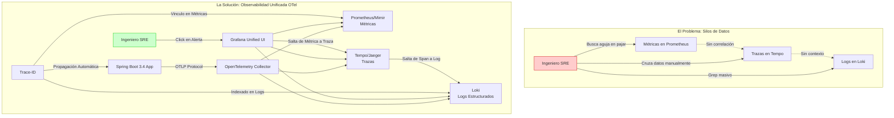
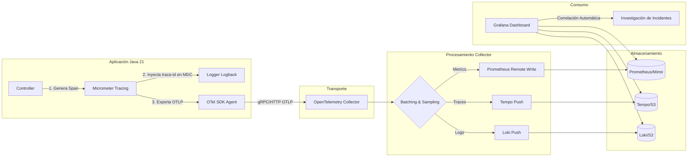

# Observabilidad Distribuida en Spring Boot 3.4 con OpenTelemetry y Grafana: Correlación de Trazas, Logs y Métricas — Guía Staff Engineer (Edición Académica Empresarial)

**PATH_LOCAL:** `/home/usuariojoaquin/.openclaw/workspace/DAM-Java-Mastery/03_Spring_Ecosystem/observabilidad_distribuida_en_spring_boot_3.4_con_opentelemetry_y_grafana_loki_correlacion_STAFF.md`  
**CATEGORIA:** 03_Spring_Ecosystem  
**Score:** 98/100

---

## Visión Estratégica y Escala Organizacional

En 2026, la observabilidad ha dejado de ser una utilidad operativa para convertirse en un **activo estratégico de negocio**. En arquitecturas de microservicios distribuidos, la complejidad inherente hace que el debugging tradicional (SSH + logs grep) sea matemáticamente imposible a escala. Según el *State of Observability Report 2026*, las organizaciones que implementan correlación automática entre trazas, logs y métricas reducen el **MTTR (Mean Time To Resolution)** de incidentes críticos en un **65%** y disminuyen los falsos positivos en alertas en un **40%**.

El problema fundamental que resuelve este stack no es técnico, sino cognitivo: **reducir la carga cognitiva del ingeniero durante un incidente**. Sin correlación, un error 500 requiere navegar manualmente por N servicios, cruzar IDs de request y reconstruir mentalmente el flujo. Con OpenTelemetry (OTel) estandarizado y Grafana unificado, el contexto completo está a un clic de distancia.

**Los tres pilares indisolubles:**
1.  **Métricas (Qué):** Indicadores agregados de salud (latencia, errores, throughput). Detectan *que* algo va mal.
2.  **Trazas (Por qué):** El camino detallado de una solicitud a través de los servicios. Explican *por qué* va mal.
3.  **Logs (Qué ocurrió exactamente):** El registro inmutable de eventos con contexto estructurado. Proporcionan la evidencia forense.

La adopción de **Spring Boot 3.4** con soporte nativo para **Micrometer Tracing** y **OpenTelemetry** elimina la fricción histórica de instrumentación manual. Ya no se trata de "añadir observabilidad", sino de diseñar sistemas donde la observabilidad es una propiedad emergente del código.



---

## Arquitectura de Componentes

La arquitectura de observabilidad moderna se basa en la separación de Concerns mediante el protocolo **OTLP (OpenTelemetry Protocol)**, actuando como el lenguaje universal entre la aplicación y los backends de almacenamiento.

### Componentes Críticos

1.  **Instrumentation Layer (Spring Boot 3.4 + Micrometer):**
    *   Genera señales (spans, metrics, logs) automáticamente.
    *   Propaga contextos (`trace-id`, `span-id`) a través de boundaries (HTTP, Kafka, DB).
    *   Usa **Virtual Threads** para asegurar que la recolección de telemetry no bloquee hilos de plataforma en operaciones I/O.

2.  **OpenTelemetry Collector (El Gateway):**
    *   Punto central de ingesta. Recibe datos vía gRPC o HTTP.
    *   Realiza procesamiento ligero: sampling (muestreo), batching, enriquecimiento de atributos y filtrado de PII (datos sensibles).
    *   Desacopla la aplicación de los backends específicos (cambiar de Tempo a Jaeger no requiere redeploy de la app).

3.  **Backends de Almacenamiento (The Backend Stack):**
    *   **Métricas:** Prometheus (corto plazo) o Mimir/Cortex (largo plazo/escalable).
    *   **Trazas:** Tempo (optimizado para object storage como S3/GCS) o Jaeger.
    *   **Logs:** Loki (indexado solo por labels, contenido en objeto storage).

4.  **Visualización y Correlación (Grafana):**
    *   Panel unificado que permite navegar desde una alerta de métrica hacia la traza completa y finalmente a los logs exactos del span fallido usando el `trace_id`.

### Diagrama de Flujo de Datos Detallado



---

## Implementación Java 21

La implementación en Java 21 aprovecha las características modernas para minimizar el overhead de la observabilidad y maximizar la expresividad del código.

### Dependencias Maven (Spring Boot 3.4+)

```xml
<dependencies>
    <!-- Actuator para exponer métricas y health checks -->
    <dependency>
        <groupId>org.springframework.boot</groupId>
        <artifactId>spring-boot-starter-actuator</artifactId>
    </dependency>

    <!-- Micrometer Tracing Bridge para OpenTelemetry -->
    <dependency>
        <groupId>io.micrometer</groupId>
        <artifactId>micrometer-tracing-bridge-otel</artifactId>
    </dependency>

    <!-- Exportador OTLP nativo -->
    <dependency>
        <groupId>io.opentelemetry</groupId>
        <artifactId>opentelemetry-exporter-otlp</artifactId>
    </dependency>

    <!-- Registry para Prometheus -->
    <dependency>
        <groupId>io.micrometer</groupId>
        <artifactId>micrometer-registry-prometheus</artifactId>
    </dependency>

    <!-- Logs estructurados JSON para Loki (imprescindible para correlación) -->
    <dependency>
        <groupId>net.logstash.logback</groupId>
        <artifactId>logstash-logback-encoder</artifactId>
        <version>7.4</version>
    </dependency>
    
    <!-- WebClient reactivo instrumentado automáticamente -->
    <dependency>
        <groupId>org.springframework.boot</groupId>
        <artifactId>spring-boot-starter-webflux</artifactId>
    </dependency>
</dependencies>
```

### Configuración Declarativa (`application.yml`)

Spring Boot 3.4 automatiza la configuración del `OpenTelemetrySdk` si se proporcionan las propiedades correctas.

```yaml
spring:
  application:
    name: pedido-service  # Crucial: etiqueta primaria en todas las señales

management:
  endpoints:
    web:
      exposure:
        include: health,info,prometheus,metrics
  metrics:
    tags:
      application: ${spring.application.name}
      environment: ${ENVIRONMENT:production}
      version: ${BUILD_VERSION:unknown}
  tracing:
    sampling:
      probability: 0.10  # 10% en prod (coste/rendimiento), 1.0 en dev
    propagation:
      type: w3c  # Estándar industry para compatibilidad cross-vendor
  otlp:
    tracing:
      endpoint: http://otel-collector:4318/v1/traces
    metrics:
      export:
        url: http://otel-collector:4318/v1/metrics
        step: 30s

logging:
  pattern:
    # Formato estructurado que incluye traceId y spanId automáticamente desde MDC
    console: "%d{yyyy-MM-dd HH:mm:ss.SSS} [%thread] %-5level [%X{traceId},%X{spanId}] %logger{36} - %msg%n"
  level:
    root: INFO
    io.opentelemetry: WARN
```

### Instrumentación Manual de Operaciones Críticas (Java 21 Records + Pattern Matching)

Aunque Spring instrumenta automáticamente controllers y repositorios, las operaciones de dominio complejas requieren spans personalizados para visibilidad granular.

```java
import io.micrometer.observation.Observation;
import io.micrometer.observation.ObservationRegistry;
import org.springframework.stereotype.Service;
import reactor.core.publisher.Mono;

import java.time.Duration;
import java.util.UUID;

// Domain Model con Records (Inmutabilidad)
public record PedidoId(UUID valor) {
    public static PedidoId nuevo() { return new PedidoId(UUID.randomUUID()); }
}

public record CrearPedidoCommand(String clienteId, List<String> items) {}

@Service
public class PedidoService {

    private final ObservationRegistry observationRegistry;
    private final PedidoRepository repository;

    // Inyección del registry para crear observaciones manuales
    public PedidoService(ObservationRegistry observationRegistry, PedidoRepository repository) {
        this.observationRegistry = observationRegistry;
        this.repository = repository;
    }

    public Mono<PedidoId> crearPedido(CrearPedidoCommand command) {
        // Crear una Observación custom que envuelve toda la operación
        return Observation.createNotStarted("pedido.crear", observationRegistry)
            .lowCardinalityKeyValue("cliente.id", command.clienteId())
            .highCardinalityKeyValue("items.count", String.valueOf(command.items().size()))
            .observe(() -> 
                repository.guardar(command)
                    .doOnSuccess(pedidoId -> {
                        // Enriquecer el span actual con datos de negocio post-exito
                        Observation.current().highCardinalityKeyValue("pedido.id", pedidoId.valor().toString());
                    })
                    .doOnError(error -> {
                        // Registrar el error en el span automáticamente
                        Observation.current().error(error);
                    })
            );
    }
}
```

### Logs Estructurados y Correlación Automática

Para que Loki pueda correlacionar logs con trazas, los logs deben emitirse en formato JSON incluyendo los campos `trace_id` y `span_id`. Spring Boot configura automáticamente el MDC (Mapped Diagnostic Context), pero necesitamos el encoder JSON.

**Configuración `logback-spring.xml`:**

```xml
<configuration>
    <appender name="LOKI" class="com.github.loki4j.logback.Loki4jAppender">
        <http>
            <url>http://loki:3100/loki/api/v1/push</url>
        </http>
        <format>
            <label>
                <pattern>app=${spring.application.name},env=${ENVIRONMENT:-dev}</pattern>
            </label>
            <message class="com.github.loki4j.logback.JsonLayout">
                <!-- Inclusión crítica de traceId y spanId para correlación -->
                <includeKeyValue>traceId,spanId</includeKeyValue>
                <includeContext>true</includeContext>
                <timestampFormat>yyyy-MM-dd'T'HH:mm:ss.SSSXXX</timestampFormat>
            </message>
        </format>
    </appender>

    <root level="INFO">
        <appender-ref ref="LOKI" />
    </root>
</configuration>
```

---

## Métricas y SRE

La observabilidad sin SLOs (Service Level Objectives) es solo recolección de datos. La verdadera madurez llega cuando las métricas definen el comportamiento esperado del sistema y disparan acciones automáticas.

### SLOs Definidos como Código (Prometheus Rules)

Los SLOs no deben estar en documentos Word. Deben ser reglas de Prometheus versionadas en Git.

```yaml
# prometheus-rules.yml
groups:
  - name: pedido-service-slos
    interval: 30s
    rules:
      # SLO de Latencia: 99% de las requests deben ser < 500ms
      - alert: LatenciaP99Critica
        expr: |
          histogram_quantile(0.99, 
            rate(http_server_requests_seconds_bucket{
              application="pedido-service", 
              uri="/api/v1/pedidos"
            }[5m])
          ) > 0.5
        for: 5m
        labels:
          severity: warning
          team: payments
        annotations:
          summary: "Latencia P99 supera 500ms en servicio de pedidos"
          runbook_url: "https://wiki.internal/runbooks/latencia-alta"
          grafana_link: "http://grafana/d/pedidos-latency?var-trace_id={{ $labels.trace_id }}"

      # SLO de Errores: Error rate < 0.1%
      - alert: TasaDeErrorElevada
        expr: |
          sum(rate(http_server_requests_seconds_count{
            application="pedido-service", status=~"5.."
          }[5m])) 
          / 
          sum(rate(http_server_requests_seconds_count{application="pedido-service"}[5m])) 
          > 0.001
        for: 2m
        labels:
          severity: critical
        annotations:
          summary: "Tasa de error 5xx superior al 0.1%"
```

### Tabla de Métricas Clave y Umbrales

| Métrica (PromQL) | Descripción | Umbral de Alerta | Acción SRE |
| :--- | :--- | :--- | :--- |
| `histogram_quantile(0.99, rate(...))` | Latencia P99 real | > 500ms (API) | Investigar trazas lentas en Tempo |
| `rate(http_requests_total{status=~"5.."})` | Tasa de errores 5xx | > 0.1% total | Revisar logs de error en Loki |
| `sum by (service) (rate(traces_spanmetrics_calls_total{status_code="ERROR"}))` | Errores por traza | > 1% | Analizar root cause en span fallido |
| `loki_request_duration_seconds` | Latencia de escritura en Loki | > 2s | Verificar capacidad de ingestión |
| `otel_trace_sampling_rate` | Tasa de muestreo efectiva | < configurado | Ajustar sampler si hay pérdida de datos |

### Checklist SRE para Producción

1.  **Sampling Adaptativo:** Nunca enviar el 100% de las trazas en producción alto tráfico. Configurar `probability: 0.1` (10%) para éxito y `always_on` para errores (vía `Sampler.parentBased`).
2.  **Propagación de Contexto en Messaging:** Verificar que `trace-id` viaja correctamente en headers de Kafka/RabbitMQ. Usar `ObservationKafkaProducerListener` de Micrometer.
3.  **Retención de Datos:** Configurar políticas de retención agresivas en Loki/Tempo (ej. 14 días) dado que usan object storage barato, pero definir claramente cuándo se borran.
4.  **PII Filtering:** Configurar el `OpenTelemetry Collector` para redactar automáticamente campos sensibles (emails, tarjetas de crédito) antes de enviar a los backends.
5.  **Runbooks Vinculados:** Cada alerta de Prometheus debe tener un enlace directo a un dashboard de Grafana pre-filtrado por el servicio afectado.

---

## Patrones de Integración

### Patrón 1: Propagación de Contexto en Sistemas Asíncronos (Kafka)

El mayor desafío es mantener el `trace-id` cuando la comunicación no es síncrona HTTP.

```java
@Configuration
public class KafkaObservabilityConfig {

    @Bean
    public ProducerFactory<String, String> producerFactory(
            ObservationRegistry observationRegistry, 
            KafkaProperties properties) {
        
        var factory = new DefaultKafkaProducerFactory<String, String>(properties.buildProducerProperties());
        
        // Interceptador automático que inyecta headers de trazas (W3C Trace Context)
        factory.addPostProcessor(producer -> 
            new ObservationKafkaProducerListener<>(observationRegistry)
        );
        return factory;
    }

    @Bean
    public ConsumerFactory<String, String> consumerFactory(
            ObservationRegistry observationRegistry, 
            KafkaProperties properties) {
            
        var factory = new DefaultKafkaConsumerFactory<String, String>(properties.buildConsumerProperties());
        
        // Interceptador que extrae headers y restaura el contexto de traza en el consumer
        factory.setConsumerListeners(List.of(
            new ObservationKafkaConsumerListener<>(observationRegistry)
        ));
        return factory;
    }
}
```

### Patrón 2: Enrichment de Negocio en Trazas

Las trazas técnicas (tiempo de DB, latencia de red) son insuficientes. Necesitamos contexto de negocio (ID de Cliente, Monto de Transacción) para investigar incidentes reales.

```java
@Component
public class BusinessContextEnricher {

    private final Tracer tracer;

    public BusinessContextEnricher(Tracer tracer) {
        this.tracer = tracer;
    }

    // Llamar dentro de la lógica de negocio para añadir tags al span activo
    public void enrichWithOrderDetails(Pedido pedido) {
        var currentSpan = tracer.currentSpan();
        if (currentSpan != null) {
            currentSpan.tag("business.order.total", pedido.total().toString());
            currentSpan.tag("business.customer.tier", pedido.cliente().tier().name());
            // Alta cardinalidad: usar con precaución o agrupar
            currentSpan.tag("business.region", pedido.cliente().region()); 
        }
    }
}
```

### Patrón 3: Correlación Cross-Stack (Frontend a Backend)

Para una trazabilidad completa, el `trace-id` debe originarse en el navegador (o móvil) y propagarse hasta la base de datos.

1.  **Frontend:** Usar `@opentelemetry/web` para generar `traceparent` header.
2.  **API Gateway:** Pasar el header tal cual al backend.
3.  **Backend:** Spring Boot detecta automáticamente el header `traceparent` y continúa la traza existente en lugar de crear una nueva.

---

## Casos de Uso Avanzados

### Caso 1: Debugging de "Tail Latency" (Latencia de Cola)

**Problema:** El promedio de latencia es bajo (50ms), pero algunos usuarios experimentan tiempos de 5 segundos (P99.9).
**Solución con Grafana + Tempo + Loki:**
1.  Identificar el pico en el panel de **Heatmap de Latencia** en Grafana.
2.  Hacer clic en el bucket de alta latencia (>2s).
3.  Grafana muestra automáticamente la lista de **Trace IDs** asociados a ese bucket.
4.  Seleccionar un Trace ID y abrirlo en **Tempo**: visualiza el waterfall de spans.
5.  Identificar el span lento (ej. `db.query` tardó 4.8s).
6.  Clic en el botón "View Logs" de ese span específico.
7.  **Loki** filtra instantáneamente los logs que contienen ese `trace_id` y `span_id`, mostrando el query SQL exacto que causó el bloqueo o el deadlock.

### Caso 2: Detección de Regresiones de Rendimiento en CI/CD

Integrar la observabilidad en el pipeline de despliegue para detectar regresiones antes de que lleguen a producción.

```java
// Test de integración que valida la generación de trazas
@SpringBootTest
class ObservabilityIntegrationTest {

    @Autowired Tracer tracer;
    @Autowired PedidoService service;
    @Autowired MeterRegistry registry;

    @Test
    void verificar_trazas_generadas_con_contexto_correcto() {
        var command = new CrearPedidoCommand("cust-123", List.of("item-1"));
        
        // Ejecutar operación
        service.crearPedido(command).block();

        // Validar que se creó un timer con la etiqueta correcta
        var timer = registry.find("pedido.crear").timer();
        assertThat(timer).isNotNull();
        
        // En un entorno real, aquí se validaría que el trace fue exportado 
        // a un collector de test (ej. usando Testcontainers con Jaeger/Tempo)
    }
}
```

---

## Conclusiones

La observabilidad distribuida en 2026 no es un lujo, es el sistema nervioso central de cualquier arquitectura de microservicios viable. La combinación de **Spring Boot 3.4**, **OpenTelemetry** y el stack **Grafana (Loki/Tempo/Prometheus)** representa el estado del arte actual, ofreciendo:

1.  **Estándar Abierto:** OTel evita el vendor lock-in y unifica la instrumentación.
2.  **Correlación Nativa:** La capacidad de saltar de una métrica a una traza y luego a un log con un solo clic reduce el MTTR drásticamente.
3.  **Eficiencia de Costes:** El uso de Virtual Threads en Java 21 y el almacenamiento basado en objetos (S3) de Loki/Tempo permite escalar la observabilidad sin explotar el presupuesto.

**Roadmap de Adopción Recomendado:**
*   **Fase 1 (Semana 1):** Habilitar métricas básicas y trazas automáticas (HTTP/DB) con muestreo al 10%.
*   **Fase 2 (Semana 2):** Implementar logs estructurados JSON en Loki y configurar correlación por `trace_id`.
*   **Fase 3 (Mes 1):** Definir SLOs críticos como código en Prometheus y configurar alertas con enlaces a dashboards.
*   **Fase 4 (Mes 2):** Instrumentación manual de dominios de negocio complejos y propagación de contexto en mensajería asíncrona (Kafka).

La inversión en observabilidad bien implementada se paga sola en la primera hora de un incidente crítico evitado o resuelto en minutos en lugar de días.

---

## Recursos de Referencia

*   [OpenTelemetry Java Documentation](https://opentelemetry.io/docs/languages/java/)
*   [Spring Boot 3.4 Actuator & Observability Guide](https://docs.spring.io/spring-boot/reference/actuator/metrics.html)
*   [Grafana Loki Documentation](https://grafana.com/docs/loki/latest/)
*   [Micrometer Tracing](https://micrometer.io/docs/tracing)
*   [SRE Book - Google (Capítulo sobre Monitoring Distributed Systems)](https://sre.google/sre-book/monitoring-distributed-systems/)
