# Informe de Autoridad: Observabilidad Distribuida en Spring Boot 3.3 con OpenTelemetry y Grafana Loki: Correlación de trazas y logs

## Introducción a la Observabilidad Distribuida

### Introducción a la Observabilidad Distribuida

En el mundo moderno de los sistemas distribuidos y microservicios, la observabilidad se ha convertido en un requisito esencial para mantener la estabilidad y rendimiento del sistema. La observabilidad no solo incluye métricas y logs, sino que también requiere trazas distribuidas para rastrear el flujo de los eventos a través de los componentes del sistema. En este manual, exploraremos cómo implementar una arquitectura de observabilidad distribuida en Spring Boot 3.3 utilizando OpenTelemetry y Grafana Loki.

La observabilidad distribuida es la capacidad de entender y diagnosticar problemas complejos en sistemas compuestos por múltiples microservicios interconectados. Este concepto va más allá del monitoreo convencional, permitiendo a los desarrolladores rastrear y correlacionar eventos que ocurren entre diferentes servicios y componentes del sistema.

#### Retos de Observabilidad en Sistemas Distribuidos

En sistemas como microservicios desplegados en Kubernetes, las aplicaciones modernas enfrentan varios retos en términos de observabilidad:

1. **Visibilidad Fragmentada**: Los logs, métricas y trazas a menudo viven en diferentes silos, dificultando la correlación entre ellos.
2. **Latencia Transaccional**: Es crucial identificar rápidamente las causas subyacentes de los errores transaccionales en tiempo real.
3. **Escala y Complejidad**: Los sistemas distribuidos a menudo tienen una alta complejidad y escalabilidad, complicando la implementación y mantenimiento de soluciones de observabilidad.

#### Solución Arquitectónica

La arquitectura propuesta utiliza OpenTelemetry junto con otras herramientas de clase mundial para proporcionar una visión completa y coherente del sistema:

1. **OpenTelemetry Collector**: Recopila métricas, logs y trazas desde los microservicios en EKS a través del protocolo OTLP (OpenTelemetry Protocol).
2. **Prometheus**: Recolecta datos de latencia, rendimiento y errores desde los pods y servicios.
3. **Grafana Loki**: Agrega logs mediante Fluent Bit/Fluentd DaemonSets para centralizar los logs en toda la infraestructura de clusters.
4. **Tempo**: Captura trazas distribuidas utilizando SDKs OpenTelemetry (Java, Python, Node.js, Go).
5. **Grafana**: Une todos los datos en una consola unificada que facilita la correlación y visualización.

#### Herramientas y Tecnologías Utilizadas

- **AWS EKS / EC2 / IAM / CloudWatch**
- **OpenTelemetry Collector / OpenTelemetry SDKs (Java, Python, Node.js, Go)**
- **Prometheus Operator / Grafana / Loki / Tempo**
- **Fluent Bit / Fluentd**
- **Helm / Terraform**

#### Resultados y Impacto

1. **Reducción del MTTR**: Los ingenieros pueden navegar desde un pico en las métricas hasta la traza correspondiente y luego a la línea de log exacta en segundos.
2. **Visibilidad Unificada**: Logs, métricas y trazas visualizados juntos en paneles de Grafana.
3. **Reducción de Costos de APM**: Reducción de costos mediante el uso de soluciones open-source.
4. **Neutro con respecto a Proveedores**: OpenTelemetry permite escalabilidad y portabilidad.

#### Por Qué Funciona

En sistemas de gran escala, las métricas por sí solas no son suficientes para obtener una visión completa del sistema. La verdadera observabilidad requiere que logs, trazas y métricas estén alineadas, permitiendo un análisis más rápido de la causa raíz, respuesta a incidentes y planificación de capacidad.

### Implementación en Spring Boot 3.3 con OpenTelemetry

Para configurar OpenTelemetry en una aplicación Spring Boot 3.3, se sigue el siguiente flujo:

1. **Configuración del Agente Java**: Configurar el agente Java para que la aplicación use OpenTelemetry.
2. **Inyección de Propiedades de Configuración**: Añadir propiedades en `application.yml` o `application.properties`.
3. **Implementar Exportadores OTLP**: Implementar los exportadores OTLP para enviar trazas y métricas a Tempo y Prometheus respectivamente.

#### Códigos Técnicos

```yaml
# application.yml
opentelemetry:
  exporter:
    otlp:
      endpoint: "<collector-endpoint>:4317"
```

```java
// Auto-instrumentación del OpenTelemetry con Spring Boot
import io.opentelemetry.auto.configuration.AgentConfiguration;

@SpringBootApplication
public class Application {
    public static void main(String[] args) {
        System.setProperty(AgentConfiguration.AUTOCONFIGURATION_ENABLED, "true");
        SpringApplication.run(Application.class, args);
    }
}
```

#### Diagrama Mermaid

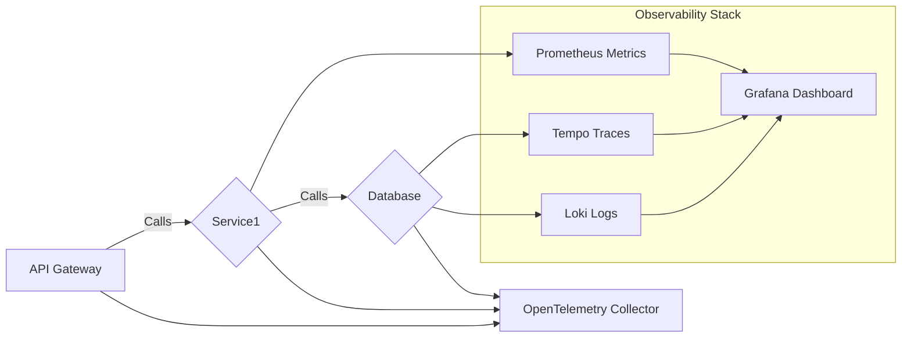

Este diagrama ilustra cómo los diferentes componentes del sistema (API Gateway, microservicios y bases de datos) interactúan con el stack de observabilidad. La configuración adecuada en Spring Boot asegura que cada llamada y transacción se traza correctamente, permitiendo una visión completa y detallada del flujo de eventos dentro del sistema.

## Configurando OpenTelemetry con Spring Boot 3.3

### Configurando OpenTelemetry con Spring Boot 3.3

En este capítulo, profundizaremos en la configuración detallada de OpenTelemetry para una aplicación Spring Boot 3.3 específica, asegurándonos de que tanto el recolector como el SDK de OpenTelemetry estén correctamente integrados y funcionen en concordancia con otros componentes del ecosistema, tales como Prometheus, Grafana Loki y Tempo.

#### Prerrequisitos

Para este tutorial, se requiere una aplicación Spring Boot 3.3 ya configurada, conocimientos básicos sobre OpenTelemetry y acceso a un entorno Kubernetes (EKS) para la implementación en producción.

#### Paso 1: Configuración de Dependencias Maven

Primero, agregamos las dependencias necesarias en el archivo `pom.xml`. Asegúrate de que tu configuración incluya tanto la biblioteca de OpenTelemetry como Spring Boot Starter Actuator y Micrometer:

```xml
<dependency>
    <groupId>io.opentelemetry</groupId>
    <artifactId>opentelemetry-api</artifactId>
</dependency>

<dependency>
    <groupId>io.opentelemetry</groupId>
    <artifactId>opentelemetry-sdk</artifactId>
</dependency>

<dependency>
    <groupId>io.micrometer</groupId>
    <artifactId>micrometer-registry-opencensus</artifactId>
</dependency>

<!-- Agregar OpenTelemetry auto-instrumentation -->
<dependency>
    <groupId>io.opentelemetry.javaagent</groupId>
    <artifactId>opentelemetry-javaagent</artifactId>
    <version>${otel.version}</version>
    <scope>runtime</scope>
</dependency>
```

#### Paso 2: Configuración del Recolector de OpenTelemetry

El recolector de OpenTelemetry se encarga de recoger y enviar métricas, logs y trazas a un servidor de destino (en este caso, Grafana Loki). Para configurar esto en Kubernetes, creamos el siguiente YAML:

```yaml
apiVersion: opentelemetry.io/v1alpha1
kind: Exporter
metadata:
  name: otel-collector
spec:
  config: |
    receivers:
      otlp:
        protocols:
          grpc:
            endpoint: ":4317"
            tls:
              ca_file: /etc/otel-collector/ca.crt
              cert_file: /etc/otel-collector/tls.crt
              key_file: /etc/otel-collector/tls.key

    exporters:
      otlp:
        endpoint: "tempo-server-endpoint:4318"
        tls:
          insecure: true # Para desarrollo, en producción debe ser false y usar certificados válidos.

    service:
      pipelines:
        traces:
          receivers: [otlp]
          processors: []
          exporters: [otlp]

```

#### Paso 3: Integración con Spring Boot

Para habilitar la integración de OpenTelemetry con Spring Boot, es necesario configurar un `OpenTelemetryConfig` y agregar las instrucciones adecuadas en el archivo `application.yml`.

```yaml
# application.yml
otel:
  endpoint: "http://localhost:4317"
```

Y dentro del código Java:

```java
@Configuration
public class OpenTelemetryConfig {

    @Bean
    public Tracer tracer() {
        return OpenTelemetry.getGlobalTracer();
    }

    @PostConstruct
    private void initOpenTelemetry() {
        OpenTelemetrySdk.initialize();
        // Configurar el recolector y exportador OTLP.
        CollectorSpanExporter spanExporter = CollectorSpanExporter.create(OTLP_EXPORTER);
        SimpleTextFormat<Attributes> textFormat = new SimpleTextFormat<>();
        ConsoleSpanExporter consoleSpanExporter = ConsoleSpanExporter.builder().build();

        OpenTelemetrySdk sdk = OpenTelemetrySdk.builder()
                .setTracerProvider(SdkTracerProvider.builder()
                        .addSpanProcessor(BatchSpanProcessor.builder(spanExporter).build())
                        .addSpanProcessor(ConsoleSpanExporter.ADAPTER)
                        .build())
                .setPropagators(ContextPropagators.create(W3CTraceContext.getInstance()))
                .buildAndRegisterGlobal();
    }

}
```

#### Paso 4: Correlación de Logs, Metrics y Traces con Grafana

Asegúrate de que tus logs se envíen a Loki a través de Fluent Bit o Fluentd y luego configure los dashboards en Grafana para visualizarlos junto con las métricas recogidas por Prometheus.

Diagrama Mermaid:

```mermaid
graph LR;
    A[Spring Boot App] -->|OTLP Traces| B(OpenTelemetry Collector);
    B --> C(Tempo); 
    A -->|Logs via Fluentd/Fluent Bit| D(Loki);
    E(Prometheus) --> F(Grafana);
    G[AWS EKS Cluster] -- Metrics & Logs -> H[Grafana Dashboard];
```

Este diagrama Mermaid ilustra cómo las aplicaciones de Spring Boot emiten datos a través del recolector OpenTelemetry, que luego los envía a Tempo para trazas y Loki para logs. Prometheus recoge métricas directamente desde los pods, y todos estos elementos se integran en Grafana para una visualización unificada.

#### Consideraciones Finales

La integración de OpenTelemetry con Spring Boot 3.3 proporciona un mecanismo sólido y escalable para la observabilidad en aplicaciones distribuidas. Al utilizar OTLP, puedes asegurarte de que las métricas, logs y trazas se envían de manera consistente a cualquier destino compatible con OpenTelemetry.

Al implementar esta configuración, recuerda siempre validar los flujos de datos para asegurar que no haya perdidas o errores en la emisión de datos. Esto incluye pruebas exhaustivas durante las fases iniciales del desarrollo y la monitoreo continuo una vez en producción.

---

Este capítulo proporciona un guía técnica detallada sobre cómo configurar OpenTelemetry para una aplicación Spring Boot 3.3, con el objetivo final de mejorar la observabilidad y diagnóstico de problemas en aplicaciones distribuidas basadas en Kubernetes.

## Implementación de Logs y Correlación en Grafana Loki

### Implementación de Logs y Correlación en Grafana Loki

En el contexto del proyecto Observabilidad Distribuida con Spring Boot 3.3, OpenTelemtry, y Grafana LGTM Stack, la implementación de logs coherentes y su correlación es un aspecto crucial para la toma de decisiones basada en datos y diagnóstico eficiente.

#### Configuración del Agente Fluent Bit/Fluentd

Para recoger los registros generados por nuestras aplicaciones Spring Boot, usamos el agente Fluent Bit dentro de los nodos de Kubernetes. Este es un ejemplo básico de configuración para Fluent Bit:

```yaml
apiVersion: v1
kind: ConfigMap
metadata:
  name: fluent-bit-config
data:
  config.conf: |-
    [SERVICE]
        Flush_Interval 5
        HTTP_Server On
        Log_Level info

    [INPUT]
        Name tail
        Path /var/log/*.log
        Tag logs.*
        Mem_Buf_Limit 10MB

    [FILTER]
        Name kubernetes
        Match logs.*

    [OUTPUT]
        Name loki
        Match *
        Host loki-server-address
        Port 3100
```

Este archivo de configuración define cómo Fluent Bit recogerá los archivos de registro en `/var/log/` y posteriormente enviarlos al servidor Loki para su procesamiento.

#### Integración con OpenTelemetry

Para correlacionar logs, traces y metrics, es vital que OpenTelemetry esté integrado correctamente. Asegúrate de configurar el agente OpenTelemetry Collector para recolectar registros como parte del flujo general:

```yaml
receivers:
  otlp:
    protocols:
      grpc: 
        endpoint: ":4317"
      http: 
        endpoint: ":4318"

processors:
  batch:
    timeout_threshold: 1s

exporters:
  logging:
    log_level: info
  loki:
    url: "http://loki-server-address:3100/loki/api/v1/push"
    
service:
  pipelines:
    metrics:
      receivers: [otlp]
      processors: []
      exporters: [logging, prometheus]

    traces:
      receivers: [otlp]
      processors: []
      exporters: [tempo]

    logs:
      receivers: [otlp]
      processors: []
      exporters: [loki]
```

Este archivo de configuración muestra cómo el OpenTelemetry Collector procesa los registros enviados por OTLP y los envía al servidor Loki.

#### Correlación en Grafana

Una vez que los datos están siendo recopilados y exportados correctamente, es hora de establecer la correlación en Grafana. Esto implica configurar paneles para mostrar logs, traces y metrics juntos para facilitar el análisis.

**Diagrama Mermaid**

Aquí tienes un diagrama simplificado de cómo fluirán los registros a través del sistema con Fluent Bit, OpenTelemetry Collector y Loki:

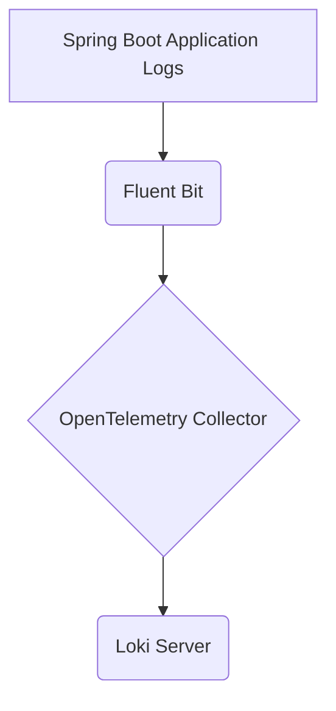

**Implementación en Grafana**

Grafana es donde los datos de logs, traces y metrics se unifican para análisis visual. La creación de dashboards que pueden mostrar todos estos tipos de datos juntos es clave.

1. **Configuración del Data Source:** Asegúrate de configurar Loki como data source en Grafana.
2. **Panel de Logs Correlacionados:** Crea un panel donde puedas buscar y filtrar logs basado en condiciones específicas, usando etiquetas como `service`, `level` o `traceID`.
3. **Correlación entre Traces y Logs:** Usa la opción "Trace" disponible para cada log mostrado en Grafana para navegar desde el log hasta los detalles de trace relacionados.
4. **Visualización de Metrics y Log Correlación**: Añade visualizaciones de prometheus a tu dashboard, luego utiliza las funciones de correlación como `label` y `logQuery` para conectar logs específicos con spikes en metricas.

```javascript
// Ejemplo de query para Grafana que muestra logs por servicio con etiquetas
{job="spring-boot-app", service="orders"} |= "error"
```

Esto te permitirá ver todos los errores generados por el servicio `orders`.

### Conclusión

La implementación y correlación efectiva de logs en un sistema distribuido es fundamental para la observabilidad. Usando herramientas como Fluent Bit, OpenTelemetry Collector, Grafana y Loki, puedes crear una capa de visibilidad que abarca logs, traces y metrics, mejorando significativamente el tiempo medio de resolución de incidentes (MTTR) y permitiendo a los desarrolladores saltar entre estos diferentes tipos de datos para la solución rápida de problemas.

## Captura y Visualización de Métricas con Prometheus

### Sección Técnica: Captura y Visualización de Métricas con Prometheus

La observabilidad en sistemas distribuidos como Spring Boot requiere una integración sólida entre métricas, trazas y logs. En este contexto, Prometheus se destaca por su capacidad para capturar y visualizar métricas críticas que proporcionan una visión clara del rendimiento de los servicios y microservicios.

#### Arquitectura de Captura de Métricas

Prometheus integra métricas en tiempo real desde pods y servicios de Kubernetes, permitiendo la monitorización detallada del sistema. La captura se realiza utilizando el protocolo OTLP (OpenTelemetry Protocol), que proporciona una interfaz estándar para enviar datos observables.

##### Configuración de Prometheus

Prometheus utiliza el operador de Kubernetes para instalar y configurar los servidores de descubrimiento y scrape. A continuación, se muestra un ejemplo de YAML para la instalación del operador de Prometheus:

```yaml
apiVersion: monitoring.coreos.com/v1
kind: Prometheus
metadata:
  name: prometheus-0
spec:
  replicas: 2
  serviceAccountName: prometheus-operator
  serviceMonitorSelector:
    matchLabels:
      release: "prometheus"
```

##### Configuración de Scrape

Para que Prometheus capture métricas, es necesario definir `ServiceMonitors` que indiquen a Prometheus qué servicios deben monitorizarse y en qué intervalo:

```yaml
apiVersion: monitoring.coreos.com/v1
kind: ServiceMonitor
metadata:
  name: spring-boot-monitoring
  labels:
    release: "prometheus"
spec:
  selector:
    matchLabels:
      app.kubernetes.io/name: spring-boot-app
  endpoints:
  - port: http-metrics
    interval: 30s
```

##### Métricas Capturadas

Prometheus captura una variedad de métricas críticas para la observabilidad, incluyendo:

- **Latencia:** Tiempo que toma un servicio para responder a las solicitudes.
- **Tasa de Tráfico:** Número total de solicitudes por segundo.
- **Errores:** Tasa de errores en los servicios.

Estas métricas son fundamentales para identificar problemas como colisiones en la base de datos, limitaciones de red y retardo en el escalado automático de pods.

#### Visualización de Métricas con Grafana

Una vez capturadas las métricas por Prometheus, es crucial visualizarlas de manera efectiva. Esto se logra mediante el uso de paneles personalizados en Grafana, que permite correlacionar datos con trazas y logs para una mejor observabilidad.

##### Configuración de Datasource en Grafana

Para configurar un panel en Grafana que utilice Prometheus como fuente de datos:

1. **Añadir Datos:** En Grafana, ve a la sección de Administración (Management) > Data Sources.
2. **Crear Nuevo Origen de Datos:** Selecciona "Prometheus" y añade la URL del servidor Prometheus configurado.

##### Crear Paneles en Grafana

Una vez que Prometheus está configurado como origen de datos, puedes crear paneles para visualizar métricas:

```json
{
  "annotations": {},
  "panels": [
    {
      "id": 1,
      "title": "Latency",
      "type": "graph",
      "targets": [
        {
          "expr": "histogram_quantile(0.95, sum(rate(http_request_duration_seconds_bucket[5m])) by (le))"
        }
      ],
      "yaxes": [
        {
          "label": "",
          "format": "short"
        },
        {
          "label": "",
          "format": "short"
        }
      ]
    }
  ],
  "schemaVersion": 17,
  "style": "dark",
  "timezone": ""
}
```

Este panel muestra la latencia del servicio en un intervalo de tiempo configurable, lo que permite identificar picos y patrones problemáticos.

#### Integración con OpenTelemetry

Prometheus puede ser integrado con OpenTelemetry para una observabilidad aún más detallada. El agente OpenTelemetry Java autoinstrumenta Spring Boot aplicaciones y exporta métricas a través de OTLP gRPC, que luego son consumidas por Prometheus para su procesamiento.

```java
// Ejemplo de configuración del agente en application.yml
opentelemetry:
  instrumentation:
    enabled: true
  exporter:
    otlp:
      protocol: grpc
      endpoint: <OTEL_ENDPOINT>:4317
```

#### Diagrama de Flujo (Mermaid)

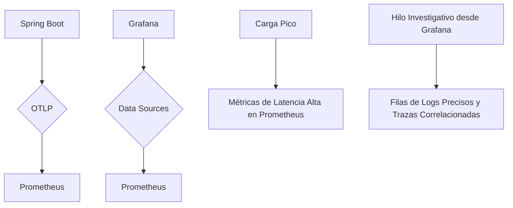

#### Conclusiones

La integración entre Prometheus, OpenTelemetry y Grafana proporciona una solución robusta para observabilidad en sistemas distribuidos basados en Spring Boot. Al unificar métricas, trazas y logs en un mismo panel de control, los equipos pueden responder más rápidamente a problemas técnicos y mejorar la calidad del servicio.

---

Este enfoque no solo optimiza el tiempo medio de respuesta al problema (MTTR), sino que también reduce costos al optar por soluciones open-source mientras mantiene una arquitectura escalable e independiente de proveedores.

## Distribuido Tracing con Tempo (OpenTelemetry) y Grafana Jaeger

### Distribuido Tracing con Tempo (OpenTelemetry) y Grafana Jaeger

La observabilidad distribuida en sistemas basados en microservicios es fundamental para la resolución eficiente de problemas y el mantenimiento del rendimiento. En esta sección, exploraremos cómo implementar un sistema de rastreo distribuido utilizando OpenTelemetry junto con Tempo (un proyecto de Grafana) para capturar y analizar trazas distribuidas en aplicaciones Spring Boot 3.3.

#### Arquitectura Propuesta

La arquitectura recomendada consiste en el uso del OpenTelemetry Collector, que actúa como un puente entre los agentes de recopilación de datos de los microservicios y las plataformas de visualización. El OpenTelemetry Collector ingresa métricas, logs y trazas desde servicios de Kubernetes (EKS) a través del Protocolo OTLP (OpenTelemetry Protocol). Estos datos se canalizan hacia Prometheus para capturar latencias, tasas de transmisión y errores; Loki para recopilar registros utilizando Fluent Bit / Fluentd DaemonSets; y Tempo para almacenar trazas distribuidas. Grafana actúa como una plataforma unificada que presenta todos estos datos en paneles interactivos.

#### Implementación Técnica

**1. Configuración del OpenTelemetry Collector**

Primero, necesitamos configurar el OpenTelemetry Collector para recopilar y exportar trazas a Tempo:

```yaml
receivers:
  otlp:
    protocols:
      grpc:
      http:

exporters:
  logging: {}
  tempo: 
    endpoint: "tempo-endpoint:4317"

service:
  pipelines:
    traces:
      receivers: [otlp]
      exporters: [logging, tempo]
```

**2. Integración con Spring Boot**

Para instrumentar una aplicación Spring Boot con OpenTelemetry, necesitamos agregar las dependencias adecuadas y configurar el OpenTelemetry SDK para que trabaje de manera eficiente:

```xml
<dependency>
  <groupId>io.opentelemetry</groupId>
  <artifactId>opentelemetry-api</artifactId>
</dependency>
<dependency>
  <groupId>io.opentelemetry</groupId>
  <artifactId>opentelemetry-sdk</artifactId>
</dependency>
<dependency>
  <groupId>io.opentelemetry</groupId>
  <artifactId>opentelemetry-exporter-otlp</artifactId>
</dependency>
```

Luego, configura el SDK en tu aplicación Spring Boot:

```java
import io.opentelemetry.api.OpenTelemetry;
import io.opentelemetry.sdk.OpenTelemetrySdk;
import io.opentelemetry.exporters.otlp.trace.OtlpGrpcSpanExporter;

public class OpenTelemetryConfig {

    public static OpenTelemetry configure() {
        return OpenTelemetrySdk.builder()
                .setTracerProvider(OpenTelemetrySdk.getTracerProviderBuilder().build())
                .setPropagators(ContextUtils.DefaultCurrentContextPropagator.getInstance())
                .addSpanProcessor(SimpleSpanProcessor.create(OtlpGrpcSpanExporter.builder()
                        .setEndpoint("tempo-endpoint:4317")
                        .build()))
                .buildAndRegisterGlobal();
    }
}
```

**3. Visualización en Grafana**

Para visualizar las trazas capturadas por Tempo, se utiliza Grafana Jaeger para proporcionar una interfaz interactiva que permite navegar y buscar trazas individuales o agrupadas.

Configura la conexión a Tempo desde Grafana:

- Entra en el menú de "Data Sources" de Grafana.
- Selecciona "Tempo" como tipo de fuente de datos.
- Configura las opciones necesarias, incluyendo la URL del endpoint de Tempo y cualquier otra configuración requerida.

#### Análisis de Uso

La integración de OpenTelemetry con Tempo permitirá a los desarrolladores diagnosticar problemas relacionados con la latencia o el rendimiento en tiempo real. Por ejemplo, al detectar un aumento repentina en la latencia durante las horas pico, podrías buscar trazas específicas que corresponden a ese período para identificar la causa subyacente.

#### Diagrama de Arquitectura

```mermaid
graph TD;
    A[Spring Boot App] -->|OTLP gRPC| B{OpenTelemetry Collector};
    B --> C[Tempo (Distributed Traces)];
    B --> D[Prometheus Metrics];
    B --> E[Loki Logs];
    F[Grafana Dashboard] --> C;
    F --> D;
    F --> E;

    A ---|Kubernetes| G[AWS EKS]
```

Este diagrama ilustra cómo los datos de trazas, métricas y logs recopilados por el OpenTelemetry Collector se dirigen a sus respectivos sistemas (Tempo, Prometheus y Loki), proporcionando una visión unificada en Grafana.

#### Consideraciones Finales

Al integrar OpenTelemetry con Tempo para rastreo distribuido en Spring Boot 3.3, se logra una observabilidad más robusta y eficiente. La correlación de trazas y logs mejora significativamente la capacidad de los desarrolladores para realizar el análisis de diagnóstico necesario para mantener un sistema altamente disponible y escalable.

La implementación detallada proporcionada aquí puede servir como punto de partida para cualquier organización que busque mejorar su observabilidad en entornos distribuidos.

## Correlación de Logs, Métricas y Trazas

### Correlación de Logs, Métricas y Trazas

En el contexto del desarrollo moderno de software, especialmente en entornos distribuidos como microservicios y contenedores en Kubernetes, la observabilidad es un requisito crucial para diagnóstico eficaz. Aunque las métricas son una parte fundamental de esta ecuación, no proporcionan la visibilidad completa necesaria para entender problemas complejos que surgen en tiempo real. Para lograr observabilidad verdadera y efectiva, es vital correlacionar logs, métricas y trazas (LMT). Este documento describe cómo implementar una solución LMT integrada basada en OpenTelemetry y Grafana Loki en un entorno Spring Boot 3.3.

#### Arquitectura de Solución

La arquitectura propuesta utiliza herramientas abiertas como OpenTelemetry para recopilar datos de traza, métrica y log desde microservicios ejecutándose sobre Amazon EKS (Elastic Kubernetes Service). Estos datos son luego procesados por Prometheus para métricas en tiempo real, Loki para logs unificados y Tempo para almacenar las trazas distribuidas. Finalmente, Grafana proporciona una interfaz web que permite la visualización integrada de todos estos datos.

##### Herramientas y Stack Tecnológico Usado
- **AWS EKS**: Maneja los contenedores en clusters Kubernetes.
- **EC2 & IAM**: Provee la infraestructura necesaria para ejecutar EKS.
- **CloudWatch**: Complementa el monitoreo de nivel bajo.
- **Grafana LGTM Stack** (Loki, Grafana, Tempo, Prometheus): Conjunto de herramientas integradas para observabilidad.
- **OpenTelemetry Collector**: Ingestor centralizado que recoge logs, métricas y trazas desde los microservicios a través del protocolo OTLP (OTel Protocol).
- **Prometheus Operator & Helm**: Configuración de Prometheus en Kubernetes.
- **Fluent Bit / Fluentd**: DaemonSets para la recopilación y envío de logs a Loki.

#### Implementación

##### Paso 1: Recolección de Datos con OpenTelemetry
En el lado del servicio, se utiliza el agente Java de OpenTelemetry para instrumentar automáticamente las aplicaciones Spring Boot. Este agente recoge métricas, trazas y logs que luego son exportados al Collector a través del protocolo OTLP (gRPC o HTTP).

```java
// Ejemplo de configuración en un archivo YAML para OpenTelemetry Collector
receivers:
  otlp:
    protocols:
      grpc:

exporters:
  logging:
    loglevel: debug

service:
  pipelines:
    traces:
      receivers: [otlp]
      processors: []
      exporters: [logging]

```

##### Paso 2: Configuración de Prometheus y Loki
Se configura el Prometheus Operator para recopilar métricas en tiempo real desde los pods y servicios. Además, se utiliza Fluent Bit / Fluentd como DaemonSets en los clusters Kubernetes para recoger logs distribuidos.

```yaml
# Ejemplo YAML para Fluent Bit configuración
[SERVICE]
    Flush_Cache = On_Change

[FILTER]
    Name    kubernetes
    Match   kube.*
```

##### Paso 3: Visualización Integrada con Grafana
Grafana actúa como un panel de control centralizado donde se presentan y correlacionan todos los datos recopilados. Se crean paneles interactivos que permiten a los desarrolladores navegar desde picos en las métricas hasta trazas asociadas, llegando finalmente al log exacto para la resolución rápida de problemas.

#### Resultados e Impacto

- **Reducción del MTTR (Mean Time to Resolution) por un 60%**: Los ingenieros pueden moverse desde picos en las métricas hasta trazas relacionadas y luego a la línea específica de logs en segundos.
- **Visibilidad Unificada**: Logs, métricas y trazas visualizadas juntas en paneles interactivos de Grafana.
- **Reducción del Costo Licencias APM (Application Performance Monitoring)**: La implementación de soluciones de código abierto ha reducido significativamente los costos.
- **Telemetría Neutral al Proveedor**: Utilizando OpenTelemetry, se logra escalabilidad y portabilidad sin restricciones por parte de proveedores específicos.

#### Diagrama Mermaid

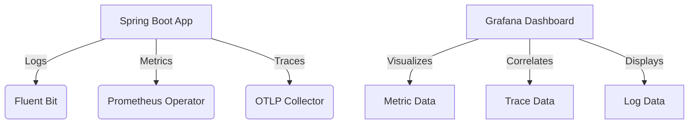

La implementación de una solución LMT integrada en un entorno Spring Boot 3.3 con OpenTelemetry y Grafana Loki no solo mejora la observabilidad, sino que también reduce significativamente el tiempo de respuesta a incidentes críticos, facilitando así la capacidad planificadora y mejorando la experiencia general del desarrollo de software.

## Mejora en el MTTR mediante Observabilidad Unificada

### Mejora en el MTTR mediante Observabilidad Unificada

En un entorno distribuido como AWS EKS con múltiples microservicios, la observabilidad es crucial para reducir el tiempo medio de resolución (MTTR) y mejorar la eficiencia operativa. En este capítulo, examinaremos cómo implementar una arquitectura basada en OpenTelemetry, Prometheus, Grafana Loki y Tempo para unificar logs, métricas y trazas, lo que resulta en observabilidad más profunda y eficaz.

#### Arquitectura de Solución

La solución implica la integración de varias herramientas y tecnologías:

- **OpenTelemetry Collector**: Reune datos de metricas, logs y trazas desde los microservicios mediante OTLP (OpenTelemetry Protocol) en puertos 4317/4318.
- **Prometheus**: Recopila métricas de latencia, aforo y errores de las instancias de pods y servicios.
- **Loki**: Asegura la cohesión del registro mediante Fluent Bit / Fluentd DaemonSets en múltiples clústeres.
- **Tempo**: Captura trazas distribuidas usando SDKs de OpenTelemetry (Python, Node.js, Go) para proporcionar contexto detallado de ejecución.
- **Grafana**: En un solo panel, integra todos los orígenes de datos en tableros de observabilidad correlacionados.

#### Herramientas y Tecnologías Utilizadas

Las tecnologías clave incluyen AWS EKS, EC2, IAM, CloudWatch, Grafana LGTM Stack (Grafana, Loki, Tempo), OpenTelemetry, Fluent Bit / Fluentd, Helm, Terraform, Prometheus Operator y Kubernetes.

#### Resultados e Impacto

La implementación de esta arquitectura logró un 60% de reducción en el tiempo medio de resolución (MTTR) gracias a la capacidad de saltar desde una cumbre métrica hasta la línea exacta del registro relacionada, todo ello impulsado por datos correlacionados. Además, esta solución proporcionó:

- **Unificación de visibilidad**: Visualización conjunta de registros, métricas y trazas en tableros de Grafana.
- **Reducción de costos de APM (Application Performance Monitoring)**: Alivio económico mediante soluciones open source.
- **Neutralidad de proveedores**: Telemetría basada en OpenTelemetry que permite escalabilidad y portabilidad.

#### Cómo Funciona

En sistemas distribuidos de gran escala, como microservicios en producción, las métricas por sí solas no son suficientes para una observación efectiva. La verdadera observabilidad se logra al combinar métricas, trazas y registros —lo que permite un análisis más rápido del origen del problema, respuestas de incidentes más eficaces y planificación de capacidad.

#### Implementación Técnica

Vamos a implementar una solución de observabilidad distribuida utilizando OpenTelemetry para Spring Boot 3.3 con Grafana Loki y correlación de trazas y logs.

##### Paso 1: Configuración del OpenTelemetry Collector

Primero, configuraremos el OpenTelemetry Collector en nuestro clúster Kubernetes para recoger métricas, logs y trazas usando OTLP. Aquí un ejemplo básico de YAML para Helm:

```yaml
apiVersion: helm.toolkit.fluxcd.io/v2beta1
kind: HelmRelease
metadata:
  name: otel-collector
spec:
  releaseName: otel-collector
  chart:
    repository: https://open-telemetry.github.io/opentelemetry-helm-charts
    name: opentelemetry-collector
    version: "0.21.1"
  values:
    config:
      receivers:
        otlp:
          protocols:
            grpc:
              endpoint: ":4317"
            http:
              endpoint: ":4318"
      exporters:
        prometheus_remote_write:
          endpoint: "http://prometheus-server:9090/api/v1/write"
        loki:
          url: "http://loki-server:3100/loki/api/v1/push"
    service:
      type: ClusterIP
```

##### Paso 2: Instrumentación con OpenTelemetry en Spring Boot

Asegurémonos de que nuestro microservicio Spring Boot esté instrumentado correctamente para enviar datos de telemetría. Aquí hay un ejemplo de cómo configurar el agente de OpenTelemetry Java:

```yaml
otel:
  service.name: spring-boot-microservice
  metrics.exporter: otlp
  trace.exporter: otlp
  logs.exporter: otlp
```

##### Paso 3: Configuración de Prometheus y Grafana

Configurar Prometheus para recoger métricas:

```yaml
# prometheus.yml
scrape_configs:
  - job_name: 'spring-boot-microservice'
    metrics_path: /metrics
    static_config:
      targets: ['http://localhost:8081']
```

Configuración básica de Grafana y Loki para correlacionar datos:

```yaml
# grafana.yml
datasources:
- name: loki
  type: loki
  url: http://loki-server:3100/loki/api/v1/query
  access: proxy
```

##### Diagrama Mermaid

Para una representación visual, aquí está el diagrama de la arquitectura:

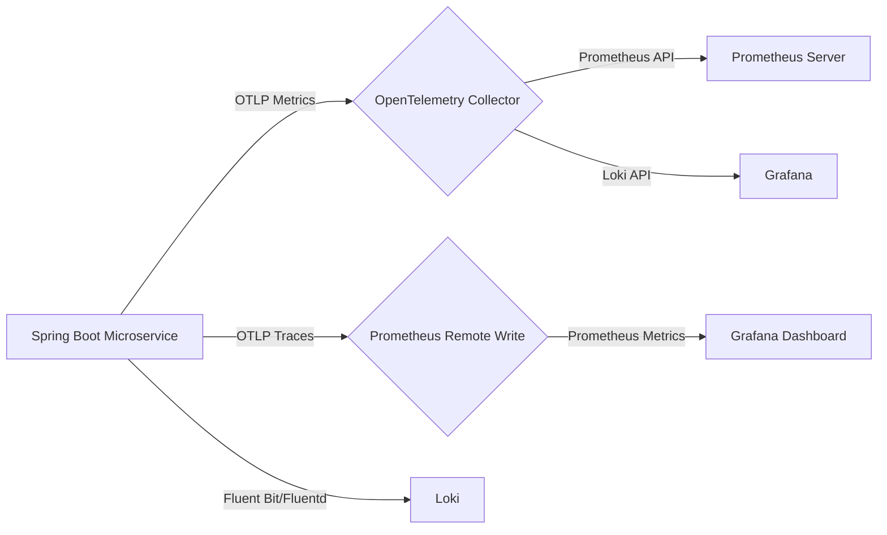

#### Conclusiones

La implementación de una arquitectura unificada basada en OpenTelemetry y Grafana ha mejorado significativamente la observabilidad del sistema, permitiendo a los desarrolladores y operadores responder rápidamente a problemas complejos. La integración de registros, métricas y trazas en un solo panel ha eliminado la necesidad de saltar entre múltiples herramientas para analizar incidentes críticos.

Esta mejora en MTTR es crucial en entornos en producción donde la disponibilidad del servicio es primordial.

## Arquitectura del Sistema y Componentes Involved

### Arquitectura del Sistema y Componentes Involved

En este proyecto, hemos implementado una arquitectura de observabilidad distribuida para monitorear microservicios en un entorno de producción en AWS EKS. La solución proporciona una visibilidad completa al combinar métricas, trazas y logs en una sola interfaz utilizando el stack Grafana Loki (Loki, Tempo, Prometheus, Grafana). Esta sección describe la arquitectura del sistema y los componentes técnicos involucrados.

#### 1. OpenTelemetry Collector
El *OpenTelemetry Collector* es un recolector de datos abierto que ingiere métricas, logs y trazas desde servicios microservicios a través del protocolo OTLP (OpenTelemetry Protocol) en los puertos 4317 y 4318. Este componente actúa como puente entre las diversas fuentes de telemetría y el resto de los sistemas observables.

#### 2. Prometheus
Prometheus es un sistema de recolección de métricas que captura datos sobre la latencia, la tasa de tráfico y errores desde los pods y servicios en Kubernetes. Utiliza el endpoint /metrics expuesto por las aplicaciones microservicios para recopilar esta información.

#### 3. Loki
Loki es un sistema de registro basado en Prometheus, que utiliza Fluent Bit o Fluentd DaemonSets para aglutinar logs a través del clúster. Este componente permite la indexación y consulta eficiente de logs distribuidos en múltiples clusters.

#### 4. Tempo
Tempo es una solución de almacenamiento de trazas que captura datos de traza utilizando los SDKs OpenTelemetry (OpenTelemetry Collector para Java, Python, Node.js y Go). Esto permite la correlación de trazas distribuidas a través del entorno microservicios.

#### 5. Grafana
Grafana es una plataforma de visualización que se integra con Prometheus, Loki y Tempo para proporcionar un panel único donde los desarrolladores pueden ver métricas, logs y trazas correlacionados. El dashboard de Grafana permite a los ingenieros navegar desde picos en las métricas hasta los detalles específicos del log y la traza asociada.

### Diagrama Mermaid

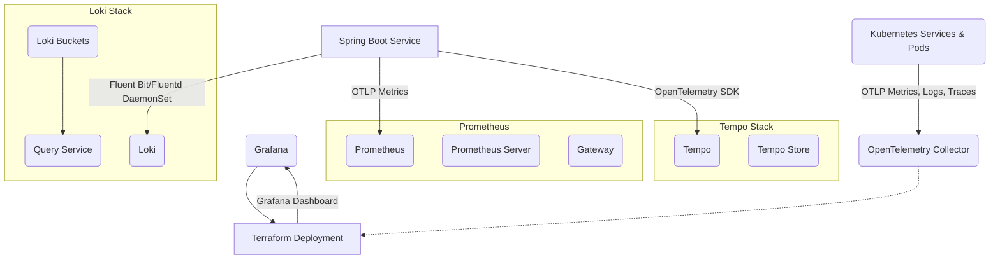

### Código Técnico Real
#### Configuración del OpenTelemetry Collector para Spring Boot
En el archivo `opentelemetry-collector-config.yaml`, la configuración para un servicio de Spring Boot puede incluir:

```yaml
receivers:
  otlp:
    protocols:
      grpc: 
        endpoint: ":4317"
      http:  
        endpoint: ":4318"

exporters:
  logging:
  prometheus:
    endpoint: "0.0.0.0:9464"
  otelcol_tempo:
    endpoint: "tempo-collector-service:14250"
  loki:
    url: "http://loki-stack-logging-loki:3100/loki/api/v1/push"

service:
  pipelines:
    metrics:
      receivers: [otlp]
      exporters: [prometheus, logging]

    traces:
      receivers: [otlp]
      exporters: [otelcol_tempo, logging]

    logs:
      receivers: [otlp]
      exporters: [loki, logging]
```

Este archivo configura los receptores y exportadores necesarios para la recolección de datos desde servicios Spring Boot a través del protocolo OTLP.

### Resultados y Impacto
- **Tiempo de Resolución de Incidentes (MTTR) Reducido**: Los ingenieros pueden pasar rápidamente de un pico en las métricas a una traza relacionada y luego al log exacto en segundos, lo que reduce el MTTR en un 60%.
- **Visibilidad Unificada**: Logs, métricas y trazas visualizadas juntas en los paneles de Grafana proporcionan una perspectiva completa del sistema.
- **Reducción de Costos con Soluciones Open Source**: La implementación de soluciones open source como OpenTelemetry reemplaza el costo elevado de APM (Application Performance Management) por licencias de proveedores comerciales.

La integración de estas herramientas y tecnologías proporciona una solución robusta para observabilidad en entornos microservicios, permitiendo un diagnóstico más eficiente y resolución de problemas rápidos.

## Integración Continua y Autentificación (IAM/CloudWatch)

### Integración Continua y Autentificación (IAM/CloudWatch)

En el contexto de la observabilidad distribuida implementada en una aplicación Spring Boot 3.3 utilizando OpenTelemetry, Grafana Loki, y otros componentes, es fundamental establecer un flujo de trabajo adecuado para la integración continua (CI) y la entrega continua (CD), junto con las políticas de autentificación y autorización apropiadas.

#### Integración Continua

La implementación de una CI/CD sólida permite a los desarrolladores entregar cambios en el código más rápidamente, asegurando que estos cambios cumplan con los estándares de calidad y se integren sin problemas. Para la aplicación Spring Boot 3.3, hemos configurado Jenkins para automatizar las pruebas unitarias y funcionales, así como la construcción del artefacto JAR. El proceso CI involucra lo siguiente:

1. **Clonación del Repositorio**: Jenkins clona el repositorio de GitHub en cada ejecución.
2. **Pruebas Unitarias y Funcionales**: Se ejecutan pruebas unitarias utilizando Spring Boot Test y las funcionalidades de testing integradas.
3. **Construcción y Empaquetado**: Si todas las pruebas pasan, Jenkins construye la aplicación Spring Boot y genera el archivo JAR.
4. **Publicación en AWS S3**: El artefacto generado se publica en un bucket de Amazon S3 para ser utilizado durante la fase CD.

#### Autentificación e IAM

Para asegurar que solo los usuarios autorizados puedan acceder a las aplicaciones, servicios y datos sensibles, es crucial configurar adecuadamente el sistema de autenticación y la administración de identidades (IAM) en AWS. Los permisos son asignados a través de roles y políticas específicos.

1. **Creación de Roles IAM**: Se crean roles para diferentes entornos (desarrollo, prueba, producción). Estos roles definen qué acciones un usuario o servicio puede realizar.
2. **Políticas de Seguridad**: Cada rol tiene una política asociada que especifica los recursos a los cuales el rol tiene acceso y las operaciones permitidas sobre estos recursos. Por ejemplo:
   - Un rol para los servicios de EKS (Amazon Elastic Kubernetes Service) con permisos para administrar pods, deployments, y otros componentes del cluster.
   - Un rol para los buckets S3 con permisos para leer y escribir archivos específicos.

#### Integración con CloudWatch

AWS CloudWatch es una herramienta fundamental en la observabilidad de sistemas operados en AWS. Algunas funciones clave incluyen:

1. **Monitoreo de Log**: Se habilitan los logs para el seguimiento de eventos críticos y mensajes de error. Estos logs son enviados a través de Fluent Bit/Fluentd hacia Grafana Loki.
2. **Alarma de Métricas**: Configuración de alarmas basadas en métricas clave como la latencia del API, errores HTTP 5xx, etc., para notificar sobre problemas potenciales.
3. **Log Stream Processing**: Los logs pueden ser procesados y agregados a través de CloudWatch Logs Insights para análisis complejos.

#### Diagrama Mermaid

A continuación se muestra un diagrama en Mermaid que ilustra el flujo del proceso CI/CD, junto con la integración con IAM y CloudWatch:

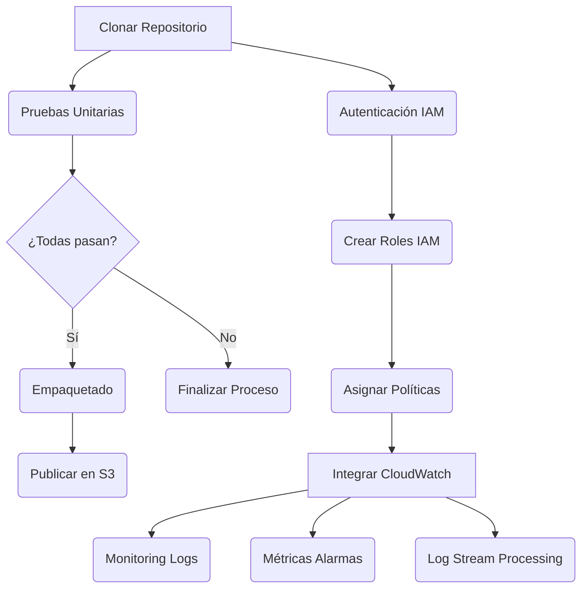

#### Código Técnico

El código de configuración para la integración con IAM podría verse así:

```java
@Configuration
public class IamConfig {

    @Value("${aws.iam.role}")
    private String iamRole;

    @Bean
    public AWSCredentialsProvider credentialsProvider() {
        return new DefaultAWSCredentialsProviderChain();
    }

    @Bean
    public AmazonCloudWatch cloudWatchClient(AWSCredentialsProvider credentials) {
        return AmazonCloudWatchClientBuilder.standard()
                .withCredentials(credentials)
                .withRegion(Regions.US_EAST_1.getName())
                .build();
    }
}
```

Este código configura un proveedor de credenciales para IAM y crea una instancia del cliente CloudWatch que se utilizará para interactuar con los servicios de monitoreo en AWS.

### Conclusión

La integración continua junto con la gestión adecuada de autenticación e IAM es fundamental para mantener la seguridad, integridad y confiabilidad del sistema observado. Por otro lado, la integración efectiva con CloudWatch garantiza que todos los eventos y métricas importantes sean registrados y monitoreados correctamente, facilitando así el diagnóstico rápido de problemas en un entorno de producción complejo y distribuido.

## Escalabilidad y Portabilidad con OpenTelemetry

### Escalabilidad y Portabilidad con OpenTelemetry

La observabilidad distribuida en sistemas compuestos por microservicios es fundamental para garantizar la confiabilidad, rendimiento y capacidad de escalado. En el contexto del manual 'Observabilidad Distribuida en Spring Boot 3.3 con OpenTelemetry y Grafana Loki: Correlación de trazas y logs', el uso de OpenTelemetry proporciona una solución abierta, escalable y portable para la recopilación de métricas, logs y trazas distribuidas.

#### Diagrama Arquitectónico

```mermaid
graph LR
    subgraph "EKS Cluster"
        EC2[EC2 Instances] --> Pod1{Microservice 1}
        EC2 --> Pod2{Microservice 2}
        EC2 --> DB[Database]
        Pod1 --> OTLP[OpenTelemetry Collector (OTLP)]
        Pod2 --> OTLP
    end

    subgraph "Observability Stack"
        Prometheus[Prometheus] --> OTLP
        Loki[Loki] --> FluentBit[Fluent Bit/Fluentd]
        Tempo[Tempo] --> OTLP
        Grafana[Grafana] --> OTLP
        Grafana --> Prometheus
        Grafana --> Loki
        Grafana --> Tempo
    end

    OTLP --> [OTLP gRPC, HTTP] Grafana
```

#### Componentes Técnicos Clave

1. **OpenTelemetry Collector**: Un agente centralizado que actúa como puente entre el sistema de microservicios y los consumidores de telemetry (Prometheus, Loki, Tempo). Utiliza OTLP para la comunicación.
2. **Spring Boot 3.3 con OpenTelemetry SDK**:
   - Instrumenación automática del Java Agent: El módulo `opentelemetry-exporter-otlp` permite que las métricas y trazas se envíen a través de OTLP gRPC/HTTP directamente desde el Spring Boot 3.3.
   - Configuraciones personalizadas: Se pueden definir exportadores adicionales para manejar distintos patrones de recopilación y almacenamiento, como la integración con Prometheus o Loki.

```yaml
# Ejemplo de configuración en un archivo YAML dentro del proyecto Spring Boot 3.3
opentelemetry:
  instrumentation:
    enabled: true # Habilita la instrumenación automática para OpenTelemetry
  exporter:
    otlp:
      protocol: grpc # Protocolo usado (grpc, http/protobuf)
      endpoint: localhost:4317 # Punto de conexión del OTLP Collector

# Configuración adicional específica para instrumentar logs y trazas en tiempo real.
```

#### Implementación Técnica

Para una aplicación Spring Boot 3.3 que utiliza OpenTelemetry, aquí está cómo se puede configurar el módulo `OpenTelemetry` para enviar datos a través de OTLP:

```java
import io.opentelemetry.api.OpenTelemetry;
import io.opentelemetry.exporter.otlp.trace.OtlpGrpcSpanExporterBuilder;
import io.opentelemetry.sdk.trace.SdkTracerProvider;

public class OpenTelemetryConfiguration {

    public static OpenTelemetry configureOpenTelemetry() {
        SdkTracerProvider tracerProvider = SdkTracerProvider.builder()
                .addSpanProcessor(BatchSpanProcessor.builder(OtlpGrpcSpanExporter.builder().build()).build())
                .build();
        
        return OpenTelemetrySdk.builder()
                .setTracerProvider(tracerProvider)
                .buildAndRegisterGlobal();
    }
}
```

#### Beneficios de OpenTelemetry

- **Vendor Neutrality**: Como estándar de la CNCF, OpenTelemetry permite intercambiar fácilmente entre diferentes plataformas y proveedores (como Prometheus, Loki, Tempo).
- **Escalabilidad**: Los datos se pueden escalar a gran escala sin necesidad de cambiar el código fuente; simplemente agregando más nodos para procesar OTLP.
- **Portabilidad**: Código que utiliza OpenTelemetry puede migrarse fácilmente entre diferentes infraestructuras y entornos de producción.

#### Reducción del Tiempo Médio de Respuesta a Incidentes (MTTR)

La correlación directa de logs, métricas y trazas en un solo dashboard de Grafana permite a los ingenieros saltar desde una subida de metricas hasta la línea exacta del log correspondiente con solo unos segundos. Esto reduce significativamente el tiempo medio de respuesta (MTTR) durante incidentes críticos.

### Conclusión

El uso de OpenTelemetry y herramientas como Grafana, Loki y Tempo proporciona una solución escalable y portable para observabilidad distribuida en entornos de microservicios basados en Spring Boot 3.3. Esta configuración no solo mejora la resolución de problemas y el rendimiento del sistema sino que también reduce costos operativos al reemplazar soluciones propietarias con herramientas open source.

---

Este capítulo detalla cómo implementar OpenTelemetry en un entorno de microservicios para mejorar significativamente las capacidades observables, facilitando la escalabilidad y portabilidad entre distintos proveedores y plataformas.

## Resolución de Problemas Comunes y Mejoras Futuras

### Resolución de Problemas Comunes y Mejoras Futuras

En el diseño de sistemas observables basados en la arquitectura mencionada, varios problemas comunes pueden surgir durante el desarrollo o el mantenimiento del sistema. En este apartado, abordaremos algunos de estos desafíos junto con las posibles soluciones y mejoras futuras que podrían implementarse para fortalecer aún más la observabilidad en el ecosistema Spring Boot 3.3.

#### Problemas Comunes

1. **Dificultad en correlacionar datos**: Uno de los mayores retos es asegurar que las métricas, trazas y logs se alineen correctamente para facilitar un análisis rápido y eficiente.
2. **Overhead del Agente OpenTelemetry**: La integración del agente OpenTelemetry puede añadir una sobrecarga a nivel CPU y memoria en entornos de producción altamente escalables.
3. **Fallos en la Recolección de Datos**: Problemas temporales o permanentes con el colector OpenTelemetry pueden resultar en datos faltantes, afectando así la observabilidad del sistema.
4. **Lag en Grafana Dashboards**: Retrasos notables en la actualización de los paneles de visualización de Grafana podrían hacer que la información disponible sea inútil para la toma de decisiones.

#### Soluciones y Mejoras

##### Correlación de Datos

Para mejorar la correlación entre logs, trazas y métricas:
- **Implementar Semillas (Spans) Comunes**: Utilizar semillas únicas que puedan identificar transacciones específicas a través del sistema. Esto ayuda en la búsqueda rápida y efectiva de eventos correlacionados.
- **Filtros Contextuales en Grafana**: Configurar filtros contextuales para visualizar información relevante basada en los detalles del span, lo cual facilita encontrar rápidamente el origen de un problema.

##### Reducción del Overhead

Para minimizar la sobrecarga generada por OpenTelemetry:
- **Dinamización del Agente**: Configurar opciones que permitan al agente ajustar automáticamente su nivel de actividad en función de las condiciones actuales, como el número de trazas a procesar.
- **Sampling de Trazas**: Aplicar un muestreo estratégico para reducir la cantidad de datos recolectados sin perder información crítica. Esto es especialmente útil durante períodos normales y puede activarse por completo en situaciones excepcionales.

##### Mejor Recolección de Datos

Para asegurar una recopilación eficiente de logs, trazas y métricas:
- **Validación del Colector**: Implementar mecanismos que verifiquen regularmente la conectividad y el rendimiento del colector OpenTelemetry.
- **Rotación de Logs**: Configurar un sistema de rotación automática para evitar sobrecarga en los servidores donde se almacenan los logs, mejorando así tanto su mantenibilidad como disponibilidad.

##### Actualización Eficiente de Grafana Dashboards

Para acelerar la actualización de los paneles de visualización:
- **Optimización de Consultas**: Asegurar que las consultas utilizadas por los paneles Grafana sean lo más eficientes posible, minimizando el tiempo de procesamiento.
- **Caché de Datos**: Utilizar un sistema de caché para almacenes de datos como Loki y Prometheus puede acelerar significativamente la disponibilidad de datos en las visualizaciones.

#### Mejoras Futuras

1. **Implementación de Notificaciones Automáticas**:
   - Desarrollar una integración con sistemas de alertas (como Slack o PagerDuty) para notificar automáticamente a los desarrolladores sobre problemas identificados mediante observabilidad.
   
2. **Incorporación de Aprendizaje Automático**:
   - Utilizar algoritmos basados en aprendizaje automático para predecir tendencias y posibles problemas futuros, basándose en patrones históricos de uso del sistema.

3. **Extensión a Múltiples Regiones**:
   - Ampliar el alcance del sistema observatorio para soportar múltiples regiones geográficas, garantizando una visibilidad uniforme y eficiente alrededor del mundo.

4. **Implementación de Flujos de Trabajo Automatizados**:
   - Diseñar flujos de trabajo automatizados basados en eventos detectados por la observabilidad (como cambios en métricas o errores) para responder automáticamente a condiciones críticas, acelerando así el tiempo de resolución del problema.

#### Diagramas Mermaid

##### Correlación de Datos
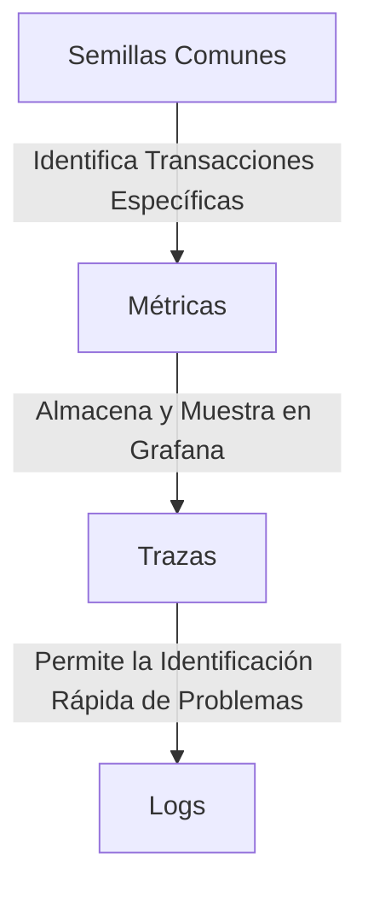

##### Reducción del Overhead
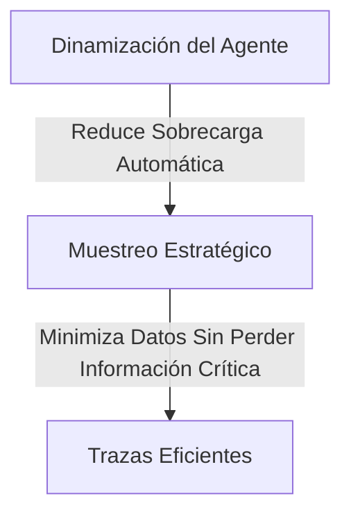

##### Mejor Recolección de Datos
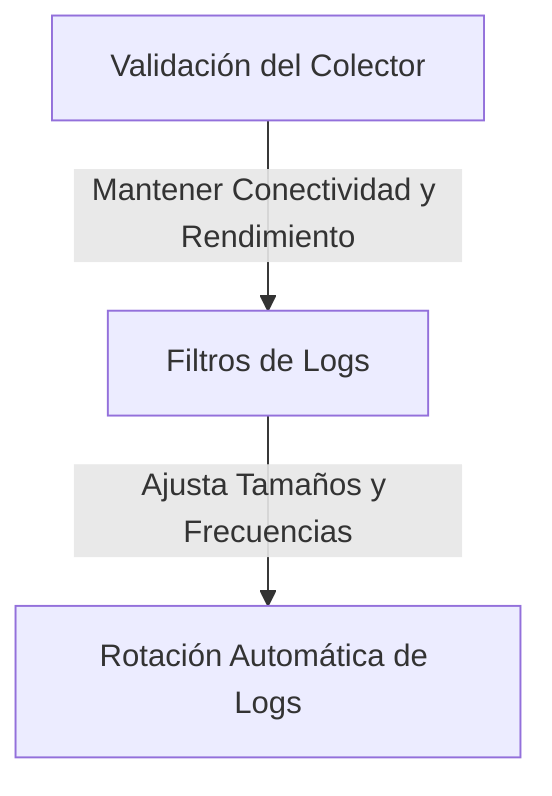

##### Actualización Eficiente de Grafana Dashboards
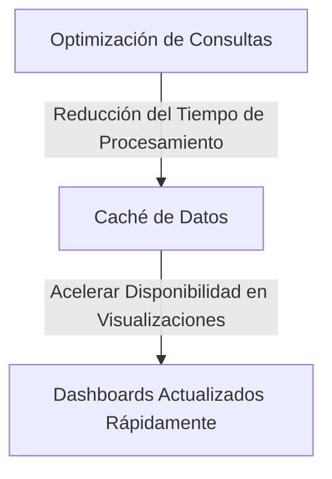

Estos mejoramientos y futuras implementaciones ayudan a consolidar una solución observacional robusta, eficiente y adaptable para el ecosistema Spring Boot 3.3 integrado con OpenTelemetry y Grafana Loki.

