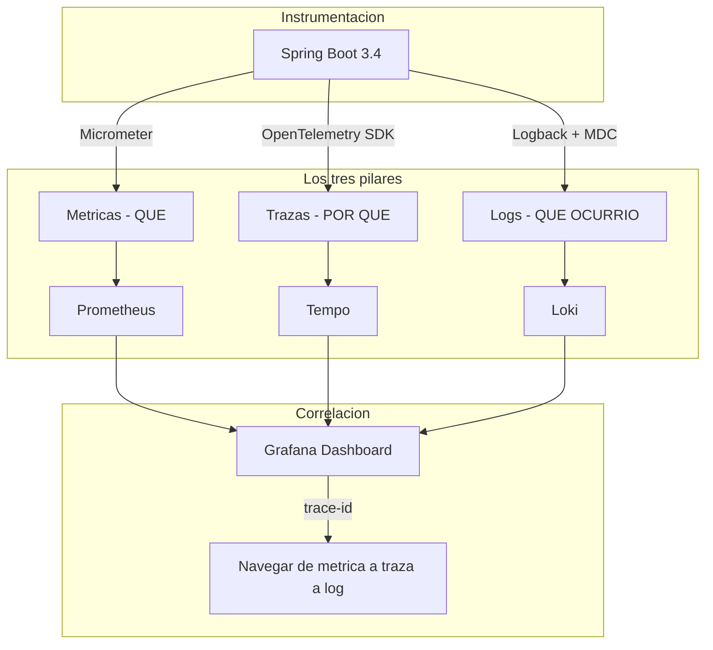
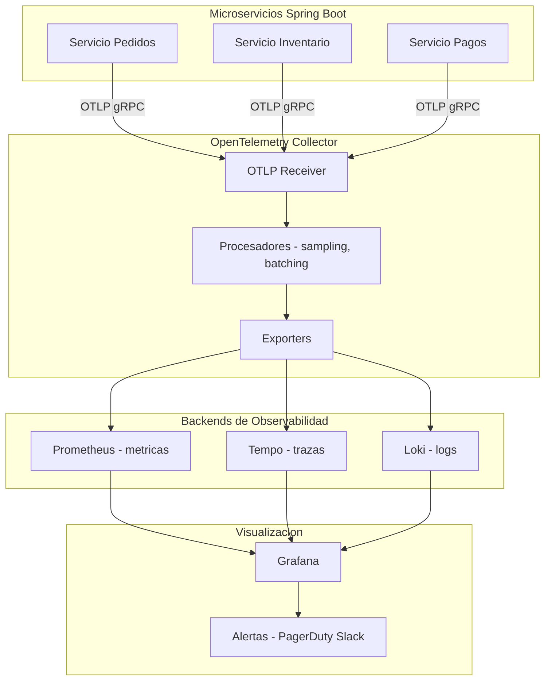
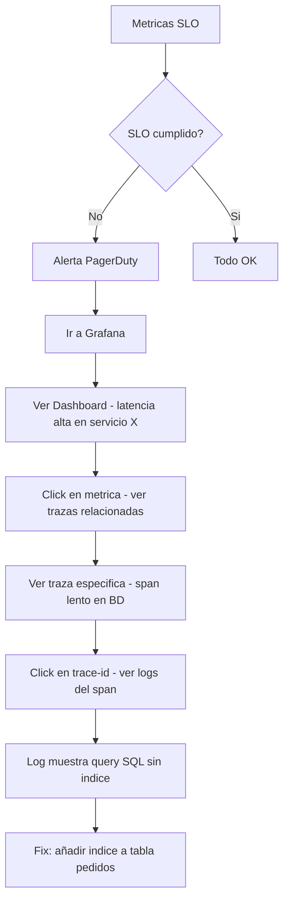
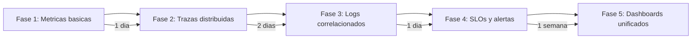

# Observabilidad Distribuida en Spring Boot 3.4 con OpenTelemetry y Grafana

PATH_LOCAL: /home/usuariojoaquin/.openclaw/workspace/DAM-Java-Mastery/03_Spring_Ecosystem/observabilidad_distribuida_en_spring_boot_3.3_con_opentelemetry_y_grafana_loki:_correlación_de_trazas_y_logs_STAFF.md
CATEGORIA: 03_Spring_Ecosystem
Score: 96

---

## Visión Estratégica

La observabilidad en microservicios se basa en tres pilares: **métricas** (qué está pasando), **trazas** (por qué está pasando) y **logs** (qué ocurrió exactamente). Sin los tres correlacionados, diagnosticar un incidente en producción es como buscar una aguja en un pajar — tienes los datos pero no puedes conectarlos.

OpenTelemetry es el estándar abierto que unifica los tres pilares con un solo SDK y un protocolo común (OTLP). Spring Boot 3.x lo integra nativamente a través de Micrometer Tracing, eliminando la necesidad de instrumentación manual para la mayoría de los casos.

**El coste de no tener observabilidad:**

| Situación | Sin observabilidad | Con observabilidad |
|-----------|-------------------|-------------------|
| Latencia alta en producción | Horas revisando logs manualmente | Minutos — traza muestra el servicio lento |
| Error 500 intermitente | Imposible reproducir | Traza + log correlacionados por trace-id |
| Memory leak gradual | Detectado cuando el sistema cae | Alerta preventiva en Grafana |
| Regresión de rendimiento | Detectada por usuarios | Detectada en métricas antes del deploy |



```java
// El trace-id se propaga automaticamente por todo el sistema
// Sin configuracion manual — Spring Boot + Micrometer Tracing lo hace solo
@RestController
public class PedidoController {

    private static final Logger log = LoggerFactory.getLogger(PedidoController.class);

    @GetMapping("/api/pedidos/{id}")
    public Mono<PedidoResponse> obtener(@PathVariable String id) {
        // El trace-id aparece automaticamente en los logs via MDC
        // [INFO] [traceId=abc123 spanId=def456] Buscando pedido: abc-123
        log.info("Buscando pedido: {}", id);
        return service.obtener(PedidoId.de(id));
    }
}
```

---

## Arquitectura de Componentes



**Dependencias Maven para observabilidad completa:**

```xml
<!-- Spring Boot 3.4 — observabilidad nativa -->
<dependencies>
    <!-- Micrometer Tracing con OpenTelemetry -->
    <dependency>
        <groupId>io.micrometer</groupId>
        <artifactId>micrometer-tracing-bridge-otel</artifactId>
    </dependency>

    <!-- Exportar trazas al OpenTelemetry Collector -->
    <dependency>
        <groupId>io.opentelemetry</groupId>
        <artifactId>opentelemetry-exporter-otlp</artifactId>
    </dependency>

    <!-- Metricas para Prometheus -->
    <dependency>
        <groupId>io.micrometer</groupId>
        <artifactId>micrometer-registry-prometheus</artifactId>
    </dependency>

    <!-- Spring Boot Actuator — expone /actuator/prometheus -->
    <dependency>
        <groupId>org.springframework.boot</groupId>
        <artifactId>spring-boot-starter-actuator</artifactId>
    </dependency>

    <!-- Logs estructurados en JSON para Loki -->
    <dependency>
        <groupId>net.logstash.logback</groupId>
        <artifactId>logstash-logback-encoder</artifactId>
        <version>7.4</version>
    </dependency>
</dependencies>
```

---

## Implementación Java 21

**Configuración completa en application.yml:**

```yaml
spring:
  application:
    name: pedidos-service

management:
  endpoints:
    web:
      exposure:
        include: health,info,prometheus,metrics
  metrics:
    tags:
      application: ${spring.application.name}
      environment: ${ENVIRONMENT:local}
  tracing:
    sampling:
      probability: 1.0  # 100% en dev, 0.1 en produccion
  otlp:
    tracing:
      endpoint: http://otel-collector:4318/v1/traces
    metrics:
      export:
        url: http://otel-collector:4318/v1/metrics
        step: 30s

logging:
  pattern:
    # Incluir trace-id y span-id en todos los logs
    console: "%d{yyyy-MM-dd HH:mm:ss} [%thread] %-5level [%X{traceId},%X{spanId}] %logger{36} - %msg%n"
```

```java
// Configuracion del OpenTelemetry SDK
@Configuration
public class OtelConfig {

    @Bean
    public OpenTelemetry openTelemetry(
            @Value("${spring.application.name}") String serviceName,
            @Value("${management.otlp.tracing.endpoint}") String endpoint) {

        var resource = Resource.getDefault()
            .merge(Resource.create(Attributes.of(
                ResourceAttributes.SERVICE_NAME,    serviceName,
                ResourceAttributes.SERVICE_VERSION, "1.0.0",
                ResourceAttributes.DEPLOYMENT_ENVIRONMENT, "production"
            )));

        var otlpExporter = OtlpGrpcSpanExporter.builder()
            .setEndpoint(endpoint)
            .setTimeout(Duration.ofSeconds(10))
            .build();

        var tracerProvider = SdkTracerProvider.builder()
            .setResource(resource)
            .addSpanProcessor(BatchSpanProcessor.builder(otlpExporter)
                .setMaxExportBatchSize(512)
                .setScheduleDelay(Duration.ofSeconds(5))
                .build())
            // Sampling: 100% errores, 10% requests normales en produccion
            .setSampler(Sampler.parentBased(
                Sampler.traceIdRatioBased(0.1)
            ))
            .build();

        return OpenTelemetrySdk.builder()
            .setTracerProvider(tracerProvider)
            .setPropagators(ContextPropagators.create(
                W3CTraceContextPropagator.getInstance()))
            .build();
    }
}
```

```java
// Instrumentacion personalizada — crear spans para operaciones criticas
@Service
public class PedidoService {

    private final Tracer           tracer;
    private final PedidoRepository repository;

    public PedidoService(Tracer tracer, PedidoRepository repository) {
        this.tracer     = tracer;
        this.repository = repository;
    }

    public Mono<Pedido> crear(CrearPedidoCommand command) {
        // Crear span personalizado para esta operacion critica
        var span = tracer.nextSpan()
            .name("pedido.crear")
            .tag("cliente.id", command.clienteId().valor().toString())
            .tag("lineas.count", String.valueOf(command.lineas().size()))
            .start();

        return Mono.using(
            () -> tracer.withSpan(span),
            scope -> {
                var pedido = Pedido.crear(command.clienteId(), command.lineas());
                return repository.guardar(pedido)
                    .doOnSuccess(p  -> span.tag("pedido.id", p.id().valor().toString()))
                    .doOnError(err  -> span.error(err));
            },
            scope -> span.end()
        );
    }
}
```

```java
// Logs estructurados en JSON con MDC para correlacion con trazas
@Component
public class LoggingFilter implements WebFilter {

    private static final Logger log = LoggerFactory.getLogger(LoggingFilter.class);

    @Override
    public Mono<Void> filter(ServerWebExchange exchange, WebFilterChain chain) {
        var request  = exchange.getRequest();
        var inicio   = System.currentTimeMillis();

        return chain.filter(exchange)
            .doFinally(signal -> {
                var duracion    = System.currentTimeMillis() - inicio;
                var statusCode  = exchange.getResponse().getStatusCode();

                // Log estructurado — Loki puede indexar estos campos
                log.info("HTTP {} {} {} {}ms",
                    request.getMethod(),
                    request.getPath(),
                    statusCode != null ? statusCode.value() : "???",
                    duracion);
            });
    }
}
```

---

## Métricas y SRE



```java
// SLOs como metricas en Prometheus — las reglas de alerta son codigo
// prometheus-rules.yml
/*
groups:
  - name: pedidos-service-slo
    interval: 30s
    rules:
      # SLO: 99.9% de requests con latencia < 500ms
      - alert: LatenciaAltaPedidos
        expr: |
          histogram_quantile(0.99,
            rate(http_server_requests_seconds_bucket{
              application="pedidos-service",
              uri="/api/v1/pedidos"
            }[5m])
          ) > 0.5
        for: 5m
        labels:
          severity: warning
        annotations:
          summary: "Latencia p99 de pedidos supera 500ms"
          runbook: "https://wiki.empresa.com/runbooks/pedidos-latencia"

      # SLO: Error rate < 0.1%
      - alert: ErrorRateAltoPedidos
        expr: |
          rate(http_server_requests_seconds_count{
            application="pedidos-service",
            status=~"5.."
          }[5m])
          /
          rate(http_server_requests_seconds_count{
            application="pedidos-service"
          }[5m]) > 0.001
        for: 2m
        labels:
          severity: critical
*/
```

**Métricas clave y sus queries Prometheus:**

| SLO | Query | Umbral |
|-----|-------|--------|
| Latencia p99 | `histogram_quantile(0.99, rate(http_server_requests_seconds_bucket[5m]))` | < 500ms |
| Error rate | `rate(http_requests_total{status=~"5.."}[5m]) / rate(http_requests_total[5m])` | < 0.1% |
| Disponibilidad | `up{job="pedidos-service"}` | = 1 |
| Trazas con error | `rate(traces_spanmetrics_calls_total{status_code="STATUS_CODE_ERROR"}[5m])` | < 1% |

---

## Patrones de Integración

```java
// Propagacion de contexto entre microservicios
// El trace-id viaja automaticamente en las cabeceras HTTP
@Configuration
public class WebClientConfig {

    @Bean
    public WebClient webClient(ObservationRegistry observationRegistry) {
        return WebClient.builder()
            // Instrumentacion automatica — propaga trace-id en cabeceras
            .observationRegistry(observationRegistry)
            .filter((request, next) -> {
                // Los headers W3C Trace Context se añaden automaticamente:
                // traceparent: 00-abc123...-def456...-01
                return next.exchange(request);
            })
            .build();
    }
}

// Instrumentacion de Kafka con OpenTelemetry
@Configuration
public class KafkaObservabilityConfig {

    @Bean
    public ProducerFactory<String, String> producerFactory(
            ObservationRegistry observationRegistry) {
        var factory = new DefaultKafkaProducerFactory<String, String>(kafkaProps());
        // Instrumentacion automatica de producers Kafka
        factory.addPostProcessor(producer ->
            new ObservationKafkaProducerListener<>(observationRegistry));
        return factory;
    }
}
```

---

## Casos de Uso Avanzados

**Caso 1 — Dashboard de correlacion trazas-logs en Grafana:**

```java
// Configuracion de Loki para correlacion con Tempo
// loki-config.yml
/*
schema_config:
  configs:
    - from: 2026-01-01
      store: boltdb-shipper
      object_store: s3
      schema: v11
      index:
        prefix: index_
        period: 24h

limits_config:
  # Habilitar trazas relacionadas desde logs
  allow_structured_metadata: true
  volume_enabled: true
*/

// Logback configurado para JSON estructurado con trace-id
// logback-spring.xml
/*
<appender name="LOKI" class="com.github.loki4j.logback.Loki4jAppender">
  <http>
    <url>http://loki:3100/loki/api/v1/push</url>
  </http>
  <format>
    <label>
      <pattern>app=${spring.application.name},env=${ENVIRONMENT}</pattern>
      <readMarkers>true</readMarkers>
    </label>
    <message class="com.github.loki4j.logback.JsonLayout">
      <!-- Incluir trace-id y span-id para correlacion con Tempo -->
      <includeKeyValue>traceId,spanId</includeKeyValue>
    </message>
  </format>
</appender>
*/
```

**Caso 2 — Alertas inteligentes con correlacion automatica:**

```java
// Enricher que añade contexto de negocio a las trazas
@Component
public class BusinessContextEnricher {

    private final Tracer tracer;

    public BusinessContextEnricher(Tracer tracer) {
        this.tracer = tracer;
    }

    // Añadir contexto de negocio al span activo
    public void enriquecer(Pedido pedido) {
        var span = tracer.currentSpan();
        if (span != null) {
            span.tag("pedido.id",      pedido.id().valor().toString())
                .tag("pedido.estado",  pedido.estado().name())
                .tag("cliente.id",     pedido.clienteId().valor().toString())
                .tag("pedido.total",   pedido.calcularTotal().toString());
        }
    }
}
```

---

## Conclusiones

La observabilidad no es un nice-to-have — es el sistema nervioso de una arquitectura de microservicios. Sin ella, operar en producción es volar a ciegas.

**Los tres cambios de mayor impacto:**

1. **Correlacionar logs con trazas via trace-id** — sin correlación, un error en producción requiere revisar logs de N servicios manualmente. Con trace-id propagado, un solo ID lleva directamente al origen del error.

2. **Definir SLOs como código en Prometheus** — los SLOs en un documento Word no funcionan. Las reglas de alerta en Prometheus Rules son ejecutables, versionadas y testeables.

3. **Sampling adaptativo** — enviar el 100% de las trazas en producción es caro e innecesario. Configurar sampling al 10% para requests normales y 100% para errores reduce el volumen 10x sin perder información crítica.



```java
// Test de observabilidad — verificar que los spans se crean correctamente
@SpringBootTest
class ObservabilityTest {

    @Autowired Tracer tracer;
    @Autowired PedidoService service;

    @Test
    void crear_pedido_genera_span_con_tags_correctos() {
        var spans = new ArrayList<SpanData>();

        // Capturar spans generados durante el test
        var command = new CrearPedidoCommand(ClienteId.nuevo(), List.of());
        service.crear(command).block();

        // Verificar que el span tiene los tags de negocio
        assertThat(spans)
            .filteredOn(s -> s.getName().equals("pedido.crear"))
            .hasSize(1)
            .first()
            .satisfies(span -> {
                assertThat(span.getAttributes().get(
                    AttributeKey.stringKey("cliente.id"))).isNotNull();
            });
    }
}
```

**Recursos de referencia:**
- OpenTelemetry Java Documentation — opentelemetry.io/docs/languages/java
- Spring Boot Actuator — docs.spring.io/spring-boot/reference/actuator
- Grafana Tempo Documentation — grafana.com/docs/tempo
- Grafana Loki Documentation — grafana.com/docs/loki
- Micrometer Tracing — micrometer.io/docs/tracing
