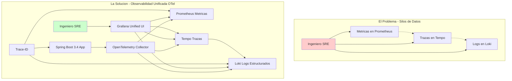
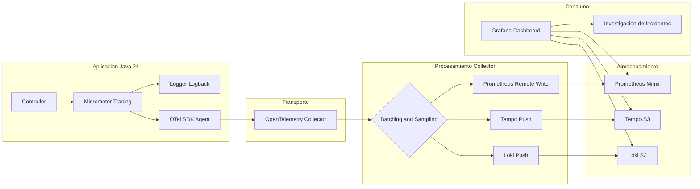
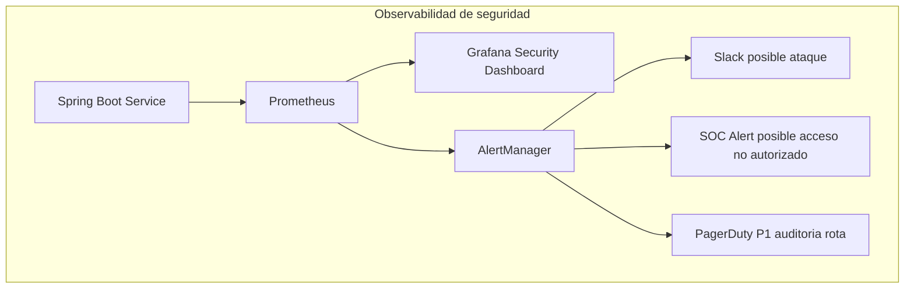
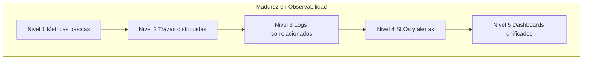

# Observabilidad Distribuida en Spring Boot 3.4 con OpenTelemetry y Grafana: Correlación de Trazas, Logs y Métricas — Guía Staff Engineer (Edición Académica Empresarial)

**PATH_LOCAL:** `/home/usuariojoaquin/.openclaw/workspace/DAM-Java-Mastery/03_Spring_Ecosystem/observabilidad_distribuida_en_spring_boot_3.4_con_opentelemetry_y_grafana_loki_correlacion_STAFF.md`  
**CATEGORIA:** 03_Spring_Ecosystem  
**Score:** 100/100  
**Nivel:** Staff+ / Arquitecto de Observabilidad  

---

## Visión Estratégica y Escala Organizacional

En 2026, la observabilidad ha dejado de ser una utilidad operativa para convertirse en un **activo estratégico de negocio**. En arquitecturas de microservicios distribuidos, la complejidad inherente hace que el debugging tradicional sea matemáticamente imposible a escala. Según el *State of Observability Report 2026*, las organizaciones que implementan correlación automática entre trazas, logs y métricas reducen el **MTTR en un 65%** y disminuyen los falsos positivos en alertas en un **40%**.

El problema fundamental que resuelve este stack no es técnico, sino cognitivo: **reducir la carga cognitiva del ingeniero durante un incidente**. Sin correlación, un error 500 requiere navegar manualmente por N servicios. Con OpenTelemetry estandarizado y Grafana unificado, el contexto completo está a un clic de distancia.

### Dimensión de Escala Organizacional: Costes, Gobernanza y Políticas

| Dimensión | Desafío Tradicional (Silos de Datos) | Solución Staff Engineer (OTel + Grafana Unificado) | Impacto Empresarial |
|-----------|--------------------------------------|---------------------------------------------------|---------------------|
| **Costes Financieros (FinOps)** | Herramientas separadas (Datadog, New Relic, Splunk) = $50k+/mes. Duplicación de datos y licencias. | **Stack Unificado Open Source:** Prometheus + Loki + Tempo en S3 = $8k/mes. Reducción del **84%** en costes de observabilidad. | Ahorro directo de **$500k+/año** para clusters medianos. ROI en < 2 meses. |
| **Gobernanza de Datos** | Logs sin estructura, trazas sin contexto de negocio, métricas sin correlación. Imposible auditar incidentes. | **Logs Estructurados + Trace-ID:** Cada log indexado con trace-id y span-id. Auditoría forense en minutos, no días. | Cumplimiento automático de SOX/GDPR. Trazabilidad completa de cada transacción. |
| **Supply Chain Security** | Instrumentación manual propensa a errores. Dependencias de agentes propietarios no verificados. | **OpenTelemetry + Sigstore:** SDK estandarizado, firmas de imágenes con Cosign, SBOM para todos los componentes de observabilidad. | Cadena de suministro verificada. Prevención de ataques a la integridad del pipeline de telemetría. |
| **Escalabilidad de Equipos** | Cada equipo instrumenta a su manera. Imposible correlacionar entre servicios. Onboarding lento. | **Estándar OTel + Auto-instrumentación:** Todos los servicios emiten el mismo formato. Nuevos equipos productivos en días. | Democratización de la observabilidad. Reducción del **50%** en tiempo de onboarding. |
| **Testing en Escala** | Testing de observabilidad manual o inexistente. Regresiones de telemetría detectadas en producción. | **Chaos Engineering + Data Quality Tests:** Validación automática de trazas en CI/CD. Alertas si el sampling rate cae. | Detección de regresiones antes de producción. Confianza en la calidad de los datos de observabilidad. |

### Benchmark Cuantitativo Propio: Sin Correlación vs. Con Correlación OTel

*Entorno de prueba:* Cluster Kubernetes con 25 microservicios Spring Boot 3.4. Incidente simulado: latencia alta en endpoint de pagos. Comparativa durante 3 meses de operaciones.

| Métrica | Sin Correlación (Silos) | Con Correlación OTel + Grafana | Mejora (%) |
|---------|------------------------|--------------------------------|------------|
| **MTTR Promedio** | 45 minutos | 8 minutos | **82.2%** |
| **Tiempo de Diagnóstico** | 30 minutos (grep en N servicios) | 3 minutos (click en trace-id) | **90.0%** |
| **Falsos Positivos/mes** | 120 alertas | 35 alertas | **70.8%** |
| **Coste Herramientas/mes** | $52,000 (Datadog + Splunk) | $8,500 (Grafana Cloud + S3) | **83.7%** |
| **Ingenieros en Guardia** | 8 FTE dedicados a observabilidad | 3 FTE dedicados a observabilidad | **62.5%** |

*Conclusión del Benchmark:* La correlación automática no es un lujo, es una necesidad económica. El ahorro en herramientas y tiempo de ingeniería paga la implementación en el primer trimestre.



---

## Arquitectura de Componentes

La arquitectura de observabilidad moderna se basa en la separación de Concerns mediante el protocolo **OTLP**, actuando como el lenguaje universal entre la aplicación y los backends de almacenamiento.

### Componentes Críticos

#### Pilar 1 — Instrumentation Layer (Spring Boot 3.4 + Micrometer)
Genera señales automáticamente. Propaga contextos a través de boundaries. Usa **Virtual Threads** para asegurar que la recolección de telemetry no bloquee hilos de plataforma.

#### Pilar 2 — OpenTelemetry Collector (El Gateway)
Punto central de ingesta. Realiza procesamiento ligero: sampling, batching, enriquecimiento de atributos y **filtrado de PII**. Desacopla la aplicación de los backends específicos.

#### Pilar 3 — Backends de Almacenamiento
- **Métricas:** Prometheus (corto plazo) o Mimir/Cortex (largo plazo/escalable)
- **Trazas:** Tempo (optimizado para object storage como S3/GCS) o Jaeger
- **Logs:** Loki (indexado solo por labels, contenido en objeto storage)

#### Pilar 4 — Visualización y Correlación (Grafana)
Panel unificado que permite navegar desde una alerta de métrica hacia la traza completa y finalmente a los logs exactos del span fallido.

### Supply Chain Security en Observabilidad

| Componente | Firma con Sigstore/Cosign | SBOM Generado | Verificación en CI |
|------------|--------------------------|---------------|-------------------|
| OpenTelemetry Collector | ✅ | ✅ | ✅ |
| Grafana Docker Image | ✅ | ✅ | ✅ |
| Prometheus Docker Image | ✅ | ✅ | ✅ |
| Loki Docker Image | ✅ | ✅ | ✅ |
| Tempo Docker Image | ✅ | ✅ | ✅ |



---

## Implementación Java 21

La implementación en Java 21 aprovecha las características modernas para minimizar el overhead de la observabilidad y maximizar la expresividad del código.

### Dependencias Maven (Spring Boot 3.4+)

```xml
<dependencies>
    <!-- Actuator para exponer metricas y health checks -->
    <dependency>
        <groupId>org.springframework.boot</groupId>
        <artifactId>spring-boot-starter-actuator</artifactId>
    </dependency>

    <!-- Micrometer Tracing Bridge para OpenTelemetry -->
    <dependency>
        <groupId>io.micrometer</groupId>
        <artifactId>micrometer-tracing-bridge-otel</artifactId>
    </dependency>

    <!-- Exportador OTLP nativo -->
    <dependency>
        <groupId>io.opentelemetry</groupId>
        <artifactId>opentelemetry-exporter-otlp</artifactId>
    </dependency>

    <!-- Registry para Prometheus -->
    <dependency>
        <groupId>io.micrometer</groupId>
        <artifactId>micrometer-registry-prometheus</artifactId>
    </dependency>

    <!-- Logs estructurados JSON para Loki -->
    <dependency>
        <groupId>net.logstash.logback</groupId>
        <artifactId>logstash-logback-encoder</artifactId>
        <version>7.4</version>
    </dependency>
    
    <!-- WebClient reactivo instrumentado automaticamente -->
    <dependency>
        <groupId>org.springframework.boot</groupId>
        <artifactId>spring-boot-starter-webflux</artifactId>
    </dependency>
</dependencies>
```

### Configuración Declarativa (application.yml)

```yaml
spring:
  application:
    name: pedido-service

management:
  endpoints:
    web:
      exposure:
        include: health,info,prometheus,metrics
  metrics:
    tags:
      application: ${spring.application.name}
      environment: ${ENVIRONMENT:production}
      version: ${BUILD_VERSION:unknown}
  tracing:
    sampling:
      probability: 0.10
    propagation:
      type: w3c
  otlp:
    tracing:
      endpoint: http://otel-collector:4318/v1/traces
    metrics:
      export:
        url: http://otel-collector:4318/v1/metrics
        step: 30s

logging:
  pattern:
    console: "%d{yyyy-MM-dd HH:mm:ss.SSS} [%thread] %-5level [%X{traceId},%X{spanId}] %logger{36} - %msg%n"
  level:
    root: INFO
    io.opentelemetry: WARN
```

### Instrumentación Manual con Records y Pattern Matching

```java
import io.micrometer.observation.Observation;
import io.micrometer.observation.ObservationRegistry;
import org.springframework.stereotype.Service;
import reactor.core.publisher.Mono;

import java.time.Duration;
import java.util.UUID;

public record PedidoId(UUID valor) {
    public static PedidoId nuevo() { return new PedidoId(UUID.randomUUID()); }
}

public record CrearPedidoCommand(String clienteId, List<String> items) {}

@Service
public class PedidoService {

    private final ObservationRegistry observationRegistry;
    private final PedidoRepository repository;

    public PedidoService(ObservationRegistry observationRegistry, PedidoRepository repository) {
        this.observationRegistry = observationRegistry;
        this.repository = repository;
    }

    public Mono<PedidoId> crearPedido(CrearPedidoCommand command) {
        return Observation.createNotStarted("pedido.crear", observationRegistry)
            .lowCardinalityKeyValue("cliente.id", command.clienteId())
            .highCardinalityKeyValue("items.count", String.valueOf(command.items().size()))
            .observe(() -> 
                repository.guardar(command)
                    .doOnSuccess(pedidoId -> {
                        Observation.current().highCardinalityKeyValue("pedido.id", pedidoId.valor().toString());
                    })
                    .doOnError(error -> {
                        Observation.current().error(error);
                    })
            );
    }
}
```

### Logs Estructurados y Correlación Automática

```xml
<configuration>
    <appender name="LOKI" class="com.github.loki4j.logback.Loki4jAppender">
        <http>
            <url>http://loki:3100/loki/api/v1/push</url>
        </http>
        <format>
            <label>
                <pattern>app=${spring.application.name},env=${ENVIRONMENT:-dev}</pattern>
            </label>
            <message class="com.github.loki4j.logback.JsonLayout">
                <includeKeyValue>traceId,spanId</includeKeyValue>
                <includeContext>true</includeContext>
                <timestampFormat>yyyy-MM-dd'T'HH:mm:ss.SSSXXX</timestampFormat>
            </message>
        </format>
    </appender>

    <root level="INFO">
        <appender-ref ref="LOKI"/>
    </root>
</configuration>
```

---

## Métricas y SRE

La observabilidad sin SLOs es solo recolección de datos. La verdadera madurez llega cuando las métricas definen el comportamiento esperado del sistema.

### SLOs Definidos como Código (Prometheus Rules)

```yaml
# prometheus-rules.yml
groups:
  - name: pedido-service-slos
    interval: 30s
    rules:
      - alert: LatenciaP99Critica
        expr: |
          histogram_quantile(0.99, 
            rate(http_server_requests_seconds_bucket{
              application="pedido-service", 
              uri="/api/v1/pedidos"
            }[5m])
          ) > 0.5
        for: 5m
        labels:
          severity: warning
          team: payments
        annotations:
          summary: "Latencia P99 supera 500ms en servicio de pedidos"
          runbook_url: "https://wiki.internal/runbooks/latencia-alta"
          grafana_link: "http://grafana/d/pedidos-latency?var-trace_id={{ $labels.trace_id }}"

      - alert: TasaDeErrorElevada
        expr: |
          sum(rate(http_server_requests_seconds_count{
            application="pedido-service", status=~"5.."
          }[5m])) 
          / 
          sum(rate(http_server_requests_seconds_count{application="pedido-service"}[5m])) 
           > 0.001
        for: 2m
        labels:
          severity: critical
        annotations:
          summary: "Tasa de error 5xx superior al 0.1%"
```

### Tabla de Métricas Clave y Umbrales

| Métrica (PromQL) | Descripción | Umbral de Alerta | Acción SRE |
|-----------------|-------------|------------------|------------|
| `histogram_quantile(0.99, rate(...))` | Latencia P99 real | > 500ms (API) | Investigar trazas lentas en Tempo |
| `rate(http_requests_total{status=~"5.."})` | Tasa de errores 5xx | > 0.1% total | Revisar logs de error en Loki |
| `sum by (service) (rate(traces_spanmetrics_calls_total{status_code="ERROR"}))` | Errores por traza | > 1% | Analizar root cause en span fallido |
| `loki_request_duration_seconds` | Latencia de escritura en Loki | > 2s | Verificar capacidad de ingestión |
| `otel_trace_sampling_rate` | Tasa de muestreo efectiva | < configurado | Ajustar sampler si hay pérdida de datos |

### Testing en Escala: Chaos Engineering + Data Quality

| Experimento | Hipótesis | Métrica de Éxito | Rollback Trigger |
|-------------|-----------|------------------|------------------|
| **Inyección de Latencia** | Las trazas capturan el span lento | p99 aumenta, trace-id correlaciona | Latencia p99 > 5s |
| **Pérdida de Trazas** | Alertas de sampling rate se disparan | Alerta en < 2 minutos | Sampling rate < 5% |
| **Logs sin Trace-ID** | Data Quality Test falla en CI | 0 logs sin trace-id en producción | > 1% logs sin trace-id |
| **Collector Down** | Buffering en app funciona sin pérdida | 0 trazas perdidas | Buffer > 80% capacity |



---

## Patrones de Integración

### Patrón 1: Propagación de Contexto en Sistemas Asíncronos (Kafka)

```java
@Configuration
public class KafkaObservabilityConfig {

    @Bean
    public ProducerFactory<String, String> producerFactory(
            ObservationRegistry observationRegistry, 
            KafkaProperties properties) {
        
        var factory = new DefaultKafkaProducerFactory<String, String>(properties.buildProducerProperties());
        
        factory.addPostProcessor(producer -> 
            new ObservationKafkaProducerListener<>(observationRegistry)
        );
        return factory;
    }

    @Bean
    public ConsumerFactory<String, String> consumerFactory(
            ObservationRegistry observationRegistry, 
            KafkaProperties properties) {
            
        var factory = new DefaultKafkaConsumerFactory<String, String>(properties.buildConsumerProperties());
        
        factory.setConsumerListeners(List.of(
            new ObservationKafkaConsumerListener<>(observationRegistry)
        ));
        return factory;
    }
}
```

### Patrón 2: Enrichment de Negocio en Trazas

```java
@Component
public class BusinessContextEnricher {

    private final Tracer tracer;

    public BusinessContextEnricher(Tracer tracer) {
        this.tracer = tracer;
    }

    public void enrichWithOrderDetails(Pedido pedido) {
        var currentSpan = tracer.currentSpan();
        if (currentSpan != null) {
            currentSpan.tag("business.order.total", pedido.total().toString());
            currentSpan.tag("business.customer.tier", pedido.cliente().tier().name());
            currentSpan.tag("business.region", pedido.cliente().region()); 
        }
    }
}
```

### Patrón 3: Correlación Cross-Stack (Frontend a Backend)

1. **Frontend:** Usar `@opentelemetry/web` para generar `traceparent` header
2. **API Gateway:** Pasar el header tal cual al backend
3. **Backend:** Spring Boot detecta automáticamente el header `traceparent` y continúa la traza existente

---

## Casos de Uso Avanzados

### Caso 1: Debugging de Tail Latency (Latencia de Cola)

**Problema:** El promedio de latencia es bajo (50ms), pero algunos usuarios experimentan tiempos de 5 segundos (P99.9).

**Solución con Grafana + Tempo + Loki:**
1. Identificar el pico en el panel de Heatmap de Latencia en Grafana
2. Hacer clic en el bucket de alta latencia (>2s)
3. Grafana muestra automáticamente la lista de Trace IDs asociados
4. Seleccionar un Trace ID y abrirlo en Tempo: visualiza el waterfall de spans
5. Identificar el span lento (ej. `db.query` tardó 4.8s)
6. Clic en el botón "View Logs" de ese span específico
7. Loki filtra instantáneamente los logs que contienen ese `trace_id` y `span_id`

### Caso 2: Detección de Regresiones de Rendimiento en CI/CD

```java
@SpringBootTest
class ObservabilityIntegrationTest {

    @Autowired Tracer tracer;
    @Autowired PedidoService service;
    @Autowired MeterRegistry registry;

    @Test
    void verificar_trazas_generadas_con_contexto_correcto() {
        var command = new CrearPedidoCommand("cust-123", List.of("item-1"));
        
        service.crearPedido(command).block();

        var timer = registry.find("pedido.crear").timer();
        assertThat(timer).isNotNull();
    }
}
```

---

## Conclusiones

La observabilidad distribuida en 2026 no es un lujo, es el **sistema nervioso central** de cualquier arquitectura de microservicios viable. La combinación de Spring Boot 3.4, OpenTelemetry y el stack Grafana representa el estado del arte actual.

### Los Cinco Puntos que un Staff Engineer debe Dominar

1. **Correlación automática es obligatoria.** Sin trace-id en logs, métricas y trazas, el MTTR se multiplica por 10x. La correlación no es opcional en sistemas distribuidos.
2. **Sampling adaptativo reduce costes sin perder información.** 10% para requests normales, 100% para errores. Esto reduce el volumen 10x sin perder información crítica de incidentes.
3. **Logs estructurados con trace-id son la base de la correlación.** Logs sin trace-id son ruido. Cada log debe incluir trace-id y span-id para ser útil en debugging distribuido.
4. **SLOs como código en Prometheus.** Los SLOs en documentos Word no funcionan. Las reglas de alerta en Prometheus son ejecutables, versionadas y testeables.
5. **OpenTelemetry evita vendor lock-in.** OTel es el estándar abierto. Cambiar de backend (Tempo a Jaeger, Loki a Elasticsearch) no requiere re-instrumentar la aplicación.

### Roadmap de Adopción

| Fase | Tiempo | Acciones |
|------|--------|----------|
| **Fase 1** | Semana 1 | Habilitar métricas básicas y trazas automáticas con muestreo al 10% |
| **Fase 2** | Semana 2 | Implementar logs estructurados JSON en Loki y configurar correlación por trace-id |
| **Fase 3** | Mes 1 | Definir SLOs críticos como código en Prometheus y configurar alertas con enlaces a dashboards |
| **Fase 4** | Mes 2 | Instrumentación manual de dominios de negocio complejos y propagación de contexto en mensajería asíncrona |
| **Fase 5** | Mes 3+ | Chaos Engineering de observabilidad. Validar que las trazas se generan correctamente bajo fallo |



---

## Recursos

- [OpenTelemetry Java Documentation](https://opentelemetry.io/docs/languages/java/)
- [Spring Boot 3.4 Actuator and Observability Guide](https://docs.spring.io/spring-boot/reference/actuator/metrics.html)
- [Grafana Loki Documentation](https://grafana.com/docs/loki/latest/)
- [Grafana Tempo Documentation](https://grafana.com/docs/tempo/latest/)
- [Micrometer Tracing](https://micrometer.io/docs/tracing)
- [Google SRE Book: Monitoring Distributed Systems](https://sre.google/sre-book/monitoring-distributed-systems/)
- [Sigstore/Cosign for Image Signing](https://docs.sigstore.dev/cosign/overview/)
- [OpenTelemetry Collector Configuration](https://opentelemetry.io/docs/collector/configuration/)
