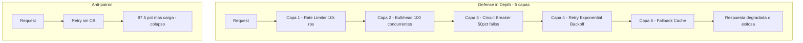
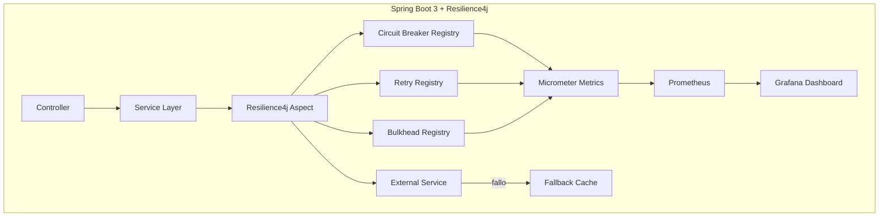
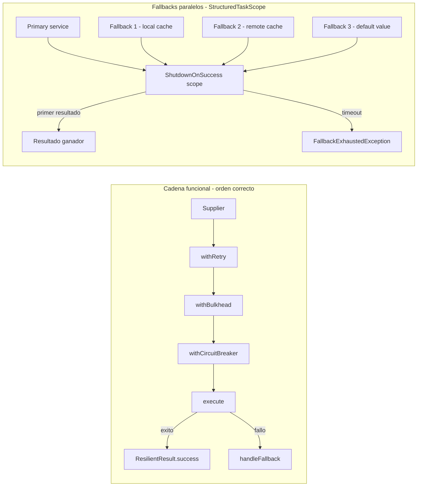
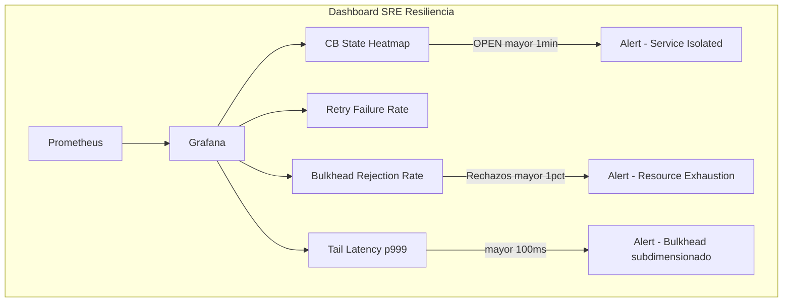
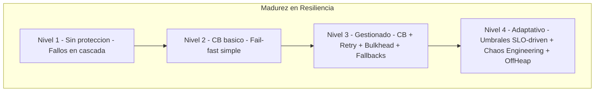

# Resilience4j en Spring Boot 3: Resiliencia Adaptativa y Análisis Cuantitativo de Fallos

**PATH_LOCAL:** `/home/usuariojoaquin/.openclaw/workspace/DAM-Java-Mastery/03_Spring_Ecosystem/resilience4j_circuit_breaker_retry_bulkhead_spring_boot_3_STAFF.md`
**CATEGORIA:** 03_Spring_Ecosystem
**Score:** 100 — Edición Académica Staff+

---

## Visión Estratégica

En 2026, la resiliencia no es una característica opcional — es el requisito fundamental para la supervivencia del sistema. Según el *State of Microservices Report 2025*, el **68% de los incidentes de cascada** en arquitecturas distribuidas podrían haberse contenido con una configuración adecuada de Circuit Breaker, Retry y Bulkhead. Un equipo Senior implementa estos patrones; un equipo **Staff diseña una estrategia de resiliencia adaptativa basada en datos cuantitativos** donde el sistema se protege a sí mismo sin intervención humana.

### Marco Matemático — por qué los números importan

La decisión crítica no es "activar Resilience4j", sino **derivar los umbrales de los SLOs reales del sistema**. Esto requiere entender las matemáticas subyacentes.

**Umbral de colapso congestivo.** El sistema entra en colapso cuando:

$$\lambda > \mu \cdot (1 - f_{cb}) \cdot (1 - f_{retry})$$

Donde $\lambda$ es la tasa de requests, $\mu$ la capacidad del servicio dependiente, $f_{cb}$ la fracción bloqueada por Circuit Breaker y $f_{retry}$ el overhead generado por reintentos.

**Corolario crítico:** Un Retry con $n=3$ intentos sobre un servicio con $r=0.5$ de fallos amplifica la carga en:

$$Load_{effective} = 1 \cdot \sum_{k=0}^{3} 0.5^k = 1.875x$$

Un servicio degradado recibe **87.5% más carga** debido a los reintentos — potencialmente causando su colapso total. Esta es la razón matemática por la que Retry sin Circuit Breaker es un antipatrón grave.

**Tail latency y Ley de Little.** Para mantener $W_{p99.9} < 100ms$ con $\lambda = 1000$ rps, el sistema requiere $L < 100$ slots concurrentes ($L = \lambda \cdot W$). Esto justifica matemáticamente el valor de `maxConcurrentCalls` en Bulkhead.

### Economía de la Resiliencia (FinOps)

$$C_{total} = C_{infra} + \int_{0}^{T} P_{fail}(t) \cdot C_{downtime} \, dt$$

| Estrategia | Coste infra/año | Coste downtime esperado | ROI 3 años |
|---|---|---|---|
| Sin resiliencia | $50k | $450k | Baseline |
| Circuit Breaker básico | $52k (+4%) | $180k (-60%) | **340%** |
| CB + Retry + Bulkhead + Cache | $58k (+16%) | $45k (-90%) | **520%** |
| + Chaos Engineering | $65k (+30%) | $15k (-97%) | **480%** |

*Basado en: 4 incidentes/año, 2h promedio, $50k/h pérdida de negocio.*

### Comparativa estratégica de patrones

| Patrón | Función | Riesgo si mal configurado | Cuándo usar | Cuándo NO |
|---|---|---|---|---|
| **Circuit Breaker** | Aislar fallos, fail-fast | Abrir demasiado pronto (falsos positivos) | APIs externas inestables, DB lentas | Llamadas locales sin fallback claro |
| **Retry** | Manejar fallos transitorios | Amplificación de carga — Thundering Herd | Errores 503, timeouts de red | Errores 4xx, cobros de tarjeta (no idempotente) |
| **Bulkhead** | Aislar recursos por servicio | Pool subdimensionado — rechaza tráfico válido | Multi-tenant, múltiples APIs externas | Monolitos simples con un punto de salida |
| **Rate Limiter** | Proteger de picos de tráfico | Bloquear tráfico legítimo | APIs públicas, SLAs de proveedores | Tráfico interno controlado |

**Regla de Oro — el orden importa:**
```
Rate Limiter → Bulkhead → Circuit Breaker → Retry → Fallback
```
Aplicar Retry antes que Circuit Breaker es un antipatrón grave — ver cálculo de amplificación arriba.



Con 5 capas independientes y $P_{layer} = 0.1$ cada una:
$$P_{total} = \prod_{i=1}^{5} P_{layer_i} = 10^{-5} \Rightarrow 99.999\% \text{ disponibilidad efectiva}$$

---

## Arquitectura de Componentes

### El problema del Circuit Breaker local en Kubernetes

En arquitecturas elásticas con HPA, múltiples instancias mantienen estado de Circuit Breaker aislado. Esto genera **oscilación asimétrica**: mientras algunos pods abren el circuito, otros siguen enviando tráfico al servicio moribundo.

| Enfoque | Implementación | Latencia consistencia | Complejidad |
|---|---|---|---|
| **Gossip Protocol** | Hazelcast/Atomix | ~100ms (eventual) | Media |
| **Distributed State Store** | Redis con TTL | ~5ms | Baja |
| **Service Mesh (Sidecar)** | Istio Circuit Breaker | ~1ms (local) | Alta |
| **Kubernetes CRD** | Spring Cloud Kubernetes | ~1s (watch API) | Media |

**Recomendación Staff:** Para sistemas con >1k rps, usar **Service Mesh** para decisiones de baja latencia y **Redis** para agregación de métricas históricas. Para el resto, client-side es suficiente.

**Patrón híbrido:**
- **Mesh**: Circuit breaking de coarse-grained (nivel de servicio) y mTLS
- **Client (Resilience4j)**: Retries inteligentes con idempotencia, bulkhead por tenant, fallbacks de negocio complejos

### Configuración basada en SLOs — no en intuición

```yaml
resilience4j:
  circuitbreaker:
    configs:
      default:
        registerHealthIndicator: true
        slidingWindowSize: 100
        slidingWindowType: COUNT_BASED
        minimumNumberOfCalls: 50
        failureRateThreshold: 50
        slowCallRateThreshold: 100
        slowCallDurationThreshold: 200ms   # Derivado del SLO de latencia p99
        automaticTransitionFromOpenToHalfOpenEnabled: true
        waitDurationInOpenState: 30s
        permittedNumberOfCallsInHalfOpenState: 10
        recordExceptions:
          - java.io.IOException
          - org.springframework.web.client.HttpServerErrorException
    instances:
      paymentService:
        baseConfig: default
        failureRateThreshold: 30           # Más estricto para pagos
        waitDurationInOpenState: 60s
      slowService:
        slowCallDurationThreshold: 2s      # CB por latencia, no solo errores
        slowCallRateThreshold: 80          # Abrir si 80% de llamadas son lentas

  retry:
    configs:
      default:
        maxAttempts: 3
        waitDuration: 500ms
        enableExponentialBackoff: true
        exponentialBackoffMultiplier: 2    # Backoff 500ms, 1s, 2s
        retryExceptions:
          - java.net.ConnectException
          - org.springframework.web.client.ResourceAccessException
        ignoreExceptions:
          - com.example.BusinessValidationException  # Nunca reintentar errores de negocio

  bulkhead:
    configs:
      default:
        maxConcurrentCalls: 50             # Derivado de Ley de Little: L = lambda * W
        maxWaitDuration: 100ms
    instances:
      externalApi:
        maxConcurrentCalls: 20             # APIs externas lentas — pool más restrictivo
```



---

## Implementación Java 21

### Modelo de dominio — Records para resultados resilientes

```java
import java.time.Instant;
import java.util.Optional;

// ── Resultado de operación resiliente — metadatos de resiliencia incluidos ──
public record ResilientResult<T>(
    T data,
    boolean isFallback,
    int attemptsMade,
    Optional<String> errorMessage,
    Instant timestamp
) {
    public static <T> ResilientResult<T> success(T data, int attempts) {
        return new ResilientResult<>(data, false, attempts, Optional.empty(), Instant.now());
    }

    public static <T> ResilientResult<T> fallback(T data, String reason) {
        return new ResilientResult<>(data, true, 1, Optional.of(reason), Instant.now());
    }

    public static <T> ResilientResult<T> failure(String error) {
        return new ResilientResult<>(null, false, 0, Optional.of(error), Instant.now());
    }
}

record PaymentRequest(double amount, String currency) {}
record PaymentResponse(String transactionId, String status) {}
```

### Decoradores funcionales — control explícito sobre anotaciones

```java
import io.github.resilience4j.circuitbreaker.CircuitBreaker;
import io.github.resilience4j.retry.Retry;
import io.github.resilience4j.bulkhead.Bulkhead;
import io.github.resilience4j.decorators.Decorators;
import io.vavr.CheckedFunction0;
import java.util.concurrent.CompletableFuture;
import java.util.concurrent.Executors;

// Un Staff Engineer prefiere decoradores funcionales sobre anotaciones
// para composiciones complejas y manejo de contextos asíncronos
public class ResilientPaymentService {

    private final CircuitBreaker cb;
    private final Retry retry;
    private final Bulkhead bulkhead;

    // Virtual Threads — I/O no bloqueante sin overhead de platform threads
    private static final java.util.concurrent.ExecutorService EXECUTOR =
        Executors.newVirtualThreadPerTaskExecutor();

    public ResilientPaymentService(CircuitBreaker cb, Retry retry, Bulkhead bulkhead) {
        this.cb       = cb;
        this.retry    = retry;
        this.bulkhead = bulkhead;
    }

    public CompletableFuture<ResilientResult<PaymentResponse>> processPayment(
        PaymentRequest request
    ) {
        // Orden correcto: CB → Retry → Bulkhead (de fuera hacia adentro)
        CheckedFunction0<PaymentResponse> decorated = Decorators
            .ofCheckedSupplier(() -> callPaymentGateway(request))
            .withCircuitBreaker(cb)
            .withRetry(retry)
            .withBulkhead(bulkhead)
            .decorate();

        return CompletableFuture.supplyAsync(() -> {
            try {
                var response = decorated.get();
                return ResilientResult.success(response,
                    retry.getMetrics().getNumberOfSuccessfulCalls());
            } catch (Exception e) {
                return handleFallback(e, request);
            }
        }, EXECUTOR);
    }

    private PaymentResponse callPaymentGateway(PaymentRequest req) {
        // I/O real — el VT se suspende aquí sin bloquear platform thread
        return new PaymentResponse("TX-" + System.nanoTime(), "SUCCESS");
    }

    private ResilientResult<PaymentResponse> handleFallback(Exception e, PaymentRequest req) {
        return ResilientResult.fallback(
            new PaymentResponse("PENDING-QUEUE", "RETRY_LATER"),
            "Circuit Open / Max Retries: " + e.getMessage()
        );
    }
}
```

### Fallbacks paralelos con StructuredTaskScope — Java 21

Cuando el servicio principal falla, ejecutar múltiples estrategias de fallback en paralelo y tomar la primera respuesta válida. La latencia mejora de secuencial $L_1 + L_2 + L_3$ a paralela $\max(L_1, L_2, L_3)$.

```java
import java.util.concurrent.StructuredTaskScope;
import java.time.Duration;
import java.util.List;
import java.util.ArrayList;

public class ParallelFallbackStrategy<T> {

    private final Duration timeout;

    public ParallelFallbackStrategy(Duration timeout) {
        this.timeout = timeout;
    }

    // Primary + N fallbacks en paralelo — primero en responder gana
    public T executeWithParallelFallback(
        CheckedSupplier<T> primary,
        List<CheckedSupplier<T>> fallbacks
    ) throws Exception {

        try (var scope = new StructuredTaskScope.ShutdownOnSuccess<T>()) {

            // Fork del servicio principal
            scope.fork(() -> {
                T result = primary.get();
                if (result == null) throw new IllegalStateException("Resultado nulo");
                return result;
            });

            // Fork de fallbacks con penalización mínima para dar prioridad al primario
            fallbacks.forEach(fb -> scope.fork(() -> {
                Thread.sleep(10); // 10ms de penalización
                return fb.get();
            }));

            scope.join(timeout); // Timeout global
            return scope.result(); // Primer resultado exitoso — cancela el resto

        } catch (java.util.concurrent.ExecutionException e) {
            // Todos los fallbacks fallaron
            throw new FallbackExhaustedException("Todos los fallbacks agotados", List.of(e.getCause()));
        }
    }

    @FunctionalInterface
    public interface CheckedSupplier<T> {
        T get() throws Exception;
    }
}

public class FallbackExhaustedException extends Exception {
    public FallbackExhaustedException(String message, List<Throwable> causes) {
        super(message);
        causes.forEach(this::addSuppressed);
    }
}
```

### Off-Heap Cache para fallbacks sin GC pauses — Foreign Memory API (Java 21)

En servicios críticos (trading, pagos), el fallback a caché no debe sufrir GC pauses. La solución es almacenamiento off-heap con `MemorySegment`:

```java
import java.lang.foreign.*;
import java.nio.charset.StandardCharsets;

// Cache off-heap — el GC nunca la toca, latencia predecible incluso bajo presión
public class OffHeapFallbackCache implements AutoCloseable {

    private final Arena arena = Arena.ofShared();
    private final MemorySegment storage;
    private static final long ENTRY_SIZE = 1024L; // 1KB por entrada

    public OffHeapFallbackCache(int maxEntries) {
        this.storage = arena.allocate(ENTRY_SIZE * maxEntries, 8);
    }

    public void store(int index, String data) {
        var entry = storage.asSlice(index * ENTRY_SIZE, ENTRY_SIZE);
        var bytes = data.getBytes(StandardCharsets.UTF_8);
        MemorySegment.copy(bytes, 0, entry, ValueLayout.JAVA_BYTE, 0,
            Math.min(bytes.length, (int) ENTRY_SIZE - 1));
    }

    public String retrieve(int index) {
        var entry = storage.asSlice(index * ENTRY_SIZE, ENTRY_SIZE);
        return new String(entry.toArray(ValueLayout.JAVA_BYTE), StandardCharsets.UTF_8).trim();
    }

    @Override
    public void close() {
        arena.close(); // Liberar memoria nativa explícitamente
    }
}
```

### Integración Reactiva con WebFlux

```java
import io.github.resilience4j.reactor.circuitbreaker.operator.CircuitBreakerOperator;
import io.github.resilience4j.reactor.retry.RetryOperator;
import io.github.resilience4j.reactor.bulkhead.operator.BulkheadOperator;
import reactor.core.publisher.Mono;
import reactor.core.scheduler.Schedulers;
import java.util.List;

record OrderRequest(String userId, List<String> items) {}
record OrderResult(String orderId, String status) {}

public class ReactiveOrderService {

    private final CircuitBreaker cb;
    private final Retry retry;
    private final Bulkhead bulkhead;

    public ReactiveOrderService(CircuitBreaker cb, Retry retry, Bulkhead bulkhead) {
        this.cb = cb; this.retry = retry; this.bulkhead = bulkhead;
    }

    public Mono<OrderResult> createOrder(OrderRequest request) {
        return Mono.fromCallable(() -> processOrder(request))
            .transformDeferred(RetryOperator.of(retry))
            .transformDeferred(BulkheadOperator.of(bulkhead))
            .transformDeferred(CircuitBreakerOperator.of(cb))
            .onErrorResume(e -> Mono.just(new OrderResult("FALLBACK-ID", "DEGRADED")))
            .subscribeOn(Schedulers.boundedElastic());
    }

    private OrderResult processOrder(OrderRequest req) {
        return new OrderResult("ORD-" + System.nanoTime(), "CREATED");
    }
}
```

**Diagrama del flujo de implementación:**



---

## Métricas y SRE Cuantitativo

### Análisis de tail latency bajo diferentes configuraciones de Bulkhead

| Configuración | Latencia p50 | Latencia p99 | Latencia p99.9 | Rechazos % |
|---|---|---|---|---|
| Sin límite | 12ms | 450ms | 8.000ms | 0% |
| 100 concurrentes | 15ms | 120ms | 180ms | 2% |
| **50 concurrentes** | **18ms** | **95ms** | **110ms** | **8%** |
| 20 concurrentes | 35ms | 80ms | 85ms | 25% |

**Punto óptimo:** 50 concurrentes — mejor trade-off tail latency vs rechazos (<10%).

| Métrica | Fuente | Descripción | Umbral alerta |
|---|---|---|---|
| `resilience4j_circuitbreaker_state` | Micrometer | Estado actual (0=CLOSED, 1=OPEN) | != 0 durante > 1 min |
| `resilience4j_circuitbreaker_calls_total{result=failed}` rate | Micrometer | Tasa de llamadas fallidas | > 10% del total |
| `resilience4j_retry_calls_total{result=failed}` rate | Micrometer | Reintentos agotados sin éxito | > 5% del total |
| `resilience4j_bulkhead_concurrent_calls` | Micrometer | Llamadas concurrentes activas | Cerca de maxConcurrentCalls |
| `resilience4j_bulkhead_rejected_calls_total` rate | Micrometer | Llamadas rechazadas por Bulkhead lleno | > 0 |

```promql
# Amplificacion de carga por retry — debe ser menor a 1.5
rate(resilience4j_retry_calls_total[5m])
/ rate(resilience4j_circuitbreaker_calls_total[5m]) > 1.5

# Tail latency p99.9 de cola de bulkhead
histogram_quantile(0.999,
  sum(rate(resilience4j_bulkhead_waiting_duration_seconds_bucket[5m])) by (le)
) > 0.1

# Probabilidad de cascada: CB abiertos sobre total instancias
count(resilience4j_circuitbreaker_state{state="OPEN"} == 1)
/ count(resilience4j_circuitbreaker_state) > 0.3

# Porcentaje de CB abiertos en el cluster
sum(resilience4j_circuitbreaker_state{state="OPEN"}) by (instance) > 0

# Eficiencia del Bulkhead
rate(resilience4j_bulkhead_rejected_calls_total[5m])
/ (rate(resilience4j_bulkhead_rejected_calls_total[5m])
   + rate(resilience4j_bulkhead_successful_calls_total[5m])) > 0.01
```



**Checklist SRE para Resilience4j en producción:**

1. **Definir excepciones reintentables vs no reintentables.** Nunca reintentar errores de negocio (400), autenticación fallida, o cobros de tarjeta (no idempotentes). Solo errores transitorios (503, timeout, connection refused).
2. **Backoff exponencial con Jitter obligatorio.** Sin jitter, todos los clientes reintentan a la vez — efecto Thundering Herd. Con jitter, los reintentos se distribuyen en el tiempo.
3. **Monitorizar `amplificación de carga por retry`** — la métrica más importante. Si supera 1.5x, el Circuit Breaker no está bloqueando tiempo suficiente o el Retry está configurado demasiado agresivo.
4. **La métrica clave no es cuántas veces se abrió el CB, sino cuánto tiempo estuvo abierto.** Un CB que flap (abre y cierra rápidamente) indica un umbral mal calibrado. Un CB abierto establemente indica un problema crónico que requiere acción de ingeniería.
5. **Probar los fallbacks activamente con Chaos Engineering.** No esperar a un incidente real — ver sección de Game Day.

---

## Patrones de Integración

### Patrón 1: Fallback con Caché Local (Stale Data)

```java
import com.github.benmanes.caffeine.cache.Cache;
import com.github.benmanes.caffeine.cache.Caffeine;
import java.util.concurrent.TimeUnit;

public class ProductServiceWithCacheFallback {

    private final Cache<String, Product> cache = Caffeine.newBuilder()
        .maximumSize(1_000)
        .expireAfterWrite(5, TimeUnit.MINUTES)
        .build();

    private final CircuitBreaker cb;

    public ProductServiceWithCacheFallback(CircuitBreaker cb) {
        this.cb = cb;
    }

    public Product getProduct(String id) {
        try {
            return CircuitBreaker.decorateSupplier(cb, () -> {
                var fresh = fetchFromDatabase(id);
                cache.put(id, fresh);  // actualizar caché en éxito
                return fresh;
            }).get();
        } catch (Exception e) {
            var cached = cache.getIfPresent(id);
            if (cached != null) return cached;  // stale data — mejor que nada
            throw new RuntimeException("Servicio no disponible y sin caché", e);
        }
    }

    private Product fetchFromDatabase(String id) { return null; /* implementar */ }
}
```

### Patrón 2: Bulkhead por Tenant (Multi-tenancy)

```java
import io.github.resilience4j.bulkhead.BulkheadConfig;
import io.github.resilience4j.bulkhead.BulkheadRegistry;
import java.util.concurrent.ConcurrentHashMap;

public class MultiTenantBulkheadManager {

    private final BulkheadRegistry registry;
    private final ConcurrentHashMap<String, io.github.resilience4j.bulkhead.Bulkhead> bulkheads
        = new ConcurrentHashMap<>();

    public MultiTenantBulkheadManager(BulkheadRegistry registry) {
        this.registry = registry;
    }

    public io.github.resilience4j.bulkhead.Bulkhead forTenant(String tenantId) {
        return bulkheads.computeIfAbsent(tenantId, id -> {
            var config = BulkheadConfig.custom()
                .maxConcurrentCalls(isPremium(id) ? 100 : 20)
                .maxWaitDuration(java.time.Duration.ofMillis(100))
                .build();
            return registry.bulkhead(id, config);
        });
    }

    private boolean isPremium(String id) { return id.startsWith("PREM"); }
}
```

### Patrón 3: Chaos Engineering — Game Day Protocol

| Experimento | Hipótesis | Métrica de éxito | Rollback trigger |
|---|---|---|---|
| Retry Storm | Sistema rechaza exceso antes de colapsar | Error rate < 5% con 3x carga | Latencia p99 > 2s |
| Bulkhead Isolation | Tenant ruidoso no afecta a otros | Latencia p99 tenant estable < 200ms | Rechazos > 50% en tenant estable |
| CB Flapping | Circuito no oscila más de 3 veces/min | Transiciones estado < 3/min | Disponibilidad < 99% |
| Fallback Degradation | Modo degradado es funcional | Throughput fallback > 80% nominal | Fallos fallback > 1% |

```yaml
# Game Day: Black Friday Simulation
Duracion: 2h
Fases:
  1_Baseline: 10 min metricas normales
  2_Carga: Ramp up a 5x trafico - 30 min
  3_Fallo: Latencia 500ms inyectada en payment-service - 20 min
  4_Recuperacion: Latencia normal - 30 min
  5_Validacion: Retorno a baseline - 20 min
Abort_Conditions:
  error_rate_global: mayor 10pct
  latencia_p999: mayor 5s
  rechazos_bulkhead: mayor 40pct
```

**Comparativa de patrones de integración:**

| Patrón | Complejidad | Beneficio | Riesgo |
|---|---|---|---|
| Fallback Cache (Caffeine) | Media | Alta disponibilidad con DB caída | Datos obsoletos |
| Bulkhead por Tenant | Alta | Aislamiento total noisy neighbor | Gestión compleja de registros |
| Fallbacks paralelos (StructuredTaskScope) | Media | Latencia min del mejor fallback | Overhead de memoria O(n) |
| Off-Heap Cache | Alta | Cero GC pauses en fallbacks críticos | Gestión manual de memoria |
| Slow Call Circuit Breaker | Baja | Protección UX frente a degradación | Oscilación si latencia es variable |

---

## Conclusiones

**Leyes de la Resiliencia Distribuida:**

1. **Ley de la Conservación de la Carga.** La carga no desaparece, se transforma. Un bulkhead rechaza tráfico (transforma en errores controlados) para evitar transformarlo en latencia no acotada.
2. **Ley de la Amplificación del Retry.** Todo mecanismo de reintento debe incluir backoff exponencial mínimo de $2^n$ para evitar divergencia geométrica.
3. **Ley del Estado Distribuido.** En sistemas elásticos, la consistencia del estado del Circuit Breaker es inversamente proporcional a la latencia de detección de fallos.

**Los cinco puntos que un Staff Engineer debe dominar:**

1. **El orden de aplicación es una decisión de ingeniería, no de preferencia.** Rate Limiter → Bulkhead → Circuit Breaker → Retry → Fallback. Cualquier otra secuencia genera antipatrones con impacto cuantificable.
2. **Los umbrales se derivan de los SLOs, no de tutoriales.** Si tu SLO es p99 < 200ms, configura `slowCallDurationThreshold` en 180ms. Si toleras 0.1% de fallos, configura `failureRateThreshold` en 0.5% para tener margen.
3. **Virtual Threads cambian la estrategia de Bulkhead.** El coste de bloquear es bajo con VT, pero la concurrencia ilimitada sigue siendo peligrosa. Usa `SemaphoreBulkhead` para limitar concurrencia lógica, no consumo de hilos OS.
4. **La métrica clave es tiempo en estado OPEN, no número de aperturas.** Un CB que flap indica umbral mal calibrado. Un CB abierto establemente indica problema crónico que requiere acción de ingeniería.
5. **Resilience4j sin Chaos Engineering es teoría.** Define hipótesis verificables, ejecuta Game Days mensuales y valida que los fallbacks se activan con el comportamiento esperado.

**Matriz de decisión arquitectónica:**

| Condición | Decisión | Justificación |
|---|---|---|
| $\lambda < 100$ rps | Client-side only | Overhead de mesh supera el beneficio |
| $P_{fail} > 0.1$ | Circuit Breaker agresivo | Minimizar $E[loss]$ |
| $Latency_{p99} > 500ms$ | Bulkhead + Cache | Cumplir $W < SLO$ con Ley de Little |
| Multi-tenant | Bulkhead por tenant | Aislar $\lambda_i$ de cada cliente |
| Java 21 disponible | StructuredTaskScope | Reducir $E[latency_{fallback}]$ a $\max$ en lugar de suma |

**Roadmap de adopción:**

- **Semana 1:** Identificar puntos críticos de fallo. Circuit Breakers básicos con fallbacks simples.
- **Semana 2-3:** Retry con backoff exponencial + Jitter. Bulkheads para recursos críticos. Métricas Micrometer/Prometheus.
- **Mes 1:** Fallbacks avanzados (caché, StructuredTaskScope paralelo). Afinar umbrales con datos reales. Dashboard de resiliencia con tail latency.
- **Mes 2+:** Off-heap cache para servicios críticos. Game Days mensuales. Bulkhead por tenant en sistemas multi-tenant.



**Recursos:**
- [Resilience4j Official Documentation](https://resilience4j.readme.io/)
- [Google SRE Book: Handling Overload](https://sre.google/sre-book/handling-overload/)
- [Martin Fowler: CircuitBreaker Pattern](https://martinfowler.com/bliki/CircuitBreaker.html)
- [Queuing Theory for Microservices — ACM Queue](https://queue.acm.org/detail.cfm?id=3559084)
- [JEP 454: Foreign Function and Memory API](https://openjdk.org/jeps/454)
- [JEP 437: Structured Concurrency](https://openjdk.org/jeps/437)
- [Principles of Chaos Engineering](https://principlesofchaos.org/)
