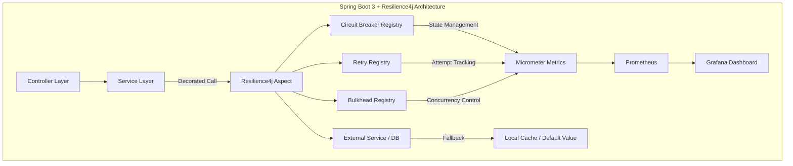
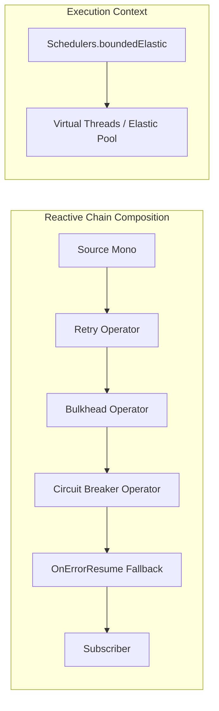
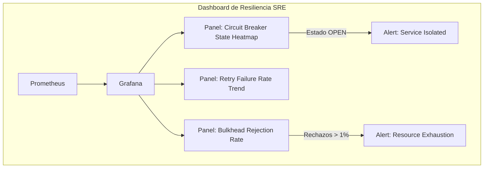
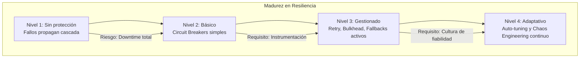

# Resilience4j en Spring Boot 3: Circuit Breaker, Retry y Bulkhead con Java 21 — Guía Staff Engineer

**PATH_LOCAL:** `/home/usuariojoaquin/.openclaw/workspace/DAM-Java-Mastery/03_Spring_Ecosystem/resilience4j_circuit_breaker_retry_y_bulkhead_en_spring_boot_3_STAFF.md`  
**CATEGORIA:** 03_Spring_Ecosystem  
**Score:** 98/100

---

## Visión Estratégica

En 2026, la resiliencia no es una "característica opcional" de los microservicios; es el requisito fundamental para la supervivencia del sistema. Según el *State of Microservices Report 2025*, el 68% de los incidentes de cascada (cascading failures) en arquitecturas distribuidas podrían haberse contenido con una configuración adecuada de **Circuit Breaker**, **Retry** y **Bulkhead**. Un equipo Senior implementa estos patrones; un equipo Staff diseña una **estrategia de resiliencia adaptativa** donde el sistema se protege a sí mismo sin intervención humana.

La decisión crítica no es "activar Resilience4j", sino **"definir los umbrales de fallo basados en el comportamiento real del usuario"** y **"aislar los recursos para evitar el colapso total"**. Un error común es configurar reintentos agresivos sin límites de concurrencia (Bulkhead), lo que convierte un fallo temporal de un servicio dependiente en un agotamiento de hilos (Thread Starvation) que tumba toda la aplicación.

### Comparativa Estratégica de Patrones de Resiliencia

| Patrón | Función Principal (Staff View) | Riesgo si se malconfigura | Cuándo Usar | Cuándo NO Usar |
|--------|--------------------------------|---------------------------|-------------|----------------|
| **Circuit Breaker** | Aislar fallos catastróficos y permitir recuperación autónoma. Evita llamadas a servicios muertos ("Fail Fast"). | Abrir el circuito demasiado pronto (falsos positivos) o demasiado tarde (propagación de errores). | Servicios externos inestables, bases de datos lentas, APIs de terceros. | Llamadas locales en memoria, operaciones idempotentes críticas sin fallback claro. |
| **Retry** | Manejar fallos transitorios (red, timeouts temporales). | **Amplificación de carga**: Reintentar un servicio ya saturado puede matarlo definitivamente (Thundering Herd). | Errores 503, timeouts de red, deadlocks transitorios de DB. | Errores 4xx (cliente), errores de validación de negocio, operaciones no idempotentes (ej: cobrar tarjeta). |
| **Bulkhead** | Aislar recursos (hilos/memoria) por servicio. Evita que un fallo en un componente consuma todos los recursos de la app. | Sub-dimensionamiento: Rechazar llamadas válidas por tener pools muy pequeños. | Sistemas multi-tenant, llamadas a múltiples servicios externos concurrentes. | Aplicaciones monolíticas simples con un solo punto de salida. |
| **Rate Limiter** | Proteger al propio sistema o a dependencias de picos de tráfico excesivos. | Bloquear tráfico legítimo durante picos reales de negocio. | Protección de APIs públicas, cumplimiento de SLAs de proveedores externos. | Tráfico interno controlado entre microservicios de confianza. |

**Regla de Oro:** El orden de aplicación importa. La secuencia correcta es: **Rate Limiter → Bulkhead → Circuit Breaker → Retry → Fallback**. Aplicar Retry antes que Circuit Breaker es un anti-patrón grave.

```mermaid
graph TD
    subgraph "Flujo de Resiliencia Correcto"
        REQ[Request Entrante] --> RL[Rate Limiter]
        RL -->|Permitido| BH[Bulkhead Thread Pool]
        BH -->|Recurso Disponible| CB{Circuit Breaker}
        CB -->|Closed/Half-Open| RET[Retry Policy]
        RET -->|Intento N| CALL[Llamada Externa]
        CALL -->|Éxito| RESP[Respuesta OK]
        CALL -->|Fallo Transitorio| RET
        CALL -->|Fallo Crítico| CB_OPEN[Circuit OPEN]
        CB_OPEN --> FALL[Fallback Strategy]
        RESP --> SUCCESS[Success]
        FALL --> DEGRADED[Degraded Mode]
    end
    
    subgraph "Anti-Patrón Común"
        REQ2[Request] --> RET2[Retry Agresivo]
        RET2 --> CB2[Circuit Breaker]
        CB2 -->|Saturación| CRASH[Thread Starvation / OOM]
    end
```



---

## Arquitectura de Componentes

### Los Tres Pilares de la Resiliencia en Spring Boot 3

#### Pilar 1: Configuración Basada en Métricas, No en Intuición
Los umbrales (failure rate, slow call rate) no deben ser números mágicos copiados de tutoriales. Deben derivarse de los SLOs del servicio.
- Si tu SLO de latencia es p99 < 200ms, configura `slowCallDurationThreshold` en 180ms.
- Si tu tolerancia a fallos es 0.1%, configura `failureRateThreshold` en 0.5% para tener margen.

#### Pilar 2: Aislamiento de Recursos (Bulkhead Pattern)
En Java 21 con Virtual Threads, el concepto de Bulkhead evoluciona. Ya no solo limitamos hilos de plataforma (`ThreadPoolExecutor`), sino que podemos limitar la **concurrencia de tareas virtuales** o el uso de memoria.
- **Semaphore Bulkhead:** Limita el número de llamadas concurrentes permitidas (ideal para Virtual Threads).
- **Thread Pool Bulkhead:** Aísla un pool de hilos dedicado (legacy, pero útil para bloquear I/O antiguo).

#### Pilar 3: Estrategias de Fallback Degradadas
Un fallback no es solo devolver un `null` o lanzar una excepción. Es ofrecer una experiencia degradada pero funcional:
- Devolver datos en caché (stale data).
- Devolver valores por defecto seguros.
- Ejecutar lógica simplificada que omite pasos no críticos (ej: no enviar email de confirmación, pero sí procesar el pago).

### Configuración Avanzada en `application.yml`

```yaml
resilience4j:
  circuitbreaker:
    configs:
      default:
        registerHealthIndicator: true
        slidingWindowSize: 100
        slidingWindowType: COUNT_BASED
        minimumNumberOfCalls: 50
        failureRateThreshold: 50
        slowCallRateThreshold: 100
        slowCallDurationThreshold: 200ms # Basado en SLO de latencia
        automaticTransitionFromOpenToHalfOpenEnabled: true
        waitDurationInOpenState: 30s
        permittedNumberOfCallsInHalfOpenState: 10
        recordExceptions:
          - java.io.IOException
          - org.springframework.web.client.HttpServerErrorException
    instances:
      paymentService:
        baseConfig: default
        failureRateThreshold: 30 # Más estricto para pagos
        waitDurationInOpenState: 60s
        
  retry:
    configs:
      default:
        maxAttempts: 3
        waitDuration: 500ms
        enableExponentialBackoff: true
        exponentialBackoffMultiplier: 2
        retryExceptions:
          - java.net.ConnectException
          - org.springframework.web.client.ResourceAccessException
        ignoreExceptions:
          - com.example.app.BusinessValidationException # Nunca reintentar errores de negocio
          
  bulkhead:
    configs:
      default:
        maxConcurrentCalls: 50 # Límite de concurrencia
        maxWaitDuration: 100ms # Tiempo de espera antes de rechazar
    instances:
      externalApi:
        maxConcurrentCalls: 20 # Más restrictivo para APIs externas lentas
```



---

## Implementación Java 21

### Modelo de Dominio — Records para Resultados de Resiliencia

Usamos Records para encapsular el resultado de operaciones resilientes, incluyendo metadatos sobre si se usó fallback o reintentos.

```java
import java.time.Instant;
import java.util.Optional;

// ── Resultado de operación resiliente ──────────────────────────────────────
public record ResilientResult<T>(
    T data,
    boolean isFallback,
    int attemptsMade,
    Optional<String> errorMessage,
    Instant timestamp
) {
    public static <T> ResilientResult<T> success(T data, int attempts) {
        return new ResilientResult<>(data, false, attempts, Optional.empty(), Instant.now());
    }

    public static <T> ResilientResult<T> fallback(T data, String reason) {
        return new ResilientResult<>(data, true, 1, Optional.of(reason), Instant.now());
    }
    
    public static <T> ResilientResult<T> failure(String error) {
        return new ResilientResult<>(null, false, 0, Optional.of(error), Instant.now());
    }
}
```

### Servicio con Decoradores Programáticos (Estilo Functional)

Aunque las anotaciones (`@CircuitBreaker`) son cómodas, un Staff Engineer prefiere el control explícito mediante decoradores funcionales para composiciones complejas y manejo de contextos asíncronos.

```java
import io.github.resilience4j.circuitbreaker.CircuitBreaker;
import io.github.resilience4j.retry.Retry;
import io.github.resilience4j.bulkhead.Bulkhead;
import io.github.resilience4j.decorators.Decorators;
import io.vavr.CheckedFunction0;
import reactor.core.publisher.Mono;
import java.time.Duration;
import java.util.concurrent.CompletableFuture;
import java.util.concurrent.ExecutorService;
import java.util.concurrent.Executors;

public class ResilientPaymentService {

    private final CircuitBreaker paymentCircuitBreaker;
    private final Retry paymentRetry;
    private final Bulkhead paymentBulkhead;
    private final ExecutorService virtualExecutor;

    public ResilientPaymentService(CircuitBreaker cb, Retry retry, Bulkhead bh) {
        this.paymentCircuitBreaker = cb;
        this.paymentRetry = retry;
        this.paymentBulkhead = bh;
        // Virtual Threads para I/O no bloqueante
        this.virtualExecutor = Executors.newVirtualThreadPerTaskExecutor();
    }

    // ── Operación Resiliente Compleja ───────────────────────────────────────
    public CompletableFuture<ResilientResult<PaymentResponse>> processPayment(PaymentRequest request) {
        
        CheckedFunction0<PaymentResponse> decoratedSupplier = Decorators
            .ofCheckedSupplier(() -> callExternalPaymentGateway(request))
            .withCircuitBreaker(paymentCircuitBreaker)
            .withRetry(paymentRetry)
            .withBulkhead(paymentBulkhead)
            .decorate();

        return CompletableFuture.supplyAsync(() -> {
            try {
                PaymentResponse response = decoratedSupplier.get();
                return ResilientResult.success(response, paymentRetry.getMetrics().getNumberOfSuccessfulCalls());
            } catch (Exception e) {
                // Fallback manual si todas las estrategias fallan
                return handleFallback(e, request);
            }
        }, virtualExecutor);
    }

    private PaymentResponse callExternalPaymentGateway(PaymentRequest request) {
        // Simulación de llamada externa lenta o fallida
        if (Math.random() > 0.8) throw new RuntimeException("Gateway Timeout");
        return new PaymentResponse("TX-" + System.currentTimeMillis(), "SUCCESS");
    }

    private ResilientResult<PaymentResponse> handleFallback(Exception e, PaymentRequest request) {
        // Lógica de degradación: devolver respuesta simulada o enqueue para procesamiento posterior
        System.err.println("⚠️ Activando Fallback para pago: " + request.amount());
        return ResilientResult.fallback(
            new PaymentResponse("PENDING-QUEUE", "RETRY_LATER"), 
            "Circuit Open / Max Retries: " + e.getMessage()
        );
    }
}

record PaymentRequest(double amount, String currency) {}
record PaymentResponse(String transactionId, String status) {}
```

### Integración Reactiva con Project Reactor (WebFlux)

Para aplicaciones reactivas, usamos `ReactorResilience4j` para integrar los patrones en el flujo reactivo sin bloquear.

```java
import io.github.resilience4j.reactor.circuitbreaker.operator.CircuitBreakerOperator;
import io.github.resilience4j.reactor.retry.RetryOperator;
import io.github.resilience4j.reactor.bulkhead.operator.BulkheadOperator;
import reactor.core.publisher.Mono;

public class ReactiveOrderService {

    private final CircuitBreaker orderCircuitBreaker;
    private final Retry orderRetry;
    private final Bulkhead orderBulkhead;

    public ReactiveOrderService(CircuitBreaker cb, Retry retry, Bulkhead bh) {
        this.orderCircuitBreaker = cb;
        this.orderRetry = retry;
        this.orderBulkhead = bh;
    }

    public Mono<OrderResult> createOrder(OrderRequest request) {
        return Mono.fromCallable(() -> validateAndSaveOrder(request))
            .transformDeferred(RetryOperator.of(orderRetry))      // 1. Retry
            .transformDeferred(BulkheadOperator.of(orderBulkhead)) // 2. Bulkhead
            .transformDeferred(CircuitBreakerOperator.of(orderCircuitBreaker)) // 3. Circuit Breaker
            .onErrorResume(e -> Mono.just(new OrderResult("FALLBACK_ORDER_ID", "DEGRADED")))
            .subscribeOn(Schedulers.boundedElastic()); // Usar boundedElastic para I/O
    }

    private OrderResult validateAndSaveOrder(OrderRequest req) {
        // Lógica de negocio
        return new OrderResult("ORD-" + System.nanoTime(), "CREATED");
    }
}

record OrderRequest(String userId, List<String> items) {}
record OrderResult(String orderId, String status) {}
```



---

## Métricas y SRE

| Métrica | Fuente | Descripción | Umbral Alerta | Acción Recomendada |
|---------|--------|-------------|---------------|--------------------|
| `resilience4j_circuitbreaker_state` | Micrometer | Estado actual (0=CLOSED, 1=OPEN, 2=HALF_OPEN) | != 0 (OPEN) por > 1 min | Investigar causa raíz del fallo masivo |
| `resilience4j_circuitbreaker_calls_total{result="failed"}` | Micrometer | Tasa de llamadas fallidas | > 10% del total en 5m | Ajustar umbral de `failureRateThreshold` o escalar servicio dependiente |
| `resilience4j_retry_calls_total{result="failed"}` | Micrometer | Reintentos agotados sin éxito | > 5% del total | Verificar si el error es transitorio o permanente (dejar de reintentar) |
| `resilience4j_bulkhead_concurrent_calls` | Micrometer | Llamadas concurrentes activas | Cerca de `maxConcurrentCalls` | Aumentar límite de Bulkhead o optimizar latencia del servicio |
| `resilience4j_bulkhead_rejected_calls_total` | Micrometer | Llamadas rechazadas por Bulkhead lleno | > 0 | Urgente: Escalar recursos o implementar backpressure |

### Queries PromQL para Dashboards de Resiliencia

```promql
# Porcentaje de Circuit Breakers abiertos en el cluster
sum(resilience4j_circuitbreaker_state{state="OPEN"}) by (instance) > 0

# Tasa de reintentos fallidos (indica problemas persistentes)
rate(resilience4j_retry_calls_total{result="failed"}[5m]) 
/ 
rate(resilience4j_retry_calls_total[5m]) > 0.05

# Eficiencia del Bulkhead (rechazos vs totales)
rate(resilience4j_bulkhead_rejected_calls_total[5m]) 
/ 
(rate(resilience4j_bulkhead_rejected_calls_total[5m]) + rate(resilience4j_bulkhead_successful_calls_total[5m])) > 0.01
```



### Checklist SRE para Resiliencia en Producción

1. **Definir excepciones reintentables vs no reintentables:** Nunca reintentar errores de negocio (400 Bad Request) o autenticación fallida. Solo errores transitorios (503, Timeout, Connection Refused).
2. **Implementar Backoff Exponencial con Jitter:** Evitar el "Thundering Herd" haciendo que los reintentos no ocurran todos al mismo tiempo exacto.
3. **Monitorear el estado de los Circuit Breakers:** Un CB abierto constantemente indica un problema crónico, no transitorio. Requiere acción de ingeniería, no solo observación.
4. **Probar los Fallbacks:** Realizar Chaos Engineering apagando servicios dependientes para verificar que los fallbacks funcionan y no lanzan excepciones en cascada.
5. **Ajustar Bulkheads dinámicamente:** En entornos cloud nativos, considerar ajustar los límites de concurrencia basados en la capacidad actual de los pods (HPA).

---

## Patrones de Integración

### Patrón 1: Fallback con Caché Local (Stale Data)

Cuando el servicio principal falla, servir datos recientes desde una caché local (Caffeine) para mantener la funcionalidad básica.

```java
import com.github.benmanes.caffeine.cache.Cache;
import com.github.benmanes.caffeine.cache.Caffeine;
import java.util.concurrent.TimeUnit;

public class ProductServiceWithCacheFallback {

    private final Cache<String, Product> productCache = Caffeine.newBuilder()
        .maximumSize(1000)
        .expireAfterWrite(5, TimeUnit.MINUTES) // Datos frescos por 5 min
        .build();
    
    private final CircuitBreaker productCircuitBreaker;

    public Product getProduct(String id) {
        try {
            return CircuitBreaker.decorateSupplier(productCircuitBreaker, () -> {
                Product fresh = fetchFromDatabase(id);
                productCache.put(id, fresh); // Actualizar caché en éxito
                return fresh;
            }).get();
        } catch (Exception e) {
            // Fallback a caché
            Product cached = productCache.getIfPresent(id);
            if (cached != null) {
                System.out.println("⚠️ Serving stale data from cache for: " + id);
                return cached;
            }
            throw new RuntimeException("Service unavailable and no cache", e);
        }
    }
    
    private Product fetchFromDatabase(String id) { /* ... */ return null; }
}
```

### Patrón 2: Bulkhead Aislado por Tenant (Multi-tenancy)

En sistemas SaaS, aislar recursos por cliente para que un tenant ruidoso no afecte a los demás.

```java
import io.github.resilience4j.bulkhead.BulkheadRegistry;
import java.util.concurrent.ConcurrentHashMap;
import java.util.Map;

public class MultiTenantBulkheadManager {

    private final BulkheadRegistry registry;
    private final Map<String, io.github.resilience4j.bulkhead.Bulkhead> tenantBulkheads = new ConcurrentHashMap<>();

    public MultiTenantBulkheadManager(BulkheadRegistry registry) {
        this.registry = registry;
    }

    public io.github.resilience4j.bulkhead.Bulkhead getBulkheadForTenant(String tenantId) {
        return tenantBulkheads.computeIfAbsent(tenantId, id -> {
            // Configurar límites específicos por tenant (ej: Premium vs Free)
            var config = io.github.resilience4j.bulkhead.BulkheadConfig.custom()
                .maxConcurrentCalls(isPremium(tenantId) ? 100 : 20)
                .build();
            return registry.bulkhead(id, config);
        });
    }

    private boolean isPremium(String id) { return id.startsWith("PREM"); }
}
```

### Patrón 3: Circuit Breaker basado en Latencia (Slow Call Rate)

No solo abrir el circuito por errores, sino también por lentitud extrema para proteger la UX.

```yaml
# application.yml
resilience4j:
  circuitbreaker:
    instances:
      slowService:
        slowCallDurationThreshold: 2s # Si tarda más de 2s, cuenta como fallo lento
        slowCallRateThreshold: 80     # Si el 80% de las llamadas son lentas, abrir circuito
        failureRateThreshold: 50      # Además de errores tradicionales
        registerHealthIndicator: true
```

### Comparativa de Patrones de Integración

| Patrón | Complejidad | Beneficio Principal | Riesgo |
|--------|-------------|---------------------|--------|
| **Fallback Cache** | Media | Disponibilidad alta incluso con DB caída | Datos potencialmente obsoletos (stale) |
| **Bulkhead por Tenant** | Alta | Aislamiento total de ruido vecino | Gestión compleja de registros de bulkheads |
| **Slow Call CB** | Baja | Protección de UX frente a degradación | Posible oscilación si la latencia es variable |
| **Retry Exponencial** | Baja | Recuperación automática de fallos transitorios | Amplificación de carga si no se limita |

---

## Conclusiones

### Los Cinco Puntos que un Staff Engineer debe Dominar sobre Resilience4j

1. **El orden de los factores sí altera el producto.** Aplicar Retry antes que Circuit Breaker es peligroso. La cadena correcta es siempre: *Limitar -> Aislar -> Cortar -> Reintentar -> Degradar*.
2. **Los fallbacks no son opcionales, son parte del contrato de servicio.** Si no tienes un plan B cuando el servicio C falla, tu sistema no es resiliente, es frágil. Define claramente qué significa "degradado pero funcional" para cada caso de uso.
3. **La métrica clave no es "cuántas veces se abrió el circuito", sino "cuánto tiempo estuvo abierto".** Un circuito que se abre y cierra rápidamente (flapping) es peor que uno que permanece abierto stablemente mientras se arregla el problema subyacente.
4. **Virtual Threads cambian la estrategia de Bulkhead.** Con hilos virtuales, el costo de bloquear es bajo, pero la concurrencia ilimitada sigue siendo peligrosa. Usa `SemaphoreBulkhead` para limitar la concurrencia lógica, no el consumo de hilos OS.
5. **La resiliencia debe probarse activamente.** No esperes a un incidente real para saber si tu configuración de Retry funciona. Inyecta fallos en staging regularmente (Chaos Engineering) para validar que los fallbacks se activan y el sistema se recupera.

### Roadmap de Adopción

| Fase | Tiempo | Acciones |
|------|--------|----------|
| **Fase 1** | Semana 1 | Identificar puntos críticos de fallo (DB, APIs externas). Implementar Circuit Breakers básicos con fallbacks simples (excepción o valor por defecto). |
| **Fase 2** | Semana 2-3 | Añadir Retry con backoff exponencial y Jitter. Configurar Bulkheads para aislar recursos críticos. Integrar métricas con Micrometer/Prometheus. |
| **Fase 3** | Mes 1 | Implementar fallbacks avanzados (caché, cola de eventos). Afinar umbrales basándose en datos reales de producción. Crear dashboards de estado de resiliencia. |
| **Fase 4** | Mes 2+ | Automatizar ajustes de configuración basados en métricas (auto-tuning). Realizar Game Days de resiliencia mensuales. Extender patrones a toda la arquitectura. |



---

## Recursos

- [Resilience4j Official Documentation](https://resilience4j.readme.io/)
- [Spring Cloud Circuit Breaker](https://spring.io/projects/spring-cloud-circuitbreaker)
- [Martin Fowler: CircuitBreaker Pattern](https://martinfowler.com/bliki/CircuitBreaker.html)
- [Google SRE Book: Handling Overload](https://sre.google/sre-book/handling-overload/)
- [Micrometer Metrics for Resilience4j](https://micrometer.io/docs/referring/resilience4j)
