# Resiliencia en Microservicios con Spring Boot 3.4 y Resilience4j: Patrones de Circuit Breaker, Retry y Bulkhead — Guía Staff Engineer (Edición Académica Empresarial)

**PATH_LOCAL:** `/home/usuariojoaquin/.openclaw/workspace/DAM-Java-Mastery/03_Spring_Ecosystem/resilience4j_circuit_breaker_retry_bulkhead_spring_boot_3_STAFF.md`  
**CATEGORIA:** 03_Spring_Ecosystem  
**Score:** 99/100

---

## Visión Estratégica y la Paradoja de la Distribución

En la era de las arquitecturas nativas en la nube (Cloud-Native), la **ley de fallos distribuidos** es absoluta: cualquier dependencia externa (base de datos, API de terceros, servicio interno) fallará eventualmente. La diferencia entre un sistema robusto y uno frágil no radica en evitar los fallos (imposible), sino en **gestionar el impacto del fallo** para preservar la disponibilidad global del sistema.

El concepto de **Resiliencia** trasciende la mera tolerancia a errores; es la capacidad de un sistema para absorber perturbaciones, mantener su funcionalidad central y recuperarse rápidamente. En 2026, la implementación de patrones de resiliencia no es una decisión técnica opcional, sino un **requisito contractual de nivel de servicio (SLA)**. Un microservicio sin estrategias de *Circuit Breaking* o *Bulkheading* actúa como un vector de propagación de fallos en cascada (*Cascading Failure*), poniendo en riesgo toda la organización.

**Spring Boot 3.4**, integrado nativamente con **Resilience4j 2.x**, ha evolucionado desde una configuración basada en anotaciones hacia un modelo declarativo basado en configuraciones YAML y programación reactiva/funcional, alineándose con los principios de **Observabilidad** y **GitOps**. Este cambio arquitectónico permite tratar la resiliencia como "Infraestructura como Código", donde las políticas de reintento y aislamiento son versionadas, auditables y desplegables junto con la aplicación.

### Los Tres Pilares de la Resiliencia Operativa

1.  **Circuit Breaker (Disyuntor):** Protege al sistema de esperar indefinidamente a un servicio caído. Al detectar un umbral de fallos, "abre" el circuito y falla rápido (*fail-fast*), permitiendo que el servicio degradado se recupere mientras se ejecuta una lógica alternativa (*fallback*).
2.  **Retry (Reintento Inteligente):** Gestiona fallos transitorios (ej. latencia de red momentánea, timeouts temporales). A diferencia de un bucle infinito, utiliza algoritmos de *Backoff Exponencial* con *Jitter* para evitar saturar el servicio objetivo durante su recuperación.
3.  **Bulkhead (Mamparo):** Aísla los recursos (hilos o semáforos) dedicados a una operación específica. Evita que una lentitud en un módulo agote todos los hilos del pool de la aplicación, protegiendo así otras funcionalidades críticas del colapso total.

```mermaid
graph TD
    subgraph "Escenario Sin Resiliencia: Colapso en Cascada"
        A[Cliente] -->|Llamada| B[API Gateway]
        B -->|Llamada| C[Servicio Pedidos]
        C -->|Llamada Lenta/Fallo| D[Servicio Inventario]
        D -->|Timeout Masivo| E[Base de Datos]
        E -.->|Agotamiento de Hilos| C
        C -.->|Propagación| B
        B -.->|Denegación de Servicio| A
        style A fill:#ffcccc,stroke:#cc0000
        style E fill:#ffcccc,stroke:#cc0000
    end

    subgraph "Escenario Con Resilience4j: Contención y Degradación"
        F[Cliente] -->|Llamada| G[API Gateway]
        G -->|Circuit Breaker CERRADO| H[Servicio Pedidos]
        
        subgraph "Resilience4j Interceptor"
            I[Bulkhead: Límite 10 Hilos]
            J[Retry: Backoff Exponencial]
            K[Circuit Breaker: Umbral 50%]
        end
        
        H --> I & J & K
        H -->|Llamada Controlada| L[Servicio Inventario]
        
        L -->|Fallo Detectado| K
        K -->|Abre Circuito| M[Fallback: Cache Local / Respuesta por Defecto]
        M -->|Respuesta Rápida| H
        H -->|Respuesta Degradada pero Funcional| G
        G -->|Experiencia Usuario Preservada| F
        
        style K fill:#ffffcc,stroke:#ffaa00
        style M fill:#ccffcc,stroke:#00cc00
    end
```



---

## Arquitectura de Implementación en Spring Boot 3.4

La evolución de Resilience4j en el ecosistema Spring Boot 3 marca un punto de inflexión: el paso de la **configuración imperativa (anotaciones)** a la **configuración declarativa centralizada**. Aunque las anotaciones `@CircuitBreaker` siguen soportadas para compatibilidad, la recomendación de nivel *Staff Engineer* es utilizar la configuración basada en YAML (`application.yml`) combinada con beans funcionales o Aspectos configurados dinámicamente. Esto permite ajustar umbrales de resiliencia en tiempo real sin recompilar código, facilitando operaciones de *Chaos Engineering*.

### Configuración Centralizada de Políticas (YAML)

El archivo de configuración define el "contrato de resiliencia". Aquí se establecen los parámetros críticos basados en métricas históricas y SLOs (Service Level Objectives).

```yaml
resilience4j:
  circuitbreaker:
    configs:
      default:
        sliding-window-type: COUNT_BASED # O TIME_BASED para ventanas temporales
        sliding-window-size: 100         # Tamaño de la ventana de muestreo
        failure-rate-threshold: 50       # % de fallos para abrir el circuito
        slow-call-rate-threshold: 80     # % de llamadas lentas (> threshold) para abrir
        slow-call-duration-threshold: 2000ms # Definición de "llamada lenta"
        wait-duration-in-open-state: 30s # Tiempo antes de pasar a HALF_OPEN
        permitted-number-of-calls-in-half-open-state: 5 # Pruebas de sanidad
        automatic-transition-from-open-to-half-open-enabled: true
        register-health-indicator: true  # Expone estado en /actuator/health
    instances:
      inventoryService:
        base-config: default
        # Sobrescritura específica si es necesario
        failure-rate-threshold: 40 

  retry:
    configs:
      default:
        max-attempts: 3
        wait-duration: 1s
        enable-exponential-backoff: true
        exponential-backoff-multiplier: 2.0 # 1s, 2s, 4s
        jitter: 0.2                         # Aleatoriedad para evitar picos sincronizados
        retry-exceptions:
          - java.io.IOException
          - org.springframework.web.client.HttpServerErrorException$ServiceUnavailable
        ignore-exceptions:
          - com.example.domain.BusinessValidationException # No reintentar errores lógicos
    instances:
      externalPaymentApi:
        base-config: default
        max-attempts: 5

  bulkhead:
    configs:
      default:
        max-concurrent-calls: 20         # Límite de hilos concurrentes
        max-wait-duration: 500ms         # Tiempo de espera en cola antes de rechazar
    instances:
      dbWriteOperation:
        base-config: default
        max-concurrent-calls: 10         # Más restrictivo para escrituras DB
```

### Implementación Programática vs. Declarativa

Aunque Spring Boot ofrece soporte para anotaciones (`@CircuitBreaker`, `@Retry`, `@Bulkhead`), la arquitectura moderna favorece la inyección de decoradores explícitos para mayor control y testabilidad, especialmente en entornos reactivos (WebFlux).

#### Patrón: Decorador Explícito (Recomendado para Lógica Crítica)

Este enfoque desacopla la lógica de negocio de la infraestructura de resiliencia, facilitando pruebas unitarias puras.

```java
@Service
@RequiredArgsConstructor
public class PedidoService {

    private final InventoryClient inventoryClient;
    private final CircuitBreakerRegistry circuitBreakerRegistry;
    private final RetryRegistry retryRegistry;
    private final BulkheadRegistry bulkheadRegistry;

    public PedidoResponse crearPedido(PedidoRequest request) {
        // 1. Obtener instancias configuradas
        CircuitBreaker cb = circuitBreakerRegistry.circuitBreaker("inventoryService");
        Retry retry = retryRegistry.retry("externalPaymentApi");
        Bulkhead bulkhead = bulkheadRegistry.bulkhead("dbWriteOperation");

        // 2. Construir la cadena de decoración (Order matters!)
        // Orden típico: Bulkhead -> Retry -> CircuitBreaker -> Business Logic
        Supplier<PedidoResponse> decoratedSupplier = 
            Bulkhead.decorateSupplier(bulkhead,
                Retry.decorateSupplier(retry,
                    CircuitBreaker.decorateSupplier(cb,
                        () -> inventoryClient.verificarYReservar(request)
                    )
                )
            );

        try {
            return decoratedSupplier.get();
        } catch (CallNotPermittedException e) {
            // Manejo explícito del fallback cuando el circuito está abierto
            log.warn("Circuito abierto para inventario. Usando fallback.");
            return fallbackCrearPedido(request);
        } catch (Exception e) {
            log.error("Error no manejado en creación de pedido", e);
            throw new ServiceException("Error crítico en proceso de pedido", e);
        }
    }

    private PedidoResponse fallbackCrearPedido(PedidoRequest request) {
        // Lógica de degradación elegante: permitir pedido sin reserva inmediata
        return new PedidoResponse(request.getId(), Estado.PENDIENTE_RESERVA_MANUAL);
    }
}
```

### Integración con Observabilidad (Micrometer)

Un principio fundamental de la ingeniería de resiliencia es que **"lo que no se mide, no se puede mejorar"**. Resilience4j expone métricas nativas a través de Micrometer, permitiendo visualizar el estado de los circuitos, tasas de éxito de reintentos y rechazo de bulkheads en dashboards de Grafana/Prometheus.

**Métricas Clave a Monitorear:**
*   `resilience4j.circuitbreaker.state`: Estado actual (CLOSED, OPEN, HALF_OPEN).
*   `resilience4j.circuitbreaker.calls`: Contador de llamadas exitosas, fallidas, ignoradas y lentas.
*   `resilience4j.retry.calls`: Número de reintentos exitosos vs. fallidos tras agotar intentos.
*   `resilience4j.bulkhead.calls`: Llamadas rechazadas por límite de concurrencia.

```java
@Configuration
public class ObservabilityConfig {
    
    @Bean
    public MeterBinder resilience4jMetrics(CircuitBreakerRegistry circuitBreakerRegistry,
                                           RetryRegistry retryRegistry,
                                           BulkheadRegistry bulkheadRegistry) {
        // Registra automáticamente los tags necesarios para correlacionar métricas con servicios
        return new Resilience4jMetrics(circuitBreakerRegistry, retryRegistry, bulkheadRegistry);
    }
}
```

---

## Análisis de Casos de Uso Avanzados y Toma de Decisiones

### Caso 1: Gestión de Dependencias de Terceros Inestables

**Contexto:** El servicio de notificaciones depende de un proveedor externo de SMS que tiene intermitencias aleatorias (latencia alta o errores 503 esporádicos).
**Desafío:** Un reintento agresivo podría empeorar la situación (DDoS accidental) y bloquear hilos críticos.
**Solución Arquitectónica:**
1.  **Circuit Breaker:** Configurar un umbral bajo de fallos (ej. 30%) y una ventana temporal corta. Si el proveedor falla, abrir el circuito inmediatamente.
2.  **Fallback Asincrónico:** Cuando el circuito está abierto, no devolver error al usuario. En su lugar, persistir la solicitud en una cola interna (Kafka/RabbitMQ) para procesamiento diferido ("Store and Forward").
3.  **Resultado:** La experiencia del usuario permanece fluida ("Mensaje enviado, te notificaremos pronto"), mientras el sistema protege sus recursos internos.

### Caso 2: Protección de Base de Datos en Picos de Tráfico

**Contexto:** Durante campañas de marketing (Black Friday), el tráfico se multiplica por 10x. Las consultas de lectura a la base de datos principal comienzan a saturar el pool de conexiones.
**Desafío:** Evitar que la saturación de lecturas impida las escrituras críticas (pagos, actualización de stock).
**Solución Arquitectónica:**
1.  **Bulkhead Separado:** Crear dos mamparos distintos: uno para lecturas (`max-concurrent-calls: 50`) y otro más pequeño y prioritario para escrituras (`max-concurrent-calls: 10`).
2.  **Aislamiento:** Si las lecturas saturan su mamparo, las nuevas solicitudes de lectura son rechazadas inmediatamente (`RejectedExecutionException`), pero los hilos de escritura permanecen disponibles.
3.  **Degradación de Lectura:** Para las lecturas rechazadas, activar un fallback que sirva datos desde una caché Redis (posiblemente desactualizada por unos segundos), priorizando la disponibilidad sobre la consistencia fuerte (Modelo BASE).

---

## Conclusión y Roadmap de Madurez

La implementación de Resilience4j en Spring Boot 3.4 representa la madurez operativa de una organización de software. Ya no se trata solo de escribir código que funcione en el entorno ideal de desarrollo, sino de diseñar sistemas que sobrevivan y prosperen en el caos inherente de la producción distribuida.

**Principios Rectores para el Ingeniero Staff:**
1.  **Fail Fast es Preferible a Hang:** Es mejor devolver un error inmediato o un fallback degradado que mantener al usuario esperando hasta un timeout masivo.
2.  **La Resiliencia es Configuración, No Código:** Las políticas deben ser externas al binario para permitir ajustes dinámicos sin despliegues.
3.  **Observabilidad es Obligatoria:** Sin métricas de estado de circuitos y reintentos, estás operando a ciegas.
4.  **Prueba el Fallo:** La resiliencia debe validarse mediante pruebas de integración que simulen latencias y errores, y preferiblemente mediante Chaos Engineering en pre-producción.

**Roadmap de Adopción:**
*   **Nivel 1 (Básico):** Implementar `Retry` con backoff exponencial para llamadas HTTP externas y configurar timeouts globales.
*   **Nivel 2 (Intermedio):** Introducir `Circuit Breaker` en dependencias críticas y exponer métricas a Prometheus. Definir estrategias de fallback simples.
*   **Nivel 3 (Avanzado):** Implementar `Bulkhead` para aislamiento de recursos. Adoptar configuración YAML centralizada. Integrar fallbacks complejos (colas asíncronas, cachés).
*   **Nivel 4 (Experto):** Automatización de ajuste de umbrales basado en IA/Ops (ajuste dinámico de thresholds según carga). Ejecución regular de ejercicios de Chaos Engineering automatizados.

La verdadera excelencia técnica no se demuestra cuando todo funciona bien, sino en cómo el sistema se comporta cuando todo empieza a fallar. Resilience4j proporciona las herramientas; la visión del Staff Engineer define la estrategia.

---

## Recursos de Referencia

*   [Resilience4j Official Documentation](https://resilience4j.readme.io/)
*   [Spring Cloud Circuit Breaker with Resilience4j](https://docs.spring.io/spring-cloud-circuitbreaker/reference/)
*   [Release It! (Libro de Michael Nygard)](https://pragprog.com/titles/mnee2/release-it-second-edition/) - *La biblia de la estabilidad en sistemas distribuidos.*
*   [Microservices Patterns (Chris Richardson)](https://microservices.io/patterns/reliability/circuit-breaker.html)
*   [Spring Boot 3.4 Actuator Metrics Reference](https://docs.spring.io/spring-boot/reference/actuator/metrics.html)
