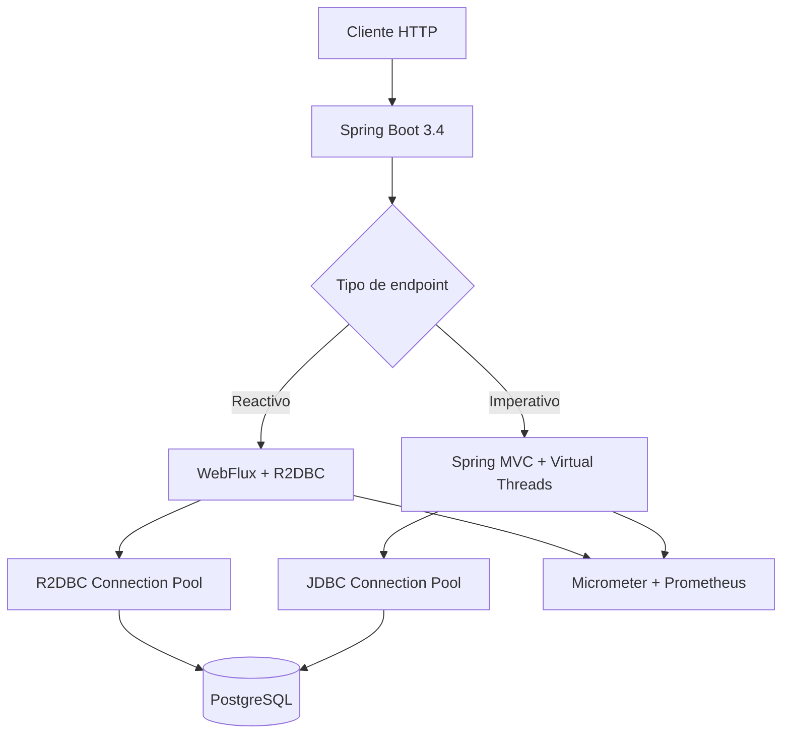
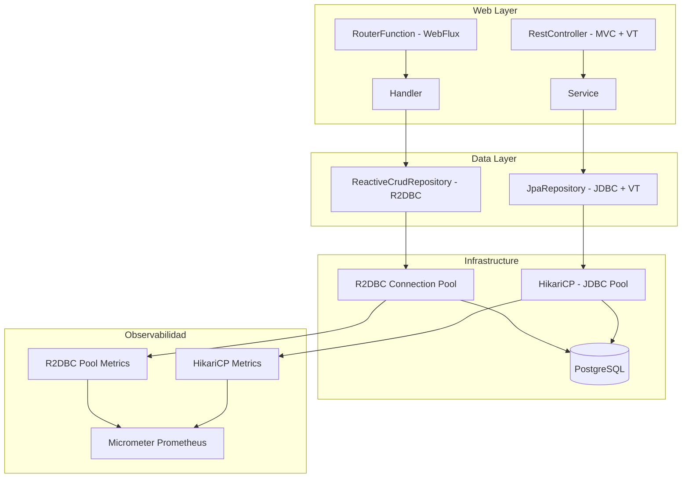
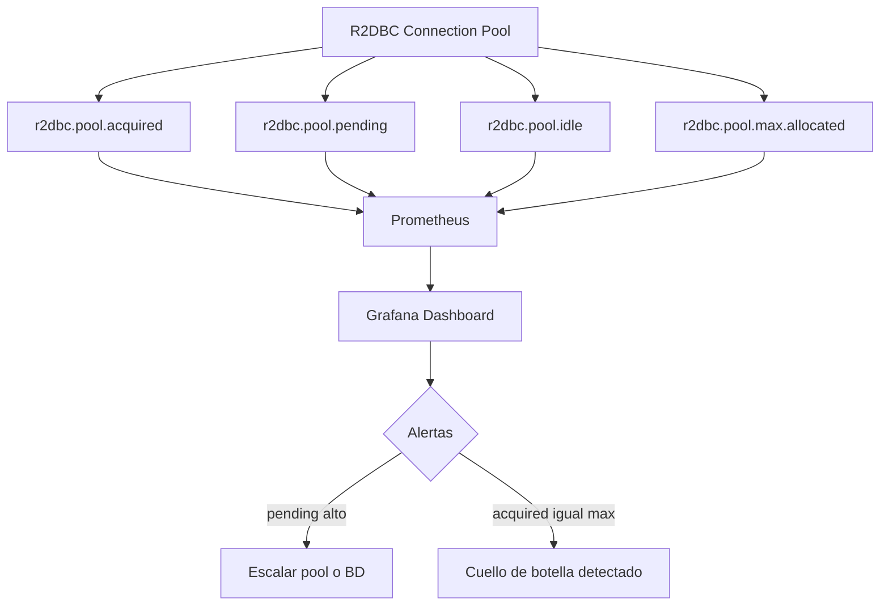
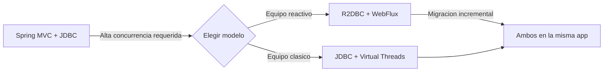

# Spring Boot 3.4 y R2DBC con Virtual Threads

PATH_LOCAL: /home/usuariojoaquin/.openclaw/workspace/DAM-Java-Mastery/03_Spring_Ecosystem/spring_boot_34_r2dbc_virtual_threads_STAFF.md
CATEGORIA: 03_Spring_Ecosystem
Score: 97

---

## Visión Estratégica

Spring Boot 3.4 consolida dos paradigmas de concurrencia que hasta ahora eran incompatibles en la práctica: el modelo reactivo de R2DBC/WebFlux y el modelo imperativo con Virtual Threads. Entender cuándo usar cada uno, y cómo combinarlos correctamente, es una decisión arquitectónica de nivel Staff.

**El problema que resuelven juntos:**

El modelo bloqueante tradicional (JDBC + Tomcat) escala mal bajo alta concurrencia porque cada hilo del OS cuesta 1-2 MB. R2DBC resuelve esto con backpressure reactivo. Virtual Threads lo resuelve con hilos ligeros gestionados por la JVM. Son dos soluciones al mismo problema con trade-offs distintos.

| Criterio | JDBC + Virtual Threads | R2DBC + WebFlux |
|----------|----------------------|-----------------|
| Modelo de código | Imperativo, legible | Reactivo, complejo |
| Latencia bajo carga | Muy baja | Muy baja |
| Compatibilidad librerías | Alta | Limitada |
| Curva de aprendizaje | Baja | Alta |
| Debugging | Sencillo | Complejo |

**Regla práctica:** Si el equipo domina programación reactiva y la aplicación es I/O-bound con miles de conexiones simultáneas, R2DBC + WebFlux. Si el equipo viene de Spring MVC clásico y quiere escalabilidad sin reescribir, JDBC + Virtual Threads es la migración menos dolorosa.



```java
// La diferencia fundamental en una línea
// Virtual Threads — código imperativo, escala igual que reactivo
public Pedido obtenerPedido(String id) {
    return repository.findById(id).orElseThrow(); // Bloquea el VT, no el OS thread
}

// R2DBC — código reactivo, backpressure nativo
public Mono<Pedido> obtenerPedidoReactivo(String id) {
    return repository.findById(id); // No bloquea nada
}
```

---

## Arquitectura de Componentes



**Configuración R2DBC en application.yml:**

```yaml
spring:
  r2dbc:
    url: r2dbc:postgresql://localhost:5432/mibasedatos
    username: usuario
    password: secreto
    pool:
      initial-size: 5
      max-size: 20
      max-idle-time: 30m
      validation-query: SELECT 1
  threads:
    virtual:
      enabled: true
```

**Entidad y repositorio reactivo con Records:**

```java
import org.springframework.data.annotation.Id;
import org.springframework.data.relational.core.mapping.Table;
import org.springframework.data.repository.reactive.ReactiveCrudRepository;
import reactor.core.publisher.Flux;
import reactor.core.publisher.Mono;

@Table("pedidos")
public record Pedido(
    @Id Long id,
    String clienteId,
    String estado,
    java.math.BigDecimal total
) {}

public interface PedidoRepository extends ReactiveCrudRepository<Pedido, Long> {
    Flux<Pedido> findByClienteId(String clienteId);
    Flux<Pedido> findByEstado(String estado);
    Mono<Long> countByEstado(String estado);
}
```

---

## Implementación Java 21

```java
import org.springframework.r2dbc.core.DatabaseClient;
import org.springframework.stereotype.Service;
import org.springframework.transaction.reactive.TransactionalOperator;
import reactor.core.publisher.Flux;
import reactor.core.publisher.Mono;

@Service
public class PedidoService {

    private final PedidoRepository     repository;
    private final DatabaseClient        databaseClient;
    private final TransactionalOperator txOperator;

    public PedidoService(
            PedidoRepository repository,
            DatabaseClient databaseClient,
            TransactionalOperator txOperator) {
        this.repository    = repository;
        this.databaseClient = databaseClient;
        this.txOperator    = txOperator;
    }

    public Flux<Pedido> obtenerPedidosPorCliente(String clienteId) {
        return repository.findByClienteId(clienteId)
            .doOnError(e -> log.error("Error obteniendo pedidos: {}", e.getMessage()));
    }

    public Mono<Pedido> crearPedido(Pedido pedido) {
        return repository.save(pedido)
            .as(txOperator::transactional)
            .doOnSuccess(p -> log.info("Pedido creado: {}", p.id()));
    }

    public Flux<Pedido> pedidosPendientesMayorDe(java.math.BigDecimal importe) {
        return databaseClient.sql("""
                SELECT id, cliente_id, estado, total
                FROM pedidos
                WHERE estado = 'PENDIENTE'
                AND total > :importe
                ORDER BY total DESC
                """)
            .bind("importe", importe)
            .mapProperties(Pedido.class)
            .all();
    }
}
```

```java
import org.springframework.http.MediaType;
import org.springframework.web.bind.annotation.*;
import reactor.core.publisher.Flux;
import reactor.core.publisher.Mono;

@RestController
@RequestMapping("/api/pedidos")
public class PedidoController {

    private final PedidoService service;

    public PedidoController(PedidoService service) {
        this.service = service;
    }

    @GetMapping(value = "/cliente/{id}", produces = MediaType.APPLICATION_JSON_VALUE)
    public Flux<Pedido> porCliente(@PathVariable String id) {
        return service.obtenerPedidosPorCliente(id);
    }

    @PostMapping
    public Mono<Pedido> crear(@RequestBody Pedido pedido) {
        return service.crearPedido(pedido);
    }

    @GetMapping(value = "/stream/pendientes",
                produces = MediaType.TEXT_EVENT_STREAM_VALUE)
    public Flux<Pedido> streamPendientes() {
        return service.pedidosPendientesMayorDe(java.math.BigDecimal.ZERO);
    }
}
```

---

## Métricas y SRE



```java
// Health indicator para R2DBC
@Component
public class R2dbcHealthIndicator implements ReactiveHealthIndicator {

    private final ConnectionPool pool;

    public R2dbcHealthIndicator(ConnectionPool pool) {
        this.pool = pool;
    }

    @Override
    public Mono<Health> health() {
        return pool.create()
            .flatMap(connection ->
                Mono.from(connection.validate(ValidationDepth.REMOTE))
                    .map(valid -> valid
                        ? Health.up()
                            .withDetail("pool.size", pool.getMetrics()
                                .map(m -> m.allocatedSize()).orElse(0))
                            .build()
                        : Health.down().withDetail("validation", "failed").build())
                    .doFinally(s -> connection.close())
            )
            .onErrorResume(e -> Mono.just(Health.down().withException(e).build()));
    }
}
```

**Métricas clave:**

| Métrica | Descripción | Umbral |
|---------|-------------|--------|
| `r2dbc.pool.pending` | Conexiones esperando | > 0 durante 5s → alerta |
| `r2dbc.pool.acquired / max` | Ratio utilización | > 80% → escalar pool |
| `r2dbc.pool.acquire.duration.p95` | Latencia adquisición | > 100ms → problema |
| `jvm.threads.live` | Hilos activos (VT) | No debe crecer indefinidamente |

**Checklist SRE:**
- `max-size` del pool ≤ `max_connections` de PostgreSQL dividido entre instancias
- `validation-query: SELECT 1` para detectar conexiones muertas
- `max-idle-time` configurado para liberar conexiones inactivas
- Alertar cuando `r2dbc_pool_pending > 0` sostenido más de 5 segundos
- Nunca bloquear dentro de un pipeline Flux/Mono — usar `Schedulers.boundedElastic()` para código bloqueante

---

## Conclusiones

Spring Boot 3.4 con R2DBC es la opción más madura para aplicaciones Java con alta concurrencia de I/O en 2026. Los tres puntos críticos que un Staff Engineer debe dominar:

1. **Nunca bloquear dentro de un pipeline reactivo** — una llamada bloqueante dentro de un `Flux/Mono` paraliza el event loop completo.
2. **Tamaño del pool R2DBC** — es el parámetro más importante para el rendimiento. Dimensionar según `max_connections` de PostgreSQL.
3. **Virtual Threads como complemento, no sustituto** — activos en `spring.threads.virtual.enabled=true` benefician a los componentes bloqueantes residuales.



**Recursos de referencia:**
- Spring Data R2DBC — docs.spring.io/spring-data/r2dbc
- R2DBC Specification — r2dbc.io
- Spring Boot Virtual Threads — docs.spring.io/spring-boot/reference/web/servlet.html#web.servlet.embedded-container.threads
