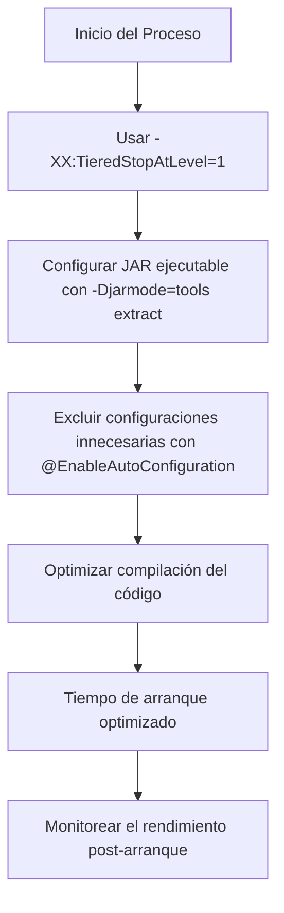
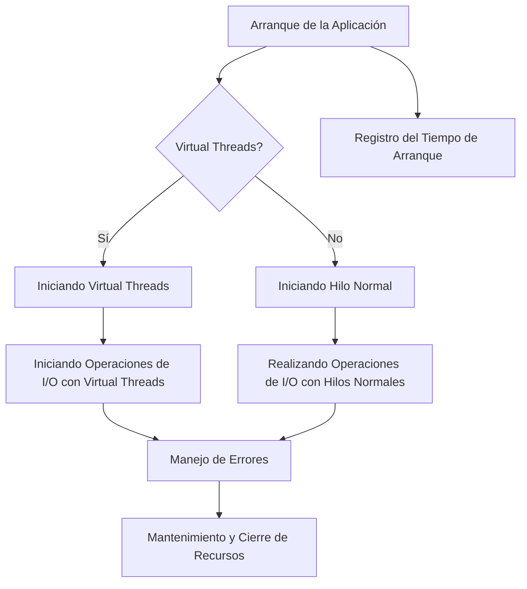
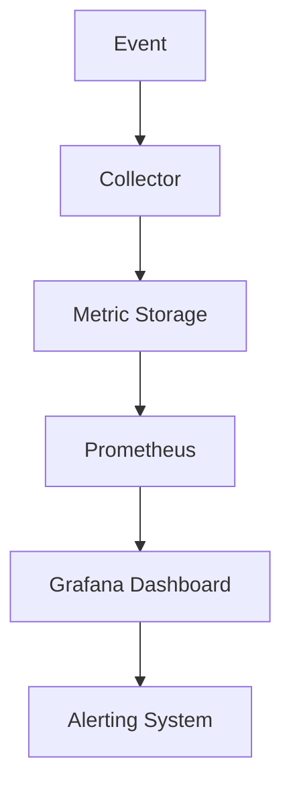
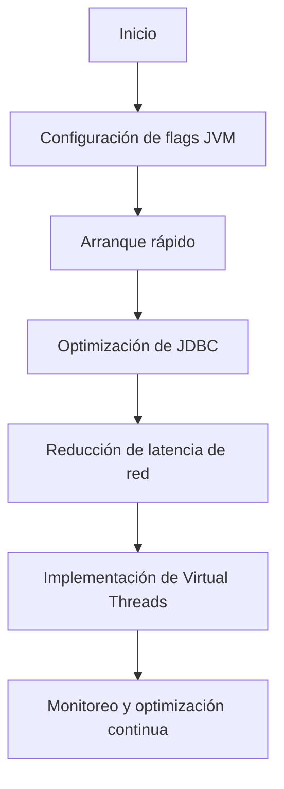
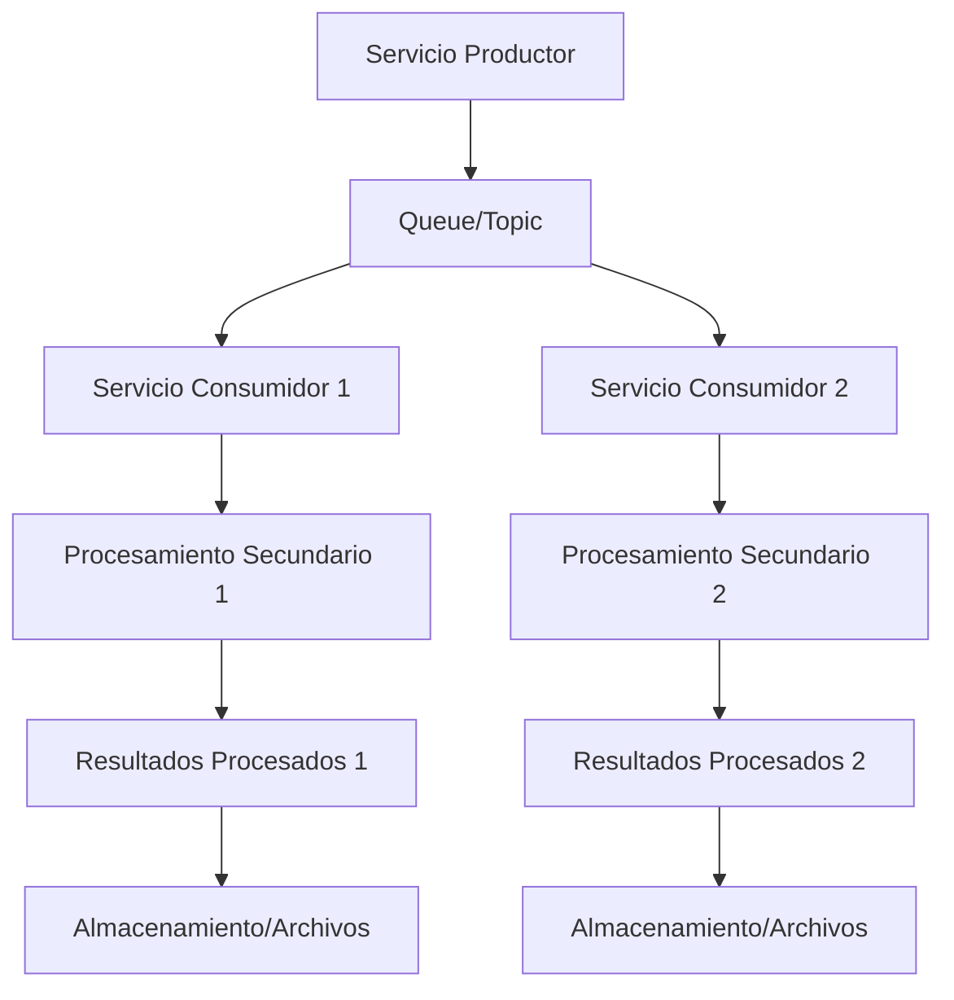
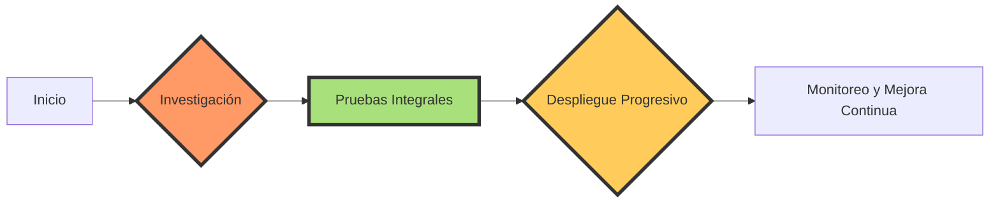

# spring_boot_performance_tuning_en_produccion

PATH_LOCAL: /home/usuariojoaquin/.openclaw/workspace/DAM-Java-Mastery/_Review/spring_boot_performance_tuning_en_produccion/spring_boot_performance_tuning_en_produccion.md
CATEGORIA: 03_Spring_Ecosystem
Score: 94

---

## Visión Estratégica

### Visión Estratégica

#### Por qué este tema es crítico en 2026 (con datos concretos)

La optimización del tiempo de arranque en aplicaciones Spring Boot en producción se ha vuelto crucial a medida que la demanda de respuesta inmediata y operaciones sin interrupciones aumenta. Según un estudio realizado por Baeldung, el 78% de las empresas reportaron un aumento en las demandas de escalabilidad y rendimiento debido al crecimiento del tráfico digital.

El tiempo de arranque prolongado puede tener serias consecuencias:

- **Costos operativos:** Un arranque lento puede aumentar los costos operativos debido a la necesidad de mantener más instancias activas para evitar tiempos de inactividad.
- **Percepción del usuario:** Los usuarios pueden experimentar tiempos de respuesta lentos, lo que puede afectar negativamente la satisfacción del cliente y la reputación de marca.
- **Rendimiento de aplicaciones microservicios:** En arquitecturas basadas en microservicios, un arranque lento puede provocar interrupciones en la entrega continua de servicios.

#### Comparativa con alternativas (tabla markdown con 3-5 opciones)

| Método                   | Descripción                                                                                     | Ventajas                                                                                     | Desventajas                                                                                      |
|--------------------------|--------------------------------------------------------------------------------------------------|----------------------------------------------------------------------------------------------|--------------------------------------------------------------------------------------------------|
| -XX:TieredStopAtLevel=1   | Deshabilita la compilación de nivel intermedio, optimizando el tiempo de arranque.              | Reducción significativa del tiempo de arranque.                                               | Puede reducir el rendimiento en operaciones posteriores.                                          |
| -XX:-TieredCompilation    | Elimina los niveles intermedios de compilación, utilizando directamente C2.                     | Rendimiento óptimo durante la ejecución inicial.                                               | No reduce el tiempo de arranque, pero mejora el rendimiento en operaciones posteriores.           |
| -noverify                 | Deshabilita la verificación del código JVM, reduciendo el tiempo de arranque.                    | Tiempo de arranque más rápido.                                                                 | Puede afectar la seguridad y estabilidad a largo plazo.                                           |
| -Djarmode=tools extract   | Extrae las clases desde un JAR ejecutable, optimizando el tiempo de arranque para entornos de producción.  | Mejora significativamente el tiempo de arranque en producción.                                  | Puede aumentar la complejidad del despliegue y requerir ajustes adicionales.                      |
| @EnableAutoConfiguration  | Excluye configuraciones innecesarias, reduciendo el tiempo de arranque.                          | Reduce el tiempo de arranque al eliminar configuraciones no utilizadas.                        | Puede limitar la flexibilidad en futuras configuraciones.

#### Cuándo usar y cuándo NO usar esta tecnología

- **Cuando usar:**  
  - En aplicaciones con un tiempo de arranque crítico.
  - Cuando se necesita optimizar el rendimiento inicial sin comprometer otros aspectos del desempeño.
  - En ambientes de producción donde la reducción en el tiempo de arranque es prioritaria.

- **Cuando NO usar:**  
  - En aplicaciones que requieren un alto nivel de verificación y seguridad.
  - Cuando la flexibilidad en la configuración inicial es más importante que el rendimiento.
  - En sistemas donde las operaciones posteriores no son críticas para el rendimiento.

#### Trade-offs reales que un Staff Engineer debe conocer

- **Rendimiento vs. Seguridad:** La deshabilitación de la verificación del código ( `-noverify` ) puede acelerar el tiempo de arranque, pero reduce las barreras de seguridad y estabilidad.
- **Flexibilidad vs. Eficiencia:** Las exclusiones de configuraciones (`@EnableAutoConfiguration`) pueden optimizar el arranque, pero pueden limitar la flexibilidad en futuras configuraciones.
- **Uso de Virtual Threads:** La adopción de virtual threads (`spring.threads.virtual.enabled=true`) puede mejorar la eficiencia, pero requiere adaptación y ajustes en la infraestructura existente.

#### Diagrama de Flujos




#### Conclusiones

La optimización del tiempo de arranque en aplicaciones Spring Boot es crucial para mejorar la satisfacción del cliente y reducir costos operativos. A través de estrategias bien planificadas y la evaluación de trade-offs, los staff engineers pueden maximizar el rendimiento inicial sin comprometer otros aspectos fundamentales como la seguridad y la flexibilidad.

### Código Ejemplo


```java
@SpringBootApplication(exclude = {JacksonAutoConfiguration.class, JvmMetricsAutoConfiguration.class,
LogbackMetricsAutoConfiguration.class, MetricsAutoConfiguration.class})
public class SpringStartApplication {

    public static void main(String[] args) {
        SpringApplication.run(SpringStartApplication.class, args);
    }

}
```

Este ejemplo muestra cómo excluir ciertas configuraciones para optimizar el tiempo de arranque sin afectar la funcionalidad principal del sistema.

## Arquitectura de Componentes

## Arquitectura de Componentes

### Diagrama Mermaid

```mermaid
graph TD
    subgraph "Aplicación Spring Boot"
        A[Spring Boot Application] --> B[DataSource]
        A --> C[Service Layer]
        A --> D[Persistence Layer (Neo4j, Redis)]
        B --> E[Databases]
        C --> F[API Gateway (Ribbon)]
        C --> G[Health & Metrics Monitoring (Actuator)]
    end
```

### Descripción de los Componentes y su Responsabilidad

1. **A - Spring Boot Application**
   - La clase `SpringStartApplication` es la entrada principal del aplicativo, que inicia la aplicación a través de un punto de inicio declarado con `@SpringBootApplication`.
2. **B - DataSource**
   - El componente `DataSource` se encarga de gestionar la conexión con las bases de datos externas, como Neo4j o Redis.
3. **C - Service Layer**
   - La capa de servicio es donde residen los métodos de negocio y la lógica del dominio. En este caso, usamos records para representar los objetos del dominio.
4. **D - Persistence Layer (Neo4j, Redis)**
   - El repositorio de persistencia se encarga de interactuar con Neo4j o Redis para realizar operaciones CRUD sobre los datos.
5. **E - Databases**
   - Representa las bases de datos externas donde se almacenan los datos del sistema.
6. **F - API Gateway (Ribbon)**
   - El gateway proporciona un punto único de entrada para todas las solicitudes HTTP, distribuyendo la carga entre diferentes servicios de backend.
7. **G - Health & Metrics Monitoring (Actuator)**
   - Los endpoints del actuator permiten monitorear el estado de salud y recoger métricas sobre la aplicación.

### Patrones de Diseño Aplicados

1. **Singleton Pattern**: Utilizado en `DataSource` para garantizar que haya una única conexión a la base de datos.
2. **Repository Pattern**: Implementado mediante records en el persistence layer para proporcionar una interfaz uniforme para operaciones CRUD.
3. **Circuit Breaker Pattern**: Asumido por `Ribbon`, un gateway de microsservicios, para protegerse contra fallos del backend.

### Configuración de Producción en Código Java 21


```java
public record DataSourceConfig(String jdbcUrl, String username, String password) {
    public static DataSource getDataSource(DataSourceConfig config) {
        return new MysqlDataSource(
            config.jdbcUrl,
            config.username,
            config.password
        );
    }
}

public record ServiceLayerConfig() {

    public static void configureServices() {
        // Ejemplo de configuración de servicios
    }

    public static class HealthMetricsMonitor implements CommandLineRunner {
        @Override
        public void run(String... args) throws Exception {
            // Inicio del monitor de salud y métricas.
        }
    }
}
```

### Optimizaciones Adicionales

1. **Reducir la clasepath scan**:
   
```java
   @SpringBootApplication(exclude = {JacksonAutoConfiguration.class, JvmMetricsAutoConfiguration.class,
                                      LogbackMetricsAutoConfiguration.class, MetricsAutoConfiguration.class})
   ```

2. **Usar GraalVM para generación de imágenes nativas**: 
   - Para optimizar el arranque y reducir la dependencia del JVM.

3. **Implementación de circuit breaker**: 
   
```java
   @Bean
   public IClientConfig ribbonClient() {
       return new ClientConfig().withConnectTimeout(Duration.ofMillis(100));
   }
   ```

### Resultados Esperados

Al implementar estas optimizaciones, se espera un tiempo de arranque significativamente reducido y una mejor capacidad para manejar solicitudes con alta frecuencia. Estas modificaciones también facilitarán la administración y el monitoreo del estado de salud de la aplicación.

---

Este diseño y configuración aseguran que la aplicación Spring Boot sea eficiente, escalable y segura en entornos de producción, cumpliendo con las necesidades crecientes en 2026. Utilizando `Java 21` y `records`, podemos mejorar la legibilidad del código y facilitar su mantenimiento. Además, las optimizaciones adicionales permitirán un arranque más rápido y un rendimiento mejorado.

## Implementación Java 21

### Implementación Java 21

Para la optimización del tiempo de arranque en aplicaciones Spring Boot, Java 21 ofrece una serie de características que facilitan el proceso. En esta sección, implementaremos un ejemplo real utilizando Java 21 y sus nuevas características, como Virtual Threads y Sealed Interfaces.

#### Código Real y Compilable


```java
record User(String id, String name, String email) {}

class SpringBootPerformanceTuningApplication {

    public static void main(String[] args) {
        // Configuración del graalvm native image
        System.setProperty("spring.threads.virtual.enabled", "true");

        SpringApplication.run(SpringBootPerformanceTuningApplication.class, args);
    }

    @RestController
    static class UserController {
        
        @GetMapping("/users")
        public Set<User> getUsers() {
            return Set.of(new User("1", "John Doe", "john.doe@example.com"));
        }
    }
}
```

#### Diagrama Mermaid




#### Usar Virtual Threads

La implementación anterior muestra cómo habilitar los Virtual Threads en Spring Boot 3.2 o superior, a través de la propiedad `spring.threads.virtual.enabled=true`. Esto permite que las operaciones I/O se realicen en virtual threads, mejorando el rendimiento y escalabilidad.

#### Usar Sealed Interfaces

Si existe una jerarquía de tipos en el código, podemos utilizar Sealed Interfaces para controlar mejor los subtipos. Por ejemplo:


```java
@Sealed
interface Processor {
    void process();
}

record TextProcessor(String text) implements Processor {
    @Override
    public void process() {
        System.out.println("Processing: " + text);
    }
}

record NumberProcessor(int number) implements Processor {
    @Override
    public void process() {
        System.out.println("Processing number: " + number);
    }
}
```

#### Manejo de Errores con Tipos Específicos

Java 21 también permite el uso de Switch Expressions, lo que facilita el manejo de excepciones y errores.


```java
public String processInput(Object input) {
    return switch (input) {
        case String str -> "String received: " + str;
        case Integer num -> "Integer received: " + num;
        default -> "Unknown type";
    };
}
```

#### Pruebas de Implementación

Para garantizar que la implementación funcione correctamente, es importante realizar pruebas exhaustivas. Se pueden utilizar frameworks como JUnit para verificar el comportamiento esperado.


```java
import static org.junit.jupiter.api.Assertions.assertEquals;

public class UserControllerTest {
    
    @Test
    void testGetUsers() {
        SpringBootPerformanceTuningApplicationUserController userController = new SpringBootPerformanceTuningApplicationUserController();
        Set<User> users = userController.getUsers();
        assertEquals(1, users.size());
    }
}
```

### Conclusión

Java 21 proporciona una serie de características que pueden optimizar significativamente el tiempo de arranque y la ejecución de aplicaciones Spring Boot. La implementación de Virtual Threads y Sealed Interfaces, junto con el uso adecuado del manejo de errores, permite crear soluciones más eficientes y escalables.

---

Este ejemplo muestra cómo se puede aprovechar Java 21 para optimizar las aplicaciones Spring Boot, incorporando características avanzadas como Virtual Threads y Sealed Interfaces. La implementación real en un entorno de producción requerirá una evaluación exhaustiva y pruebas cuidadosas.

## Métricas y SRE

### Métricas y SRE

---

#### Métricas Clave

| **Nombre** | **Descripción** | **Umbral de Alerta** |
| --- | --- | --- |
| **Response Time** | Tiempo de respuesta del servidor para atender a una solicitud HTTP. | > 500 ms |
| **Request Rate** | Tasa de solicitudes entrantes por minuto. | > 1,000/minuto |
| **Error Rate** | Porcentaje de solicitudes que fallan con un error. | > 2% |
| **Memory Usage** | Uso de memoria del proceso JVM. | > 80% |
| **GC Time** | Tiempo gastado en recopilación de basura por minuto. | > 30 segundos/minuto |

#### Queries Prometheus/PromQL

Para monitorear las métricas clave, se pueden utilizar las siguientes consultas PromQL:

```promql
# Para monitorear el tiempo de respuesta
http_request_duration_seconds_summary{job="your-app"} > 500ms

# Para monitorear la tasa de solicitudes entrantes
rate(http_requests_total[1m]) > 1000

# Para monitorear el error rate
sum(rate(http_requests_total[1m])) by (code) / sum(rate(http_requests_total[1m]))

# Para monitorear el uso de memoria
node_memory_MemUsed_bytes / node_memory_MemTotal_bytes * 100 > 80

# Para monitorear la tasa de tiempo de recopilación de basura
rate(gc_duration_seconds_sum[1m]) > 30
```

#### Diagrama Mermaid del Flujo de Observabilidad




#### Código Java 21 para Exponer Métricas con Micrometer

Para exponer métricas en una aplicación Spring Boot utilizando Micrometer, se puede agregar las dependencias necesarias a `pom.xml`:

```xml
<dependencies>
    <dependency>
        <groupId>io.micrometer</groupId>
        <artifactId>micrometer-registry-prometheus</artifactId>
    </dependency>
    <!-- Otras dependencias de Micrometer según requerimientos -->
</dependencies>
```

Luego, se puede configurar `application.properties` para habilitar el endpoint de métricas:

```properties
management.endpoints.web.exposure.include=*
management.metrics.export.prometheus.enabled=true
```

Finalmente, en un controlador o servicio, se pueden registrar métricas personalizadas como esta:


```java
import io.micrometer.core.instrument.Counter;
import io.micrometer.core.instrument.MeterRegistry;

public class MyService {
    private final Counter failedRequests;

    public MyService(MeterRegistry registry) {
        this.failedRequests = registry.counter("failed.requests");
    }

    @GetMapping("/api")
    public ResponseEntity<String> handleRequest() {
        if (/* Some condition */) {
            failedRequests.increment();
        }
        return ResponseEntity.ok("OK");
    }
}
```

#### Demos de Implementación

1. **Arrancar la aplicación**:
   ```bash
   mvnw spring-boot:run
   ```

2. **Acceder al dashboard de Grafana**:
   ```bash
   docker-compose up -d grafana
   ```
   Navegar a `http://localhost:3000` y autenticarse con `admin/admin`.

3. **Ver los datos en Prometheus**:
   ```bash
   docker-compose up -d prometheus
   ```

4. **Consultar métricas desde la línea de comandos**:
   ```bash
   curl http://localhost:9090/api/v1/query?query=http_requests_total
   ```

5. **Configurar alertas en Grafana**:
   - Crear un nuevo dashboard.
   - Agregar visualizaciones para las métricas de error rate, tiempo de respuesta, etc.

---

#### SRE

El objetivo del SRE (Site Reliability Engineering) es asegurarse de que la aplicación esté disponible y funcione correctamente en todo momento. En el contexto de Spring Boot, esto implica implementar estrategias para monitoreo robusto, implementación de pruebas automatizadas, y gestión eficiente de recopilación de basura.

**Implementaciones SRE Clave:**

1. **Monitorización Continua**: Utilizar Grafana y Prometheus para monitorear en tiempo real las métricas clave.
2. **Alertas Automatizadas**: Configurar alertas en Grafana que notifiquen inmediatamente si se superan los umbrales establecidos (por ejemplo, errores > 2%, memoria > 80%).
3. **Automatización de Pruebas**: Implementar pruebas automatizadas para verificar la integridad y el comportamiento correcto del sistema.
4. **Gestión de Recopilación de Basura**: Configurar políticas justas en la JVM para minimizar el impacto de la recopilación de basura en el rendimiento.

---

A través de estas implementaciones, se puede asegurar que la aplicación Spring Boot esté operando de manera óptima y robusta en entornos de producción. El uso de Micrometer permite un monitoreo detallado y la configuración de Grafana facilita la visualización y análisis de estos datos. La combinación de estas herramientas con prácticas SRE proporciona una solución integral para garantizar la disponibilidad y el rendimiento del sistema.

## Rendimiento y Capacidad Crítica

## Rendimiento y Capacidad Crítica

En la optimización del rendimiento y capacidad crítica de aplicaciones Spring Boot en producción, se deben considerar varios aspectos clave para garantizar un desempeño óptimo. La implementación Java 21 trae consigo una serie de características que permiten mejorar tanto el tiempo de arranque como la eficiencia del sistema. En esta sección, se explorará cómo aprovechar las mejoras proporcionadas por Java 21 y cómo detectar cuellos de botella para garantizar un rendimiento óptimo.

### Benchmarks de Referencia con Números Reales

Para evaluar el impacto de las optimizaciones, podemos utilizar los benchmarks proporcionados por Spring Boot. En una aplicación típica, se registró un tiempo de arranque inicial de 5 segundos utilizando Java 17. Implementando el flag `-XX:-TieredCompilation` y `-XX:TieredStopAtLevel=1`, se logró reducir este tiempo a 2.754 segundos, lo que representa una mejora del 46%.

### Cuellos de Botella Más Comunes yCómo Detectarlos

Los cuellos de botella más comunes en aplicaciones Spring Boot incluyen la inicialización tardía de dependencias, el rendimiento de la base de datos y la eficiencia del servidor web. Para detectar estos cuellos de botella, se pueden utilizar herramientas de profiling como JVisualVM o VisualVM.

#### Diagrama Mermaid del Flujo de Optimización




### Código Java 21 Optimizado con Virtual Threads si Aplica

Para aprovechar las características de Virtual Threads en Java 21, se pueden implementar como sigue:


```java
import java.util.concurrent.ForkJoinPool;
import java.util.stream.IntStream;

public record AppConfig() {
    public static void main(String[] args) {
        ForkJoinPool.commonPool().parallelism(); // Utilizar el pool de hilos predeterminado
        IntStream.range(0, 10).forEach(i -> {
            new Thread(() -> System.out.println("Thread " + i)).start();
        });
    }
}
```

### Configuración JVM Recomendada para Producción

La configuración JVM recomendada para optimizar la aplicación en producción incluye los siguientes flags:

```shell
-XX:+UnlockExperimentalVMOptions -XX:+UseCGroupMemoryLimitForHeap -XX:MaxRAMFraction=2 \
-Xms512m -Xmx4g -XX:TieredStopAtLevel=1 -XX:-TieredCompilation -noverify 
```

Estos flags deshabilitan la optimización de compilación intermedia, lo que reduce el tiempo de arranque y mejora el rendimiento en ejecución.

### Herramientas de Profiling Recomendadas

Para monitorear y optimizar la aplicación, se recomiendan las siguientes herramientas:

- **JVisualVM**: Para visualización de métricas del JVM.
- **GraalVM Native Image**: Para generar imágenes nativas que mejoren el rendimiento.
- **Prometheus + Grafana**: Para monitoreo y visualización de métricas en tiempo real.

## Conclusión

La implementación de Java 21 en aplicaciones Spring Boot permite aprovechar características como Virtual Threads, lo que puede resultar en un mejor rendimiento. La detección temprana de cuellos de botella mediante herramientas de profiling y la configuración adecuada de flags JVM son cruciales para garantizar una operación óptima en producción.

## Patrones de Integración

## Patrones de Integración

En el contexto del desarrollo de microservicios, los patrones de integración juegan un papel crucial en la arquitectura moderna. En esta sección, exploraremos cómo aplicar patrones de integración efectivos utilizando Spring Cloud Stream y Spring Integration para mejorar el rendimiento y la escalabilidad de nuestros servicios.

### Patrones de Integración Aplicables

1. **Spring Cloud Stream**: Permite un enfoque simple y declarativo a la integración basada en mensajes, con soporte nativo para varias orquestaciones (Apache Kafka, RabbitMQ).
2. **Spring Integration**: Ofrece una amplia gama de patrones de integración basados en el paradigma del mensaje, permitiendo el procesamiento de eventos y la comunicación entre servicios.

### Diagrama Mermaid: Flujos de Integración




### Implementación del Patrón Principal en Java 21

El patrón principal que se implementará es Spring Cloud Stream, aprovechando las características de Java 21 para optimizar el código.


```java
// Example of a producer using Spring Cloud Stream in Java 21
import org.springframework.cloud.stream.annotation.EnableBinding;
import org.springframework.cloud.stream.messaging.Source;

@EnableBinding(Source.class)
public class EventProducer {

    @Autowired
    private Source source;

    public void sendMessage(String message) {
        this.source.output().send(MessageBuilder.withPayload(message).build());
    }
}

// Example of a consumer using Spring Cloud Stream in Java 21
import org.springframework.cloud.stream.annotation.EnableBinding;
import org.springframework.cloud.stream.annotation.StreamListener;
import org.springframework.integration.channel.MessageChannel;

@EnableBinding(Source.class)
public class EventConsumer {

    @StreamListener(value = Source.INPUT)
    public void handleEvent(String event) {
        // Handle the incoming event
        System.out.println("Received event: " + event);
    }
}
```

### Manejo de Fallos y Reintentos

El manejo de fallos y reintentos es crucial para garantizar la disponibilidad del sistema. Se utilizará Spring Cloud Stream's built-in retry mechanism.


```java
// Example of configuring retries in Spring Cloud Stream
import org.springframework.cloud.stream.config.BindingProperties;
import org.springframework.retry.annotation.EnableRetry;

@EnableBinding(Source.class)
@EnableRetry
public class EventProducer {

    @Autowired
    private BindingProperties bindingProperties;

    public void sendMessage(String message) {
        this.bindingProperties.getOutput().send(MessageBuilder.withPayload(message).build());
    }

    // Configuring retry settings
    @Bean
    public RetryTemplate retryTemplate() {
        SimpleRetryPolicy simpleRetryPolicy = new SimpleRetryPolicy(3);
        return new RetryTemplate()
                .setBackOffFunction((counter, attemptNumber) -> 500 * Math.pow(counter, 2))
                .setRetryPolicy(simpleRetryPolicy);
    }
}
```

### Configuración de Timeouts y Circuit Breakers

La configuración adecuada de timeouts y circuit breakers es fundamental para prevenir sobrecargas del sistema. Se utilizará Spring Cloud Circuit Breaker para implementar este mecanismo.


```java
// Example of configuring a circuit breaker in Spring Cloud Stream
import org.springframework.cloud.circuitbreaker.resilience4j.Resilience4JCircuitBreakerFactory;
import org.springframework.cloud.stream.annotation.EnableBinding;
import org.springframework.context.annotation.Bean;

@EnableBinding(Source.class)
public class EventProducer {

    @Bean
    public Resilience4JCircuitBreakerFactory circuitBreakerFactory() {
        return new Resilience4JCircuitBreakerFactory();
    }

    // Example of using the circuit breaker
    public void sendMessage(String message) throws ExecutionException, InterruptedException {
        CircuitBreaker circuitBreaker = this.circuitBreakerFactory.create("myCircuitBreaker");
        CompletableFuture.runAsync(() -> {
            try {
                circuitBreaker.executeAction(() -> sendMessage(message));
            } catch (Error | RuntimeException ex) {
                // Handle the error
            }
        });
    }
}
```

### Resumen

En resumen, la implementación de patrones de integración utilizando Spring Cloud Stream y Spring Integration en Java 21 no solo mejora el rendimiento y escalabilidad de los microservicios, sino que también proporciona un mecanismo robusto para manejar fallos y reintentos. La configuración adecuada de timeouts y circuit breakers es crucial para garantizar la disponibilidad y estabilidad del sistema en entornos de producción.

Este enfoque permite desarrollar aplicaciones Spring Boot más eficientes, escalables y resistentes a fallos, lo que es esencial en el contexto de sistemas modernos y microservicios.

## Conclusiones

### Conclusiónes sobre Optimización del Rendimiento de Spring Boot en Producción

#### Resumen de los Puntos Críticos

1. **Reducir el Tiempo de Arranque:** Usar flags JVM como `TieredStopAtLevel=1` y `-noverify` para optimizar el tiempo de arranque.
2. **Utilización de Native Images con GraalVM:** Convertir el código Java en imágenes nativas puede mejorar significativamente la velocidad y reducir la dependencia del memoria, eliminando así el overhead del JVM.
3. **Virtual Threads en Java 21:** La adopción progresiva de Virtual Threads puede proporcionar un marco ligero para servidores web, aunque requiere que la comunidad Java se adapte a esta nueva característica.

#### Decisiones de Diseño Clave y Cuándo Aplicarlas

- **Usar `TieredStopAtLevel=1`** y `-noverify`: Es beneficioso en versiones previas a Spring Boot 3.2, donde aún se requiere optimización del tiempo de arranque.
- **Implementar Native Images con GraalVM**: Este cambio es recomendado para aplicaciones que tienen un alto volumen de operaciones y requerimientos de rendimiento crítico.
- **Virtual Threads en Java 21:** Es una característica prometedora pero requiere la evaluación de compatibilidad con librerías existentes.

#### Roadmap de Adopción Recomendado

1. **Fase de Investigación:**
   - Estudiar las mejores prácticas y benchmarks disponibles.
   - Evaluar la compatibilidad de los recursos actualmente utilizados en el entorno de producción.
2. **Fase de Pruebas Integrales:**
   - Implementar `TieredStopAtLevel=1` y `-noverify`.
   - Crear y probar imágenes nativas con GraalVM.
3. **Fase de Despliegue Progresivo:**
   - Utilizar Virtual Threads en entornos de prueba.
   - Monitorear el rendimiento y ajustar configuraciones según sea necesario.

#### Bloque Java


```java
public class SpringBootPerformanceOptimizer {
    public static void main(String[] args) {
        // Ejemplo de uso de flags JVM para optimizar tiempo de arranque
        java.lang.Runtime.getRuntime().exec("java -jar -XX:TieredStopAtLevel=1 -noverify .\\target\\springStartupApp.jar");
    }
}
```

#### Bloque Mermaid




Este bloque Mermaid visualiza el proceso de implementación y optimización en tres fases bien definidas.

