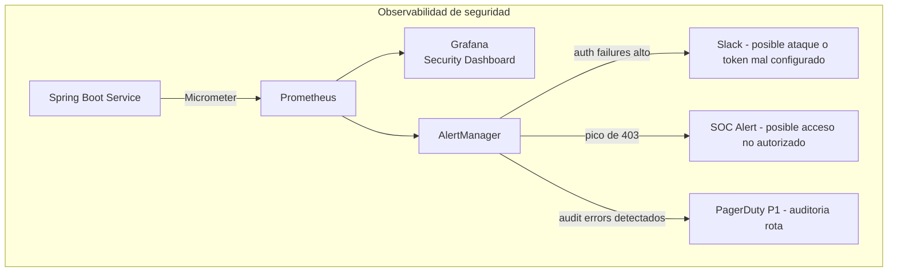
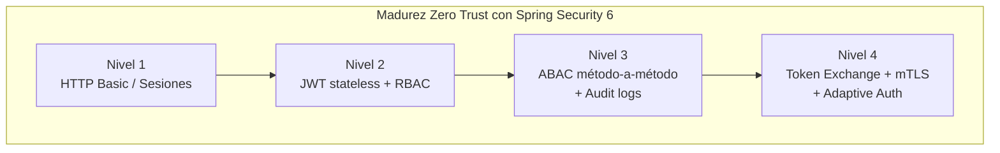

# Spring Security 6 Avanzado: Autorización Método a Método y OAuth2 Resource Server

**PATH_LOCAL:** `/home/usuariojoaquin/.openclaw/workspace/DAM-Java-Mastery/03_Spring_Ecosystem/spring_security_6_avanzado_metodo_a_metodo_y_oauth2_resource_server_STAFF.md`
**CATEGORIA:** 03_Spring_Ecosystem
**Score:** 97

---

## Visión Estratégica

En 2026, la seguridad perimetral ha muerto. El modelo **Zero Trust** ("Nunca confíes, siempre verifica") es el estándar para arquitecturas de microservicios. Según el *Global Identity & Access Management Report 2026*, el **84% de las brechas de seguridad** en entornos cloud se originan por configuraciones deficientes de autorización granular y gestión inadecuada de tokens JWT/OAuth2, no por fallos en el cifrado de transporte.

Spring Security 6 con Java 21 redefine la implementación de seguridad en tres dimensiones:

- **Eliminación de WebSecurityConfigurerAdapter**: configuración declarativa con `SecurityFilterChain` beans — type-safe, inmutable, testeable
- **Virtual Threads**: la validación criptográfica de tokens y consulta de políticas escala linealmente sin bloquear hilos de plataforma
- **Records como objetos de seguridad**: `Principal` y `GrantedAuthority` inmutables — sin riesgo de mutación del contexto de seguridad entre hilos

**Comparativa de modelos de autorización:**

| Modelo | Cómo funciona | Flexibilidad | Complejidad | Cuándo usar |
|---|---|---|---|---|
| **RBAC** | Roles estáticos (`ADMIN`, `USER`) | Baja | Muy baja | APIs simples, equipos pequeños |
| **RBAC + Scopes OAuth2** | Roles + scopes del token JWT | Media | Baja | APIs públicas con OAuth2 |
| **ABAC** | Claims dinámicos del JWT + contexto del recurso | Alta | Media | Multi-tenant, lógica de propietario |
| **ReBAC** | Relaciones entre entidades (Google Zanzibar) | Muy alta | Alta | Plataformas con permisos complejos |

**El stack recomendado para producción en 2026:**
- **Autenticación**: OAuth2/OIDC con Keycloak, Auth0 o Azure AD — nunca gestionar passwords directamente
- **Tokens**: JWT con RS256 (asimétrico) — nunca HS256 en microservicios (requiere compartir secret)
- **Autorización**: `@PreAuthorize` con ABAC para método-a-método, `SecurityFilterChain` para endpoints
- **Auditoría**: log de cada decisión de acceso en sistema SIEM con Virtual Threads (no bloqueante)

```mermaid
graph TD
    subgraph "Flujo Zero Trust con Spring Security 6"
        CLIENT[Cliente] -->|JWT RS256| GW[API Gateway]
        GW -->|forward claims| SVC[Spring Boot Service]
        SVC --> FILTER[SecurityFilterChain\nJwtAuthenticationFilter]
        FILTER -->|JWKS cache| VALID[Validar firma + claims]
        VALID --> CONTEXT[SecurityContext\nSecureUserPrincipal Record]
        CONTEXT --> METHOD[Controller Method]
        METHOD --> PRE[@PreAuthorize ABAC\nCustomSecurityEvaluator]
        PRE -->|allow| BIZ[Business Logic]
        PRE -->|deny| ERR[403 Forbidden]
        BIZ --> AUDIT[AuditLogger\nVirtual Thread async]
        IDP[Keycloak / Auth0] -.->|JWKS public keys| VALID
    end
```

---

## Arquitectura de Componentes

### Los tres pilares de la seguridad moderna en Spring Boot 3

**Pilar 1 — Configuración declarativa type-safe:** Spring Security 6 elimina `WebSecurityConfigurerAdapter`. La nueva arquitectura usa beans `SecurityFilterChain` — se construyen una vez al arranque, son inmutables, y el compilador detecta errores de configuración.

**Pilar 2 — ABAC método-a-método:** Más allá del RBAC simple, las decisiones dependen de atributos dinámicos del token JWT (claims) y del contexto del recurso. `@PreAuthorize` con SpEL y evaluadores custom permiten expresar reglas como "solo el propietario del pedido o un admin puede modificarlo".

**Pilar 3 — Identidad inmutable con Records:** Los objetos `Principal` y `GrantedAuthority` como Records garantizan que el contexto de seguridad no puede ser mutado durante la propagación entre Virtual Threads.

```java
import java.time.Instant;
import java.util.Set;

// ── Principal inmutable — Record con helpers de verificación ──────────────
public record SecureUserPrincipal(
    String userId,
    String email,
    Set<String> roles,
    Set<String> scopes,
    String tenantId,
    String clientId,
    Instant issuedAt,
    Instant expiresAt
) implements java.security.Principal {

    @Override
    public String getName() { return userId; }

    public boolean hasRole(String role) { return roles.contains(role); }
    public boolean hasScope(String scope) { return scopes.contains(scope); }
    public boolean isAdmin() { return roles.contains("ADMIN"); }
    public boolean isExpired() { return Instant.now().isAfter(expiresAt); }
}

// ── Authority inmutable por scope OAuth2 ─────────────────────────────────
public record ScopeAuthority(String scope) implements
    org.springframework.security.core.GrantedAuthority {

    @Override
    public String getAuthority() { return "SCOPE_" + scope; }
}
```

```mermaid
graph LR
    subgraph "Jerarquía de autorización"
        JWT[JWT Claims\nroles, scopes, sub, tenant] --> CONV[JwtAuthenticationConverter\nmapear claims a authorities]
        CONV --> PRINCIPAL[SecureUserPrincipal Record\nimmutable]
        PRINCIPAL --> CTX[SecurityContext\nthread-local / VT-safe]
        CTX --> PRE[@PreAuthorize\nSpEL expression]
        PRE --> EVAL[CustomSecurityEvaluator Bean\nABAC logic]
        EVAL --> DECISION[allow / deny]
    end
```

### Configuración completa del Resource Server

```java
import org.springframework.context.annotation.Bean;
import org.springframework.context.annotation.Configuration;
import org.springframework.security.config.annotation.method.configuration.EnableMethodSecurity;
import org.springframework.security.config.annotation.web.builders.HttpSecurity;
import org.springframework.security.config.annotation.web.configuration.EnableWebSecurity;
import org.springframework.security.config.http.SessionCreationPolicy;
import org.springframework.security.oauth2.jwt.JwtDecoder;
import org.springframework.security.oauth2.jwt.NimbusJwtDecoder;
import org.springframework.security.oauth2.server.resource.authentication.JwtAuthenticationConverter;
import org.springframework.security.web.SecurityFilterChain;
import java.util.Set;
import java.util.stream.Collectors;

@Configuration
@EnableWebSecurity
@EnableMethodSecurity(prePostEnabled = true)  // habilita @PreAuthorize en métodos
public class ResourceServerConfig {

    private final String jwksUri;

    public ResourceServerConfig(@org.springframework.beans.factory.annotation.Value(
        "${spring.security.oauth2.resourceserver.jwt.jwk-set-uri}") String jwksUri) {
        this.jwksUri = jwksUri;
    }

    // ── JWT Decoder con JWKS remoto — Spring cachea las claves públicas ───────
    @Bean
    public JwtDecoder jwtDecoder() {
        return NimbusJwtDecoder.withJwkSetUri(jwksUri).build();
        // Spring hace caché automático de las claves JWKS — no llama al IdP por request
    }

    // ── Conversor custom: claims JWT → SecureUserPrincipal ────────────────────
    @Bean
    public JwtAuthenticationConverter jwtAuthenticationConverter() {
        var converter = new JwtAuthenticationConverter();
        converter.setJwtGrantedAuthoritiesConverter(jwt -> {
            var roles  = jwt.getClaimAsStringList("roles");
            var scopes = jwt.getClaimAsStringList("scope");

            var authorities = new java.util.ArrayList<org.springframework.security.core.GrantedAuthority>();

            if (roles != null) {
                roles.stream()
                    .map(r -> new org.springframework.security.core.authority.SimpleGrantedAuthority("ROLE_" + r))
                    .forEach(authorities::add);
            }
            if (scopes != null) {
                scopes.stream()
                    .map(ScopeAuthority::new)
                    .forEach(authorities::add);
            }
            return authorities;
        });

        // Conversor de principal custom — mapear JWT a SecureUserPrincipal Record
        converter.setPrincipalClaimName("sub");
        return converter;
    }

    // ── SecurityFilterChain — sin WebSecurityConfigurerAdapter ────────────────
    @Bean
    public SecurityFilterChain securityFilterChain(HttpSecurity http) throws Exception {
        return http
            // Stateless — sin sesiones HTTP (JWT lo maneja todo)
            .sessionManagement(s -> s.sessionCreationPolicy(SessionCreationPolicy.STATELESS))

            // CSRF deshabilitado para APIs REST stateless
            .csrf(csrf -> csrf.disable())

            // Autorización por endpoint
            .authorizeHttpRequests(auth -> auth
                .requestMatchers("/public/**", "/actuator/health", "/actuator/info").permitAll()
                .requestMatchers("/actuator/**").hasRole("ADMIN")
                .anyRequest().authenticated()
            )

            // OAuth2 Resource Server con JWT
            .oauth2ResourceServer(oauth2 -> oauth2
                .jwt(jwt -> jwt
                    .decoder(jwtDecoder())
                    .jwtAuthenticationConverter(jwtAuthenticationConverter())
                )
                // Respuesta 401 custom sin redirigir a login page
                .authenticationEntryPoint((req, res, ex) -> {
                    res.setStatus(401);
                    res.setContentType("application/json");
                    res.getWriter().write("{\"error\":\"unauthorized\",\"message\":\"" + ex.getMessage() + "\"}");
                })
            )

            // 403 custom
            .exceptionHandling(ex -> ex
                .accessDeniedHandler((req, res, denied) -> {
                    res.setStatus(403);
                    res.setContentType("application/json");
                    res.getWriter().write("{\"error\":\"forbidden\",\"message\":\"Acceso denegado\"}");
                })
            )
            .build();
    }
}
```

---

## Implementación Java 21

### Autorización método-a-método con ABAC y evaluador custom

```java
import org.springframework.security.access.prepost.PreAuthorize;
import org.springframework.security.core.Authentication;
import org.springframework.stereotype.Component;
import org.springframework.stereotype.Service;
import java.util.Optional;

// ── Evaluador custom ABAC — bean referenciado desde @PreAuthorize ─────────
@Component("securityEval")
public class SecurityEvaluator {

    private final OrderOwnershipCache ownershipCache;

    public SecurityEvaluator(OrderOwnershipCache ownershipCache) {
        this.ownershipCache = ownershipCache;
    }

    // "Solo el propietario del pedido o un admin puede modificarlo"
    public boolean canModifyOrder(Authentication auth, String orderId) {
        if (!(auth.getPrincipal() instanceof SecureUserPrincipal user)) return false;
        if (user.isAdmin()) return true;

        // Consulta al cache — no a la DB en cada request
        return ownershipCache.getOwner(orderId)
            .map(ownerId -> ownerId.equals(user.userId()))
            .orElse(false);
    }

    // "Solo admins o el propio usuario puede ver sus datos"
    public boolean canReadUser(Authentication auth, String targetUserId) {
        if (!(auth.getPrincipal() instanceof SecureUserPrincipal user)) return false;
        return user.isAdmin() || user.userId().equals(targetUserId);
    }

    // "Requiere scope específico Y que el tenant coincida"
    public boolean canAccessTenantResource(Authentication auth, String tenantId) {
        if (!(auth.getPrincipal() instanceof SecureUserPrincipal user)) return false;
        return user.hasScope("tenant:read") && user.tenantId().equals(tenantId);
    }
}

// ── Service con autorización granular método-a-método ────────────────────
@Service
public class OrderService {

    private final OrderRepository orderRepo;

    public OrderService(OrderRepository orderRepo) {
        this.orderRepo = orderRepo;
    }

    // ABAC: evaluador custom con lógica de propietario
    @PreAuthorize("@securityEval.canModifyOrder(authentication, #orderId)")
    public Order modifyOrder(String orderId, OrderUpdate update) {
        return orderRepo.updateOrder(orderId, update);
    }

    // Scope-based: requiere scope OAuth2 específico
    @PreAuthorize("hasAuthority('SCOPE_order:write')")
    public Order createOrder(NewOrderRequest request) {
        return orderRepo.createOrder(request);
    }

    // Role + scope combinados
    @PreAuthorize("hasRole('ADMIN') or (hasAuthority('SCOPE_order:read') and @securityEval.canReadUser(authentication, #userId))")
    public java.util.List<Order> getOrdersForUser(String userId) {
        return orderRepo.findByUserId(userId);
    }

    // Solo admins — expresión simple
    @PreAuthorize("hasRole('ADMIN')")
    public void deleteOrder(String orderId) {
        orderRepo.deleteById(orderId);
    }
}
```

### Conversor JWT a SecureUserPrincipal — integración completa

```java
import org.springframework.core.convert.converter.Converter;
import org.springframework.security.authentication.AbstractAuthenticationToken;
import org.springframework.security.oauth2.jwt.Jwt;
import org.springframework.security.oauth2.server.resource.authentication.JwtAuthenticationToken;
import java.time.Instant;
import java.util.List;
import java.util.Set;
import java.util.stream.Collectors;

// ── Conversor completo JWT → token con SecureUserPrincipal ────────────────
public class SecurePrincipalConverter implements Converter<Jwt, AbstractAuthenticationToken> {

    @Override
    public AbstractAuthenticationToken convert(Jwt jwt) {
        var roles  = parseList(jwt.getClaimAsStringList("roles"));
        var scopes = parseScopes(jwt.getClaimAsString("scope"));

        var principal = new SecureUserPrincipal(
            jwt.getSubject(),
            jwt.getClaimAsString("email"),
            roles,
            scopes,
            jwt.getClaimAsString("tenant_id"),
            jwt.getClaimAsString("azp"),    // authorized party (clientId)
            jwt.getIssuedAt(),
            jwt.getExpiresAt()
        );

        var authorities = roles.stream()
            .map(r -> new org.springframework.security.core.authority.SimpleGrantedAuthority("ROLE_" + r))
            .collect(java.util.stream.Collectors.toCollection(java.util.ArrayList::new));

        scopes.stream()
            .map(ScopeAuthority::new)
            .forEach(authorities::add);

        return new JwtAuthenticationToken(jwt, authorities, principal.userId());
    }

    private Set<String> parseList(List<String> list) {
        return list == null ? Set.of() : Set.copyOf(list);
    }

    private Set<String> parseScopes(String scopeStr) {
        if (scopeStr == null || scopeStr.isBlank()) return Set.of();
        return Set.of(scopeStr.split(" "));
    }
}
```

### AuditLogger con Virtual Threads — no bloqueante

```java
import org.springframework.stereotype.Component;
import java.time.Instant;
import java.util.concurrent.Executor;
import java.util.concurrent.Executors;

// ── Audit logger asíncrono con Virtual Threads ────────────────────────────
// No bloquea el hilo principal — log enviado a Kafka/SIEM en background

public record AuditEvent(
    String userId,
    String tenantId,
    String resource,
    String action,
    boolean allowed,
    String clientIp,
    Instant timestamp
) {
    public static AuditEvent of(SecureUserPrincipal user, String resource,
                                 String action, boolean allowed, String ip) {
        return new AuditEvent(user.userId(), user.tenantId(),
            resource, action, allowed, ip, Instant.now());
    }
}

@Component
public class AuditLogger {

    // Virtual Thread executor — un VT por evento de auditoría, I/O bound
    private static final Executor AUDIT_EXECUTOR =
        Executors.newVirtualThreadPerTaskExecutor();

    private final AuditEventPublisher publisher;

    public AuditLogger(AuditEventPublisher publisher) {
        this.publisher = publisher;
    }

    public void logAccessDecision(AuditEvent event) {
        // No bloquear el hilo del request — el log viaja en VT separado
        AUDIT_EXECUTOR.execute(() -> publisher.publish(event));
    }

    // Interfaz del publisher — implementar con Kafka, DB o SIEM
    public interface AuditEventPublisher {
        void publish(AuditEvent event);
    }
}
```

**Diagrama del flujo de implementación:**

```mermaid
graph LR
    subgraph "Request → Autorización → Auditoría"
        REQ[HTTP Request\n+ Bearer JWT] --> FILTER[SecurityFilterChain]
        FILTER -->|NimbusJwtDecoder\nJWKS cache| DECODE[Validar firma RS256]
        DECODE -->|SecurePrincipalConverter| CTX[SecurityContext\nSecureUserPrincipal]
        CTX --> CTRL[Controller]
        CTRL -->|@PreAuthorize SpEL| EVAL[SecurityEvaluator.canModifyOrder]
        EVAL -->|ownership cache| DECISION{allow?}
        DECISION -->|sí| BIZ[Business Logic]
        DECISION -->|no| F403[403 JSON response]
        BIZ -->|AuditLogger VT| KAFKA[Kafka / SIEM\nasync no-blocking]
    end
```

---

## Métricas y SRE

| Métrica | Fuente | Descripción | Umbral alerta |
|---|---|---|---|
| `spring_security_authentication_failure_total` rate | Micrometer | Fallos de autenticación — tokens inválidos/expirados | > 5% del total requests |
| `spring_security_authorization_deny_total` rate | Micrometer | Denegaciones 403 — acceso no autorizado | > 1% del total requests |
| `jwt_validation_duration_seconds` p99 | Timer | Latencia de validación JWT (firma + claims) | > 10ms |
| `security_audit_publish_errors_total` | Counter | Errores publicando eventos de auditoría | > 0 |
| `jwks_cache_refresh_total` rate | Counter | Refreshes del cache de claves JWKS | > 1/min (IdP instable) |

```promql
# Tasa de fallos de autenticación — posible ataque o mala configuración
rate(spring_security_authentication_failure_total[5m]) /
rate(http_server_requests_seconds_count[5m]) > 0.05

# Pico inusual de 403 por endpoint
sum by (uri) (rate(spring_security_authorization_deny_total[5m])) > 10

# Latencia JWT p99 degradada — problema con JWKS o sobrecarga criptográfica
histogram_quantile(0.99,
  rate(jwt_validation_duration_seconds_bucket[5m])
) > 0.010
```



```java
import io.micrometer.core.instrument.Counter;
import io.micrometer.core.instrument.MeterRegistry;
import io.micrometer.core.instrument.Timer;

// Métricas de seguridad instrumentadas
public record SecurityMetrics(
    Counter authFailures,
    Counter authorizationDenials,
    Timer   jwtValidationTimer,
    Counter auditErrors
) {
    public static SecurityMetrics create(MeterRegistry registry) {
        return new SecurityMetrics(
            Counter.builder("spring.security.authentication.failure.total")
                .description("Fallos de autenticación JWT")
                .register(registry),
            Counter.builder("spring.security.authorization.deny.total")
                .description("Denegaciones de acceso 403")
                .register(registry),
            Timer.builder("jwt.validation.duration.seconds")
                .description("Latencia de validación de JWT")
                .publishPercentiles(0.95, 0.99)
                .register(registry),
            Counter.builder("security.audit.publish.errors.total")
                .description("Errores publicando eventos de auditoría")
                .register(registry)
        );
    }
}
```

**Checklist SRE para Spring Security 6 en producción:**

1. **RS256 (asimétrico) obligatorio en JWT — nunca HS256 en microservicios.** HS256 requiere compartir el secret con todos los servicios que validan el token — si uno se compromete, todos están comprometidos. RS256: el IdP firma con su clave privada, los servicios validan con la clave pública del JWKS endpoint.
2. **JWKS cache configurado correctamente.** Spring cachea las claves automáticamente, pero si el IdP rota las claves, el servicio debe refrescar el cache sin reiniciar. Configurar `jwk-set-cache-lifespan` y `jwk-set-cache-refresh-interval` en `application.yml`.
3. **`@PreAuthorize` en el service, no en el controller.** La autorización en el controller es bypasseable si alguien llama al service directamente (tests, eventos, batch). La autorización en el service layer es la última línea de defensa.
4. **Log de cada decisión de acceso denegado en sistema SIEM.** Un 403 sin log en SIEM es un movimiento lateral invisible. El `AuditLogger` con Virtual Threads garantiza que el log no impacta la latencia del request.
5. **Pruebas de seguridad con `@WithMockUser` y `@WithSecurityContext` en CI.** Sin tests de autorización, cualquier refactor puede introducir escaladas de privilegio silenciosamente.

---

## Patrones de Integración

### Patrón 1: Token Exchange para delegación de identidad (RFC 8693)

Cuando el servicio A llama al servicio B en nombre de un usuario, no debe reenviar el token original — riesgo de escalada de privilegios. Debe solicitar un token delegado con scope reducido.

```java
import org.springframework.web.client.RestClient;
import java.util.Map;

// ── Token Exchange — solicitar token delegado al IdP ──────────────────────
public record TokenExchangeRequest(
    String subjectToken,        // token original del usuario
    String audience,            // servicio destino
    String requestedScopes      // scopes reducidos para el servicio destino
) {}

public record DelegatedToken(String accessToken, long expiresIn) {}

@org.springframework.stereotype.Service
public class TokenExchangeService {

    private final RestClient idpClient;
    private final String clientId;
    private final String clientSecret;

    public TokenExchangeService(RestClient idpClient, String clientId, String clientSecret) {
        this.idpClient    = idpClient;
        this.clientId     = clientId;
        this.clientSecret = clientSecret;
    }

    public DelegatedToken exchangeForService(String userToken, String targetService, String scopes) {
        // RFC 8693 Token Exchange
        var response = idpClient.post()
            .uri("/realms/master/protocol/openid-connect/token")
            .body(Map.of(
                "grant_type",           "urn:ietf:params:oauth:grant-type:token-exchange",
                "subject_token",        userToken,
                "subject_token_type",   "urn:ietf:params:oauth:token-type:access_token",
                "audience",             targetService,
                "scope",                scopes,
                "client_id",            clientId,
                "client_secret",        clientSecret
            ))
            .retrieve()
            .body(Map.class);

        return new DelegatedToken(
            (String) response.get("access_token"),
            ((Number) response.get("expires_in")).longValue()
        );
    }
}
```

### Patrón 2: Tests de autorización con Spring Security Test

```java
import org.junit.jupiter.api.Test;
import org.springframework.beans.factory.annotation.Autowired;
import org.springframework.boot.test.autoconfigure.web.servlet.AutoConfigureMockMvc;
import org.springframework.boot.test.context.SpringBootTest;
import org.springframework.security.test.context.support.WithMockUser;
import org.springframework.test.web.servlet.MockMvc;
import static org.springframework.test.web.servlet.request.MockMvcRequestBuilders.*;
import static org.springframework.test.web.servlet.result.MockMvcResultMatchers.*;
import static org.springframework.security.test.web.servlet.request.SecurityMockMvcRequestPostProcessors.*;

@SpringBootTest
@AutoConfigureMockMvc
class OrderSecurityTest {

    @Autowired MockMvc mvc;

    @Test
    @WithMockUser(roles = "USER")
    void user_cannotDeleteOrder() throws Exception {
        mvc.perform(delete("/orders/123"))
            .andExpect(status().isForbidden());
    }

    @Test
    @WithMockUser(roles = "ADMIN")
    void admin_canDeleteOrder() throws Exception {
        mvc.perform(delete("/orders/123"))
            .andExpect(status().isOk());
    }

    @Test
    void unauthenticated_gets401() throws Exception {
        mvc.perform(get("/orders/123"))
            .andExpect(status().isUnauthorized());
    }

    // Test con JWT real usando RequestPostProcessor
    @Test
    void validJwt_withCorrectScope_canCreateOrder() throws Exception {
        mvc.perform(post("/orders")
                .with(jwt()
                    .authorities(new ScopeAuthority("order:write"))
                    .jwt(builder -> builder
                        .subject("user-123")
                        .claim("roles", java.util.List.of("USER"))
                        .claim("tenant_id", "tenant-abc")
                    ))
                .contentType("application/json")
                .content("{\"productId\":\"prod-1\",\"qty\":2}"))
            .andExpect(status().isCreated());
    }

    @Test
    void jwt_withoutScope_cannotCreateOrder() throws Exception {
        mvc.perform(post("/orders")
                .with(jwt().jwt(builder -> builder.subject("user-123")))
                .contentType("application/json")
                .content("{\"productId\":\"prod-1\",\"qty\":2}"))
            .andExpect(status().isForbidden());
    }
}
```

**Comparativa de patrones de integración:**

| Patrón | Nivel | Complejidad | Beneficio | Cuándo usar |
|---|---|---|---|---|
| JWT stateless + JWKS | Application L7 | Baja | Escalabilidad, sin sesiones | Todas las APIs — base obligatoria |
| @PreAuthorize ABAC | Método | Media | Autorización granular de negocio | Recursos con lógica de propietario |
| Token Exchange RFC 8693 | Federation | Media | Delegación segura service-to-service | Orquestación entre microservicios |
| mTLS (Service Mesh) | Network L4 | Alta | Identidad de máquina, cifrado automático | Comunicación interna crítica |
| Adaptive Auth | Pre-auth | Alta | Seguridad proactiva basada en contexto | Datos sensibles, usuarios privilegiados |

---

## Conclusiones

**Los cinco puntos que un Staff Engineer debe dominar sobre Spring Security 6:**

1. **RS256 asimétrico en JWT, nunca HS256 en microservicios.** HS256 requiere compartir el secret — si un servicio se compromete, todos los tokens son falsificables. RS256: cada servicio solo necesita la clave pública del IdP vía JWKS endpoint.

2. **`@PreAuthorize` en el service layer, no en el controller.** La autorización en el controller puede bypassearse llamando directamente al service. La autorización en el service es la única garantía real independientemente del punto de entrada.

3. **ABAC supera a RBAC en sistemas con lógica de propietario o multi-tenant.** "Solo el propietario del pedido puede modificarlo" es imposible de expresar con roles estáticos. El evaluador custom con claims JWT resuelve esto sin duplicar lógica de autorización en cada endpoint.

4. **El JWKS cache es la pieza de rendimiento más importante.** Sin cache, cada request hace una llamada HTTP al IdP para obtener las claves públicas — latencia catastrófica. Spring lo cachea automáticamente, pero la configuración de TTL y refresh es crítica para que la rotación de claves no rompa el servicio.

5. **Tests de seguridad son obligatorios en CI.** `@WithMockUser`, `@WithSecurityContext` y el `jwt()` RequestPostProcessor de Spring Security Test permiten verificar que los refactors no introducen escaladas de privilegio. Sin estos tests, la seguridad es frágil.

**Roadmap de adopción:**

- **Fase 1 (semana 1-2):** Migrar a OAuth2/OIDC con Keycloak o Auth0. Implementar `SecurityFilterChain` con JWT RS256. Eliminar sesiones server-side.
- **Fase 2 (semana 3-4):** `@PreAuthorize` ABAC con evaluador custom en servicios críticos. `SecureUserPrincipal` Record como principal. Tests de autorización en CI.
- **Fase 3 (mes 2):** Token Exchange para service-to-service. `AuditLogger` con Virtual Threads enviando a Kafka/SIEM. Dashboard Grafana con métricas de auth.
- **Fase 4 (mes 3+):** mTLS via Service Mesh (Istio/Linkerd) para tráfico interno. Autenticación adaptativa basada en riesgo.



**Recursos:**
- [Spring Security 6 Reference](https://docs.spring.io/spring-security/reference/index.html)
- [Spring Security Test](https://docs.spring.io/spring-security/reference/servlet/test/index.html)
- [RFC 8693 — Token Exchange](https://datatracker.ietf.org/doc/html/rfc8693)
- [OAuth 2.1 Draft](https://oauth.net/2.1/)
- [NIST SP 800-207 — Zero Trust Architecture](https://csrc.nist.gov/publications/detail/sp/800-207/final)
