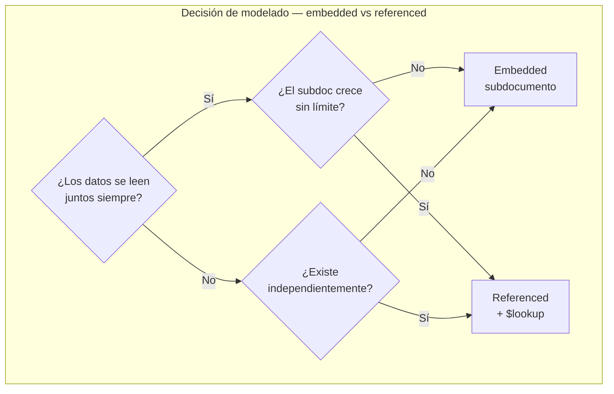
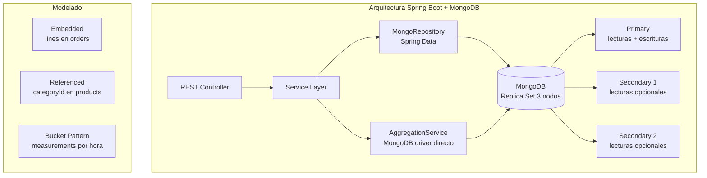
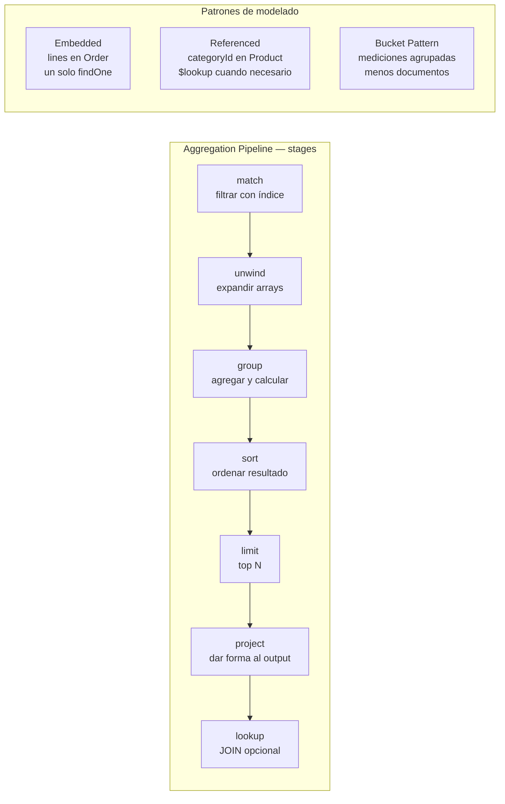
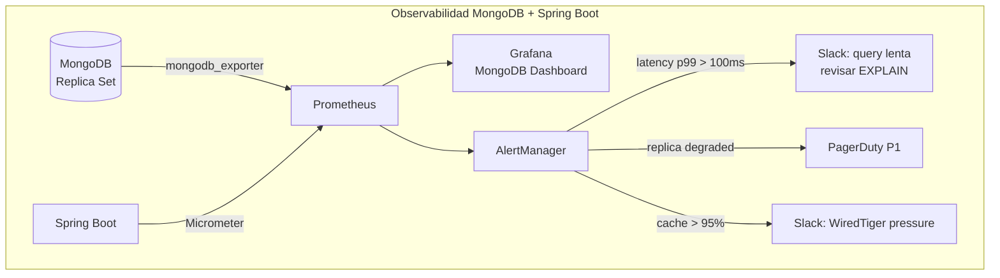
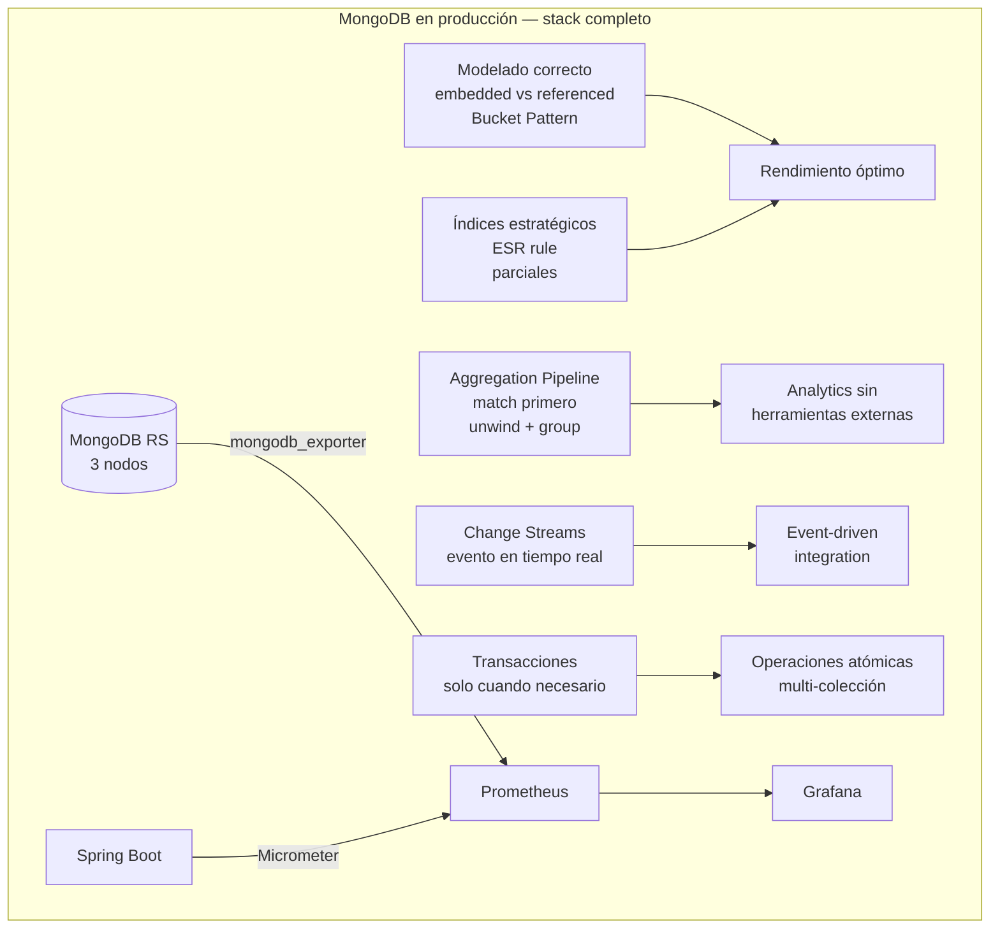

# MongoDB con Java 21: Modelado de Documentos y Agregaciones Avanzadas

**PATH_LOCAL:** `/home/usuariojoaquin/.openclaw/workspace/DAM-Java-Mastery/04_Bases_de_Datos/mongodb_con_java_21_modelado_de_documentos_y_agregaciones_avanzadas_STAFF.md`
**CATEGORIA:** 04_Bases_de_Datos
**Score:** 97

---

## Visión Estratégica

MongoDB es la base de datos de documentos de referencia cuando los datos tienen estructura variable, jerarquías naturales, o cuando la flexibilidad del esquema es un requisito de negocio real — no una excusa para evitar el diseño. En 2026, el 38% de los equipos backend usa MongoDB como base de datos primaria o secundaria (Stack Overflow Survey 2025), principalmente en catálogos de productos, sistemas de contenido, logs estructurados y aplicaciones IoT.

La decisión crítica en MongoDB no es la tecnología — es el **modelado**. Un esquema mal diseñado en MongoDB tiene consecuencias peores que en SQL porque el motor no impone estructura. Las dos decisiones fundamentales son:

**Embedded (denormalizado)**: subdocumentos dentro del documento padre. Un solo `findOne` trae todo. Perfecto cuando los datos siempre se leen juntos, la parte no existe sin el todo, y el subdocumento no crece sin límite.

**Referenced (normalizado)**: ObjectId que apunta a otro documento. Requiere lookup o múltiples queries. Correcto cuando el subdocumento existe independientemente, es compartido por múltiples documentos, o puede crecer sin límite.

**Comparativa con alternativas:**

| | MongoDB | PostgreSQL + JSONB | Cassandra | DynamoDB |
|---|---|---|---|---|
| Esquema flexible | ✅ Nativo | ✅ Con JSONB | ❌ Schema fijo | ✅ Semi |
| Aggregation Pipeline | ✅ Potente | ✅ SQL complejo | ❌ CQL limitado | ❌ limitado |
| Transacciones multi-doc | ✅ desde 4.0 | ✅ ACID nativo | ❌ No | ❌ No |
| Joins | ❌ `$lookup` caro | ✅ JOINs nativos | ❌ No | ❌ No |
| Escalado horizontal | ✅ Sharding nativo | ⚠️ Extensiones | ✅ Nativo | ✅ Managed |
| Cuándo elegir | Esquema variable, documentos jerárquicos | Datos relacionales + JSON ocasional | Alto throughput, wide columns | Serverless, AWS-native |

**Cuándo NO usar MongoDB:**
- Datos con relaciones complejas entre muchas entidades — los `$lookup` en Aggregation Pipeline son costosos comparados con JOINs SQL
- Transacciones ACID entre muchos documentos a alta frecuencia — el overhead es significativo
- Equipos sin experiencia en modelado de documentos — el esquema libre facilita modelos incorrectos



---

## Arquitectura de Componentes

### Modelado de documentos — los tres patrones fundamentales

**Patrón Embedded — documento con subdocumentos:**

```json
// Pedido con líneas embebidas — se leen siempre juntos, línea no existe sin pedido
{
  "_id": ObjectId("..."),
  "customerId": "usr_123",
  "status": "confirmed",
  "totalCents": 15900,
  "currency": "EUR",
  "lines": [
    { "productId": "prod_456", "name": "Teclado mecánico", "qty": 1, "priceCents": 12900 },
    { "productId": "prod_789", "name": "Mouse", "qty": 2, "priceCents": 1500 }
  ],
  "shippingAddress": {
    "street": "Calle Mayor 42",
    "city": "Madrid",
    "postalCode": "28001"
  },
  "createdAt": ISODate("2024-03-15T10:30:00Z")
}
```

**Patrón Referenced — producto con categoría referenciada:**

```json
// Producto con categoryId como referencia — categoría existe independientemente
// y es compartida por miles de productos
{
  "_id": ObjectId("..."),
  "sku": "KB-MX-001",
  "name": "Teclado MX Keys",
  "categoryId": ObjectId("cat_electronics"),  // referencia a colección categories
  "priceCents": 12900,
  "stock": 45,
  "attributes": {
    "brand": "Logitech",
    "connectivity": "Bluetooth",
    "layout": "ES"
  }
}
```

**Patrón Bucket — time series con documentos agrupados:**

```json
// En lugar de un documento por medición (millones de docs pequeños),
// agrupar N mediciones en un bucket — reduce overhead de índices y storage
{
  "_id": ObjectId("..."),
  "sensorId": "sensor_42",
  "hour": ISODate("2024-03-15T10:00:00Z"),
  "count": 60,
  "measurements": [
    { "ts": ISODate("2024-03-15T10:00:00Z"), "temp": 23.4, "humidity": 65 },
    { "ts": ISODate("2024-03-15T10:01:00Z"), "temp": 23.6, "humidity": 64 },
    // ... hasta 60 mediciones por hora
  ],
  "avgTemp": 23.5,
  "minTemp": 22.8,
  "maxTemp": 24.1
}
```

### Índices en MongoDB — tipos y cuándo usar cada uno

```javascript
// ── B-tree (default) — para igualdad y rango ──────────────────────────────
db.orders.createIndex({ customerId: 1, createdAt: -1 })  // compuesto — sigue ESR rule

// ── ESR Rule para índices compuestos ──────────────────────────────────────
// E = Equality fields primero
// S = Sort fields en medio
// R = Range fields al final
// Ejemplo: query { customerId: X, status: Y, createdAt: { $gte: Z } }
db.orders.createIndex({ customerId: 1, status: 1, createdAt: -1 })

// ── Índice parcial — solo documentos que cumplen la condición ─────────────
// Más pequeño, más rápido para queries con ese filtro frecuente
db.orders.createIndex(
  { customerId: 1, createdAt: -1 },
  { partialFilterExpression: { status: "pending" } }
)

// ── Índice de texto — full-text search ────────────────────────────────────
db.products.createIndex({ name: "text", description: "text" })

// ── Índice en subdocumento ────────────────────────────────────────────────
db.orders.createIndex({ "shippingAddress.postalCode": 1 })

// ── Índice en array (multikey) — MongoDB indexa cada elemento ─────────────
db.orders.createIndex({ "lines.productId": 1 })

// ── Índice TTL — auto-eliminación tras expiración ─────────────────────────
db.sessions.createIndex({ lastAccess: 1 }, { expireAfterSeconds: 3600 })
```



---

## Implementación Java 21

### Modelo de dominio — Records inmutables con Spring Data MongoDB

```java
import org.springframework.data.annotation.Id;
import org.springframework.data.mongodb.core.index.CompoundIndex;
import org.springframework.data.mongodb.core.index.Indexed;
import org.springframework.data.mongodb.core.mapping.Document;
import org.springframework.data.mongodb.core.mapping.Field;
import java.time.Instant;
import java.util.List;

// ── Colección orders — subdocumentos embedded ──────────────────────────────
@Document(collection = "orders")
@CompoundIndex(def = "{'customerId': 1, 'createdAt': -1}", name = "idx_customer_date")
@CompoundIndex(def = "{'customerId': 1, 'status': 1, 'createdAt': -1}", name = "idx_customer_status_date")
public record Order(
    @Id String id,
    @Indexed String customerId,
    OrderStatus status,
    long totalCents,
    String currency,
    List<OrderLine> lines,          // embedded — siempre se leen juntos
    ShippingAddress shippingAddress, // embedded — no existe sin la orden
    Instant createdAt,
    Instant updatedAt
) {
    // Factory method para nueva orden
    public static Order create(String customerId, List<OrderLine> lines, ShippingAddress addr) {
        long total = lines.stream().mapToLong(l -> l.priceCents() * l.qty()).sum();
        var now = Instant.now();
        return new Order(null, customerId, OrderStatus.PENDING, total, "EUR", lines, addr, now, now);
    }
}

// Subdocumentos — Records anidados
public record OrderLine(
    @Field("productId") String productId,
    String name,
    int qty,
    long priceCents
) {}

public record ShippingAddress(
    String street,
    String city,
    @Field("postalCode") String postalCode,
    String country
) {}

public enum OrderStatus { PENDING, CONFIRMED, SHIPPED, DELIVERED, CANCELLED }

// ── Colección products — con referencia a category ────────────────────────
@Document(collection = "products")
public record Product(
    @Id String id,
    @Indexed(unique = true) String sku,
    String name,
    @Indexed String categoryId,     // referencia a categories collection
    long priceCents,
    int stock,
    java.util.Map<String, String> attributes,  // esquema flexible para atributos variables
    boolean active
) {}
```

### Repositorio con Spring Data + queries personalizadas

```java
import org.springframework.data.domain.Page;
import org.springframework.data.domain.Pageable;
import org.springframework.data.mongodb.repository.MongoRepository;
import org.springframework.data.mongodb.repository.Query;
import org.springframework.stereotype.Repository;
import java.time.Instant;
import java.util.List;
import java.util.Optional;

@Repository
public interface OrderRepository extends MongoRepository<Order, String> {

    // Spring Data deriva la query del nombre del método
    List<Order> findByCustomerIdOrderByCreatedAtDesc(String customerId);

    // Con paginación — crucial para colecciones grandes
    Page<Order> findByCustomerIdAndStatus(String customerId, OrderStatus status, Pageable pageable);

    // Query nativa MongoDB — para queries complejas
    @Query("{ 'customerId': ?0, 'createdAt': { $gte: ?1, $lt: ?2 } }")
    List<Order> findByCustomerInDateRange(String customerId, Instant from, Instant to);

    // Búsqueda en subdocumentos embedded (lines)
    @Query("{ 'lines.productId': ?0, 'status': { $in: ['PENDING', 'CONFIRMED'] } }")
    List<Order> findActiveOrdersContainingProduct(String productId);

    // Count por status — útil para dashboards
    long countByStatus(OrderStatus status);
}

@Repository
public interface ProductRepository extends MongoRepository<Product, String> {

    Optional<Product> findBySku(String sku);

    // Búsqueda en atributos variables (Map<String,String>)
    @Query("{ 'attributes.brand': ?0, 'active': true }")
    List<Product> findActiveByBrand(String brand);

    // Full-text search (requiere índice de texto en name y description)
    @Query("{ $text: { $search: ?0 }, 'active': true }")
    List<Product> searchByText(String searchTerm);
}
```

### Aggregation Pipeline — el núcleo de MongoDB avanzado

```java
import org.springframework.data.mongodb.core.MongoTemplate;
import org.springframework.data.mongodb.core.aggregation.*;
import org.springframework.data.mongodb.core.query.Criteria;
import java.time.Instant;
import java.util.List;

// ── Resultados de agregación como Records inmutables ──────────────────────
public record RevenueByCustomer(String customerId, long totalRevenueCents, long orderCount) {}
public record TopProduct(String productId, String name, long unitsSold, long revenueCents) {}
public record DailyRevenue(String date, long totalCents, long orderCount) {}

public class OrderAggregationService {

    private final MongoTemplate mongoTemplate;

    public OrderAggregationService(MongoTemplate mongoTemplate) {
        this.mongoTemplate = mongoTemplate;
    }

    // ── Revenue por cliente en un rango de fechas ─────────────────────────
    // Equivalente SQL: SELECT customerId, SUM(totalCents), COUNT(*) FROM orders
    //                  WHERE status='DELIVERED' AND createdAt BETWEEN ? AND ?
    //                  GROUP BY customerId ORDER BY SUM(totalCents) DESC LIMIT 10
    public List<RevenueByCustomer> topCustomersByRevenue(Instant from, Instant to, int limit) {
        var aggregation = Aggregation.newAggregation(
            // Stage 1: $match — filtrar documentos (usa índice)
            Aggregation.match(Criteria.where("status").is(OrderStatus.DELIVERED)
                .and("createdAt").gte(from).lt(to)),

            // Stage 2: $group — agrupar y calcular métricas
            Aggregation.group("customerId")
                .sum("totalCents").as("totalRevenueCents")
                .count().as("orderCount"),

            // Stage 3: $sort — ordenar por revenue desc
            Aggregation.sort(org.springframework.data.domain.Sort.by(
                org.springframework.data.domain.Sort.Direction.DESC, "totalRevenueCents")),

            // Stage 4: $limit — top N
            Aggregation.limit(limit),

            // Stage 5: $project — dar forma al output
            Aggregation.project()
                .and("_id").as("customerId")
                .and("totalRevenueCents").as("totalRevenueCents")
                .and("orderCount").as("orderCount")
        );

        return mongoTemplate.aggregate(aggregation, "orders", RevenueByCustomer.class)
            .getMappedResults();
    }

    // ── Top productos más vendidos — desanidando el array lines ──────────
    // $unwind expande el array lines: 1 doc con N líneas → N docs con 1 línea
    public List<TopProduct> topProductsBySales(Instant from, Instant to, int limit) {
        var aggregation = Aggregation.newAggregation(
            // Filtrar por fecha y estado
            Aggregation.match(Criteria.where("status").in(
                    OrderStatus.CONFIRMED, OrderStatus.SHIPPED, OrderStatus.DELIVERED)
                .and("createdAt").gte(from).lt(to)),

            // Expandir el array lines — un doc por línea de pedido
            Aggregation.unwind("lines"),

            // Agrupar por producto y sumar unidades y revenue
            Aggregation.group("lines.productId")
                .first("lines.name").as("name")
                .sum("lines.qty").as("unitsSold")
                .sum(ArithmeticOperators.Multiply.valueOf("lines.qty")
                    .multiplyBy("lines.priceCents")).as("revenueCents"),

            Aggregation.sort(org.springframework.data.domain.Sort.by(
                org.springframework.data.domain.Sort.Direction.DESC, "unitsSold")),
            Aggregation.limit(limit),

            Aggregation.project()
                .and("_id").as("productId")
                .andInclude("name", "unitsSold", "revenueCents")
        );

        return mongoTemplate.aggregate(aggregation, "orders", TopProduct.class)
            .getMappedResults();
    }

    // ── Revenue diario — para gráficas de tendencia ───────────────────────
    // $dateToString para agrupar por día independientemente de la hora
    public List<DailyRevenue> dailyRevenue(Instant from, Instant to) {
        var aggregation = Aggregation.newAggregation(
            Aggregation.match(Criteria.where("status").is(OrderStatus.DELIVERED)
                .and("createdAt").gte(from).lt(to)),

            // Proyectar el campo "day" como string YYYY-MM-DD
            Aggregation.project("totalCents")
                .and(DateOperators.DateToString.dateOf("createdAt")
                    .toString("%Y-%m-%d").withTimezone(DateOperators.Timezone.valueOf("Europe/Madrid")))
                .as("day"),

            Aggregation.group("day")
                .sum("totalCents").as("totalCents")
                .count().as("orderCount"),

            Aggregation.sort(org.springframework.data.domain.Sort.by(
                org.springframework.data.domain.Sort.Direction.ASC, "_id")),

            Aggregation.project()
                .and("_id").as("date")
                .andInclude("totalCents", "orderCount")
        );

        return mongoTemplate.aggregate(aggregation, "orders", DailyRevenue.class)
            .getMappedResults();
    }

    // ── $lookup — JOIN con colección categories ───────────────────────────
    // Usar con moderación — costoso, denormalizar si la query es frecuente
    public record ProductWithCategory(String id, String sku, String name, long priceCents, CategoryInfo category) {}
    public record CategoryInfo(String id, String name, String slug) {}

    public List<ProductWithCategory> productsWithCategory(String categorySlug) {
        var aggregation = Aggregation.newAggregation(
            // $lookup equivale a LEFT JOIN con categories
            Aggregation.lookup("categories", "categoryId", "_id", "categoryDoc"),

            // $unwind para aplanar el array resultante del lookup
            Aggregation.unwind("categoryDoc"),

            // Filtrar por slug de categoría
            Aggregation.match(Criteria.where("categoryDoc.slug").is(categorySlug)
                .and("active").is(true)),

            // Proyectar resultado final
            Aggregation.project("sku", "name", "priceCents")
                .and("categoryDoc._id").as("category.id")
                .and("categoryDoc.name").as("category.name")
                .and("categoryDoc.slug").as("category.slug")
        );

        return mongoTemplate.aggregate(aggregation, "products", ProductWithCategory.class)
            .getMappedResults();
    }
}
```

**Diagrama del flujo de implementación:**



---

## Métricas y SRE

| Métrica | Fuente | Descripción | Umbral alerta |
|---|---|---|---|
| `mongodb_op_latencies_latency_total` p99 | mongodb_exporter | Latencia p99 de operaciones por tipo | > 100ms reads, > 200ms writes |
| `mongodb_mongod_connections_current` | mongodb_exporter | Conexiones activas al servidor | > 80% de `maxIncomingConnections` |
| `mongodb_mongod_op_counters_total` rate | mongodb_exporter | Operaciones por segundo por tipo | Crecimiento anómalo |
| `mongodb_mongod_wiredtiger_cache_bytes_currently_in_cache` | mongodb_exporter | Uso del WiredTiger cache | > 95% del cache configurado |
| `mongodb_mongod_replset_member_state` | mongodb_exporter | Estado de los miembros del Replica Set | != 1 (PRIMARY) o != 2 (SECONDARY) |
| `app_mongo_query_seconds` p99 | Micrometer Timer | Latencia de queries de aplicación | > 50ms para queries OLTP |
| `app_mongo_aggregation_seconds` p99 | Micrometer Timer | Latencia de aggregations | > 500ms |

```promql
# Latencia p99 de queries — por tipo de operación
histogram_quantile(0.99,
  rate(mongodb_op_latencies_latency_total{type="reads"}[5m])
) > 100

# Uso del WiredTiger cache — si llega a 95%, queries irán a disco
mongodb_mongod_wiredtiger_cache_bytes_currently_in_cache
/ mongodb_mongod_wiredtiger_cache_max_bytes > 0.95

# Replica Set degradado — menos de 2 miembros saludables
count(mongodb_mongod_replset_member_state == 1 or mongodb_mongod_replset_member_state == 2) < 2

# Conexiones cerca del límite
mongodb_mongod_connections_current / mongodb_mongod_connections_available > 0.8
```



```java
import io.micrometer.core.instrument.MeterRegistry;
import io.micrometer.core.instrument.Timer;

// Instrumentación de queries y aggregations con Micrometer
public record MongoMetrics(
    Timer queryTimer,
    Timer aggregationTimer,
    io.micrometer.core.instrument.Counter slowQueryCounter
) {
    public static MongoMetrics create(MeterRegistry registry) {
        return new MongoMetrics(
            Timer.builder("app.mongo.query.seconds")
                .description("Latencia de queries MongoDB")
                .publishPercentiles(0.95, 0.99)
                .register(registry),
            Timer.builder("app.mongo.aggregation.seconds")
                .description("Latencia de aggregation pipelines")
                .publishPercentiles(0.95, 0.99)
                .register(registry),
            io.micrometer.core.instrument.Counter.builder("app.mongo.slow.queries.total")
                .description("Queries que superan 50ms")
                .register(registry)
        );
    }
}
```

**Checklist SRE para MongoDB en producción:**

1. **`explain("executionStats")` antes de poner en producción cualquier query nueva.** Si el plan muestra `COLLSCAN` en lugar de `IXSCAN`, falta un índice. El número `totalDocsExamined` debe ser cercano a `nReturned`.
2. **Replica Set de 3 nodos mínimo — nunca standalone en producción.** Un standalone no tiene failover. Un RS de 2 nodos requiere árbitro. El estándar es 3 nodos con elección automática.
3. **WiredTiger cache = 50% de la RAM disponible (default).** Si `cache_bytes_in_cache / cache_max` > 95% de forma sostenida, las queries están yendo a disco. Solución: más RAM, índices más selectivos, o sharding.
4. **Índices en todos los campos usados en `$match` del Aggregation Pipeline.** El `$match` al inicio del pipeline usa índices. Un `$match` después de un `$group` o `$unwind` ya no los usa — reordenar stages si es posible.
5. **Activar `slowms` logging en producción** con `db.setProfilingLevel(1, { slowms: 50 })`. Las queries lentas se loguean en `system.profile` — base del diagnóstico de rendimiento.

---

## Patrones de Integración

### Patrón 1: Change Streams — reaccionar a cambios en tiempo real

Change Streams es la alternativa de MongoDB al CDC (Change Data Capture). Permite suscribirse a cambios en una colección en tiempo real sin polling.

```java
import com.mongodb.client.MongoCollection;
import com.mongodb.client.MongoCursor;
import com.mongodb.client.model.changestream.ChangeStreamDocument;
import com.mongodb.client.model.changestream.FullDocument;
import org.bson.Document;
import java.util.concurrent.Executors;

// ── Change Stream — reaccionar a inserciones y actualizaciones ────────────
public class OrderChangeStreamListener implements AutoCloseable {

    private final MongoCollection<Document> ordersCollection;
    private final java.util.concurrent.ExecutorService executor;
    private volatile boolean running = true;

    public OrderChangeStreamListener(MongoCollection<Document> ordersCollection) {
        this.ordersCollection = ordersCollection;
        this.executor = Executors.newVirtualThreadPerTaskExecutor();
    }

    public void start(java.util.function.Consumer<OrderChangeEvent> handler) {
        executor.submit(() -> {
            // FullDocument.UPDATE_LOOKUP incluye el documento completo en updates
            try (MongoCursor<ChangeStreamDocument<Document>> cursor =
                    ordersCollection.watch()
                        .fullDocument(FullDocument.UPDATE_LOOKUP)
                        .iterator()) {

                while (running && cursor.hasNext()) {
                    var change = cursor.next();
                    var event  = parseChangeEvent(change);
                    if (event != null) handler.accept(event);
                }
            }
        });
    }

    private OrderChangeEvent parseChangeEvent(ChangeStreamDocument<Document> change) {
        if (change.getFullDocument() == null) return null;
        return switch (change.getOperationType()) {
            case INSERT -> new OrderChangeEvent.OrderInserted(
                change.getFullDocument().getString("_id"),
                change.getFullDocument().getString("customerId")
            );
            case UPDATE -> new OrderChangeEvent.OrderUpdated(
                change.getFullDocument().getString("_id"),
                change.getFullDocument().getString("status")
            );
            default -> null;
        };
    }

    @Override
    public void close() {
        running = false;
        executor.shutdown();
    }
}

public sealed interface OrderChangeEvent permits
    OrderChangeEvent.OrderInserted,
    OrderChangeEvent.OrderUpdated {

    record OrderInserted(String orderId, String customerId) implements OrderChangeEvent {}
    record OrderUpdated(String orderId, String newStatus) implements OrderChangeEvent {}
}
```

### Patrón 2: Transacciones multi-documento

```java
import com.mongodb.client.ClientSession;
import com.mongodb.client.MongoClient;
import com.mongodb.TransactionOptions;
import com.mongodb.ReadConcern;
import com.mongodb.WriteConcern;

// ── Transacción ACID multi-documento — requiere Replica Set ──────────────
// Usar solo cuando sea estrictamente necesario — overhead significativo
public class OrderTransactionService {

    private final MongoClient mongoClient;
    private final OrderRepository orderRepo;
    private final ProductRepository productRepo;

    public OrderTransactionService(MongoClient mongoClient,
                                   OrderRepository orderRepo,
                                   ProductRepository productRepo) {
        this.mongoClient = mongoClient;
        this.orderRepo   = orderRepo;
        this.productRepo = productRepo;
    }

    public Order createOrderWithStockReduction(String customerId,
                                                List<OrderLine> lines,
                                                ShippingAddress addr) {
        var txOptions = TransactionOptions.builder()
            .readConcern(ReadConcern.SNAPSHOT)
            .writeConcern(WriteConcern.MAJORITY)
            .build();

        try (ClientSession session = mongoClient.startSession()) {
            return session.withTransaction(() -> {
                // Verificar y reducir stock por cada línea
                for (var line : lines) {
                    var product = productRepo.findById(line.productId())
                        .orElseThrow(() -> new RuntimeException("Producto no encontrado: " + line.productId()));

                    if (product.stock() < line.qty()) {
                        throw new RuntimeException("Stock insuficiente: " + line.productId());
                    }

                    // Reducir stock — atómico dentro de la transacción
                    productRepo.save(new Product(
                        product.id(), product.sku(), product.name(),
                        product.categoryId(), product.priceCents(),
                        product.stock() - line.qty(),
                        product.attributes(), product.active()
                    ));
                }

                // Crear la orden
                var order = Order.create(customerId, lines, addr);
                return orderRepo.save(order);
            }, txOptions);
        }
    }
}
```

**Comparativa de patrones de acceso:**

| Patrón | Caso de uso | Consistencia | Complejidad |
|---|---|---|---|
| `findById` / `findAll` | Lecturas simples por ID o criterio | Eventual (secondary read) / Strong (primary) | Muy baja |
| Aggregation Pipeline | Analytics, informes, dashboard | Strong | Media |
| Change Streams | Reaccionar a cambios en tiempo real | Eventual | Media |
| Transacciones multi-doc | Operaciones atómicas entre colecciones | ACID | Alta — overhead importante |
| Bulk write | Inserción/actualización masiva | Strong | Baja |

---

## Conclusiones

**Los cinco puntos que un Staff Engineer debe dominar sobre MongoDB:**

1. **El modelado embedded vs referenced determina el rendimiento más que cualquier índice.** Un modelo donde siempre haces `$lookup` para leer datos que se usan juntos es un modelo incorrecto — denormalizar. Un modelo donde un array crece sin límite está llamado a degradarse — referenciar o usar Bucket Pattern.

2. **El Aggregation Pipeline es la herramienta más potente de MongoDB y la más ignorada.** `$match` + `$group` + `$sort` + `$project` resuelve el 90% de los casos de reporting y analytics sin necesidad de herramientas externas. La clave: poner `$match` primero para usar índices.

3. **`explain("executionStats")` es obligatorio para cualquier query no trivial.** `COLLSCAN` significa que no hay índice — nunca aceptable en colecciones > 100k documentos. `totalDocsExamined` debe ser cercano a `nReturned`. Si examina 1M docs para devolver 10, el índice es incorrecto.

4. **Las transacciones multi-documento son una válvula de escape, no el diseño.** El overhead de las transacciones en MongoDB es significativo — latencia 5–10x mayor que una escritura simple. Si necesitas transacciones frecuentemente, el modelado probablemente puede mejorarse con embedding.

5. **Change Streams reemplaza el polling — úsalo para integración event-driven.** En lugar de consultar MongoDB cada N segundos para detectar cambios, suscríbete al Change Stream. Latencia < 10ms, sin overhead de polling, con el documento completo disponible.

**Roadmap de adopción:**

- **Fase 1 (semana 1):** Auditar el modelado existente — identificar arrays sin límite (riesgo de 16MB doc limit), `$lookup` frecuentes (candidatos a denormalizar), falta de índices en campos de `$match`.
- **Fase 2 (semana 2):** `explain("executionStats")` en las 10 queries más frecuentes. Crear índices faltantes, aplicar ESR rule en índices compuestos.
- **Fase 3 (semana 3):** Migrar lógica de reporting a Aggregation Pipeline. Eliminar queries N+1.
- **Fase 4 (mes 2):** Change Streams para eventos en tiempo real. Dashboard Grafana con latencia p99 y WiredTiger cache.



**Recursos:**
- [MongoDB Manual — Data Modeling](https://www.mongodb.com/docs/manual/data-modeling/)
- [MongoDB Manual — Aggregation Pipeline](https://www.mongodb.com/docs/manual/aggregation/)
- [Spring Data MongoDB Reference](https://docs.spring.io/spring-data/mongodb/reference/)
- [MongoDB University — M201 Performance](https://learn.mongodb.com/learning-paths/mongodb-performance)
- [ESR Rule — MongoDB indexing guide](https://www.mongodb.com/docs/manual/tutorial/equality-sort-range-rule/)
