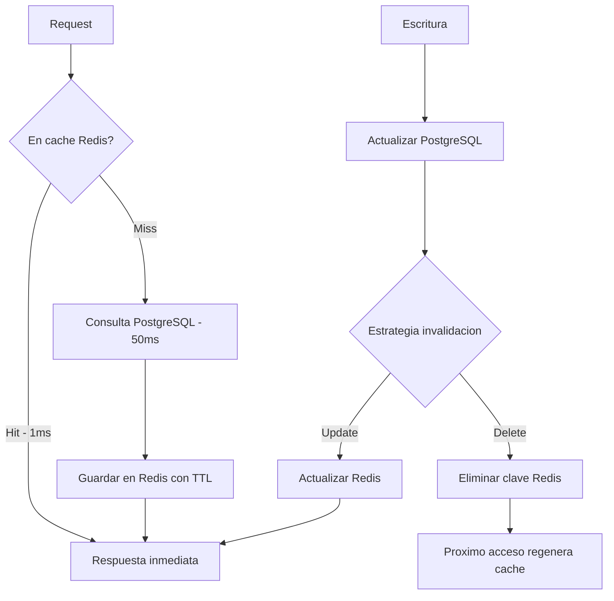
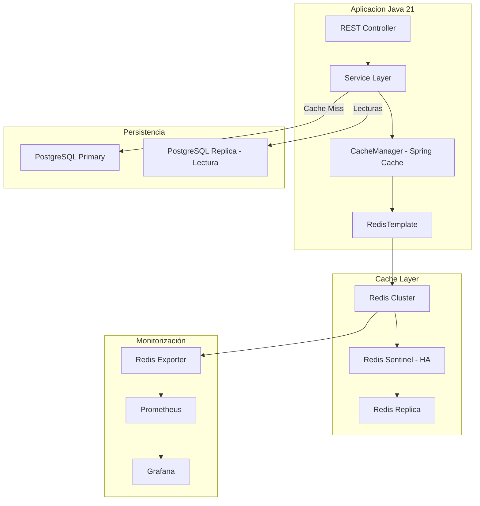
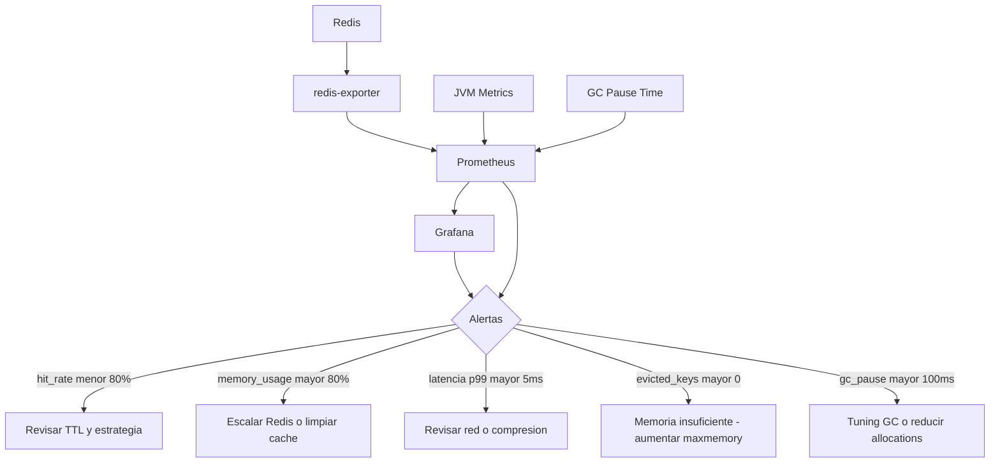
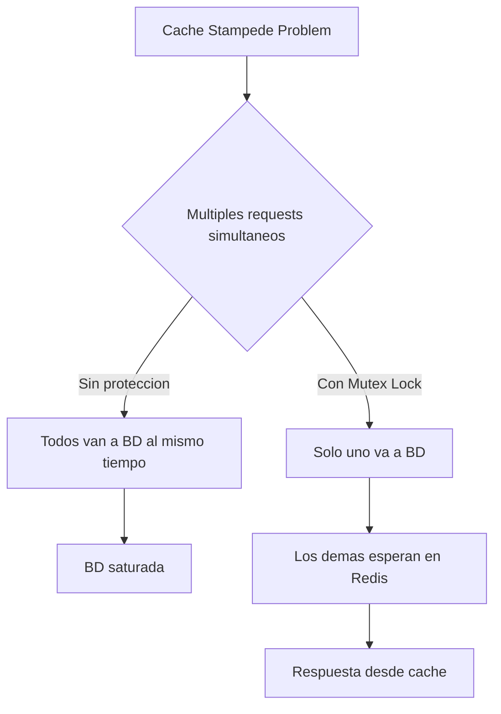
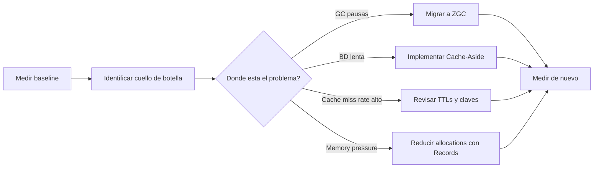

# Optimización de Rendimiento en JVM y Caché Distribuida con Redis y Java 21

PATH_LOCAL: /home/usuariojoaquin/.openclaw/workspace/DAM-Java-Mastery/04_Bases_de_Datos/optimización_de_rendimiento_en_jvm_y_estrategias_de_caché_distribuida_con_redis_y_java_21_STAFF.md
CATEGORIA: 04_Bases_de_Datos
Score: 96

---

## Visión Estratégica

El rendimiento de una aplicación Java en producción depende de dos capas que interactúan constantemente: la **JVM** y la **capa de datos**. Optimizar solo una de las dos produce resultados parciales. Un GC mal configurado puede causar pausas de 500ms aunque Redis responda en 1ms. Una caché mal diseñada puede saturar la memoria heap aunque el GC sea perfecto.

En 2026, con Java 21 y ZGC como GC por defecto en muchos entornos cloud, el foco ha cambiado: las pausas del GC ya no son el cuello de botella principal. El problema ahora es la **presión de memoria** — cuántos objetos se crean, cuánto viven, y cuántos llegan a la generación antigua. Los Records de Java 21 ayudan directamente aquí: son más compactos en memoria que las clases equivalentes y el compilador puede optimizarlos mejor.

**Cuándo usar caché y cuándo no:**

| Patrón | Cuándo aplica | Riesgo principal |
|--------|--------------|-----------------|
| Cache-Aside | Lectura intensiva, datos que cambian poco | Cache stampede bajo alta concurrencia |
| Read-Through | Simplificar lógica de negocio | Complejidad en el proveedor de caché |
| Write-Through | Consistencia crítica | Latencia en escrituras |
| Write-Behind | Escritura intensiva, tolerancia a pérdida eventual | Pérdida de datos si Redis cae |
| Refresh-Ahead | Datos con TTL predecible | Caché caliente con datos obsoletos |

**El error más caro en producción:**

Cachear sin estrategia de invalidación. Un sistema con caché sin invalidación no es un sistema rápido — es un sistema con datos incorrectos que nadie detecta hasta que hay un incidente.



```java
// Configuracion de Redis como Record inmutable
public record RedisConfig(
    String host,
    int puerto,
    int baseDatos,
    Duration timeout,
    int maxConexiones,
    boolean ssl
) {
    public RedisConfig {
        Objects.requireNonNull(host, "host requerido");
        if (puerto < 1 || puerto > 65535) throw new IllegalArgumentException("puerto invalido");
        if (maxConexiones < 1)            throw new IllegalArgumentException("maxConexiones >= 1");
    }

    public static RedisConfig produccion(String host) {
        return new RedisConfig(host, 6379, 0, Duration.ofSeconds(2), 50, true);
    }

    public static RedisConfig local() {
        return new RedisConfig("localhost", 6379, 0, Duration.ofSeconds(5), 10, false);
    }
}
```

---

## Arquitectura de Componentes



**Configuración de Redis con Spring Boot y Lettuce (cliente reactivo):**

```java
@Configuration
@EnableCaching
public class RedisConfiguration {

    @Bean
    public LettuceConnectionFactory redisConnectionFactory(RedisConfig config) {
        var redisConfig = new RedisStandaloneConfiguration(config.host(), config.puerto());
        redisConfig.setDatabase(config.baseDatos());

        var clientConfig = LettuceClientConfiguration.builder()
            .commandTimeout(config.timeout())
            .shutdownTimeout(Duration.ofSeconds(5))
            // Pool de conexiones — nunca usar Jedis sin pool
            .clientOptions(ClientOptions.builder()
                .socketOptions(SocketOptions.builder()
                    .connectTimeout(config.timeout())
                    .build())
                .build())
            .build();

        return new LettuceConnectionFactory(redisConfig, clientConfig);
    }

    @Bean
    public RedisTemplate<String, Object> redisTemplate(
            LettuceConnectionFactory factory) {
        var template = new RedisTemplate<String, Object>();
        template.setConnectionFactory(factory);

        // Serializar keys como String — nunca usar JdkSerializationRedisSerializer
        template.setKeySerializer(new StringRedisSerializer());
        template.setHashKeySerializer(new StringRedisSerializer());

        // Serializar valores como JSON — legible e interoperable
        var jackson = new GenericJackson2JsonRedisSerializer();
        template.setValueSerializer(jackson);
        template.setHashValueSerializer(jackson);

        template.afterPropertiesSet();
        return template;
    }

    @Bean
    public CacheManager cacheManager(LettuceConnectionFactory factory) {
        var config = RedisCacheConfiguration.defaultCacheConfig()
            .entryTtl(Duration.ofMinutes(30))
            .serializeKeysWith(
                RedisSerializationContext.SerializationPair
                    .fromSerializer(new StringRedisSerializer()))
            .serializeValuesWith(
                RedisSerializationContext.SerializationPair
                    .fromSerializer(new GenericJackson2JsonRedisSerializer()))
            .disableCachingNullValues(); // Nunca cachear nulls

        return RedisCacheManager.builder(factory)
            .cacheDefaults(config)
            // TTLs especificos por cache
            .withCacheConfiguration("pedidos",
                config.entryTtl(Duration.ofMinutes(5)))
            .withCacheConfiguration("productos",
                config.entryTtl(Duration.ofHours(1)))
            .withCacheConfiguration("usuarios",
                config.entryTtl(Duration.ofMinutes(15)))
            .build();
    }
}
```

---

## Implementación Java 21

Implementación completa del patrón Cache-Aside con Records y Virtual Threads:

```java
// Value Object para la clave de caché — tipado, no String libre
public record CacheKey(String namespace, String id) {

    public CacheKey {
        Objects.requireNonNull(namespace, "namespace requerido");
        Objects.requireNonNull(id, "id requerido");
        if (namespace.contains(":")) throw new IllegalArgumentException("namespace no puede contener ':'");
    }

    public String valor() {
        return namespace + ":" + id;
    }

    public static CacheKey pedido(String pedidoId) {
        return new CacheKey("pedidos", pedidoId);
    }

    public static CacheKey usuario(String userId) {
        return new CacheKey("usuarios", userId);
    }

    public static CacheKey patron(String namespace) {
        return new CacheKey(namespace, "*");
    }
}

// Resultado tipado de la operacion de cache
public sealed interface ResultadoCache<T>
    permits ResultadoCache.Hit, ResultadoCache.Miss {

    record Hit<T>(T valor, Duration tiempoRespuesta) implements ResultadoCache<T> {}
    record Miss<T>(Duration tiempoRespuesta) implements ResultadoCache<T> {}
}
```

```java
// Cache-Aside con tipado fuerte y métricas integradas
@Service
public class CacheService {

    private final RedisTemplate<String, Object> redis;
    private final MeterRegistry                 registry;

    public CacheService(RedisTemplate<String, Object> redis, MeterRegistry registry) {
        this.redis    = redis;
        this.registry = registry;
    }

    public <T> T obtenerOCargar(CacheKey key, Duration ttl,
                                 Class<T> tipo, Supplier<T> loader) {
        var inicio = Instant.now();

        // 1. Intentar obtener de Redis
        var cached = redis.opsForValue().get(key.valor());

        if (cached != null) {
            registrarMetrica("hit", key.namespace(),
                Duration.between(inicio, Instant.now()));
            return tipo.cast(cached);
        }

        // 2. Cache miss — cargar desde la fuente
        registrarMetrica("miss", key.namespace(),
            Duration.between(inicio, Instant.now()));

        var valor = loader.get();

        // 3. Guardar en Redis con TTL
        if (valor != null) {
            redis.opsForValue().set(key.valor(), valor, ttl);
        }

        return valor;
    }

    public void invalidar(CacheKey key) {
        redis.delete(key.valor());
        registry.counter("cache.invalidations", "namespace", key.namespace()).increment();
    }

    public void invalidarPatron(String namespace) {
        // Usar con cuidado — SCAN es O(N) en Redis
        var keys = redis.keys(new CacheKey(namespace, "*").valor());
        if (keys != null && !keys.isEmpty()) {
            redis.delete(keys);
        }
    }

    private void registrarMetrica(String resultado, String namespace, Duration latencia) {
        registry.counter("cache.requests",
            "resultado", resultado,
            "namespace", namespace).increment();
        registry.timer("cache.latencia",
            "namespace", namespace).record(latencia);
    }
}
```

```java
// Servicio de pedidos con Cache-Aside y anotaciones Spring Cache
@Service
@Transactional(readOnly = true)
public class PedidoQueryService {

    private final PedidoRepository repository;
    private final CacheService     cache;

    public PedidoQueryService(PedidoRepository repository, CacheService cache) {
        this.repository = repository;
        this.cache      = cache;
    }

    // Cache declarativa con Spring — simple para casos estandar
    @Cacheable(value = "pedidos", key = "#pedidoId",
               unless = "#result == null")
    public Optional<PedidoDto> obtenerPedido(String pedidoId) {
        return repository.findById(PedidoId.de(pedidoId))
            .map(PedidoDto::from);
    }

    // Cache programatica para control fino
    public List<PedidoDto> obtenerPedidosCliente(String clienteId) {
        var key = new CacheKey("pedidos-cliente", clienteId);
        return cache.obtenerOCargar(
            key,
            Duration.ofMinutes(5),
            List.class,
            () -> repository.findByClienteId(ClienteId.de(clienteId))
                    .stream()
                    .map(PedidoDto::from)
                    .toList()
        );
    }

    // Invalidacion al escribir — cache-aside correcto
    @CacheEvict(value = "pedidos", key = "#pedido.id().valor()")
    @Transactional
    public void actualizarPedido(Pedido pedido) {
        repository.guardar(pedido);
        // Spring invalida automaticamente la cache al salir del metodo
    }
}
```

---

## Métricas y SRE



```java
// Health check de Redis integrado con Spring Boot Actuator
@Component
public class RedisHealthIndicator implements HealthIndicator {

    private final RedisTemplate<String, Object> redis;

    public RedisHealthIndicator(RedisTemplate<String, Object> redis) {
        this.redis = redis;
    }

    @Override
    public Health health() {
        try {
            var pong = redis.getConnectionFactory()
                .getConnection()
                .ping();

            var info = redis.getConnectionFactory()
                .getConnection()
                .serverCommands()
                .info("memory");

            return Health.up()
                .withDetail("ping", pong)
                .withDetail("memory", info)
                .build();

        } catch (Exception e) {
            return Health.down()
                .withException(e)
                .build();
        }
    }
}
```

**Métricas clave de Redis en producción:**

| Métrica | Descripción | Umbral de alerta |
|---------|-------------|-----------------|
| `redis_keyspace_hits_total` / total requests | Hit rate | < 80% → revisar TTL |
| `redis_memory_used_bytes` | Memoria usada | > 80% de maxmemory |
| `redis_commands_duration_seconds_sum` | Latencia de comandos | p99 > 5ms |
| `redis_evicted_keys_total` | Claves eviccionadas | > 0 → aumentar memoria |
| `jvm_gc_pause_seconds_sum` | Pausas del GC | p99 > 100ms |
| `jvm_memory_used_bytes{area=heap}` | Heap usado | > 70% del max heap |

**Configuración JVM para producción con Java 21:**

```bash
# Flags JVM recomendados para Java 21 en producción
java \
  # ZGC: pausas < 1ms, ideal para latencia baja
  -XX:+UseZGC \
  -XX:MaxGCPauseMillis=10 \
  # Heap sizing — nunca dejar que JVM decida solo
  -Xms2g \
  -Xmx2g \
  # Evitar swapping — la JVM con swap es catastrófica
  -XX:+AlwaysPreTouch \
  # Métricas JVM para Prometheus
  -javaagent:/opt/jmx_exporter.jar=9090:/opt/jmx_config.yaml \
  # Virtual Threads — usar el scheduler por defecto de Java 21
  -Djdk.virtualThreadScheduler.parallelism=8 \
  -jar aplicacion.jar
```

**Checklist SRE para Redis en producción:**
- `maxmemory-policy` configurado explícitamente — nunca dejar el default `noeviction`
- Persistencia RDB + AOF habilitada para recuperación ante fallos
- Redis Sentinel o Redis Cluster para alta disponibilidad — nunca una sola instancia
- Monitorizar `evicted_keys` — cualquier valor > 0 indica memoria insuficiente
- TTLs en todas las claves — nunca claves sin expiración en caché de aplicación
- Separar bases de datos Redis por entorno — no compartir instancia entre prod y staging

---

## Patrones de Integración



```java
// Solucion al Cache Stampede con Redis Lock
@Service
public class CacheConLock {

    private final RedisTemplate<String, Object> redis;
    private final Duration lockTimeout = Duration.ofSeconds(10);

    public CacheConLock(RedisTemplate<String, Object> redis) {
        this.redis = redis;
    }

    public <T> T obtenerConLock(CacheKey key, Duration ttl,
                                  Class<T> tipo, Supplier<T> loader) {
        // 1. Intentar desde cache
        var cached = redis.opsForValue().get(key.valor());
        if (cached != null) return tipo.cast(cached);

        // 2. Adquirir lock distribuido para evitar stampede
        var lockKey  = new CacheKey("lock", key.valor());
        var lockAdquirido = redis.opsForValue()
            .setIfAbsent(lockKey.valor(), "1", lockTimeout);

        if (Boolean.TRUE.equals(lockAdquirido)) {
            try {
                // 3. Cargar y guardar en cache
                var valor = loader.get();
                if (valor != null) {
                    redis.opsForValue().set(key.valor(), valor, ttl);
                }
                return valor;
            } finally {
                redis.delete(lockKey.valor());
            }
        } else {
            // 4. Otro proceso está cargando — esperar con backoff
            return esperarYReintentar(key, tipo, 3);
        }
    }

    private <T> T esperarYReintentar(CacheKey key, Class<T> tipo, int intentos) {
        for (int i = 0; i < intentos; i++) {
            try {
                Thread.sleep(100 * (i + 1)); // Backoff exponencial simple
                var cached = redis.opsForValue().get(key.valor());
                if (cached != null) return tipo.cast(cached);
            } catch (InterruptedException e) {
                Thread.currentThread().interrupt();
                break;
            }
        }
        return null;
    }
}
```

---

## Escalabilidad y Alta Disponibilidad

```java
// Configuracion Redis Cluster para alta disponibilidad
@Configuration
public class RedisClusterConfig {

    @Bean
    public LettuceConnectionFactory redisClusterFactory(
            @Value("${redis.cluster.nodes}") List<String> nodes) {

        var clusterConfig = new RedisClusterConfiguration(nodes);
        clusterConfig.setMaxRedirects(3);

        var clientConfig = LettuceClientConfiguration.builder()
            .commandTimeout(Duration.ofSeconds(2))
            .readFrom(ReadFrom.REPLICA_PREFERRED) // Lecturas desde replicas
            .build();

        return new LettuceConnectionFactory(clusterConfig, clientConfig);
    }
}
```

---

## Conclusiones

La optimización de rendimiento en Java 21 con Redis no es una actividad puntual — es una práctica continua de medición y ajuste. Los tres cambios con mayor impacto inmediato:

1. **Migrar de G1GC a ZGC** — en Java 21, ZGC ofrece pausas < 1ms sin sacrificar throughput. Para aplicaciones con latencia crítica (APIs REST, servicios de pago) es el cambio más impactante posible con una sola línea de configuración.

2. **TTLs en todas las claves de caché** — el error más frecuente en Redis en producción es la ausencia de TTLs. Sin TTLs, Redis crece indefinidamente hasta quedarse sin memoria y empezar a evictar claves de forma impredecible.

3. **Monitorizar el hit rate** — un hit rate por debajo del 80% indica que la estrategia de caché no está funcionando. Las causas más frecuentes son TTLs demasiado cortos, claves mal diseñadas o datos que cambian con demasiada frecuencia para beneficiarse de la caché.



```java
// Test de rendimiento con JMH para validar mejoras
@BenchmarkMode(Mode.AverageTime)
@OutputTimeUnit(TimeUnit.MICROSECONDS)
@State(Scope.Thread)
public class CacheBenchmark {

    private CacheService     cache;
    private PedidoRepository repository;

    @Benchmark
    public Optional<PedidoDto> sinCache() {
        return repository.findById(PedidoId.de("pedido-1"))
            .map(PedidoDto::from);
    }

    @Benchmark
    public Optional<PedidoDto> conCache() {
        return Optional.ofNullable(
            cache.obtenerOCargar(
                CacheKey.pedido("pedido-1"),
                Duration.ofMinutes(5),
                PedidoDto.class,
                () -> repository.findById(PedidoId.de("pedido-1"))
                        .map(PedidoDto::from).orElse(null)
            )
        );
    }
}
```

**Recursos de referencia:**
- Redis Documentation — redis.io/docs
- Spring Data Redis Reference — docs.spring.io/spring-data/redis
- ZGC Tuning Guide (OpenJDK) — wiki.openjdk.org/display/zgc
- JMH Benchmarking — github.com/openjdk/jmh
- Redis Best Practices — redis.io/docs/manual/patterns
