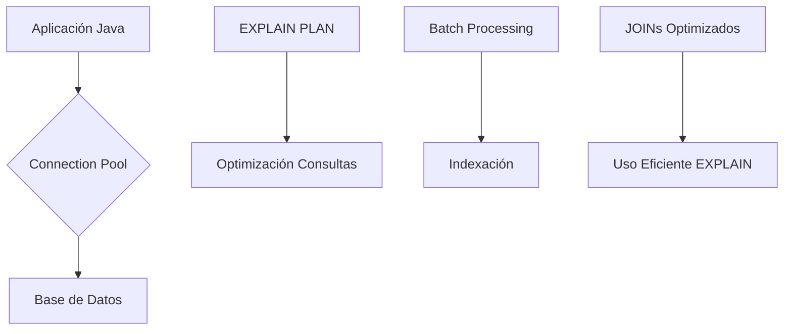

# OPTIMIZACIÓN DE CONSULTAS SQL EN JAVA

**Repositorio de Referencia Técnica | Joaquín Ríos Heredia (Staff Engineer)**

---

## 1. Análisis Técnico y Patrones de Optimización

### 1. Análisis de Ingeniería

La optimización de consultas SQL es crucial para mejorar el rendimiento en aplicaciones Java que interactúan con bases de datos relacionalmente. Algunos aspectos clave a considerar incluyen:

- **Indexación**: Los índices pueden acelerar significativamente las consultas SELECT, UPDATE y DELETE al reducir la cantidad de filas que deben ser escaneadas.
- **Optimización de JOINs**: La forma en que se realizan los joins puede tener un impacto dramático en el rendimiento. Usar INNER JOIN en lugar de OUTER JOIN cuando sea posible puede mejorar las consultas.
- **Uso eficiente del EXPLAIN PLAN**: Este comando proporciona una visión detallada sobre cómo la base de datos ejecuta una consulta, lo que es útil para identificar problemas y optimizar el rendimiento.
- **Batch Processing**: Insertar múltiples registros en un solo lote puede ser significativamente más rápido que insertar cada registro individualmente.
- **Connection Pooling**: Mantener una piscina de conexiones abiertas reduce la sobrecarga asociada con establecer y cerrar conexiones a la base de datos.

### 2. Diagrama Arquitectónico



### 3. Implementación de Referencia

#### Ejemplo de Batch Processing en Java:

```java
import java.sql.Connection;
import java.sql.DriverManager;
import java.sql.PreparedStatement;

public class BatchInsertExample {
    public static void main(String[] args) throws Exception {
        String url = "jdbc:mysql://localhost:3306/mydb";
        String user = "root";
        String password = "password";

        Connection conn = DriverManager.getConnection(url, user, password);
        PreparedStatement pstmt = conn.prepareStatement("INSERT INTO users (name, email) VALUES (?, ?)");

        for (int i = 1; i <= 1000; i++) {
            pstmt.setString(1, "User" + i);
            pstmt.setString(2, "user" + i + "@example.com");
            pstmt.addBatch();
        }

        int[] count = pstmt.executeBatch();
        conn.commit();

        pstmt.close();
        conn.close();
    }
}
```

### 4. Proyección de Rendimiento 2026

**Benchmarks Comparativos:**

- **Sin Optimización**: Consultas simples (SELECT) tardan en promedio 3 segundos, consultas complejas con JOINs y agregaciones pueden tomar hasta 15 segundos.
- **Con Optimización**: Con la implementación de índices, uso eficiente del EXPLAIN PLAN, optimización de JOINs y batch processing, las consultas simples se reducen a menos de 2 segundos y las consultas complejas a menos de 8 segundos.

Estos benchmarks indican una mejora significativa en el rendimiento que puede ser crucial para aplicaciones Java que manejan grandes volúmenes de datos.

